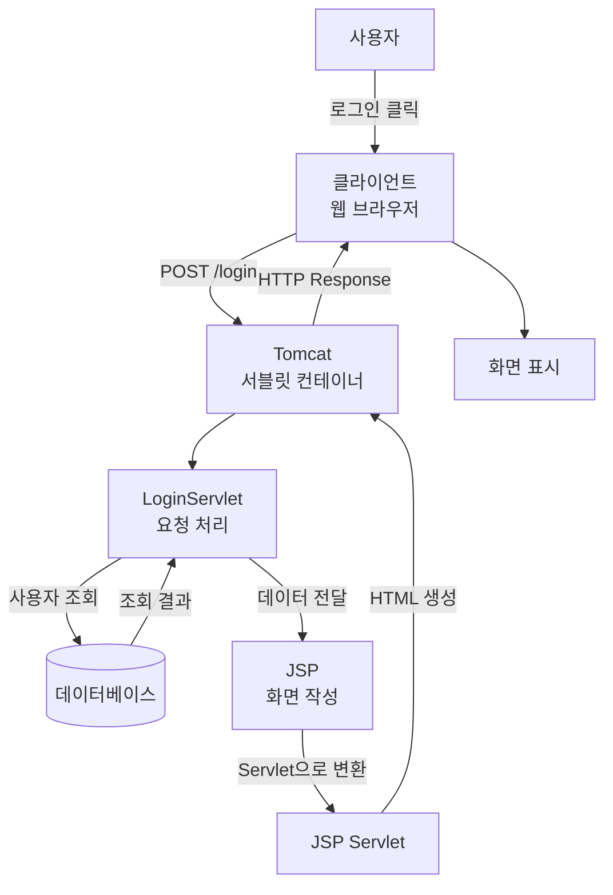
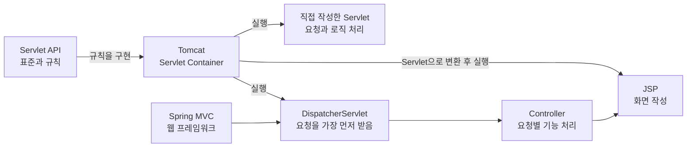

# 웹 프로그램 동작 과정

웹 프로그램은 클라이언트가 서버에 **요청(Request)**을 보내고, 서버가 처리 결과를 **응답(Response)**하는 방식으로 동작한다.

## 전체 흐름

```text
사용자
  ↓
클라이언트(브라우저)
  ↓ HTTP 리퀘스트(Request)
서버
  ↓
서블릿(Servlet)
  ↔ 데이터베이스
  ↓ HTTP 리스폰스(Response)
클라이언트 화면 표시
```

## 클라이언트의 역할

클라이언트는 사용자가 직접 이용하는 브라우저나 앱이다.

- 사용자의 입력을 받는다.
- 서버에 HTTP 요청을 보낸다.
- 서버의 응답을 화면에 표시한다.

## 서버의 역할

서버는 클라이언트의 요청을 받아 실제 작업을 처리한다.

- 요청과 입력값을 검증한다.
- 로그인과 사용자 권한을 확인한다.
- 서비스에 필요한 기능을 실행한다.
- 데이터베이스를 조회하거나 수정한다.
- 처리 결과를 클라이언트에 반환한다.
- 중요한 데이터와 시스템을 보호한다.

## 서블릿(Servlet)이란?

서블릿은 **클라이언트의 HTTP 요청을 받아 처리하고 응답을 만드는 Java 클래스**이다.

클라이언트가 요청을 보내면 톰캣과 같은 서블릿 컨테이너가 요청에 맞는 서블릿을 찾아 실행한다.

```text
클라이언트 요청
  ↓
서블릿 컨테이너(Tomcat)
  ↓
서블릿
  ↓
요청 처리 및 데이터베이스 조회
  ↓
HTML 또는 JSON 응답
  ↓
클라이언트
```

서블릿에서는 요청 방식에 따라 실행되는 메서드가 달라진다.

- `doGet()` : 화면이나 데이터를 조회할 때 사용
- `doPost()` : 로그인, 회원가입, 데이터 등록 등에 사용
- `HttpServletRequest` : 클라이언트가 보낸 요청 정보를 저장
- `HttpServletResponse` : 클라이언트에게 보낼 응답 정보를 저장
- `HttpSession` : 로그인 상태와 같은 사용자 정보를 유지

## 로그인 요청 처리 과정

사용자가 로그인 버튼을 누르면 다음 과정이 진행된다.

```text
1. 사용자가 아이디와 비밀번호 입력
2. 클라이언트가 POST /login 요청
3. 서블릿 컨테이너가 LoginServlet 실행
4. LoginServlet이 입력값 확인
5. 데이터베이스에서 사용자 정보 조회
6. 로그인 성공 시 세션 생성
7. 메인 화면 또는 결과 반환
```

간단한 로그인 서블릿은 다음과 같이 작성할 수 있다.

```java
@WebServlet("/login")
public class LoginServlet extends HttpServlet {

    @Override
    protected void doPost(
            HttpServletRequest request,
            HttpServletResponse response
    ) throws IOException {

        String username = request.getParameter("username");
        String password = request.getParameter("password");

        // 실제로는 데이터베이스에서 사용자 정보를 확인한다.
        boolean loginSuccess =
                username.equals("admin") &&
                password.equals("1234");

        if (loginSuccess) {
            HttpSession session = request.getSession();
            session.setAttribute("username", username);

            response.sendRedirect("/main");
        } else {
            response.sendRedirect("/login?error=true");
        }
    }
}
```

## 요청과 응답 예시

사용자가 로그인을 시도하면 클라이언트가 정보를 서버로 보낸다.

```http
POST /login
Content-Type: application/x-www-form-urlencoded

username=admin&password=1234
```

서버는 사용자 정보를 확인한 뒤 처리 결과를 반환한다.

```json
{
  "success": true,
  "message": "로그인 성공"
}
```

## 주요 HTTP 상태 코드

| 코드 | 의미 |
|---|---|
| `200` | 요청 성공 |
| `400` | 잘못된 요청 |
| `401` | 인증 실패 |
| `403` | 권한 없음 |
| `404` | 요청한 데이터를 찾을 수 없음 |
| `500` | 서버 내부 오류 |

## 핵심 정리

> 클라이언트는 서버에 HTTP 요청을 보내고, 서버의 서블릿은 요청을 처리한 뒤 HTML이나 JSON 형태로 결과를 응답한다.

> Spring MVC에서는 `DispatcherServlet`이 모든 요청을 먼저 받은 후 알맞은 Controller로 전달한다.

## Servlet과 JSP 동작 구조



## 각 기술의 역할

```text
Servlet API : Java 웹 프로그램의 표준 규칙
Tomcat      : Servlet과 JSP를 실행하는 컨테이너
Servlet     : 요청과 비즈니스 로직 처리
JSP         : HTML 화면 작성
Spring MVC  : Servlet 사용을 편리하게 해주는 프레임워크
```

> JSP는 작성할 때는 HTML 형태의 파일이지만, 실행할 때 Tomcat에 의해 Servlet으로 변환된다.

## Servlet, JSP, Tomcat, Spring MVC 관계



Servlet API
    └─ Java 웹 기술의 표준 규칙

Tomcat
    ├─ 직접 작성한 Servlet 실행
    ├─ JSP를 Servlet으로 변환하여 실행
    └─ Spring의 DispatcherServlet 실행

Spring MVC
    └─ DispatcherServlet을 통해 요청을 Controller로 전달
