# Java Web 개발 핵심 개념 정리

## 1. Build, Library, Framework

### Build

소스 코드를 컴파일하고 필요한 파일을 묶어 실행하거나 배포할 수 있는 결과물을 만드는 과정

```text
.java → .class
.java 파일들 → .jar 또는 .war
```

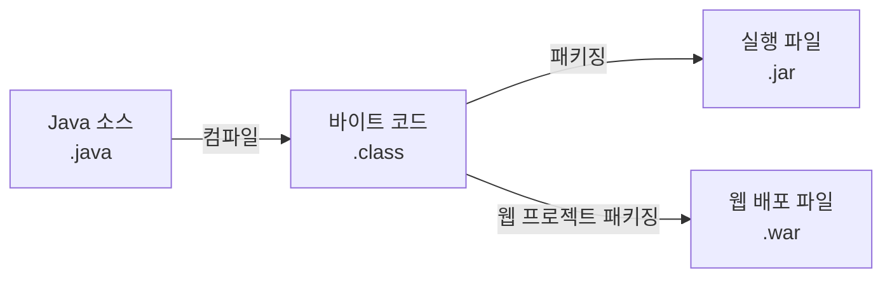

### Library

프로그램에서 필요한 기능을 가져다 사용하는 코드 모음

예:

- Gson
- Lombok

### Framework

프로그램의 전체 구조와 실행 흐름을 제공

예:

- Spring
- Spring Boot

### Build Tool

컴파일, 테스트, 패키징 등 빌드 과정과 라이브러리 의존성을 관리하는 도구

예:

- Gradle
- Maven

### 개념 비교

| 구분 | 역할 | 예 |
|---|---|---|
| Build | 코드 컴파일 및 결과물 생성 | `.class`, `.jar`, `.war` |
| Library | 필요한 기능을 가져다 사용 | Gson, Lombok |
| Framework | 프로그램 구조와 실행 흐름 제공 | Spring, Spring Boot |
| Build Tool | 빌드 과정과 라이브러리 관리 | Gradle, Maven |

---

## 2. Java Package

Package는 관련된 클래스와 인터페이스를 묶어 관리하는 폴더 같은 개념

```java
package controller;

public class LoginServlet {
}
```

```text
controller 패키지
└── LoginServlet 클래스
```

### Java 기본 패키지 예

```java
java.lang   // String, System, Math
java.io     // 파일 입출력
java.util   // List, Map, Scanner
java.sql    // 데이터베이스 연결
```

`INSERT`, `SELECT`, `UPDATE`, `DELETE`는 패키지가 아니라 데이터베이스에 전달하는 SQL 명령어

```text
java.sql 패키지
└── Connection, Statement, ResultSet 등의 클래스
       ↓ 사용
   SQL 명령 실행
       ↓
   SELECT, INSERT, UPDATE, DELETE
```

---

## 3. MVC 모델

프로그램을 Model, View, Controller로 나누는 설계 방식

### M — Model

데이터 처리와 비즈니스 로직 담당

```text
DTO/VO  : 데이터를 담는 객체
DAO     : 데이터베이스 접근
Service : 비즈니스 로직 처리
```

### V — View

사용자에게 보여줄 화면 담당

위치:

```text
src/main/webapp
```

관련 파일:

- JSP
- HTML
- CSS
- JavaScript

### C — Controller

클라이언트 요청을 받고 Model과 View를 연결

주요 역할:

1. 클라이언트 요청 받기
2. 요청 데이터 확인
3. Service에 데이터 처리 요청
4. 처리 결과 확인
5. 결과에 맞는 View 선택
6. 응답 전달

Controller가 데이터베이스에 직접 접근하기보다는 Service와 DAO를 통해 접근

### MVC 프로젝트 구조

```text
src/main/
├── java/
│   ├── controller/              ← C: Servlet
│   └── model/                   ← M: 데이터 처리
│       ├── dto/                 ← 데이터 저장 객체
│       ├── dao/                 ← 데이터베이스 접근
│       └── service/             ← 비즈니스 로직
│
└── webapp/                      ← V: 화면
    ├── index.html
    ├── css/
    ├── js/
    └── WEB-INF/
        └── views/
            ├── login.jsp
            └── memberList.jsp
```

### MVC 처리 흐름

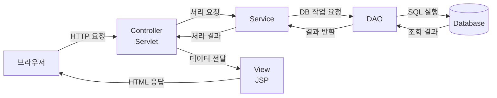

```text
브라우저
→ Controller
→ Service
→ DAO
→ Database
→ DAO
→ Service
→ Controller
→ View
→ 브라우저
```

---

## 4. HTTP 프로토콜과 HTTP 메서드

### HTTP

브라우저와 서버가 데이터를 주고받기 위한 통신 규칙

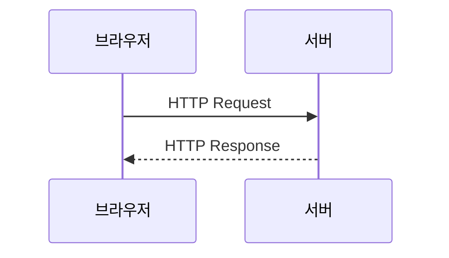

### HTTP 요청 구성

```text
HTTP 요청
├── Method  : GET, POST, PUT, DELETE
├── URL     : /members
├── Header  : 요청 부가 정보
└── Body    : 서버로 전달할 데이터
```

### HTTP 응답 구성

```text
HTTP 응답
├── Status Code : 200, 404, 500
├── Header      : 응답 부가 정보
└── Body        : HTML, JSON 등의 결과
```

### HTTP 메서드

| 메서드 | 용도 | 예 |
|---|---|---|
| `GET` | 데이터 조회 | 회원 목록 조회 |
| `POST` | 데이터 생성 또는 전송 | 회원가입 |
| `PUT` | 데이터 전체 수정 | 회원 정보 전체 수정 |
| `PATCH` | 데이터 일부 수정 | 비밀번호만 수정 |
| `DELETE` | 데이터 삭제 | 회원 탈퇴 |

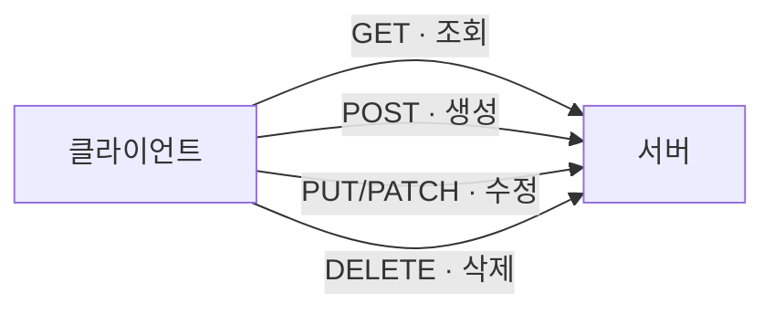

HTML의 `<form>`은 기본적으로 `GET`과 `POST`를 사용한다.  
`PUT`, `PATCH`, `DELETE`는 JavaScript의 `fetch()` 또는 Framework 기능을 사용해서 전송한다.

---

## 5. Servlet Controller와 Package

Controller 패키지 이름은 직접 정할 수 있다.

```java
package controller;
```

또는 다음과 같이 사용할 수 있다.

```java
package com.example.controller;
```

하지만 Servlet 클래스를 만들려면 `HttpServlet`을 상속해야 한다.

Tomcat 10.1에서는 `jakarta.servlet` 패키지를 사용한다.

```java
package controller;

import java.io.IOException;

import jakarta.servlet.ServletException;
import jakarta.servlet.annotation.WebServlet;
import jakarta.servlet.http.HttpServlet;
import jakarta.servlet.http.HttpServletRequest;
import jakarta.servlet.http.HttpServletResponse;

@WebServlet("/login")
public class LoginServlet extends HttpServlet {

    @Override
    protected void doGet(
            HttpServletRequest request,
            HttpServletResponse response
    ) throws ServletException, IOException {

        request.getRequestDispatcher("/WEB-INF/views/login.jsp")
               .forward(request, response);
    }

    @Override
    protected void doPost(
            HttpServletRequest request,
            HttpServletResponse response
    ) throws ServletException, IOException {

        String id = request.getParameter("id");
        String password = request.getParameter("password");

        response.getWriter().println("login: " + id);
    }
}
```

### Servlet 클래스 구조

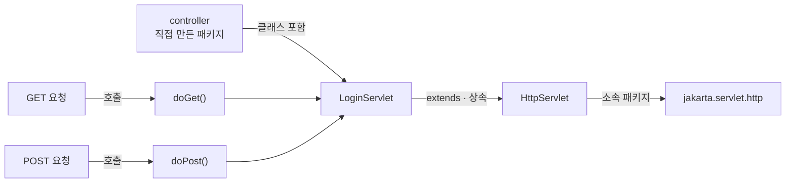

```text
controller
└── LoginServlet
       └── HttpServlet 상속
              └── jakarta.servlet.http 패키지 소속
```

### Tomcat 버전에 따른 차이

```text
Tomcat 10 이상
→ jakarta.servlet.http.HttpServlet

Tomcat 9 이하
→ javax.servlet.http.HttpServlet
```

Tomcat 10.1을 사용하고 있으므로 `jakarta.servlet`을 사용하면 된다.

### Servlet 요청 흐름

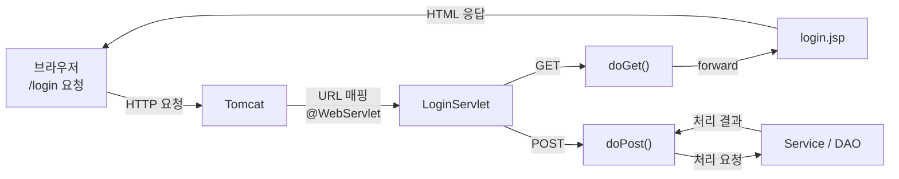

---

## 6. 트랜잭션

데이터베이스의 여러 작업을 하나의 작업 단위로 묶는 것

### 계좌 송금 예

A 계좌에서 B 계좌로 10,000원 송금

```text
1. A 계좌에서 10,000원 차감
2. B 계좌에 10,000원 추가
```

두 작업은 반드시 모두 성공하거나 모두 취소돼야 한다.

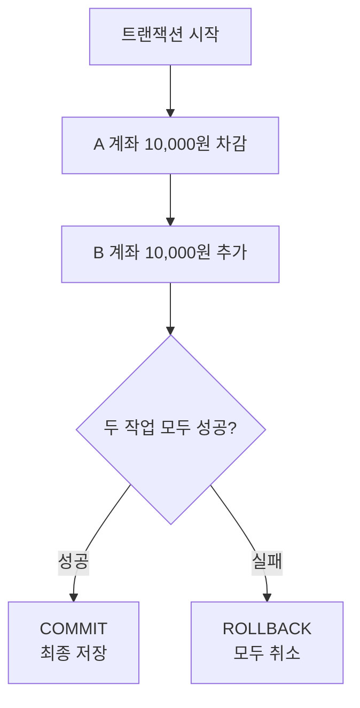

### COMMIT

변경한 내용을 데이터베이스에 최종 저장

### ROLLBACK

진행한 변경 내용을 취소하고 이전 상태로 복구

---

## 7. Java 클래스와 객체

### 기본 개념

```text
클래스 : 객체를 만들기 위한 설계도
객체   : 클래스를 기반으로 실제 생성된 대상
객체   : 필드 + 메서드
```

### 클래스 예

```java
class Person {

    String name; // 필드
    int age;     // 필드

    void eat() { // 메서드
    }
}
```

### 클래스 구성도

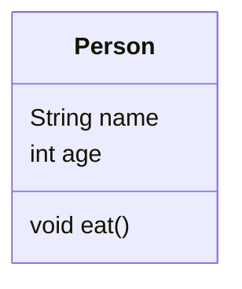

```text
Person 클래스
├── 필드
│   ├── String name
│   └── int age
└── 메서드
    └── void eat()
```

### 객체 생성

```java
Person p1 = new Person();
Person p2 = new Person();
```

```text
Person       : 클래스이자 참조 변수의 타입
p1, p2       : 참조 변수
new Person() : 객체 생성
```

### 클래스와 객체의 관계

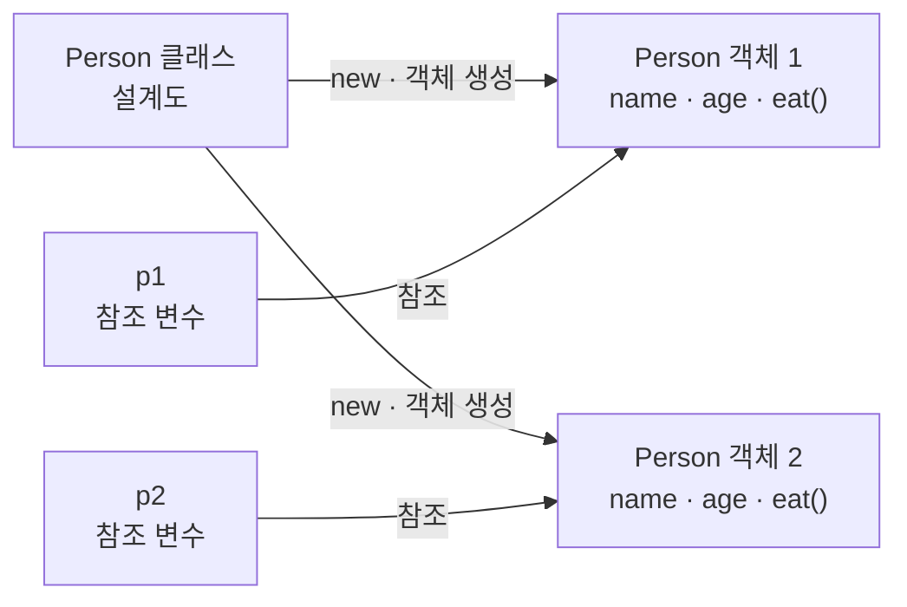

`p1`과 `p2`는 서로 다른 객체를 참조한다.

---

## 8. Java 객체지향의 3대 특징

### 1. 상속

기존 클래스의 필드와 메서드를 새로운 클래스가 물려받는 것

```java
class Person {

    String name;
    int age;

    void eat() {
    }
}

class Student extends Person {

    String sn;
}
```

### 클래스 상속 구조

필드와 메서드를 구분한 구조도

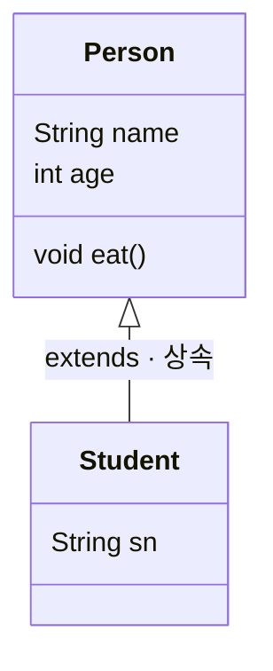

```text
Person
├── 필드
│   ├── String name
│   └── int age
└── 메서드
    └── void eat()
        △
        │ extends · 상속
        │
Student
└── 필드
    └── String sn
```

- `Person`: 부모 클래스
- `Student`: 자식 클래스
- `extends`: 상속 키워드
- `Student` 객체는 `name`, `age`, `eat()`, `sn`을 사용할 수 있음

### 2. 다형성

같은 부모 타입이나 같은 메서드 호출이 실제 객체에 따라 다르게 동작하는 특징

```java
class Animal {

    void sound() {
        System.out.println("동물 소리");
    }
}

class Dog extends Animal {

    @Override
    void sound() {
        System.out.println("멍멍");
    }
}

class Cat extends Animal {

    @Override
    void sound() {
        System.out.println("야옹");
    }
}
```

```java
Animal animal1 = new Dog();
Animal animal2 = new Cat();

animal1.sound(); // 멍멍
animal2.sound(); // 야옹
```

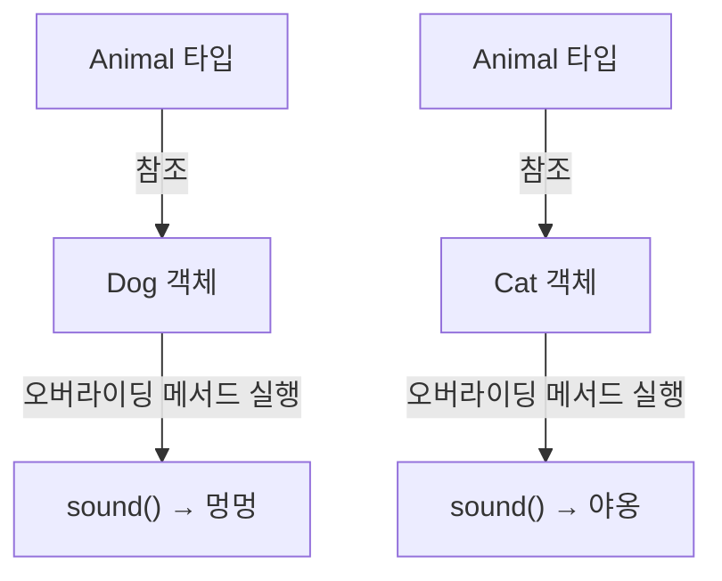

업캐스팅과 다운캐스팅은 상속 관계에서 사용하는 형변환이며 다형성과 관련된 개념이다.

```text
다형성
├── 부모 타입으로 여러 자식 객체를 참조
├── 실제 객체에 따라 오버라이딩 메서드 실행
└── 관련 형변환
    ├── 업캐스팅
    └── 다운캐스팅
```

### 3. 캡슐화

객체의 데이터를 외부에서 직접 변경하지 못하도록 숨기고 메서드를 통해 접근하게 하는 방식

```java
class Person {

    private String name;
    private int age;

    public void setName(String name) {
        this.name = name;
    }

    public String getName() {
        return name;
    }
}
```

```text
private : 외부 직접 접근 제한
getter  : 값 조회
setter  : 값 변경
```

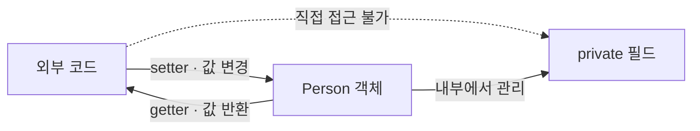

### 객체지향 3대 특징 정리

```text
상속   : 기존 클래스의 기능을 물려받음
다형성 : 같은 호출이 실제 객체에 따라 다르게 동작
캡슐화 : 데이터와 기능을 묶고 외부 접근을 제한
```

---

## 9. 업캐스팅과 다운캐스팅

### 예제 코드

```java
class Person {

    String name;
    int age;

    void eat() {
    }
}

class Student extends Person {

    String sn;
}
```

### 업캐스팅

자식 객체를 부모 타입 변수로 참조

```java
Person s1 = new Student();
```

```text
변수 타입 : Person
실제 객체 : Student
```

자동으로 형변환되므로 `(Person)`을 생략할 수 있다.

```java
s1.name = "홍길동"; // 가능
s1.age = 10;       // 가능
s1.eat();          // 가능

s1.sn = "12345";   // 컴파일 오류
```

실제 객체는 `Student`지만 참조 변수 타입이 `Person`이므로 `Person`에 선언된 멤버까지만 접근할 수 있다.

### 다운캐스팅

부모 타입 참조 변수를 자식 타입으로 변환

```java
Student s2 = (Student) s1;

s2.name = "홍길동"; // 가능
s2.age = 10;       // 가능
s2.eat();          // 가능
s2.sn = "12345";   // 가능
```

다운캐스팅은 자동으로 처리되지 않기 때문에 `(Student)`를 직접 작성해야 한다.

### 오류 코드

```java
Person s1 = new Student();

Student s2 = s1; // 컴파일 오류
```

`Person` 타입이 항상 `Student` 객체를 가리킨다고 보장할 수 없기 때문에 자동 다운캐스팅은 불가능하다.

### 상속·참조·멤버 구조

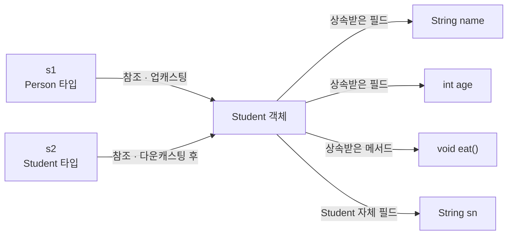

### 접근 범위

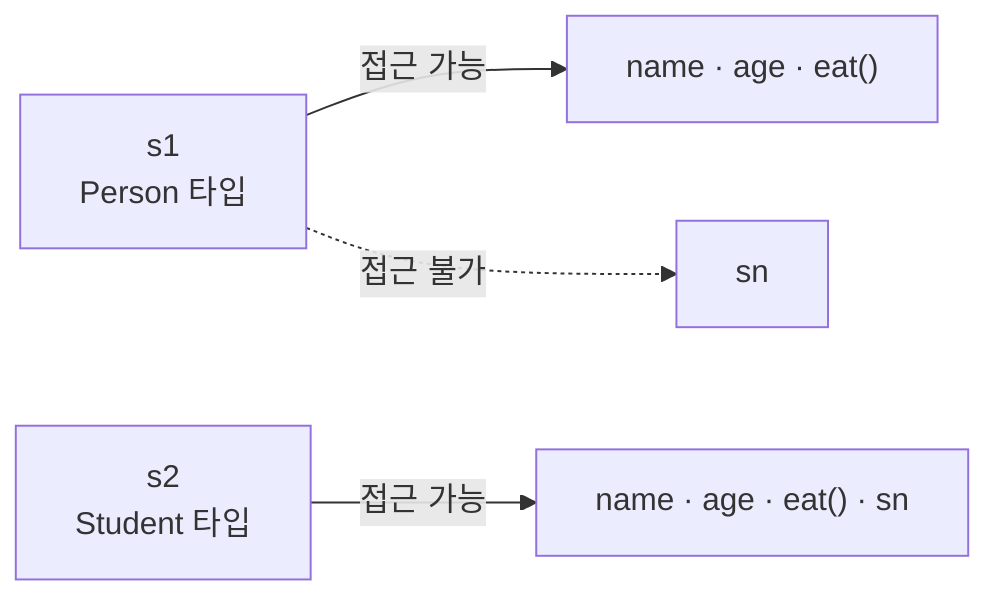

### 안전한 다운캐스팅

```java
Person person = new Student();

if (person instanceof Student) {
    Student student = (Student) person;
    student.sn = "12345";
}
```

실제 객체가 `Student`가 아닌데 강제로 다운캐스팅하면 `ClassCastException`이 발생한다.

```java
Person person = new Person();
Student student = (Student) person; // 실행 오류
```

---

## 10. 싱글톤

프로그램에서 특정 클래스의 객체를 하나만 생성해서 공동으로 사용하는 방식

### 일반 클래스

```java
Person p1 = new Person();
Person p2 = new Person();

System.out.println(p1 == p2); // false
```

`p1`과 `p2`는 서로 다른 객체를 참조한다.

### 싱글톤 클래스

```java
public class Singleton {

    private static final Singleton instance = new Singleton();

    private Singleton() {
    }

    public static Singleton getInstance() {
        return instance;
    }
}
```

### 싱글톤 사용

```java
Singleton s1 = Singleton.getInstance();
Singleton s2 = Singleton.getInstance();

System.out.println(s1 == s2); // true
```

### 싱글톤 구조

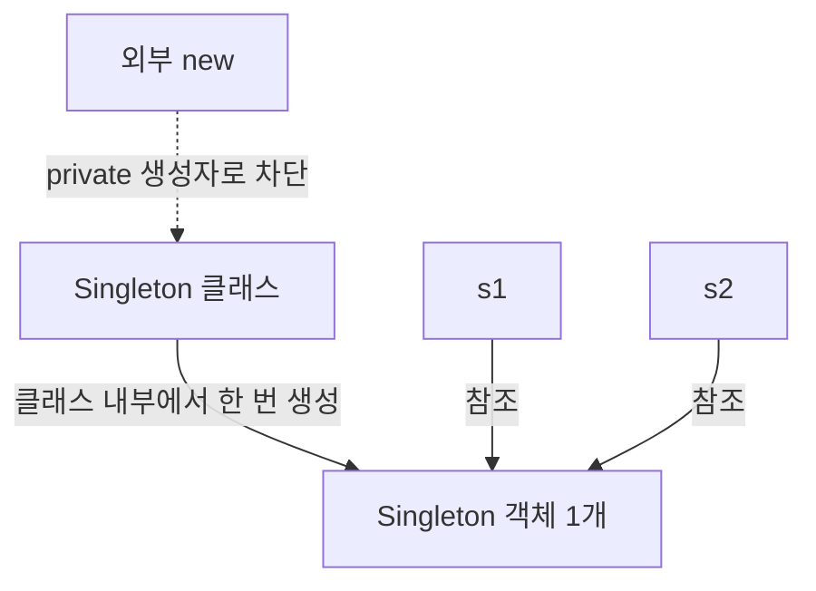

### 구성요소

```java
private static final Singleton instance = new Singleton();
```

- `static`: 클래스에 하나만 존재
- `final`: 다른 객체로 변경 불가
- `private`: 외부에서 직접 접근 불가

```java
private Singleton() {
}
```

- 외부에서 `new Singleton()` 사용 불가

```java
public static Singleton getInstance() {
    return instance;
}
```

- 객체 생성 없이 호출 가능
- 유일한 객체 반환

---

## 11. 메서드 오버로딩

같은 클래스 안에서 같은 이름의 메서드를 여러 개 선언하는 것

메서드 이름은 같아도 매개변수의 다음 항목 중 하나 이상이 달라야 한다.

```text
1. 매개변수 개수
2. 매개변수 타입
3. 매개변수 타입의 순서
```

반환 타입과 매개변수 이름은 오버로딩 판단 기준이 아니다.

### 가능한 코드

```java
class Person {

    String name;
    int age;

    void eat() {
    }

    void eat(int amount) {
    }

    void eat(int amount, int time) {
    }

    void eat(float amount, int time) {
    }

    void eat(int amount, float time) {
    }
}
```

### 오버로딩 구조

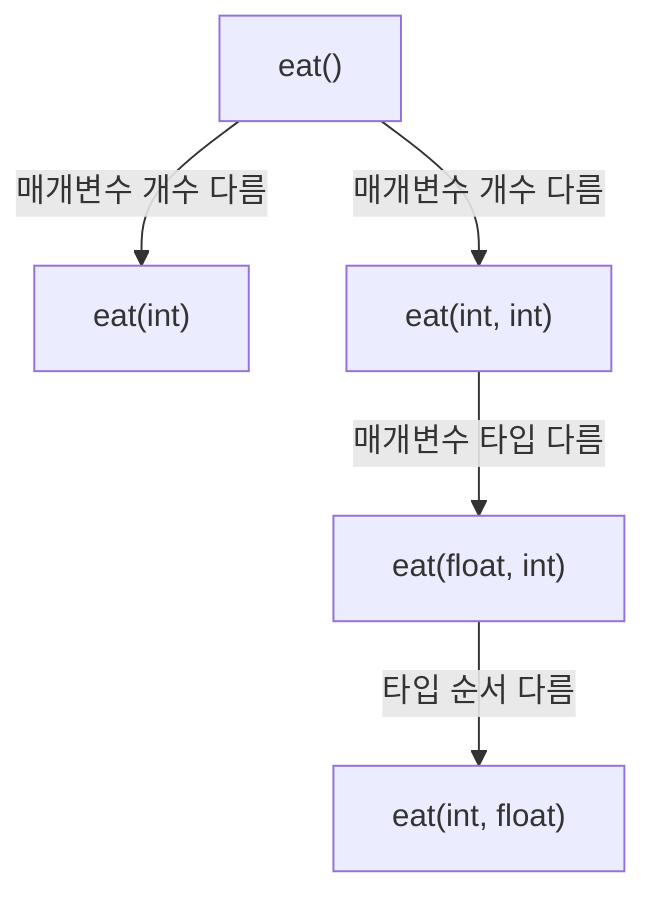

### 반환 타입만 다른 경우

```java
void eat() {
}

int eat() { // 컴파일 오류
    return 10;
}
```

```text
eat()
eat()
```

반환 타입만 다르기 때문에 오버로딩 불가능

### 매개변수 이름만 다른 경우

```java
void eat(int a, int b) {
}

void eat(int b, int a) { // 컴파일 오류
}
```

둘 다 메서드 구조는 같다.

```text
eat(int, int)
eat(int, int)
```

매개변수 이름은 오버로딩 판단 기준이 아니므로 컴파일 오류가 발생한다.

### 오버로딩 가능 여부

| 메서드 | 가능 여부 | 이유 |
|---|---:|---|
| `eat()` | 가능 | 기본 메서드 |
| `eat(int)` | 가능 | 매개변수 개수가 다름 |
| `eat(int, int)` | 가능 | 매개변수 개수가 다름 |
| `eat(float, int)` | 가능 | 매개변수 타입이 다름 |
| `eat(int, float)` | 가능 | 매개변수 타입 순서가 다름 |
| `void eat()` / `int eat()` | 불가능 | 반환 타입만 다름 |
| `eat(int a, int b)` / `eat(int b, int a)` | 불가능 | 매개변수 이름만 다름 |

---

## 12. 메서드 오버라이딩

부모 클래스에서 상속받은 메서드를 자식 클래스에서 다시 정의하는 것

```java
class Person {

    void eat() {
        System.out.println("사람이 먹는다");
    }
}

class Student extends Person {

    @Override
    void eat() {
        System.out.println("학생이 먹는다");
    }
}
```

### 오버라이딩 구조

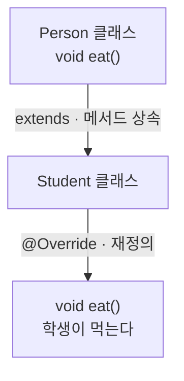

### 실행

```java
Person person = new Person();
Student student = new Student();

person.eat();  // 사람이 먹는다
student.eat(); // 학생이 먹는다
```

### 다형성과 오버라이딩

```java
Person person = new Student();

person.eat(); // 학생이 먹는다
```

```text
참조 변수 타입 : Person
실제 객체       : Student
실행 메서드     : Student의 eat()
```

### 오버라이딩 조건

```text
1. 부모와 자식의 상속 관계 필요
2. 메서드 이름 동일
3. 매개변수 개수 동일
4. 매개변수 타입과 순서 동일
5. 반환 타입 동일하거나 호환 가능
6. 부모보다 접근 범위를 좁게 변경할 수 없음
```

### `@Override`

부모 메서드를 오버라이딩한다는 표시

메서드 이름이나 매개변수를 잘못 작성하면 컴파일 오류로 확인할 수 있기 때문에 사용하는 것이 좋다.

### 오버라이딩이 아닌 경우

```java
class Person {

    void eat() {
    }
}

class Student extends Person {

    void eat(int amount) {
    }
}
```

```text
Person  : eat()
Student : eat(int)
```

매개변수가 다르기 때문에 오버라이딩이 아니라 상속 관계에서 새로운 오버로드 메서드를 추가한 것이다.

---

## 13. 오버로딩과 오버라이딩 비교

| 구분 | 오버로딩 | 오버라이딩 |
|---|---|---|
| 영문 | Overloading | Overriding |
| 위치 | 같은 클래스 또는 상속 관계 | 부모 클래스와 자식 클래스 |
| 상속 관계 | 필요 없음 | 필요 |
| 메서드 이름 | 동일 | 동일 |
| 매개변수 | 달라야 함 | 같아야 함 |
| 반환 타입 | 판단 기준 아님 | 같거나 호환 가능 |
| 목적 | 여러 입력 방식 제공 | 부모 기능을 자식에 맞게 변경 |
| 관련 개념 | 편리성 | 다형성 |
| 어노테이션 | 없음 | `@Override` 권장 |

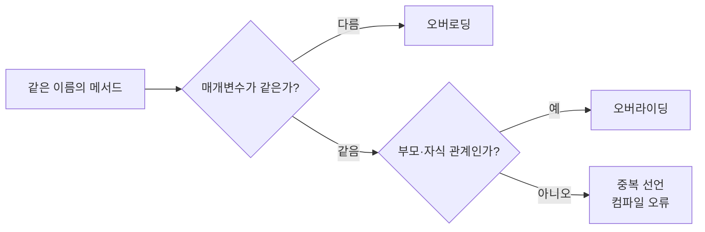

```text
오버로딩
→ 같은 메서드 이름
→ 매개변수가 다름

오버라이딩
→ 부모와 자식의 상속 관계
→ 메서드 형태가 같음
→ 자식 클래스에서 내용 재정의
```
