## 전체 데이터 분석 흐름

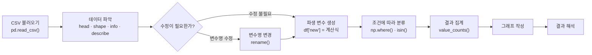

핵심 순서는 다음과 같습니다.

> 불러오기 → 파악하기 → 수정하기 → 파생 변수 만들기 → 분류하기 → 결과 확인하기

---

# 1. CSV 파일 불러오기

## pandas 불러오기

```python
import pandas as pd
```

일반적으로 pandas는 `pd`라는 별명으로 불러옵니다.

## `exam.csv` 불러오기

```python
exam = pd.read_csv("data/exam.csv")
exam
```

현재 파이썬 파일과 CSV 파일이 같은 폴더라면 다음과 같이 작성할 수도 있습니다.

```python
exam = pd.read_csv("exam.csv")
```

---

# 2. 데이터 구조 파악하기

데이터를 불러온 뒤에는 바로 분석하지 말고 전체적인 구조부터 확인합니다.

## 주요 명령어

| 코드 | 확인하는 내용 | 주의점 |
|---|---|---|
| `df.head()` | 처음 5행 | `head(10)`처럼 개수 지정 가능 |
| `df.tail()` | 마지막 5행 | `tail(10)`처럼 개수 지정 가능 |
| `df.shape` | 행과 열의 개수 | 함수가 아니므로 괄호 없음 |
| `df.columns` | 변수명 | 오타와 불필요한 공백 확인 |
| `df.info()` | 자료형과 결측치 | 결과를 화면에 직접 출력 |
| `df.describe()` | 수치형 변수의 요약 통계 | 문자형은 기본적으로 제외 |

## 처음과 마지막 데이터 확인

```python
exam.head()
```

```text
   id  nclass  math  english  science
0   1       1    50       98       50
1   2       1    60       97       60
2   3       1    45       86       78
3   4       1    30       98       58
4   5       2    25       80       65
```

처음 10행을 확인하려면 다음과 같이 작성합니다.

```python
exam.head(10)
```

마지막 5행:

```python
exam.tail()
```

```text
    id  nclass  math  english  science
15  16       4    58       98       65
16  17       5    65       68       98
17  18       5    80       78       90
18  19       5    89       68       87
19  20       5    78       83       58
```

## 행과 열 개수 확인

```python
exam.shape
```

결과:

```text
(20, 5)
```

- 행: 20개
- 열: 5개

`shape`은 함수가 아니라 데이터프레임의 속성입니다.

```python
exam.shape    # 올바른 코드
exam.shape()  # 오류 발생
```

## 변수명 확인

```python
exam.columns
```

결과:

```text
Index(['id', 'nclass', 'math', 'english', 'science'], dtype='object')
```

리스트로 확인하려면 다음과 같이 작성합니다.

```python
exam.columns.tolist()
```

## 변수 속성 확인

```python
exam.info()
```

`info()`에서 확인할 수 있는 내용:

- 전체 행 개수
- 열 이름
- 결측치가 아닌 값의 개수
- 각 열의 자료형
- 데이터프레임의 메모리 사용량

---

# 3. 요약 통계량 이해하기

```python
exam.describe()
```

`describe()`는 기본적으로 숫자형 변수의 요약 통계량을 보여줍니다.

| 항목 | 의미 |
|---|---|
| `count` | 결측치를 제외한 데이터 개수 |
| `mean` | 평균 |
| `std` | 표준편차 |
| `min` | 최솟값 |
| `25%` | 제1사분위수 |
| `50%` | 중앙값 |
| `75%` | 제3사분위수 |
| `max` | 최댓값 |

문자형 변수를 포함한 전체 통계를 확인하려면 다음과 같이 작성합니다.

```python
exam.describe(include="all")
```

## 과목별 평균 계산

```python
exam[["math", "english", "science"]].mean()
```

결과:

```text
math       57.45
english    84.90
science    59.45
```

## 특정 변수의 통계만 확인

```python
exam["math"].describe()
```

## 여러 변수의 통계 확인

```python
exam[["math", "english", "science"]].describe()
```

---

# 4. 원하는 행 선택하기

## `loc`와 `iloc`의 차이

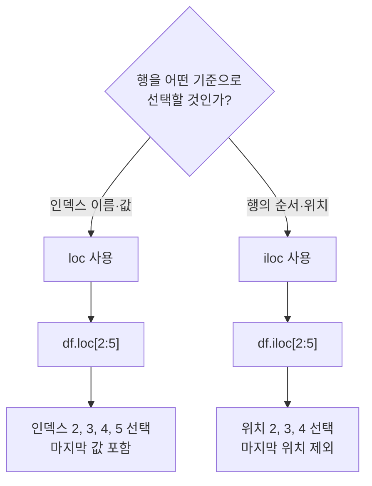

| 코드 | 기준 | 마지막 값 |
|---|---|---|
| `df.loc[2:5]` | 인덱스 라벨 | 5 포함 |
| `df.iloc[2:5]` | 행의 위치 | 위치 5 제외 |

## `loc` 사용하기

인덱스 값이 5인 행을 Series로 출력합니다.

```python
exam.loc[5]
```

데이터프레임 형태로 출력하려면 이중 대괄호를 사용합니다.

```python
exam.loc[[5]]
```

여러 행 선택:

```python
exam.loc[[5, 7, 9]]
```

범위 선택:

```python
exam.loc[5:10]
```

`loc[5:10]`은 인덱스 10까지 포함합니다.

## 특정 열을 인덱스로 설정하기

```python
exam_by_id = exam.set_index("id")
exam_by_id.head()
```

id가 3부터 6까지인 행 선택:

```python
exam_by_id.loc[3:6]
```

## `iloc` 사용하기

행의 순서를 기준으로 선택합니다.

```python
exam_by_id.iloc[[0, 3, 5]]
```

위 코드는 첫 번째, 네 번째, 여섯 번째 행을 선택합니다.

```python
exam_by_id.iloc[2:5]
```

위 코드는 위치가 2, 3, 4인 행을 선택합니다.

## 조건에 맞는 행 선택

수학 점수가 50점보다 높은 학생:

```python
exam.loc[exam["math"] > 50]
```

수학 점수가 50점 이상인 학생:

```python
exam.loc[exam["math"] >= 50]
```

수학 점수가 50점 이상이고 영어 점수가 80점 이상인 학생:

```python
exam.loc[
    (exam["math"] >= 50) &
    (exam["english"] >= 80)
]
```

pandas Series 조건에서는 다음 연산자를 사용합니다.

| 의미 | 연산자 |
|---|---|
| 그리고 | `&` |
| 또는 | `\|` |
| 반대 | `~` |

각 조건은 괄호로 감싸는 것이 중요합니다.

---

# 5. `mpg.csv` 데이터 파악하기

```python
mpg = pd.read_csv("data/mpg.csv")
```

`mpg.csv`는 자동차 234종의 정보를 담은 데이터입니다.

## 주요 변수

| 변수 | 의미 |
|---|---|
| `manufacturer` | 자동차 제조사 |
| `model` | 자동차 모델 |
| `displ` | 배기량 |
| `year` | 생산 연도 |
| `cyl` | 실린더 수 |
| `trans` | 변속기 종류 |
| `drv` | 구동 방식 |
| `cty` | 도시 연비 |
| `hwy` | 고속도로 연비 |
| `fl` | 연료 종류 |
| `category` | 자동차 종류 |

## 데이터 파악

```python
mpg.head()
mpg.tail()
mpg.shape
mpg.info()
mpg.describe()
```

원본 데이터 크기:

```text
(234, 11)
```

모든 변수를 포함한 통계:

```python
mpg.describe(include="all")
```

문자형 변수에서는 다음 항목이 추가됩니다.

| 항목 | 의미 |
|---|---|
| `unique` | 서로 다른 값의 개수 |
| `top` | 가장 많이 나타난 값 |
| `freq` | 가장 많이 나타난 값의 빈도 |

---

# 6. 변수명 바꾸기

분석 중 오류가 발생했을 때 원본으로 돌아갈 수 있도록 복사본을 만들어 작업할 수 있습니다.

```python
mpg_new = mpg.copy()
```

`hwy`를 `highway`로 변경:

```python
mpg_new = mpg_new.rename(
    columns={
        "hwy": "highway"
    }
)
```

`cty`와 `hwy`를 한 번에 변경:

```python
mpg_new = mpg_new.rename(
    columns={
        "cty": "city",
        "hwy": "highway"
    }
)
```

변경 결과 확인:

```python
mpg_new.columns
```

원본은 그대로 유지됩니다.

```python
mpg.columns
```

초보 단계에서는 다음과 같이 반환값을 다시 저장하는 방식을 권장합니다.

```python
df = df.rename(columns={"old": "new"})
```

---

# 7. 파생 변수 만들기

기존 변수를 조합하거나 계산해 만든 새로운 변수를 파생 변수라고 합니다.

## 통합 연비 만들기

도시 연비와 고속도로 연비의 평균을 `total`에 저장합니다.

```python
mpg["total"] = (
    mpg["cty"] + mpg["hwy"]
) / 2
```

결과 확인:

```python
mpg[["cty", "hwy", "total"]].head()
```

여기서 `total`은 학습을 위한 단순 평균입니다. 실제 공인 복합 연비 계산식과 같다고 단정하면 안 됩니다.

## 통합 연비 통계 확인

```python
mpg["total"].describe()
```

히스토그램:

```python
mpg["total"].plot.hist()
```

---

# 8. 조건에 따라 파생 변수 만들기

## `np.where()` 기본 구조

```python
import numpy as np

np.where(조건, 참일 때 값, 거짓일 때 값)
```

## 합격 여부 만들기

통합 연비가 20 이상이면 `pass`, 아니면 `fail`을 부여합니다.

```python
mpg["test"] = np.where(
    mpg["total"] >= 20,
    "pass",
    "fail"
)
```

결과 확인:

```python
mpg[["total", "test"]].head()
```

---

# 9. 중첩 조건으로 등급 만들기

## 등급 기준

| 등급 | 조건 |
|---|---|
| A | 30 이상 |
| B | 20 이상 30 미만 |
| C | 20 미만 |

## 분류 흐름

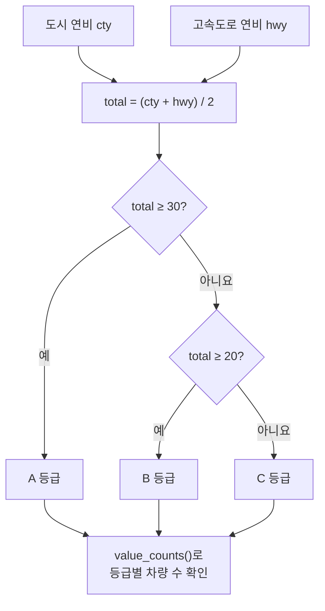

## 코드

```python
mpg["grade"] = np.where(
    mpg["total"] >= 30,
    "A",
    np.where(
        mpg["total"] >= 20,
        "B",
        "C"
    )
)
```

중첩 조건에서는 가장 높은 기준부터 검사해야 합니다.

> 30 이상 검사 → 20 이상 검사 → 나머지 처리

---

# 10. 여러 값 중 하나인지 확인하기

자동차 종류가 다음 중 하나라면 소형 자동차로 분류합니다.

- `compact`
- `subcompact`
- `2seater`

## 반복 조건 사용

```python
mpg["size"] = np.where(
    (mpg["category"] == "compact") |
    (mpg["category"] == "subcompact") |
    (mpg["category"] == "2seater"),
    "small",
    "large"
)
```

## `isin()` 사용

`isin()`을 사용하면 더 간단하게 표현할 수 있습니다.

```python
small_categories = [
    "compact",
    "subcompact",
    "2seater"
]

mpg["size"] = np.where(
    mpg["category"].isin(small_categories),
    "small",
    "large"
)
```

제조사가 현대 또는 혼다인지 분류:

```python
mpg["land"] = np.where(
    mpg["manufacturer"].isin(
        ["hyundai", "honda"]
    ),
    "asia",
    "non-asia"
)
```

---

# 11. 빈도표 만들기

변수에 각 값이 몇 개씩 있는지 확인할 때 `value_counts()`를 사용합니다.

## 합격 여부 빈도

```python
mpg["test"].value_counts()
```

결과:

```text
pass    128
fail    106
```

## 등급별 빈도

```python
mpg["grade"].value_counts()
```

알파벳 순서로 정렬:

```python
count_grade = (
    mpg["grade"]
    .value_counts()
    .sort_index()
)
```

결과:

```text
A     10
B    118
C    106
```

## 자동차 크기별 빈도

```python
mpg["size"].value_counts()
```

결과:

```text
large    147
small     87
```

## 제조사 지역별 빈도

```python
mpg["land"].value_counts()
```

결과:

```text
non-asia    211
asia         23
```

---

# 12. 그래프 만들기

## pandas 막대그래프

```python
count_grade.plot.bar(rot=0)
```

가로 막대그래프:

```python
count_grade.plot.barh()
```

## seaborn 막대그래프

```python
import seaborn as sns

sns.countplot(
    data=mpg,
    x="grade",
    order=["A", "B", "C"]
)
```

`order`를 지정하면 A, B, C 순서로 표시할 수 있습니다.

## 그래프 제목 추가

```python
import matplotlib.pyplot as plt

sns.countplot(
    data=mpg,
    x="grade",
    order=["A", "B", "C"]
)

plt.title("자동차 연비 등급")
plt.xlabel("연비 등급")
plt.ylabel("자동차 수")
plt.show()
```

---

# 13. 메서드 체이닝

메서드 체이닝은 `.`을 사용해 여러 메서드를 이어서 작성하는 방법입니다.

## 단계별 작성

```python
grade_count = mpg["grade"]
grade_count = grade_count.value_counts()
grade_count = grade_count.sort_index()
```

## 메서드 체이닝

```python
grade_count = (
    mpg["grade"]
    .value_counts()
    .sort_index()
)
```

메서드 체이닝은 중간 변수를 줄일 수 있습니다. 다만 코드가 너무 길어지면 여러 단계로 나누는 편이 디버깅하기 쉽습니다.

---
# 14. 얕은 복사와 깊은 복사

Python의 변수에는 객체 자체가 들어가는 것이 아니라, **객체가 저장된 메모리 위치를 가리키는 참조**가 저장됩니다.

## 전체 개념

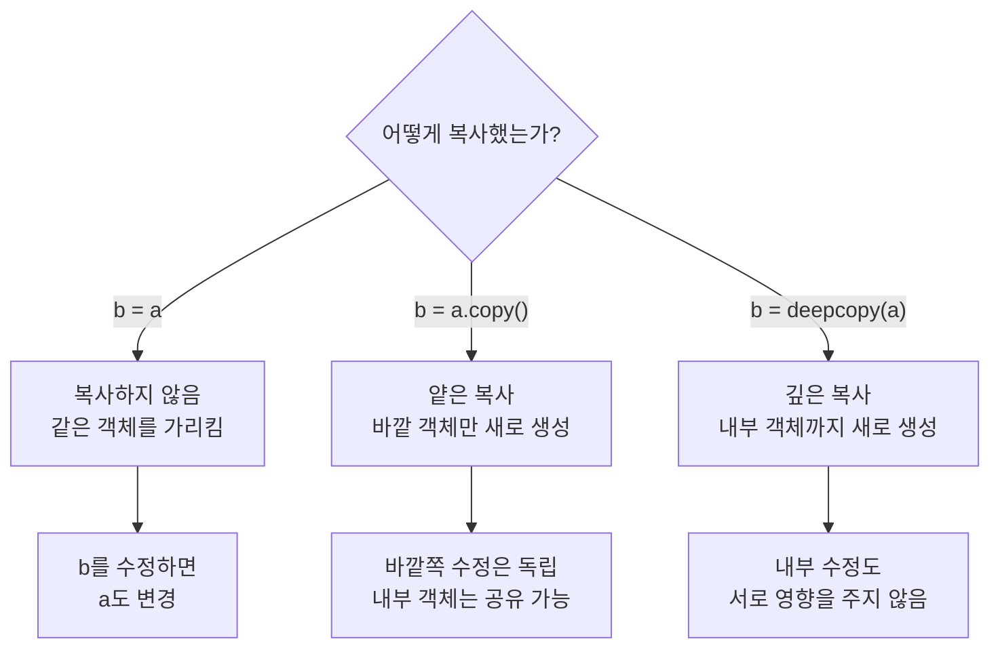

---

## 1. 대입: `b = a`

```python
a = [[1], [2]]
b = a

b[0].append(99)

print(a)
# [[1, 99], [2]]

print(b)
# [[1, 99], [2]]
```

`b = a`는 객체를 복사하는 코드가 아닙니다.  
`a`와 `b`가 **완전히 같은 리스트 객체**를 가리키게 합니다.

### 메모리 구조

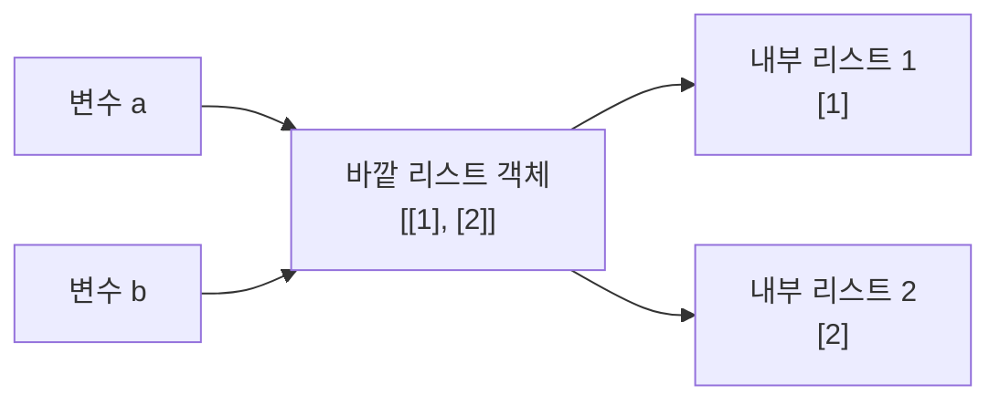

`a`와 `b`의 목적지가 같기 때문에 어느 쪽을 수정해도 같은 객체가 변경됩니다.

```python
print(a is b)
# True
```

### 수정 후

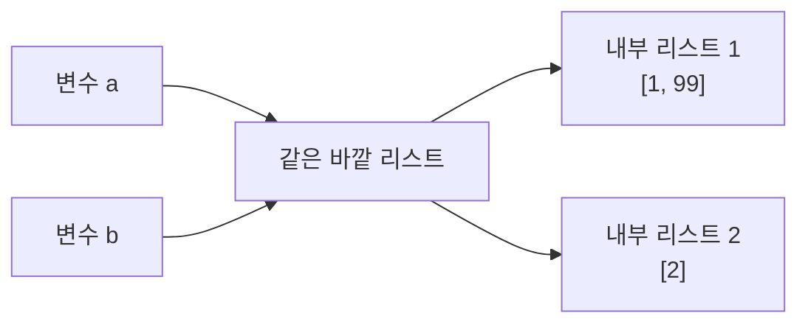

---

## 2. 얕은 복사: `a.copy()`

```python
a = [[1], [2]]
b = a.copy()
```

얕은 복사는 **바깥 리스트만 새로 만듭니다.**  
바깥 리스트 안에 들어 있는 내부 리스트는 여전히 공유합니다.

### 메모리 구조

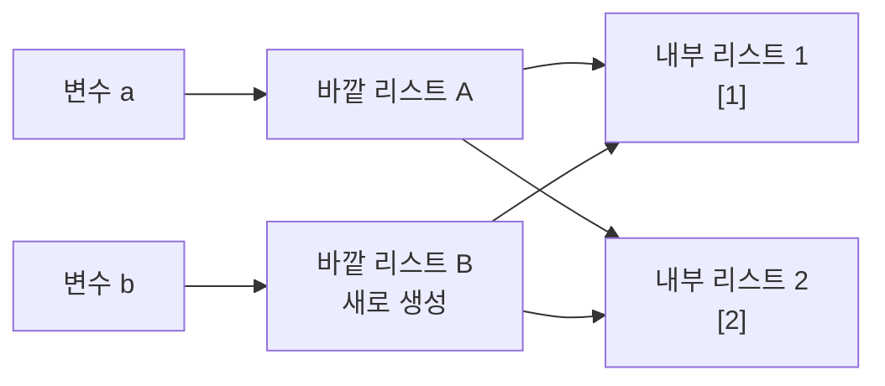

바깥 리스트는 서로 다릅니다.

```python
print(a is b)
# False
```

하지만 내부 리스트는 같습니다.

```python
print(a[0] is b[0])
# True
```

### 바깥 리스트를 수정하는 경우

```python
a = [[1], [2]]
b = a.copy()

b.append([3])

print(a)
# [[1], [2]]

print(b)
# [[1], [2], [3]]
```

`append([3])`는 `b`의 바깥 리스트를 수정하므로 `a`에는 영향을 주지 않습니다.

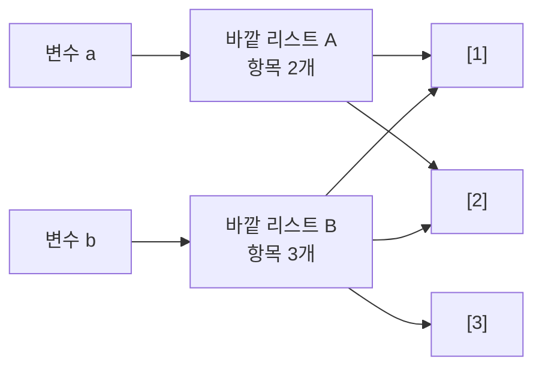

### 내부 리스트를 수정하는 경우

```python
a = [[1], [2]]
b = a.copy()

b[0].append(99)

print(a)
# [[1, 99], [2]]

print(b)
# [[1, 99], [2]]
```

`a[0]`과 `b[0]`이 같은 내부 리스트이므로 양쪽에서 모두 변경된 것처럼 보입니다.

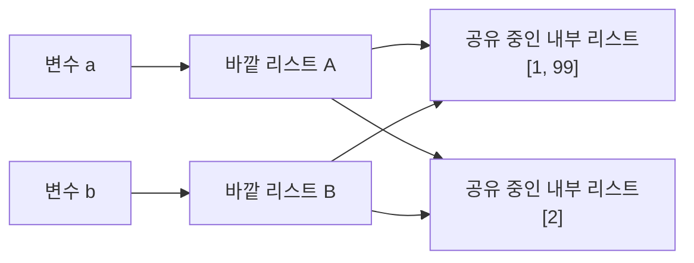

> 얕은 복사: 바깥 객체는 분리되지만 내부 객체는 공유될 수 있습니다.

---

## 3. 깊은 복사: `deepcopy()`

깊은 복사는 바깥 객체뿐만 아니라 **내부의 중첩 객체까지 새로 생성**합니다.

```python
from copy import deepcopy

a = [[1], [2]]
b = deepcopy(a)
```

### 메모리 구조

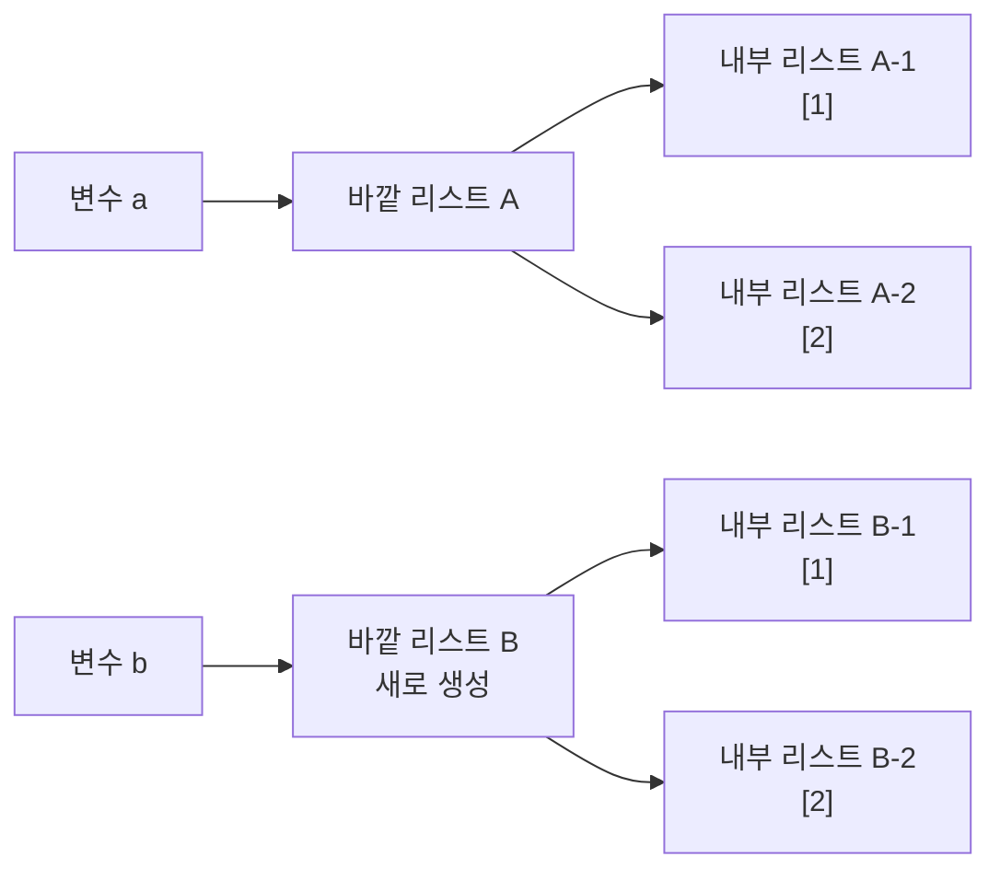

바깥 리스트와 내부 리스트가 모두 분리되어 있습니다.

```python
print(a is b)
# False

print(a[0] is b[0])
# False
```

### 내부 리스트 수정

```python
b[0].append(99)

print(a)
# [[1], [2]]

print(b)
# [[1, 99], [2]]
```

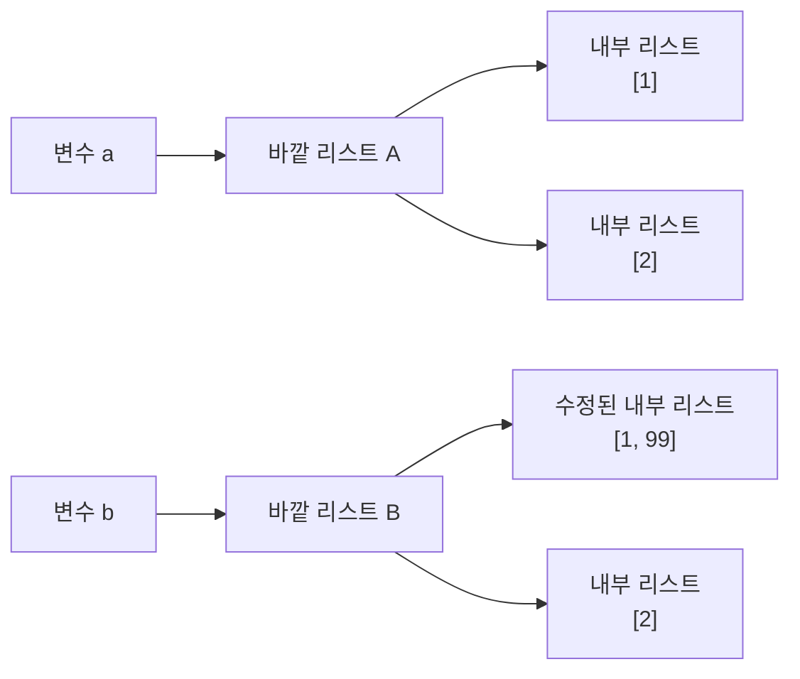

`b`의 내부 리스트만 수정되며 `a`는 변하지 않습니다.

---

## 세 가지 방식 비교

| 코드 | 바깥 객체 | 내부 객체 | 내부 수정 시 원본 |
|---|---|---|---|
| `b = a` | 공유 | 공유 | 변경됨 |
| `b = a.copy()` | 새로 생성 | 공유 가능 | 변경될 수 있음 |
| `b = deepcopy(a)` | 새로 생성 | 새로 생성 | 변경되지 않음 |

## 핵심 암기 그림

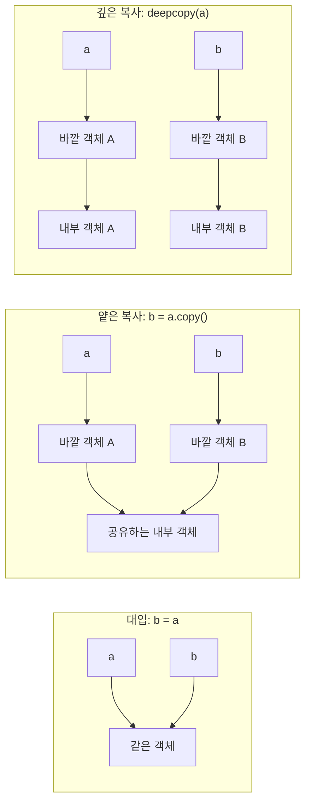

> **대입은 전부 공유, 얕은 복사는 내부만 공유 가능, 깊은 복사는 전부 분리**

---

## pandas의 `copy()`

데이터 분석에서는 원본 데이터프레임을 보존하기 위해 다음과 같이 복사본을 만듭니다.

```python
mpg_new = mpg.copy()
```

이후 `mpg_new`의 열 이름을 바꿔도 일반적인 데이터프레임 작업에서는 원본 `mpg`가 유지됩니다.

```python
mpg_new = mpg_new.rename(
    columns={
        "cty": "city",
        "hwy": "highway"
    }
)

print(mpg.columns)
print(mpg_new.columns)
```

다만 데이터프레임의 셀 안에 리스트 같은 **변경 가능한 Python 객체가 들어 있으면**, 그 객체까지 재귀적으로 복사되는 것은 아닙니다.

일반적인 숫자·문자 데이터 분석에서는 다음 형태로 기억하면 충분합니다.

```python
복사본 = 원본.copy()
```
---

# 15. `midwest.csv` 종합 분석

`midwest.csv`는 437개 지역의 인구 통계 정보를 담고 있습니다.

## 분석 목표

전체 인구에서 아시아계 인구가 차지하는 비율을 구하고, 평균보다 높은 지역과 낮은 지역을 분류합니다.

## 분석 흐름

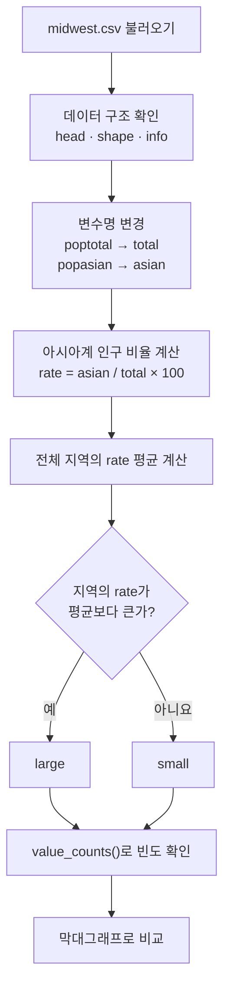

## 데이터 불러오기

```python
midwest = pd.read_csv("data/midwest.csv")
```

데이터 구조 확인:

```python
midwest.head()
midwest.shape
midwest.info()
```

원본 데이터 크기:

```text
(437, 28)
```

## 변수명 변경

```python
midwest = midwest.rename(
    columns={
        "poptotal": "total",
        "popasian": "asian"
    }
)
```

## 아시아계 인구 비율 계산

```python
midwest["rate"] = (
    midwest["asian"] /
    midwest["total"] *
    100
)
```

결과 확인:

```python
midwest[
    ["county", "state", "total", "asian", "rate"]
].head()
```

## 분포 확인

```python
midwest["rate"].describe()
midwest["rate"].plot.hist()
```

## 평균을 기준으로 분류

```python
mean_rate = midwest["rate"].mean()
```

평균:

```text
약 0.487246
```

```python
midwest["asiangroup"] = np.where(
    midwest["rate"] > mean_rate,
    "large",
    "small"
)
```

평균값을 `0.4872`처럼 직접 코드에 입력하지 않는 것이 중요합니다.

```python
# 권장하지 않는 방식
midwest["asiangroup"] = np.where(
    midwest["rate"] > 0.4872,
    "large",
    "small"
)
```

데이터가 변경되면 평균도 달라질 수 있기 때문입니다.

## 빈도 확인

```python
midwest["asiangroup"].value_counts()
```

결과:

```text
small    318
large    119
```

## 그래프 작성

```python
sns.countplot(
    data=midwest,
    x="asiangroup",
    order=["large", "small"]
)

plt.title("아시아계 인구 비율 그룹")
plt.xlabel("그룹")
plt.ylabel("지역 수")
plt.show()
```

---

# 16. 전체 내용 요약

## 데이터 파악

```python
df.head()
df.tail()
df.shape
df.columns
df.info()
df.describe()
```

## 변수명 변경

```python
df = df.rename(
    columns={
        "old": "new"
    }
)
```

## 파생 변수 생성

```python
df["total"] = (
    df["column1"] +
    df["column2"]
)
```

## 두 그룹으로 분류

```python
df["group"] = np.where(
    df["total"] >= 10,
    "high",
    "low"
)
```

## 여러 값 중 하나인지 확인

```python
df["group"] = np.where(
    df["category"].isin(["A", "B"]),
    "target",
    "other"
)
```

## 조건에 맞는 행 선택

```python
df.loc[df["total"] >= 10]
```

## 빈도표

```python
df["group"].value_counts()
```

---

# 17. 실습 문제

## A. 개념 확인

1. `shape`에는 괄호를 붙이지 않고 `info()`에는 괄호를 붙이는 이유를 설명하세요.
2. `loc[2:5]`와 `iloc[2:5]`가 선택하는 행의 차이를 설명하세요.
3. `df2 = df`와 `df2 = df.copy()`의 차이를 설명하세요.
4. pandas 조건을 연결할 때 `or` 대신 `|`를 사용하는 이유를 알아보세요.

## B. `exam.csv`

5. `exam.csv`를 데이터프레임으로 불러오세요.
6. 처음 5행과 마지막 5행을 확인하세요.
7. 데이터의 행·열 개수와 변수명을 확인하세요.
8. 수학, 영어, 과학 점수의 평균을 계산하세요.
9. `id`를 인덱스로 지정한 새 데이터프레임을 만드세요.
10. id가 3부터 6까지인 학생을 선택하세요.
11. 수학 점수가 50점보다 높은 학생을 선택하세요.
12. 수학과 영어 점수가 모두 50점 이상인 학생을 선택하세요.

## C. `mpg.csv`

13. `mpg.csv`를 불러오고 전체 구조를 확인하세요.
14. 원본을 복사한 뒤 `cty`를 `city`, `hwy`를 `highway`로 변경하세요.
15. 도시 연비와 고속도로 연비의 평균인 `total`을 만드세요.
16. `total`이 20 이상이면 `pass`, 아니면 `fail`인 `test`를 만드세요.
17. `total`이 30 이상이면 A, 20 이상이면 B, 나머지는 C인 `grade`를 만드세요.
18. `compact`, `subcompact`, `2seater`를 `small`로 분류하세요.
19. 제조사가 `hyundai` 또는 `honda`이면 `asia`로 분류하세요.
20. `test`, `grade`, `size`, `land`의 빈도표를 만드세요.
21. 연비 등급별 자동차 수를 막대그래프로 표현하세요.

## D. `midwest.csv`

22. `midwest.csv`를 불러와 구조를 확인하세요.
23. `poptotal`을 `total`, `popasian`을 `asian`으로 변경하세요.
24. 아시아계 인구 비율인 `rate`를 만드세요.
25. `rate`의 평균을 계산하세요.
26. 평균보다 높으면 `large`, 아니면 `small`인 `asiangroup`을 만드세요.
27. `asiangroup`의 빈도표와 막대그래프를 만드세요.
28. 평균값을 코드에 직접 입력하면 좋지 않은 이유를 설명하세요.

---

# 18. 결과 체크포인트

작성한 코드가 맞는지 다음 값으로 확인할 수 있습니다.

| 분석 결과 | 값 |
|---|---|
| `exam.shape` | `(20, 5)` |
| 수학 평균 | `57.45` |
| 영어 평균 | `84.90` |
| 과학 평균 | `59.45` |
| `mpg` 원본 크기 | `(234, 11)` |
| `test = pass` | `128` |
| `test = fail` | `106` |
| `grade = A` | `10` |
| `grade = B` | `118` |
| `grade = C` | `106` |
| `size = small` | `87` |
| `size = large` | `147` |
| `land = asia` | `23` |
| `land = non-asia` | `211` |
| `midwest` 원본 크기 | `(437, 28)` |
| `rate` 평균 | 약 `0.487246` |
| `asiangroup = large` | `119` |
| `asiangroup = small` | `318` |

---

# 19. 종합 실습 정답 코드

```python
from pathlib import Path

import matplotlib.pyplot as plt
import numpy as np
import pandas as pd
import seaborn as sns


DATA_DIR = Path("data")


# -------------------------
# 1. exam.csv
# -------------------------

exam = pd.read_csv(DATA_DIR / "exam.csv")

print("처음 5행")
print(exam.head())

print("\n마지막 5행")
print(exam.tail())

print("\n데이터 크기")
print(exam.shape)

print("\n변수명")
print(exam.columns.tolist())

print("\n과목별 평균")
print(
    exam[
        ["math", "english", "science"]
    ].mean()
)

exam_by_id = exam.set_index("id")

print("\nid가 3~6인 학생")
print(exam_by_id.loc[3:6])

print("\n수학 점수가 50점보다 높은 학생")
print(
    exam.loc[
        exam["math"] > 50
    ]
)


# -------------------------
# 2. mpg.csv
# -------------------------

mpg = pd.read_csv(DATA_DIR / "mpg.csv")

print("\nmpg 데이터 크기")
print(mpg.shape)

mpg_new = mpg.copy()

mpg_new = mpg_new.rename(
    columns={
        "cty": "city",
        "hwy": "highway"
    }
)

mpg["total"] = (
    mpg["cty"] + mpg["hwy"]
) / 2

mpg["test"] = np.where(
    mpg["total"] >= 20,
    "pass",
    "fail"
)

mpg["grade"] = np.where(
    mpg["total"] >= 30,
    "A",
    np.where(
        mpg["total"] >= 20,
        "B",
        "C"
    )
)

mpg["size"] = np.where(
    mpg["category"].isin(
        ["compact", "subcompact", "2seater"]
    ),
    "small",
    "large"
)

mpg["land"] = np.where(
    mpg["manufacturer"].isin(
        ["hyundai", "honda"]
    ),
    "asia",
    "non-asia"
)

print("\n합격 여부")
print(mpg["test"].value_counts())

print("\n연비 등급")
print(
    mpg["grade"]
    .value_counts()
    .sort_index()
)

print("\n자동차 크기")
print(mpg["size"].value_counts())

print("\n제조사 지역")
print(mpg["land"].value_counts())

sns.countplot(
    data=mpg,
    x="grade",
    order=["A", "B", "C"]
)

plt.title("자동차 연비 등급")
plt.xlabel("등급")
plt.ylabel("자동차 수")
plt.show()


# -------------------------
# 3. midwest.csv
# -------------------------

midwest = pd.read_csv(
    DATA_DIR / "midwest.csv"
)

print("\nmidwest 데이터 크기")
print(midwest.shape)

midwest = midwest.rename(
    columns={
        "poptotal": "total",
        "popasian": "asian"
    }
)

midwest["rate"] = (
    midwest["asian"] /
    midwest["total"] *
    100
)

mean_rate = midwest["rate"].mean()

midwest["asiangroup"] = np.where(
    midwest["rate"] > mean_rate,
    "large",
    "small"
)

print("\n아시아계 인구 비율 평균")
print(mean_rate)

print("\n아시아계 인구 비율 그룹")
print(
    midwest["asiangroup"]
    .value_counts()
)

sns.countplot(
    data=midwest,
    x="asiangroup",
    order=["large", "small"]
)

plt.title("아시아계 인구 비율 그룹")
plt.xlabel("그룹")
plt.ylabel("지역 수")
plt.show()
```

---

# 20. 원본 자료에서 바로잡은 부분

| 원본 내용 | 올바른 내용 |
|---|---|
| `exam.shape`의 열 수를 4개로 설명 | 실제 결과는 `(20, 5)` |
| `describe(include = 'all)` | `describe(include="all")` |
| `a.copy()`를 깊은 복사로 설명 | 리스트의 `copy()`는 얕은 복사 |
| `compactc` | 실제 범주는 `compact` |
| 평균값 `0.4872` 직접 입력 | `mean_rate = midwest["rate"].mean()` |
| `asin` | `asian` |
| `안시아` | `아시아` |

---

# 최종 암기 포인트

1. 데이터를 불러오면 먼저 `head()`, `shape`, `info()`, `describe()`를 실행한다.
2. `shape`은 속성이므로 괄호를 사용하지 않는다.
3. `loc`는 인덱스 값, `iloc`는 행의 위치를 사용한다.
4. 원본 보존이 필요하면 `copy()`로 복사본을 만든다.
5. 변수명은 `rename(columns={...})`으로 변경한다.
6. 새 열은 `df["new"] = 계산식`으로 만든다.
7. 두 그룹 분류는 `np.where()`를 사용한다.
8. 여러 값의 포함 여부는 `isin()`을 사용한다.
9. 분류 결과는 `value_counts()`로 확인한다.
10. 기준값은 직접 입력하지 말고 데이터에서 계산한다.
