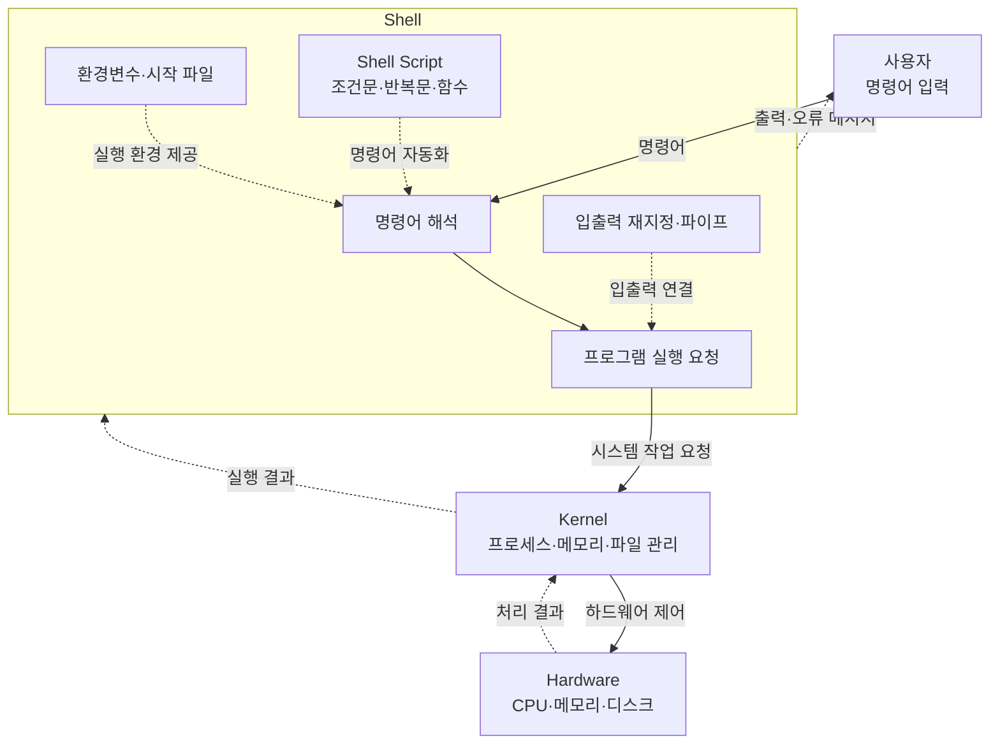

## 1. Shell 개요

### Shell이란?

Shell은 사용자와 운영체제 사이에서 명령어를 전달하고 처리하는 소프트웨어이다.

사용자가 명령어를 입력하면 Shell이 이를 해석하여 적절한 프로그램을 실행한다. 따라서 Shell은 **명령어 처리기(Command Processor)**라고도 한다.


### Shell의 종류

| Shell | 실행 파일 | 특징 |
|---|---|---|
| Bourne Shell | `/bin/sh` | Unix의 전통적인 기본 Shell |
| Korn Shell | `/bin/ksh` | Bourne Shell을 확장한 Shell |
| C Shell | `/bin/csh` | C 언어와 비슷한 문법을 제공 |
| Bash | `/bin/bash` | GNU에서 개발한 Bourne Shell 확장판 |

### 로그인 Shell 확인

```bash
echo $SHELL
```

### 로그인 Shell 변경

```bash
chsh
```

변경된 로그인 Shell은 일반적으로 로그아웃 후 다시 로그인해야 적용된다.

### 서브 Shell 실행

현재 Shell에서 다른 Shell을 실행하면 서브 Shell이 생성된다.

```bash
/bin/sh
```

서브 Shell을 종료하려면 다음 명령어를 사용한다.

```bash
exit
```

---

## 2. Shell의 환경변수

### 변수 설정

```bash
변수명=값
```

예시:

```bash
TERM=xterm-256color
echo $TERM
```

> 변수 대입문의 `=` 앞뒤에는 공백을 넣지 않는다.

### 환경변수 확인

```bash
env
```

대표적인 환경변수는 다음과 같다.

| 환경변수 | 의미 |
|---|---|
| `$USER` | 사용자 이름 |
| `$HOME` | 홈 디렉터리 |
| `$PATH` | 명령어를 검색할 디렉터리 목록 |
| `$SHELL` | 로그인 Shell 경로 |
| `$TERM` | 터미널 종류 |
| `$HOSTNAME` | 호스트 이름 |
| `$MAIL` | 메일박스 경로 |

### 지역변수와 환경변수

Shell 변수는 지역변수와 환경변수로 구분된다.

- 지역변수: 현재 Shell에서만 사용된다.
- 환경변수: 자식 프로세스와 서브 Shell에 전달된다.

변수를 환경변수로 만들려면 `export`를 사용한다.

```bash
country=대한민국
export country
```

한 번에 선언할 수도 있다.

```bash
export country=대한민국
```

---

## 3. Shell 시작 파일

시작 파일은 Shell이 시작될 때 자동으로 실행되는 설정 파일이다.

환경변수, 프롬프트, 명령어 경로, 별명, 함수 등을 설정하는 데 사용된다.

### 주요 Bash 시작 파일

| 파일 | 적용 대상 | 주요 역할 |
|---|---|---|
| `/etc/profile` | 전체 사용자 | 로그인 환경 설정 |
| `/etc/bash.bashrc` | 전체 사용자 | 대화형 Bash 설정 |
| `~/.bash_profile` | 개별 사용자 | 사용자 로그인 환경 설정 |
| `~/.bashrc` | 개별 사용자 | 별명, 함수, 대화형 환경 설정 |

### `.bashrc` 적용

파일을 수정한 뒤 현재 Shell에 바로 적용하려면 다음과 같이 실행한다.

```bash
source ~/.bashrc
```

또는 다음과 같이 실행할 수 있다.

```bash
. ~/.bashrc
```

---

## 4. 전면 처리와 후면 처리

### 전면 처리

명령어를 전면에서 실행한다. 명령어 실행이 끝날 때까지 Shell은 다음 명령을 기다린다.

```bash
command
```

### 후면 처리

명령어 뒤에 `&`를 붙이면 후면에서 실행된다.

```bash
command &
```

예시:

```bash
sleep 100 &
find . -name "test.c" -print &
```

### 후면 작업 확인

```bash
jobs
```

특정 작업만 확인하려면 작업 번호를 지정한다.

```bash
jobs %1
```

### 후면 작업을 전면으로 전환

```bash
fg %1
```

---

## 5. 입출력 재지정

Linux 명령어는 기본적으로 다음 세 가지 입출력 통로를 사용한다.

| 번호 | 이름 | 설명 |
|---|---|---|
| `0` | 표준입력 | 키보드 등의 입력 |
| `1` | 표준출력 | 정상적인 실행 결과 |
| `2` | 표준오류 | 오류 메시지 |

### 출력 재지정

명령어의 표준출력을 파일에 저장한다.

```bash
command > file
```

예시:

```bash
ls -al > list.txt
```

`>`는 기존 파일 내용을 덮어쓴다.

### 출력 추가

기존 파일의 마지막에 내용을 추가한다.

```bash
command >> file
```

예시:

```bash
date >> list.txt
```

### 입력 재지정

파일의 내용을 명령어의 표준입력으로 사용한다.

```bash
command < file
```

예시:

```bash
wc < list.txt
```

### 표준오류 재지정

오류 메시지를 파일에 저장한다.

```bash
command 2> error.txt
```

예시:

```bash
ls /not-found 2> error.txt
```

### 표준출력과 표준오류 함께 저장

```bash
command > result.txt 2>&1
```

Bash에서는 다음과 같이 작성할 수도 있다.

```bash
command &> result.txt
```

### Here Document

여러 줄의 문자열을 명령어의 표준입력으로 전달한다.

```bash
wc << END
hello
shell script
END
```

### 파이프

파이프는 앞 명령어의 표준출력을 다음 명령어의 표준입력으로 전달한다.

```bash
command1 | command2
```

예시:

```bash
ls | sort -r
who | wc -l
ls /etc | wc -w
```

---

## 6. 여러 명령어 실행

### 명령어 순차 실행

`;`로 연결된 명령어를 순서대로 실행한다.

```bash
date; pwd; ls
```

### 명령어 그룹

여러 명령어를 하나의 그룹으로 묶는다.

```bash
(date; pwd; ls)
```

그룹 전체의 출력을 파일에 저장할 수 있다.

```bash
(date; pwd; ls) > result.txt
```

### 성공했을 때 다음 명령 실행

첫 번째 명령어가 성공하면 두 번째 명령어를 실행한다.

```bash
command1 && command2
```

예시:

```bash
gcc main.c && ./a.out
```

### 실패했을 때 다음 명령 실행

첫 번째 명령어가 실패하면 두 번째 명령어를 실행한다.

```bash
command1 || command2
```

예시:

```bash
gcc main.c || echo "컴파일 실패"
```

---

## 7. 파일 이름 대치와 명령어 대치

### 파일 이름 대치

Shell은 특수문자를 실제 파일 이름으로 변환한다.

| 문자 | 의미 |
|---|---|
| `*` | 빈 문자열을 포함한 임의의 문자열 |
| `?` | 임의의 문자 한 개 |
| `[abc]` | `a`, `b`, `c` 중 한 문자 |
| `[a-z]` | 지정된 범위의 문자 한 개 |

예시:

```bash
ls *.txt
gcc *.c
ls file?.txt
ls [ac]*
```

### 명령어 대치

다른 명령어의 실행 결과를 문자열로 사용한다.

권장 문법:

```bash
$(command)
```

예시:

```bash
echo "현재 시간: $(date)"
echo "현재 디렉터리의 파일 수: $(ls | wc -w)"
```

백틱 문법도 사용할 수 있지만 중첩과 가독성 측면에서 `$(...)` 사용이 권장된다.

```bash
echo `date`
```

### 따옴표 차이

#### 작은따옴표

작은따옴표 안에서는 변수 대치와 명령어 대치가 수행되지 않는다.

```bash
name=홍길동
echo '이름: $name'
```

출력:

```text
이름: $name
```

#### 큰따옴표

큰따옴표 안에서는 변수 대치와 명령어 대치가 수행된다.

```bash
name=홍길동
echo "이름: $name"
echo "현재 시간: $(date)"
```

변수를 사용할 때는 공백과 파일 이름 확장 문제를 방지하기 위해 큰따옴표 사용을 권장한다.

```bash
echo "$name"
```

---

## 8. Bash 편의 기능

### 별명

긴 명령어에 짧은 이름을 지정할 수 있다.

```bash
alias ll='ls -alF'
alias la='ls -A'
alias l='ls -CF'
```

현재 등록된 별명을 확인한다.

```bash
alias
```

별명을 삭제한다.

```bash
unalias ll
```

### 히스토리

이전에 입력한 명령어를 확인한다.

```bash
history
```

| 표현 | 의미 |
|---|---|
| `!!` | 바로 전 명령어 재실행 |
| `!20` | 20번 명령어 재실행 |
| `!gcc` | `gcc`로 시작한 최근 명령어 재실행 |
| `!?test.c` | `test.c`를 포함한 최근 명령어 재실행 |

히스토리 관련 환경변수:

```bash
HISTSIZE=1000
HISTFILESIZE=2000
```

---

## 9. Bash 변수

### 단순 변수

하나의 문자열 또는 값을 저장한다.

```bash
city=서울
country=대한민국
address="서울시 용산구"
```

변수의 값은 `$`를 붙여 사용한다.

```bash
echo "$city"
echo "$country"
echo "$address"
```

### 배열 변수

하나의 변수에 여러 값을 저장한다.

```bash
cities=(서울 부산 목포)
```

| 표현 | 의미 |
|---|---|
| `${cities[0]}` | 첫 번째 원소 |
| `${cities[@]}` | 전체 원소 |
| `${#cities[@]}` | 원소 개수 |

예시:

```bash
echo "${cities[0]}"
echo "${cities[@]}"
echo "${#cities[@]}"
```

새로운 원소를 추가한다.

```bash
cities[3]=제주
```

### 표준입력 읽기

`read`는 표준입력에서 한 줄을 읽어 변수에 저장한다.

```bash
read name
echo "$name"
```

안내 문구와 함께 입력받을 수도 있다.

```bash
read -p "이름을 입력하세요: " name
echo "안녕하세요, $name"
```

### 특수 변수

| 변수 | 의미 |
|---|---|
| `$0` | 실행한 스크립트 이름 |
| `$1`~`$9` | 명령줄 인수 |
| `$#` | 명령줄 인수 개수 |
| `$*` | 전체 명령줄 인수 |
| `$@` | 전체 명령줄 인수 |
| `$$` | 현재 Shell의 프로세스 번호 |
| `$?` | 직전 명령어의 종료 상태 |

일반적으로 전체 인수를 안전하게 처리할 때는 `"$@"`를 사용한다.

```bash
for argument in "$@"; do
    echo "$argument"
done
```

---

## 10. Bash Shell Script

### 스크립트 작성

```bash
#!/bin/bash

echo "현재 시간:"
date

echo "현재 사용자:"
whoami

echo "시스템 실행 상태:"
uptime
```

첫 번째 줄의 `#!/bin/bash`는 스크립트를 실행할 인터프리터를 지정한다.

### 실행 권한 부여

```bash
chmod +x script.bash
```

### 스크립트 실행

```bash
./script.bash
```

또는 Bash를 직접 지정할 수 있다.

```bash
bash script.bash
```

---

## 11. 조건식과 연산자

### 정수 비교 연산자

`[ ... ]` 구문에서 사용하는 정수 비교 연산자이다.

| 연산자 | 의미 |
|---|---|
| `-eq` | 같다 |
| `-ne` | 다르다 |
| `-gt` | 크다 |
| `-ge` | 크거나 같다 |
| `-lt` | 작다 |
| `-le` | 작거나 같다 |

예시:

```bash
if [ "$score" -ge 90 ]; then
    echo "A"
fi
```

### 문자열 비교 연산자

| 표현 | 의미 |
|---|---|
| `"$a" = "$b"` | 두 문자열이 같다 |
| `"$a" != "$b"` | 두 문자열이 다르다 |
| `-n "$a"` | 문자열이 비어 있지 않다 |
| `-z "$a"` | 문자열이 비어 있다 |

예시:

```bash
if [ "$reply" = "Y" ] || [ "$reply" = "y" ]; then
    echo "계속합니다."
else
    echo "중지합니다."
fi
```

### 파일 검사 연산자

| 연산자 | 의미 |
|---|---|
| `-e file` | 파일 또는 디렉터리가 존재 |
| `-f file` | 일반 파일 |
| `-d file` | 디렉터리 |
| `-r file` | 읽기 가능 |
| `-w file` | 쓰기 가능 |
| `-x file` | 실행 가능 |
| `-O file` | 현재 사용자가 소유 |
| `-s file` | 파일 크기가 0보다 큼 |

예시:

```bash
if [ -f "$file" ] && [ -w "$file" ]; then
    echo "쓰기 가능한 일반 파일입니다."
fi
```

### 논리 연산

```bash
! condition
condition1 && condition2
condition1 || condition2
```

예시:

```bash
if [ ! -e "$file" ]; then
    echo "파일이 존재하지 않습니다."
fi
```

### 산술 연산

```bash
a=$((2 + 3))
echo "$a"
```

변수 값을 증가시킬 수 있다.

```bash
((a++))
((a += 2))
((a *= 10))
```

### 변수 속성 선언

```bash
declare -i number=10
declare -r readonly_value=20
declare -a array
declare -x environment_variable=value
```

| 옵션 | 의미 |
|---|---|
| `-i` | 정수 변수 |
| `-r` | 읽기 전용 변수 |
| `-a` | 배열 변수 |
| `-x` | 환경변수로 내보내기 |
| `-f` | 정의된 함수 확인 |

---

## 12. 제어문

### if 문

```bash
if [ 조건식 ]; then
    명령어
fi
```

### if-else 문

```bash
if [ 조건식 ]; then
    명령어
else
    명령어
fi
```

예시:

```bash
if [ "$#" -eq 1 ]; then
    wc "$1"
else
    echo "사용법: $0 파일"
fi
```

### 다중 조건문

```bash
if (( score >= 90 )); then
    echo "A"
elif (( score >= 80 )); then
    echo "B"
elif (( score >= 70 )); then
    echo "C"
else
    echo "노력 필요"
fi
```

### case 문

```bash
case "$variable" in
    pattern1)
        command
        ;;
    pattern2)
        command
        ;;
    *)
        command
        ;;
esac
```

예시:

```bash
case "$choice" in
    d)
        date
        ;;
    l)
        ls
        ;;
    w)
        who
        ;;
    q)
        echo "종료합니다."
        ;;
    *)
        echo "잘못된 선택입니다."
        ;;
esac
```

### for 문

리스트의 각 값에 대해 명령어를 반복한다.

```bash
for variable in list; do
    command
done
```

예시:

```bash
for file in *; do
    echo "$file"
done
```

명령줄 인수를 처리할 때는 다음과 같이 작성한다.

```bash
for file in "$@"; do
    echo "$file"
done
```

### while 문

조건이 참인 동안 명령어를 반복한다.

```bash
while (( condition )); do
    command
done
```

예시:

```bash
number=1

while (( number <= 10 )); do
    echo "$number"
    ((number++))
done
```

---

## 13. 함수와 디버깅

### 함수 정의

```bash
function_name() {
    command
}
```

예시:

```bash
show_files() {
    local directory="$1"

    echo "대상 디렉터리: $directory"
    ls -l "$directory" | head
}
```

### 함수 호출

```bash
show_files /tmp
```

함수 안에서도 `$1`, `$2`, `$#`, `"$@"` 등의 인수 관련 변수를 사용할 수 있다.

### 디버깅

스크립트의 각 명령어가 실행되는 과정을 확인한다.

```bash
bash -x script.bash
```

스크립트 내용을 읽으면서 실행한다.

```bash
bash -v script.bash
```

두 옵션을 함께 사용할 수도 있다.

```bash
bash -vx script.bash
```

### 디렉터리 내 파일 처리

```bash
directory="$1"

if [ ! -d "$directory" ]; then
    echo "$directory: 디렉터리가 아닙니다."
    exit 1
fi

for file in "$directory"/*; do
    if [ -f "$file" ]; then
        echo "파일: $file"
    elif [ -d "$file" ]; then
        echo "디렉터리: $file"
    else
        echo "기타: $file"
    fi
done
```

### 재귀 호출

스크립트나 함수가 자기 자신을 호출하는 방식을 재귀 호출이라고 한다.

모든 하위 디렉터리에 같은 작업을 적용할 때 유용하다.

다만 실제 파일 탐색 작업에서는 `find` 명령어를 사용하는 방법도 고려할 수 있다.

```bash
find . -type f
```

---

## 14. 핵심 요약

- Shell은 사용자의 명령어를 해석하여 운영체제에 전달한다.
- `>`, `>>`, `<`, `2>`를 사용하여 입출력을 재지정할 수 있다.
- 파이프 `|`를 사용하면 여러 명령어를 연결할 수 있다.
- `&&`는 앞 명령어가 성공했을 때, `||`는 실패했을 때 다음 명령어를 실행한다.
- 지역변수는 현재 Shell에서만 사용되고 환경변수는 자식 프로세스에 전달된다.
- `if`, `case`, `for`, `while`을 사용하여 조건과 반복 작업을 구현한다.
- 함수는 반복되는 코드를 묶어 재사용할 수 있게 한다.
- `bash -x`를 사용하면 스크립트의 실행 과정을 추적할 수 있다.
- 전체 명령줄 인수를 안전하게 처리할 때는 `"$@"`를 사용한다.
- 변수는 가능한 한 큰따옴표로 감싸는 것이 안전하다.

## 결론

Shell 사용의 핵심은 여러 명령어를 조합하고 입출력을 연결하여 반복 작업을 자동화하는 것이다.

Bash Shell Script를 이용하면 파일 관리, 시스템 정보 확인, 프로그램 실행, 데이터 처리와 같은 작업을 하나의 스크립트로 구성할 수 있다.
