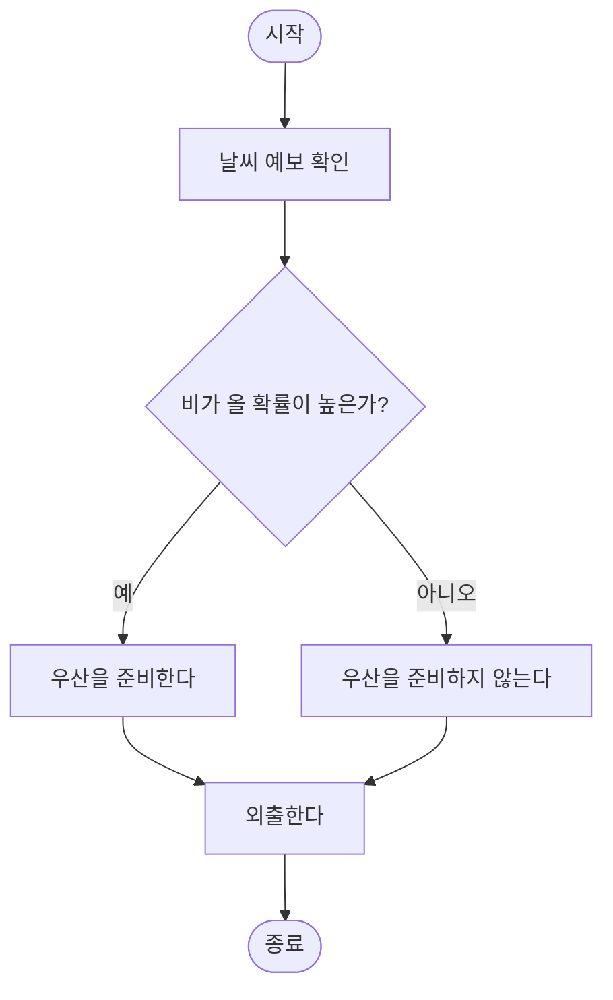

# [Week 1] 컴퓨팅 사고의 구성요소 핵심 요약

컴퓨팅 사고는 복잡한 문제를 분석하고, 해결 가능한 형태로 정리하여 효율적인 해결 방법을 만드는 사고 과정입니다.

주요 구성요소에는 **문제 분해**, **패턴 인식**, **추상화**, **알고리즘 설계**가 있습니다.

---

## 1. 문제 분해

- **개념:** 복잡한 문제를 한 번에 해결하지 않고, 해결하기 쉬운 여러 개의 작은 문제로 나누는 과정입니다.
- **실제 예시: 여행 계획 세우기**
  - 여행 날짜 정하기
  - 목적지 선택하기
  - 교통편 알아보기
  - 숙소 예약하기
  - 여행 경비 계산하기
  - 준비물 정리하기
- **핵심:** 큰 문제를 작은 단위로 나누면 해야 할 일을 빠뜨리지 않고 체계적으로 처리할 수 있습니다.

---

## 2. 패턴 인식

- **개념:** 여러 문제나 자료에서 반복되는 특징, 공통점 또는 일정한 규칙을 찾는 과정입니다.
- **실제 예시: 월별 소비 내역 분석하기**
  - 매달 배달 음식과 온라인 쇼핑에 많은 돈을 반복적으로 사용한다는 사실을 발견할 수 있습니다.
  - 이러한 소비 패턴을 파악하면 다음 달의 소비 계획을 세우거나 불필요한 지출을 줄일 수 있습니다.
- **핵심:** 이전에 발견한 패턴을 활용하면 비슷한 문제를 더 빠르게 해결할 수 있습니다.

---

## 3. 추상화

- **개념:** 문제 해결에 필요한 핵심 정보만 남기고, 중요하지 않은 세부 정보는 제외하는 과정입니다.
- **실제 예시: 학교까지 가는 경로 선택하기**
  - **필요한 정보**
    - 출발지와 목적지
    - 이동 거리
    - 예상 소요 시간
    - 교통비
    - 이용 가능한 교통수단
  - **제외할 정보**
    - 이동 중에 보이는 건물의 색상
    - 광고판의 내용
- **핵심:** 문제 해결과 직접 관련된 정보에 집중하면 더 효율적으로 판단할 수 있습니다.

---

## 4. 알고리즘 설계

- **개념:** 문제를 해결하기 위한 절차와 순서를 명확하게 만드는 과정입니다.
- **특징:** 필요한 경우 조건과 반복 과정도 함께 설계합니다.
- **실제 예시: 우산이 필요한지 판단하기**
  1. 외출하기 전에 날씨 예보를 확인합니다.
  2. 비가 올 확률을 확인합니다.
  3. 비가 올 확률이 높으면 우산을 준비합니다.
  4. 비가 올 확률이 낮으면 우산을 준비하지 않습니다.
  5. 외출합니다.

