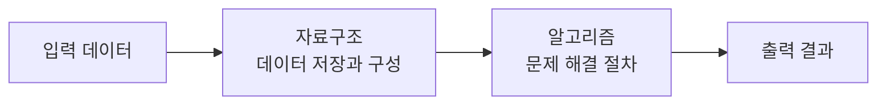
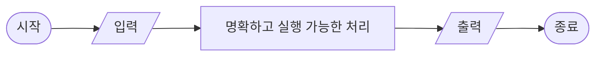
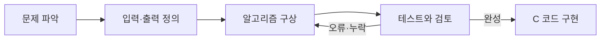
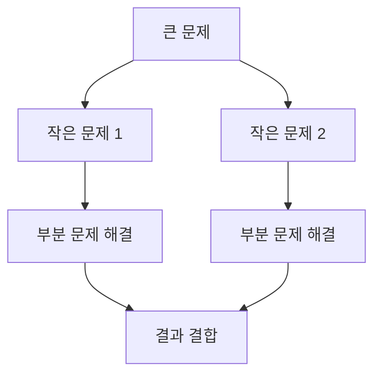
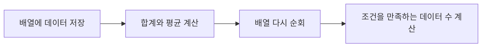
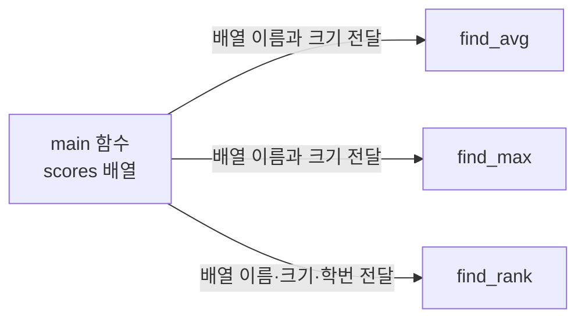
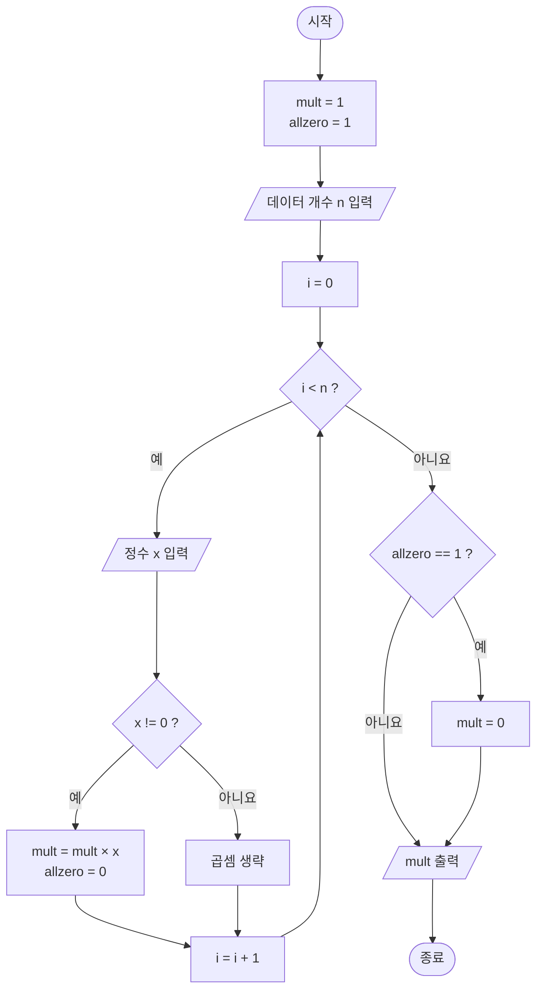

# 자료구조와 함께 배우는 알고리즘 - 2주차

## 1. 프로그램, 자료구조, 알고리즘

프로그램은 **자료구조**에 저장된 데이터를 **알고리즘**으로 처리하는 구조

```text
프로그램 = 자료구조 + 알고리즘
```



### 주요 자료구조

| 구분 | 예 |
|---|---|
| 기본 자료형 | `int`, `float`, `double`, `char` |
| 데이터 묶음 | 배열, 구조체 |
| 선형 자료구조 | 스택, 큐, 연결 리스트 |
| 비선형 자료구조 | 트리, 그래프 |

---

## 2. 알고리즘의 정의와 조건

특정한 목표를 해결하기 위해 컴퓨터가 수행할 명령어를 순서대로 정리한 절차

### 알고리즘의 5가지 조건

| 번호 | 조건 | 한글 뜻 | 의미 |
|---|---|---|---|
| 1 | Input | 입력 | 필요한 데이터를 0개 이상 입력 |
| 2 | Output | 출력 | 처리 결과를 1개 이상 출력 |
| 3 | Definiteness | 명확성 | 명령의 내용과 실행 순서가 명확한 상태 |
| 4 | Finiteness | 유한성 | 정해진 단계 수행 후 반드시 종료 |
| 5 | Effectiveness | 효과성·실행 가능성 | 실제 실행 가능한 연산으로 구성 |



---

## 3. 알고리즘의 표현

| 번호 | 표현 방법 | 특징 |
|---|---|---|
| 1 | 자연어 | 일반적인 문장으로 처리 과정 표현 |
| 2 | 그래픽 | 순서도와 구조도로 실행 흐름 표현 |
| 3 | 의사코드 | 프로그래밍 언어와 비슷한 형태로 표현 |
| 4 | 프로그래밍 언어 | C, Python, Java 등 실제 코드로 표현 |

### 보편적인 명령문

| 명령문 | 용도 | 예 |
|---|---|---|
| 대입문 | 값을 변수에 저장 | `sum = sum + data` |
| 조건문 | 조건에 따라 실행 분기 | `if (data > max)` |
| 반복문 | 조건 또는 횟수에 따라 반복 | `while`, `for` |
| 입출력문 | 데이터 입력과 결과 출력 | `scanf`, `printf` |
| 함수 호출문 | 분리된 기능 실행 | `find_max(data, n)` |

### 조건문의 선택 구조

`Alternative`는 조건에 따라 선택할 수 있는 실행 경로를 의미

| 구조 | 한글 뜻 | 실행 방식 |
|---|---|---|
| Single Alternative | 단일 선택 | 조건이 참일 때만 문장 실행 |
| Double Alternative | 이중 선택 | 참과 거짓 중 하나의 문장 실행 |
| Multi Alternative | 다중 선택 | 여러 조건 중 처음 만족하는 문장 실행 |

```c
// Single Alternative - 단일 선택
if (score >= 60) {
    printf("Pass\n");
}

// Double Alternative - 이중 선택
if (score >= 60) {
    printf("Pass\n");
} else {
    printf("Fail\n");
}

// Multi Alternative - 다중 선택
if (score >= 90) {
    grade = 'A';
} else if (score >= 80) {
    grade = 'B';
} else if (score >= 70) {
    grade = 'C';
} else {
    grade = 'F';
}
```

### 주요 연산자

```text
산술 연산자 : +, -, *, /, %
비교 연산자 : <, <=, >, >=, !=, ==
논리 연산자 : &&(AND), ||(OR), !(NOT)
```

알고리즘 작성 시 시작과 끝, 제어문의 범위, 문장의 끝, 들여쓰기, 주석을 명확하게 표현

---

## 4. 알고리즘 작성과 구현

### 작성 단계

1. **문제 파악** - 해결해야 할 목표 확인
2. **문제 재정의** - 입력 변수와 출력 변수 결정
3. **알고리즘 구상** - 예시 데이터를 사용한 실행 과정 시뮬레이션
4. **알고리즘 검토** - 여러 테스트 케이스로 수정·보완



### 구현 전 확인 사항

| 확인 항목 | 핵심 내용 |
|---|---|
| 일반·예외 상황 | 모든 경우가 포함되는지 확인 |
| 조건과 반복 | 조건식과 반복 횟수 확인 |
| 변수와 배열 | 자료형과 배열 크기 확인 |
| 계산 방식 | 정수 나눗셈과 형 변환 확인 |
| 사용자 입력 | 입력 전에 필요한 값 안내 |

### 평균 계산 예

입력한 `n`개 성적의 평균을 계산하는 알고리즘

```text
START
    sum = 0
    read(n)

    for i = 0 to n - 1
        read(data)
        sum = sum + data
    endfor

    avg = sum / n
    print(avg)
END
```

```c
#include <stdio.h>

int main(void)
{
    int n, data, sum = 0;
    double avg;

    printf("데이터 개수: ");
    scanf("%d", &n);

    if (n <= 0) {
        printf("데이터 개수는 1 이상이어야 합니다.\n");
        return 1;
    }

    for (int i = 0; i < n; i++) {
        scanf("%d", &data);
        sum += data;
    }

    avg = (double)sum / n;
    printf("평균: %.2f\n", avg);

    return 0;
}
```

`(double)sum / n`을 사용해 정수 나눗셈으로 소수 부분이 사라지는 문제 방지

---

## 5. 알고리즘 설계 방법론

### 1. Divide and Conquer (분할 정복)

큰 문제를 작은 문제로 나누어 해결한 후 결과를 합치는 방식

- 분할 과정: Top-down 방식
- 정복·결합 과정: Bottom-up 방식
- 대표 예: 이진 탐색, 병합 정렬, 퀵 정렬



### 2. Greedy Method (탐욕법)

현재 상황에서 가장 좋아 보이는 선택을 반복하는 방식

- 대표 예: 거스름돈 계산, 최소 신장 트리, 최단 경로 탐색
- 문제의 조건에 따라 전체 최적해를 보장하지 못할 수 있는 방식

### 3. Backtracking (백트래킹)

해를 탐색하다 진행할 수 없으면 이전 단계로 돌아가 다른 경로를 선택하는 방식

- 재귀 호출 또는 스택의 LIFO 구조 활용
- LIFO: 마지막에 저장된 데이터가 가장 먼저 나오는 구조
- 대표 예: 미로 찾기, 스도쿠, N-Queen 문제

### 설계 방법 비교

| 방법 | 처리 방식 | 대표 예 |
|---|---|---|
| 분할 정복 | 분할 → 해결 → 결합 | 병합 정렬 |
| 탐욕법 | 현재의 최선 선택 반복 | 거스름돈 계산 |
| 백트래킹 | 탐색 실패 시 이전 단계로 복귀 | 미로 찾기 |

---

## 6. 배열을 활용한 알고리즘

### 최댓값 구하기

첫 번째 데이터를 최댓값으로 설정한 후 나머지 데이터와 비교하는 방식

```text
read(n)
read(data)
max = data

for count = 1 to n - 1
    read(data)
    if data > max
        max = data
    endif
endfor

print(max)
```

### 자주 사용되는 처리 방식

| 문제 | 핵심 처리 |
|---|---|
| 0이 아닌 값의 곱 | `mult`를 1로 초기화한 후 `data != 0`인 값만 곱셈 |
| 모든 값이 0인 경우 | `allzero` 변수를 사용해 결과를 0으로 변경 |
| 평균 이상 데이터 수 | 첫 반복에서 평균 계산, 두 번째 반복에서 `scores[i] >= avg` 비교 `🟨 빈칸 정답` |
| 학생 성적과 등수 | 학번·성적을 2차원 배열에 저장한 후 높은 점수의 수 + 1 계산 |



---

## 7. C 함수

반복되는 기능을 독립적인 코드로 분리한 구조

### 함수 구성 요소

```text
C 함수
├── 함수 원형(Function Prototype)
├── 함수 정의(Function Definition)
└── 함수 호출(Function Call)
```

```c
#include <stdio.h>

int my_pow(int x, int y);       // 함수 원형

int main(void)
{
    int result = my_pow(2, 3);  // 함수 호출
    printf("%d\n", result);
    return 0;
}

int my_pow(int x, int y)        // 함수 정의
{
    int result = 1;

    for (int i = 0; i < y; i++) {
        result *= x;
    }

    return result;
}
```

### 매개변수 전달

| 방식 | 특징 |
|---|---|
| 일반 변수 | 값이 복사되는 Call by Value 방식 |
| 1차원 배열 | 배열 이름인 첫 번째 데이터의 주소 전달 |
| 2차원 배열 | 열의 크기를 지정해 전달: `int data[][2]` |



### 학생 성적 처리 함수

`sdata[i][0]`은 학번, `sdata[i][1]`은 성적을 의미하는 구조

```c
double find_avg(int sdata[][2], int n)
{
    int sum = 0;

    for (int i = 0; i < n; i++) {
        sum += sdata[i][1];
    }

    return (double)sum / n;
}

int find_max(int sdata[][2], int n)
{
    int max = sdata[0][1];

    for (int i = 1; i < n; i++) {
        if (sdata[i][1] > max) {  // 🟨 빈칸 정답
            max = sdata[i][1];
        }
    }

    return max;
}

int find_rank(int sdata[][2], int n, int sid)
{
    int jumsu = -1;
    int rank = 0;

    for (int i = 0; i < n; i++) {
        if (sdata[i][0] == sid) {
            jumsu = sdata[i][1];  // 🟨 빈칸 정답
            break;
        }
    }

    if (jumsu == -1) {
        return -1;
    }

    for (int i = 0; i < n; i++) {
        if (sdata[i][1] > jumsu) {  // 🟨 빈칸 정답
            rank++;
        }
    }

    return rank + 1;
}
```

---

## 8. 수업자료 빈칸 정답

### 곱셈 퀴즈

| 문제 | 정답 |
|---|---|
| 출제되는 곱셈 | `20×12`, `21×13`, `22×14`, `23×15`, `24×16` |
| 문제당 기회 | `2번` |
| 시도 횟수 확인 | `try` |
| 정답 여부 확인 | `ok` |

```c
if (dab == (k + 10) * (k + 2)) {  // 🟨 빈칸 정답
    printf("Correct!!\n");
}
```

두 번 모두 틀린 경우 정답 출력

```c
try++;

if (try < 2) {
    printf("Try Again!!\n");
} else {
    printf("정답: %d\n", (k + 10) * (k + 2));  // 🟨 수정 정답
}
```

### 배열과 함수

```c
// 평균 이상인 데이터의 수
if (scores[i] >= avg) {                // 🟨 빈칸 정답
    over_count++;
}

// 배열을 함수의 매개변수로 전달
printf("곱: %ld\n", multex(data, n));  // 🟨 빈칸 정답

// 최고점 갱신
if (sdata[i][1] > max) {               // 🟨 빈칸 정답
    max = sdata[i][1];
}

// 학번에 해당하는 성적 저장
jumsu = sdata[i][1];                    // 🟨 빈칸 정답

// 자신보다 점수가 높은 학생의 수 계산
if (sdata[i][1] > jumsu) {             // 🟨 빈칸 정답
    rank++;
}
```

---

## 9. 핵심 주의 사항

| 상황 | 올바른 처리 |
|---|---|
| 평균 계산 | `avg = (double)sum / n` |
| 최댓값 초기화 | 임의의 0보다 첫 번째 데이터 사용 |
| 여러 값의 곱 | `mult = 1`로 초기화 |
| 반복문 | 반복 변수 증가와 종료 조건 확인 |
| 배열 입력 | 선언된 최대 크기를 넘지 않도록 확인 |
| 2차원 배열 | 행은 학생, 열은 학번·성적으로 구분 |
| macOS의 C 컴파일 | `_CRT_SECURE_NO_WARNINGS` 불필요 |

## 전체 구조

```text
알고리즘 기초
├── 프로그램 = 자료구조 + 알고리즘
├── 정의와 5가지 조건
├── 표현 방법과 기본 명령문
├── 작성·검토·구현 과정
├── 분할 정복·탐욕법·백트래킹
├── 배열을 활용한 데이터 처리
└── C 함수와 배열 매개변수
```

---

## 10. 구현 연습: 0이 아닌 값의 곱

`n`개의 정수를 입력받아 0이 아닌 값만 곱한 결과를 출력하는 알고리즘

모든 입력값이 0인 경우 결과로 0 출력

### 입력과 출력

| 구분 | 변수 | 의미 |
|---|---|---|
| 입력 | `n` | 입력할 데이터 개수 |
| 입력 | `x` | 입력받은 정수 |
| 출력 | `mult` | 0이 아닌 값의 곱 |
| 상태 확인 | `allzero` | 모든 입력값이 0인지 확인 |
| 반복 제어 | `i` | 반복 횟수 관리 |

### 슈도코드

```text
START
    mult = 1
    allzero = 1

    read(n)

    for i = 0 to n - 1 do
        read(x)

        if x != 0 then
            mult = mult * x
            allzero = 0
        endif
    endfor

    if allzero == 1 then
        mult = 0
    endif

    print(mult)
END
```

### 실행 구조도



### C 코드

```c
#include <stdio.h>

int main(void)
{
    int n, i, x;
    int allzero = 1;
    long long mult = 1;

    printf("데이터 개수: ");
    scanf("%d", &n);

    if (n <= 0) {
        printf("데이터 개수는 1 이상이어야 합니다.\n");
        return 1;
    }

    printf("%d개의 정수 입력: ", n);

    for (i = 0; i < n; i++) {
        scanf("%d", &x);

        if (x != 0) {
            mult *= x;       // 🟨 mult = mult * x
            allzero = 0;
        }
    }

    if (allzero == 1) {
        mult = 0;
    }

    printf("0이 아닌 값의 곱: %lld\n", mult);

    return 0;
}
```

### 실행 예시

```text
데이터 개수: 7
7개의 정수 입력: 3 4 0 1 10 0 5
0이 아닌 값의 곱: 600
```

계산 과정:

```text
3 × 4 × 1 × 10 × 5 = 600
```

### 모든 값이 0인 경우

```text
데이터 개수: 4
4개의 정수 입력: 0 0 0 0
0이 아닌 값의 곱: 0
```

### 핵심 처리

```text
mult = 1
└── 곱셈을 위한 초기값

allzero = 1
└── 모든 값이 0이라고 가정

x != 0
├── mult에 x를 곱하기
└── allzero를 0으로 변경

allzero == 1
└── 모든 입력값이 0이므로 mult를 0으로 변경
```
