## 1. 수업 목표

- DTO를 이용한 계층 간 데이터 전달 구조 이해
- DAO를 이용한 데이터베이스 코드 분리
- MySQL Connector/J 설치 위치 확인
- JDBC의 네 단계 학습
- `PreparedStatement`와 플레이스홀더 사용법 학습
- `executeQuery()`와 `executeUpdate()` 구분
- `ResultSet`의 커서와 순회 방식 이해
- 회원가입·로그인 기능의 DB 연동
- 마이페이지·회원 탈퇴·회원 목록 기능 설계
- Spring 진입 전 기본 MVC·JDBC 구조 정리

---

## 2. 전체 구조

### 2.1 주요 구성 요소

**View**: 사용자 입력과 처리 결과를 표시하는 JSP 화면

**Controller**: 요청 수신, 파라미터 추출, 처리 흐름 제어를 담당하는 Servlet

**DTO(Data Transfer Object)**: 계층 사이에서 데이터를 운반하는 객체

**DAO(Data Access Object)**: DB 연결과 SQL 실행을 담당하는 객체

**DBMS(Database Management System)**: 데이터를 저장하고 관리하는 시스템

### 2.1.1 MVC 역할 구분

| 구분 | 구성 요소 | 핵심 책임 |
| --- | --- | --- |
| Model | DTO | 데이터 한 건의 보관과 계층 간 전달 |
| Model | DAO | DB 연결, SQL 실행, 조회 결과의 DTO 변환 |
| View | JSP | 입력 화면과 처리 결과 출력 |
| Controller | Servlet | 요청 수신, 파라미터 처리, Model 호출, 응답 경로 선택 |

수업 기준 표현

```text
M = Model      → DB 연동 객체와 데이터 객체 → DTO + DAO
V = View       → 사용자 화면               → JSP
C = Controller → 요청 처리                 → Servlet
```

### 2.1.2 DTO·DAO·Controller·DB의 연계

회원가입처럼 데이터를 저장하는 흐름

```text
1. JSP에서 사용자 입력
2. Controller에서 request 파라미터 추출
3. Controller에서 DTO 생성과 값 저장
4. Controller에서 DAO 메서드 호출
5. DAO에서 DTO의 getter로 값 추출
6. DAO에서 PreparedStatement에 값 바인딩
7. DB에서 INSERT·UPDATE·DELETE 수행
8. DAO에서 영향받은 행 수 반환
9. Controller에서 성공·실패 응답 선택
```

로그인·회원조회처럼 데이터를 읽는 흐름

```text
1. Controller에서 조회 조건을 DTO 또는 매개변수로 구성
2. Controller에서 DAO 메서드 호출
3. DAO에서 SELECT 실행
4. DB에서 ResultSet 반환
5. DAO에서 ResultSet 한 행마다 DTO 생성
6. 단일 조회는 DTO 또는 null 반환
7. 다중 조회는 List<DTO> 반환
8. Controller에서 request 또는 session 영역에 결과 저장
9. JSP에서 결과 출력
```

### 2.2 처리 흐름

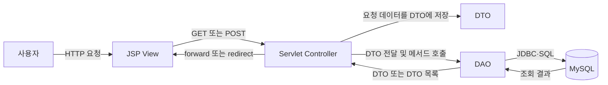

### 2.3 데이터 이동 방향

회원가입·수정처럼 사용자의 데이터를 DB에 저장하는 경우

```text
View → Controller → DTO → DAO → Database
```

로그인·회원조회처럼 DB의 데이터를 화면에 전달하는 경우

```text
Database → DAO → DTO → Controller → View
```

### 2.4 프론트엔드·백엔드·데이터베이스

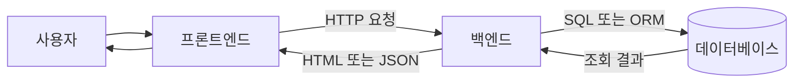

| 구성 요소 | 책임 | 대표 기술 |
| --- | --- | --- |
| 프론트엔드 | 화면 표시, 입력 수집, HTTP 요청 | HTML, CSS, JavaScript, React, Vue, JSP |
| 백엔드 | 요청 검증, 권한 확인, 비즈니스 로직, 응답 생성 | Java, Spring, Servlet |
| 데이터베이스 | 영속 데이터의 조회·등록·수정·삭제 | MySQL, PostgreSQL |

#### 프론트엔드

- 사용자 화면 표시
- 폼과 버튼을 통한 입력 수집
- 백엔드 API 호출
- HTML 또는 JSON 응답의 화면 반영

HTTP 요청 예시

```http
GET /api/users/1 HTTP/1.1
Host: example.com
```

#### 백엔드

- HTTP 요청 수신
- 입력값 형식 검사
- 인증·권한 검사
- 비즈니스 로직 실행
- DB·파일 저장소 접근
- HTTP 상태 코드와 응답 본문 생성

#### 데이터베이스

- 회원·주문·게시글 같은 영속 데이터 보관
- 백엔드의 SQL 또는 ORM 요청 처리
- 트랜잭션과 무결성 제약 조건 제공

권장 접근 방향

```text
프론트엔드 → 백엔드 → 데이터베이스
```

프론트엔드의 DB 직접 접근 문제

- DB 계정과 비밀번호 노출 위험
- 인증·권한 검사 우회 위험
- DB 구조와 화면 코드의 강한 결합
- 비즈니스 규칙의 일관된 적용 곤란

### 2.5 Service를 포함한 MVC 확장 구조

Week02의 MVC 구조에서 Model에 포함된 세 요소

```text
DTO/VO  → 데이터를 담는 객체
DAO     → 데이터베이스 접근
Service → 비즈니스 로직 처리
```

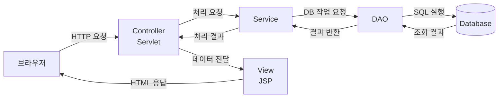

```text
브라우저
→ Controller
→ Service
→ DAO
→ Database
→ DAO
→ Service
→ Controller
→ View
→ 브라우저
```

- 단순 수업 예제: Controller에서 DAO 직접 호출
- 규모가 커진 구조: Controller와 DAO 사이에 Service 배치
- Controller의 DB 직접 접근보다 Service·DAO를 통한 접근 권장

---

## 웹 프로그램과 HTTP

### 클라이언트·서버 요청/응답

**웹 프로그램**: 클라이언트가 서버에 요청을 보내고 서버가 처리 결과를 응답하는 구조

```text
사용자
  ↓
클라이언트(브라우저)
  ↓ HTTP Request
서버
  ↓
Servlet
  ↔ Database
  ↓ HTTP Response
클라이언트 화면 표시
```

#### 클라이언트 역할

- 사용자의 입력 수집
- 서버에 HTTP 요청 전송
- 서버의 응답을 화면에 표시

#### 서버 역할

- 요청과 입력값 검증
- 로그인과 사용자 권한 확인
- 서비스 기능 실행
- 데이터베이스 조회 또는 수정
- 처리 결과 반환
- 중요 데이터와 시스템 보호

### HTTP

**HTTP(Hypertext Transfer Protocol)**: 브라우저와 서버가 요청과 응답을 주고받기 위한 통신 규칙

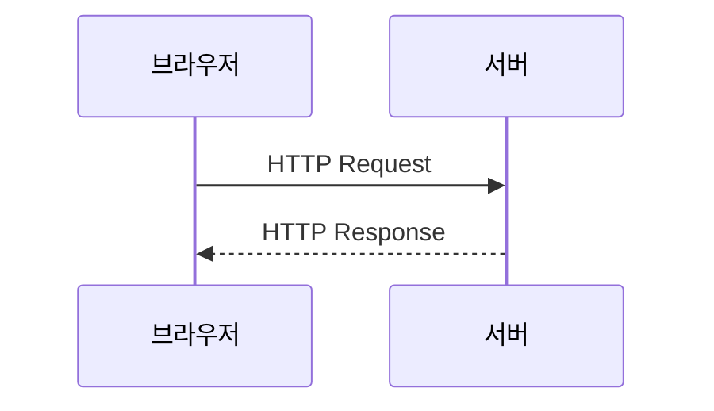

### HTTP 메시지와 HTTP 메서드

**HTTP 메시지**: 클라이언트와 서버가 주고받는 요청 또는 응답 데이터 전체

**HTTP 메서드**: 서버에 요청할 동작의 종류를 나타내는 시작줄의 항목

```text
HTTP 메시지 = 봉투 전체
HTTP 메서드 = 봉투 앞면의 용건
```

HTTP 요청 예시

```http
POST /myapp/login.do HTTP/1.1
Host: localhost:8080
Content-Type: application/x-www-form-urlencoded
Content-Length: 21

id=hong&password=1234
```

요청 메시지 구조

```text
시작줄: 요청 메서드 + 경로 + HTTP 버전
헤더: 요청의 부가 정보
빈 줄: 헤더와 바디의 경계
바디: 서버로 보낼 데이터
```

일반화한 요청 구성

```text
HTTP 요청
├── Method : GET, POST, PUT, PATCH, DELETE
├── URL    : /members
├── Header : 요청 부가 정보
└── Body   : 서버로 전달할 데이터
```

HTTP 응답 구성

```text
HTTP 응답
├── Status Code : 200, 404, 500
├── Header      : 응답 부가 정보
└── Body        : HTML, JSON 등의 결과
```

응답 예시

```http
HTTP/1.1 200 OK
Content-Type: text/html; charset=UTF-8

<!doctype html>
<html>
<body>로그인 성공</body>
</html>
```

JSON 응답 예시

```json
{
  "success": true,
  "message": "로그인 성공"
}
```

### HTML Form과 요청 바디

```jsp
<form action="${pageContext.request.contextPath}/login.do" method="post">
    <input type="text" name="id">
    <input type="password" name="password">
    <button type="submit">로그인</button>
</form>
```

처리 과정

```text
사용자의 폼 입력
→ 전송 버튼 클릭
→ 브라우저에서 입력값 직렬화
→ 직렬화된 값을 HTTP 요청 바디에 저장
→ /login.do로 전송
```

일반 폼의 바디 예시

```text
id=hong&password=1234
```

전송 대상

- `login.jsp` 문서 전체가 아닌 전송 가능한 폼 항목
- JSP 소스 코드가 아닌 `name` 속성과 사용자의 입력값
- `name`이 없는 폼 컨트롤은 일반적인 폼 전송 대상에서 제외

요청 바디 형식

| 형식 | 주요 용도 |
| --- | --- |
| `application/x-www-form-urlencoded` | 일반 HTML 폼 |
| `multipart/form-data` | 파일 업로드 폼 |
| `application/json` | JSON API |

### 서버 응답과 JSP 실행 결과

```text
서버에서 JSP 실행
→ JSP 내부의 서버 코드 처리
→ 최종 HTML 생성
→ 생성된 HTML을 HTTP 응답 바디에 저장
→ 브라우저로 전송
→ 브라우저에서 HTML 렌더링
```

- 브라우저가 받는 내용: 서버에서 생성된 최종 HTML
- 브라우저로 전송하지 않는 내용: JSP 원본, Scriptlet, 서버 내부 Java 코드
- 정적 HTML 요청: 파일 내용을 응답 바디로 전송
- JSP 요청: 서버 실행 결과를 응답 바디로 전송
- 페이지 소스 보기: 생성된 HTML만 확인 가능

### HTTP 메서드와 CRUD

**CRUD**: 데이터 처리의 네 가지 기본 작업

```text
C = Create · 생성
R = Read   · 조회
U = Update · 수정
D = Delete · 삭제
```

| CRUD | HTTP 메서드 | Servlet 메서드 | 주요 용도 |
| --- | --- | --- | --- |
| Create | `POST` | `doPost()` | 회원가입, 데이터 등록 |
| Read | `GET` | `doGet()` | 회원·목록 조회 |
| Update | `PUT` | `doPut()` | 자원 전체 수정 |
| Update | `PATCH` | 기본 `doPatch()` 없음 | 자원 일부 수정 |
| Delete | `DELETE` | `doDelete()` | 회원 탈퇴, 데이터 삭제 |

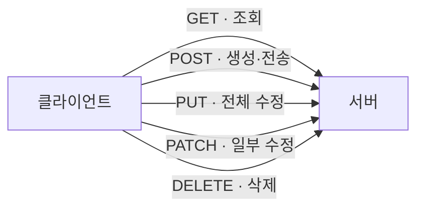

- CRUD와 HTTP 메서드의 연결: REST 설계에서 주로 사용하는 규칙
- HTML `<form>`의 기본 지원 메서드: `GET`, `POST`
- `PUT`, `PATCH`, `DELETE`: JavaScript `fetch()` 또는 Framework 기능 활용
- `HttpServlet`의 기본 `doPatch()` 부재
- PATCH 처리: `service()`에서 별도 분기 또는 Framework의 Mapping 기능 활용

### GET과 POST 비교

| 구분 | GET | POST |
| --- | --- | --- |
| 주요 용도 | 데이터 조회 | 데이터 생성 또는 전송 |
| 데이터 위치 | 주로 URL Query String | 주로 Request Body |
| Servlet 메서드 | `doGet()` | `doPost()` |
| 주소창 노출 | Query String 노출 | Body는 주소창에 미노출 |
| 북마크 | 적합 | 일반적으로 부적합 |
| 새로고침 | 같은 조회 반복 | 폼 재전송 경고 가능 |
| 반복 요청 | 서버 상태 불변 권장 | 서버 상태 변경 가능 |

주의사항

- POST 자체에 암호화 기능 없음
- 아이디·비밀번호 보호를 위한 HTTPS 필요
- GET Query String에 비밀번호·주민번호 등 민감 정보 사용 금지
- GET 요청 바디는 서버·중간 장비의 지원 차이로 일반적인 웹 개발에서 사용 지양
- URL과 요청 바디의 최대 크기는 브라우저·서버·프록시 설정에 따라 차이
- 로그아웃은 로그인 상태를 변경하는 요청
- `GET /logout.do`보다 `POST /logout.do` 권장
- 로그인·로그아웃 등 상태 변경 요청에 CSRF 방어 필요

### URL 구조

예시

```text
https://search.daum.net/nate?thr=sbma&w=tot&q=점메추
```

구조

```text
https:// search.daum.net /nate ? thr=sbma & w=tot & q=점메추
└ Scheme ┘ └──── Host ────┘ └Path┘  └──── Query String ────┘
```

| 구분 | 예시 값 | 의미 |
| --- | --- | --- |
| Scheme | `https` | 암호화된 HTTP 연결 방식 |
| Host | `search.daum.net` | 요청을 받을 서버의 Domain |
| Path | `/nate` | 서버 내부 요청 경로 |
| Query 시작 | `?` | Query String 시작 표시 |
| Parameter | `thr=sbma` | 유입 경로 등의 값 |
| Parameter | `w=tot` | 검색 범위 등의 값 |
| Parameter | `q=점메추` | 검색어 등의 값 |
| 구분자 | `&` | 여러 Parameter 구분 |

Servlet의 Query Parameter 읽기

```java
String keyword = request.getParameter("q");
String searchType = request.getParameter("w");
```

```text
q=점메추
    ↓
request.getParameter("q")
    ↓
"점메추"
```

- HTTPS: 클라이언트와 서버 사이의 통신 내용 암호화
- 브라우저 기록과 서버 로그에 전체 URL이 남을 가능성
- Query String의 민감 정보 사용 금지

### 주요 HTTP 상태 코드

| 코드 | 의미 |
| --- | --- |
| `200` | 요청 성공 |
| `302` | 다른 URL로 임시 이동 |
| `400` | 잘못된 요청 |
| `401` | 인증 실패 |
| `403` | 권한 없음 |
| `404` | 요청 자원 또는 데이터 부재 |
| `500` | 서버 내부 오류 |

### 로그인 HTTP 요청 예시

```http
POST /login
Content-Type: application/x-www-form-urlencoded

username=admin&password=1234
```

```text
1. 아이디와 비밀번호 입력
2. POST /login 요청
3. Servlet Container에서 LoginServlet 선택
4. LoginServlet에서 입력값 확인
5. DB에서 사용자 정보 조회
6. 로그인 성공 시 Session 생성
7. 메인 화면 또는 처리 결과 반환
```

간단한 로그인 Servlet 예시

```java
@WebServlet("/login")
public class LoginServlet extends HttpServlet {

    @Override
    protected void doPost(
            HttpServletRequest request,
            HttpServletResponse response
    ) throws IOException {

        String username = request.getParameter("username");
        String password = request.getParameter("password");

        // 학습용 고정 조건
        // 실제 서비스에서는 DB 조회와 Password Hash 검증 필요
        boolean loginSuccess =
            username.equals("admin") &&
            password.equals("1234");

        if (loginSuccess) {
            HttpSession session = request.getSession();
            session.setAttribute("username", username);

            response.sendRedirect("/main");
        } else {
            response.sendRedirect("/login?error=true");
        }
    }
}
```

---

## Servlet·JSP·Tomcat·Spring MVC

### Servlet

**Servlet**: 클라이언트의 HTTP 요청을 처리하고 HTTP 응답을 만드는 Java 서버 프로그램

```java
import jakarta.servlet.http.HttpServlet;

public class LoginServlet extends HttpServlet {
}
```

```text
HttpServlet
    △
    │ extends
    │
LoginServlet
```

주요 객체와 메서드

- `doGet()`: 화면 또는 데이터 조회 요청 처리
- `doPost()`: 로그인·회원가입·데이터 등록 등의 요청 처리
- `HttpServletRequest`: 들어온 HTTP 요청 정보를 표현하는 객체
- `HttpServletResponse`: 클라이언트에 보낼 HTTP 응답을 구성하는 객체
- `HttpSession`: 사용자별 상태를 여러 요청에 걸쳐 유지하는 객체

### JSP

**JSP(JavaServer Pages)**: HTML 중심으로 동적 화면을 작성하기 위한 서버 측 View 기술

- 작성 시 HTML과 JSP 문법으로 구성
- 실행 시 Servlet Container에서 Servlet으로 변환
- 변환된 Servlet의 실행 결과로 HTML 생성
- 브라우저에는 JSP 원본이 아닌 생성된 HTML 전달

### Servlet API

**Servlet API**: Java 웹 프로그램의 Servlet·Request·Response·Session 등에 대한 표준 규칙

### Tomcat

**Tomcat**: Servlet API를 구현하고 Servlet과 JSP를 실행하는 Servlet Container

Tomcat의 역할

- 직접 작성한 Servlet 실행
- JSP를 Servlet으로 변환한 뒤 실행
- Spring MVC의 `DispatcherServlet` 실행
- Request·Response 객체 생성
- Session과 Servlet Lifecycle 관리

### Spring MVC

**Spring MVC**: Servlet 기반 웹 개발의 요청 분배·Controller 호출·View 연결을 편리하게 제공하는 Framework

- 모든 요청의 앞단에서 `DispatcherServlet` 활용
- 요청 URL과 HTTP 메서드에 맞는 Controller 탐색
- Controller 처리 결과를 View 또는 응답 본문으로 연결

### 기술 관계

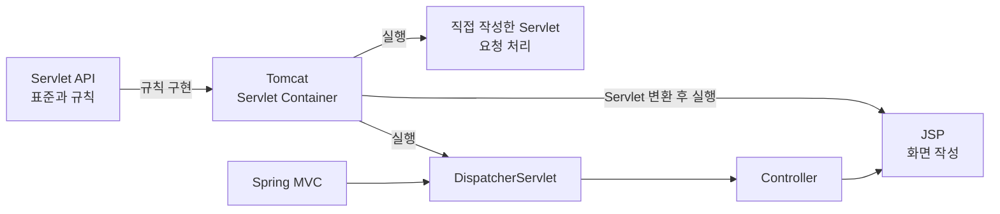

```text
Servlet API
└── Java 웹 기술의 표준 규칙

Tomcat
├── Servlet 객체 생성과 실행
├── JSP의 Servlet 변환과 실행
└── DispatcherServlet 실행

Spring MVC
└── DispatcherServlet을 통한 Controller 요청 분배
```

### Servlet과 JSP 요청 흐름

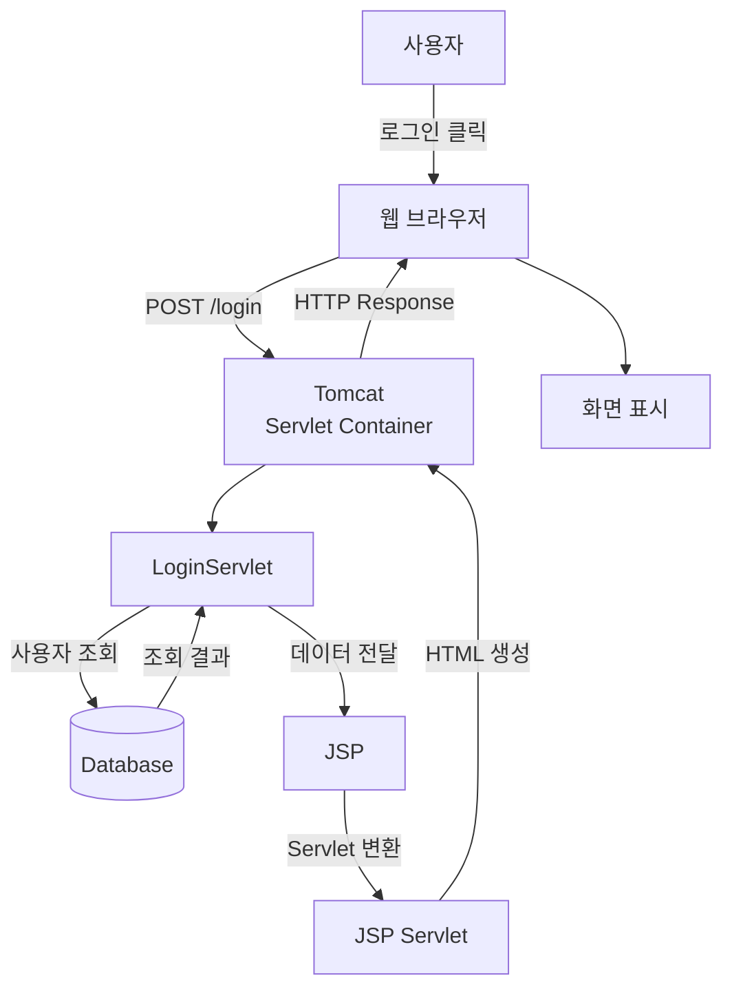

---

## Servlet Container와 요청 처리

### Servlet 클래스·객체·Container

| 구분 | 의미 | 예시 |
| --- | --- | --- |
| Servlet 클래스 | Servlet 객체의 설계도 | `LoginServlet.class` |
| Servlet 객체 | 실제 요청을 처리하는 인스턴스 | `LoginServlet` 객체 |
| Servlet Container | Servlet 객체와 요청 흐름을 관리하는 실행 환경 | Tomcat, Jetty, Undertow |

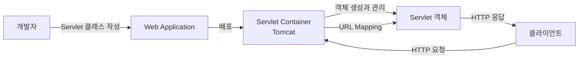

개발자가 Servlet 객체를 직접 `new`로 생성할 필요가 없는 구조

### Servlet Container 주요 업무

```text
Servlet Container
├── Servlet 클래스 로딩
├── Servlet 객체 생성
├── Lifecycle 관리
│   ├── init()
│   ├── service()
│   └── destroy()
├── URL Mapping 확인
├── Request·Response 객체 생성
├── Filter 실행
├── Session 관리
└── 여러 요청의 Thread 처리
```

대표 구현체

- Tomcat
- Jetty
- Undertow

### Servlet 객체와 Singleton

- Servlet 선언 한 개당 객체 한 개의 일반적 생성
- 하나의 Servlet 객체를 여러 요청에서 공유
- Singleton과 유사한 동작
- 개발자가 직접 구현한 Singleton Pattern과 다른 개념
- 객체 생성과 관리 주체: Servlet Container
- 같은 Servlet 인스턴스에서 여러 Thread의 동시 요청 처리 가능

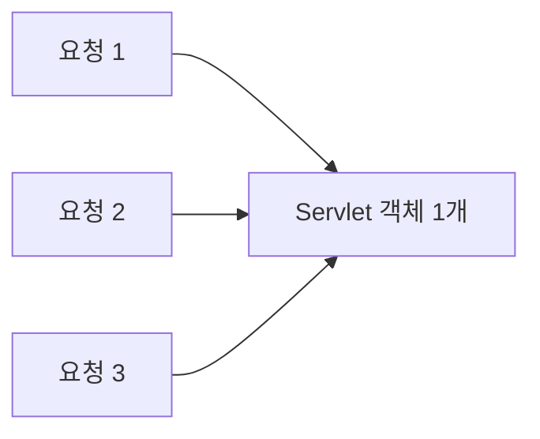

잘못된 요청 데이터 저장

```java
@WebServlet("/unsafe.do")
public class UnsafeServlet extends HttpServlet {

    // 여러 요청에서 공유되는 인스턴스 필드
    private String userId;

    @Override
    protected void doPost(
            HttpServletRequest request,
            HttpServletResponse response
    ) {
        userId = request.getParameter("userId");
    }
}
```

권장 저장 위치

- 메서드 지역변수
- `request` 영역
- 목적에 맞는 `session` 등 적절한 스코프

### Servlet Lifecycle

| 메서드 | 역할 | 호출 시점 |
| --- | --- | --- |
| `init()` | Servlet 초기화 | 객체 생성 후 한 번 |
| `service()` | 요청 처리 | 요청마다 |
| `destroy()` | 자원 정리 | Servlet 제거 전 한 번 |

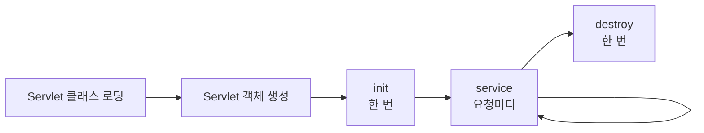

```text
최초 로딩
→ Servlet 객체 생성
→ init()

클라이언트 요청
→ service()
→ doGet() 또는 doPost()

서버 종료 또는 재배포
→ destroy()
```

- `init()`은 요청마다 실행되는 메서드가 아닌 초기화 메서드
- 첫 요청 시 지연 생성 또는 시작 시 미리 생성하도록 설정 가능한 Servlet

### service()와 HTTP별 처리 메서드

`HttpServlet.service()`에서 HTTP 메서드 확인 후 알맞은 메서드 호출

```text
GET     → doGet()
POST    → doPost()
PUT     → doPut()
DELETE  → doDelete()
HEAD    → doHead()
OPTIONS → doOptions()
TRACE   → doTrace()
```

- 일반적으로 `service()` 직접 재정의 불필요
- 필요한 `doGet()`·`doPost()` 등을 재정의

POST Lifecycle 예시

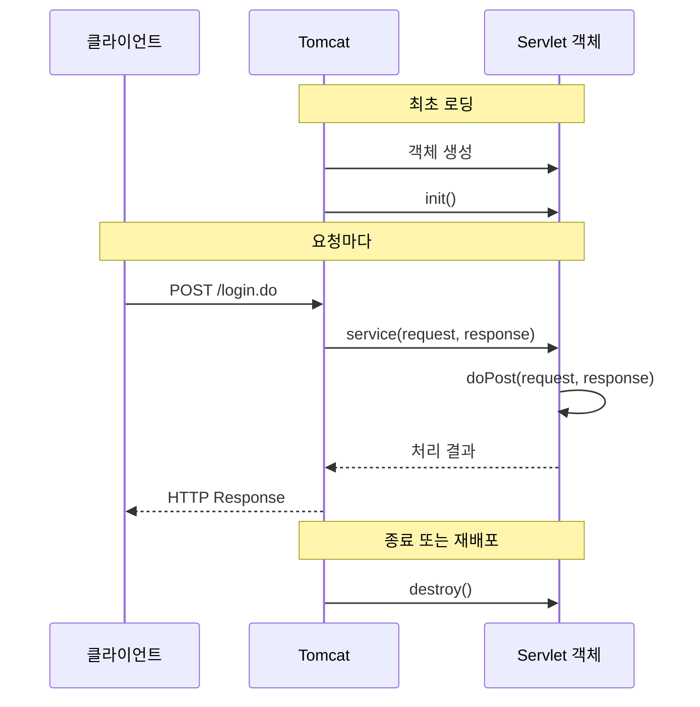

### URL Mapping

**URL Mapping**: 외부 요청 URL과 요청을 처리할 Servlet의 연결 설정

```text
/login.do  → LoginServlet
/logout.do → LogoutServlet
```

`login.do`의 의미

- 학습용 표현: Controller의 별명
- 정확한 표현: 외부에 공개된 URL Pattern
- 내부 클래스명·파일 경로와 외부 주소의 분리
- URL Mapping 자체는 보안 기능이 아닌 연결 설정
- 별도로 필요한 보안: 인증, 권한 검사, 입력 검증, Session 보호, HTTPS

#### Annotation 방식

```java
import jakarta.servlet.annotation.WebServlet;
import jakarta.servlet.http.HttpServlet;

@WebServlet("/logout.do")
public class LogoutServlet extends HttpServlet {
}
```

#### XML 방식

Servlet 클래스

```java
import jakarta.servlet.http.HttpServlet;

public class LogoutServlet extends HttpServlet {
}
```

`WEB-INF/web.xml`

```xml
<?xml version="1.0" encoding="UTF-8"?>
<web-app xmlns="https://jakarta.ee/xml/ns/jakartaee"
         xmlns:xsi="http://www.w3.org/2001/XMLSchema-instance"
         xsi:schemaLocation="https://jakarta.ee/xml/ns/jakartaee
                             https://jakarta.ee/xml/ns/jakartaee/web-app_6_0.xsd"
         version="6.0">

    <servlet>
        <servlet-name>logoutServlet</servlet-name>
        <servlet-class>com.example.controller.LogoutServlet</servlet-class>
    </servlet>

    <servlet-mapping>
        <servlet-name>logoutServlet</servlet-name>
        <url-pattern>/logout.do</url-pattern>
    </servlet-mapping>

</web-app>
```

```text
<servlet>
└── Servlet 이름과 클래스 연결

<servlet-mapping>
└── Servlet 이름과 URL 연결
```

| 구분 | Annotation | XML |
| --- | --- | --- |
| 작성 위치 | Servlet 클래스 | `WEB-INF/web.xml` |
| 주요 설정 | `@WebServlet` | `<servlet>`, `<servlet-mapping>` |
| 장점 | 간단하며 클래스에서 바로 확인 | 설정을 한 파일에서 통합 관리 |
| 주의점 | 설정의 클래스별 분산 가능성 | 많은 XML 작성량 |

- 동일 Servlet과 URL의 Annotation·XML 중복 등록 시 충돌 또는 배포 오류 가능성

#### URL Mapping Pattern

| Pattern | 의미 | 요청 예시 |
| --- | --- | --- |
| `/logout.do` | 정확히 일치하는 URL | `/logout.do` |
| `/member/*` | 특정 경로 아래의 모든 URL | `/member/list` |
| `*.do` | 특정 확장자로 끝나는 URL | `/login.do` |
| `/` | 다른 Mapping과 일치하지 않는 기본 요청 | Default Servlet |

### Container의 요청 처리 순서

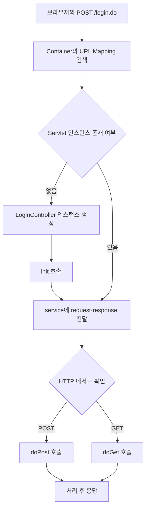

### HTML Form과 Servlet 연결

```html
<form action="${pageContext.request.contextPath}/login.do" method="post">
    <input type="text" name="userId">
    <input type="password" name="password">
    <button type="submit">로그인</button>
</form>
```

```java
@WebServlet("/login.do")
public class LoginServlet extends HttpServlet {

    @Override
    protected void doPost(
            HttpServletRequest request,
            HttpServletResponse response
    ) throws IOException {

        String userId = request.getParameter("userId");
        String password = request.getParameter("password");
    }
}
```

주의사항

- `@WebServlet("/login.do")`와 Form `action` 경로 일치
- URL의 대소문자 구분
- `Login.do`와 `login.do`는 서로 다른 경로
- `action="Login.do"`는 현재 페이지 기준 상대 경로
- JSP에서 `${pageContext.request.contextPath}` 사용 권장
- Context Path 변경 시에도 재사용 가능한 경로

Context Path가 `/myapp`인 경우

```text
POST /myapp/login.do
     └────┘└───────┘
 Context Path  Servlet Mapping
```

### Tomcat 버전과 Servlet Package

```text
Tomcat 10 이상 → jakarta.servlet.*
Tomcat 9 이하  → javax.servlet.*
```

- Tomcat 10.1 환경: `jakarta.servlet` 사용
- 한 프로젝트에서 `javax.servlet.*`와 `jakarta.servlet.*` 혼용 금지

Tomcat 10.1 Servlet Controller 예시

```java
package controller;

import java.io.IOException;

import jakarta.servlet.ServletException;
import jakarta.servlet.annotation.WebServlet;
import jakarta.servlet.http.HttpServlet;
import jakarta.servlet.http.HttpServletRequest;
import jakarta.servlet.http.HttpServletResponse;

@WebServlet("/login")
public class LoginServlet extends HttpServlet {

    @Override
    protected void doGet(
            HttpServletRequest request,
            HttpServletResponse response
    ) throws ServletException, IOException {

        request.getRequestDispatcher(
            "/WEB-INF/views/login.jsp"
        ).forward(request, response);
    }

    @Override
    protected void doPost(
            HttpServletRequest request,
            HttpServletResponse response
    ) throws ServletException, IOException {

        String id = request.getParameter("id");
        String password = request.getParameter("password");

        response.getWriter().println("login: " + id);
    }
}
```

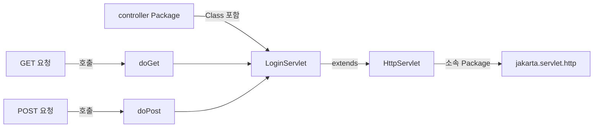

### Java Package

**Package**: 관련 클래스와 Interface를 묶어 관리하는 이름 공간

```java
package controller;

public class LoginServlet {
}
```

```text
controller
└── LoginServlet
```

Controller Package 이름 예시

```java
package controller;
```

```java
package com.example.controller;
```

Java 기본 Package 예시

```java
java.lang   // String, System, Math
java.io     // 파일 입출력
java.util   // List, Map, Scanner
java.sql    // 데이터베이스 연결
```

- `INSERT`, `SELECT`, `UPDATE`, `DELETE`: Package가 아닌 SQL 명령어
- `java.sql`: `Connection`, `Statement`, `PreparedStatement`, `ResultSet` 등의 JDBC 타입 제공

### HttpServletRequest

**HttpServletRequest**: 클라이언트에서 들어온 HTTP 요청 정보를 표현하고 request 영역을 제공하는 Java 객체

- 요청을 직접 전송하는 객체가 아닌 들어온 요청의 객체 표현
- HTTP 요청마다 Container에서 새로운 Request·Response 객체 준비
- 동기 요청의 응답 완료 시 Request 객체와 request 영역의 일반적 종료
- forward 시 같은 Request 객체를 다음 서버 자원에 전달

정보 조회 예시

```java
String method = request.getMethod();
String uri = request.getRequestURI();
String id = request.getParameter("id");
String userAgent = request.getHeader("User-Agent");
String clientIp = request.getRemoteAddr();
```

Parameter와 Attribute 비교

| 구분 | Parameter | Attribute |
| --- | --- | --- |
| 생성 주체 | 주로 클라이언트 | 주로 서버 코드 |
| 읽기 | `getParameter("id")` | `getAttribute("loginUser")` |
| 저장 | Form, Query String, 요청 Body | `setAttribute(name, value)` |
| 기본 값 형태 | 문자열 | 모든 Java 객체 |
| 대표 용도 | 사용자의 입력값 | Controller가 JSP에 전달할 처리 결과 |

### Servlet Filter

**Filter**: 요청이 Servlet에 도착하기 전과 응답이 클라이언트로 돌아가기 전에 공통 작업을 수행하는 객체

주요 용도

- 문자 Encoding 설정
- 로그인 확인
- 권한 검사
- 요청·응답 Logging
- 공통 Header 설정

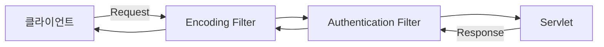

```java
import jakarta.servlet.Filter;
import jakarta.servlet.FilterChain;
import jakarta.servlet.ServletException;
import jakarta.servlet.ServletRequest;
import jakarta.servlet.ServletResponse;
import jakarta.servlet.annotation.WebFilter;

import java.io.IOException;

@WebFilter("/*")
public class EncodingFilter implements Filter {

    @Override
    public void doFilter(
            ServletRequest request,
            ServletResponse response,
            FilterChain chain
    ) throws IOException, ServletException {

        request.setCharacterEncoding("UTF-8");
        response.setCharacterEncoding("UTF-8");

        chain.doFilter(request, response);
    }
}
```

- `chain.doFilter()`: 다음 Filter 또는 Servlet으로 요청 전달
- `chain.doFilter()` 미호출: 요청 흐름 중단
- 로그인하지 않은 사용자의 요청 차단 등에 활용

### Servlet 전체 요청 흐름

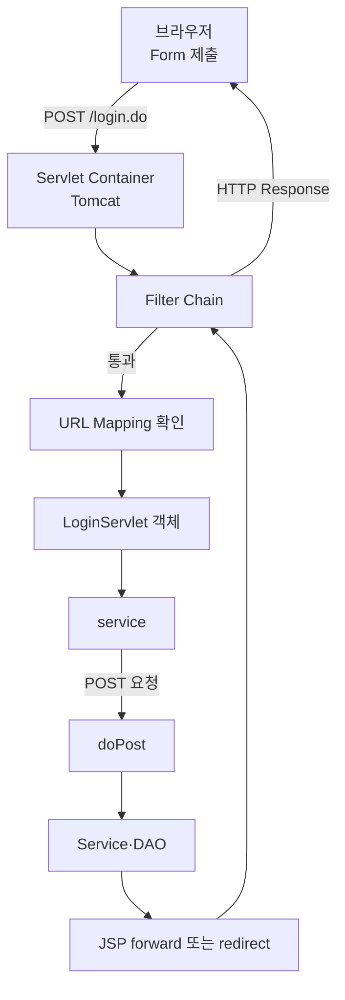

```text
브라우저
→ Tomcat
→ Filter
→ URL Mapping
→ Servlet 객체
→ service()
→ doGet() 또는 doPost()
→ Service·DAO
→ JSP 또는 Redirect
→ 브라우저
```

---

## JSP 스코프와 화면 이동

### 스코프

**스코프(Scope)**: 서버 메모리에 저장한 속성값의 공유 범위와 수명

- JSP의 네 영역은 영구 저장소가 아닌 메모리 속성 저장 공간
- 필요한 범위 중 가장 작은 영역 선택 권장
- 과도하게 넓은 영역 사용 시 메모리 낭비와 사용자 간 데이터 오염 가능성

공통 속성 메서드

```java
setAttribute(String name, Object value)
getAttribute(String name)
removeAttribute(String name)
```

공유 범위 크기

```text
page < request < session < application
```

개념도

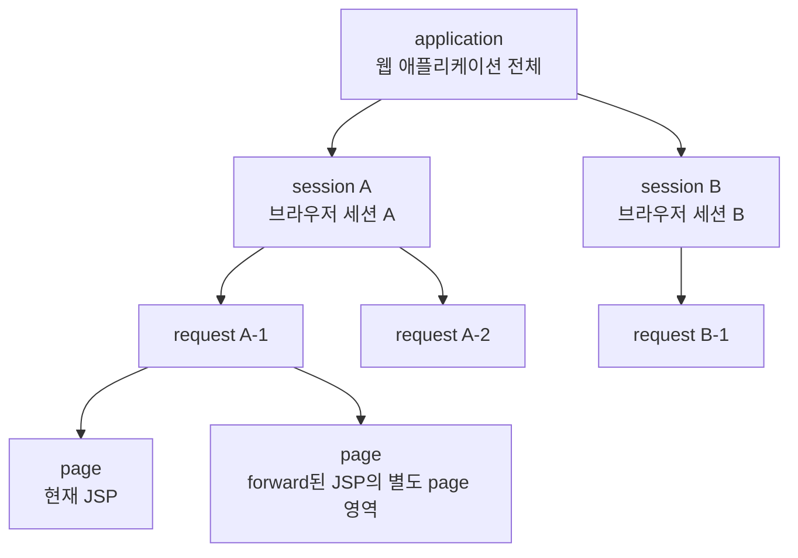

> [!NOTE]
> 위 그림은 실제 Java 객체의 포함 관계가 아닌 수명과 공유 범위의 개념도

### JSP 네 영역

| 영역 | JSP 내장 객체 | Java 타입 예시 | 수명과 공유 범위 | 대표 용도 |
| --- | --- | --- | --- | --- |
| page | `pageContext` | `PageContext` | 현재 JSP 실행 동안 | 페이지 내부 임시값 |
| request | `request` | `HttpServletRequest` | HTTP 요청 한 번 | Controller에서 JSP로 결과 전달 |
| session | `session` | `HttpSession` | 한 클라이언트의 Session | 로그인 사용자, 장바구니 |
| application | `application` | `ServletContext` | 웹 애플리케이션 실행 동안 | 공용 설정, 전체 공지 |

이름과 대소문자

- JSP 내장 객체 변수명: 소문자로 시작
- Java 타입명: 대문자로 시작
- PDF의 `javax.servlet.*`와 Tomcat 10 이상의 `jakarta.servlet.*` 구분
- 한 프로젝트에서 `javax`와 `jakarta` 혼용 금지

### page 영역

```text
JSP 실행 시작
→ page 영역과 pageContext 사용
→ 현재 JSP 안에서 속성 공유
→ JSP 실행 종료
→ page 영역 소멸
```

```jsp
<%
pageContext.setAttribute("message", "현재 JSP에서만 사용");
String message =
    (String) pageContext.getAttribute("message");
%>
```

- 정적 Include `<%@ include %>`: 소스 통합으로 같은 JSP Page 처리 가능성
- 별도로 실행되는 자원으로 이동: 새로운 page 영역

### request 영역

```text
HTTP 요청 도착
→ request 영역 생성
→ Controller에서 속성 저장
→ forward로 같은 request를 JSP에 전달
→ JSP에서 속성 사용
→ 응답 완료
→ request 영역 소멸
```

```java
request.setAttribute("loginCheck", "ok");
request.getRequestDispatcher("/loginOk.jsp")
       .forward(request, response);
```

JSP의 속성 조회

```jsp
<%= request.getAttribute("loginCheck") %>
```

- forward: 같은 Request 사용으로 request 영역 유지
- redirect: 브라우저의 새 Request 발생으로 기존 request 영역 공유 불가

### session 영역

```text
getSession() 호출
→ 기존 Session 확인 또는 새 Session 생성
→ 새 Session ID 발급
→ 브라우저가 Session ID를 Cookie로 보관
→ 다음 요청에 Session ID 전송
→ 서버에서 같은 session 영역 탐색
→ 로그인 상태·장바구니 등 사용자별 값 사용
→ Timeout 또는 invalidate()
→ session 영역 소멸
```

```java
HttpSession session = request.getSession();
session.setAttribute("loginUser", user);
```

Session 구분 기준

- IP 주소가 아닌 일반적으로 Session ID Cookie
- 같은 IP의 다른 브라우저·프로필: 별도 Cookie 저장소로 보통 별도 Session
- 같은 브라우저 프로필의 여러 Tab: 보통 같은 Session Cookie 공유
- 브라우저 종료: Session Cookie 소멸 가능성
- 브라우저 종료만으로 서버 Session의 즉시 삭제 보장 없음
- 서버 Session 종료: Timeout, `invalidate()`, 애플리케이션 종료 등

로그아웃

```java
request.getSession().invalidate();
```

### application 영역

```text
웹 애플리케이션 시작 또는 배포
→ ServletContext와 application 영역 생성
→ 모든 사용자·JSP·Servlet에서 속성 공유
→ 웹 애플리케이션 중지 또는 재배포
→ application 영역 소멸
```

```java
ServletContext application = request.getServletContext();
application.setAttribute("serviceNotice", "오늘 18시에 점검");
```

- `ServletContext` 개수: 서버 전체에 하나가 아닌 웹 애플리케이션마다 하나
- 모든 요청 Thread에서 공유
- 변경 가능한 객체 저장 시 동시성 문제 고려

### 로그인 정보와 application 영역

잘못된 로그인 상태 저장

```java
ServletContext application = request.getServletContext();
application.setAttribute("loginCheck", "ok");
```

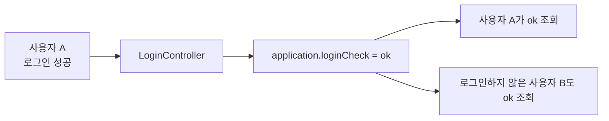

문제점

- 사용자 A의 로그인 성공값을 사용자 B도 조회 가능
- 사용자별 로그인 상태 분리 실패
- 인증 상태 오염에 따른 보안 오류
- Container 크기나 개수 감소와 무관
- `ServletContext`에 속성 참조를 추가한 만큼 메모리 사용

저장 위치 선택

| 데이터 | 권장 위치 |
| --- | --- |
| 한 번의 요청에서 JSP로 전달할 성공·실패 결과 | request |
| 다음 요청까지 유지할 사용자별 로그인 상태 | session |
| 모든 사용자에게 동일한 공지·공용 설정 | application |
| 회원·주문·게시글 등 영구 데이터 | Database |

### 메모리 저장과 영속 저장

**영속성(Persistence)**: 프로그램 또는 서버 종료 뒤에도 데이터가 유지되는 성질

| 저장 위치 | 서버 재시작 이후 | 대표 용도 |
| --- | --- | --- |
| page·request 메모리 | 소멸 | 화면 처리용 임시 데이터 |
| session 메모리 | 일반적으로 소멸 가능 | 사용자별 임시 상태 |
| application 메모리 | 소멸 | 애플리케이션 공용 Cache·설정 |
| Database | 유지 | 회원, 주문, 게시글 |
| File | 유지 | 업로드 파일, Log, 설정 |

- JSP 네 스코프: 메모리 공유 범위이지 영구 저장소가 아닌 구조
- Session의 File·외부 저장소 보존: 별도 Session 영속화 설정 필요

### forward

**forward**: 서버 내부에서 현재 요청을 다른 서버 자원으로 전달하는 이동 방식

```java
request.setAttribute("loginError", "로그인 실패");
request.getRequestDispatcher("/loginFail.jsp")
       .forward(request, response);
```

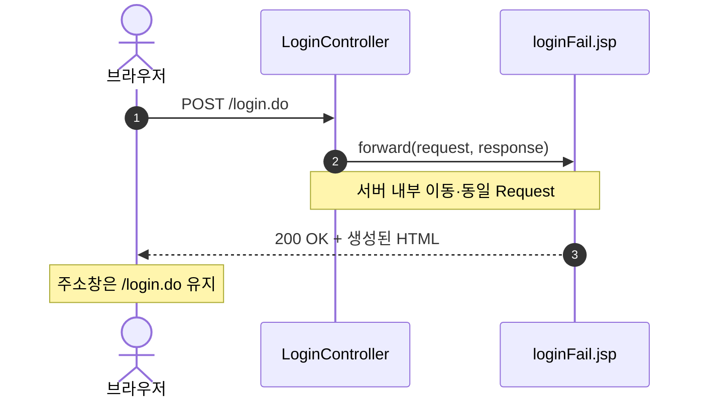

특징

- 브라우저 요청 횟수: 한 번
- 주소창 URL: 기존 요청 URL 유지
- 기존 request 영역 유지
- Controller 처리 결과를 JSP에 전달할 때 적합

### redirect

**redirect**: 서버가 새 주소를 안내하고 브라우저가 해당 주소로 다시 요청하는 이동 방식

```java
response.sendRedirect(
    request.getContextPath() + "/loginOk.jsp"
);
```

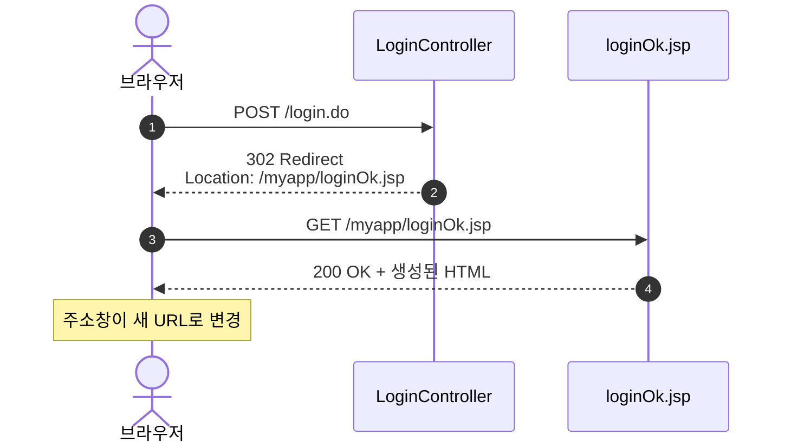

특징

- HTTP 요청 횟수: 두 번
- 브라우저의 새 Request 생성
- 기존 request 영역 공유 불가
- 새 Request까지 값 유지 시 Session 또는 별도 저장 방식 필요
- 외부 Site 이동 가능
- 로그인·게시글 등록 등 POST 성공 후 화면 이동에 적합

**PRG(Post/Redirect/Get)**: POST 처리 후 redirect를 거쳐 새로운 GET 화면으로 이동하는 Pattern

- 새로고침에 따른 중복 POST 위험 감소
- 동일 등록 요청의 반복 실행 방지에 도움

### forward와 redirect 비교

| 구분 | forward | redirect |
| --- | --- | --- |
| 이동 주체 | 서버 | 브라우저 |
| HTTP 요청 횟수 | 한 번 | 두 번 |
| 주소창 변경 | 없음 | 있음 |
| request 영역 | 유지 | 미유지 |
| 외부 Site 이동 | 불가능 | 가능 |
| 처리 특성 | 새 HTTP 요청 없는 내부 이동 | 새 요청 한 번 추가 |
| 대표 용도 | Controller 결과를 JSP에 전달 | POST 성공 후 결과·목록 화면 이동 |
| 새로고침 위험 | POST 재전송 가능성 | PRG 적용 시 중복 POST 감소 |

선택 기준

- 현재 Request의 처리 결과를 JSP에 전달: forward
- 브라우저에서 새 URL 요청 필요: redirect

### 로그인 Form·Controller 예시

`login.jsp`

```jsp
<%@ page contentType="text/html; charset=UTF-8" %>
<!doctype html>
<html lang="ko">
<head>
    <meta charset="UTF-8">
    <title>로그인</title>
</head>
<body>
    <form action="${pageContext.request.contextPath}/login.do"
          method="post">
        <label>
            아이디
            <input type="text" name="id" required>
        </label>
        <label>
            비밀번호
            <input type="password" name="password" required>
        </label>
        <button type="submit">로그인</button>
    </form>
</body>
</html>
```

`LoginController.java`

```java
package controller;

import java.io.IOException;

import javax.servlet.ServletException;
import javax.servlet.annotation.WebServlet;
import javax.servlet.http.HttpServlet;
import javax.servlet.http.HttpServletRequest;
import javax.servlet.http.HttpServletResponse;
import javax.servlet.http.HttpSession;

@WebServlet("/login.do")
public class LoginController extends HttpServlet {

    @Override
    protected void doPost(
            HttpServletRequest request,
            HttpServletResponse response
    ) throws ServletException, IOException {

        request.setCharacterEncoding("UTF-8");

        String id = request.getParameter("id");
        String password = request.getParameter("password");

        // 실습용 조건
        // 실제 서비스: DB 조회 + Password Hash 검증
        boolean loginSuccess =
            "hong".equals(id) && "1234".equals(password);

        if (loginSuccess) {
            HttpSession session = request.getSession();
            session.setAttribute("loginUser", id);

            response.sendRedirect(
                request.getContextPath() + "/loginOk.jsp"
            );
            return;
        }

        request.setAttribute(
            "loginError",
            "아이디 또는 비밀번호가 맞지 않아"
        );
        request.getRequestDispatcher("/loginFail.jsp")
               .forward(request, response);
    }
}
```

실무형 View 배치

```text
/WEB-INF/views/loginOk.jsp
/WEB-INF/views/loginFail.jsp
```

- `/WEB-INF` 아래 JSP에 대한 브라우저 직접 접근 차단
- redirect로 접근 불가
- Controller의 서버 내부 forward를 통한 접근
- JSP 처리 로직을 Controller로 옮길 때의 효과: 중복 로직 감소와 역할 분리 개선
- JSP 처리 로직 이동과 Container 크기 감소는 무관

### 자주 헷갈리는 표현

| 헷갈리는 표현 | 정확한 표현 |
| --- | --- |
| HTTP 메시지와 POST의 동일시 | HTTP 메시지 전체와 시작줄의 POST는 서로 다른 범위 |
| JSP 원본의 브라우저 전송 | 서버에서 JSP 실행 후 생성된 HTML 전송 |
| POST Body에 문서 전체 저장 | Form 입력값 등 전송 데이터 저장 |
| `HttpServletRequest`를 요청 전송 객체로 이해 | 들어온 요청 정보 표현과 request 영역 제공 |
| `login.do`를 보안 장치로 이해 | 내부 구현과 외부 URL 분리용 Mapping |
| Controller를 직접 구현한 완전한 Singleton으로 이해 | Container가 보통 등록당 한 인스턴스를 생성해 Thread 간 공유 |
| 같은 IP를 같은 Session으로 이해 | 일반적으로 Session ID Cookie로 구분 |
| 브라우저 종료를 서버 Session 즉시 삭제로 이해 | Timeout·`invalidate()` 등으로 서버 Session 종료 |
| application에 사용자 로그인 결과 저장 | 사용자별 분리가 불가능하므로 session에 저장 |
| Scope를 영구 저장소로 이해 | 서버 메모리 속성의 공유 범위와 수명 |

---

## Java 기반 개념

### 클래스와 객체

```text
클래스 = 객체 생성을 위한 설계도
객체   = 클래스를 기반으로 실제 생성한 대상
객체   = 필드 + 메서드
```

클래스 예시

```java
class Person {

    String name;
    int age;

    void eat() {
    }
}
```

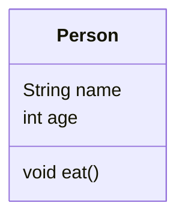

```text
Person 클래스
├── 필드
│   ├── String name
│   └── int age
└── 메서드
    └── void eat()
```

객체 생성

```java
Person p1 = new Person();
Person p2 = new Person();
```

```text
Person       = 클래스이자 참조 변수의 타입
p1, p2       = 참조 변수
new Person() = 객체 생성 표현식
```

```mermaid
flowchart LR
    C[Person 클래스<br/>설계도]
    V1[p1<br/>참조 변수]
    V2[p2<br/>참조 변수]
    O1[Person 객체 1<br/>name·age·eat]
    O2[Person 객체 2<br/>name·age·eat]

    C -->|new| O1
    C -->|new| O2
    V1 -->|참조| O1
    V2 -->|참조| O2
```

- `p1`과 `p2`: 서로 다른 객체를 참조
- 같은 클래스에서 여러 객체 생성 가능

### 객체지향의 세 가지 특징

```text
상속   = 기존 클래스의 기능을 물려받는 구조
다형성 = 같은 타입·호출이 실제 객체에 따라 다르게 동작하는 특징
캡슐화 = 데이터와 기능을 묶고 외부의 직접 접근을 제한하는 특징
```

#### 상속

**상속(Inheritance)**: 기존 클래스의 필드와 메서드를 새로운 클래스에서 물려받는 구조

```java
class Person {

    String name;
    int age;

    void eat() {
    }
}

class Student extends Person {

    String sn;
}
```

```mermaid
classDiagram
    direction TB

    class Person {
        String name
        int age
        void eat()
    }

    class Student {
        String sn
    }

    Person <|-- Student : extends
```

```text
Person
├── String name
├── int age
└── void eat()
        △
        │ extends
        │
Student
└── String sn
```

- `Person`: 부모 클래스
- `Student`: 자식 클래스
- `extends`: 상속 키워드
- `Student` 객체에서 `name`, `age`, `eat()`, `sn` 사용 가능

#### 다형성

**다형성(Polymorphism)**: 부모 타입 하나로 여러 자식 객체를 참조하고, 실제 객체에 따라 오버라이딩된 동작을 실행하는 특징

```java
class Animal {

    void sound() {
        System.out.println("동물 소리");
    }
}

class Dog extends Animal {

    @Override
    void sound() {
        System.out.println("멍멍");
    }
}

class Cat extends Animal {

    @Override
    void sound() {
        System.out.println("야옹");
    }
}
```

```java
Animal animal1 = new Dog();
Animal animal2 = new Cat();

animal1.sound(); // 멍멍
animal2.sound(); // 야옹
```

```mermaid
flowchart TD
    A1[Animal 타입] -->|참조| D[Dog 객체]
    A2[Animal 타입] -->|참조| C[Cat 객체]
    D -->|오버라이딩 메서드| DS[sound → 멍멍]
    C -->|오버라이딩 메서드| CS[sound → 야옹]
```

다형성과 관련된 형변환

```text
다형성
├── 부모 타입으로 여러 자식 객체 참조
├── 실제 객체에 따른 오버라이딩 메서드 실행
└── 상속 관계의 형변환
    ├── 업캐스팅
    └── 다운캐스팅
```

#### 캡슐화

**캡슐화(Encapsulation)**: 객체의 내부 데이터를 숨기고 공개 메서드를 통해 접근을 제어하는 방식

```java
class Person {

    private String name;
    private int age;

    public void setName(String name) {
        this.name = name;
    }

    public String getName() {
        return name;
    }
}
```

```text
private = 외부 직접 접근 제한
getter  = 값 조회
setter  = 값 변경
```

```mermaid
flowchart LR
    A[외부 코드] -->|setter·값 변경| B[Person 객체]
    B -->|getter·값 반환| A
    A -.->|직접 접근 불가| C[private 필드]
    B -->|내부 관리| C
```

### 업캐스팅과 다운캐스팅

예제 구조

```java
class Person {

    String name;
    int age;

    void eat() {
    }
}

class Student extends Person {

    String sn;
}
```

#### 업캐스팅

**업캐스팅(Upcasting)**: 자식 객체를 부모 타입 변수로 참조하는 형변환

```java
Person s1 = new Student();
```

```text
참조 변수 타입 = Person
실제 객체       = Student
```

- 자동 형변환으로 `(Person)` 생략 가능
- 참조 변수 타입인 `Person`에 선언된 멤버까지 접근 가능
- 실제 객체의 `Student.sn`에는 `s1`을 통한 직접 접근 불가

```java
s1.name = "홍길동";
s1.age = 10;
s1.eat();

// 컴파일 오류
// s1.sn = "12345";
```

#### 다운캐스팅

**다운캐스팅(Downcasting)**: 부모 타입 참조를 자식 타입으로 명시적으로 변환하는 형변환

```java
Student s2 = (Student) s1;

s2.name = "홍길동";
s2.age = 10;
s2.eat();
s2.sn = "12345";
```

- 자동 변환 불가
- `(Student)`와 같은 명시적 형변환 필요
- 부모 타입이 항상 특정 자식 객체를 가리킨다는 보장이 없기 때문

컴파일 오류 예시

```java
Person s1 = new Student();

// 명시적 형변환 부재
Student s2 = s1;
```

상속·참조 구조

```mermaid
flowchart LR
    S1[s1<br/>Person 타입]
    S2[s2<br/>Student 타입]
    OBJ[Student 객체]

    S1 -->|업캐스팅 참조| OBJ
    S2 -->|다운캐스팅 후 참조| OBJ
    OBJ --> NAME[String name]
    OBJ --> AGE[int age]
    OBJ --> EAT[void eat]
    OBJ --> SN[String sn]
```

접근 범위

```mermaid
flowchart LR
    S1[s1<br/>Person 타입] -->|접근 가능| P[name·age·eat]
    S1 -.->|접근 불가| SN1[sn]
    S2[s2<br/>Student 타입] -->|접근 가능| ALL[name·age·eat·sn]
```

안전한 다운캐스팅

```java
Person person = new Student();

if (person instanceof Student) {
    Student student = (Student) person;
    student.sn = "12345";
}
```

실제 객체가 다른 경우의 실행 오류

```java
Person person = new Person();
Student student = (Student) person; // ClassCastException
```

### Singleton Pattern

**Singleton**: 특정 클래스의 객체를 하나만 생성해 공동으로 사용하는 Pattern

일반 클래스의 서로 다른 객체

```java
Person p1 = new Person();
Person p2 = new Person();

System.out.println(p1 == p2); // false
```

Singleton 클래스

```java
public class Singleton {

    private static final Singleton instance =
        new Singleton();

    private Singleton() {
    }

    public static Singleton getInstance() {
        return instance;
    }
}
```

사용 예시

```java
Singleton s1 = Singleton.getInstance();
Singleton s2 = Singleton.getInstance();

System.out.println(s1 == s2); // true
```

```mermaid
flowchart TD
    C[Singleton 클래스] -->|클래스 내부에서 한 번 생성| O[Singleton 객체 한 개]
    S1[s1] -->|참조| O
    S2[s2] -->|참조| O
    N[외부 new] -.->|private 생성자로 차단| C
```

구성 요소

```java
private static final Singleton instance =
    new Singleton();
```

- `static`: 클래스에 한 개 존재
- `final`: 다른 객체로 참조 변경 불가
- `private`: 외부 직접 접근 제한

```java
private Singleton() {
}
```

- 외부의 `new Singleton()` 차단

```java
public static Singleton getInstance() {
    return instance;
}
```

- 객체 생성 없이 호출 가능한 메서드
- 유일한 객체 반환

Servlet과 Singleton Pattern의 차이

- Servlet: Container가 일반적으로 등록당 한 인스턴스를 생성하고 관리
- Singleton Pattern: 개발자가 생성자와 `static` 멤버로 단일 객체 생성 규칙 구현
- 둘 다 객체 공유의 외형은 비슷하지만 생성·관리 주체와 구현 방식에서 차이

### 메서드 오버로딩

**오버로딩(Overloading)**: 같은 클래스 또는 상속 관계에서 같은 이름의 메서드를 서로 다른 매개변수 목록으로 여러 개 선언하는 기능

구분 조건

```text
1. 매개변수 개수
2. 매개변수 타입
3. 매개변수 타입의 순서
```

판단 기준에서 제외되는 항목

- 반환 타입
- 매개변수 이름

가능한 선언

```java
class Person {

    void eat() {
    }

    void eat(int amount) {
    }

    void eat(int amount, int time) {
    }

    void eat(float amount, int time) {
    }

    void eat(int amount, float time) {
    }
}
```

```mermaid
flowchart TD
    E[eat] -->|매개변수 개수| E1[eat int]
    E -->|매개변수 개수| E2[eat int·int]
    E2 -->|매개변수 타입| E3[eat float·int]
    E3 -->|타입 순서| E4[eat int·float]
```

반환 타입만 다른 경우

```java
void eat() {
}

int eat() { // 컴파일 오류
    return 10;
}
```

두 메서드의 Signature

```text
eat()
eat()
```

매개변수 이름만 다른 경우

```java
void eat(int a, int b) {
}

void eat(int b, int a) { // 컴파일 오류
}
```

두 메서드의 Signature

```text
eat(int, int)
eat(int, int)
```

| 메서드 조합 | 가능 여부 | 이유 |
| --- | --- | --- |
| `eat()` | 가능 | 기본 메서드 |
| `eat(int)` | 가능 | 매개변수 개수 차이 |
| `eat(int, int)` | 가능 | 매개변수 개수 차이 |
| `eat(float, int)` | 가능 | 매개변수 타입 차이 |
| `eat(int, float)` | 가능 | 타입 순서 차이 |
| `void eat()`·`int eat()` | 불가능 | 반환 타입만 차이 |
| `eat(int a, int b)`·`eat(int b, int a)` | 불가능 | 매개변수 이름만 차이 |

### 메서드 오버라이딩

**오버라이딩(Overriding)**: 부모 클래스에서 상속받은 메서드를 자식 클래스의 목적에 맞게 다시 정의하는 기능

```java
class Person {

    void eat() {
        System.out.println("사람이 먹는다");
    }
}

class Student extends Person {

    @Override
    void eat() {
        System.out.println("학생이 먹는다");
    }
}
```

```mermaid
flowchart TD
    P[Person<br/>void eat] -->|extends·상속| S[Student]
    S -->|Override·재정의| SE[void eat<br/>학생이 먹음]
```

실행 예시

```java
Person person = new Person();
Student student = new Student();

person.eat();  // 사람이 먹음
student.eat(); // 학생이 먹음
```

다형성과 오버라이딩

```java
Person person = new Student();

person.eat(); // 학생이 먹음
```

```text
참조 변수 타입 = Person
실제 객체       = Student
실행 메서드     = Student.eat()
```

오버라이딩 조건

```text
1. 부모·자식 상속 관계
2. 같은 메서드 이름
3. 같은 매개변수 개수
4. 같은 매개변수 타입과 순서
5. 같거나 호환 가능한 반환 타입
6. 부모보다 좁게 변경할 수 없는 접근 범위
```

`@Override`의 역할

- 부모 메서드의 재정의 의도 표시
- 메서드명이나 매개변수 오류를 컴파일 단계에서 확인
- 오버라이딩 메서드에 사용 권장

오버라이딩이 아닌 예시

```java
class Person {

    void eat() {
    }
}

class Student extends Person {

    void eat(int amount) {
    }
}
```

```text
Person  = eat()
Student = eat(int)
```

- 서로 다른 매개변수 목록
- 오버라이딩이 아닌 새로운 오버로드 메서드 추가

### 오버로딩과 오버라이딩 비교

| 구분 | 오버로딩 | 오버라이딩 |
| --- | --- | --- |
| 영문 | Overloading | Overriding |
| 위치 | 같은 클래스 또는 상속 관계 | 부모·자식 클래스 |
| 상속 관계 | 불필요 | 필요 |
| 메서드 이름 | 동일 | 동일 |
| 매개변수 | 서로 달라야 함 | 동일해야 함 |
| 반환 타입 | 판단 기준 아님 | 같거나 호환 가능 |
| 목적 | 여러 입력 방식 제공 | 부모 기능을 자식 목적에 맞게 변경 |
| 관련 개념 | 편의성 | 다형성 |
| Annotation | 없음 | `@Override` 권장 |

```mermaid
flowchart LR
    A[같은 이름의 메서드] --> B{매개변수가 같은가}
    B -->|다름| C[오버로딩]
    B -->|같음| D{부모·자식 관계인가}
    D -->|예| E[오버라이딩]
    D -->|아니오| F[중복 선언<br/>컴파일 오류]
```

```text
오버로딩
→ 같은 메서드 이름
→ 서로 다른 매개변수 목록

오버라이딩
→ 부모·자식 상속 관계
→ 같은 메서드 형태
→ 자식 클래스에서 내용 재정의
```

---

## 트랜잭션

**트랜잭션(Transaction)**: 여러 데이터베이스 작업을 하나의 논리적 작업 단위로 묶는 기능

계좌 송금 예시

```text
1. A 계좌에서 10,000원 차감
2. B 계좌에 10,000원 추가
```

- 두 작업의 전체 성공 또는 전체 취소 필요
- 일부 작업만 반영되는 데이터 불일치 방지

```mermaid
flowchart TD
    A[트랜잭션 시작] --> B[A 계좌 10,000원 차감]
    B --> C[B 계좌 10,000원 추가]
    C --> D{모든 작업 성공 여부}
    D -->|성공| E[COMMIT<br/>최종 저장]
    D -->|실패| F[ROLLBACK<br/>전체 취소]
```

**COMMIT**: 트랜잭션에서 변경한 내용을 데이터베이스에 최종 저장

**ROLLBACK**: 트랜잭션에서 진행한 변경을 취소하고 이전 상태로 복구

---

## 이미지 저장 전략

### 전체 선택지

1. DB의 BLOB Column에 이미지 Byte 저장
2. Backend Server의 Local Disk에 이미지 저장
3. Object Storage에 이미지 저장하고 DB에 Metadata 기록

### 방식 비교

| 항목 | DB BLOB | 서버 디스크 | Object Storage |
| --- | --- | --- | --- |
| 실제 이미지 위치 | Database | Backend Server | S3 같은 전용 저장소 |
| DB 기록 | 이미지 Byte와 Metadata | File 경로 | Object Key와 Metadata |
| 구현 난이도 | 보통 | 낮음 | 보통 |
| 확장성 | 낮은 편 | 낮은 편 | 높은 편 |
| CDN 연결 | 불편 | 별도 구성 | 쉬운 편 |
| 주요 용도 | 소규모·강한 일관성 | 학습·단일 Server | 일반 운영 Service |

### DB BLOB

**BLOB(Binary Large Object)**: 이미지·영상·문서 같은 이진 데이터를 저장하기 위한 DB 자료형

- File 자체를 DB 행에 저장하는 방식
- Metadata와 Binary Data를 같은 Transaction 범위에서 관리하기 쉬운 특징
- DB 크기와 Backup 부담 증가 가능성
- 대규모 정적 File 전달과 CDN 활용에는 불리한 구조

테이블 예시

```sql
CREATE TABLE images (
    id BIGINT AUTO_INCREMENT PRIMARY KEY,
    original_name VARCHAR(255) NOT NULL,
    content_type VARCHAR(100) NOT NULL,
    image_data LONGBLOB NOT NULL
);
```

조회 흐름

```mermaid
sequenceDiagram
    actor Client as 클라이언트
    participant Backend as 백엔드
    participant DB as 데이터베이스

    Client->>Backend: 이미지 조회 요청
    Backend->>DB: BLOB과 Content-Type 조회
    DB-->>Backend: 이미지 Byte와 Metadata
    Backend-->>Client: 이미지 Byte 응답
```

> [!NOTE]
> Week05 원본의 조회 흐름 Mermaid는 `actor Client as 클라이언트`에서 종료된 미완성 상태  
> 위 Diagram은 원본의 DB BLOB 조회 문맥을 보존하면서 정상 렌더링이 가능하도록 흐름을 보완한 형태

### 서버 Local Disk

- 업로드 File을 Backend Server의 특정 Directory에 저장
- DB에는 File 경로와 이름 등 Metadata 저장
- 구현이 단순해 학습·단일 Server 환경에 적합
- Server가 여러 대일 때 File 동기화 문제
- 배포·교체·장애 시 File 유실 위험
- 용량 확장과 Backup 정책의 별도 설계 필요

### Object Storage

- S3 같은 전용 Object Storage에 File 저장
- DB에는 Object Key, URL, 원본 이름, Content-Type 등 Metadata 저장
- 다중 Server와 대규모 File 처리에 적합
- CDN 연결과 수평 확장에 유리
- 인증 URL, 접근 권한, 삭제 정책, 비용 관리 필요

---

## 3. DTO

### 3.1 개념

**DTO**: 테이블 레코드 한 행에 해당하는 데이터를 담아 계층 사이에서 전달하는 객체

### 3.2 필요한 이유

- 여러 값을 하나의 객체로 묶어서 전달
- Controller와 DAO 사이의 매개변수 단순화
- 데이터 구조의 명확한 표현
- Spring의 자동 데이터 바인딩과 매핑을 위한 기반

### 3.3 작성 규칙

- 테이블마다 DTO 클래스 한 개 구성
- 테이블의 열 이름과 DTO 필드 이름의 일치 권장
- 테이블의 SQL 자료형과 Java 필드 자료형의 대응
- 모든 필드를 `private`으로 선언
- 각 필드에 대한 `public` getter와 setter 제공
- 필요할 때마다 새로운 DTO 객체 생성

### 3.4 테이블과 DTO 대응

| DB 필드 | SQL 자료형 예시 | Java 자료형 예시 |
| --- | --- | --- |
| `id` | `VARCHAR` | `String` |
| `password` | `VARCHAR` | `String` |
| `name` | `VARCHAR` | `String` |
| `role` | `VARCHAR` | `String` |
| `age` | `INT` | `int` 또는 `Integer` |
| `created_at` | `DATETIME` | `LocalDateTime` 또는 `Timestamp` |

### 3.5 UsersDTO 예시

```java
package model;

public class UsersDTO {

    private String id;
    private String password;
    private String name;
    private String role;

    public String getId() {
        return id;
    }

    public void setId(String id) {
        this.id = id;
    }

    public String getPassword() {
        return password;
    }

    public void setPassword(String password) {
        this.password = password;
    }

    public String getName() {
        return name;
    }

    public void setName(String name) {
        this.name = name;
    }

    public String getRole() {
        return role;
    }

    public void setRole(String role) {
        this.role = role;
    }
}
```

### 3.6 캡슐화

**캡슐화**: 객체의 내부 데이터를 외부에서 직접 변경하지 못하도록 접근을 제한하는 설계 원칙

직접 접근이 불가능한 코드

```java
dto.id = "user01";
```

setter와 getter를 이용한 접근

```java
dto.setId("user01");
String id = dto.getId();
```

### 3.7 객체 생성 범위

수업 기준 정리

- Controller만 하나의 객체를 공유하는 구조로 설명
- DTO는 데이터 한 건마다 새로운 객체 생성
- DAO는 수업 예제에서 요청 처리 과정마다 새로운 객체 생성
- DTO와 DAO에 싱글톤 적용 없음

정확한 Servlet 관점

- Servlet 컨테이너가 URL 매핑별 Servlet 인스턴스를 일반적으로 한 개 생성
- 하나의 Servlet 인스턴스에서 여러 요청 스레드를 동시에 처리
- 직접 작성하는 GoF Singleton 패턴과는 구분되는 컨테이너 관리 객체
- 요청별 데이터를 Controller의 인스턴스 필드에 저장할 경우 동시성 문제 가능성
- 요청별 데이터는 `doGet()`·`doPost()`의 지역변수, request, session 등에 저장

```java
@WebServlet("/login")
public class LoginController extends HttpServlet {

    // 여러 요청이 공유할 수 있으므로 사용자별 데이터 저장 금지
    // private String currentUserId;

    @Override
    protected void doPost(
            HttpServletRequest request,
            HttpServletResponse response) {

        // 요청마다 독립적인 지역변수
        String id = request.getParameter("id");
    }
}
```

시험용 핵심 문장

> Controller는 Servlet 컨테이너가 관리하는 단일 인스턴스를 여러 요청에서 공유하며, DTO와 DAO는 수업 구조에서 필요한 만큼 생성하는 객체

---

## 4. 여러 레코드와 컬렉션

### 4.1 고정 배열의 한계

```java
UsersDTO[] users = new UsersDTO[3];
```

- 생성 시 크기 확정
- 기존 배열의 길이 변경 불가
- 더 큰 공간이 필요할 경우 새 배열 생성과 데이터 복사 필요

### 4.2 ArrayList

**ArrayList**: 원소 수에 따라 내부 저장 공간을 확장할 수 있는 `List` 구현체

```java
List<UsersDTO> users = new ArrayList<>();
```

- 데이터 개수에 따른 크기 확장
- `add()`, `get()`, `remove()`, `size()` 등의 메서드 제공
- 여러 조회 결과를 Controller에 전달하기 적합한 구조

### 4.3 여러 레코드 변환

```java
List<UsersDTO> users = new ArrayList<>();

while (rs.next()) {
    UsersDTO dto = new UsersDTO();

    dto.setId(rs.getString("id"));
    dto.setPassword(rs.getString("password"));
    dto.setName(rs.getString("name"));
    dto.setRole(rs.getString("role"));

    users.add(dto);
}
```

### 4.4 반환 구조

```text
ResultSet의 첫 번째 행  → UsersDTO 객체 1
ResultSet의 두 번째 행  → UsersDTO 객체 2
ResultSet의 세 번째 행  → UsersDTO 객체 3
                           ↓
                     List<UsersDTO>
```

---

## 5. 회원가입 요청 흐름

### 5.1 View

```html
<form action="register" method="post">
    <input type="text" name="id">
    <input type="password" name="password">
    <input type="text" name="name">
    <button type="submit">회원가입</button>
</form>
```

### 5.2 POST 요청

**POST**: 생성 또는 데이터 변경 요청에 주로 사용하는 HTTP 메서드

- 폼 데이터를 HTTP 요청 body에 포함
- URL 매핑값을 기준으로 Servlet Controller 선택
- `doPost()` 메서드에서 요청 처리

### 5.3 Controller 매핑

```java
@WebServlet("/register")
public class RegisterController extends HttpServlet {

    @Override
    protected void doPost(
            HttpServletRequest request,
            HttpServletResponse response)
            throws ServletException, IOException {

        // 요청 처리
    }
}
```

### 5.4 파라미터 추출과 DTO 구성

```java
String id = request.getParameter("id");
String password = request.getParameter("password");
String name = request.getParameter("name");

UsersDTO dto = new UsersDTO();
dto.setId(id);
dto.setPassword(password);
dto.setName(name);
dto.setRole("user");
```

### 5.5 DAO 호출

```java
UsersDAO dao = new UsersDAO();
int result = dao.register(dto);
```

---

## 6. DAO

### 6.1 개념

**DAO**: JDBC 코드와 SQL을 이용해 데이터베이스 접근을 전담하는 객체

### 6.2 필요한 이유

DAO가 없는 구조

```text
RegisterController ─ JDBC 코드
LoginController    ─ JDBC 코드
UpdateController   ─ JDBC 코드
DeleteController   ─ JDBC 코드
```

DAO를 적용한 구조

```text
RegisterController ─┐
LoginController    ─┼─→ UsersDAO ─→ MySQL
UpdateController   ─┤
DeleteController   ─┘
```

### 6.3 장점

- JDBC 중복 코드 감소
- Controller의 요청 처리 책임과 DB 처리 책임 분리
- SQL 수정 위치의 일원화
- 기능별 메서드 구성
- 유지보수성과 테스트 편의성 향상

### 6.4 테이블별 모델 구성

```text
users 테이블       → UsersDTO, UsersDAO
products 테이블    → ProductsDTO, ProductsDAO
orders 테이블      → OrdersDTO, OrdersDAO
boards 테이블      → BoardsDTO, BoardsDAO
comments 테이블    → CommentsDTO, CommentsDAO
```

### 6.5 DTO와 DAO 비교

| 구분 | DTO | DAO |
| --- | --- | --- |
| 목적 | 데이터 보관과 전달 | DB 접근과 SQL 실행 |
| 주요 내용 | 필드, getter, setter | JDBC 코드, CRUD 메서드 |
| 데이터 방향 | 양방향 전달 | DB 입출력 처리 |
| 일반적 단위 | 테이블 한 행 | 테이블 한 개 |

---

## 7. JDBC와 Connector/J

### 7.1 JDBC

**JDBC(Java Database Connectivity)**: Java 애플리케이션에서 DBMS에 연결하고 SQL을 실행하기 위한 표준 API

### 7.2 Connector/J

**MySQL Connector/J**: Java의 JDBC API와 MySQL 서버 사이의 통신을 담당하는 JDBC 드라이버

### 7.3 준비 절차

1. MySQL Community Downloads 접속
2. Connector/J 선택
3. Archives에서 DB 버전에 맞는 드라이버 선택
4. 운영체제 항목에서 `Platform Independent` 선택
5. ZIP 파일 다운로드와 압축 해제
6. Connector/J JAR 파일 확인
7. Servlet 프로젝트의 라이브러리 경로에 JAR 파일 배치

### 7.4 Servlet 프로젝트 배치 경로

일반 Dynamic Web Project 구조

```text
WebContent/
└── WEB-INF/
    └── lib/
        └── mysql-connector-j-8.x.x.jar
```

Maven 표준 웹 구조

```text
src/
└── main/
    └── webapp/
        └── WEB-INF/
            └── lib/
```

### 7.5 버전 관리

- MySQL 서버 버전과 Connector/J 호환성 확인
- DBMS 업그레이드 시 드라이버 버전 점검
- 여러 외부 라이브러리를 직접 관리할 때 발생하는 유지보수 부담
- Spring 프로젝트에서 Maven 또는 Gradle 활용

---

## 8. 라이브러리 관리

### 8.1 빌드

**빌드**: 소스 컴파일, 의존성 연결, 테스트, 패키징 등을 거쳐 실행 가능한 결과물을 만드는 과정

```text
.java → .class
.java 파일들 → .jar 또는 .war
```

```mermaid
flowchart LR
    A[Java Source<br/>.java] -->|Compile| B[Bytecode<br/>.class]
    B -->|Packaging| C[실행·배포 File<br/>.jar]
    B -->|Web Packaging| D[Web 배포 File<br/>.war]
```

### 8.1.1 Library

**Library**: 프로그램에서 필요한 기능을 개발자가 호출해 사용하는 코드 모음

예시

- Gson
- Lombok
- MySQL Connector/J

### 8.1.2 Framework

**Framework**: 프로그램의 전체 구조와 실행 흐름을 제공하고, 정해진 지점에서 개발자의 코드를 호출하는 기반

예시

- Spring Framework
- Spring Boot

### 8.1.3 Build Tool

**Build Tool**: Compile, Test, Packaging 등의 Build 과정과 Library Dependency를 관리하는 도구

예시

- Maven
- Gradle

### 8.1.4 개념 비교

| 구분 | 역할 | 예시 |
| --- | --- | --- |
| Build | Code Compile과 결과물 생성 과정 | `.class`, `.jar`, `.war` |
| Library | 필요한 기능을 가져와 사용 | Gson, Lombok, Connector/J |
| Framework | Application 구조와 실행 흐름 제공 | Spring, Spring Boot |
| Build Tool | Build와 Library Dependency 관리 | Maven, Gradle |

### 8.2 Maven과 Gradle

| 도구 | 대표 설정 파일 | 특징 |
| --- | --- | --- |
| Maven | `pom.xml` | XML 기반 의존성·빌드 설정 |
| Gradle | `build.gradle` | Groovy 또는 Kotlin DSL 기반 설정 |

### 8.3 역할

- 외부 라이브러리 자동 다운로드
- 라이브러리 버전 관리
- 의존 라이브러리 연결
- 프로젝트 빌드 자동화
- 직접 JAR 파일을 복사하는 작업의 감소

### 8.4 Spring과의 연결

- Spring Framework 자체도 여러 라이브러리의 조합
- Maven 또는 Gradle 설정으로 JDBC 드라이버 추가
- 반복적인 JDBC 기반 기능을 프레임워크와 라이브러리에서 지원
- 개발자의 주요 관심사를 SQL과 비즈니스 로직에 집중

### 8.5 수동 라이브러리 관리의 문제

Servlet 프로젝트의 수동 방식

```text
1. 라이브러리 제공 사이트 탐색
2. 프로젝트와 호환되는 버전 선택
3. ZIP 또는 JAR 다운로드
4. 압축 해제
5. JAR 파일을 WEB-INF/lib에 복사
6. 버전 변경 시 기존 JAR 제거와 새 JAR 교체
```

주요 문제

- 프로젝트마다 같은 JAR 파일의 반복 복사
- 라이브러리 버전 확인과 교체 부담
- 라이브러리가 의존하는 다른 라이브러리의 추가 탐색
- 서로 호환되지 않는 버전의 혼합 가능성
- 개발자 PC마다 다른 라이브러리 상태
- 저장소에 큰 JAR 파일이 함께 포함될 가능성
- 프로젝트 재현과 협업의 어려움

### 8.6 의존성

**의존성(Dependency)**: 프로젝트가 컴파일되거나 실행되기 위해 필요한 외부 라이브러리

직접 의존성

```text
현재 프로젝트 → MySQL Connector/J
```

전이 의존성

```text
현재 프로젝트 → 라이브러리 A → 라이브러리 B
```

**전이 의존성(Transitive Dependency)**: 직접 선택한 라이브러리가 내부적으로 필요로 하는 또 다른 라이브러리

Maven·Gradle의 처리

- 설정 파일에 직접 의존성 선언
- 원격 저장소에서 필요한 파일 검색
- 직접 의존성과 전이 의존성 다운로드
- 로컬 캐시에 저장
- 컴파일·테스트·실행 classpath에 연결
- 같은 프로젝트를 받은 다른 개발자 환경에서 의존성 재구성

### 8.7 의존성 좌표

Maven 계열 저장소의 라이브러리 식별값

| 항목 | 의미 | MySQL 예시 |
| --- | --- | --- |
| `groupId` | 제작 조직 또는 그룹 | `com.mysql` |
| `artifactId` | 라이브러리 이름 | `mysql-connector-j` |
| `version` | 사용할 버전 | 프로젝트 환경에 맞는 버전 |

세 값을 합친 GAV 좌표

```text
com.mysql:mysql-connector-j:사용버전
```

### 8.8 Maven

**Maven**: `pom.xml`에 프로젝트 정보, 의존성, 플러그인, 빌드 절차를 선언하는 빌드 도구

주요 특징

- XML 기반 설정
- 표준 디렉터리 구조와 생명주기 중심
- 정해진 관례에 따른 일관된 빌드
- 의존성의 `groupId`, `artifactId`, `version` 선언

MySQL Connector/J 선언 예시

```xml
<dependencies>
    <dependency>
        <groupId>com.mysql</groupId>
        <artifactId>mysql-connector-j</artifactId>
        <version>프로젝트에서 사용할 버전</version>
    </dependency>
</dependencies>
```

대표 생명주기 단계

```text
validate → compile → test → package → verify → install → deploy
```

| 단계 | 역할 |
| --- | --- |
| `compile` | 소스 코드 컴파일 |
| `test` | 테스트 실행 |
| `package` | JAR 또는 WAR 생성 |
| `install` | 결과물을 로컬 Maven 저장소에 등록 |
| `deploy` | 결과물을 원격 저장소에 배포 |

대표 명령

```bash
mvn compile
mvn test
mvn package
```

### 8.9 Gradle

**Gradle**: `build.gradle` 또는 `build.gradle.kts`에 의존성과 빌드 작업을 선언하는 빌드 도구

주요 특징

- Groovy DSL 또는 Kotlin DSL 기반 설정
- Task 그래프 기반 빌드
- 유연한 사용자 정의
- 증분 빌드와 빌드 캐시 지원
- Maven 저장소의 라이브러리 활용 가능

Groovy DSL 예시

```groovy
repositories {
    mavenCentral()
}

dependencies {
    implementation 'com.mysql:mysql-connector-j:프로젝트에서-사용할-버전'
}
```

Kotlin DSL 예시

```kotlin
repositories {
    mavenCentral()
}

dependencies {
    implementation("com.mysql:mysql-connector-j:프로젝트에서-사용할-버전")
}
```

대표 명령

```bash
gradle build
gradle test
```

Gradle Wrapper 사용 예시

```bash
./gradlew build
./gradlew test
```

### 8.10 Maven과 Gradle 비교

| 구분 | Maven | Gradle |
| --- | --- | --- |
| 기본 설정 파일 | `pom.xml` | `build.gradle`, `build.gradle.kts` |
| 설정 형식 | XML | Groovy DSL, Kotlin DSL |
| 빌드 모델 | 생명주기 중심 | Task 그래프 중심 |
| 장점 | 표준화, 명확한 관례, 예측 가능한 구조 | 유연성, 간결한 설정, 증분 빌드 |
| 공통 역할 | 의존성 관리, 컴파일, 테스트, 패키징, 배포 자동화 | 의존성 관리, 컴파일, 테스트, 패키징, 배포 자동화 |

도구 선택 기준

- 팀과 기존 프로젝트의 표준
- 빌드 설정의 복잡도
- 커스텀 빌드 작업 필요성
- 학습 환경과 조직의 운영 방식

수업의 핵심

- Maven과 Gradle 중 어느 하나만 정답이라는 의미가 아닌 선택 가능한 대표 빌드 도구
- Servlet 수동 JAR 관리와 달리 설정 파일을 통한 자동 의존성 관리
- 라이브러리명과 버전을 선언하면 다운로드·연결·버전 관리를 도구에서 담당

### 8.11 빌드 도구의 처리 흐름

```mermaid
flowchart LR
    A[pom.xml 또는 build.gradle] --> B[의존성 좌표 해석]
    B --> C[원격 저장소 검색]
    C --> D[라이브러리와 전이 의존성 다운로드]
    D --> E[로컬 캐시 저장]
    E --> F[classpath 연결]
    F --> G[컴파일·테스트·패키징]
```

### 8.12 시험 답안 형태

질문: Maven과 Gradle의 역할

> 프로젝트에 필요한 외부 라이브러리와 버전을 설정 파일에 선언하고, 해당 라이브러리와 전이 의존성을 자동으로 내려받아 classpath에 연결하며, 컴파일·테스트·패키징 등의 빌드 과정까지 자동화하는 도구

질문: Servlet의 수동 라이브러리 관리와 차이

> Servlet 실습의 수동 방식은 JAR 파일을 직접 다운로드해 `WEB-INF/lib`에 복사하고 버전도 직접 교체하는 방식이며, Maven·Gradle 방식은 설정 파일의 의존성 선언을 기준으로 다운로드와 버전 연결을 자동 처리하는 방식

질문: Maven과 Gradle의 대표 설정 파일

```text
Maven  → pom.xml
Gradle → build.gradle 또는 build.gradle.kts
```

질문: MySQL 버전 변경 시 처리

```text
수동 방식    → 새 Connector/J 다운로드와 JAR 직접 교체
Maven 방식   → pom.xml의 version 변경
Gradle 방식  → build.gradle의 의존성 version 변경
```

질문: Spring에서 빌드 도구가 중요한 이유

> Spring과 관련 라이브러리의 수가 많고 라이브러리 사이의 의존 관계도 존재하므로, 의존성 해석과 버전 관리, 빌드 재현을 Maven 또는 Gradle에 맡기기 위한 목적

---

## 9. 예외 처리

### 9.1 오류 유형

**Syntax Error**: Java 문법 위반으로 컴파일 단계에서 확인되는 오류

**Runtime Error**: 문법상 문제는 없지만 실행 과정에서 발생하는 오류

### 9.2 JDBC의 대표적인 실행 오류

- DB 서버 중지
- 잘못된 서버 주소 또는 포트
- 존재하지 않는 데이터베이스명
- 잘못된 계정 또는 비밀번호
- Connector/J 누락
- 잘못된 SQL 문법
- 네트워크 연결 실패

### 9.3 예외 객체

- `ClassNotFoundException`: 지정한 드라이버 클래스를 찾지 못한 경우
- `SQLException`: DB 접속 또는 SQL 실행 과정의 문제

### 9.4 throws

```java
public void connect() throws ClassNotFoundException, SQLException {
    // JDBC 코드
}
```

### 9.5 try-catch

```java
try {
    Class.forName("com.mysql.cj.jdbc.Driver");
} catch (ClassNotFoundException e) {
    e.printStackTrace();
}
```

### 9.6 여러 catch 블록

```java
try {
    // JDBC 코드
} catch (ClassNotFoundException e) {
    System.out.println("Connector/J 파일 확인 필요");
} catch (SQLException e) {
    System.out.println("DB 접속 정보 또는 SQL 확인 필요");
}
```

### 9.7 다중 예외 처리

```java
try {
    // JDBC 코드
} catch (ClassNotFoundException | SQLException e) {
    e.printStackTrace();
}
```

### 9.8 finally

**finally**: 예외 발생 여부와 관계없이 마지막에 수행할 코드를 배치하는 블록

```java
try {
    // JDBC 처리
} catch (Exception e) {
    e.printStackTrace();
} finally {
    // JDBC 자원 해제
}
```

---

## 10. JDBC 4단계

```mermaid
flowchart LR
    A[1. 드라이버 로딩] --> B[2. DB 연결]
    B --> C[3. SQL 실행]
    C --> D[4. 자원 해제]
```

### 10.1 드라이버 로딩

```java
Class.forName("com.mysql.cj.jdbc.Driver");
```

**Class.forName()**: 문자열로 지정한 클래스를 JVM에 로딩하는 `static` 메서드

#### static

**static**: 객체가 아니라 클래스에 소속되는 필드 또는 메서드를 지정하는 키워드

호출 방식

```java
클래스이름.static메서드();
```

JDBC 예시

```java
Class.forName("com.mysql.cj.jdbc.Driver");
DriverManager.getConnection(url, account, password);
```

인스턴스 메서드와 비교

```java
Connection con = DriverManager.getConnection(url, account, password);
PreparedStatement pstmt = con.prepareStatement(sql);

pstmt.setString(1, dto.getId());
pstmt.executeUpdate();
```

| 호출 | 구분 | 이유 |
| --- | --- | --- |
| `Class.forName()` | static 메서드 | `Class`라는 클래스 이름으로 호출 |
| `DriverManager.getConnection()` | static 메서드 | `DriverManager`라는 클래스 이름으로 호출 |
| `con.prepareStatement()` | 인스턴스 메서드 | `Connection` 객체를 통해 호출 |
| `pstmt.setString()` | 인스턴스 메서드 | `PreparedStatement` 객체를 통해 호출 |

수업 핵심

- `static` 메서드는 객체 생성 없이 클래스 이름으로 호출
- 공통 기능이나 객체 생성 전 필요한 기능에 활용
- 클래스 이름 뒤에 직접 호출되는 필드·메서드를 `static` 멤버로 판단

정확한 Java 관점

- `static` 멤버는 클래스 로딩과 초기화 과정에서 클래스 단위로 준비
- 모든 클래스의 모든 `static` 멤버가 무조건 `main()` 이전에 한꺼번에 로딩되는 구조는 아님
- 해당 클래스가 처음 적극적으로 사용되는 시점에 로딩과 초기화가 발생할 수 있는 구조

> [!TIP]
> JDBC 4 이후 환경에서는 서비스 제공자 메커니즘에 따른 드라이버 자동 로딩도 가능  
> 수업 예제에서는 JDBC의 동작 단계를 확인하기 위한 명시적 로딩 방식 사용

### 10.2 DB 연결

DB 접속에 필요한 세 가지 정보

1. URL
2. 계정
3. 비밀번호

```java
String url = "jdbc:mysql://localhost:3306/spring";
String user = "root";
String password = "환경에 맞는 비밀번호";

Connection con = DriverManager.getConnection(
    url,
    user,
    password
);
```

URL 구성

```text
jdbc:mysql://서버주소:포트번호/데이터베이스명
```

로컬 MySQL 예시

```text
jdbc:mysql://localhost:3306/spring
```

원격 MySQL 예시

```text
jdbc:mysql://192.168.0.10:3306/spring
```

### 10.3 SQL 실행

```java
String sql = "INSERT INTO users(id, password, name, role) VALUES(?, ?, ?, ?)";
PreparedStatement pstmt = con.prepareStatement(sql);
```

### 10.4 자원 해제

생성의 역순으로 종료

```text
생성: Connection → PreparedStatement → ResultSet
종료: ResultSet → PreparedStatement → Connection
```

```java
finally {
    try {
        if (rs != null) {
            rs.close();
        }

        if (pstmt != null) {
            pstmt.close();
        }

        if (con != null) {
            con.close();
        }
    } catch (SQLException e) {
        e.printStackTrace();
    }
}
```

### 10.5 지역변수의 범위

문제가 있는 구조

```java
try {
    Connection con = DriverManager.getConnection(url, user, password);
} finally {
    con.close();
}
```

- `con`의 사용 범위가 `try` 블록 내부로 제한
- `finally`에서 접근 불가

수업에서 사용한 구조

```java
Connection con = null;
PreparedStatement pstmt = null;
ResultSet rs = null;

try {
    con = DriverManager.getConnection(url, user, password);
} finally {
    // null 검사 후 close
}
```

### 10.6 필드와 지역변수의 초기화 차이

| 종류 | 자동 초기화 | 예시 |
| --- | --- | --- |
| 인스턴스 필드 | 지원 | 참조형 `null`, `int` `0`, `boolean` `false` |
| 지역변수 | 미지원 | 사용 전 명시적 초기화 필요 |

### 10.7 try-with-resources

현대 Java에서 권장되는 JDBC 자원 관리 방식

```java
String sql = "SELECT id, password, name, role FROM users";

try (
    Connection con = DriverManager.getConnection(url, user, password);
    PreparedStatement pstmt = con.prepareStatement(sql);
    ResultSet rs = pstmt.executeQuery()
) {
    while (rs.next()) {
        // 조회 결과 처리
    }
} catch (SQLException e) {
    e.printStackTrace();
}
```

- 블록 종료 시 `AutoCloseable` 자원의 자동 해제
- 중첩된 `try-finally` 감소
- 수업의 `finally + close()` 구조를 이해한 뒤 적용할 개선 방식

---

## 11. PreparedStatement

### 11.1 개념

**PreparedStatement**: 플레이스홀더를 포함한 SQL을 미리 준비하고 값을 별도로 바인딩하는 JDBC 객체

### 11.2 생성

```java
String sql = "INSERT INTO users(id, password, name, role) VALUES(?, ?, ?, ?)";
PreparedStatement pstmt = con.prepareStatement(sql);
```

### 11.3 플레이스홀더

**플레이스홀더**: 실행 시 실제 값으로 교체할 위치를 나타내는 `?` 기호

```sql
VALUES (?, ?, ?, ?)
```

### 11.4 값 바인딩

플레이스홀더 번호는 `1`부터 시작

```java
pstmt.setString(1, dto.getId());
pstmt.setString(2, dto.getPassword());
pstmt.setString(3, dto.getName());
pstmt.setString(4, dto.getRole());
```

자료형별 메서드 예시

| Java·SQL 값 | 메서드 예시 |
| --- | --- |
| 문자열 | `setString()` |
| 정수 | `setInt()` |
| 실수 | `setDouble()` |
| 날짜 | `setDate()` |
| 바이너리 대용량 데이터 | `setBlob()` |

### 11.5 getter 사용 이유

DAO 내부에 Controller의 지역변수 `id`, `password`가 존재하지 않는 구조

```java
pstmt.setString(1, dto.getId());
pstmt.setString(2, dto.getPassword());
```

- Controller에서 전달한 DTO 사용
- DTO의 `private` 필드에 getter로 접근
- Controller와 DAO 사이의 낮은 결합도 유지

### 11.6 주의점

- 배열 인덱스와 달리 `0`이 아닌 `1`부터 시작
- 모든 플레이스홀더에 값 설정 필요
- 필드 자료형과 setter 메서드의 일치 필요
- SQL 문자열에 사용자 입력값을 직접 이어 붙이는 방식 지양

---

## 12. SQL 실행 메서드

### 12.1 executeUpdate()

INSERT, UPDATE, DELETE 등에 사용

```java
int affectedRows = pstmt.executeUpdate();
```

반환값

- SQL의 영향을 받은 레코드 수
- 회원 한 명 추가 성공 시 일반적으로 `1`
- 조건과 일치하는 레코드가 없을 경우 `0`
- 여러 행 삭제 시 삭제된 행 수

### 12.2 executeQuery()

SELECT에 사용

```java
ResultSet rs = pstmt.executeQuery();
```

반환값

- 조회 결과를 담은 `ResultSet`

### 12.3 메서드 비교

| SQL | 실행 메서드 | 주요 반환값 |
| --- | --- | --- |
| `SELECT` | `executeQuery()` | `ResultSet` |
| `INSERT` | `executeUpdate()` | 추가된 행 수 |
| `UPDATE` | `executeUpdate()` | 변경된 행 수 |
| `DELETE` | `executeUpdate()` | 삭제된 행 수 |

---

## 13. ResultSet

### 13.1 개념

**ResultSet**: SELECT 결과의 행과 열을 순회하며 읽기 위한 JDBC 객체

### 13.2 초기 커서 위치

```text
→ 초기 커서
  첫 번째 레코드
  두 번째 레코드
  세 번째 레코드
```

- 최초 위치는 첫 번째 행의 바로 앞
- `next()` 호출 시 다음 행으로 이동
- 이동한 행이 존재할 경우 `true`
- 다음 행이 없을 경우 `false`

### 13.3 한 행 조회

기본키 또는 유일한 조건을 이용한 조회

```java
if (rs.next()) {
    UsersDTO result = new UsersDTO();

    result.setId(rs.getString("id"));
    result.setPassword(rs.getString("password"));
    result.setName(rs.getString("name"));
    result.setRole(rs.getString("role"));
}
```

대표 사례

- 아이디로 회원 조회
- 아이디와 비밀번호를 이용한 로그인 조회
- 기본키를 이용한 상세 조회

### 13.4 여러 행 조회

```java
List<UsersDTO> users = new ArrayList<>();

while (rs.next()) {
    UsersDTO dto = new UsersDTO();

    dto.setId(rs.getString("id"));
    dto.setPassword(rs.getString("password"));
    dto.setName(rs.getString("name"));
    dto.setRole(rs.getString("role"));

    users.add(dto);
}
```

대표 사례

- 전체 회원 목록
- 게시글 목록
- 상품 목록
- 검색 결과 목록

### 13.5 if와 while의 선택

| 조회 조건 | 예상 행 수 | 처리 방식 |
| --- | ---: | --- |
| 기본키 조건 | 0 또는 1 | `if (rs.next())` |
| 유일한 로그인 조건 | 0 또는 1 | `if (rs.next())` |
| WHERE 없는 전체 조회 | 0 이상 | `while (rs.next())` |
| 일반 검색 조건 | 0 이상 | `while (rs.next())` |

---

## 14. Controller에서 DAO로 분리

### 14.1 학습 단계

1. `RegisterController`에 JDBC 코드 직접 작성
2. 드라이버 로딩·DB 연결·SQL 실행·자원 해제 확인
3. 반복되는 JDBC 코드를 `UsersDAO`로 이동
4. Controller에서 DAO 객체 생성
5. DTO를 인자로 전달해 DAO 메서드 호출

### 14.2 RegisterController

```java
String id = request.getParameter("id");
String password = request.getParameter("password");
String name = request.getParameter("name");

UsersDTO dto = new UsersDTO();
dto.setId(id);
dto.setPassword(password);
dto.setName(name);
dto.setRole("user");

UsersDAO dao = new UsersDAO();
int result = dao.register(dto);
```

### 14.3 UsersDAO.register()

```java
package model;

import java.sql.Connection;
import java.sql.DriverManager;
import java.sql.PreparedStatement;
import java.sql.SQLException;

public class UsersDAO {

    public int register(UsersDTO dto) {
        Connection con = null;
        PreparedStatement pstmt = null;

        int result = 0;

        try {
            Class.forName("com.mysql.cj.jdbc.Driver");

            con = DriverManager.getConnection(
                "jdbc:mysql://localhost:3306/spring",
                "root",
                "환경에 맞는 비밀번호"
            );

            String sql =
                "INSERT INTO users(id, password, name, role) " +
                "VALUES(?, ?, ?, ?)";

            pstmt = con.prepareStatement(sql);
            pstmt.setString(1, dto.getId());
            pstmt.setString(2, dto.getPassword());
            pstmt.setString(3, dto.getName());
            pstmt.setString(4, dto.getRole());

            result = pstmt.executeUpdate();

        } catch (ClassNotFoundException | SQLException e) {
            e.printStackTrace();
        } finally {
            try {
                if (pstmt != null) {
                    pstmt.close();
                }

                if (con != null) {
                    con.close();
                }
            } catch (SQLException e) {
                e.printStackTrace();
            }
        }

        return result;
    }
}
```

### 14.4 프레임워크와의 연결

JDBC 네 단계 중 여러 DAO에서 반복되는 부분

- 드라이버 로딩
- DB 연결
- 자원 해제

테이블과 기능에 따라 달라지는 부분

- SQL
- 플레이스홀더 값
- 조회 결과 매핑

Spring JDBC 또는 MyBatis 사용 시 기대할 수 있는 변화

- 반복적인 연결과 자원 관리 코드의 라이브러리 처리
- 개발자의 SQL·매핑·비즈니스 로직 집중
- 데이터 소스 설정을 통한 DB 접속 정보 관리

---

## 15. 로그인 구현

### 15.1 처리 흐름

```mermaid
sequenceDiagram
    participant U as 사용자
    participant V as login.jsp
    participant C as LoginController
    participant D as UsersDAO
    participant DB as MySQL

    U->>V: 아이디·비밀번호 입력
    V->>C: POST /login
    C->>C: 입력값을 UsersDTO에 저장
    C->>D: login(dto)
    D->>DB: SELECT ... WHERE id=? AND password=?
    DB-->>D: ResultSet
    D-->>C: UsersDTO 또는 null
    C-->>V: 성공 또는 실패 처리
```

### 15.2 로그인 SQL

```sql
SELECT id, password, name, role
FROM users
WHERE id = ? AND password = ?
```

### 15.3 UsersDAO.login()

```java
public UsersDTO login(UsersDTO dto) {
    Connection con = null;
    PreparedStatement pstmt = null;
    ResultSet rs = null;

    UsersDTO result = null;

    try {
        Class.forName("com.mysql.cj.jdbc.Driver");

        con = DriverManager.getConnection(
            "jdbc:mysql://localhost:3306/spring",
            "root",
            "환경에 맞는 비밀번호"
        );

        String sql =
            "SELECT id, password, name, role " +
            "FROM users " +
            "WHERE id = ? AND password = ?";

        pstmt = con.prepareStatement(sql);
        pstmt.setString(1, dto.getId());
        pstmt.setString(2, dto.getPassword());

        rs = pstmt.executeQuery();

        if (rs.next()) {
            result = new UsersDTO();
            result.setId(rs.getString("id"));
            result.setPassword(rs.getString("password"));
            result.setName(rs.getString("name"));
            result.setRole(rs.getString("role"));
        }

    } catch (ClassNotFoundException | SQLException e) {
        e.printStackTrace();
    } finally {
        try {
            if (rs != null) {
                rs.close();
            }

            if (pstmt != null) {
                pstmt.close();
            }

            if (con != null) {
                con.close();
            }
        } catch (SQLException e) {
            e.printStackTrace();
        }
    }

    return result;
}
```

### 15.4 반환값 의미

| 반환값 | 의미 |
| --- | --- |
| 회원 정보가 담긴 `UsersDTO` | 로그인 조건과 일치하는 레코드 존재 |
| `null` | 로그인 조건과 일치하는 레코드 부재 |

### 15.5 LoginController

```java
String id = request.getParameter("id");
String password = request.getParameter("password");

UsersDTO dto = new UsersDTO();
dto.setId(id);
dto.setPassword(password);

UsersDAO dao = new UsersDAO();
UsersDTO result = dao.login(dto);

if (result != null) {
    HttpSession session = request.getSession();
    session.setAttribute("loginCheck", "OK");
    session.setAttribute("loginUser", result);

    response.sendRedirect("index.jsp");
} else {
    request.setAttribute(
        "loginError",
        "아이디 또는 비밀번호를 확인."
    );

    request.getRequestDispatcher("/login.jsp")
           .forward(request, response);
}
```

### 15.6 예상 결과

로그인 성공

- DAO에서 회원 정보 DTO 반환
- 세션에 `loginCheck`와 `loginUser` 저장
- 메인 화면으로 이동

로그인 실패

- DAO에서 `null` 반환
- 오류 메시지를 request 영역에 저장
- 로그인 화면으로 forward

---

## 16. 로그인 세션 적용과 메뉴 처리

### 16.1 세션 속성

```java
session.setAttribute("loginCheck", "OK");
session.setAttribute("loginUser", result);
```

| 속성명 | 값 | 용도 |
| --- | --- | --- |
| `loginCheck` | `"OK"` | 로그인 상태 확인 |
| `loginUser` | `UsersDTO` | 현재 로그인 회원 정보 확인 |

### 16.2 top.jsp 메뉴 분기

```jsp
<%
String loginCheck =
    (String) session.getAttribute("loginCheck");

boolean loggedIn = "OK".equals(loginCheck);
%>

<% if (loggedIn) { %>
    <a href="logout">로그아웃</a>
    <a href="mypage">마이페이지</a>
<% } else { %>
    <a href="login.jsp">로그인</a>
    <a href="register.jsp">회원가입</a>
<% } %>
```

### 16.3 null 안전 비교

권장 방식

```java
"OK".equals(loginCheck)
```

주의가 필요한 방식

```java
loginCheck.equals("OK")
```

- `loginCheck`가 `null`인 경우 `NullPointerException` 가능성
- 상수를 앞에 배치한 `equals()` 비교 권장

### 16.4 로그아웃

```java
HttpSession session = request.getSession(false);

if (session != null) {
    session.invalidate();
}

response.sendRedirect("index.jsp");
```

- 별도 DB 작업이 없는 기능
- DAO 호출 불필요
- 세션 무효화 후 메인 화면 이동

---

## 17. 과제 요구사항

### 17.1 공통 메뉴 변경

로그아웃 상태

- `로그인` 메뉴 표시
- `회원가입` 메뉴 표시

로그인 상태

- `로그아웃` 메뉴 표시
- `마이페이지` 메뉴 표시
- 조건에 따라 `회원 목록` 메뉴 표시

### 17.2 마이페이지

화면 요구사항

- 현재 로그인 회원의 정보 표시
- `id` 읽기 전용 처리
- `password` 수정 가능
- `name` 수정 가능
- `role` 수정 가능
- 변경 버튼 제공
- 회원 탈퇴 버튼 제공

JSP 예시

```jsp
<input
    type="text"
    name="id"
    value="${sessionScope.loginUser.id}"
    readonly
>

<input
    type="password"
    name="password"
    value="${sessionScope.loginUser.password}"
>

<input
    type="text"
    name="name"
    value="${sessionScope.loginUser.name}"
>

<input
    type="text"
    name="role"
    value="${sessionScope.loginUser.role}"
>
```

수정 SQL

```sql
UPDATE users
SET password = ?, name = ?, role = ?
WHERE id = ?
```

필요 구성

- 마이페이지 JSP
- 마이페이지 조회 Controller
- 회원정보 수정 Controller
- `UsersDAO.update()`

### 17.3 회원 탈퇴

탈퇴 버튼 예시

```html
<button type="button" onclick="deleteAccount()">
    회원 탈퇴
</button>

<script>
function deleteAccount() {
    if (confirm("탈퇴하시겠습니까?")) {
        location.href = "delete-account";
    }
}
</script>
```

탈퇴 SQL

```sql
DELETE FROM users
WHERE id = ?
```

처리 순서

1. 탈퇴 확인 메시지 표시
2. 로그인 회원의 아이디 확인
3. DAO의 삭제 메서드 호출
4. 영향을 받은 행 수 확인
5. 성공 시 세션 무효화
6. 메인 화면 이동

필요 구성

- 탈퇴 버튼
- 회원 탈퇴 Controller
- `UsersDAO.delete()`

### 17.4 회원 목록

기본 요구사항

- 로그인 상태에서만 메뉴 표시
- WHERE 절 없는 SELECT 사용
- 조회 결과를 `List<UsersDTO>`에 저장
- 회원 목록 JSP에서 반복 출력

권한 확장 요구사항

- `role`이 `admin`인 회원에게만 메뉴 표시
- Controller에서도 관리자 권한 재검사
- JSP의 메뉴 숨김만으로 권한 검사를 끝내지 않는 구성

관리자 판별 예시

```jsp
<%@ page import="model.UsersDTO" %>

<%
UsersDTO loginUser =
    (UsersDTO) session.getAttribute("loginUser");

boolean admin =
    loginUser != null &&
    "admin".equals(loginUser.getRole());
%>

<% if (admin) { %>
    <a href="users">회원 목록</a>
<% } %>
```

회원 목록 SQL

```sql
SELECT id, password, name, role
FROM users
```

DAO 메서드 반환형

```java
public List<UsersDTO> findAll()
```

Controller 처리 예시

```java
UsersDAO dao = new UsersDAO();
List<UsersDTO> users = dao.findAll();

request.setAttribute("users", users);
request.getRequestDispatcher("/users.jsp")
       .forward(request, response);
```

필요 구성

- 회원 목록 메뉴
- 회원 목록 Controller
- 회원 목록 JSP
- `UsersDAO.findAll()`

### 17.5 DAO 메서드 구성 예시

```java
public class UsersDAO {

    public int register(UsersDTO dto) {
        return 0;
    }

    public UsersDTO login(UsersDTO dto) {
        return null;
    }

    public UsersDTO findById(String id) {
        return null;
    }

    public int update(UsersDTO dto) {
        return 0;
    }

    public int delete(String id) {
        return 0;
    }

    public List<UsersDTO> findAll() {
        return new ArrayList<>();
    }
}
```

### 17.6 강의 내용과 과제 확장 구분

강의에서 직접 다룬 중심 기능

- DTO 구성
- 회원가입용 INSERT
- Controller 내부 JDBC 작성
- JDBC 코드를 DAO로 분리
- 로그인용 SELECT
- 로그인 결과 DTO 반환
- `ResultSet`의 `if` 처리

과제로 확장하는 기능

- 로그인 상태별 메뉴 변경
- 마이페이지
- 회원정보 UPDATE
- 회원 탈퇴 DELETE
- 전체 회원 SELECT
- `List<UsersDTO>`와 `while (rs.next())`
- 관리자 권한 기반 회원 목록 메뉴

---

## 18. 권장 프로젝트 구조

```text
project/
├── src/
│   ├── controller/
│   │   ├── RegisterController.java
│   │   ├── LoginController.java
│   │   ├── LogoutController.java
│   │   ├── MyPageController.java
│   │   ├── UpdateUserController.java
│   │   ├── DeleteAccountController.java
│   │   └── UsersController.java
│   └── model/
│       ├── UsersDTO.java
│       └── UsersDAO.java
└── WebContent/
    ├── index.jsp
    ├── login.jsp
    ├── register.jsp
    ├── mypage.jsp
    ├── users.jsp
    ├── top.jsp
    └── WEB-INF/
        └── lib/
            └── mysql-connector-j-8.x.x.jar
```

기능별 연결

```text
회원가입
├── register.jsp
├── RegisterController
└── UsersDAO.register()

로그인
├── login.jsp
├── LoginController
└── UsersDAO.login()

로그아웃
└── LogoutController

마이페이지
├── mypage.jsp
├── MyPageController
├── UpdateUserController
├── UsersDAO.findById()
└── UsersDAO.update()

회원 탈퇴
├── DeleteAccountController
└── UsersDAO.delete()

회원 목록
├── users.jsp
├── UsersController
└── UsersDAO.findAll()
```

---

## 19. 시험 대비 핵심

### 19.1 용어

- **DTO**: 계층 사이의 데이터 전달 객체
- **DAO**: DB 접근 전담 객체
- **JDBC**: Java와 DBMS의 연결·SQL 실행 API
- **DBMS**: 데이터베이스 관리 시스템
- **Connector/J**: MySQL용 JDBC 드라이버
- **PreparedStatement**: 미리 준비한 SQL과 값 바인딩을 지원하는 객체
- **ResultSet**: SELECT 결과를 순회하는 객체
- **DataSource**: DB 연결 정보와 연결 획득을 추상화한 객체
- **Maven·Gradle**: 의존성과 빌드를 관리하는 도구

### 19.2 JDBC 네 단계

1. 드라이버 로딩
2. DB 연결
3. SQL 실행
4. 자원 해제

### 19.3 메서드와 반환형

| 코드 | 의미 | 반환형 |
| --- | --- | --- |
| `Class.forName(...)` | 드라이버 클래스 로딩 | `Class<?>` |
| `DriverManager.getConnection(...)` | DB 연결 | `Connection` |
| `con.prepareStatement(sql)` | SQL 실행 객체 준비 | `PreparedStatement` |
| `pstmt.executeQuery()` | SELECT 실행 | `ResultSet` |
| `pstmt.executeUpdate()` | INSERT·UPDATE·DELETE 실행 | `int` |
| `rs.next()` | 다음 행으로 커서 이동 | `boolean` |

### 19.4 Java 개념

**메서드 오버로딩**: 같은 이름과 서로 다른 매개변수 목록을 가진 여러 메서드 선언

**메서드 오버라이딩**: 부모 클래스의 메서드를 자식 클래스에서 재정의

**static**: 객체 생성 없이 클래스 이름으로 접근 가능한 클래스 소속 멤버

**지역변수**: 선언된 블록 내부에서만 사용할 수 있는 변수

**캡슐화**: 필드 접근을 제한하고 공개 메서드로 제어하는 객체 설계 원칙

### 19.5 자주 발생하는 실수

- Connector/J JAR 파일의 잘못된 위치
- 실제 MySQL 버전과 맞지 않는 드라이버
- 잘못된 DB URL, 포트, 스키마명
- 잘못된 계정 또는 비밀번호
- `java.sql` import 누락
- 오버로딩된 메서드 중 잘못된 항목 선택
- 플레이스홀더 번호를 `0`부터 지정
- 플레이스홀더 일부 누락
- SQL 자료형과 setter 불일치
- SELECT에 `executeUpdate()` 사용
- INSERT·UPDATE·DELETE에 `executeQuery()` 사용
- `ResultSet`에서 `next()` 호출 전 데이터 접근
- 전체 조회에 `if`만 사용
- 단일 조회에 불필요한 전체 순회
- `try` 내부 변수에 `finally`에서 접근
- `null` 확인 없는 `close()` 호출
- `loginCheck.equals("OK")` 형태의 null 위험 비교
- JSP 메뉴 숨김만으로 관리자 권한 검사 완료 처리

---

## 20. 최종 체크리스트

### DTO

- [ ] 테이블 필드와 DTO 필드 이름 확인
- [ ] SQL 자료형과 Java 자료형 대응 확인
- [ ] 모든 필드의 `private` 선언 확인
- [ ] getter와 setter 확인

### JDBC 환경

- [ ] MySQL 서버 실행 확인
- [ ] Connector/J 설치 확인
- [ ] `WEB-INF/lib` 위치 확인
- [ ] DB URL 확인
- [ ] 계정과 비밀번호 확인

### DAO

- [ ] `register()` 구현
- [ ] `login()` 구현
- [ ] `findById()` 구현
- [ ] `update()` 구현
- [ ] `delete()` 구현
- [ ] `findAll()` 구현
- [ ] JDBC 자원 해제 확인

### Controller

- [ ] `request.getParameter()` 이름 확인
- [ ] DTO 생성과 값 설정 확인
- [ ] DAO 호출 확인
- [ ] 성공·실패 분기 확인
- [ ] forward와 redirect 선택 확인

### 세션

- [ ] 로그인 성공 시 `loginCheck` 저장
- [ ] 로그인 성공 시 `loginUser` 저장
- [ ] 로그아웃 시 세션 무효화
- [ ] 회원 탈퇴 성공 시 세션 무효화
- [ ] `"OK".equals(loginCheck)` 비교 사용

### 화면

- [ ] 로그아웃 상태의 로그인·회원가입 메뉴
- [ ] 로그인 상태의 로그아웃·마이페이지 메뉴
- [ ] 마이페이지 기존 값 출력
- [ ] 아이디 읽기 전용 처리
- [ ] 회원정보 수정 버튼
- [ ] 회원 탈퇴 확인 메시지
- [ ] 회원 목록 반복 출력
- [ ] 관리자 메뉴 표시 조건

### 제출 전

- [ ] 회원가입 실행 확인
- [ ] 로그인 성공·실패 확인
- [ ] 로그아웃 확인
- [ ] 회원정보 수정 확인
- [ ] 회원 탈퇴 확인
- [ ] 회원 목록 확인
- [ ] 콘솔 예외 확인
- [ ] 코드 흐름 직접 설명 연습

---

## 한눈에 보는 핵심

```text
DTO  = 데이터 운반
DAO  = 데이터베이스 접근
JDBC = Java와 DB의 연결 기술

SELECT                 → executeQuery()  → ResultSet
INSERT·UPDATE·DELETE   → executeUpdate() → 영향받은 행 수

단일 레코드 조회       → if (rs.next())
여러 레코드 조회       → while (rs.next())

회원가입               → Controller → DTO → DAO → INSERT
로그인                 → Controller → DTO → DAO → SELECT → DTO 또는 null
회원 목록              → DAO → List<DTO> → Controller → JSP
```

> [!IMPORTANT]
> 코드 생성 자체보다 각 객체의 책임, 데이터 이동 방향, SQL 실행 방식, 반환값의 의미를 직접 설명할 수 있는 수준의 이해가 핵심
