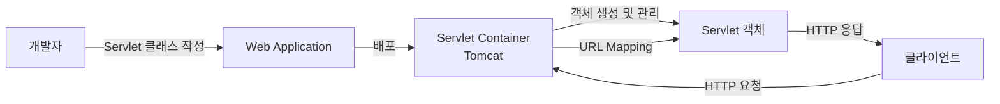
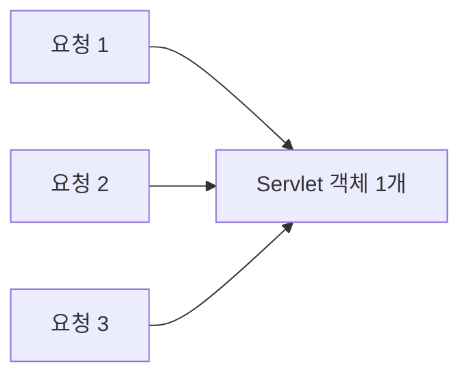
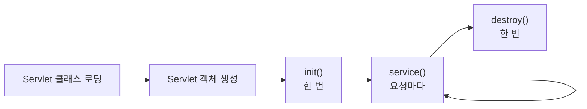
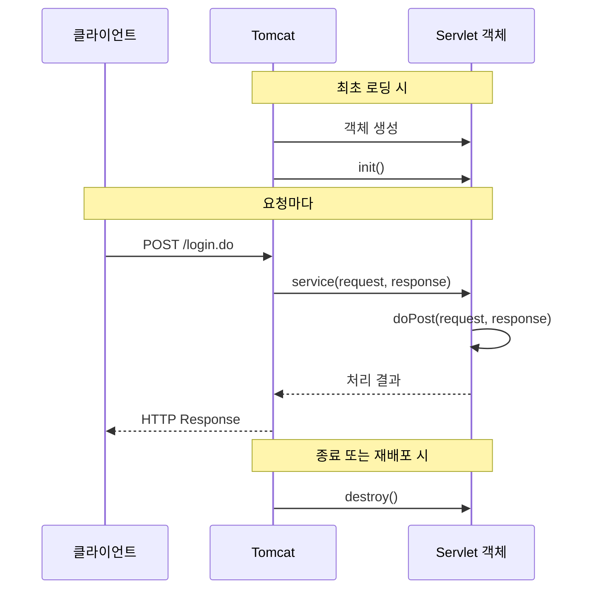
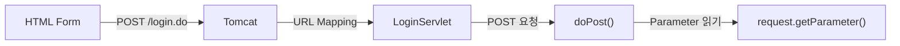
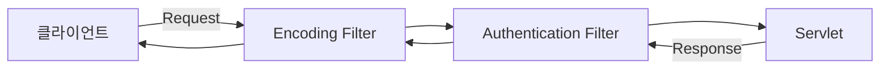
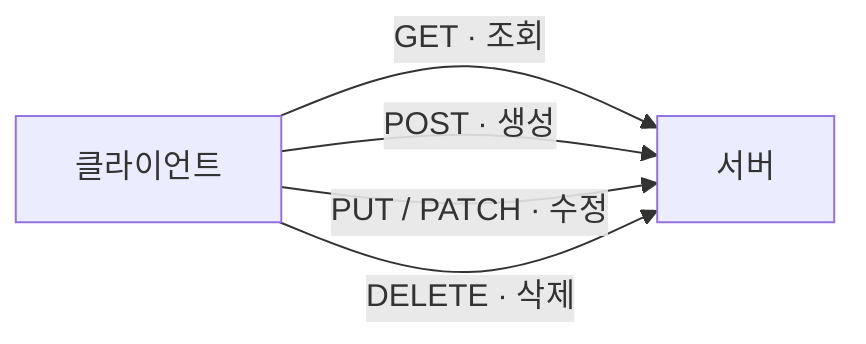
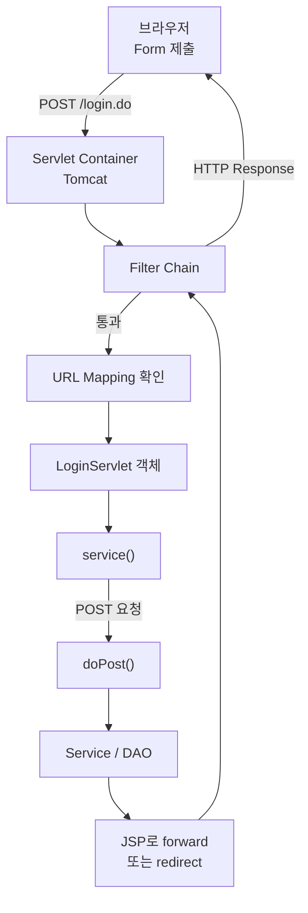

# Java Servlet 핵심 개념 정리

## 1. Servlet

클라이언트의 HTTP 요청을 처리하고 HTTP 응답을 만드는 Java 서버 프로그램

일반적으로 `HttpServlet` 클래스 상속

```java
import jakarta.servlet.http.HttpServlet;

public class LoginServlet extends HttpServlet {
}
```

```text
HttpServlet
    △
    │ extends · 상속
    │
LoginServlet
```

### Servlet 클래스

개발자가 작성하는 Servlet의 설계도

```java
public class LoginServlet extends HttpServlet {
}
```

### Servlet 객체

Servlet 클래스를 기반으로 실제 생성된 객체

개발자의 직접 객체 생성 불필요

Servlet Container가 객체 생성 및 관리

### 개념 비교

| 구분 | 의미 | 예 |
|---|---|---|
| Servlet 클래스 | Servlet 객체를 만들기 위한 설계도 | `LoginServlet.class` |
| Servlet 객체 | 실제 요청을 처리하는 인스턴스 | `LoginServlet` 객체 |
| Servlet Container | Servlet 객체와 요청 흐름을 관리하는 실행 환경 | Tomcat |



---

## 2. Servlet Container

Servlet의 생성, 실행, 종료를 관리하고 클라이언트 요청을 알맞은 Servlet에 전달하는 실행 환경

대표적인 Servlet Container:

- Tomcat
- Jetty
- Undertow

### 주요 업무

```text
Servlet Container
├── Servlet 클래스 로딩
├── Servlet 객체 생성
├── 생명주기 관리
│   ├── init()
│   ├── service()
│   └── destroy()
├── URL Mapping 확인
├── Request / Response 객체 생성
├── Filter 실행
├── Session 관리
└── 여러 요청을 Thread로 처리
```

### Servlet 객체는 Singleton인가?

일반적으로 Servlet 선언 하나당 객체 하나 생성

생성된 객체를 여러 요청에서 공유

Singleton과 비슷하게 동작

개발자가 직접 구현한 Singleton과는 다른 개념

객체 생성과 관리의 주체는 Servlet Container



하나의 Servlet 객체에서 여러 요청을 동시에 처리

요청 데이터를 인스턴스 필드에 저장하면 안 됨

```java
@WebServlet("/unsafe.do")
public class UnsafeServlet extends HttpServlet {

    // 잘못된 예: 여러 요청이 같은 필드를 공유
    private String userId;

    @Override
    protected void doPost(
            HttpServletRequest request,
            HttpServletResponse response
    ) {
        userId = request.getParameter("userId");
    }
}
```

요청별 데이터 저장 위치:

- 메서드의 지역 변수
- `request` 객체

---

## 3. Servlet 생명주기

Servlet 객체가 생성되고 요청을 처리한 뒤 제거되기까지의 과정

| 메서드 | 역할 | 호출 시점 |
|---|---|---|
| `init()` | Servlet 초기화 | 객체 생성 후 한 번 |
| `service()` | 요청 처리 | 요청이 들어올 때마다 |
| `destroy()` | 자원 정리 | Servlet 제거 전 한 번 |

### 전체 생명주기



```text
최초 로딩
→ Servlet 객체 생성
→ init()

클라이언트 요청
→ service()
→ doGet() 또는 doPost()

서버 종료 또는 재배포
→ destroy()
```

`init()`은 요청마다 실행되지 않음

Servlet 객체 초기화 시 한 번 실행

### POST 요청 처리 흐름



### service()와 doGet()·doPost()

`HttpServlet`의 `service()`에서 HTTP Method 확인

HTTP Method에 맞는 메서드 호출

```text
GET     → doGet()
POST    → doPost()
PUT     → doPut()
DELETE  → doDelete()
HEAD    → doHead()
OPTIONS → doOptions()
TRACE   → doTrace()
```

일반적으로 `service()`는 직접 재정의하지 않음

필요한 `doGet()`, `doPost()` 등을 재정의

`HttpServlet`에는 기본 `doPatch()` 메서드 없음

PATCH 처리 방법:

- `service()`에서 별도 처리
- Framework의 HTTP Mapping 기능 사용

---

## 4. URL Mapping

클라이언트가 요청한 URL과 요청을 처리할 Servlet을 연결하는 설정

```text
/login.do  → LoginServlet
/logout.do → LogoutServlet
```

URL Mapping 방법:

1. Annotation 방식
2. XML 방식

### Annotation 방식

Servlet 클래스 위에 `@WebServlet`을 작성하는 방식

```java
import jakarta.servlet.annotation.WebServlet;
import jakarta.servlet.http.HttpServlet;

@WebServlet("/logout.do")
public class LogoutServlet extends HttpServlet {
}
```

```text
요청 URL
/logout.do
    ↓ URL Mapping
LogoutServlet
```

특징:

- 클래스에서 URL Mapping 정보 확인 가능
- 간단한 설정

### XML 방식

`WEB-INF/web.xml` 파일에 Servlet과 URL을 등록하는 방식

Servlet 클래스에는 `@WebServlet` 작성하지 않음

```java
import jakarta.servlet.http.HttpServlet;

public class LogoutServlet extends HttpServlet {
}
```

```xml
<?xml version="1.0" encoding="UTF-8"?>
<web-app xmlns="https://jakarta.ee/xml/ns/jakartaee"
         xmlns:xsi="http://www.w3.org/2001/XMLSchema-instance"
         xsi:schemaLocation="https://jakarta.ee/xml/ns/jakartaee
                             https://jakarta.ee/xml/ns/jakartaee/web-app_6_0.xsd"
         version="6.0">

    <servlet>
        <servlet-name>logoutServlet</servlet-name>
        <servlet-class>com.example.controller.LogoutServlet</servlet-class>
    </servlet>

    <servlet-mapping>
        <servlet-name>logoutServlet</servlet-name>
        <url-pattern>/logout.do</url-pattern>
    </servlet-mapping>

</web-app>
```

```text
<servlet>
└── Servlet 이름과 클래스 연결

<servlet-mapping>
└── Servlet 이름과 URL 연결
```

설정 정보를 `web.xml`에서 통합 관리 가능

Annotation과 XML에 같은 Servlet 및 URL을 중복 등록하면 충돌 또는 배포 오류 발생 가능

### Annotation 방식과 XML 방식 비교

| 구분 | Annotation | XML |
|---|---|---|
| 작성 위치 | Servlet 클래스 | `WEB-INF/web.xml` |
| 주요 설정 | `@WebServlet` | `<servlet>`, `<servlet-mapping>` |
| 장점 | 간단하고 클래스에서 바로 확인 | 설정을 한 파일에서 관리 |
| 주의점 | 클래스마다 설정이 분산될 수 있음 | XML 작성량이 많음 |

### URL Mapping 패턴

| 패턴 | 의미 | 요청 예 |
|---|---|---|
| `/logout.do` | 정확히 일치하는 URL | `/logout.do` |
| `/member/*` | 특정 경로 아래의 모든 URL | `/member/list` |
| `*.do` | 특정 확장자로 끝나는 URL | `/login.do` |
| `/` | 다른 Mapping과 일치하지 않는 기본 요청 | 기본 Servlet |

---

## 5. HTML Form과 Servlet 연결

```text
action : 요청 URL 작성
method : HTTP Method 작성
```

```html
<form action="${pageContext.request.contextPath}/login.do" method="post">
    <input type="text" name="userId">
    <input type="password" name="password">
    <button type="submit">로그인</button>
</form>
```

```java
@WebServlet("/login.do")
public class LoginServlet extends HttpServlet {

    @Override
    protected void doPost(
            HttpServletRequest request,
            HttpServletResponse response
    ) throws IOException {

        String userId = request.getParameter("userId");
        String password = request.getParameter("password");
    }
}
```

### 요청 흐름



### 주의점

```text
Servlet Mapping : /login.do
Form action     : /login.do
```

- `@WebServlet("/login.do")`와 Form의 `action` 경로 일치 필요
- URL은 대소문자 구분
- `Login.do`와 `login.do`는 서로 다른 경로
- `action="Login.do"`는 현재 페이지 기준의 상대 경로
- JSP에서는 `${pageContext.request.contextPath}` 사용 권장
- Context Path가 변경되어도 같은 주소 사용 가능

Context Path가 `/myapp`인 경우:

```text
POST /myapp/login.do
     └────┘└───────┘
 Context Path  Servlet Mapping
```

---

## 6. Servlet Filter

요청이 Servlet에 도착하기 전과 응답이 클라이언트로 돌아가기 전에 공통 작업을 처리하는 객체

주요 용도:

- 문자 Encoding 설정
- 로그인 확인
- 권한 검사
- 요청과 응답 Logging
- 공통 Header 설정

### Filter 처리 흐름



### Filter 예

```java
import jakarta.servlet.Filter;
import jakarta.servlet.FilterChain;
import jakarta.servlet.ServletException;
import jakarta.servlet.ServletRequest;
import jakarta.servlet.ServletResponse;
import jakarta.servlet.annotation.WebFilter;

import java.io.IOException;

@WebFilter("/*")
public class EncodingFilter implements Filter {

    @Override
    public void doFilter(
            ServletRequest request,
            ServletResponse response,
            FilterChain chain
    ) throws IOException, ServletException {

        request.setCharacterEncoding("UTF-8");
        response.setCharacterEncoding("UTF-8");

        chain.doFilter(request, response);
    }
}
```

`chain.doFilter()`를 호출하면 다음 Filter 또는 Servlet으로 요청 전달

`chain.doFilter()`를 호출하지 않으면 요청 흐름 중단

로그인하지 않은 사용자의 요청 차단 등에 사용

---

## 7. HTTP Method와 CRUD

CRUD는 데이터 처리의 네 가지 기본 작업

```text
C : Create · 생성
R : Read   · 조회
U : Update · 수정
D : Delete · 삭제
```

### HTTP Method 연결

| CRUD | HTTP Method | Servlet 메서드 | 예 |
|---|---|---|---|
| Create | `POST` | `doPost()` | 회원가입 |
| Read | `GET` | `doGet()` | 회원 조회 |
| Update | `PUT` | `doPut()` | 전체 수정 |
| Update | `PATCH` | 기본 `doPatch()` 없음 | 일부 수정 |
| Delete | `DELETE` | `doDelete()` | 회원 탈퇴 |



CRUD와 HTTP Method의 연결은 REST 설계에서 주로 사용하는 규칙

HTML `<form>`에서 기본 지원:

- `GET`
- `POST`

`PUT`, `PATCH`, `DELETE` 처리 방법:

- JavaScript의 `fetch()` 사용
- Framework 기능 사용

### GET과 POST 비교

| 구분 | GET | POST |
|---|---|---|
| 주요 용도 | 데이터 조회 | 데이터 생성 또는 전송 |
| 데이터 전달 | 주로 URL Query String | 주로 Request Body |
| Servlet 메서드 | `doGet()` | `doPost()` |
| 반복 요청 | 서버 상태가 바뀌지 않아야 함 | 서버 상태가 바뀔 수 있음 |

비밀번호 같은 민감한 값은 GET 전송 금지

POST 자체에는 암호화 기능 없음

데이터 암호화를 위해 HTTPS 사용 필요

로그아웃은 로그인 상태를 변경하는 작업

권장 방식:

```text
GET /logout.do  사용 지양
POST /logout.do 사용 권장
CSRF 방어       적용 필요
```

---

## 8. URL 구조

예시:

```text
https://search.daum.net/nate?thr=sbma&w=tot&q=점메추
```

```text
https:// search.daum.net /nate ? thr=sbma & w=tot & q=점메추
└ Scheme ┘ └──── Host ────┘ └Path┘  └──── Query String ────┘
```

| 구분 | 값 | 의미 |
|---|---|---|
| Scheme | `https` | 암호화된 HTTP 연결 방식 |
| Host | `search.daum.net` | 요청을 받을 서버의 Domain |
| Path | `/nate` | 서버 내부의 요청 경로 |
| Query 시작 | `?` | Query String 시작 표시 |
| Parameter | `thr=sbma` | 유입 경로 구분 등에 사용하는 값 |
| Parameter | `w=tot` | 통합 검색 범위 |
| Parameter | `q=점메추` | 검색어 |
| 구분자 | `&` | 여러 Parameter 구분 |

Servlet에서 Query Parameter를 읽을 때 `request.getParameter()` 사용

```java
String keyword = request.getParameter("q");
String searchType = request.getParameter("w");
```

```text
q=점메추
    ↓
request.getParameter("q")
    ↓
"점메추"
```

HTTPS 사용 시 클라이언트와 서버 사이의 통신 내용 암호화

전체 URL이 남을 수 있는 위치:

- 브라우저 기록
- 서버 로그

Query String에는 민감한 값 사용 금지

---

## 9. Servlet 전체 요청 흐름



```text
브라우저
→ Tomcat
→ Filter
→ URL Mapping 확인
→ Servlet 객체
→ service()
→ doGet() 또는 doPost()
→ Service / DAO
→ JSP 또는 Redirect
→ 브라우저
```

`init()`은 요청 흐름마다 호출되지 않음

Servlet 객체를 처음 생성하고 초기화할 때 한 번 호출됨

---

## 10. 핵심 정리

```text
Servlet 클래스
└── 개발자가 작성
    └── HttpServlet 상속

Servlet 객체
└── Servlet Container가 생성하고 관리

URL Mapping
├── Annotation : @WebServlet
└── XML        : web.xml

생명주기
├── init()    : 초기화할 때 한 번
├── service() : 요청마다
└── destroy() : 제거할 때 한 번

요청 처리
├── GET    → doGet()
├── POST   → doPost()
├── PUT    → doPut()
└── DELETE → doDelete()

Filter
└── Servlet 실행 전후의 공통 처리
```

- 개발자: Servlet 클래스 작성
- Container: Servlet 객체 생성 및 관리
- Servlet 객체 하나에서 여러 요청 처리
- 요청 데이터를 인스턴스 필드에 저장하면 안 됨
- URL Mapping은 Annotation 또는 XML로 설정
- Form의 `action`과 Servlet Mapping 경로 일치 필요
- 로그인과 로그아웃 요청에 HTTPS 및 CSRF 방어 필요
