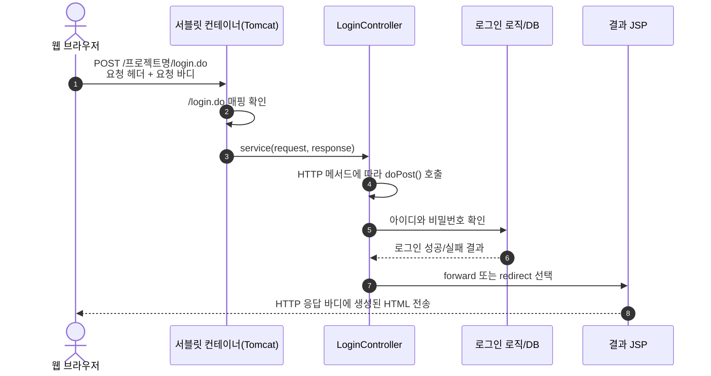
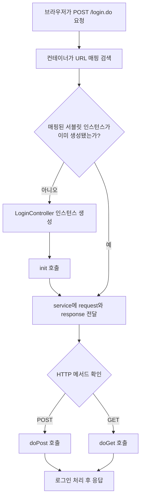
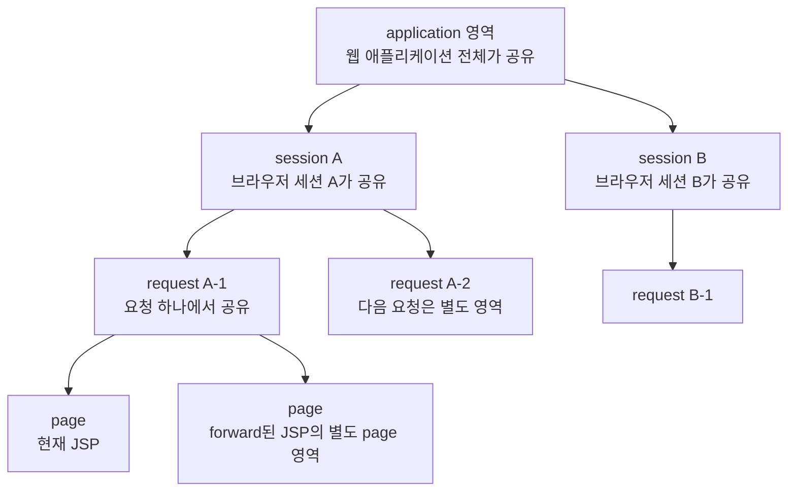
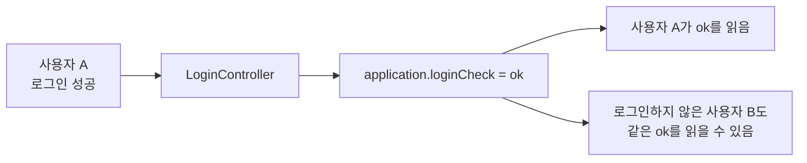
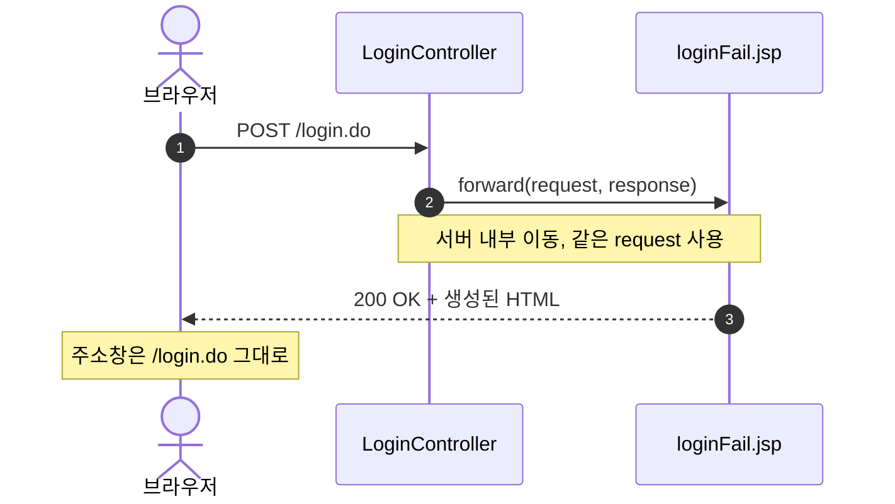
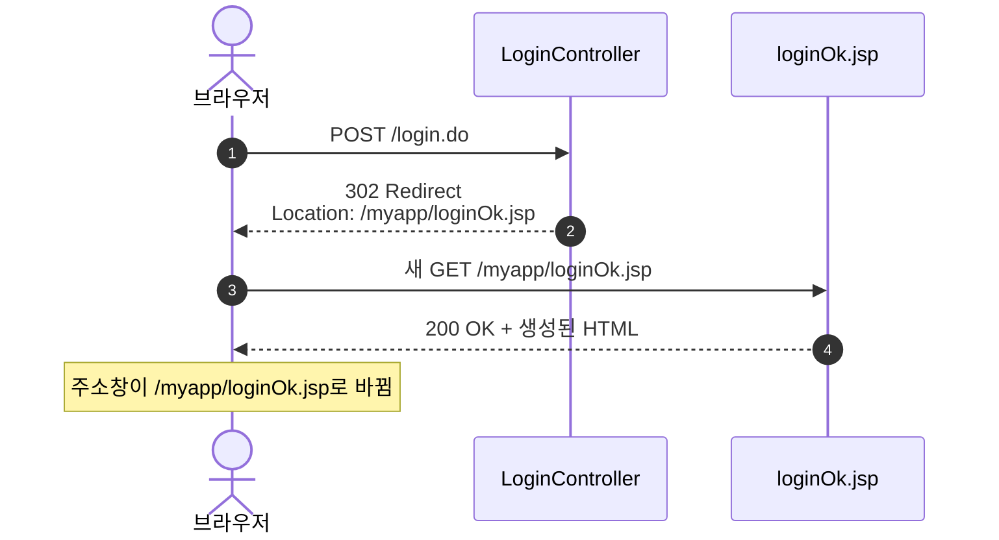

# JSP/Servlet의 HTTP 요청, 컨트롤러 매핑, 4개 영역 정리

## 0. 전체 흐름부터 보기



```text
브라우저가 POST /login.do 요청
→ 컨테이너가 URL 매핑 확인
→ LoginController 탐색
→ doPost() 실행
→ 로그인 처리
→ 처리 결과를 알맞은 영역에 저장
→ 결과 JSP로 forward하거나 브라우저에 redirect 지시
→ 서버가 JSP를 실행해 HTML 생성
→ 생성된 HTML을 HTTP 응답 바디로 전송
→ 브라우저가 HTML을 화면에 표시
```

전송 대상: JSP 원본 소스 X / 서버에서 생성한 HTML O

---

## 1. HTTP 메시지 vs HTTP 메서드

### HTTP 메시지

- HTTP 메시지: 클라이언트와 서버가 주고받는 데이터 전체
- 종류: 요청 메시지 / 응답 메시지

### HTTP 요청 메시지 구조

```http
POST /myapp/login.do HTTP/1.1
Host: localhost:8080
Content-Type: application/x-www-form-urlencoded
Content-Length: 21

id=hong&password=1234
```

```text
시작줄(요청 메서드 + 경로 + HTTP 버전)
→ 헤더(요청의 부가 정보)
→ 빈 줄(헤더와 바디의 경계)
→ 바디(서버로 보낼 데이터)
```

- `POST` → HTTP 메서드
- 시작줄 + 헤더 + 빈 줄 + 바디 → HTTP 요청 메시지 전체

### HTTP 메서드

HTTP 메서드: 서버에 요청할 동작의 종류

- `GET` → 주로 자원 조회
- `POST` → 주로 폼 데이터 전송, 등록, 처리 요청
- `PUT` → 주로 자원 전체 수정 또는 대체
- `PATCH` → 주로 자원 일부 수정
- `DELETE` → 주로 자원 삭제

HTTP 메시지 ≠ HTTP 메서드

> HTTP 메시지 = 봉투 전체 / HTTP 메서드 = 봉투 앞면의 용건

---

## 2. HTTP 바디의 전송 내용

### 브라우저에서 서버로 가는 요청

```jsp
<form action="${pageContext.request.contextPath}/login.do" method="post">
    <input type="text" name="id">
    <input type="password" name="password">
    <button type="submit">로그인</button>
</form>
```

```text
사용자가 폼에 값을 입력
→ 전송 버튼 클릭
→ 브라우저가 입력값을 전송 형식에 맞게 직렬화
→ 직렬화된 값을 HTTP 요청 바디에 저장
→ 서버의 /login.do로 전송
```

```text
id=hong&password=1234
```

전송 대상: `login.jsp` 문서 전체 X / JSP 소스 코드 X / 전송 가능한 폼 항목의 `name`과 값 O

### 요청 바디 형식

- 일반 폼: `application/x-www-form-urlencoded`
- 파일 업로드 폼: `multipart/form-data`
- JSON API: `application/json`

### 서버에서 브라우저로 가는 응답

```text
서버가 JSP 실행
→ JSP 안의 서버 코드 처리
→ 최종 HTML 생성
→ 생성된 HTML을 HTTP 응답 바디에 저장
→ 브라우저로 전송
→ 브라우저가 HTML 렌더링
```

```http
HTTP/1.1 200 OK
Content-Type: text/html; charset=UTF-8

<!doctype html>
<html>
<body>로그인 성공</body>
</html>
```

- 브라우저 수신 내용 → 최종 HTML
- 페이지 소스 보기 → 생성된 HTML만 확인 가능 / JSP 스크립틀릿·서버 내부 자바 코드 확인 불가
- 정적 HTML 요청 → 파일 내용 그대로 응답 바디에 저장
- JSP 요청 → 서버 실행 결과를 응답 바디에 저장

---

## 3. GET 방식과 POST 방식

| 구분 | GET | POST |
|---|---|---|
| 주 용도 | 조회 | 데이터 전송, 등록, 처리 |
| 일반적인 데이터 위치 | URL의 쿼리 문자열 | HTTP 요청 바디 |
| 예 | `/search?keyword=java` | 바디에 `id=hong&password=1234` |
| 주소창 노출 | 쿼리 문자열이 보임 | 바디는 주소창에 보이지 않음 |
| 북마크 | 적합함 | 일반적으로 적합하지 않음 |
| 새로고침 | 같은 조회를 다시 수행 | 폼 재전송 경고가 생길 수 있음 |
| 서블릿 처리 메서드 | `doGet()` | `doPost()` |

### 주의사항

- POST 자체의 자동 암호화 X → 아이디·비밀번호 보호에 HTTPS 필요
- GET 쿼리 문자열에 비밀번호·주민번호 같은 민감한 값 저장 금지
- GET 요청 바디 → 서버·중간 장비의 지원 불일치 가능 → 일반적인 웹 개발에서 사용 지양
- URL·요청 바디 최대 크기 → 브라우저·서버·프록시 설정에 따라 차이

---

## 4. `login.do`와 컨트롤러 매핑

### 매핑이란

매핑: 외부 요청 URL과 서버 내부 처리 컨트롤러의 연결

```text
/login.do  →  LoginController
```

### 애너테이션 등록

```java
@WebServlet("/login.do")
public class LoginController extends HttpServlet {
    // ...
}
```

### web.xml 등록

```xml
<servlet>
    <servlet-name>loginController</servlet-name>
    <servlet-class>controller.LoginController</servlet-class>
</servlet>

<servlet-mapping>
    <servlet-name>loginController</servlet-name>
    <url-pattern>/login.do</url-pattern>
</servlet-mapping>
```

- `login.do` → 학습용 표현으로 컨트롤러의 별명 / 정확한 표현으로 공개 URL 패턴
- URL 매핑 → 내부 클래스명·파일 경로와 외부 주소의 분리
- 매핑 자체의 보안 보장 X → 인증·권한 검사·입력값 검증·세션 보호·HTTPS 별도 필요

### 컨테이너가 요청을 처리하는 순서



```text
애플리케이션 배포
→ 컨테이너가 @WebServlet 또는 web.xml의 매핑 정보 확인
→ /login.do 요청 도착
→ 매핑된 LoginController 탐색
→ 서블릿 인스턴스 존재 여부 확인
→ [없음: 인스턴스 생성 후 init() 호출 / 있음: 기존 인스턴스 사용]
→ 요청별 request와 response를 service()에 전달
→ service()가 HTTP 메서드 확인
→ [POST: doPost() 호출 / GET: doGet() 호출]
→ 컨트롤러가 응답 처리
```

- 서블릿 등록 하나 → 보통 컨테이너가 인스턴스 하나 생성 → 여러 요청에서 공유
- 싱글톤과 유사한 공유 방식 / 개발자가 구현한 싱글톤 디자인 패턴과는 구분 필요
- 같은 서블릿 인스턴스 → 여러 스레드에서 요청 동시 처리 가능
- 요청별 값의 인스턴스 필드 저장 금지 → 지역 변수 또는 적절한 스코프 사용

```java
@WebServlet("/login.do")
public class LoginController extends HttpServlet {

    // 잘못된 예: 여러 사용자 요청에서 필드 공유
    // private String loginId;

    @Override
    protected void doPost(HttpServletRequest request,
                          HttpServletResponse response) {
        // 올바른 예: 요청별 값의 지역 변수 저장
        String loginId = request.getParameter("id");
    }
}
```

서블릿 생성 시점: 첫 요청 시 지연 생성 / 시작 시 미리 생성하도록 설정 가능

---

## 5. `HttpServletRequest`의 정확한 역할

`HttpServletRequest`: 클라이언트에서 들어온 HTTP 요청 정보를 표현하는 자바 객체 / 요청을 직접 보내는 객체 X

HTTP 요청 도착 → 컨테이너가 요청별 `HttpServletRequest`·`HttpServletResponse` 준비 → 컨트롤러에 전달

```java
protected void doPost(HttpServletRequest request,
                      HttpServletResponse response)
```

### request 정보 조회

```java
String method = request.getMethod();            // POST
String uri = request.getRequestURI();           // /myapp/login.do
String id = request.getParameter("id");         // 폼 입력값
String userAgent = request.getHeader("User-Agent");
String clientIp = request.getRemoteAddr();
```

- 일반적인 동기 요청 → 응답 완료 → 요청 객체·request 영역 수명 종료
- forward → 같은 요청 객체를 다음 서버 자원에 전달 → request 영역 유지

### 파라미터와 속성의 차이

| 구분 | 파라미터 | 속성 |
|---|---|---|
| 만든 주체 | 주로 클라이언트 | 주로 서버 코드 |
| 읽기 | `request.getParameter("id")` | `request.getAttribute("loginUser")` |
| 저장 | 폼, 쿼리 문자열, 요청 바디 | `request.setAttribute(name, value)` |
| 값의 기본 형태 | 문자열 | 모든 자바 객체 |
| 대표 용도 | 사용자가 전송한 입력값 | 컨트롤러가 JSP에 전달할 처리 결과 |

---

## 6. 스코프(scope), 즉 영역이란

- 스코프(scope): 저장한 값의 **공유 범위 + 수명**
- JSP의 네 영역: 서버 메모리의 속성 저장 공간 / 영구 저장소 X

### 공통 속성 메서드

```java
setAttribute(String name, Object value)
getAttribute(String name)
removeAttribute(String name)
```

### 공유 범위 구조도

실제 자바 객체의 포함 관계 X / 수명·공유 범위의 개념도



### 공유 범위 크기

```text
page < request < session < application
```

필요한 범위 중 가장 작은 영역 선택 → 메모리 낭비·사용자 간 데이터 오염 감소

---

## 7. JSP의 4개 영역과 내장 객체

### 이름과 대소문자

- JSP 내장 객체 변수명 → 소문자로 시작
- Java 타입명 → 대문자로 시작

| 영역 | JSP 내장 객체 변수 | Java 타입 (`javax`) | 수명과 공유 범위 | 대표 용도 |
|---|---|---|---|---|
| page | `pageContext` | `javax.servlet.jsp.PageContext` | 현재 JSP 페이지가 실행되는 동안 | 현재 페이지 내부 임시값 |
| request | `request` | `javax.servlet.http.HttpServletRequest` | HTTP 요청 하나가 끝날 때까지 | 컨트롤러에서 JSP로 결과 전달 |
| session | `session` | `javax.servlet.http.HttpSession` | 한 클라이언트의 세션이 끝날 때까지 | 로그인 사용자, 장바구니 |
| application | `application` | `javax.servlet.ServletContext` | 웹 애플리케이션이 종료될 때까지 | 모든 사용자가 공유하는 설정/데이터 |

- PDF 기준 환경 → `javax.servlet.*`
- Jakarta EE 9 이상·Tomcat 10 이상 환경 → `jakarta.servlet.*`
- 예: `jakarta.servlet.http.HttpServletRequest`
- 한 프로젝트 안에서 `javax`·`jakarta` 혼용 금지

### 7.1 page 영역

```text
JSP 페이지 실행 시작
→ page 영역과 pageContext 사용
→ 현재 JSP 안에서 속성 공유
→ JSP 실행 종료
→ page 영역 소멸
```

JSP 내장 객체: `pageContext`

```jsp
<%
pageContext.setAttribute("message", "현재 JSP에서만 사용");
String message = (String) pageContext.getAttribute("message");
%>
```

- 정적 include `<%@ include %>` → 소스 통합 → 같은 JSP 페이지로 처리 → page 영역 공유 가능
- 별도로 실행되는 자원으로 이동 → 새로운 page 영역 사용

### 7.2 request 영역

```text
HTTP 요청 도착
→ request 영역 생성
→ 컨트롤러가 속성 저장
→ forward하면 같은 request를 JSP에 전달
→ JSP가 속성 사용
→ 응답 완료
→ request 영역 소멸
```

redirect → 브라우저의 새 요청 → 기존 request 영역 공유 불가

```java
request.setAttribute("loginCheck", "ok");
request.getRequestDispatcher("/loginOk.jsp")
       .forward(request, response);
```

### loginOk.jsp의 속성 조회

```jsp
<%= request.getAttribute("loginCheck") %>
```

### 7.3 session 영역

```text
세션 필요 시 getSession() 호출
→ 기존 세션 확인 또는 새 세션 생성
→ 새 세션 생성 시 세션 ID 발급
→ 브라우저가 세션 ID를 쿠키로 보관
→ 다음 요청에 세션 ID 전송
→ 서버가 같은 session 영역 탐색
→ 로그인 상태나 장바구니 같은 사용자별 값 사용
→ 타임아웃 또는 invalidate() 호출
→ session 영역 소멸
```

JSP 내장 객체: `session` / 타입: `HttpSession`

```java
HttpSession session = request.getSession();
session.setAttribute("loginUser", user);
```

세션 구분 기준: IP 주소 X / 보통 세션 ID 쿠키

- 같은 IP + 다른 브라우저·프로필 → 별도 쿠키 저장소 → 보통 별도 세션
- 같은 브라우저 프로필의 여러 탭 → 보통 같은 세션 쿠키 공유
- 브라우저 종료 → 세션 쿠키 소멸 가능 / 서버 세션의 즉시 삭제 보장 X
- 서버 세션 종료 조건 → 타임아웃·`session.invalidate()`·애플리케이션 종료 등

### 로그아웃 시 세션 종료

```java
request.getSession().invalidate();
```

### 7.4 application 영역

```text
웹 애플리케이션 시작 또는 배포
→ ServletContext와 application 영역 생성
→ 모든 사용자와 JSP/서블릿이 속성 공유
→ 웹 애플리케이션 중지 또는 재배포
→ application 영역 소멸
```

JSP 내장 객체: `application` / 타입: `ServletContext`

```java
ServletContext application = request.getServletContext();
application.setAttribute("serviceNotice", "오늘 18시에 점검");
```

- ServletContext 개수 → 서버 전체에 하나 X / 웹 애플리케이션마다 하나
- application 영역 → 모든 요청 스레드에서 공유
- 변경 가능한 객체 저장 → 동시성 문제 고려 필요

---

## 8. 서버 데이터 저장: 영속 저장과 메모리 저장

**persistence(영속성)**: 프로그램·서버 종료 후에도 데이터 유지

| 저장 위치 | 서버 재시작 후 | 대표 용도 |
|---|---|---|
| page/request 메모리 | 사라짐 | 화면 처리용 임시 데이터 |
| session 메모리 | 일반적으로 사라질 수 있음 | 사용자별 임시 상태 |
| application 메모리 | 사라짐 | 앱 전체 공유 캐시/설정 |
| 데이터베이스 | 남음 | 회원, 주문, 게시글 |
| 파일 | 남음 | 업로드 파일, 로그, 설정 |

- 네 가지 스코프 → **메모리의 공유 범위** / 영구 저장소 X
- 세션을 파일·외부 저장소에 보존 → 별도의 세션 영속화 설정 필요

---

## 9. application에 로그인 결과 저장 시 문제

### 올바른 타입명·문법

```java
ServletContext application = request.getServletContext();
application.setAttribute("loginCheck", "ok");
```

로그인 성공 여부의 application 저장 금지 → 모든 사용자에게 같은 값 공유



사용자 A 로그인 → application에 `loginCheck=ok` 저장 → 사용자 B도 같은 값 조회 가능 → 사용자별 로그인 상태 분리 실패 → 보안 오류

- 컨테이너 크기·개수 감소 X
- ServletContext에 속성 참조 추가 → 저장한 객체만큼 메모리 사용

### 저장 위치 선택

- 한 번의 요청 안에서 성공/실패 결과를 JSP에 전달: `request` 영역
- 로그인한 사용자 상태를 다음 요청까지 유지: `session` 영역
- 모든 사용자에게 같은 공지나 공용 설정을 제공: `application` 영역
- 회원 정보 자체를 영구 보관: 데이터베이스

JSP 처리 로직을 컨트롤러로 이동 → 중복 로직 감소 + **역할 분리 개선** / 컨테이너 크기 감소 X

---

## 10. `login.jsp → login.do → 결과 JSP` 예제

### login.jsp

```jsp
<%@ page contentType="text/html; charset=UTF-8" %>
<!doctype html>
<html lang="ko">
<head>
    <meta charset="UTF-8">
    <title>로그인</title>
</head>
<body>
    <form action="${pageContext.request.contextPath}/login.do" method="post">
        <label>
            아이디
            <input type="text" name="id" required>
        </label>
        <label>
            비밀번호
            <input type="password" name="password" required>
        </label>
        <button type="submit">로그인</button>
    </form>
</body>
</html>
```

### LoginController.java

예제 환경: PDF와 동일한 `javax.servlet`

```java
package controller;

import java.io.IOException;

import javax.servlet.ServletException;
import javax.servlet.annotation.WebServlet;
import javax.servlet.http.HttpServlet;
import javax.servlet.http.HttpServletRequest;
import javax.servlet.http.HttpServletResponse;
import javax.servlet.http.HttpSession;

@WebServlet("/login.do")
public class LoginController extends HttpServlet {

    @Override
    protected void doPost(HttpServletRequest request,
                          HttpServletResponse response)
            throws ServletException, IOException {

        request.setCharacterEncoding("UTF-8");

        String id = request.getParameter("id");
        String password = request.getParameter("password");

        // 실습용 조건 / 실제 서비스: DB 조회 + 비밀번호 해시 검증
        boolean loginSuccess = "hong".equals(id)
                && "1234".equals(password);

        if (loginSuccess) {
            HttpSession session = request.getSession();
            session.setAttribute("loginUser", id);

            // POST 처리 완료 → 새 GET 요청으로 이동
            response.sendRedirect(
                    request.getContextPath() + "/loginOk.jsp");
            return;
        }

        // 현재 요청에서만 사용할 실패 메시지 → request 영역 저장
        request.setAttribute("loginError", "아이디 또는 비밀번호가 맞지 않아");
        request.getRequestDispatcher("/loginFail.jsp")
               .forward(request, response);
    }
}
```

실무형 구조: 결과 JSP를 `/WEB-INF/views/`에 배치 → 브라우저의 JSP 직접 접근 차단 → 컨트롤러를 통해 화면 제공

```text
/WEB-INF/views/loginOk.jsp
/WEB-INF/views/loginFail.jsp
```

`/WEB-INF` 아래 JSP → 브라우저의 redirect 접근 불가 / 서버 내부 forward로 접근

---

## 11. forward 방식

forward: 서버 내부에서 현재 요청을 다른 서버 자원으로 전달

```java
request.setAttribute("loginError", "로그인 실패");
request.getRequestDispatcher("/loginFail.jsp")
       .forward(request, response);
```



```text
브라우저가 POST /login.do 요청
→ LoginController가 요청 처리
→ request에 결과 저장
→ 서버 내부에서 loginFail.jsp로 forward
→ 같은 request를 JSP가 사용
→ JSP가 HTML 생성
→ 브라우저에 응답
```

- 브라우저 요청 횟수: 1번
- 주소창 URL: `/login.do` 유지
- `request.setAttribute()` 저장값 → 다음 JSP에서 조회 가능
- 적합한 용도: 컨트롤러의 처리 결과를 JSP에 전달

---

## 12. redirect 방식

redirect: 서버가 새 주소 안내 → 브라우저가 해당 주소로 다시 요청

```java
response.sendRedirect(request.getContextPath() + "/loginOk.jsp");
```



```text
브라우저가 POST /login.do 요청
→ LoginController가 로그인 처리
→ 서버가 302 응답과 이동할 URL 전송
→ 브라우저가 이동할 URL로 새 GET 요청
→ loginOk.jsp가 HTML 생성
→ 브라우저에 응답
→ 주소창이 새 URL로 변경
```

- HTTP 요청 횟수: 2번
- 새 요청 생성 → 기존 request 영역 공유 불가
- 새 요청까지 값 유지 필요 → session 또는 다른 저장 방법 선택
- 대표 용도: 로그인·게시글 등록 등 POST 처리 성공 후 화면 이동

PRG(Post/Redirect/Get): POST 처리 → redirect → 새 GET 화면 → 새로고침의 중복 POST 방지에 도움

---

## 13. forward와 redirect 한눈에 비교

| 구분 | forward | redirect |
|---|---|---|
| 이동 주체 | 서버 | 브라우저 |
| HTTP 요청 횟수 | 1번 | 2번 |
| 주소창 변경 | 변경 안 됨 | 변경됨 |
| request 영역 | 유지됨 | 유지되지 않음 |
| 외부 사이트 이동 | 불가능 | 가능 |
| 처리 속도 | 새 HTTP 요청이 없어 상대적으로 단순함 | 새 요청이 한 번 더 필요함 |
| 대표 용도 | 컨트롤러에서 JSP로 결과 전달 | POST 성공 후 결과/목록 화면으로 이동 |
| 새로고침 위험 | POST를 다시 전송할 수 있음 | PRG를 쓰면 중복 POST를 줄일 수 있음 |

### 선택 기준

- 현재 요청의 처리 결과를 JSP에 전달 → `forward`
- 브라우저의 새 URL 요청 필요 → `redirect`

---

## 14. 자주 헷갈리는 표현 바로잡기

| 헷갈리는 표현 | 더 정확한 표현 |
|---|---|
| HTTP 메시지 = POST | HTTP 메시지 전체 ≠ 시작줄의 HTTP 메서드 `POST` |
| JSP 원본의 브라우저 전송 | 서버에서 JSP 실행 → HTML 생성 → 응답 바디로 전송 |
| POST 바디 = 문서 코드 전체 | 폼 입력값 등 전송 데이터 → 요청 바디 |
| `HttpServletRequest` = 요청 전송 객체 | 들어온 요청의 정보 표현 + request 영역 제공 |
| `login.do` = 보안 장치 | 내부 구현과 공개 URL의 분리 / 보안 기능 별도 필요 |
| 컨트롤러 = 완전한 싱글톤 | 보통 서블릿 등록당 한 인스턴스 생성 → 여러 스레드에서 공유 |
| 같은 IP = 같은 세션 | 보통 세션 ID 쿠키 기준으로 구분 |
| 브라우저 종료 = 서버 세션 즉시 삭제 | 쿠키 소멸 가능 / 서버 세션은 타임아웃·`invalidate()` 등으로 종료 |
| application에 로그인 결과 저장 | 사용자별 분리 불가 → 로그인 상태는 session에 저장 |
| 스코프 = 영구 저장소 | 서버 메모리 속성의 공유 범위 + 수명 |

---

## 15. 시험이나 설명용 핵심 요약

### 요청 처리 흐름

```text
브라우저가 HTTP 요청 메시지 전송
→ 컨테이너가 URL 매핑 확인
→ LoginController 탐색
→ 요청마다 HttpServletRequest와 HttpServletResponse 준비
→ service()가 HTTP 메서드 확인
→ POST이면 doPost() 실행
→ 로그인 처리
→ 알맞은 영역에 결과 저장
→ forward 또는 redirect
→ JSP가 HTML 생성
→ HTML을 HTTP 응답 바디로 전송
```

### 꼭 기억할 개념

- HTTP 메시지 구조: `시작줄 → 헤더 → 빈 줄 → 바디`
- `GET`·`POST`: HTTP 메서드 / 메시지 전체 X
- 컨트롤러 인스턴스: 보통 하나 생성 → 여러 요청에서 공유
- `HttpServletRequest`: 들어온 요청 정보의 자바 객체 표현
- `page`·`request`·`session`·`application`: 값의 공유 범위 + 수명
- 결과 화면에 한 번 전달할 값 → request 저장
- 사용자별 로그인 상태 → session 저장
- 모든 사용자에게 공유할 값 → application 저장
- forward → 같은 request 사용 → request 영역 유지
- redirect → 브라우저의 새 요청 → 기존 request 영역 공유 불가

---

## 참고 자료

- 『성낙현의 JSP 자바 웹 프로그래밍』 Chapter 02 내장 객체: 내장 객체 타입, request/response, GET/POST, forward/redirect, application 관련 슬라이드
- 『성낙현의 JSP 자바 웹 프로그래밍』 Chapter 03 내장 객체의 영역: page, request, session, application 영역과 수명주기 관련 슬라이드
