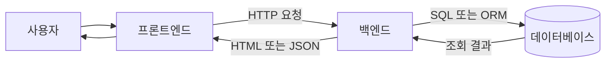

## 전체 구조

일반적인 요청 경로:



구성 요소별 책임:

| 구성 요소 | 책임 | 대표 기술 |
|---|---|---|
| 프론트엔드 | 화면 표시, 입력 수집, HTTP 요청 | HTML, CSS, JavaScript, React, Vue, JSP |
| 백엔드 | 요청 검증, 권한 확인, 비즈니스 로직, 응답 생성 | Java, Spring, Servlet |
| 데이터베이스 | 영속 데이터의 조회·등록·수정·삭제 | MySQL, PostgreSQL |

### 프론트엔드

- 사용자 화면 표시
- 폼과 버튼을 통한 입력 수집
- 백엔드 API 호출
- HTML 또는 JSON 응답을 화면에 반영

HTTP 요청 예시:

```http
GET /api/users/1 HTTP/1.1
Host: example.com
```

### 백엔드

- HTTP 요청 수신
- 입력값 형식 검사
- 인증·권한 검사
- 비즈니스 로직 실행
- DB·파일 저장소 접근
- HTTP 상태 코드와 응답 본문 생성

### 데이터베이스

- 회원, 주문, 게시글 같은 영속 데이터 보관
- 백엔드의 SQL 또는 ORM 요청 처리
- 트랜잭션과 무결성 제약 조건 제공

권장 접근 방향:

```text
프론트엔드 → 백엔드 → 데이터베이스
```

프론트엔드의 DB 직접 접근 문제:

- DB 계정과 비밀번호 노출 위험
- 인증·권한 검사 우회 위험
- DB 구조와 화면 코드의 강한 결합
- 비즈니스 규칙의 일관된 적용 곤란

---

## 이미지 저장 전략

대표적인 세 가지 방식:

1. DB의 BLOB 컬럼에 이미지 바이트 저장
2. 백엔드 서버의 로컬 디스크에 이미지 저장
3. 오브젝트 스토리지에 이미지 저장 + DB에 메타데이터 기록

### 방식 비교

| 항목 | DB BLOB | 서버 디스크 | 오브젝트 스토리지 |
|---|---|---|---|
| 실제 이미지 위치 | 데이터베이스 | 백엔드 서버 | S3 같은 전용 저장소 |
| DB 기록 | 이미지 바이트와 메타데이터 | 파일 경로 | 객체 키와 메타데이터 |
| 구현 난이도 | 보통 | 낮음 | 보통 |
| 확장성 | 낮은 편 | 낮은 편 | 높은 편 |
| CDN 연동 | 불편 | 별도 구성 | 쉬운 편 |
| 주요 용도 | 소규모·강한 일관성 | 학습·단일 서버 | 일반 운영 서비스 |

### DB BLOB

`BLOB(Binary Large Object)`:

- 이미지·영상·문서 같은 이진 데이터용 DB 타입
- 파일 자체를 DB 행에 저장하는 방식

테이블 예시:

```sql
CREATE TABLE images (
    id BIGINT AUTO_INCREMENT PRIMARY KEY,
    original_name VARCHAR(255) NOT NULL,
    content_type VARCHAR(100) NOT NULL,
    image_data LONGBLOB NOT NULL
);
```

조회 경로:

```mermaid
sequenceDiagram
    actor Client as 클라이언트
