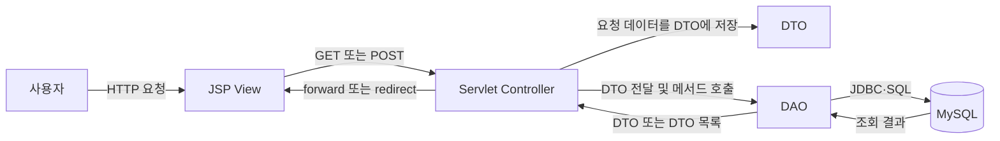
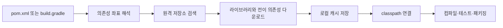
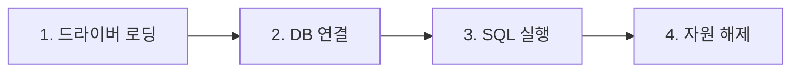
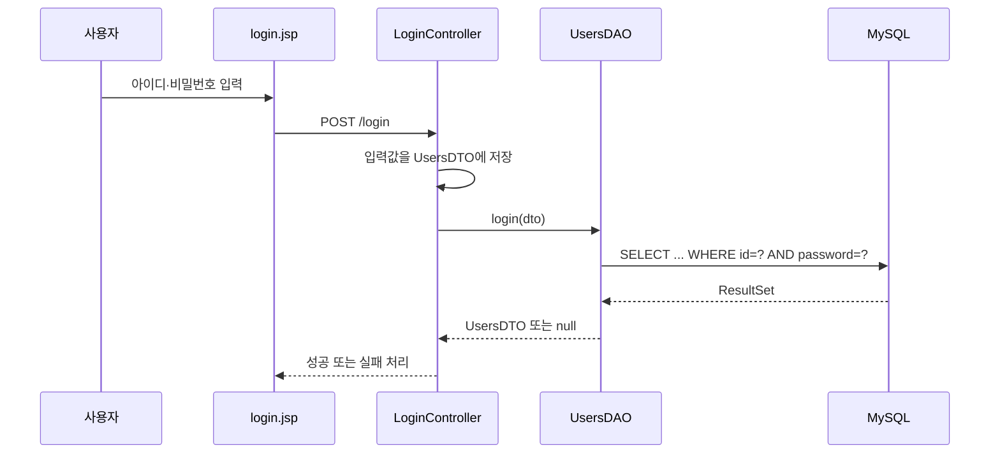

## 1. 수업 목표

- DTO를 이용한 계층 간 데이터 전달 구조 이해
- DAO를 이용한 데이터베이스 코드 분리
- MySQL Connector/J 설치 위치 확인
- JDBC의 네 단계 학습
- `PreparedStatement`와 플레이스홀더 사용법 학습
- `executeQuery()`와 `executeUpdate()` 구분
- `ResultSet`의 커서와 순회 방식 이해
- 회원가입·로그인 기능의 DB 연동
- 마이페이지·회원 탈퇴·회원 목록 기능 설계
- Spring 진입 전 기본 MVC·JDBC 구조 정리

---

## 2. 전체 구조

### 2.1 주요 구성 요소

**View**: 사용자 입력과 처리 결과를 표시하는 JSP 화면

**Controller**: 요청 수신, 파라미터 추출, 처리 흐름 제어를 담당하는 Servlet

**DTO(Data Transfer Object)**: 계층 사이에서 데이터를 운반하는 객체

**DAO(Data Access Object)**: DB 연결과 SQL 실행을 담당하는 객체

**DBMS(Database Management System)**: 데이터를 저장하고 관리하는 시스템

### 2.1.1 MVC 역할 구분

| 구분 | 구성 요소 | 핵심 책임 |
| --- | --- | --- |
| Model | DTO | 데이터 한 건의 보관과 계층 간 전달 |
| Model | DAO | DB 연결, SQL 실행, 조회 결과의 DTO 변환 |
| View | JSP | 입력 화면과 처리 결과 출력 |
| Controller | Servlet | 요청 수신, 파라미터 처리, Model 호출, 응답 경로 선택 |

수업 기준 표현

```text
M = Model      → DB 연동 객체와 데이터 객체 → DTO + DAO
V = View       → 사용자 화면               → JSP
C = Controller → 요청 처리                 → Servlet
```

### 2.1.2 DTO·DAO·Controller·DB의 연계

회원가입처럼 데이터를 저장하는 흐름

```text
1. JSP에서 사용자 입력
2. Controller에서 request 파라미터 추출
3. Controller에서 DTO 생성과 값 저장
4. Controller에서 DAO 메서드 호출
5. DAO에서 DTO의 getter로 값 추출
6. DAO에서 PreparedStatement에 값 바인딩
7. DB에서 INSERT·UPDATE·DELETE 수행
8. DAO에서 영향받은 행 수 반환
9. Controller에서 성공·실패 응답 선택
```

로그인·회원조회처럼 데이터를 읽는 흐름

```text
1. Controller에서 조회 조건을 DTO 또는 매개변수로 구성
2. Controller에서 DAO 메서드 호출
3. DAO에서 SELECT 실행
4. DB에서 ResultSet 반환
5. DAO에서 ResultSet 한 행마다 DTO 생성
6. 단일 조회는 DTO 또는 null 반환
7. 다중 조회는 List<DTO> 반환
8. Controller에서 request 또는 session 영역에 결과 저장
9. JSP에서 결과 출력
```

### 2.2 처리 흐름



### 2.3 데이터 이동 방향

회원가입·수정처럼 사용자의 데이터를 DB에 저장하는 경우

```text
View → Controller → DTO → DAO → Database
```

로그인·회원조회처럼 DB의 데이터를 화면에 전달하는 경우

```text
Database → DAO → DTO → Controller → View
```

---

## 3. DTO

### 3.1 개념

**DTO**: 테이블 레코드 한 행에 해당하는 데이터를 담아 계층 사이에서 전달하는 객체

### 3.2 필요한 이유

- 여러 값을 하나의 객체로 묶어서 전달
- Controller와 DAO 사이의 매개변수 단순화
- 데이터 구조의 명확한 표현
- Spring의 자동 데이터 바인딩과 매핑을 위한 기반

### 3.3 작성 규칙

- 테이블마다 DTO 클래스 한 개 구성
- 테이블의 열 이름과 DTO 필드 이름의 일치 권장
- 테이블의 SQL 자료형과 Java 필드 자료형의 대응
- 모든 필드를 `private`으로 선언
- 각 필드에 대한 `public` getter와 setter 제공
- 필요할 때마다 새로운 DTO 객체 생성

### 3.4 테이블과 DTO 대응

| DB 필드 | SQL 자료형 예시 | Java 자료형 예시 |
| --- | --- | --- |
| `id` | `VARCHAR` | `String` |
| `password` | `VARCHAR` | `String` |
| `name` | `VARCHAR` | `String` |
| `role` | `VARCHAR` | `String` |
| `age` | `INT` | `int` 또는 `Integer` |
| `created_at` | `DATETIME` | `LocalDateTime` 또는 `Timestamp` |

### 3.5 UsersDTO 예시

```java
package model;

public class UsersDTO {

    private String id;
    private String password;
    private String name;
    private String role;

    public String getId() {
        return id;
    }

    public void setId(String id) {
        this.id = id;
    }

    public String getPassword() {
        return password;
    }

    public void setPassword(String password) {
        this.password = password;
    }

    public String getName() {
        return name;
    }

    public void setName(String name) {
        this.name = name;
    }

    public String getRole() {
        return role;
    }

    public void setRole(String role) {
        this.role = role;
    }
}
```

### 3.6 캡슐화

**캡슐화**: 객체의 내부 데이터를 외부에서 직접 변경하지 못하도록 접근을 제한하는 설계 원칙

직접 접근이 불가능한 코드

```java
dto.id = "user01";
```

setter와 getter를 이용한 접근

```java
dto.setId("user01");
String id = dto.getId();
```

### 3.7 객체 생성 범위

수업 기준 정리

- Controller만 하나의 객체를 공유하는 구조로 설명
- DTO는 데이터 한 건마다 새로운 객체 생성
- DAO는 수업 예제에서 요청 처리 과정마다 새로운 객체 생성
- DTO와 DAO에 싱글톤 적용 없음

정확한 Servlet 관점

- Servlet 컨테이너가 URL 매핑별 Servlet 인스턴스를 일반적으로 한 개 생성
- 하나의 Servlet 인스턴스에서 여러 요청 스레드를 동시에 처리
- 직접 작성하는 GoF Singleton 패턴과는 구분되는 컨테이너 관리 객체
- 요청별 데이터를 Controller의 인스턴스 필드에 저장할 경우 동시성 문제 가능성
- 요청별 데이터는 `doGet()`·`doPost()`의 지역변수, request, session 등에 저장

```java
@WebServlet("/login")
public class LoginController extends HttpServlet {

    // 여러 요청이 공유할 수 있으므로 사용자별 데이터 저장 금지
    // private String currentUserId;

    @Override
    protected void doPost(
            HttpServletRequest request,
            HttpServletResponse response) {

        // 요청마다 독립적인 지역변수
        String id = request.getParameter("id");
    }
}
```

시험용 핵심 문장

> Controller는 Servlet 컨테이너가 관리하는 단일 인스턴스를 여러 요청에서 공유하며, DTO와 DAO는 수업 구조에서 필요한 만큼 생성하는 객체

---

## 4. 여러 레코드와 컬렉션

### 4.1 고정 배열의 한계

```java
UsersDTO[] users = new UsersDTO[3];
```

- 생성 시 크기 확정
- 기존 배열의 길이 변경 불가
- 더 큰 공간이 필요할 경우 새 배열 생성과 데이터 복사 필요

### 4.2 ArrayList

**ArrayList**: 원소 수에 따라 내부 저장 공간을 확장할 수 있는 `List` 구현체

```java
List<UsersDTO> users = new ArrayList<>();
```

- 데이터 개수에 따른 크기 확장
- `add()`, `get()`, `remove()`, `size()` 등의 메서드 제공
- 여러 조회 결과를 Controller에 전달하기 적합한 구조

### 4.3 여러 레코드 변환

```java
List<UsersDTO> users = new ArrayList<>();

while (rs.next()) {
    UsersDTO dto = new UsersDTO();

    dto.setId(rs.getString("id"));
    dto.setPassword(rs.getString("password"));
    dto.setName(rs.getString("name"));
    dto.setRole(rs.getString("role"));

    users.add(dto);
}
```

### 4.4 반환 구조

```text
ResultSet의 첫 번째 행  → UsersDTO 객체 1
ResultSet의 두 번째 행  → UsersDTO 객체 2
ResultSet의 세 번째 행  → UsersDTO 객체 3
                           ↓
                     List<UsersDTO>
```

---

## 5. 회원가입 요청 흐름

### 5.1 View

```html
<form action="register" method="post">
    <input type="text" name="id">
    <input type="password" name="password">
    <input type="text" name="name">
    <button type="submit">회원가입</button>
</form>
```

### 5.2 POST 요청

**POST**: 생성 또는 데이터 변경 요청에 주로 사용하는 HTTP 메서드

- 폼 데이터를 HTTP 요청 body에 포함
- URL 매핑값을 기준으로 Servlet Controller 선택
- `doPost()` 메서드에서 요청 처리

### 5.3 Controller 매핑

```java
@WebServlet("/register")
public class RegisterController extends HttpServlet {

    @Override
    protected void doPost(
            HttpServletRequest request,
            HttpServletResponse response)
            throws ServletException, IOException {

        // 요청 처리
    }
}
```

### 5.4 파라미터 추출과 DTO 구성

```java
String id = request.getParameter("id");
String password = request.getParameter("password");
String name = request.getParameter("name");

UsersDTO dto = new UsersDTO();
dto.setId(id);
dto.setPassword(password);
dto.setName(name);
dto.setRole("user");
```

### 5.5 DAO 호출

```java
UsersDAO dao = new UsersDAO();
int result = dao.register(dto);
```

---

## 6. DAO

### 6.1 개념

**DAO**: JDBC 코드와 SQL을 이용해 데이터베이스 접근을 전담하는 객체

### 6.2 필요한 이유

DAO가 없는 구조

```text
RegisterController ─ JDBC 코드
LoginController    ─ JDBC 코드
UpdateController   ─ JDBC 코드
DeleteController   ─ JDBC 코드
```

DAO를 적용한 구조

```text
RegisterController ─┐
LoginController    ─┼─→ UsersDAO ─→ MySQL
UpdateController   ─┤
DeleteController   ─┘
```

### 6.3 장점

- JDBC 중복 코드 감소
- Controller의 요청 처리 책임과 DB 처리 책임 분리
- SQL 수정 위치의 일원화
- 기능별 메서드 구성
- 유지보수성과 테스트 편의성 향상

### 6.4 테이블별 모델 구성

```text
users 테이블       → UsersDTO, UsersDAO
products 테이블    → ProductsDTO, ProductsDAO
orders 테이블      → OrdersDTO, OrdersDAO
boards 테이블      → BoardsDTO, BoardsDAO
comments 테이블    → CommentsDTO, CommentsDAO
```

### 6.5 DTO와 DAO 비교

| 구분 | DTO | DAO |
| --- | --- | --- |
| 목적 | 데이터 보관과 전달 | DB 접근과 SQL 실행 |
| 주요 내용 | 필드, getter, setter | JDBC 코드, CRUD 메서드 |
| 데이터 방향 | 양방향 전달 | DB 입출력 처리 |
| 일반적 단위 | 테이블 한 행 | 테이블 한 개 |

---

## 7. JDBC와 Connector/J

### 7.1 JDBC

**JDBC(Java Database Connectivity)**: Java 애플리케이션에서 DBMS에 연결하고 SQL을 실행하기 위한 표준 API

### 7.2 Connector/J

**MySQL Connector/J**: Java의 JDBC API와 MySQL 서버 사이의 통신을 담당하는 JDBC 드라이버

### 7.3 준비 절차

1. MySQL Community Downloads 접속
2. Connector/J 선택
3. Archives에서 DB 버전에 맞는 드라이버 선택
4. 운영체제 항목에서 `Platform Independent` 선택
5. ZIP 파일 다운로드와 압축 해제
6. Connector/J JAR 파일 확인
7. Servlet 프로젝트의 라이브러리 경로에 JAR 파일 배치

### 7.4 Servlet 프로젝트 배치 경로

일반 Dynamic Web Project 구조

```text
WebContent/
└── WEB-INF/
    └── lib/
        └── mysql-connector-j-8.x.x.jar
```

Maven 표준 웹 구조

```text
src/
└── main/
    └── webapp/
        └── WEB-INF/
            └── lib/
```

### 7.5 버전 관리

- MySQL 서버 버전과 Connector/J 호환성 확인
- DBMS 업그레이드 시 드라이버 버전 점검
- 여러 외부 라이브러리를 직접 관리할 때 발생하는 유지보수 부담
- Spring 프로젝트에서 Maven 또는 Gradle 활용

---

## 8. 라이브러리 관리

### 8.1 빌드

**빌드**: 소스 컴파일, 의존성 연결, 테스트, 패키징 등을 거쳐 실행 가능한 결과물을 만드는 과정

### 8.2 Maven과 Gradle

| 도구 | 대표 설정 파일 | 특징 |
| --- | --- | --- |
| Maven | `pom.xml` | XML 기반 의존성·빌드 설정 |
| Gradle | `build.gradle` | Groovy 또는 Kotlin DSL 기반 설정 |

### 8.3 역할

- 외부 라이브러리 자동 다운로드
- 라이브러리 버전 관리
- 의존 라이브러리 연결
- 프로젝트 빌드 자동화
- 직접 JAR 파일을 복사하는 작업의 감소

### 8.4 Spring과의 연결

- Spring Framework 자체도 여러 라이브러리의 조합
- Maven 또는 Gradle 설정으로 JDBC 드라이버 추가
- 반복적인 JDBC 기반 기능을 프레임워크와 라이브러리에서 지원
- 개발자의 주요 관심사를 SQL과 비즈니스 로직에 집중

### 8.5 수동 라이브러리 관리의 문제

Servlet 프로젝트의 수동 방식

```text
1. 라이브러리 제공 사이트 탐색
2. 프로젝트와 호환되는 버전 선택
3. ZIP 또는 JAR 다운로드
4. 압축 해제
5. JAR 파일을 WEB-INF/lib에 복사
6. 버전 변경 시 기존 JAR 제거와 새 JAR 교체
```

주요 문제

- 프로젝트마다 같은 JAR 파일의 반복 복사
- 라이브러리 버전 확인과 교체 부담
- 라이브러리가 의존하는 다른 라이브러리의 추가 탐색
- 서로 호환되지 않는 버전의 혼합 가능성
- 개발자 PC마다 다른 라이브러리 상태
- 저장소에 큰 JAR 파일이 함께 포함될 가능성
- 프로젝트 재현과 협업의 어려움

### 8.6 의존성

**의존성(Dependency)**: 프로젝트가 컴파일되거나 실행되기 위해 필요한 외부 라이브러리

직접 의존성

```text
현재 프로젝트 → MySQL Connector/J
```

전이 의존성

```text
현재 프로젝트 → 라이브러리 A → 라이브러리 B
```

**전이 의존성(Transitive Dependency)**: 직접 선택한 라이브러리가 내부적으로 필요로 하는 또 다른 라이브러리

Maven·Gradle의 처리

- 설정 파일에 직접 의존성 선언
- 원격 저장소에서 필요한 파일 검색
- 직접 의존성과 전이 의존성 다운로드
- 로컬 캐시에 저장
- 컴파일·테스트·실행 classpath에 연결
- 같은 프로젝트를 받은 다른 개발자 환경에서 의존성 재구성

### 8.7 의존성 좌표

Maven 계열 저장소의 라이브러리 식별값

| 항목 | 의미 | MySQL 예시 |
| --- | --- | --- |
| `groupId` | 제작 조직 또는 그룹 | `com.mysql` |
| `artifactId` | 라이브러리 이름 | `mysql-connector-j` |
| `version` | 사용할 버전 | 프로젝트 환경에 맞는 버전 |

세 값을 합친 GAV 좌표

```text
com.mysql:mysql-connector-j:사용버전
```

### 8.8 Maven

**Maven**: `pom.xml`에 프로젝트 정보, 의존성, 플러그인, 빌드 절차를 선언하는 빌드 도구

주요 특징

- XML 기반 설정
- 표준 디렉터리 구조와 생명주기 중심
- 정해진 관례에 따른 일관된 빌드
- 의존성의 `groupId`, `artifactId`, `version` 선언

MySQL Connector/J 선언 예시

```xml
<dependencies>
    <dependency>
        <groupId>com.mysql</groupId>
        <artifactId>mysql-connector-j</artifactId>
        <version>프로젝트에서 사용할 버전</version>
    </dependency>
</dependencies>
```

대표 생명주기 단계

```text
validate → compile → test → package → verify → install → deploy
```

| 단계 | 역할 |
| --- | --- |
| `compile` | 소스 코드 컴파일 |
| `test` | 테스트 실행 |
| `package` | JAR 또는 WAR 생성 |
| `install` | 결과물을 로컬 Maven 저장소에 등록 |
| `deploy` | 결과물을 원격 저장소에 배포 |

대표 명령

```bash
mvn compile
mvn test
mvn package
```

### 8.9 Gradle

**Gradle**: `build.gradle` 또는 `build.gradle.kts`에 의존성과 빌드 작업을 선언하는 빌드 도구

주요 특징

- Groovy DSL 또는 Kotlin DSL 기반 설정
- Task 그래프 기반 빌드
- 유연한 사용자 정의
- 증분 빌드와 빌드 캐시 지원
- Maven 저장소의 라이브러리 활용 가능

Groovy DSL 예시

```groovy
repositories {
    mavenCentral()
}

dependencies {
    implementation 'com.mysql:mysql-connector-j:프로젝트에서-사용할-버전'
}
```

Kotlin DSL 예시

```kotlin
repositories {
    mavenCentral()
}

dependencies {
    implementation("com.mysql:mysql-connector-j:프로젝트에서-사용할-버전")
}
```

대표 명령

```bash
gradle build
gradle test
```

Gradle Wrapper 사용 예시

```bash
./gradlew build
./gradlew test
```

### 8.10 Maven과 Gradle 비교

| 구분 | Maven | Gradle |
| --- | --- | --- |
| 기본 설정 파일 | `pom.xml` | `build.gradle`, `build.gradle.kts` |
| 설정 형식 | XML | Groovy DSL, Kotlin DSL |
| 빌드 모델 | 생명주기 중심 | Task 그래프 중심 |
| 장점 | 표준화, 명확한 관례, 예측 가능한 구조 | 유연성, 간결한 설정, 증분 빌드 |
| 공통 역할 | 의존성 관리, 컴파일, 테스트, 패키징, 배포 자동화 | 의존성 관리, 컴파일, 테스트, 패키징, 배포 자동화 |

도구 선택 기준

- 팀과 기존 프로젝트의 표준
- 빌드 설정의 복잡도
- 커스텀 빌드 작업 필요성
- 학습 환경과 조직의 운영 방식

수업의 핵심

- Maven과 Gradle 중 어느 하나만 정답이라는 의미가 아닌 선택 가능한 대표 빌드 도구
- Servlet 수동 JAR 관리와 달리 설정 파일을 통한 자동 의존성 관리
- 라이브러리명과 버전을 선언하면 다운로드·연결·버전 관리를 도구에서 담당

### 8.11 빌드 도구의 처리 흐름



### 8.12 시험 답안 형태

질문: Maven과 Gradle의 역할

> 프로젝트에 필요한 외부 라이브러리와 버전을 설정 파일에 선언하고, 해당 라이브러리와 전이 의존성을 자동으로 내려받아 classpath에 연결하며, 컴파일·테스트·패키징 등의 빌드 과정까지 자동화하는 도구

질문: Servlet의 수동 라이브러리 관리와 차이

> Servlet 실습의 수동 방식은 JAR 파일을 직접 다운로드해 `WEB-INF/lib`에 복사하고 버전도 직접 교체하는 방식이며, Maven·Gradle 방식은 설정 파일의 의존성 선언을 기준으로 다운로드와 버전 연결을 자동 처리하는 방식

질문: Maven과 Gradle의 대표 설정 파일

```text
Maven  → pom.xml
Gradle → build.gradle 또는 build.gradle.kts
```

질문: MySQL 버전 변경 시 처리

```text
수동 방식    → 새 Connector/J 다운로드와 JAR 직접 교체
Maven 방식   → pom.xml의 version 변경
Gradle 방식  → build.gradle의 의존성 version 변경
```

질문: Spring에서 빌드 도구가 중요한 이유

> Spring과 관련 라이브러리의 수가 많고 라이브러리 사이의 의존 관계도 존재하므로, 의존성 해석과 버전 관리, 빌드 재현을 Maven 또는 Gradle에 맡기기 위한 목적

---

## 9. 예외 처리

### 9.1 오류 유형

**Syntax Error**: Java 문법 위반으로 컴파일 단계에서 확인되는 오류

**Runtime Error**: 문법상 문제는 없지만 실행 과정에서 발생하는 오류

### 9.2 JDBC의 대표적인 실행 오류

- DB 서버 중지
- 잘못된 서버 주소 또는 포트
- 존재하지 않는 데이터베이스명
- 잘못된 계정 또는 비밀번호
- Connector/J 누락
- 잘못된 SQL 문법
- 네트워크 연결 실패

### 9.3 예외 객체

- `ClassNotFoundException`: 지정한 드라이버 클래스를 찾지 못한 경우
- `SQLException`: DB 접속 또는 SQL 실행 과정의 문제

### 9.4 throws

```java
public void connect() throws ClassNotFoundException, SQLException {
    // JDBC 코드
}
```

### 9.5 try-catch

```java
try {
    Class.forName("com.mysql.cj.jdbc.Driver");
} catch (ClassNotFoundException e) {
    e.printStackTrace();
}
```

### 9.6 여러 catch 블록

```java
try {
    // JDBC 코드
} catch (ClassNotFoundException e) {
    System.out.println("Connector/J 파일 확인 필요");
} catch (SQLException e) {
    System.out.println("DB 접속 정보 또는 SQL 확인 필요");
}
```

### 9.7 다중 예외 처리

```java
try {
    // JDBC 코드
} catch (ClassNotFoundException | SQLException e) {
    e.printStackTrace();
}
```

### 9.8 finally

**finally**: 예외 발생 여부와 관계없이 마지막에 수행할 코드를 배치하는 블록

```java
try {
    // JDBC 처리
} catch (Exception e) {
    e.printStackTrace();
} finally {
    // JDBC 자원 해제
}
```

---

## 10. JDBC 4단계



### 10.1 드라이버 로딩

```java
Class.forName("com.mysql.cj.jdbc.Driver");
```

**Class.forName()**: 문자열로 지정한 클래스를 JVM에 로딩하는 `static` 메서드

#### static

**static**: 객체가 아니라 클래스에 소속되는 필드 또는 메서드를 지정하는 키워드

호출 방식

```java
클래스이름.static메서드();
```

JDBC 예시

```java
Class.forName("com.mysql.cj.jdbc.Driver");
DriverManager.getConnection(url, account, password);
```

인스턴스 메서드와 비교

```java
Connection con = DriverManager.getConnection(url, account, password);
PreparedStatement pstmt = con.prepareStatement(sql);

pstmt.setString(1, dto.getId());
pstmt.executeUpdate();
```

| 호출 | 구분 | 이유 |
| --- | --- | --- |
| `Class.forName()` | static 메서드 | `Class`라는 클래스 이름으로 호출 |
| `DriverManager.getConnection()` | static 메서드 | `DriverManager`라는 클래스 이름으로 호출 |
| `con.prepareStatement()` | 인스턴스 메서드 | `Connection` 객체를 통해 호출 |
| `pstmt.setString()` | 인스턴스 메서드 | `PreparedStatement` 객체를 통해 호출 |

수업 핵심

- `static` 메서드는 객체 생성 없이 클래스 이름으로 호출
- 공통 기능이나 객체 생성 전 필요한 기능에 활용
- 클래스 이름 뒤에 직접 호출되는 필드·메서드를 `static` 멤버로 판단

정확한 Java 관점

- `static` 멤버는 클래스 로딩과 초기화 과정에서 클래스 단위로 준비
- 모든 클래스의 모든 `static` 멤버가 무조건 `main()` 이전에 한꺼번에 로딩되는 구조는 아님
- 해당 클래스가 처음 적극적으로 사용되는 시점에 로딩과 초기화가 발생할 수 있는 구조

> [!TIP]
> JDBC 4 이후 환경에서는 서비스 제공자 메커니즘에 따른 드라이버 자동 로딩도 가능  
> 수업 예제에서는 JDBC의 동작 단계를 확인하기 위한 명시적 로딩 방식 사용

### 10.2 DB 연결

DB 접속에 필요한 세 가지 정보

1. URL
2. 계정
3. 비밀번호

```java
String url = "jdbc:mysql://localhost:3306/spring";
String user = "root";
String password = "환경에 맞는 비밀번호";

Connection con = DriverManager.getConnection(
    url,
    user,
    password
);
```

URL 구성

```text
jdbc:mysql://서버주소:포트번호/데이터베이스명
```

로컬 MySQL 예시

```text
jdbc:mysql://localhost:3306/spring
```

원격 MySQL 예시

```text
jdbc:mysql://192.168.0.10:3306/spring
```

### 10.3 SQL 실행

```java
String sql = "INSERT INTO users(id, password, name, role) VALUES(?, ?, ?, ?)";
PreparedStatement pstmt = con.prepareStatement(sql);
```

### 10.4 자원 해제

생성의 역순으로 종료

```text
생성: Connection → PreparedStatement → ResultSet
종료: ResultSet → PreparedStatement → Connection
```

```java
finally {
    try {
        if (rs != null) {
            rs.close();
        }

        if (pstmt != null) {
            pstmt.close();
        }

        if (con != null) {
            con.close();
        }
    } catch (SQLException e) {
        e.printStackTrace();
    }
}
```

### 10.5 지역변수의 범위

문제가 있는 구조

```java
try {
    Connection con = DriverManager.getConnection(url, user, password);
} finally {
    con.close();
}
```

- `con`의 사용 범위가 `try` 블록 내부로 제한
- `finally`에서 접근 불가

수업에서 사용한 구조

```java
Connection con = null;
PreparedStatement pstmt = null;
ResultSet rs = null;

try {
    con = DriverManager.getConnection(url, user, password);
} finally {
    // null 검사 후 close
}
```

### 10.6 필드와 지역변수의 초기화 차이

| 종류 | 자동 초기화 | 예시 |
| --- | --- | --- |
| 인스턴스 필드 | 지원 | 참조형 `null`, `int` `0`, `boolean` `false` |
| 지역변수 | 미지원 | 사용 전 명시적 초기화 필요 |

### 10.7 try-with-resources

현대 Java에서 권장되는 JDBC 자원 관리 방식

```java
String sql = "SELECT id, password, name, role FROM users";

try (
    Connection con = DriverManager.getConnection(url, user, password);
    PreparedStatement pstmt = con.prepareStatement(sql);
    ResultSet rs = pstmt.executeQuery()
) {
    while (rs.next()) {
        // 조회 결과 처리
    }
} catch (SQLException e) {
    e.printStackTrace();
}
```

- 블록 종료 시 `AutoCloseable` 자원의 자동 해제
- 중첩된 `try-finally` 감소
- 수업의 `finally + close()` 구조를 이해한 뒤 적용할 개선 방식

---

## 11. PreparedStatement

### 11.1 개념

**PreparedStatement**: 플레이스홀더를 포함한 SQL을 미리 준비하고 값을 별도로 바인딩하는 JDBC 객체

### 11.2 생성

```java
String sql = "INSERT INTO users(id, password, name, role) VALUES(?, ?, ?, ?)";
PreparedStatement pstmt = con.prepareStatement(sql);
```

### 11.3 플레이스홀더

**플레이스홀더**: 실행 시 실제 값으로 교체할 위치를 나타내는 `?` 기호

```sql
VALUES (?, ?, ?, ?)
```

### 11.4 값 바인딩

플레이스홀더 번호는 `1`부터 시작

```java
pstmt.setString(1, dto.getId());
pstmt.setString(2, dto.getPassword());
pstmt.setString(3, dto.getName());
pstmt.setString(4, dto.getRole());
```

자료형별 메서드 예시

| Java·SQL 값 | 메서드 예시 |
| --- | --- |
| 문자열 | `setString()` |
| 정수 | `setInt()` |
| 실수 | `setDouble()` |
| 날짜 | `setDate()` |
| 바이너리 대용량 데이터 | `setBlob()` |

### 11.5 getter 사용 이유

DAO 내부에 Controller의 지역변수 `id`, `password`가 존재하지 않는 구조

```java
pstmt.setString(1, dto.getId());
pstmt.setString(2, dto.getPassword());
```

- Controller에서 전달한 DTO 사용
- DTO의 `private` 필드에 getter로 접근
- Controller와 DAO 사이의 낮은 결합도 유지

### 11.6 주의점

- 배열 인덱스와 달리 `0`이 아닌 `1`부터 시작
- 모든 플레이스홀더에 값 설정 필요
- 필드 자료형과 setter 메서드의 일치 필요
- SQL 문자열에 사용자 입력값을 직접 이어 붙이는 방식 지양

---

## 12. SQL 실행 메서드

### 12.1 executeUpdate()

INSERT, UPDATE, DELETE 등에 사용

```java
int affectedRows = pstmt.executeUpdate();
```

반환값

- SQL의 영향을 받은 레코드 수
- 회원 한 명 추가 성공 시 일반적으로 `1`
- 조건과 일치하는 레코드가 없을 경우 `0`
- 여러 행 삭제 시 삭제된 행 수

### 12.2 executeQuery()

SELECT에 사용

```java
ResultSet rs = pstmt.executeQuery();
```

반환값

- 조회 결과를 담은 `ResultSet`

### 12.3 메서드 비교

| SQL | 실행 메서드 | 주요 반환값 |
| --- | --- | --- |
| `SELECT` | `executeQuery()` | `ResultSet` |
| `INSERT` | `executeUpdate()` | 추가된 행 수 |
| `UPDATE` | `executeUpdate()` | 변경된 행 수 |
| `DELETE` | `executeUpdate()` | 삭제된 행 수 |

---

## 13. ResultSet

### 13.1 개념

**ResultSet**: SELECT 결과의 행과 열을 순회하며 읽기 위한 JDBC 객체

### 13.2 초기 커서 위치

```text
→ 초기 커서
  첫 번째 레코드
  두 번째 레코드
  세 번째 레코드
```

- 최초 위치는 첫 번째 행의 바로 앞
- `next()` 호출 시 다음 행으로 이동
- 이동한 행이 존재할 경우 `true`
- 다음 행이 없을 경우 `false`

### 13.3 한 행 조회

기본키 또는 유일한 조건을 이용한 조회

```java
if (rs.next()) {
    UsersDTO result = new UsersDTO();

    result.setId(rs.getString("id"));
    result.setPassword(rs.getString("password"));
    result.setName(rs.getString("name"));
    result.setRole(rs.getString("role"));
}
```

대표 사례

- 아이디로 회원 조회
- 아이디와 비밀번호를 이용한 로그인 조회
- 기본키를 이용한 상세 조회

### 13.4 여러 행 조회

```java
List<UsersDTO> users = new ArrayList<>();

while (rs.next()) {
    UsersDTO dto = new UsersDTO();

    dto.setId(rs.getString("id"));
    dto.setPassword(rs.getString("password"));
    dto.setName(rs.getString("name"));
    dto.setRole(rs.getString("role"));

    users.add(dto);
}
```

대표 사례

- 전체 회원 목록
- 게시글 목록
- 상품 목록
- 검색 결과 목록

### 13.5 if와 while의 선택

| 조회 조건 | 예상 행 수 | 처리 방식 |
| --- | ---: | --- |
| 기본키 조건 | 0 또는 1 | `if (rs.next())` |
| 유일한 로그인 조건 | 0 또는 1 | `if (rs.next())` |
| WHERE 없는 전체 조회 | 0 이상 | `while (rs.next())` |
| 일반 검색 조건 | 0 이상 | `while (rs.next())` |

---

## 14. Controller에서 DAO로 분리

### 14.1 학습 단계

1. `RegisterController`에 JDBC 코드 직접 작성
2. 드라이버 로딩·DB 연결·SQL 실행·자원 해제 확인
3. 반복되는 JDBC 코드를 `UsersDAO`로 이동
4. Controller에서 DAO 객체 생성
5. DTO를 인자로 전달해 DAO 메서드 호출

### 14.2 RegisterController

```java
String id = request.getParameter("id");
String password = request.getParameter("password");
String name = request.getParameter("name");

UsersDTO dto = new UsersDTO();
dto.setId(id);
dto.setPassword(password);
dto.setName(name);
dto.setRole("user");

UsersDAO dao = new UsersDAO();
int result = dao.register(dto);
```

### 14.3 UsersDAO.register()

```java
package model;

import java.sql.Connection;
import java.sql.DriverManager;
import java.sql.PreparedStatement;
import java.sql.SQLException;

public class UsersDAO {

    public int register(UsersDTO dto) {
        Connection con = null;
        PreparedStatement pstmt = null;

        int result = 0;

        try {
            Class.forName("com.mysql.cj.jdbc.Driver");

            con = DriverManager.getConnection(
                "jdbc:mysql://localhost:3306/spring",
                "root",
                "환경에 맞는 비밀번호"
            );

            String sql =
                "INSERT INTO users(id, password, name, role) " +
                "VALUES(?, ?, ?, ?)";

            pstmt = con.prepareStatement(sql);
            pstmt.setString(1, dto.getId());
            pstmt.setString(2, dto.getPassword());
            pstmt.setString(3, dto.getName());
            pstmt.setString(4, dto.getRole());

            result = pstmt.executeUpdate();

        } catch (ClassNotFoundException | SQLException e) {
            e.printStackTrace();
        } finally {
            try {
                if (pstmt != null) {
                    pstmt.close();
                }

                if (con != null) {
                    con.close();
                }
            } catch (SQLException e) {
                e.printStackTrace();
            }
        }

        return result;
    }
}
```

### 14.4 프레임워크와의 연결

JDBC 네 단계 중 여러 DAO에서 반복되는 부분

- 드라이버 로딩
- DB 연결
- 자원 해제

테이블과 기능에 따라 달라지는 부분

- SQL
- 플레이스홀더 값
- 조회 결과 매핑

Spring JDBC 또는 MyBatis 사용 시 기대할 수 있는 변화

- 반복적인 연결과 자원 관리 코드의 라이브러리 처리
- 개발자의 SQL·매핑·비즈니스 로직 집중
- 데이터 소스 설정을 통한 DB 접속 정보 관리

---

## 15. 로그인 구현

### 15.1 처리 흐름



### 15.2 로그인 SQL

```sql
SELECT id, password, name, role
FROM users
WHERE id = ? AND password = ?
```

### 15.3 UsersDAO.login()

```java
public UsersDTO login(UsersDTO dto) {
    Connection con = null;
    PreparedStatement pstmt = null;
    ResultSet rs = null;

    UsersDTO result = null;

    try {
        Class.forName("com.mysql.cj.jdbc.Driver");

        con = DriverManager.getConnection(
            "jdbc:mysql://localhost:3306/spring",
            "root",
            "환경에 맞는 비밀번호"
        );

        String sql =
            "SELECT id, password, name, role " +
            "FROM users " +
            "WHERE id = ? AND password = ?";

        pstmt = con.prepareStatement(sql);
        pstmt.setString(1, dto.getId());
        pstmt.setString(2, dto.getPassword());

        rs = pstmt.executeQuery();

        if (rs.next()) {
            result = new UsersDTO();
            result.setId(rs.getString("id"));
            result.setPassword(rs.getString("password"));
            result.setName(rs.getString("name"));
            result.setRole(rs.getString("role"));
        }

    } catch (ClassNotFoundException | SQLException e) {
        e.printStackTrace();
    } finally {
        try {
            if (rs != null) {
                rs.close();
            }

            if (pstmt != null) {
                pstmt.close();
            }

            if (con != null) {
                con.close();
            }
        } catch (SQLException e) {
            e.printStackTrace();
        }
    }

    return result;
}
```

### 15.4 반환값 의미

| 반환값 | 의미 |
| --- | --- |
| 회원 정보가 담긴 `UsersDTO` | 로그인 조건과 일치하는 레코드 존재 |
| `null` | 로그인 조건과 일치하는 레코드 부재 |

### 15.5 LoginController

```java
String id = request.getParameter("id");
String password = request.getParameter("password");

UsersDTO dto = new UsersDTO();
dto.setId(id);
dto.setPassword(password);

UsersDAO dao = new UsersDAO();
UsersDTO result = dao.login(dto);

if (result != null) {
    HttpSession session = request.getSession();
    session.setAttribute("loginCheck", "OK");
    session.setAttribute("loginUser", result);

    response.sendRedirect("index.jsp");
} else {
    request.setAttribute(
        "loginError",
        "아이디 또는 비밀번호를 확인하세요."
    );

    request.getRequestDispatcher("/login.jsp")
           .forward(request, response);
}
```

### 15.6 예상 결과

로그인 성공

- DAO에서 회원 정보 DTO 반환
- 세션에 `loginCheck`와 `loginUser` 저장
- 메인 화면으로 이동

로그인 실패

- DAO에서 `null` 반환
- 오류 메시지를 request 영역에 저장
- 로그인 화면으로 forward

---

## 16. 세션과 메뉴 처리

### 16.1 세션 속성

```java
session.setAttribute("loginCheck", "OK");
session.setAttribute("loginUser", result);
```

| 속성명 | 값 | 용도 |
| --- | --- | --- |
| `loginCheck` | `"OK"` | 로그인 상태 확인 |
| `loginUser` | `UsersDTO` | 현재 로그인 회원 정보 확인 |

### 16.2 top.jsp 메뉴 분기

```jsp
<%
String loginCheck =
    (String) session.getAttribute("loginCheck");

boolean loggedIn = "OK".equals(loginCheck);
%>

<% if (loggedIn) { %>
    <a href="logout">로그아웃</a>
    <a href="mypage">마이페이지</a>
<% } else { %>
    <a href="login.jsp">로그인</a>
    <a href="register.jsp">회원가입</a>
<% } %>
```

### 16.3 null 안전 비교

권장 방식

```java
"OK".equals(loginCheck)
```

주의가 필요한 방식

```java
loginCheck.equals("OK")
```

- `loginCheck`가 `null`인 경우 `NullPointerException` 가능성
- 상수를 앞에 배치한 `equals()` 비교 권장

### 16.4 로그아웃

```java
HttpSession session = request.getSession(false);

if (session != null) {
    session.invalidate();
}

response.sendRedirect("index.jsp");
```

- 별도 DB 작업이 없는 기능
- DAO 호출 불필요
- 세션 무효화 후 메인 화면 이동

---

## 17. 과제 요구사항

### 17.1 공통 메뉴 변경

로그아웃 상태

- `로그인` 메뉴 표시
- `회원가입` 메뉴 표시

로그인 상태

- `로그아웃` 메뉴 표시
- `마이페이지` 메뉴 표시
- 조건에 따라 `회원 목록` 메뉴 표시

### 17.2 마이페이지

화면 요구사항

- 현재 로그인 회원의 정보 표시
- `id` 읽기 전용 처리
- `password` 수정 가능
- `name` 수정 가능
- `role` 수정 가능
- 변경 버튼 제공
- 회원 탈퇴 버튼 제공

JSP 예시

```jsp
<input
    type="text"
    name="id"
    value="${sessionScope.loginUser.id}"
    readonly
>

<input
    type="password"
    name="password"
    value="${sessionScope.loginUser.password}"
>

<input
    type="text"
    name="name"
    value="${sessionScope.loginUser.name}"
>

<input
    type="text"
    name="role"
    value="${sessionScope.loginUser.role}"
>
```

수정 SQL

```sql
UPDATE users
SET password = ?, name = ?, role = ?
WHERE id = ?
```

필요 구성

- 마이페이지 JSP
- 마이페이지 조회 Controller
- 회원정보 수정 Controller
- `UsersDAO.update()`

### 17.3 회원 탈퇴

탈퇴 버튼 예시

```html
<button type="button" onclick="deleteAccount()">
    회원 탈퇴
</button>

<script>
function deleteAccount() {
    if (confirm("탈퇴하시겠습니까?")) {
        location.href = "delete-account";
    }
}
</script>
```

탈퇴 SQL

```sql
DELETE FROM users
WHERE id = ?
```

처리 순서

1. 탈퇴 확인 메시지 표시
2. 로그인 회원의 아이디 확인
3. DAO의 삭제 메서드 호출
4. 영향을 받은 행 수 확인
5. 성공 시 세션 무효화
6. 메인 화면 이동

필요 구성

- 탈퇴 버튼
- 회원 탈퇴 Controller
- `UsersDAO.delete()`

### 17.4 회원 목록

기본 요구사항

- 로그인 상태에서만 메뉴 표시
- WHERE 절 없는 SELECT 사용
- 조회 결과를 `List<UsersDTO>`에 저장
- 회원 목록 JSP에서 반복 출력

권한 확장 요구사항

- `role`이 `admin`인 회원에게만 메뉴 표시
- Controller에서도 관리자 권한 재검사
- JSP의 메뉴 숨김만으로 권한 검사를 끝내지 않는 구성

관리자 판별 예시

```jsp
<%@ page import="model.UsersDTO" %>

<%
UsersDTO loginUser =
    (UsersDTO) session.getAttribute("loginUser");

boolean admin =
    loginUser != null &&
    "admin".equals(loginUser.getRole());
%>

<% if (admin) { %>
    <a href="users">회원 목록</a>
<% } %>
```

회원 목록 SQL

```sql
SELECT id, password, name, role
FROM users
```

DAO 메서드 반환형

```java
public List<UsersDTO> findAll()
```

Controller 처리 예시

```java
UsersDAO dao = new UsersDAO();
List<UsersDTO> users = dao.findAll();

request.setAttribute("users", users);
request.getRequestDispatcher("/users.jsp")
       .forward(request, response);
```

필요 구성

- 회원 목록 메뉴
- 회원 목록 Controller
- 회원 목록 JSP
- `UsersDAO.findAll()`

### 17.5 DAO 메서드 구성 예시

```java
public class UsersDAO {

    public int register(UsersDTO dto) {
        return 0;
    }

    public UsersDTO login(UsersDTO dto) {
        return null;
    }

    public UsersDTO findById(String id) {
        return null;
    }

    public int update(UsersDTO dto) {
        return 0;
    }

    public int delete(String id) {
        return 0;
    }

    public List<UsersDTO> findAll() {
        return new ArrayList<>();
    }
}
```

### 17.6 강의 내용과 과제 확장 구분

강의에서 직접 다룬 중심 기능

- DTO 구성
- 회원가입용 INSERT
- Controller 내부 JDBC 작성
- JDBC 코드를 DAO로 분리
- 로그인용 SELECT
- 로그인 결과 DTO 반환
- `ResultSet`의 `if` 처리

과제로 확장하는 기능

- 로그인 상태별 메뉴 변경
- 마이페이지
- 회원정보 UPDATE
- 회원 탈퇴 DELETE
- 전체 회원 SELECT
- `List<UsersDTO>`와 `while (rs.next())`
- 관리자 권한 기반 회원 목록 메뉴

---

## 18. 권장 프로젝트 구조

```text
project/
├── src/
│   ├── controller/
│   │   ├── RegisterController.java
│   │   ├── LoginController.java
│   │   ├── LogoutController.java
│   │   ├── MyPageController.java
│   │   ├── UpdateUserController.java
│   │   ├── DeleteAccountController.java
│   │   └── UsersController.java
│   └── model/
│       ├── UsersDTO.java
│       └── UsersDAO.java
└── WebContent/
    ├── index.jsp
    ├── login.jsp
    ├── register.jsp
    ├── mypage.jsp
    ├── users.jsp
    ├── top.jsp
    └── WEB-INF/
        └── lib/
            └── mysql-connector-j-8.x.x.jar
```

기능별 연결

```text
회원가입
├── register.jsp
├── RegisterController
└── UsersDAO.register()

로그인
├── login.jsp
├── LoginController
└── UsersDAO.login()

로그아웃
└── LogoutController

마이페이지
├── mypage.jsp
├── MyPageController
├── UpdateUserController
├── UsersDAO.findById()
└── UsersDAO.update()

회원 탈퇴
├── DeleteAccountController
└── UsersDAO.delete()

회원 목록
├── users.jsp
├── UsersController
└── UsersDAO.findAll()
```

---

## 19. 시험 대비 핵심

### 19.1 용어

- **DTO**: 계층 사이의 데이터 전달 객체
- **DAO**: DB 접근 전담 객체
- **JDBC**: Java와 DBMS의 연결·SQL 실행 API
- **DBMS**: 데이터베이스 관리 시스템
- **Connector/J**: MySQL용 JDBC 드라이버
- **PreparedStatement**: 미리 준비한 SQL과 값 바인딩을 지원하는 객체
- **ResultSet**: SELECT 결과를 순회하는 객체
- **DataSource**: DB 연결 정보와 연결 획득을 추상화한 객체
- **Maven·Gradle**: 의존성과 빌드를 관리하는 도구

### 19.2 JDBC 네 단계

1. 드라이버 로딩
2. DB 연결
3. SQL 실행
4. 자원 해제

### 19.3 메서드와 반환형

| 코드 | 의미 | 반환형 |
| --- | --- | --- |
| `Class.forName(...)` | 드라이버 클래스 로딩 | `Class<?>` |
| `DriverManager.getConnection(...)` | DB 연결 | `Connection` |
| `con.prepareStatement(sql)` | SQL 실행 객체 준비 | `PreparedStatement` |
| `pstmt.executeQuery()` | SELECT 실행 | `ResultSet` |
| `pstmt.executeUpdate()` | INSERT·UPDATE·DELETE 실행 | `int` |
| `rs.next()` | 다음 행으로 커서 이동 | `boolean` |

### 19.4 Java 개념

**메서드 오버로딩**: 같은 이름과 서로 다른 매개변수 목록을 가진 여러 메서드 선언

**메서드 오버라이딩**: 부모 클래스의 메서드를 자식 클래스에서 재정의

**static**: 객체 생성 없이 클래스 이름으로 접근 가능한 클래스 소속 멤버

**지역변수**: 선언된 블록 내부에서만 사용할 수 있는 변수

**캡슐화**: 필드 접근을 제한하고 공개 메서드로 제어하는 객체 설계 원칙

### 19.5 자주 발생하는 실수

- Connector/J JAR 파일의 잘못된 위치
- 실제 MySQL 버전과 맞지 않는 드라이버
- 잘못된 DB URL, 포트, 스키마명
- 잘못된 계정 또는 비밀번호
- `java.sql` import 누락
- 오버로딩된 메서드 중 잘못된 항목 선택
- 플레이스홀더 번호를 `0`부터 지정
- 플레이스홀더 일부 누락
- SQL 자료형과 setter 불일치
- SELECT에 `executeUpdate()` 사용
- INSERT·UPDATE·DELETE에 `executeQuery()` 사용
- `ResultSet`에서 `next()` 호출 전 데이터 접근
- 전체 조회에 `if`만 사용
- 단일 조회에 불필요한 전체 순회
- `try` 내부 변수에 `finally`에서 접근
- `null` 확인 없는 `close()` 호출
- `loginCheck.equals("OK")` 형태의 null 위험 비교
- JSP 메뉴 숨김만으로 관리자 권한 검사 완료 처리

---

## 20. 최종 체크리스트

### DTO

- [ ] 테이블 필드와 DTO 필드 이름 확인
- [ ] SQL 자료형과 Java 자료형 대응 확인
- [ ] 모든 필드의 `private` 선언 확인
- [ ] getter와 setter 확인

### JDBC 환경

- [ ] MySQL 서버 실행 확인
- [ ] Connector/J 설치 확인
- [ ] `WEB-INF/lib` 위치 확인
- [ ] DB URL 확인
- [ ] 계정과 비밀번호 확인

### DAO

- [ ] `register()` 구현
- [ ] `login()` 구현
- [ ] `findById()` 구현
- [ ] `update()` 구현
- [ ] `delete()` 구현
- [ ] `findAll()` 구현
- [ ] JDBC 자원 해제 확인

### Controller

- [ ] `request.getParameter()` 이름 확인
- [ ] DTO 생성과 값 설정 확인
- [ ] DAO 호출 확인
- [ ] 성공·실패 분기 확인
- [ ] forward와 redirect 선택 확인

### 세션

- [ ] 로그인 성공 시 `loginCheck` 저장
- [ ] 로그인 성공 시 `loginUser` 저장
- [ ] 로그아웃 시 세션 무효화
- [ ] 회원 탈퇴 성공 시 세션 무효화
- [ ] `"OK".equals(loginCheck)` 비교 사용

### 화면

- [ ] 로그아웃 상태의 로그인·회원가입 메뉴
- [ ] 로그인 상태의 로그아웃·마이페이지 메뉴
- [ ] 마이페이지 기존 값 출력
- [ ] 아이디 읽기 전용 처리
- [ ] 회원정보 수정 버튼
- [ ] 회원 탈퇴 확인 메시지
- [ ] 회원 목록 반복 출력
- [ ] 관리자 메뉴 표시 조건

### 제출 전

- [ ] 회원가입 실행 확인
- [ ] 로그인 성공·실패 확인
- [ ] 로그아웃 확인
- [ ] 회원정보 수정 확인
- [ ] 회원 탈퇴 확인
- [ ] 회원 목록 확인
- [ ] 콘솔 예외 확인
- [ ] 코드 흐름 직접 설명 연습

---

## 한눈에 보는 핵심

```text
DTO  = 데이터 운반
DAO  = 데이터베이스 접근
JDBC = Java와 DB의 연결 기술

SELECT                 → executeQuery()  → ResultSet
INSERT·UPDATE·DELETE   → executeUpdate() → 영향받은 행 수

단일 레코드 조회       → if (rs.next())
여러 레코드 조회       → while (rs.next())

회원가입               → Controller → DTO → DAO → INSERT
로그인                 → Controller → DTO → DAO → SELECT → DTO 또는 null
회원 목록              → DAO → List<DTO> → Controller → JSP
```
