## 데이터 분석 전체 흐름

### 전체 데이터 분석 흐름

> 출처: `빅데이터실습/Week03.md`

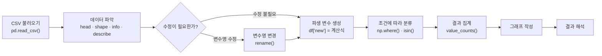

핵심 순서는 다음과 같음.

> 불러오기 → 파악하기 → 수정하기 → 파생 변수 만들기 → 분류하기 → 결과 확인하기

---

#### 1. CSV 파일 불러오기

### 과목별 평균 계산

> 출처: `빅데이터실습/Week03.md`

```python
exam[["math", "english", "science"]].mean()
```

결과:

```text
math       57.45
english    84.90
science    59.45
```

### 주요 변수

> 출처: `빅데이터실습/Week03.md`

| 변수 | 의미 |
|---|---|
| `manufacturer` | 자동차 제조사 |
| `model` | 자동차 모델 |
| `displ` | 배기량 |
| `year` | 생산 연도 |
| `cyl` | 실린더 수 |
| `trans` | 변속기 종류 |
| `drv` | 구동 방식 |
| `cty` | 도시 연비 |
| `hwy` | 고속도로 연비 |
| `fl` | 연료 종류 |
| `category` | 자동차 종류 |

### 데이터 파악

> 출처: `빅데이터실습/Week03.md`

```python
mpg.head()
mpg.tail()
mpg.shape
mpg.info()
mpg.describe()
```

원본 데이터 크기:

```text
(234, 11)
```

모든 변수를 포함한 통계:

```python
mpg.describe(include="all")
```

문자형 변수에서는 다음 항목이 추가.

| 항목 | 의미 |
|---|---|
| `unique` | 서로 다른 값의 개수 |
| `top` | 가장 많이 나타난 값 |
| `freq` | 가장 많이 나타난 값의 빈도 |

---

#### 6. 변수명 바꾸기

분석 중 오류가 발생했을 때 원본으로 돌아갈 수 있도록 복사본을 만들어 작업할 수 있음.

```python
mpg_new = mpg.copy()
```

`hwy`를 `highway`로 변경:

```python
mpg_new = mpg_new.rename(
    columns={
        "hwy": "highway"
    }
)
```

`cty`와 `hwy`를 한 번에 변경:

```python
mpg_new = mpg_new.rename(
    columns={
        "cty": "city",
        "hwy": "highway"
    }
)
```

변경 결과 확인:

```python
mpg_new.columns
```

원본은 그대로 유지.

```python
mpg.columns
```

초보 단계에서는 다음과 같이 반환값을 다시 저장하는 방식을 권장함.

```python
df = df.rename(columns={"old": "new"})
```

---

#### 7. 파생 변수 만들기

기존 변수를 조합하거나 계산해 만든 새로운 변수를 파생 변수라고 함.

### 통합 연비 만들기

> 출처: `빅데이터실습/Week03.md`

도시 연비와 고속도로 연비의 평균을 `total`에 저장함.

```python
mpg["total"] = (
    mpg["cty"] + mpg["hwy"]
) / 2
```

결과 확인:

```python
mpg[["cty", "hwy", "total"]].head()
```

여기서 `total`은 학습을 위한 단순 평균. 실제 공인 복합 연비 계산식과 같다고 단정하면 불가.

### 합격 여부 만들기

> 출처: `빅데이터실습/Week03.md`

통합 연비가 20 이상이면 `pass`, 아니면 `fail`을 부여함.

```python
mpg["test"] = np.where(
    mpg["total"] >= 20,
    "pass",
    "fail"
)
```

결과 확인:

```python
mpg[["total", "test"]].head()
```

---

#### 9. 중첩 조건으로 등급 만들기

### 등급 기준

> 출처: `빅데이터실습/Week03.md`

| 등급 | 조건 |
|---|---|
| A | 30 이상 |
| B | 20 이상 30 미만 |
| C | 20 미만 |

### 분류 흐름

> 출처: `빅데이터실습/Week03.md`

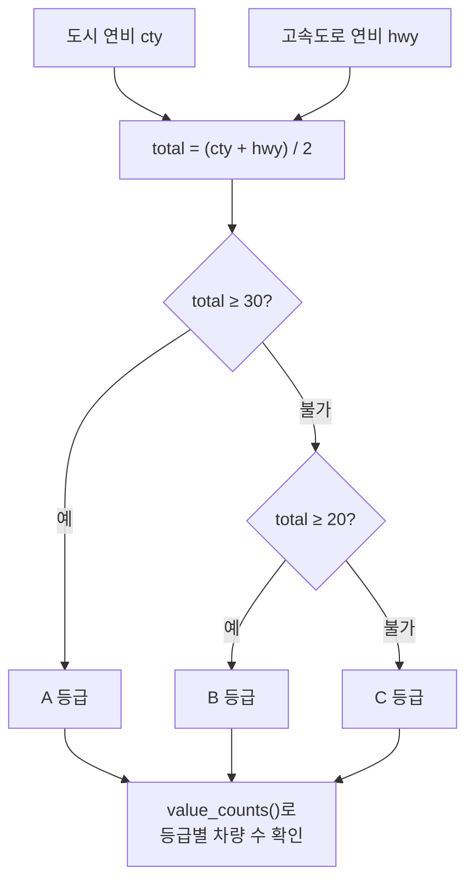

### 코드

> 출처: `빅데이터실습/Week03.md`

```python
mpg["grade"] = np.where(
    mpg["total"] >= 30,
    "A",
    np.where(
        mpg["total"] >= 20,
        "B",
        "C"
    )
)
```

중첩 조건에서는 가장 높은 기준부터 검사해야 함.

> 30 이상 검사 → 20 이상 검사 → 나머지 처리

---

#### 10. 여러 값 중 하나인지 확인하기

자동차 종류가 다음 중 하나라면 소형 자동차로 분류함.

- `compact`
- `subcompact`
- `2seater`

### 단계별 작성

> 출처: `빅데이터실습/Week03.md`

```python
grade_count = mpg["grade"]
grade_count = grade_count.value_counts()
grade_count = grade_count.sort_index()
```

### 전체 개념

> 출처: `빅데이터실습/Week03.md`

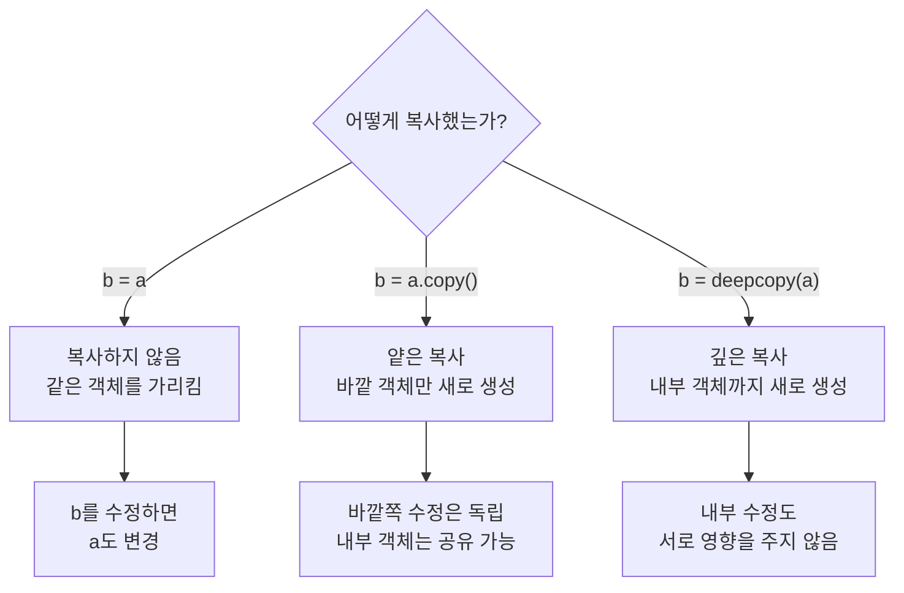

---

### 1. 대입: `b = a`

> 출처: `빅데이터실습/Week03.md`

```python
a = [[1], [2]]
b = a

b[0].append(99)

print(a)
# [[1, 99], [2]]

print(b)
# [[1, 99], [2]]
```

`b = a`는 객체를 복사하는 코드가 아님.  
`a`와 `b`가 **완전히 같은 리스트 객체**를 가리키게 함.

###### 메모리 구조

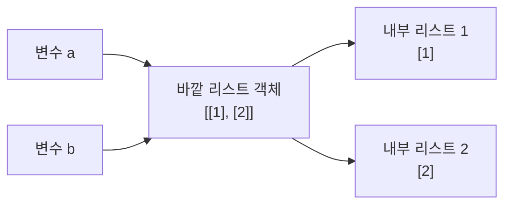

`a`와 `b`의 목적지가 같기 때문에 어느 쪽을 수정해도 같은 객체가 변경.

```python
print(a is b)
# True
```

###### 수정 후

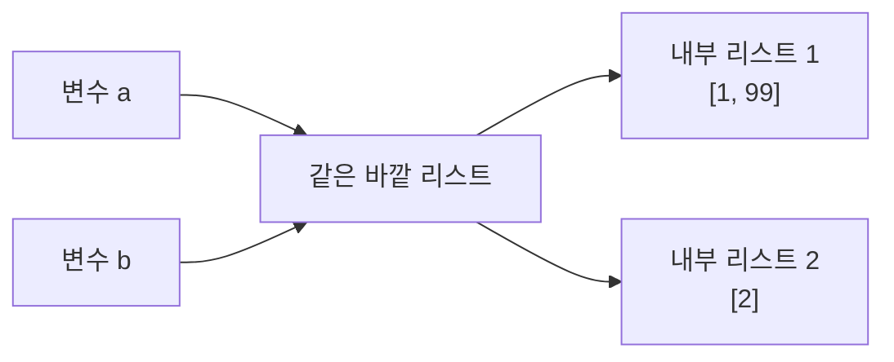

---

### 세 가지 방식 비교

> 출처: `빅데이터실습/Week03.md`

| 코드 | 바깥 객체 | 내부 객체 | 내부 수정 시 원본 |
|---|---|---|---|
| `b = a` | 공유 | 공유 | 변경 |
| `b = a.copy()` | 새로 생성 | 공유 가능 | 변경될 수 있음 |
| `b = deepcopy(a)` | 새로 생성 | 새로 생성 | 변경되지 않음 |

### 핵심 암기 그림

> 출처: `빅데이터실습/Week03.md`

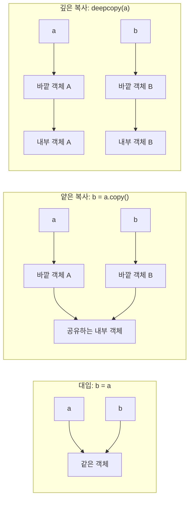

> **대입은 전부 공유, 얕은 복사는 내부만 공유 가능, 깊은 복사는 전부 분리**

---

### pandas의 `copy()`

> 출처: `빅데이터실습/Week03.md`

데이터 분석에서는 원본 데이터프레임을 보존하기 위해 다음과 같이 복사본을 생성함.

```python
mpg_new = mpg.copy()
```

이후 `mpg_new`의 열 이름을 바꿔도 일반적인 데이터프레임 작업에서는 원본 `mpg`가 유지.

```python
mpg_new = mpg_new.rename(
    columns={
        "cty": "city",
        "hwy": "highway"
    }
)

print(mpg.columns)
print(mpg_new.columns)
```

다만 데이터프레임의 셀 안에 리스트 같은 **변경 가능한 Python 객체가 들어 있으면**, 그 객체까지 재귀적으로 복사되는 것은 아님.

일반적인 숫자·문자 데이터 분석에서는 다음 형태로 기억하면 충분함.

```python
복사본 = 원본.copy()
```
---

#### 15. `midwest.csv` 종합 분석

`midwest.csv`는 437개 지역의 인구 통계 정보를 담고 있음.

### 분석 목표

> 출처: `빅데이터실습/Week03.md`

전체 인구에서 아시아계 인구가 차지하는 비율을 구하고, 평균보다 높은 지역과 낮은 지역을 분류함.

### 분석 흐름

> 출처: `빅데이터실습/Week03.md`

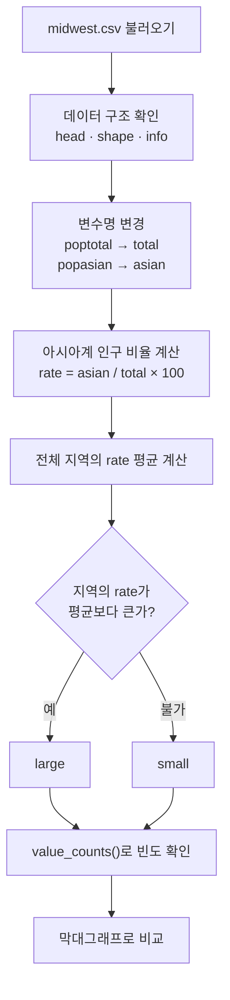

### 변수명 변경

> 출처: `빅데이터실습/Week03.md`

```python
midwest = midwest.rename(
    columns={
        "poptotal": "total",
        "popasian": "asian"
    }
)
```

### 아시아계 인구 비율 계산

> 출처: `빅데이터실습/Week03.md`

```python
midwest["rate"] = (
    midwest["asian"] /
    midwest["total"] *
    100
)
```

결과 확인:

```python
midwest[
    ["county", "state", "total", "asian", "rate"]
].head()
```

### 분포 확인

> 출처: `빅데이터실습/Week03.md`

```python
midwest["rate"].describe()
midwest["rate"].plot.hist()
```

### 평균을 기준으로 분류

> 출처: `빅데이터실습/Week03.md`

```python
mean_rate = midwest["rate"].mean()
```

평균:

```text
약 0.487246
```

```python
midwest["asiangroup"] = np.where(
    midwest["rate"] > mean_rate,
    "large",
    "small"
)
```

평균값을 `0.4872`처럼 직접 코드에 입력하지 않는 것이 중요함.

```python
# 권장하지 않는 방식
midwest["asiangroup"] = np.where(
    midwest["rate"] > 0.4872,
    "large",
    "small"
)
```

데이터가 변경되면 평균도 달라질 수 있기 때문.

### 데이터 파악

> 출처: `빅데이터실습/Week03.md`

```python
df.head()
df.tail()
df.shape
df.columns
df.info()
df.describe()
```

### 변수명 변경

> 출처: `빅데이터실습/Week03.md`

```python
df = df.rename(
    columns={
        "old": "new"
    }
)
```

### 두 그룹으로 분류

> 출처: `빅데이터실습/Week03.md`

```python
df["group"] = np.where(
    df["total"] >= 10,
    "high",
    "low"
)
```

### 여러 값 중 하나인지 확인

> 출처: `빅데이터실습/Week03.md`

```python
df["group"] = np.where(
    df["category"].isin(["A", "B"]),
    "target",
    "other"
)
```

### A. 개념 확인

> 출처: `빅데이터실습/Week03.md`

1. `shape`에는 괄호를 붙이지 않고 `info()`에는 괄호를 붙이는 이유를 설명.
2. `loc[2:5]`와 `iloc[2:5]`가 선택하는 행의 차이를 설명.
3. `df2 = df`와 `df2 = df.copy()`의 차이를 설명.
4. pandas 조건을 연결할 때 `or` 대신 `|`를 사용하는 이유를 확인.

### B. `exam.csv`

> 출처: `빅데이터실습/Week03.md`

5. `exam.csv`를 데이터프레임으로 불러오기.
6. 처음 5행과 마지막 5행을 확인.
7. 데이터의 행·열 개수와 변수명을 확인.
8. 수학, 영어, 과학 점수의 평균을 계산.
9. `id`를 인덱스로 지정한 새 데이터프레임을 생성.
10. id가 3부터 6까지인 학생을 선택.
11. 수학 점수가 50점보다 높은 학생을 선택.
12. 수학과 영어 점수가 모두 50점 이상인 학생을 선택.

### C. `mpg.csv`

> 출처: `빅데이터실습/Week03.md`

13. `mpg.csv`를 불러오고 전체 구조를 확인.
14. 원본을 복사한 뒤 `cty`를 `city`, `hwy`를 `highway`로 변경.
15. 도시 연비와 고속도로 연비의 평균인 `total`을 생성.
16. `total`이 20 이상이면 `pass`, 아니면 `fail`인 `test`를 생성.
17. `total`이 30 이상이면 A, 20 이상이면 B, 나머지는 C인 `grade`를 생성.
18. `compact`, `subcompact`, `2seater`를 `small`로 분류.
19. 제조사가 `hyundai` 또는 `honda`이면 `asia`로 분류.
20. `test`, `grade`, `size`, `land`의 빈도표를 생성.
21. 연비 등급별 자동차 수를 막대그래프로 표현.


## Python Module·Package·Dataset

### 개요

> 출처: `빅데이터실습/Week02.md`

`id(x)`의 출력값은 고정된 데이터값이 아니라 해당 실행에서 객체를 식별하는 값이므로 실행할 때 달라질 수 있음.

###### `range()`

```python
print(range(5))          # range(0, 5)
print(list(range(5)))    # [0, 1, 2, 3, 4]
list(range(5, 10))       # [5, 6, 7, 8, 9]
```

- `range(5)`는 0부터 5 직전인 4까지의 연속 정수를 나타냄.
- `range(5, 10)`은 5부터 10 직전인 9까지를 나타냄.
- 실제 리스트 형태로 확인하려면 `list()`로 변환함.

### 2. 모듈과 패키지

> 출처: `빅데이터실습/Week02.md`

- **모듈(module)**: 이미 작성된 프로그램이나 함수가 들어 있는 `.py` 파일.
- **패키지(package)**: 여러 모듈을 묶은 디렉터리(폴더)임.

패키지를 사용하는 기본 순서는 다음과 같음.

1. 설치: `pip install seaborn`
2. 로드: `import seaborn`
3. 함수 사용: `countplot()`

Anaconda에는 주요 패키지가 기본 설치되어 있어 별도 설치가 필요 없는 경우가 많음. 현재 설치된 패키지는 노트북에서 다음 명령으로 확인할 수 있음.

```python
!pip list
```

문서의 실제 셀에서는 위 명령이 주석 처리되어 있음.

```python
#현재 설치되어 있는 패키지들 확인
#!pip list
```

### 3. seaborn 패키지 활용

> 출처: `빅데이터실습/Week02.md`

###### seaborn의 의미와 로드 방법

- seaborn은 Matplotlib을 기반으로 색상 테마와 통계용 차트 기능을 더한 시각화 패키지.
- 전체 이름으로 사용: `import seaborn`
- 약어를 붙여 사용: `import seaborn as sns`
- 범주별 데이터 수를 막대그래프로 표시하는 함수: `seaborn.countplot()` 또는 `sns.countplot()`

Anaconda에는 seaborn이 기본 설치되어 있다는 전제로 설치 명령은 주석 처리하고 로드만 수행함.

```python
# !pip install seaborn
import seaborn
```

###### 간단한 빈도 그래프

```python
var = ['a', 'a', 'b', 'c']
seaborn.countplot(x=var)
```

- `a`는 2개, `b`는 1개, `c`는 1개이므로 각 범주의 빈도를 막대로 표현함.
- 출력 객체는 `<Axes: ylabel='count'>`임.

약어를 사용한 동일한 표현은 다음과 같음.

```python
import seaborn as sns
sns.countplot(x=var)
```

### 4. seaborn의 Titanic 데이터로 그래프 만들기

> 출처: `빅데이터실습/Week02.md`

###### 데이터셋 목록 확인

```python
import seaborn as sns
sns.get_dataset_names()
```

문서에 출력된 데이터셋은 총 23개.

`anagrams`, `anscombe`, `attention`, `brain_networks`, `car_crashes`, `diamonds`, `dots`, `dowjones`, `exercise`, `flights`, `fmri`, `geyser`, `glue`, `healthexp`, `iris`, `mpg`, `penguins`, `planets`, `seaice`, `taxis`, `tips`, `titanic`

###### Titanic 데이터 불러오기

```python
df = sns.load_dataset('titanic')
df
```

- 데이터 크기: **891행 × 15열**
- 컬럼: `survived`, `pclass`, `sex`, `age`, `sibsp`, `parch`, `fare`, `embarked`, `class`, `who`, `adult_male`, `deck`, `embark_town`, `alive`, `alone`
- 출력은 앞의 0~4번 행과 뒤의 886~890번 행을 보여 주고, 중간 행은 생략함.
- `NaN`은 결측값을 뜻함.

###### Titanic 빈도 그래프 세 가지

```python
# 성별 데이터 수
sns.countplot(data=df, x='sex')

# 객실 등급별 데이터 수
sns.countplot(data=df, x='class')

# 객실 등급별로 생존 여부까지 구분
sns.countplot(data=df, x='class', hue='alive')
```

- `data`에는 사용할 DataFrame을 넣음.
- `x`에는 가로축에서 빈도를 셀 컬럼을 넣음.
- `hue`를 지정하면 같은 범주 안을 다른 범주로 다시 나누어 색으로 구분함.
- 각 셀의 출력 객체는 각각 `xlabel='sex'` 또는 `xlabel='class'`, `ylabel='count'`인 `Axes`임.

### 5. pydataset 패키지

> 출처: `빅데이터실습/Week02.md`

###### 설치

```python
!pip install pydataset
```

문서 제목에는 `pydata`라고 적혀 있지만 실제 설치·로드하는 패키지 이름은 **`pydataset`**임.

###### 패키지의 데이터셋 목록 확인

```python
import pydataset
pydataset.data()
```

- 출력 규모: **757행 × 2열**
- 컬럼: `dataset_id`, `title`
- 출력 예: 앞부분의 `AirPassengers`, `BJsales`, `BOD`, `Formaldehyde`, `HairEyeColor`와 뒷부분의 `VerbAgg`, `cake`, `cbpp`, `grouseticks`, `sleepstudy`

###### `mtcars` 불러오기

```python
df = pydataset.data('mtcars')  # mtcars 데이터를 df에 할당
df                             # df 출력
```

- 자동차 모델명이 인덱스.
- 총 **32개 자동차 × 11개 변수**로 구성.
- 컬럼: `mpg`, `cyl`, `disp`, `hp`, `drat`, `wt`, `qsec`, `vs`, `am`, `gear`, `carb`
- 문서 출력의 자동차는 Mazda RX4부터 Volvo 142E까지 32종이며, 각 행에 위 11개 수치가 들어 있음.

---

#### 4장 데이터 프레임 — 공통 개념

- Pandas는 라벨이 붙은 **2차원 배열인 DataFrame**과 **1차원 배열인 Series**를 다루는 도구.
- DataFrame의 행 라벨은 **index(인덱스)**임.
- DataFrame의 열 라벨은 **column(컬럼)** 또는 **변수**임.
- Series는 1차원 구조이므로 행에만 라벨이 붙으며, 이를 index라고 함.
- 문서의 구조 그림은 DataFrame이 여러 컬럼과 여러 인덱스로 이루어진 값의 표이고, Series는 하나의 값 열과 인덱스로 이루어진 구조임을 보여 제공.

---

#### 4장 Lab1 — 시험 성적 데이터로 DataFrame 만들기


## Pandas DataFrame 기초

### 1. Pandas 로드와 DataFrame 생성

> 출처: `빅데이터실습/Week02.md`

```python
import pandas as pd

df1 = pd.DataFrame({
    'name'    : ['김기훈', '이유진', '박동현', '김민지'],
    'english' : [90, 80, 60, 70],
    'math'    : [50, 60, 100, 20]
})
df1
```

생성 결과:

| index | name | english | math |
|---:|---|---:|---:|
| 0 | 김기훈 | 90 | 50 |
| 1 | 이유진 | 80 | 60 |
| 2 | 박동현 | 60 | 100 |
| 3 | 김민지 | 70 | 20 |

- 컬럼은 `name`, `english`, `math`임.
- 문서 설명에는 생성한 프레임 이름을 `df`로 사용한다고 되어 있지만 실제 코드는 **`df1`**을 사용함.
- 인덱스를 따로 지정하지 않으면 0부터 자동으로 부여.

### 2. DataFrame의 구성 확인

> 출처: `빅데이터실습/Week02.md`

```python
df1.index
```
[Week02.ipynb](https://github.com/user-attachments/files/31672798/Week02.ipynb) 실습파일 링크


## 데이터 불러오기·파악·선택

### pandas 불러오기

> 출처: `빅데이터실습/Week03.md`

```python
import pandas as pd
```

일반적으로 pandas는 `pd`라는 별명으로 불러옴.

### `exam.csv` 불러오기

> 출처: `빅데이터실습/Week03.md`

```python
exam = pd.read_csv("data/exam.csv")
exam
```

현재 파이썬 파일과 CSV 파일이 같은 폴더라면 다음과 같이 작성할 수도 있음.

```python
exam = pd.read_csv("exam.csv")
```

---

#### 2. 데이터 구조 파악하기

데이터를 불러온 뒤에는 바로 분석하지 말고 전체적인 구조부터 확인함.

### 주요 명령어

> 출처: `빅데이터실습/Week03.md`

| 코드 | 확인하는 내용 | 주의점 |
|---|---|---|
| `df.head()` | 처음 5행 | `head(10)`처럼 개수 지정 가능 |
| `df.tail()` | 마지막 5행 | `tail(10)`처럼 개수 지정 가능 |
| `df.shape` | 행과 열의 개수 | 함수가 아니므로 괄호 없음 |
| `df.columns` | 변수명 | 오타와 불필요한 공백 확인 |
| `df.info()` | 자료형과 결측치 | 결과를 화면에 직접 출력 |
| `df.describe()` | 수치형 변수의 요약 통계 | 문자형은 기본적으로 제외 |

### 처음과 마지막 데이터 확인

> 출처: `빅데이터실습/Week03.md`

```python
exam.head()
```

```text
   id  nclass  math  english  science
0   1       1    50       98       50
1   2       1    60       97       60
2   3       1    45       86       78
3   4       1    30       98       58
4   5       2    25       80       65
```

처음 10행을 확인하려면 다음과 같이 작성함.

```python
exam.head(10)
```

마지막 5행:

```python
exam.tail()
```

```text
    id  nclass  math  english  science
15  16       4    58       98       65
16  17       5    65       68       98
17  18       5    80       78       90
18  19       5    89       68       87
19  20       5    78       83       58
```

### 행과 열 개수 확인

> 출처: `빅데이터실습/Week03.md`

```python
exam.shape
```

결과:

```text
(20, 5)
```

- 행: 20개
- 열: 5개

`shape`은 함수가 아니라 데이터프레임의 속성.

```python
exam.shape    # 올바른 코드
exam.shape()  # 오류 발생
```

### 변수명 확인

> 출처: `빅데이터실습/Week03.md`

```python
exam.columns
```

결과:

```text
Index(['id', 'nclass', 'math', 'english', 'science'], dtype='object')
```

리스트로 확인하려면 다음과 같이 작성함.

```python
exam.columns.tolist()
```

### 변수 속성 확인

> 출처: `빅데이터실습/Week03.md`

```python
exam.info()
```

`info()`에서 확인할 수 있는 내용:

- 전체 행 개수
- 열 이름
- 결측치가 아닌 값의 개수
- 각 열의 자료형
- 데이터프레임의 메모리 사용량

---

#### 3. 요약 통계량 이해하기

```python
exam.describe()
```

`describe()`는 기본적으로 숫자형 변수의 요약 통계량을 보여 줌.

| 항목 | 의미 |
|---|---|
| `count` | 결측치를 제외한 데이터 개수 |
| `mean` | 평균 |
| `std` | 표준편차 |
| `min` | 최솟값 |
| `25%` | 제1사분위수 |
| `50%` | 중앙값 |
| `75%` | 제3사분위수 |
| `max` | 최댓값 |

문자형 변수를 포함한 전체 통계를 확인하려면 다음과 같이 작성함.

```python
exam.describe(include="all")
```

### 특정 변수의 통계만 확인

> 출처: `빅데이터실습/Week03.md`

```python
exam["math"].describe()
```

### 여러 변수의 통계 확인

> 출처: `빅데이터실습/Week03.md`

```python
exam[["math", "english", "science"]].describe()
```

---

#### 4. 원하는 행 선택하기

### `loc`와 `iloc`의 차이

> 출처: `빅데이터실습/Week03.md`

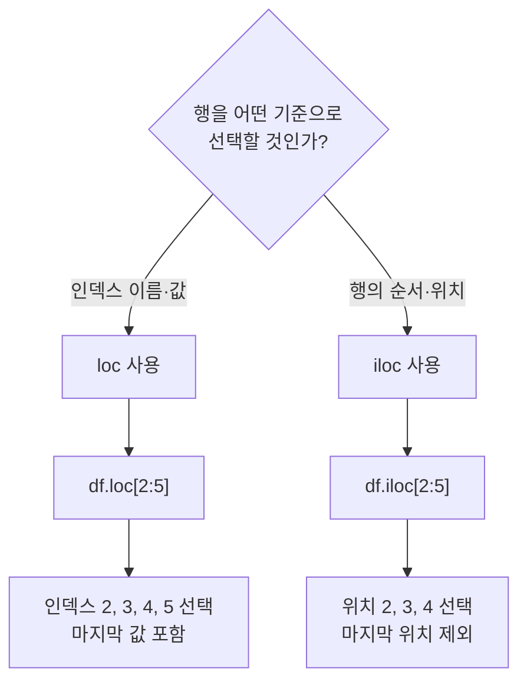

| 코드 | 기준 | 마지막 값 |
|---|---|---|
| `df.loc[2:5]` | 인덱스 라벨 | 5 포함 |
| `df.iloc[2:5]` | 행의 위치 | 위치 5 제외 |

### `loc` 사용하기

> 출처: `빅데이터실습/Week03.md`

인덱스 값이 5인 행을 Series로 출력함.

```python
exam.loc[5]
```

데이터프레임 형태로 출력하려면 이중 대괄호를 사용함.

```python
exam.loc[[5]]
```

여러 행 선택:

```python
exam.loc[[5, 7, 9]]
```

범위 선택:

```python
exam.loc[5:10]
```

`loc[5:10]`은 인덱스 10까지 포함함.

### 특정 열을 인덱스로 설정하기

> 출처: `빅데이터실습/Week03.md`

```python
exam_by_id = exam.set_index("id")
exam_by_id.head()
```

id가 3부터 6까지인 행 선택:

```python
exam_by_id.loc[3:6]
```

### `iloc` 사용하기

> 출처: `빅데이터실습/Week03.md`

행의 순서를 기준으로 선택함.

```python
exam_by_id.iloc[[0, 3, 5]]
```

위 코드는 첫 번째, 네 번째, 여섯 번째 행을 선택함.

```python
exam_by_id.iloc[2:5]
```

위 코드는 위치가 2, 3, 4인 행을 선택함.

### 조건에 맞는 행 선택

> 출처: `빅데이터실습/Week03.md`

수학 점수가 50점보다 높은 학생:

```python
exam.loc[exam["math"] > 50]
```

수학 점수가 50점 이상인 학생:

```python
exam.loc[exam["math"] >= 50]
```

수학 점수가 50점 이상이고 영어 점수가 80점 이상인 학생:

```python
exam.loc[
    (exam["math"] >= 50) &
    (exam["english"] >= 80)
]
```

pandas Series 조건에서는 다음 연산자를 사용함.

| 의미 | 연산자 |
|---|---|
| 그리고 | `&` |
| 또는 | `\|` |
| 반대 | `~` |

각 조건은 괄호로 감싸는 것이 중요함.

---

#### 5. `mpg.csv` 데이터 파악하기

```python
mpg = pd.read_csv("data/mpg.csv")
```

`mpg.csv`는 자동차 234종의 정보를 담은 데이터.

### 통합 연비 통계 확인

> 출처: `빅데이터실습/Week03.md`

```python
mpg["total"].describe()
```

히스토그램:

```python
mpg["total"].plot.hist()
```

---

#### 8. 조건에 따라 파생 변수 만들기

### `np.where()` 기본 구조

> 출처: `빅데이터실습/Week03.md`

```python
import numpy as np

np.where(조건, 참일 때 값, 거짓일 때 값)
```

### 데이터 불러오기

> 출처: `빅데이터실습/Week03.md`

```python
midwest = pd.read_csv("data/midwest.csv")
```

데이터 구조 확인:

```python
midwest.head()
midwest.shape
midwest.info()
```

원본 데이터 크기:

```text
(437, 28)
```

### 조건에 맞는 행 선택

> 출처: `빅데이터실습/Week03.md`

```python
df.loc[df["total"] >= 10]
```


## 데이터 변환·분류·빈도

### 반복 조건 사용

> 출처: `빅데이터실습/Week03.md`

```python
mpg["size"] = np.where(
    (mpg["category"] == "compact") |
    (mpg["category"] == "subcompact") |
    (mpg["category"] == "2seater"),
    "small",
    "large"
)
```

### `isin()` 사용

> 출처: `빅데이터실습/Week03.md`

`isin()`을 사용하면 더 간단하게 표현할 수 있음.

```python
small_categories = [
    "compact",
    "subcompact",
    "2seater"
]

mpg["size"] = np.where(
    mpg["category"].isin(small_categories),
    "small",
    "large"
)
```

제조사가 현대 또는 혼다인지 분류:

```python
mpg["land"] = np.where(
    mpg["manufacturer"].isin(
        ["hyundai", "honda"]
    ),
    "asia",
    "non-asia"
)
```

---

#### 11. 빈도표 만들기

변수에 각 값이 몇 개씩 있는지 확인할 때 `value_counts()`를 사용함.

### 합격 여부 빈도

> 출처: `빅데이터실습/Week03.md`

```python
mpg["test"].value_counts()
```

결과:

```text
pass    128
fail    106
```

### 등급별 빈도

> 출처: `빅데이터실습/Week03.md`

```python
mpg["grade"].value_counts()
```

알파벳 순서로 정렬:

```python
count_grade = (
    mpg["grade"]
    .value_counts()
    .sort_index()
)
```

결과:

```text
A     10
B    118
C    106
```

### 자동차 크기별 빈도

> 출처: `빅데이터실습/Week03.md`

```python
mpg["size"].value_counts()
```

결과:

```text
large    147
small     87
```

### 제조사 지역별 빈도

> 출처: `빅데이터실습/Week03.md`

```python
mpg["land"].value_counts()
```

결과:

```text
non-asia    211
asia         23
```

---

#### 12. 그래프 만들기

### 메서드 체이닝

> 출처: `빅데이터실습/Week03.md`

```python
grade_count = (
    mpg["grade"]
    .value_counts()
    .sort_index()
)
```

메서드 체이닝은 중간 변수를 줄일 수 있음. 다만 코드가 너무 길어지면 여러 단계로 나누는 편이 디버깅하기 쉬움.

---
#### 14. 얕은 복사와 깊은 복사

Python의 변수에는 객체 자체가 들어가는 것이 아니라, **객체가 저장된 메모리 위치를 가리키는 참조**가 저장.

### 빈도 확인

> 출처: `빅데이터실습/Week03.md`

```python
midwest["asiangroup"].value_counts()
```

결과:

```text
small    318
large    119
```

### 파생 변수 생성

> 출처: `빅데이터실습/Week03.md`

```python
df["total"] = (
    df["column1"] +
    df["column2"]
)
```

### 빈도표

> 출처: `빅데이터실습/Week03.md`

```python
df["group"].value_counts()
```

---

#### 17. 실습 문제


## Pandas 데이터 전처리와 집계

### 개요

> 출처: `빅데이터실습/Week04.md`

```bash
python -m pip install pandas numpy
```

```python
import pandas as pd
import numpy as np
```

| 파일 | 실습에 필요한 주요 열 |
| --- | --- |
| `exam.csv` | `id`, `nclass`, `math`, `english`, `science` |
| `mpg.csv` | `manufacturer`, `model`, `displ`, `drv`, `cty`, `hwy`, `fl`, `category` |
| `midwest.csv` | `county`, `state`, `poptotal`, `popadults`, `popasian` |

<a id="section-06-1"></a>

### 06-1 데이터 전처리 — 원하는 형태로 데이터 가공하기

> 출처: `빅데이터실습/Week04.md`

- 수집된(주어진) 데이터를 원하는 형태로 변형하여 분석
- 데이터 전처리(Data Preprocessing) : 분석에 적합하게 데이터를 가공하는 작업

(동의어)

1. 데이터 전처리(Data Preprocessing)
2. 데이터 가공(Data manipulation)
3. 데이터 핸들링(Data Handling)
4. 데이터 랭글링(Data wrangling)
5. 데이터 먼징(Data Munging)
6. 데이터 클리닝(Data Cleaning)

**데이터 가공 흐름**

원자료 → 필요한 행·열 추출 → 집단별 요약

예를 들어 1·2반의 영어 점수만 추출한 뒤 반별 평균을 구하면 다음과 같은 요약표를 만들 수 있음.

| nclass | 영어 평균 |
| --- | --- |
| 1 | 94.75 |
| 2 | 84.25 |

> 사용할 함수

| 함수 | 기능 |
| --- | --- |
| query() | 행 추출 |
| df[] | 열(컬럼, 변수) 추출 |
| sort_values() | 정렬 |
| groupby() | 집단별로 나누기 |
| assign() | 변수 추가하기 |
| agg() | 집단별 통계치 구하기 |
| merge() | 데이터 합치기(열) |
| concat() | 데이터 합치기(행) |

<a id="section-06-2"></a>

### 06-2 조건에 맞는 행 추출하기

> 출처: `빅데이터실습/Week04.md`

###### Lab1. 반별(nclass) 데이터를 추출하여 작업해보자

- `exam.query('nclass == 1')`
- SQL : "SELECT * FROM exam WHERE nclass = 1"
- row를 줄이는 과정

**행 추출:** `query('nclass == 1')`은 `nclass` 값이 1인 행을 남기고, 다른 반의 행은 제외함. 열 구성은 유지.

```python
import pandas as pd
exam = pd.read_csv("exam.csv")
exam.head()
```

<details>
<summary>실행 결과</summary>

| index | id | nclass | math | english | science |
| --- | --- | --- | --- | --- | --- |
| 0 | 1 | 1 | 50 | 98 | 50 |
| 1 | 2 | 1 | 60 | 97 | 60 |
| 2 | 3 | 1 | 45 | 86 | 78 |
| 3 | 4 | 1 | 30 | 98 | 58 |
| 4 | 5 | 2 | 25 | 80 | 65 |

</details>

```python
# 1반 (nclass == 1) 데이터 추출
exam.query('nclass == 1')
```

<details>
<summary>실행 결과</summary>

| index | id | nclass | math | english | science |
| --- | --- | --- | --- | --- | --- |
| 0 | 1 | 1 | 50 | 98 | 50 |
| 1 | 2 | 1 | 60 | 97 | 60 |
| 2 | 3 | 1 | 45 | 86 | 78 |
| 3 | 4 | 1 | 30 | 98 | 58 |

</details>

```python
# 2반 (nclass == 2) 데이터 추출
exam.query('nclass == 2')
```

<details>
<summary>실행 결과</summary>

| index | id | nclass | math | english | science |
| --- | --- | --- | --- | --- | --- |
| 4 | 5 | 2 | 25 | 80 | 65 |
| 5 | 6 | 2 | 50 | 89 | 98 |
| 6 | 7 | 2 | 80 | 90 | 45 |
| 7 | 8 | 2 | 90 | 78 | 25 |

</details>

```python
# 1반이 아닌(nclass != 1) 다른 반의 데이터 추출
exam.query('nclass != 1')
```

<details>
<summary>실행 결과</summary>

| index | id | nclass | math | english | science |
| --- | --- | --- | --- | --- | --- |
| 4 | 5 | 2 | 25 | 80 | 65 |
| 5 | 6 | 2 | 50 | 89 | 98 |
| 6 | 7 | 2 | 80 | 90 | 45 |
| 7 | 8 | 2 | 90 | 78 | 25 |
| 8 | 9 | 3 | 20 | 98 | 15 |
| 9 | 10 | 3 | 50 | 98 | 45 |
| 10 | 11 | 3 | 65 | 65 | 65 |
| 11 | 12 | 3 | 45 | 85 | 32 |
| 12 | 13 | 4 | 46 | 98 | 65 |
| 13 | 14 | 4 | 48 | 87 | 12 |
| 14 | 15 | 4 | 75 | 56 | 78 |
| 15 | 16 | 4 | 58 | 98 | 65 |
| 16 | 17 | 5 | 65 | 68 | 98 |
| 17 | 18 | 5 | 80 | 78 | 90 |
| 18 | 19 | 5 | 89 | 68 | 87 |
| 19 | 20 | 5 | 78 | 83 | 58 |

</details>

- 여러 조건을 충족하는 행 추출

```python
exam.query('nclass == 1 & math >= 50')
```

<details>
<summary>실행 결과</summary>

| index | id | nclass | math | english | science |
| --- | --- | --- | --- | --- | --- |
| 0 | 1 | 1 | 50 | 98 | 50 |
| 1 | 2 | 1 | 60 | 97 | 60 |

</details>

```python
exam.query('english < 90 | science < 50')
```

<details>
<summary>실행 결과</summary>

| index | id | nclass | math | english | science |
| --- | --- | --- | --- | --- | --- |
| 2 | 3 | 1 | 45 | 86 | 78 |
| 4 | 5 | 2 | 25 | 80 | 65 |
| 5 | 6 | 2 | 50 | 89 | 98 |
| 6 | 7 | 2 | 80 | 90 | 45 |
| 7 | 8 | 2 | 90 | 78 | 25 |
| 8 | 9 | 3 | 20 | 98 | 15 |
| 9 | 10 | 3 | 50 | 98 | 45 |
| 10 | 11 | 3 | 65 | 65 | 65 |
| 11 | 12 | 3 | 45 | 85 | 32 |
| 13 | 14 | 4 | 48 | 87 | 12 |
| 14 | 15 | 4 | 75 | 56 | 78 |
| 16 | 17 | 5 | 65 | 68 | 98 |
| 17 | 18 | 5 | 80 | 78 | 90 |
| 18 | 19 | 5 | 89 | 68 | 87 |
| 19 | 20 | 5 | 78 | 83 | 58 |

</details>

> 목록에 해당하면 추출

```python
exam.query('nclass == 1 | nclass == 3 | nclass == 5')
```

<details>
<summary>실행 결과</summary>

| index | id | nclass | math | english | science |
| --- | --- | --- | --- | --- | --- |
| 0 | 1 | 1 | 50 | 98 | 50 |
| 1 | 2 | 1 | 60 | 97 | 60 |
| 2 | 3 | 1 | 45 | 86 | 78 |
| 3 | 4 | 1 | 30 | 98 | 58 |
| 8 | 9 | 3 | 20 | 98 | 15 |
| 9 | 10 | 3 | 50 | 98 | 45 |
| 10 | 11 | 3 | 65 | 65 | 65 |
| 11 | 12 | 3 | 45 | 85 | 32 |
| 16 | 17 | 5 | 65 | 68 | 98 |
| 17 | 18 | 5 | 80 | 78 | 90 |
| 18 | 19 | 5 | 89 | 68 | 87 |
| 19 | 20 | 5 | 78 | 83 | 58 |

</details>

```python
exam.query('nclass in [1, 3, 5]')
```

<details>
<summary>실행 결과</summary>

| index | id | nclass | math | english | science |
| --- | --- | --- | --- | --- | --- |
| 0 | 1 | 1 | 50 | 98 | 50 |
| 1 | 2 | 1 | 60 | 97 | 60 |
| 2 | 3 | 1 | 45 | 86 | 78 |
| 3 | 4 | 1 | 30 | 98 | 58 |
| 8 | 9 | 3 | 20 | 98 | 15 |
| 9 | 10 | 3 | 50 | 98 | 45 |
| 10 | 11 | 3 | 65 | 65 | 65 |
| 11 | 12 | 3 | 45 | 85 | 32 |
| 16 | 17 | 5 | 65 | 68 | 98 |
| 17 | 18 | 5 | 80 | 78 | 90 |
| 18 | 19 | 5 | 89 | 68 | 87 |
| 19 | 20 | 5 | 78 | 83 | 58 |

</details>

> query()로 추출한 행으로 데이터 만들기

```python
nclass1 = exam.query('nclass == 1')
nclass1
```

<details>
<summary>실행 결과</summary>

| index | id | nclass | math | english | science |
| --- | --- | --- | --- | --- | --- |
| 0 | 1 | 1 | 50 | 98 | 50 |
| 1 | 2 | 1 | 60 | 97 | 60 |
| 2 | 3 | 1 | 45 | 86 | 78 |
| 3 | 4 | 1 | 30 | 98 | 58 |

</details>

```python
nclass2 = exam.query('nclass == 2')
nclass2
```

<details>
<summary>실행 결과</summary>

| index | id | nclass | math | english | science |
| --- | --- | --- | --- | --- | --- |
| 4 | 5 | 2 | 25 | 80 | 65 |
| 5 | 6 | 2 | 50 | 89 | 98 |
| 6 | 7 | 2 | 80 | 90 | 45 |
| 7 | 8 | 2 | 90 | 78 | 25 |

</details>

```python
nclass1['math'].mean()  # 1반 수학 평균
```

<details>
<summary>실행 결과</summary>

```text
np.float64(46.25)
```

</details>

```python
nclass2['math'].mean()  # 2반 수학 평균
```

<details>
<summary>실행 결과</summary>

```text
np.float64(61.25)
```

</details>

> query() - 조건에 맞는 데이터 추출하기 / 문자 변수

- 데이터 값이 문자인 경우 추출하여 작업해보자
- `exam.query('nclass == 1')`
- `df.query(' sex == "F" ')`
- `df.query(" sex == 'F' ")`

```python
df = pd.DataFrame({'sex' : ['F', 'M', 'F', 'M'],
                   'country' : ['Korea', 'China', 'Japan', 'USA']})
df
```

<details>
<summary>실행 결과</summary>

| index | sex | country |
| --- | --- | --- |
| 0 | F | Korea |
| 1 | M | China |
| 2 | F | Japan |
| 3 | M | USA |

</details>

```python
df.query(' sex == "F" & country == "Korea" ' )
```

<details>
<summary>실행 결과</summary>

| index | sex | country |
| --- | --- | --- |
| 0 | F | Korea |

</details>

```python
df.query(" sex == 'F' & country == 'Korea' " )
```

<details>
<summary>실행 결과</summary>

| index | sex | country |
| --- | --- | --- |
| 0 | F | Korea |

</details>

```python
n = 'F'
df.query('sex == @n')   #  외부 변수 사용
```

<details>
<summary>실행 결과</summary>

| index | sex | country |
| --- | --- | --- |
| 0 | F | Korea |
| 2 | F | Japan |

</details>

###### Lab2. mpg 데이터 분석 (혼자서 해보기, 배포자료 참고)

> Q1 : 자동차 배기량(displ)이 4이하인 자동차와 4초과인 자동차 중 어떤 자동차의 고속도로 연비(hwy)가 높은가 ?

```python
mpg = pd.read_csv("mpg.csv")
mpg.head()
```

<details>
<summary>실행 결과</summary>

| index | manufacturer | model | displ | year | cyl | trans | drv | cty | hwy | fl | category |
| --- | --- | --- | --- | --- | --- | --- | --- | --- | --- | --- | --- |
| 0 | audi | a4 | 1.8 | 1999 | 4 | auto(l5) | f | 18 | 29 | p | compact |
| 1 | audi | a4 | 1.8 | 1999 | 4 | manual(m5) | f | 21 | 29 | p | compact |
| 2 | audi | a4 | 2.0 | 2008 | 4 | manual(m6) | f | 20 | 31 | p | compact |
| 3 | audi | a4 | 2.0 | 2008 | 4 | auto(av) | f | 21 | 30 | p | compact |
| 4 | audi | a4 | 2.8 | 1999 | 6 | auto(l5) | f | 16 | 26 | p | compact |

</details>

```python
mpg_lt4 = mpg.query('displ <= 4')
mpg_lt4.head()
```

<details>
<summary>실행 결과</summary>

| index | manufacturer | model | displ | year | cyl | trans | drv | cty | hwy | fl | category |
| --- | --- | --- | --- | --- | --- | --- | --- | --- | --- | --- | --- |
| 0 | audi | a4 | 1.8 | 1999 | 4 | auto(l5) | f | 18 | 29 | p | compact |
| 1 | audi | a4 | 1.8 | 1999 | 4 | manual(m5) | f | 21 | 29 | p | compact |
| 2 | audi | a4 | 2.0 | 2008 | 4 | manual(m6) | f | 20 | 31 | p | compact |
| 3 | audi | a4 | 2.0 | 2008 | 4 | auto(av) | f | 21 | 30 | p | compact |
| 4 | audi | a4 | 2.8 | 1999 | 6 | auto(l5) | f | 16 | 26 | p | compact |

</details>

```python
mpg_gt4 = mpg.query('displ > 4')
mpg_gt4.head()
```

<details>
<summary>실행 결과</summary>

| index | manufacturer | model | displ | year | cyl | trans | drv | cty | hwy | fl | category |
| --- | --- | --- | --- | --- | --- | --- | --- | --- | --- | --- | --- |
| 17 | audi | a6 quattro | 4.2 | 2008 | 8 | auto(s6) | 4 | 16 | 23 | p | midsize |
| 18 | chevrolet | c1500 suburban 2wd | 5.3 | 2008 | 8 | auto(l4) | r | 14 | 20 | r | suv |
| 19 | chevrolet | c1500 suburban 2wd | 5.3 | 2008 | 8 | auto(l4) | r | 11 | 15 | e | suv |
| 20 | chevrolet | c1500 suburban 2wd | 5.3 | 2008 | 8 | auto(l4) | r | 14 | 20 | r | suv |
| 21 | chevrolet | c1500 suburban 2wd | 5.7 | 1999 | 8 | auto(l4) | r | 13 | 17 | r | suv |

</details>

```python
mpg_lt4['hwy'].mean()
```

<details>
<summary>실행 결과</summary>

```text
np.float64(25.96319018404908)
```

</details>

```python
mpg_gt4['hwy'].mean()
```

<details>
<summary>실행 결과</summary>

```text
np.float64(17.64788732394366)
```

</details>

```python
if mpg_lt4['hwy'].mean() > mpg_gt4['hwy'].mean() :
    print('배기량 4 이하 자동차의 고속도로 연비가 높음')
elif mpg_lt4['hwy'].mean() < mpg_gt4['hwy'].mean() :
    print('배기량 4 초과 자동차의 고속도로 연비가 높음')
```

<details>
<summary>실행 결과</summary>

```text
배기량 4 이하 자동차의 고속도로 연비가 높음
```

</details>

> Q2 : 자동차 회사에 따라 도시 연비가 어떻게 다른가?

- 'audi'와 'toyota' 중 어느 자동차 회사(manufacturer)의 도시 연비가 높은지 알아보기

```python
mpg_audi = mpg.query('manufacturer == "audi"')
mpg_audi.head()
```

<details>
<summary>실행 결과</summary>

| index | manufacturer | model | displ | year | cyl | trans | drv | cty | hwy | fl | category |
| --- | --- | --- | --- | --- | --- | --- | --- | --- | --- | --- | --- |
| 0 | audi | a4 | 1.8 | 1999 | 4 | auto(l5) | f | 18 | 29 | p | compact |
| 1 | audi | a4 | 1.8 | 1999 | 4 | manual(m5) | f | 21 | 29 | p | compact |
| 2 | audi | a4 | 2.0 | 2008 | 4 | manual(m6) | f | 20 | 31 | p | compact |
| 3 | audi | a4 | 2.0 | 2008 | 4 | auto(av) | f | 21 | 30 | p | compact |
| 4 | audi | a4 | 2.8 | 1999 | 6 | auto(l5) | f | 16 | 26 | p | compact |

</details>

```python
mpg_toyota = mpg.query('manufacturer == "toyota" ')
mpg_toyota.head()
```

<details>
<summary>실행 결과</summary>

| index | manufacturer | model | displ | year | cyl | trans | drv | cty | hwy | fl | category |
| --- | --- | --- | --- | --- | --- | --- | --- | --- | --- | --- | --- |
| 173 | toyota | 4runner 4wd | 2.7 | 1999 | 4 | manual(m5) | 4 | 15 | 20 | r | suv |
| 174 | toyota | 4runner 4wd | 2.7 | 1999 | 4 | auto(l4) | 4 | 16 | 20 | r | suv |
| 175 | toyota | 4runner 4wd | 3.4 | 1999 | 6 | auto(l4) | 4 | 15 | 19 | r | suv |
| 176 | toyota | 4runner 4wd | 3.4 | 1999 | 6 | manual(m5) | 4 | 15 | 17 | r | suv |
| 177 | toyota | 4runner 4wd | 4.0 | 2008 | 6 | auto(l5) | 4 | 16 | 20 | r | suv |

</details>

```python
mpg_audi['cty'].mean()
```

<details>
<summary>실행 결과</summary>

```text
np.float64(17.61111111111111)
```

</details>

```python
mpg_toyota['cty'].mean()
```

<details>
<summary>실행 결과</summary>

```text
np.float64(18.529411764705884)
```

</details>

> Q3 : 'chevrolet' 'ford' 'honda' 자동차의 고속도로 연비(hwy) 평균을 알아보려고 함

```python
mpg_new = mpg.query("manufacturer in ['chevrolet', 'ford', 'honda']")
mpg_new['manufacturer'].value_counts()
```

<details>
<summary>실행 결과</summary>

```text
manufacturer
ford         25
chevrolet    19
honda         9
Name: count, dtype: int64
```

</details>

```python
mpg_new['hwy'].mean()
```

<details>
<summary>실행 결과</summary>

```text
np.float64(22.50943396226415)
```

</details>

###### Lab3. 안 보고 mpg 데이터 분석 (혼자서 안 보고 해보기)

> Q1 : 자동차 배기량(displ)이 4이하인 자동차와 4초과인 자동차 중 어떤 자동차의 고속도로 연비(hwy)가 높은가 ?

> Q2 : 자동차 회사에 따라 도시 연비가 어떻게 다른가?

- 'audi'와 'toyota' 중 어느 자동차 회사(manufacturer)의 도시 연비가 높은지 알아보기

> Q3 : 'chevrolet' 'ford' 'honda' 자동차의 고속도로 연비(hwy) 평균을 알아보려고 함

<a id="section-06-3"></a>

### 06-3 필요한 열 추출하기

> 출처: `빅데이터실습/Week04.md`

###### Lab1. 변수(컬럼) 추출

- `df['컬럼 이름']`
- column을 줄이는 과정

**열 추출:** `exam[["nclass", "english"]]`은 반과 영어 점수 열만 남김. 행은 그대로 유지되며 결과는 데이터프레임.

```python
#수학성적 추출
exam['math']  # 시리즈 추출
```

<details>
<summary>실행 결과</summary>

```text
0     50
1     60
2     45
3     30
4     25
5     50
6     80
7     90
8     20
9     50
10    65
11    45
12    46
13    48
14    75
15    58
16    65
17    80
18    89
19    78
Name: math, dtype: int64
```

</details>

```python
exam[['math']] # 데이터 프레임으로 추출
```

<details>
<summary>실행 결과</summary>

| index | math |
| --- | --- |
| 0 | 50 |
| 1 | 60 |
| 2 | 45 |
| 3 | 30 |
| 4 | 25 |
| 5 | 50 |
| 6 | 80 |
| 7 | 90 |
| 8 | 20 |
| 9 | 50 |
| 10 | 65 |
| 11 | 45 |
| 12 | 46 |
| 13 | 48 |
| 14 | 75 |
| 15 | 58 |
| 16 | 65 |
| 17 | 80 |
| 18 | 89 |
| 19 | 78 |

</details>

```python
exam[['nclass', 'math', 'english']]
```

<details>
<summary>실행 결과</summary>

| index | nclass | math | english |
| --- | --- | --- | --- |
| 0 | 1 | 50 | 98 |
| 1 | 1 | 60 | 97 |
| 2 | 1 | 45 | 86 |
| 3 | 1 | 30 | 98 |
| 4 | 2 | 25 | 80 |
| 5 | 2 | 50 | 89 |
| 6 | 2 | 80 | 90 |
| 7 | 2 | 90 | 78 |
| 8 | 3 | 20 | 98 |
| 9 | 3 | 50 | 98 |
| 10 | 3 | 65 | 65 |
| 11 | 3 | 45 | 85 |
| 12 | 4 | 46 | 98 |
| 13 | 4 | 48 | 87 |
| 14 | 4 | 75 | 56 |
| 15 | 4 | 58 | 98 |
| 16 | 5 | 65 | 68 |
| 17 | 5 | 80 | 78 |
| 18 | 5 | 89 | 68 |
| 19 | 5 | 78 | 83 |

</details>

> 변수 제거하기

- `df.drop(columns = '컬럼이름')`

```python
# math 제거
exam.drop(columns = 'math')
#exam.drop(columns = 'math', inplace=True)
```

<details>
<summary>실행 결과</summary>

| index | id | nclass | english | science |
| --- | --- | --- | --- | --- |
| 0 | 1 | 1 | 98 | 50 |
| 1 | 2 | 1 | 97 | 60 |
| 2 | 3 | 1 | 86 | 78 |
| 3 | 4 | 1 | 98 | 58 |
| 4 | 5 | 2 | 80 | 65 |
| 5 | 6 | 2 | 89 | 98 |
| 6 | 7 | 2 | 90 | 45 |
| 7 | 8 | 2 | 78 | 25 |
| 8 | 9 | 3 | 98 | 15 |
| 9 | 10 | 3 | 98 | 45 |
| 10 | 11 | 3 | 65 | 65 |
| 11 | 12 | 3 | 85 | 32 |
| 12 | 13 | 4 | 98 | 65 |
| 13 | 14 | 4 | 87 | 12 |
| 14 | 15 | 4 | 56 | 78 |
| 15 | 16 | 4 | 98 | 65 |
| 16 | 17 | 5 | 68 | 98 |
| 17 | 18 | 5 | 78 | 90 |
| 18 | 19 | 5 | 68 | 87 |
| 19 | 20 | 5 | 83 | 58 |

</details>

```python
exam.drop(columns = ['english', 'science'])
```

<details>
<summary>실행 결과</summary>

| index | id | nclass | math |
| --- | --- | --- | --- |
| 0 | 1 | 1 | 50 |
| 1 | 2 | 1 | 60 |
| 2 | 3 | 1 | 45 |
| 3 | 4 | 1 | 30 |
| 4 | 5 | 2 | 25 |
| 5 | 6 | 2 | 50 |
| 6 | 7 | 2 | 80 |
| 7 | 8 | 2 | 90 |
| 8 | 9 | 3 | 20 |
| 9 | 10 | 3 | 50 |
| 10 | 11 | 3 | 65 |
| 11 | 12 | 3 | 45 |
| 12 | 13 | 4 | 46 |
| 13 | 14 | 4 | 48 |
| 14 | 15 | 4 | 75 |
| 15 | 16 | 4 | 58 |
| 16 | 17 | 5 | 65 |
| 17 | 18 | 5 | 80 |
| 18 | 19 | 5 | 89 |
| 19 | 20 | 5 | 78 |

</details>

###### Lab2. Pandas 함수 조합하기

> - query()와 [] 조합하기
> - query() - 원하는 조건으로 조회
> - [] -> 해당 column만 출력하기

```python
exam.query('nclass == 1')
```

<details>
<summary>실행 결과</summary>

| index | id | nclass | math | english | science |
| --- | --- | --- | --- | --- | --- |
| 0 | 1 | 1 | 50 | 98 | 50 |
| 1 | 2 | 1 | 60 | 97 | 60 |
| 2 | 3 | 1 | 45 | 86 | 78 |
| 3 | 4 | 1 | 30 | 98 | 58 |

</details>

```python
# nclass == 1 인 결과에서 english column만 가져와라
# 전체 데이터 중에, 1반의 영어 성적만 보고 원함
exam.query('nclass == 1')['english']
```

<details>
<summary>실행 결과</summary>

```text
0    98
1    97
2    86
3    98
Name: english, dtype: int64
```

</details>

```python
exam.query('nclass == 1')[['english']]  # 위와 동일 결과를 데이터 프레임으로 출력
```

<details>
<summary>실행 결과</summary>

| index | english |
| --- | --- |
| 0 | 98 |
| 1 | 97 |
| 2 | 86 |
| 3 | 98 |

</details>

```python
# 수학 점수 50점 이상인 학생의 학번과 수학점수 출력
exam.query('math >= 50')[['id', 'math']].head(3)
```

<details>
<summary>실행 결과</summary>

| index | id | math |
| --- | --- | --- |
| 0 | 1 | 50 |
| 1 | 2 | 60 |
| 5 | 6 | 50 |

</details>

###### Lab3. mpg 데이터 다루기 (혼자서 해보기. 배포자료 참고 )

- Q1 : mpg 데이터에서 category(자동차 종류)와 cty(도시 연비) 변수(컬럼)을 추출하여 새로운 데이터를 만드시오
- Q2 : 추출한 데이터를 이용하여 category가 'suv'인 자동차와 'compact' 자동차의 도시연비(cty)를 비교해 보시오

###### Q1 : mpg 데이터에서 category(자동차 종류)와 cty(도시 연비) 변수(컬럼)을 추출하여 새로운 데이터를 만드시오

```python
mpg = pd.read_csv("mpg.csv")
```

```python
mpg_new = mpg[['category', 'cty']]
mpg_new.head(3)
```

<details>
<summary>실행 결과</summary>

| index | category | cty |
| --- | --- | --- |
| 0 | compact | 18 |
| 1 | compact | 21 |
| 2 | compact | 20 |

</details>

```python
mpg_new['category'].value_counts()
```

<details>
<summary>실행 결과</summary>

```text
category
suv           62
compact       47
midsize       41
subcompact    35
pickup        33
minivan       11
2seater        5
Name: count, dtype: int64
```

</details>

###### Q2 : 추출한 데이터를 이용하여 category가 'suv'인 자동차와 'compact' 자동차의 도시연비(cty)를 비교해 보시오

```python
mpg_new.query('category == "suv"')
```

<details>
<summary>실행 결과</summary>

| index | category | cty |
| --- | --- | --- |
| 18 | suv | 14 |
| 19 | suv | 11 |
| 20 | suv | 14 |
| 21 | suv | 13 |
| 22 | suv | 12 |
| ... | ... | ... |
| 176 | suv | 15 |
| 177 | suv | 16 |
| 178 | suv | 14 |
| 198 | suv | 11 |
| 199 | suv | 13 |

62 rows × 2 columns

</details>

```python
mpg_new.query('category == "suv"')['cty'].mean()
```

<details>
<summary>실행 결과</summary>

```text
np.float64(13.5)
```

</details>

```python
mpg_new.query('category == "compact"')['cty'].mean()
```

<details>
<summary>실행 결과</summary>

```text
np.float64(20.127659574468087)
```

</details>

```python
# mean() 이외에 다른 method를 적용해 보기. head(), min(), max(), sum()등
```

###### Lab4. mpg 데이터 다루기 (안 보고 혼자서 해보기)

- Q1 : mpg 데이터에서 category(자동차 종류)와 cty(도시 연비) 변수(컬럼)을 추출하여 새로운 데이터를 만드시오
- Q2 : 추출한 데이터를 이용하여 category가 'suv'인 자동차와 'compact' 자동차의 도시연비(cty)를 비교해 보시오

<a id="section-06-4"></a>

### 06-4 순서대로 정렬하기

> 출처: `빅데이터실습/Week04.md`

- `df.sort_values()`
- `df.sort_values('컬럼이름', ascending = True | False)`

**정렬:** 정렬 기준 열을 지정하면 그 값의 순서에 따라 행 전체의 위치가 바뀜. 예를 들어 `science`를 내림차순으로 정렬하면 과학 점수가 높은 행부터 배치되며, 각 행의 다른 값도 함께 이동함.

```python
exam = pd.read_csv("exam.csv")
```

```python
exam.head(10)
```

<details>
<summary>실행 결과</summary>

| index | id | nclass | math | english | science |
| --- | --- | --- | --- | --- | --- |
| 0 | 1 | 1 | 50 | 98 | 50 |
| 1 | 2 | 1 | 60 | 97 | 60 |
| 2 | 3 | 1 | 45 | 86 | 78 |
| 3 | 4 | 1 | 30 | 98 | 58 |
| 4 | 5 | 2 | 25 | 80 | 65 |
| 5 | 6 | 2 | 50 | 89 | 98 |
| 6 | 7 | 2 | 80 | 90 | 45 |
| 7 | 8 | 2 | 90 | 78 | 25 |
| 8 | 9 | 3 | 20 | 98 | 15 |
| 9 | 10 | 3 | 50 | 98 | 45 |

</details>

```python
# 수학 점수로 정렬, 오름차순
exam.sort_values('math')
```

<details>
<summary>실행 결과</summary>

| index | id | nclass | math | english | science |
| --- | --- | --- | --- | --- | --- |
| 8 | 9 | 3 | 20 | 98 | 15 |
| 4 | 5 | 2 | 25 | 80 | 65 |
| 3 | 4 | 1 | 30 | 98 | 58 |
| 2 | 3 | 1 | 45 | 86 | 78 |
| 11 | 12 | 3 | 45 | 85 | 32 |
| 12 | 13 | 4 | 46 | 98 | 65 |
| 13 | 14 | 4 | 48 | 87 | 12 |
| 0 | 1 | 1 | 50 | 98 | 50 |
| 9 | 10 | 3 | 50 | 98 | 45 |
| 5 | 6 | 2 | 50 | 89 | 98 |
| 15 | 16 | 4 | 58 | 98 | 65 |
| 1 | 2 | 1 | 60 | 97 | 60 |
| 10 | 11 | 3 | 65 | 65 | 65 |
| 16 | 17 | 5 | 65 | 68 | 98 |
| 14 | 15 | 4 | 75 | 56 | 78 |
| 19 | 20 | 5 | 78 | 83 | 58 |
| 17 | 18 | 5 | 80 | 78 | 90 |
| 6 | 7 | 2 | 80 | 90 | 45 |
| 18 | 19 | 5 | 89 | 68 | 87 |
| 7 | 8 | 2 | 90 | 78 | 25 |

</details>

```python
# 수학 점수로 정렬, 내림차순
exam.sort_values('math', ascending=False)
```

<details>
<summary>실행 결과</summary>

| index | id | nclass | math | english | science |
| --- | --- | --- | --- | --- | --- |
| 7 | 8 | 2 | 90 | 78 | 25 |
| 18 | 19 | 5 | 89 | 68 | 87 |
| 6 | 7 | 2 | 80 | 90 | 45 |
| 17 | 18 | 5 | 80 | 78 | 90 |
| 19 | 20 | 5 | 78 | 83 | 58 |
| 14 | 15 | 4 | 75 | 56 | 78 |
| 10 | 11 | 3 | 65 | 65 | 65 |
| 16 | 17 | 5 | 65 | 68 | 98 |
| 1 | 2 | 1 | 60 | 97 | 60 |
| 15 | 16 | 4 | 58 | 98 | 65 |
| 0 | 1 | 1 | 50 | 98 | 50 |
| 5 | 6 | 2 | 50 | 89 | 98 |
| 9 | 10 | 3 | 50 | 98 | 45 |
| 13 | 14 | 4 | 48 | 87 | 12 |
| 12 | 13 | 4 | 46 | 98 | 65 |
| 2 | 3 | 1 | 45 | 86 | 78 |
| 11 | 12 | 3 | 45 | 85 | 32 |
| 3 | 4 | 1 | 30 | 98 | 58 |
| 4 | 5 | 2 | 25 | 80 | 65 |
| 8 | 9 | 3 | 20 | 98 | 15 |

</details>

```python
# nclass, math 오름 차순 정렬
exam.sort_values(['nclass', 'math'])
```

<details>
<summary>실행 결과</summary>

| index | id | nclass | math | english | science |
| --- | --- | --- | --- | --- | --- |
| 3 | 4 | 1 | 30 | 98 | 58 |
| 2 | 3 | 1 | 45 | 86 | 78 |
| 0 | 1 | 1 | 50 | 98 | 50 |
| 1 | 2 | 1 | 60 | 97 | 60 |
| 4 | 5 | 2 | 25 | 80 | 65 |
| 5 | 6 | 2 | 50 | 89 | 98 |
| 6 | 7 | 2 | 80 | 90 | 45 |
| 7 | 8 | 2 | 90 | 78 | 25 |
| 8 | 9 | 3 | 20 | 98 | 15 |
| 11 | 12 | 3 | 45 | 85 | 32 |
| 9 | 10 | 3 | 50 | 98 | 45 |
| 10 | 11 | 3 | 65 | 65 | 65 |
| 12 | 13 | 4 | 46 | 98 | 65 |
| 13 | 14 | 4 | 48 | 87 | 12 |
| 15 | 16 | 4 | 58 | 98 | 65 |
| 14 | 15 | 4 | 75 | 56 | 78 |
| 16 | 17 | 5 | 65 | 68 | 98 |
| 19 | 20 | 5 | 78 | 83 | 58 |
| 17 | 18 | 5 | 80 | 78 | 90 |
| 18 | 19 | 5 | 89 | 68 | 87 |

</details>

```python
# nclass 오름 차순, math 내림 차순 정렬
exam.sort_values(['nclass', 'math'], ascending=[True, False])
```

<details>
<summary>실행 결과</summary>

| index | id | nclass | math | english | science |
| --- | --- | --- | --- | --- | --- |
| 1 | 2 | 1 | 60 | 97 | 60 |
| 0 | 1 | 1 | 50 | 98 | 50 |
| 2 | 3 | 1 | 45 | 86 | 78 |
| 3 | 4 | 1 | 30 | 98 | 58 |
| 7 | 8 | 2 | 90 | 78 | 25 |
| 6 | 7 | 2 | 80 | 90 | 45 |
| 5 | 6 | 2 | 50 | 89 | 98 |
| 4 | 5 | 2 | 25 | 80 | 65 |
| 10 | 11 | 3 | 65 | 65 | 65 |
| 9 | 10 | 3 | 50 | 98 | 45 |
| 11 | 12 | 3 | 45 | 85 | 32 |
| 8 | 9 | 3 | 20 | 98 | 15 |
| 14 | 15 | 4 | 75 | 56 | 78 |
| 15 | 16 | 4 | 58 | 98 | 65 |
| 13 | 14 | 4 | 48 | 87 | 12 |
| 12 | 13 | 4 | 46 | 98 | 65 |
| 18 | 19 | 5 | 89 | 68 | 87 |
| 17 | 18 | 5 | 80 | 78 | 90 |
| 19 | 20 | 5 | 78 | 83 | 58 |
| 16 | 17 | 5 | 65 | 68 | 98 |

</details>

###### Lab1. mpg 데이터 분석

- Q1 : audi에서 생산한 자동차 중에서 어떤 자동차 모델이 고속도로 연비가 높은가?
- 상위 1위 ~ 5위까지의 자동차 데이터를 출력하시오

```python
mpg = pd.read_csv("mpg.csv")
mpg.head(3)
```

<details>
<summary>실행 결과</summary>

| index | manufacturer | model | displ | year | cyl | trans | drv | cty | hwy | fl | category |
| --- | --- | --- | --- | --- | --- | --- | --- | --- | --- | --- | --- |
| 0 | audi | a4 | 1.8 | 1999 | 4 | auto(l5) | f | 18 | 29 | p | compact |
| 1 | audi | a4 | 1.8 | 1999 | 4 | manual(m5) | f | 21 | 29 | p | compact |
| 2 | audi | a4 | 2.0 | 2008 | 4 | manual(m6) | f | 20 | 31 | p | compact |

</details>

```python
mpg.query('manufacturer == "audi"').sort_values('hwy', ascending=False).head(5)
```

<details>
<summary>실행 결과</summary>

| index | manufacturer | model | displ | year | cyl | trans | drv | cty | hwy | fl | category |
| --- | --- | --- | --- | --- | --- | --- | --- | --- | --- | --- | --- |
| 2 | audi | a4 | 2.0 | 2008 | 4 | manual(m6) | f | 20 | 31 | p | compact |
| 3 | audi | a4 | 2.0 | 2008 | 4 | auto(av) | f | 21 | 30 | p | compact |
| 1 | audi | a4 | 1.8 | 1999 | 4 | manual(m5) | f | 21 | 29 | p | compact |
| 0 | audi | a4 | 1.8 | 1999 | 4 | auto(l5) | f | 18 | 29 | p | compact |
| 9 | audi | a4 quattro | 2.0 | 2008 | 4 | manual(m6) | 4 | 20 | 28 | p | compact |

</details>

<a id="section-06-5"></a>

### 06-5 파생변수 추가하기

> 출처: `빅데이터실습/Week04.md`

###### Lab1. assign() 활용하여 파생변수 추가

- `df.assign(컬럼이름 = 함수)`

**파생변수 추가:** 기존 열로 계산한 값을 새 열에 넣음. 예를 들어 `english + science`를 `total`로 추가하면 98점과 50점을 가진 행의 `total`은 148임. 기존 열은 유지.

```python
exam = pd.read_csv("exam.csv")
exam.head(3)
```

<details>
<summary>실행 결과</summary>

| index | id | nclass | math | english | science |
| --- | --- | --- | --- | --- | --- |
| 0 | 1 | 1 | 50 | 98 | 50 |
| 1 | 2 | 1 | 60 | 97 | 60 |
| 2 | 3 | 1 | 45 | 86 | 78 |

</details>

```python
exam.assign(total = exam['math'] + exam['english'] + exam['science'])
```

<details>
<summary>실행 결과</summary>

| index | id | nclass | math | english | science | total |
| --- | --- | --- | --- | --- | --- | --- |
| 0 | 1 | 1 | 50 | 98 | 50 | 198 |
| 1 | 2 | 1 | 60 | 97 | 60 | 217 |
| 2 | 3 | 1 | 45 | 86 | 78 | 209 |
| 3 | 4 | 1 | 30 | 98 | 58 | 186 |
| 4 | 5 | 2 | 25 | 80 | 65 | 170 |
| 5 | 6 | 2 | 50 | 89 | 98 | 237 |
| 6 | 7 | 2 | 80 | 90 | 45 | 215 |
| 7 | 8 | 2 | 90 | 78 | 25 | 193 |
| 8 | 9 | 3 | 20 | 98 | 15 | 133 |
| 9 | 10 | 3 | 50 | 98 | 45 | 193 |
| 10 | 11 | 3 | 65 | 65 | 65 | 195 |
| 11 | 12 | 3 | 45 | 85 | 32 | 162 |
| 12 | 13 | 4 | 46 | 98 | 65 | 209 |
| 13 | 14 | 4 | 48 | 87 | 12 | 147 |
| 14 | 15 | 4 | 75 | 56 | 78 | 209 |
| 15 | 16 | 4 | 58 | 98 | 65 | 221 |
| 16 | 17 | 5 | 65 | 68 | 98 | 231 |
| 17 | 18 | 5 | 80 | 78 | 90 | 248 |
| 18 | 19 | 5 | 89 | 68 | 87 | 244 |
| 19 | 20 | 5 | 78 | 83 | 58 | 219 |

</details>

```python
exam.assign(
        total = exam['math'] + exam['english'] + exam['science'],
        mean  = (exam['math'] + exam['english'] + exam['science']) / 3
)
```

<details>
<summary>실행 결과</summary>

| index | id | nclass | math | english | science | total | mean |
| --- | --- | --- | --- | --- | --- | --- | --- |
| 0 | 1 | 1 | 50 | 98 | 50 | 198 | 66.000000 |
| 1 | 2 | 1 | 60 | 97 | 60 | 217 | 72.333333 |
| 2 | 3 | 1 | 45 | 86 | 78 | 209 | 69.666667 |
| 3 | 4 | 1 | 30 | 98 | 58 | 186 | 62.000000 |
| 4 | 5 | 2 | 25 | 80 | 65 | 170 | 56.666667 |
| 5 | 6 | 2 | 50 | 89 | 98 | 237 | 79.000000 |
| 6 | 7 | 2 | 80 | 90 | 45 | 215 | 71.666667 |
| 7 | 8 | 2 | 90 | 78 | 25 | 193 | 64.333333 |
| 8 | 9 | 3 | 20 | 98 | 15 | 133 | 44.333333 |
| 9 | 10 | 3 | 50 | 98 | 45 | 193 | 64.333333 |
| 10 | 11 | 3 | 65 | 65 | 65 | 195 | 65.000000 |
| 11 | 12 | 3 | 45 | 85 | 32 | 162 | 54.000000 |
| 12 | 13 | 4 | 46 | 98 | 65 | 209 | 69.666667 |
| 13 | 14 | 4 | 48 | 87 | 12 | 147 | 49.000000 |
| 14 | 15 | 4 | 75 | 56 | 78 | 209 | 69.666667 |
| 15 | 16 | 4 | 58 | 98 | 65 | 221 | 73.666667 |
| 16 | 17 | 5 | 65 | 68 | 98 | 231 | 77.000000 |
| 17 | 18 | 5 | 80 | 78 | 90 | 248 | 82.666667 |
| 18 | 19 | 5 | 89 | 68 | 87 | 244 | 81.333333 |
| 19 | 20 | 5 | 78 | 83 | 58 | 219 | 73.000000 |

</details>

```python
import numpy as np
```

```python
exam.assign(test = np.where(exam['science'] > 60, 'pass', 'fail'))
```

<details>
<summary>실행 결과</summary>

| index | id | nclass | math | english | science | test |
| --- | --- | --- | --- | --- | --- | --- |
| 0 | 1 | 1 | 50 | 98 | 50 | fail |
| 1 | 2 | 1 | 60 | 97 | 60 | fail |
| 2 | 3 | 1 | 45 | 86 | 78 | pass |
| 3 | 4 | 1 | 30 | 98 | 58 | fail |
| 4 | 5 | 2 | 25 | 80 | 65 | pass |
| 5 | 6 | 2 | 50 | 89 | 98 | pass |
| 6 | 7 | 2 | 80 | 90 | 45 | fail |
| 7 | 8 | 2 | 90 | 78 | 25 | fail |
| 8 | 9 | 3 | 20 | 98 | 15 | fail |
| 9 | 10 | 3 | 50 | 98 | 45 | fail |
| 10 | 11 | 3 | 65 | 65 | 65 | pass |
| 11 | 12 | 3 | 45 | 85 | 32 | fail |
| 12 | 13 | 4 | 46 | 98 | 65 | pass |
| 13 | 14 | 4 | 48 | 87 | 12 | fail |
| 14 | 15 | 4 | 75 | 56 | 78 | pass |
| 15 | 16 | 4 | 58 | 98 | 65 | pass |
| 16 | 17 | 5 | 65 | 68 | 98 | pass |
| 17 | 18 | 5 | 80 | 78 | 90 | pass |
| 18 | 19 | 5 | 89 | 68 | 87 | pass |
| 19 | 20 | 5 | 78 | 83 | 58 | fail |

</details>

```python
exam.assign(total = exam['math'] + exam['english'] + exam['science'])
```

<details>
<summary>실행 결과</summary>

| index | id | nclass | math | english | science | total |
| --- | --- | --- | --- | --- | --- | --- |
| 0 | 1 | 1 | 50 | 98 | 50 | 198 |
| 1 | 2 | 1 | 60 | 97 | 60 | 217 |
| 2 | 3 | 1 | 45 | 86 | 78 | 209 |
| 3 | 4 | 1 | 30 | 98 | 58 | 186 |
| 4 | 5 | 2 | 25 | 80 | 65 | 170 |
| 5 | 6 | 2 | 50 | 89 | 98 | 237 |
| 6 | 7 | 2 | 80 | 90 | 45 | 215 |
| 7 | 8 | 2 | 90 | 78 | 25 | 193 |
| 8 | 9 | 3 | 20 | 98 | 15 | 133 |
| 9 | 10 | 3 | 50 | 98 | 45 | 193 |
| 10 | 11 | 3 | 65 | 65 | 65 | 195 |
| 11 | 12 | 3 | 45 | 85 | 32 | 162 |
| 12 | 13 | 4 | 46 | 98 | 65 | 209 |
| 13 | 14 | 4 | 48 | 87 | 12 | 147 |
| 14 | 15 | 4 | 75 | 56 | 78 | 209 |
| 15 | 16 | 4 | 58 | 98 | 65 | 221 |
| 16 | 17 | 5 | 65 | 68 | 98 | 231 |
| 17 | 18 | 5 | 80 | 78 | 90 | 248 |
| 18 | 19 | 5 | 89 | 68 | 87 | 244 |
| 19 | 20 | 5 | 78 | 83 | 58 | 219 |

</details>

```python
# 추가한 변수에 pandas 함수를 바로 적용하기
exam.assign(total = exam['math'] + exam['english'] + exam['science']).sort_values('total')
```

<details>
<summary>실행 결과</summary>

| index | id | nclass | math | english | science | total |
| --- | --- | --- | --- | --- | --- | --- |
| 8 | 9 | 3 | 20 | 98 | 15 | 133 |
| 13 | 14 | 4 | 48 | 87 | 12 | 147 |
| 11 | 12 | 3 | 45 | 85 | 32 | 162 |
| 4 | 5 | 2 | 25 | 80 | 65 | 170 |
| 3 | 4 | 1 | 30 | 98 | 58 | 186 |
| 9 | 10 | 3 | 50 | 98 | 45 | 193 |
| 7 | 8 | 2 | 90 | 78 | 25 | 193 |
| 10 | 11 | 3 | 65 | 65 | 65 | 195 |
| 0 | 1 | 1 | 50 | 98 | 50 | 198 |
| 12 | 13 | 4 | 46 | 98 | 65 | 209 |
| 14 | 15 | 4 | 75 | 56 | 78 | 209 |
| 2 | 3 | 1 | 45 | 86 | 78 | 209 |
| 6 | 7 | 2 | 80 | 90 | 45 | 215 |
| 1 | 2 | 1 | 60 | 97 | 60 | 217 |
| 19 | 20 | 5 | 78 | 83 | 58 | 219 |
| 15 | 16 | 4 | 58 | 98 | 65 | 221 |
| 16 | 17 | 5 | 65 | 68 | 98 | 231 |
| 5 | 6 | 2 | 50 | 89 | 98 | 237 |
| 18 | 19 | 5 | 89 | 68 | 87 | 244 |
| 17 | 18 | 5 | 80 | 78 | 90 | 248 |

</details>

###### Lab2. lambda를 이용하여 데이터 프레임명 줄이기

- `lambda x`의 `x`는 처리 중인 데이터프레임
- 코드를 간결하게 사용 가능

`lambda x`의 `x`는 `assign()`이 처리 중인 데이터프레임. 같은 호출에서 앞서 만든 `total` 열을 뒤의 `mean` 계산에 사용할 수 있음. [pandas assign 공식 설명](https://pandas.pydata.org/docs/reference/api/pandas.DataFrame.assign.html).

```python
exam = pd.read_csv("exam.csv")
```

```python
exam.assign(total = lambda x : x['math'] + x['english'] + x['science']).head(3)
```

<details>
<summary>실행 결과</summary>

| index | id | nclass | math | english | science | total |
| --- | --- | --- | --- | --- | --- | --- |
| 0 | 1 | 1 | 50 | 98 | 50 | 198 |
| 1 | 2 | 1 | 60 | 97 | 60 | 217 |
| 2 | 3 | 1 | 45 | 86 | 78 | 209 |

</details>

```python
# 파생 변수 total을 생성하고, 생성한 total을 이용하여 mean을 계산하면 오류 발생

# exam.assign(total = exam['math'] + exam['english'] + exam['science'],
#             mean = exam['total']/3 )
```

```python
exam.assign(total = exam['math'] + exam['english'] + exam['science'],
            mean = lambda x: x['total']/3 )
```

<details>
<summary>실행 결과</summary>

| index | id | nclass | math | english | science | total | mean |
| --- | --- | --- | --- | --- | --- | --- | --- |
| 0 | 1 | 1 | 50 | 98 | 50 | 198 | 66.000000 |
| 1 | 2 | 1 | 60 | 97 | 60 | 217 | 72.333333 |
| 2 | 3 | 1 | 45 | 86 | 78 | 209 | 69.666667 |
| 3 | 4 | 1 | 30 | 98 | 58 | 186 | 62.000000 |
| 4 | 5 | 2 | 25 | 80 | 65 | 170 | 56.666667 |
| 5 | 6 | 2 | 50 | 89 | 98 | 237 | 79.000000 |
| 6 | 7 | 2 | 80 | 90 | 45 | 215 | 71.666667 |
| 7 | 8 | 2 | 90 | 78 | 25 | 193 | 64.333333 |
| 8 | 9 | 3 | 20 | 98 | 15 | 133 | 44.333333 |
| 9 | 10 | 3 | 50 | 98 | 45 | 193 | 64.333333 |
| 10 | 11 | 3 | 65 | 65 | 65 | 195 | 65.000000 |
| 11 | 12 | 3 | 45 | 85 | 32 | 162 | 54.000000 |
| 12 | 13 | 4 | 46 | 98 | 65 | 209 | 69.666667 |
| 13 | 14 | 4 | 48 | 87 | 12 | 147 | 49.000000 |
| 14 | 15 | 4 | 75 | 56 | 78 | 209 | 69.666667 |
| 15 | 16 | 4 | 58 | 98 | 65 | 221 | 73.666667 |
| 16 | 17 | 5 | 65 | 68 | 98 | 231 | 77.000000 |
| 17 | 18 | 5 | 80 | 78 | 90 | 248 | 82.666667 |
| 18 | 19 | 5 | 89 | 68 | 87 | 244 | 81.333333 |
| 19 | 20 | 5 | 78 | 83 | 58 | 219 | 73.000000 |

</details>

```python
exam.assign(total = lambda x: x['math'] + x['english'] + x['science'],
            mean = lambda x: x['total']/3 )
```

<details>
<summary>실행 결과</summary>

| index | id | nclass | math | english | science | total | mean |
| --- | --- | --- | --- | --- | --- | --- | --- |
| 0 | 1 | 1 | 50 | 98 | 50 | 198 | 66.000000 |
| 1 | 2 | 1 | 60 | 97 | 60 | 217 | 72.333333 |
| 2 | 3 | 1 | 45 | 86 | 78 | 209 | 69.666667 |
| 3 | 4 | 1 | 30 | 98 | 58 | 186 | 62.000000 |
| 4 | 5 | 2 | 25 | 80 | 65 | 170 | 56.666667 |
| 5 | 6 | 2 | 50 | 89 | 98 | 237 | 79.000000 |
| 6 | 7 | 2 | 80 | 90 | 45 | 215 | 71.666667 |
| 7 | 8 | 2 | 90 | 78 | 25 | 193 | 64.333333 |
| 8 | 9 | 3 | 20 | 98 | 15 | 133 | 44.333333 |
| 9 | 10 | 3 | 50 | 98 | 45 | 193 | 64.333333 |
| 10 | 11 | 3 | 65 | 65 | 65 | 195 | 65.000000 |
| 11 | 12 | 3 | 45 | 85 | 32 | 162 | 54.000000 |
| 12 | 13 | 4 | 46 | 98 | 65 | 209 | 69.666667 |
| 13 | 14 | 4 | 48 | 87 | 12 | 147 | 49.000000 |
| 14 | 15 | 4 | 75 | 56 | 78 | 209 | 69.666667 |
| 15 | 16 | 4 | 58 | 98 | 65 | 221 | 73.666667 |
| 16 | 17 | 5 | 65 | 68 | 98 | 231 | 77.000000 |
| 17 | 18 | 5 | 80 | 78 | 90 | 248 | 82.666667 |
| 18 | 19 | 5 | 89 | 68 | 87 | 244 | 81.333333 |
| 19 | 20 | 5 | 78 | 83 | 58 | 219 | 73.000000 |

</details>

###### Lab3. mpg 데이터를 이용하여 문제 분석 (혼자 해보기, 배포자료 참고)

- Q1 : mpg 사본을 만들고, cty와 hwy를 더한 '합산 연비 변수' total를 추가 하시오
- Q2 : 합산연비 total을 2로 나누어 평균 연비 변수(mean)를 추가 하시오
- Q3 : 평균 연비가 가장 높은 자동차 3종의 데이터를 출력하시오
- Q4 : Q1 ~ Q3까지 하나의 pandas 구문으로 표현하시오. (mpg 원본 사용)

- Q1 : mpg 사본을 만들고, cty와 hwy를 더한 '합산 연비 변수' total를 추가 하시오

```python
mpg = pd.read_csv("mpg.csv")
```

```python
mpg_new = mpg.copy()
```

```python
mpg_new = mpg_new.assign(total = mpg_new['cty'] + mpg_new['hwy'])
mpg_new.head(3)
```

<details>
<summary>실행 결과</summary>

| index | manufacturer | model | displ | year | cyl | trans | drv | cty | hwy | fl | category | total |
| --- | --- | --- | --- | --- | --- | --- | --- | --- | --- | --- | --- | --- |
| 0 | audi | a4 | 1.8 | 1999 | 4 | auto(l5) | f | 18 | 29 | p | compact | 47 |
| 1 | audi | a4 | 1.8 | 1999 | 4 | manual(m5) | f | 21 | 29 | p | compact | 50 |
| 2 | audi | a4 | 2.0 | 2008 | 4 | manual(m6) | f | 20 | 31 | p | compact | 51 |

</details>

- Q2 : 합산연비 total을 2로 나누어 평균 연비 변수(mean)를 추가 하시오

```python
mpg_new = mpg_new.assign(mean = mpg_new['total']/2)
mpg_new.head(3)
```

<details>
<summary>실행 결과</summary>

| index | manufacturer | model | displ | year | cyl | trans | drv | cty | hwy | fl | category | total | mean |
| --- | --- | --- | --- | --- | --- | --- | --- | --- | --- | --- | --- | --- | --- |
| 0 | audi | a4 | 1.8 | 1999 | 4 | auto(l5) | f | 18 | 29 | p | compact | 47 | 23.5 |
| 1 | audi | a4 | 1.8 | 1999 | 4 | manual(m5) | f | 21 | 29 | p | compact | 50 | 25.0 |
| 2 | audi | a4 | 2.0 | 2008 | 4 | manual(m6) | f | 20 | 31 | p | compact | 51 | 25.5 |

</details>

- Q3 : 평균 연비가 가장 높은 자동차 3종의 데이터를 출력하시오

```python
# 평균 연비(mean)를 기준으로 내림차순 정렬, 상위 3개 출력
mpg_new.sort_values('mean', ascending=False).head(3)
```

<details>
<summary>실행 결과</summary>

| index | manufacturer | model | displ | year | cyl | trans | drv | cty | hwy | fl | category | total | mean |
| --- | --- | --- | --- | --- | --- | --- | --- | --- | --- | --- | --- | --- | --- |
| 221 | volkswagen | new beetle | 1.9 | 1999 | 4 | manual(m5) | f | 35 | 44 | d | subcompact | 79 | 39.5 |
| 212 | volkswagen | jetta | 1.9 | 1999 | 4 | manual(m5) | f | 33 | 44 | d | compact | 77 | 38.5 |
| 222 | volkswagen | new beetle | 1.9 | 1999 | 4 | auto(l4) | f | 29 | 41 | d | subcompact | 70 | 35.0 |

</details>

- Q4 : Q1 ~ Q3까지 하나의 pandas 구문으로 표현하시오. (mpg 원본 사용)

```python
mpg.assign(total = lambda x: x['cty'] + x['hwy'],
           mean  = lambda x: x['total'] / 2 
          ).sort_values('mean', ascending=False).head(3)
```

<details>
<summary>실행 결과</summary>

| index | manufacturer | model | displ | year | cyl | trans | drv | cty | hwy | fl | category | total | mean |
| --- | --- | --- | --- | --- | --- | --- | --- | --- | --- | --- | --- | --- | --- |
| 221 | volkswagen | new beetle | 1.9 | 1999 | 4 | manual(m5) | f | 35 | 44 | d | subcompact | 79 | 39.5 |
| 212 | volkswagen | jetta | 1.9 | 1999 | 4 | manual(m5) | f | 33 | 44 | d | compact | 77 | 38.5 |
| 222 | volkswagen | new beetle | 1.9 | 1999 | 4 | auto(l4) | f | 29 | 41 | d | subcompact | 70 | 35.0 |

</details>

<a id="section-06-6"></a>

### 06-6 집단별로 요약하기

> 출처: `빅데이터실습/Week04.md`

**기본 형태:** `df.groupby("집단 변수")`

**행 추출:** `query('nclass == 1')`은 `nclass` 값이 1인 행을 남기고, 다른 반의 행은 제외함. 열 구성은 유지.

```python
df.groupby(key).agg(mean = ('data', 'mean'))
```

- 집단별 평균, 집단별 빈도, 집단별 합계 등과 같이 집단별 요약이 필요한 경우 사용
- 집단 간 요약표를 통해 집단 간 비교가 쉬움

**집단별 요약:** `groupby("nclass")`로 반별 집단을 나눈 뒤 `agg()`로 평균 등을 계산하면, 반마다 하나의 요약 행을 얻음.

```python
df.groupby(key).agg(sum_data = ('data', 'sum'))
```

**나누기 → 계산하기 → 합치기**

`groupby()`로 같은 키를 가진 행을 모으고, `agg()`로 각 집단에 함수를 적용한 뒤 결과를 하나의 표로 합침.

| key | 집단의 data 값 | 합계 |
| --- | --- | --- |
| A | 1, 4, 5 | 10 |
| B | 2, 7, 8 | 17 |
| C | 3, 6 | 9 |

```python
df.groupby("key").agg(sum_data=("data", "sum"))
```

###### Lab1. 집단별 요약하기

- 요약 통계량 구하기

| 함수 | 통계량 |
| --- | --- |
| mean() | 평균 |
| std() | 표준편차 |
| sum() | 합 |
| median() | 중앙값 |
| min() | 최소값 |
| max() | 최대값 |
| count() | 빈도(개수) |

###### agg()란?

> - aggregate - 통합, 합계 라는 의미
> - groupby와 함께 사용되어 그룹의 통계를 표현할 때 사용

```python
# Pandas 패키지를 로드
# exam.csv를 데이터 프레임 exam으로 읽어옴
import pandas as pd
exam = pd.read_csv("exam.csv")
exam.head()
```

<details>
<summary>실행 결과</summary>

| index | id | nclass | math | english | science |
| --- | --- | --- | --- | --- | --- |
| 0 | 1 | 1 | 50 | 98 | 50 |
| 1 | 2 | 1 | 60 | 97 | 60 |
| 2 | 3 | 1 | 45 | 86 | 78 |
| 3 | 4 | 1 | 30 | 98 | 58 |
| 4 | 5 | 2 | 25 | 80 | 65 |

</details>

```python
# 수학선생님이 수학 점수를 알고 원함. 통계를 활용하자
exam.mean()
```

<details>
<summary>실행 결과</summary>

```text
id         10.50
nclass      3.00
math       57.45
english    84.90
science    59.45
dtype: float64
```

</details>

```python
exam['math'].mean()
```

<details>
<summary>실행 결과</summary>

```text
np.float64(57.45)
```

</details>

```python
#exam.agg(추가하는 변수명 = ('원래 변수명', '함수명'))
#exam.agg(수학평균 = ('math', 'mean'))
exam.agg(new_mean = ('math', 'mean'))
```

<details>
<summary>실행 결과</summary>

| index | math |
| --- | --- |
| new_mean | 57.45 |

</details>

```python
exam.agg(new_mean = ('math', 'mean'),
         eng_mean = ('english', 'mean'),
         sci_max = ('science', 'max')
        )
```

<details>
<summary>실행 결과</summary>

| index | math | english | science |
| --- | --- | --- | --- |
| new_mean | 57.45 | NaN | NaN |
| eng_mean | NaN | 84.9 | NaN |
| sci_max | NaN | NaN | 98.0 |

</details>

```python
exam['math'].mean()
```

<details>
<summary>실행 결과</summary>

```text
np.float64(57.45)
```

</details>

###### 집단별 요약 통계량 구하기 (`groupby()`)

1. 반별 수학 점수 평균을 구함.
2. `exam.groupby("nclass")`로 반별 집단을 나눔.
3. `.agg(mean_math=("math", "mean"))`으로 반별 수학 평균을 계산하고 결과 열의 이름을 `mean_math`로 정함.

```python
# 반(nclass)별로 그룹화하고, 그룹별로 변수(컬럼) math에 대한 평균(mean)을 구하고, 
# 변수 이름을 mean_math로 함.
# 기본적으로 nclass가 인덱스로 설정
exam.groupby('nclass').agg(mean_math = ('math', 'mean'))
```

<details>
<summary>실행 결과</summary>

| nclass | mean_math |
| --- | --- |
| 1 | 46.25 |
| 2 | 61.25 |
| 3 | 45.00 |
| 4 | 56.75 |
| 5 | 78.00 |

</details>

- groupby() 함수는 집단을 분류하는 변수(컬럼)가 인덱스로 설정
- `exam.groupby('nclass').agg(mean_math = ('math', 'mean'))`: 반(nclass)가 인덱스로 설정
- 인덱스로 사용하지 않기 위해서는 exam.groupby('nclass', as_index = False)

```python
# 반(nclass)별로 그룹화하고, 
# 그룹별로 변수(컬럼) math에 대한 평균(mean)을 구하고, 
# 변수 이름을 mean_math로 함.
# nclass를 인덱스로 만들지 않음
exam.groupby('nclass', as_index = False).agg(mean_math = ('math', 'mean'))
```

<details>
<summary>실행 결과</summary>

| index | nclass | mean_math |
| --- | --- | --- |
| 0 | 1 | 46.25 |
| 1 | 2 | 61.25 |
| 2 | 3 | 45.00 |
| 3 | 4 | 56.75 |
| 4 | 5 | 78.00 |

</details>

- 집단별 여러 통계량 한꺼번에 구하기

```python
# 반(nclass)별로 그룹화하고, 그룹별로 
# mean_math 변수에 math에 대한 평균(mean) 값을
# sum_math 변수에 math에 대한 합(sum) 값을 생성함
exam.groupby('nclass') \
    .agg(mean_math = ('math', 'mean'),
         sum_math  = ('math', 'sum'))
```

<details>
<summary>실행 결과</summary>

| nclass | mean_math | sum_math |
| --- | --- | --- |
| 1 | 46.25 | 185 |
| 2 | 61.25 | 245 |
| 3 | 45.00 | 180 |
| 4 | 56.75 | 227 |
| 5 | 78.00 | 312 |

</details>

```python
# 반(nclass)별로 그룹화하고, 그룹별로 
# mean_math 변수에 math에 대한 평균(mean) 값을
# sum_math 변수에 math에 대한 합(sum) 값을 생성함
# median_math 변수에 math에 대한 중앙값(median) 값을 생성함
# n 변수에 math에 대한 그룹 내 개수(count) 값을 생성함

exam.groupby('nclass') \
    .agg(mean_math = ('math', 'mean'),
         sum_math  = ('math', 'sum'),
         median_math = ('math', 'median'),
         n = ('math', 'count')
    )
```

<details>
<summary>실행 결과</summary>

| nclass | mean_math | sum_math | median_math | n |
| --- | --- | --- | --- | --- |
| 1 | 46.25 | 185 | 47.5 | 4 |
| 2 | 61.25 | 245 | 65.0 | 4 |
| 3 | 45.00 | 180 | 47.5 | 4 |
| 4 | 56.75 | 227 | 53.0 | 4 |
| 5 | 78.00 | 312 | 79.0 | 4 |

</details>

- 모든 변수 통계량 한 번에 구하기

```python
# 반(nclass)별로 그룹화하고, 그룹별로 
# 각 변수에 대한 평균(mean) 값 구하기
exam.groupby('nclass').mean()
```

<details>
<summary>실행 결과</summary>

| nclass | id | math | english | science |
| --- | --- | --- | --- | --- |
| 1 | 2.5 | 46.25 | 94.75 | 61.50 |
| 2 | 6.5 | 61.25 | 84.25 | 58.25 |
| 3 | 10.5 | 45.00 | 86.50 | 39.25 |
| 4 | 14.5 | 56.75 | 84.75 | 55.00 |
| 5 | 18.5 | 78.00 | 74.25 | 83.25 |

</details>

###### 혼자 연습

```python
# mpg 데이터로 제조사별로 도심연비의 평균을 구하라
#1) 원하는 결과를 행렬 생성
#2) 결과를 위해서 groupby랑 agg를 사용해서 코드 작성
```

###### Lab2. 집단별로 다시 나누기

- 여러 변수를 지정하여 집단을 나누고 다시 하위 변수로 나눌 수 있음
- `mpg.groupby(['manufacturer', 'drv'])`: 데이터를 제조사(manufacturer)와 구동방식(drv)로 집단을 나누고
- `mpg.groupby(['manufacturer', 'drv']).agg(mean_cty = ('cty', 'mean'))`: 집단별로 cty의 평균(mean)을 구하여 변수 mean_cty에 저장

`mpg`는 자동차 연비를 담은 234행, 11개 열의 데이터. [ggplot2 mpg 공식 설명](https://ggplot2.tidyverse.org/reference/mpg.html)을 기준으로 배기량 단위를 보완함. 실습에서는 차종 열 이름을 `category`로 사용함.

| 열 | 의미 |
| --- | --- |
| `manufacturer` | 제조사 |
| `model` | 모델명 |
| `displ` | 배기량, 리터(L) |
| `year` | 생산 연도 |
| `cyl` | 실린더 수 |
| `trans` | 변속기 종류: 자동 `auto`, 수동 `manual` |
| `drv` | 구동 방식: 전륜 `f`, 후륜 `r`, 사륜 `4` |
| `cty` | 도심 연비, 마일/갤런 |
| `hwy` | 고속도로 연비, 마일/갤런 |
| `fl` | 연료 코드: `p`는 premium, `r`은 regular. 나머지는 뒤쪽 연료 표 참고 |
| `category` | 차종, 예: `compact`, `suv`, `minivan` |

```python
# mpg.csv 데이터를 데이터 프레임 mpg로 읽어 들임
mpg = pd.read_csv("mpg.csv")
```

```python
# 데이터 프레임 mpg 데이터 확인
mpg.head(3)
```

<details>
<summary>실행 결과</summary>

| index | manufacturer | model | displ | year | cyl | trans | drv | cty | hwy | fl | category |
| --- | --- | --- | --- | --- | --- | --- | --- | --- | --- | --- | --- |
| 0 | audi | a4 | 1.8 | 1999 | 4 | auto(l5) | f | 18 | 29 | p | compact |
| 1 | audi | a4 | 1.8 | 1999 | 4 | manual(m5) | f | 21 | 29 | p | compact |
| 2 | audi | a4 | 2.0 | 2008 | 4 | manual(m6) | f | 20 | 31 | p | compact |

</details>

```python
# 제조사(manufacturer)와 구동방식(drv)별로 그룹화하고, 그룹별로 
# mean_cty 변수에 도시연비 cty에 대한 평균(mean) 값을 구하여 출력
mpg.groupby(['manufacturer', 'drv']).agg(mean_cty = ('cty', 'mean'))
```

<details>
<summary>실행 결과</summary>

| manufacturer | drv | mean_cty |
| --- | --- | --- |
| audi | 4 | 16.818182 |
| audi | f | 18.857143 |
| chevrolet | 4 | 12.500000 |
| chevrolet | f | 18.800000 |
| chevrolet | r | 14.100000 |
| dodge | 4 | 12.000000 |
| dodge | f | 15.818182 |
| ford | 4 | 13.307692 |
| ford | r | 14.750000 |
| honda | f | 24.444444 |
| hyundai | f | 18.642857 |
| jeep | 4 | 13.500000 |
| land rover | 4 | 11.500000 |
| lincoln | r | 11.333333 |
| mercury | 4 | 13.250000 |
| nissan | 4 | 13.750000 |
| nissan | f | 20.000000 |
| pontiac | f | 17.000000 |
| subaru | 4 | 19.285714 |
| toyota | 4 | 14.933333 |
| toyota | f | 21.368421 |
| volkswagen | f | 20.925926 |

</details>

```python
# 제조사(manufacturer)가 audi인 자동차를 대상으로
# 구동방식(drv)에 따라 그룹화하고, 그룹별로 
# n 변수에 구동방식 drv에 대한 그룹 내 개수(count) 값을 구하여 출력
mpg.query('manufacturer == "audi"') \
    .groupby(['drv']) \
    .agg(n = ('drv', 'count'))
```

<details>
<summary>실행 결과</summary>

| drv | n |
| --- | --- |
| 4 | 11 |
| f | 7 |

</details>

###### Lab3. value_counts()로 간단히 집단별 빈도수 구하기

```python
# 구동방식(drv)에 따라 그룹화하고, 그룹별로
# n 변수에 구동방식 drv에 대한 그룹 내 개수(count) 값을 구하여 출력
mpg.groupby('drv').agg(n = ('drv', 'count'))
```

<details>
<summary>실행 결과</summary>

| drv | n |
| --- | --- |
| 4 | 103 |
| f | 106 |
| r | 25 |

</details>

```python
# 구동방식 drv에 대한 그룹 내 개수 값을 구하여 출력
mpg.value_counts('drv')   #  시리즈로 출력
```

<details>
<summary>실행 결과</summary>

```text
drv
f    106
4    103
r     25
Name: count, dtype: int64
```

</details>

```python
# 구동방식 drv에 대한 그룹 내 개수 값을 구하여 출력
mpg.value_counts('drv').to_frame('count') # 데이터 프레임으로 출력 (변수 이름 count)
```

<details>
<summary>실행 결과</summary>

| drv | count |
| --- | --- |
| f | 106 |
| 4 | 103 |
| r | 25 |

</details>

```python
# 시리즈 데이터 타입에는 query() 함수를 사용할 수 없음

# mpg.value_counts('drv').query('count > 100')
```

```python
# 구동방식 drv에 대한 그룹 내 개수가 100개 초과인 구동방식(drv)을 구하여 출력
mpg.value_counts('drv').to_frame('count').query('count > 100')
```

<details>
<summary>실행 결과</summary>

| drv | count |
| --- | --- |
| f | 106 |
| 4 | 103 |

</details>

###### Lab4. mpg 데이터에서 suv 제조사의 합산 평균 연비 상위 1 ~ 5위 제조사 출력하기

1. suv 추출 : query()
2. 합산 연비 변수 만들기 : assign()
3. 회사별 분리 : groupby()
4. 합산 연비 평균 구하기 : agg()
5. 내림차순 정렬하기 : sort_values()
6. 1~5위까지 출력하기 : head()

함수 사용 순서

| 순서 | 작업 | pandas 함수 |
| --- | --- | --- |
| 1 | SUV 추출 | `query()` |
| 2 | 도시·고속도로 평균 연비 변수 추가 | `assign()` |
| 3 | 제조사별 집단 구분 | `groupby()` |
| 4 | 제조사별 평균 연비 계산 | `agg()` |
| 5 | 평균 연비 내림차순 정렬 | `sort_values()` |
| 6 | 상위 5개 제조사 추출 | `head(5)` |

```python
# (1) mpg.csv 파일을 데이터 프레임 mpg로 읽어 들임
mpg = pd.read_csv("mpg.csv")
```

```python
mpg.head(3)
```

<details>
<summary>실행 결과</summary>

| index | manufacturer | model | displ | year | cyl | trans | drv | cty | hwy | fl | category |
| --- | --- | --- | --- | --- | --- | --- | --- | --- | --- | --- | --- |
| 0 | audi | a4 | 1.8 | 1999 | 4 | auto(l5) | f | 18 | 29 | p | compact |
| 1 | audi | a4 | 1.8 | 1999 | 4 | manual(m5) | f | 21 | 29 | p | compact |
| 2 | audi | a4 | 2.0 | 2008 | 4 | manual(m6) | f | 20 | 31 | p | compact |

</details>

```python
# (2) 데이터 프레임 mpg에서 차종(category)가 suv인 자동차만 골라 mpg_new로 생성
mpg_new = mpg.query('category == "suv"')
mpg_new.head(3)
```

<details>
<summary>실행 결과</summary>

| index | manufacturer | model | displ | year | cyl | trans | drv | cty | hwy | fl | category |
| --- | --- | --- | --- | --- | --- | --- | --- | --- | --- | --- | --- |
| 18 | chevrolet | c1500 suburban 2wd | 5.3 | 2008 | 8 | auto(l4) | r | 14 | 20 | r | suv |
| 19 | chevrolet | c1500 suburban 2wd | 5.3 | 2008 | 8 | auto(l4) | r | 11 | 15 | e | suv |
| 20 | chevrolet | c1500 suburban 2wd | 5.3 | 2008 | 8 | auto(l4) | r | 14 | 20 | r | suv |

</details>

```python
# (3) SUV 데이터의 도시·고속도로 연비 평균을 total로 추가
mpg_new = mpg_new.assign(total=lambda x: (x["hwy"] + x["cty"]) / 2)
mpg_new.head(3)
```

<details>
<summary>실행 결과</summary>

| index | manufacturer | model | displ | year | cyl | trans | drv | cty | hwy | fl | category | total |
| --- | --- | --- | --- | --- | --- | --- | --- | --- | --- | --- | --- | --- |
| 18 | chevrolet | c1500 suburban 2wd | 5.3 | 2008 | 8 | auto(l4) | r | 14 | 20 | r | suv | 17.0 |
| 19 | chevrolet | c1500 suburban 2wd | 5.3 | 2008 | 8 | auto(l4) | r | 11 | 15 | e | suv | 13.0 |
| 20 | chevrolet | c1500 suburban 2wd | 5.3 | 2008 | 8 | auto(l4) | r | 14 | 20 | r | suv | 17.0 |

</details>

```python
# (4) 제조사(manufacturer)에 따라 그룹화하고, 그룹별로
# mean_tot 변수에 통합연비 total에 대한 평균(mean) 값을 구하여 mpg_new에 저장
mpg_new = mpg_new.groupby('manufacturer')\
                .agg(mean_tot = ('total', 'mean'))
mpg_new.head(3)
```

<details>
<summary>실행 결과</summary>

| manufacturer | mean_tot |
| --- | --- |
| chevrolet | 14.888889 |
| dodge | 13.928571 |
| ford | 15.333333 |

</details>

```python
# (5) mpg_new를 평균 연비 변수 mean_tot 값을 기준으로 내림차순으로 정렬
mpg_new = mpg_new.sort_values('mean_tot', ascending = False)
mpg_new.head(3)
```

<details>
<summary>실행 결과</summary>

| manufacturer | mean_tot |
| --- | --- |
| subaru | 21.916667 |
| toyota | 16.312500 |
| nissan | 15.875000 |

</details>

```python
# (6) mpg_new 데이터 프레임을 상위 5개 값을 출력
mpg_new.head(5)
```

<details>
<summary>실행 결과</summary>

| manufacturer | mean_tot |
| --- | --- |
| subaru | 21.916667 |
| toyota | 16.312500 |
| nissan | 15.875000 |
| mercury | 15.625000 |
| jeep | 15.562500 |

</details>

```python
# 앞의 작업을 하나의 pandas 구문으로 처리
(
    mpg.query('category == "suv"')
    .assign(total=lambda x: (x["hwy"] + x["cty"]) / 2)
    .groupby("manufacturer")
    .agg(mean_tot=("total", "mean"))
    .sort_values("mean_tot", ascending=False)
    .head(5)
)
```

<details>
<summary>실행 결과</summary>

| manufacturer | mean_tot |
| --- | --- |
| subaru | 21.916667 |
| toyota | 16.312500 |
| nissan | 15.875000 |
| mercury | 15.625000 |
| jeep | 15.562500 |

</details>

###### Lab5. 혼자서 해보기(mpg 데이터 분석)

- Q1 : category('suv', 'compact', ...)별 도시 연비(cty) 평균을 구해 보시오 (groupby() 사용)

```python
# 데이터 mpg.csv를 데이터 프레임 mpg로 읽어 들임
mpg = pd.read_csv("mpg.csv")
```

```python
mpg.head(3)
```

<details>
<summary>실행 결과</summary>

| index | manufacturer | model | displ | year | cyl | trans | drv | cty | hwy | fl | category |
| --- | --- | --- | --- | --- | --- | --- | --- | --- | --- | --- | --- |
| 0 | audi | a4 | 1.8 | 1999 | 4 | auto(l5) | f | 18 | 29 | p | compact |
| 1 | audi | a4 | 1.8 | 1999 | 4 | manual(m5) | f | 21 | 29 | p | compact |
| 2 | audi | a4 | 2.0 | 2008 | 4 | manual(m6) | f | 20 | 31 | p | compact |

</details>

```python
# 차종(category)에 따라 그룹화하고, 그룹별로
# mean_cty 변수에 도시연비 cty에 대한 평균(mean) 값을 구하여 출력

### mpg.groupby('      ').agg(mean_cty = ('     ', '       '))

> 출처: `빅데이터실습/Week04.md`

```

- Q2 : category별 평균 도시연비(cty)가 높은 기준으로 정렬

```python
#### 차종(category)에 따라 그룹화하고, 그룹별로
#### mean_cty 변수에 도시연비 cty에 대한 평균(mean) 값을 구한 다음
#### 차종별 도시 평균 연비 mean_cty의 값에 따라 내림 차순으로 정렬
mpg.groupby('category').agg(mean_cty = ('cty', 'mean')).sort_values('mean_cty', ascending=False)
```

<details>
<summary>실행 결과</summary>

| category | mean_cty |
| --- | --- |
| subcompact | 20.371429 |
| compact | 20.127660 |
| midsize | 18.756098 |
| minivan | 15.818182 |
| 2seater | 15.400000 |
| suv | 13.500000 |
| pickup | 13.000000 |

</details>

- Q3 : 자동차의 평균 고속도로 연비(hwy)가 높은 3개 회사 출력

```python
#### 제조사(manufacturer)에 따라 그룹화하고, 그룹별로
#### mean_hwy 변수에 고속도로연비 hwy에 대한 평균(mean) 값을 구함

### mpg.groupby('       ').agg(mean_hwy = ('      ', '       '))

> 출처: `빅데이터실습/Week04.md`

```

```python
#### 제조사(manufacturer)에 따라 그룹화하고, 그룹별로
#### mean_hwy 변수에 고속도로연비 hwy에 대한 평균(mean) 값을 구한 다음
#### 제조사별 고속도로 평균 연비 mean_hwy의 값에 따라 내림 차순으로 정렬하고
#### 상위 3개 회사 정보 출력

### mpg.groupby('          ') \

> 출처: `빅데이터실습/Week04.md`

### .agg(mean_hwy = ('     ', '      ')) \

> 출처: `빅데이터실습/Week04.md`

### .sort_values('mean_hwy', ascending=        ) \

> 출처: `빅데이터실습/Week04.md`

### .head(3)

> 출처: `빅데이터실습/Week04.md`

```

- Q4 : compact 차종을 가장 많이 생산하는 회사를 출력

```python
#### compact 차종 데이터만 추출
mpg.query('category == "compact"').head()
```

<details>
<summary>실행 결과</summary>

| index | manufacturer | model | displ | year | cyl | trans | drv | cty | hwy | fl | category |
| --- | --- | --- | --- | --- | --- | --- | --- | --- | --- | --- | --- |
| 0 | audi | a4 | 1.8 | 1999 | 4 | auto(l5) | f | 18 | 29 | p | compact |
| 1 | audi | a4 | 1.8 | 1999 | 4 | manual(m5) | f | 21 | 29 | p | compact |
| 2 | audi | a4 | 2.0 | 2008 | 4 | manual(m6) | f | 20 | 31 | p | compact |
| 3 | audi | a4 | 2.0 | 2008 | 4 | auto(av) | f | 21 | 30 | p | compact |
| 4 | audi | a4 | 2.8 | 1999 | 6 | auto(l5) | f | 16 | 26 | p | compact |

</details>

```python
#### compact 차종 데이터만 추출하여 데이터 프레임 mpg_new에 저장
mpg_new = mpg.query('category == "compact"')
```

```python
#### 제조사(manufacturer)에 따라 그룹화하고, 그룹별로
#### count_compact 변수에 차종(category)별 개수(count) 값을 저장하여 출력

mpg_new.groupby('manufacturer') \
       .agg(count_compact = ('category', 'count'))
```

<details>
<summary>실행 결과</summary>

| manufacturer | count_compact |
| --- | --- |
| audi | 15 |
| nissan | 2 |
| subaru | 4 |
| toyota | 12 |
| volkswagen | 14 |

</details>

```python
#### 제조사(manufacturer)에 따라 그룹화하고, 그룹별로
#### count_compact 변수에 차종(category)별 개수(count) 값을 저장하고
#### 차종별 개수 count_compact 값에 따라 내림 차순으로 정렬

### mpg_new.groupby('        ') \

> 출처: `빅데이터실습/Week04.md`

### .agg(count_compact = ('        ', '        ')) \

> 출처: `빅데이터실습/Week04.md`

### .sort_values('count_compact', ascending=      )

> 출처: `빅데이터실습/Week04.md`

```

```python
#### 제조사(manufacturer)에 따라 그룹화하고
#### 제조사에 따른 그룹별 개수를 출력
mpg_new.value_counts('manufacturer')
```

<details>
<summary>실행 결과</summary>

```text
manufacturer
audi          15
volkswagen    14
toyota        12
subaru         4
nissan         2
Name: count, dtype: int64
```

</details>

<a id="section-06-7"></a>

### 06-7 데이터 합치기

> 출처: `빅데이터실습/Week04.md`

###### 가로로 합치기 : merge()

**가로 결합:** 공통 키인 `id`를 기준으로 중간고사 점수와 기말고사 점수를 같은 행에 배치함.

| id | midterm | finalterm |
| --- | --- | --- |
| 1 | 60 | 70 |
| 2 | 80 | 83 |
| 3 | 70 | 65 |

###### 세로로 합치기 : concat()

**세로 결합:** 같은 열을 가진 두 데이터프레임을 행 방향으로 이어 붙임. 각 데이터가 3행이라면 결과는 6행. `ignore_index=True`로 결과 인덱스를 새로 매길 수 있음.

###### Lab1. 가로로 합치기

```python
# 중간고사
test1 = pd.DataFrame( {'id' : [1, 2, 3, 4, 5],
                       'midterm' : [60, 80, 70, 90, 85]
                      })
```

```python
test1
```

<details>
<summary>실행 결과</summary>

| index | id | midterm |
| --- | --- | --- |
| 0 | 1 | 60 |
| 1 | 2 | 80 |
| 2 | 3 | 70 |
| 3 | 4 | 90 |
| 4 | 5 | 85 |

</details>

```python
# 기말고사
test2 = pd.DataFrame( {'id' : [1, 2, 3, 4, 5],
                       'finalterm' : [70, 83, 65, 95, 80]
                      })
```

```python
test2
```

<details>
<summary>실행 결과</summary>

| index | id | finalterm |
| --- | --- | --- |
| 0 | 1 | 70 |
| 1 | 2 | 83 |
| 2 | 3 | 65 |
| 3 | 4 | 95 |
| 4 | 5 | 80 |

</details>

```python
total = pd.merge(test1, test2, how = 'left', on = 'id')
```

```python
total
```

<details>
<summary>실행 결과</summary>

| index | id | midterm | finalterm |
| --- | --- | --- | --- |
| 0 | 1 | 60 | 70 |
| 1 | 2 | 80 | 83 |
| 2 | 3 | 70 | 65 |
| 3 | 4 | 90 | 95 |
| 4 | 5 | 85 | 80 |

</details>

- 다른 데이터를 활용하여 변수 추가하기

```python
# 반별 담임 선생님
name = pd.DataFrame({'nclass' : [1, 2, 3, 4, 5],
                     'teacher' : ['kim', 'lee', 'park', 'choi', 'jung']
                    })
name
```

<details>
<summary>실행 결과</summary>

| index | nclass | teacher |
| --- | --- | --- |
| 0 | 1 | kim |
| 1 | 2 | lee |
| 2 | 3 | park |
| 3 | 4 | choi |
| 4 | 5 | jung |

</details>

```python
exam.head(3)
```

<details>
<summary>실행 결과</summary>

| index | id | nclass | math | english | science |
| --- | --- | --- | --- | --- | --- |
| 0 | 1 | 1 | 50 | 98 | 50 |
| 1 | 2 | 1 | 60 | 97 | 60 |
| 2 | 3 | 1 | 45 | 86 | 78 |

</details>

```python
exam_new  = pd.merge(exam, name, how = 'left', on='nclass')
exam_new
```

<details>
<summary>실행 결과</summary>

| index | id | nclass | math | english | science | teacher |
| --- | --- | --- | --- | --- | --- | --- |
| 0 | 1 | 1 | 50 | 98 | 50 | kim |
| 1 | 2 | 1 | 60 | 97 | 60 | kim |
| 2 | 3 | 1 | 45 | 86 | 78 | kim |
| 3 | 4 | 1 | 30 | 98 | 58 | kim |
| 4 | 5 | 2 | 25 | 80 | 65 | lee |
| 5 | 6 | 2 | 50 | 89 | 98 | lee |
| 6 | 7 | 2 | 80 | 90 | 45 | lee |
| 7 | 8 | 2 | 90 | 78 | 25 | lee |
| 8 | 9 | 3 | 20 | 98 | 15 | park |
| 9 | 10 | 3 | 50 | 98 | 45 | park |
| 10 | 11 | 3 | 65 | 65 | 65 | park |
| 11 | 12 | 3 | 45 | 85 | 32 | park |
| 12 | 13 | 4 | 46 | 98 | 65 | choi |
| 13 | 14 | 4 | 48 | 87 | 12 | choi |
| 14 | 15 | 4 | 75 | 56 | 78 | choi |
| 15 | 16 | 4 | 58 | 98 | 65 | choi |
| 16 | 17 | 5 | 65 | 68 | 98 | jung |
| 17 | 18 | 5 | 80 | 78 | 90 | jung |
| 18 | 19 | 5 | 89 | 68 | 87 | jung |
| 19 | 20 | 5 | 78 | 83 | 58 | jung |

</details>

###### 가로로 합치기(merge())

###### 기준열 이름이 같을 때

- `pd.merge(left, right, on = '기준열', how = '조인방식')`

###### 기준열 이름이 다를 때

- `pd.merge(left, right, left_on = '왼쪽 열', right_on = '오른쪽 열', how = '조인방식')`

###### 속성

- left : 왼쪽 데이터프레임
- right : 오른쪽 데이터프레임
- on : (두 데이터프레임의 기준열 이름이 같을 때) 기준열
- how : 조인 방식 {'left', 'right', 'inner', 'outer'} 기본값은 'inner'
- left_on : 기준열 이름이 다를 때, 왼쪽 기준열
- right_on : 기준열 이름이 다를 때, 오른쪽 기준열

| 조인 방식 | 결과에 포함되는 키 | 대응하는 값이 없을 때 |
| --- | --- | --- |
| `left` | 왼쪽 데이터의 모든 키 | 오른쪽 열에 `NaN` |
| `right` | 오른쪽 데이터의 모든 키 | 왼쪽 열에 `NaN` |
| `inner` | 양쪽에 공통으로 있는 키 | 해당 키만 포함 |
| `outer` | 양쪽 데이터에 있는 모든 키 | 없는 쪽의 열에 `NaN` |

```python
import pandas as pd
fruit = pd.DataFrame({'Num':[123, 456, 789, 1011, 1112], 'Fruit':['Apple', 'Banana', 'Cherry', 'Lemon', 'Peach']})
grade = pd.DataFrame({'Num':[123, 789, 1314], 'Grade':['A', 'B', 'C']})
fruit
```

<details>
<summary>실행 결과</summary>

| index | Num | Fruit |
| --- | --- | --- |
| 0 | 123 | Apple |
| 1 | 456 | Banana |
| 2 | 789 | Cherry |
| 3 | 1011 | Lemon |
| 4 | 1112 | Peach |

</details>

```python
grade
```

<details>
<summary>실행 결과</summary>

| index | Num | Grade |
| --- | --- | --- |
| 0 | 123 | A |
| 1 | 789 | B |
| 2 | 1314 | C |

</details>

```python
#Left Join
#: 왼쪽 데이터프레임을 기준으로 조인함. 오른쪽 데이터프레임에 없는 값은 NaN으로 나타남.
pd.merge(fruit, grade, on = 'Num', how = 'left')
```

<details>
<summary>실행 결과</summary>

| index | Num | Fruit | Grade |
| --- | --- | --- | --- |
| 0 | 123 | Apple | A |
| 1 | 456 | Banana | NaN |
| 2 | 789 | Cherry | B |
| 3 | 1011 | Lemon | NaN |
| 4 | 1112 | Peach | NaN |

</details>

```python
#Right Join
#: 오른쪽 데이터프레임을 기준으로 조인함. 왼쪽 데이터프레임에 없는 값은 NaN으로 나타남.

pd.merge(fruit, grade, on = 'Num', how = 'right')
```

<details>
<summary>실행 결과</summary>

| index | Num | Fruit | Grade |
| --- | --- | --- | --- |
| 0 | 123 | Apple | A |
| 1 | 789 | Cherry | B |
| 2 | 1314 | NaN | C |

</details>

```python
#Inner Join
#: 교집합을 의미함. 양쪽에 공통으로 있는 값만 나타남. 
pd.merge(fruit, grade, on = 'Num', how = 'inner')
```

<details>
<summary>실행 결과</summary>

| index | Num | Fruit | Grade |
| --- | --- | --- | --- |
| 0 | 123 | Apple | A |
| 1 | 789 | Cherry | B |

</details>

```python
#Outer Join
#: 모든 값이 나타나도록 함. 왼쪽 데이터프레임과 오른쪽 데이터프레임에 없는 값들은 NaN으로 나타남.
pd.merge(fruit, grade, on = 'Num', how = 'outer')
```

<details>
<summary>실행 결과</summary>

| index | Num | Fruit | Grade |
| --- | --- | --- | --- |
| 0 | 123 | Apple | A |
| 1 | 456 | Banana | NaN |
| 2 | 789 | Cherry | B |
| 3 | 1011 | Lemon | NaN |
| 4 | 1112 | Peach | NaN |
| 5 | 1314 | NaN | C |

</details>

###### Lab2. 세로로 합치기 (concat())

- 시험을 5명씩 2번에 걸쳐 보아서 두개의 DataFrame이 존재함.
- 같은 열 이름의 데이터는 행 방향으로 이어 붙일 수 있음. 열이 달라도 합칠 수 있으며, 없는 값은 기본적으로 NaN으로 채움.

```python
group_a = pd.DataFrame({'id' : [1, 2, 3, 4, 5],
                        'test' : [60, 80, 70, 90, 85]
                       })
```

```python
group_b = pd.DataFrame({'id' : [6, 7, 8, 9, 10],
                        'test' : [70, 83, 65, 95, 80]
                       })
```

```python
group_a
```

<details>
<summary>실행 결과</summary>

| index | id | test |
| --- | --- | --- |
| 0 | 1 | 60 |
| 1 | 2 | 80 |
| 2 | 3 | 70 |
| 3 | 4 | 90 |
| 4 | 5 | 85 |

</details>

```python
group_b
```

<details>
<summary>실행 결과</summary>

| index | id | test |
| --- | --- | --- |
| 0 | 6 | 70 |
| 1 | 7 | 83 |
| 2 | 8 | 65 |
| 3 | 9 | 95 |
| 4 | 10 | 80 |

</details>

```python
group_all = pd.concat([group_a, group_b])
group_all
```

<details>
<summary>실행 결과</summary>

| index | id | test |
| --- | --- | --- |
| 0 | 1 | 60 |
| 1 | 2 | 80 |
| 2 | 3 | 70 |
| 3 | 4 | 90 |
| 4 | 5 | 85 |
| 0 | 6 | 70 |
| 1 | 7 | 83 |
| 2 | 8 | 65 |
| 3 | 9 | 95 |
| 4 | 10 | 80 |

</details>

```python
group_all = pd.concat([group_a, group_b], ignore_index=True)
group_all
```

<details>
<summary>실행 결과</summary>

| index | id | test |
| --- | --- | --- |
| 0 | 1 | 60 |
| 1 | 2 | 80 |
| 2 | 3 | 70 |
| 3 | 4 | 90 |
| 4 | 5 | 85 |
| 5 | 6 | 70 |
| 6 | 7 | 83 |
| 7 | 8 | 65 |
| 8 | 9 | 95 |
| 9 | 10 | 80 |

</details>

###### concat()은 동일한 Column이 반드시 필요한가?

```python
group_c = pd.DataFrame({'id' : [16, 17, 18, 19, 20],
                        'test' : [70, 83, 65, 95, 80],
                        'grade' : ['a', 'b','b','a','c']
                       })
group_c
```

<details>
<summary>실행 결과</summary>

| index | id | test | grade |
| --- | --- | --- | --- |
| 0 | 16 | 70 | a |
| 1 | 17 | 83 | b |
| 2 | 18 | 65 | b |
| 3 | 19 | 95 | a |
| 4 | 20 | 80 | c |

</details>

```python
group_all2 = pd.concat([group_all, group_c])
group_all2
```

<details>
<summary>실행 결과</summary>

| index | id | test | grade |
| --- | --- | --- | --- |
| 0 | 1 | 60 | NaN |
| 1 | 2 | 80 | NaN |
| 2 | 3 | 70 | NaN |
| 3 | 4 | 90 | NaN |
| 4 | 5 | 85 | NaN |
| 5 | 6 | 70 | NaN |
| 6 | 7 | 83 | NaN |
| 7 | 8 | 65 | NaN |
| 8 | 9 | 95 | NaN |
| 9 | 10 | 80 | NaN |
| 0 | 16 | 70 | a |
| 1 | 17 | 83 | b |
| 2 | 18 | 65 | b |
| 3 | 19 | 95 | a |
| 4 | 20 | 80 | c |

</details>

###### Lab3. 혼자서 해보기

- 연료 종류별 가격(갤런당 USD) 데이터를 가지고 mpg 데이터를 분석해보시오

| fl | 가격(price_fl) | 비고 |
| --- | --- | --- |
| c | 2.35 | CNG |
| d | 2.38 | diesel |
| e | 2.11 | ethanol E85 |
| p | 2.76 | premium |
| r | 2.22 | regular |

- Q0 : 연료 종류별 데이터로 fuel 데이터 프레임을 생성 하시오

```python
fuel = pd.DataFrame({'fl' : ['c', 'd', 'e', 'p', 'r'],
                     'price_fl' : [2.35, 2.38, 2.11, 2.76, 2.22]
                    })
fuel
```

<details>
<summary>실행 결과</summary>

| index | fl | price_fl |
| --- | --- | --- |
| 0 | c | 2.35 |
| 1 | d | 2.38 |
| 2 | e | 2.11 |
| 3 | p | 2.76 |
| 4 | r | 2.22 |

</details>

- Q1 : fuel 데이터를 이용하여 mpg 데이터에 price_fl(연료 가격)을 추가 하시오

```python
mpg = pd.read_csv("mpg.csv")
mpg.head(3)
```

<details>
<summary>실행 결과</summary>

| index | manufacturer | model | displ | year | cyl | trans | drv | cty | hwy | fl | category |
| --- | --- | --- | --- | --- | --- | --- | --- | --- | --- | --- | --- |
| 0 | audi | a4 | 1.8 | 1999 | 4 | auto(l5) | f | 18 | 29 | p | compact |
| 1 | audi | a4 | 1.8 | 1999 | 4 | manual(m5) | f | 21 | 29 | p | compact |
| 2 | audi | a4 | 2.0 | 2008 | 4 | manual(m6) | f | 20 | 31 | p | compact |

</details>

```python
mpg = pd.merge(mpg, fuel, how='left', on='fl')
mpg.head(20)
```

<details>
<summary>실행 결과</summary>

| index | manufacturer | model | displ | year | cyl | trans | drv | cty | hwy | fl | category | price_fl |
| --- | --- | --- | --- | --- | --- | --- | --- | --- | --- | --- | --- | --- |
| 0 | audi | a4 | 1.8 | 1999 | 4 | auto(l5) | f | 18 | 29 | p | compact | 2.76 |
| 1 | audi | a4 | 1.8 | 1999 | 4 | manual(m5) | f | 21 | 29 | p | compact | 2.76 |
| 2 | audi | a4 | 2.0 | 2008 | 4 | manual(m6) | f | 20 | 31 | p | compact | 2.76 |
| 3 | audi | a4 | 2.0 | 2008 | 4 | auto(av) | f | 21 | 30 | p | compact | 2.76 |
| 4 | audi | a4 | 2.8 | 1999 | 6 | auto(l5) | f | 16 | 26 | p | compact | 2.76 |
| 5 | audi | a4 | 2.8 | 1999 | 6 | manual(m5) | f | 18 | 26 | p | compact | 2.76 |
| 6 | audi | a4 | 3.1 | 2008 | 6 | auto(av) | f | 18 | 27 | p | compact | 2.76 |
| 7 | audi | a4 quattro | 1.8 | 1999 | 4 | manual(m5) | 4 | 18 | 26 | p | compact | 2.76 |
| 8 | audi | a4 quattro | 1.8 | 1999 | 4 | auto(l5) | 4 | 16 | 25 | p | compact | 2.76 |
| 9 | audi | a4 quattro | 2.0 | 2008 | 4 | manual(m6) | 4 | 20 | 28 | p | compact | 2.76 |
| 10 | audi | a4 quattro | 2.0 | 2008 | 4 | auto(s6) | 4 | 19 | 27 | p | compact | 2.76 |
| 11 | audi | a4 quattro | 2.8 | 1999 | 6 | auto(l5) | 4 | 15 | 25 | p | compact | 2.76 |
| 12 | audi | a4 quattro | 2.8 | 1999 | 6 | manual(m5) | 4 | 17 | 25 | p | compact | 2.76 |
| 13 | audi | a4 quattro | 3.1 | 2008 | 6 | auto(s6) | 4 | 17 | 25 | p | compact | 2.76 |
| 14 | audi | a4 quattro | 3.1 | 2008 | 6 | manual(m6) | 4 | 15 | 25 | p | compact | 2.76 |
| 15 | audi | a6 quattro | 2.8 | 1999 | 6 | auto(l5) | 4 | 15 | 24 | p | midsize | 2.76 |
| 16 | audi | a6 quattro | 3.1 | 2008 | 6 | auto(s6) | 4 | 17 | 25 | p | midsize | 2.76 |
| 17 | audi | a6 quattro | 4.2 | 2008 | 8 | auto(s6) | 4 | 16 | 23 | p | midsize | 2.76 |
| 18 | chevrolet | c1500 suburban 2wd | 5.3 | 2008 | 8 | auto(l4) | r | 14 | 20 | r | suv | 2.22 |
| 19 | chevrolet | c1500 suburban 2wd | 5.3 | 2008 | 8 | auto(l4) | r | 11 | 15 | e | suv | 2.11 |

</details>

- Q2 : 자동차 모델별로 연료 가격을 확인하기 위해 model, fl, price_fl 변수를 추출하여 앞 부분 5개 행을 출력 하시오

```python
mpg[['model', 'fl', 'price_fl']].head(5)
```

<details>
<summary>실행 결과</summary>

| index | model | fl | price_fl |
| --- | --- | --- | --- |
| 0 | a4 | p | 2.76 |
| 1 | a4 | p | 2.76 |
| 2 | a4 | p | 2.76 |
| 3 | a4 | p | 2.76 |
| 4 | a4 | p | 2.76 |

</details>

###### Lab4. 분석 도전

1. 미국 동북중부 437개 지역의 인구 통계를 담고 있는 midwest.csv를 사용하여 분석
2. 컬럼(변수)의 이름과 변수의 타입 등 파악 (midwest.info())

- poptotal : 해당 지역(state/county)의 총 인구 수
- popasian : 해당 지역(state/county)의 아시아계 인구 수
- popadults : 해당 지역(state/county)의 성인 인구 수
- 전체 인구 대비 미성년 인구 백분율 = (poptotal - popadults) / poptotal * 100
- 전체 인구 대비 아시안 인구 백분율 = popasian / poptotal * 100

```python
# 미국 동북중부 437개 지역의 인구 통계 데이터 midwest.csv 읽어 오기
midwest = pd.read_csv("midwest.csv")
midwest.head(3)
```

<details>
<summary>실행 결과</summary>

| index | PID | county | state | area | poptotal | popdensity | popwhite | popblack | popamerindian | popasian | ... | percollege | percprof | poppovertyknown | percpovertyknown | percbelowpoverty | percchildbelowpovert | percadultpoverty | percelderlypoverty | inmetro | category |
| --- | --- | --- | --- | --- | --- | --- | --- | --- | --- | --- | --- | --- | --- | --- | --- | --- | --- | --- | --- | --- | --- |
| 0 | 561 | ADAMS | IL | 0.052 | 66090 | 1270.961540 | 63917 | 1702 | 98 | 249 | ... | 19.631392 | 4.355859 | 63628 | 96.274777 | 13.151443 | 18.011717 | 11.009776 | 12.443812 | 0 | AAR |
| 1 | 562 | ALEXANDER | IL | 0.014 | 10626 | 759.000000 | 7054 | 3496 | 19 | 48 | ... | 11.243308 | 2.870315 | 10529 | 99.087145 | 32.244278 | 45.826514 | 27.385647 | 25.228976 | 0 | LHR |
| 2 | 563 | BOND | IL | 0.022 | 14991 | 681.409091 | 14477 | 429 | 35 | 16 | ... | 17.033819 | 4.488572 | 14235 | 94.956974 | 12.068844 | 14.036061 | 10.852090 | 12.697410 | 0 | AAR |

3 rows × 28 columns

</details>

> Q1 : popadults는 해당지역 성인인구 수, poptotal은 전체 인구를 나타냄

- 해당 지역별 '전체 인구 대비 미성년 인구 백분율' 변수 ratio를 추가 하시오

```python
# '전체 인구 대비 미성년 인구 백분율'인 파생 변수 ratio를 추가

### midwest['ratio'] = (midwest['       '] - midwest['       ']) / midwest['       '] * 100

> 출처: `빅데이터실습/Week04.md`

### midwest.head(3)

> 출처: `빅데이터실습/Week04.md`

```

```python
#### 미국 동북중부 437개 지역의 인구 통계 데이터 midwest에서 변수 county, state, ratio 값만 출력
#### midwest[['county', 'state', 'ratio']].head(3)
```

> Q2 : 미성년 비율이 높은 상위 5개 지역(county, state)의 미성년 인구 백분율을 출력 하시오

```python
#### '전체 인구 대비 미성년 인구 백분율'인 파생 변수 ratio 값에 따라 내림차순 정렬
#### 상위 5개 지역 출력

### midwest.sort_values('         ', ascending=       ).head()[['state', 'county', 'ratio']]

> 출처: `빅데이터실습/Week04.md`

```

> Q3 : 분류 기준표에 따라 미성년 비율 등급 변수(grade)를 추가하고, 각 등급에 몇개 지역이 있는지 알아보기

| 분류 (grade) | 기준 |
| --- | --- |
| large | 40% 이상 |
| middle | 30~40% 미만 |
| small | 30% 미만 |

```python
#### np.where() 연산 등을 수행하기 위해 numpy 패키지 로딩
#import numpy as np
```

```python
#### ratio(전체 인구 대비 미성년 인구 백분율)이 40 이상이면 large
#### 30 이상이면 middle
#### 30 미만이면 small
#### 값을 갖는 파생변수 grade 추가
#midwest['grade'] = np.where(midwest['ratio'] >= 40, 'large',
#### np.where(midwest['ratio'] >= 30, 'middle', 'small' ))
#midwest.head()[['county', 'ratio', 'grade']]
```

```python
#### grade 등급에 따라 그룹을 나누고, 그룹별로 
#### count_grade 변수에 등급(grade)별 개수(count)를 구함
#midwest.groupby('grade').agg(count_grade = ('grade', 'count'))
```

> Q4 : popasian은 해당 지역의 아시아인 인구를 나타냅니다, 지역별 전체 인구 대비 아시아인 인구 백분율을 추가하고 하위 10개 지역(county, state)의 아시아인 백분율을 출력하시오

```python
#### 지역별 전체 인구 대비 아시아인 인구 백분율구하고,
#### 파생변수 ratio_asian에 저장

### midwest.assign(ratio_asian = midwest['     ']/midwest['        '] * 100)

> 출처: `빅데이터실습/Week04.md`

```

```python
#### 지역별 전체 인구 대비 아시아인 인구 백분율구하고,
#### 파생변수 ratio_asian에 저장
#### ratio_asian(지역별 전체 인구 대비 아시아인 인구 백분율) 값을 기준으로 정렬(오름 차순)하고
#### 하위 10개 지역 출력

### midwest.assign(ratio_asian = midwest['popasian']/midwest['poptotal'] * 100)\

> 출처: `빅데이터실습/Week04.md`

### .sort_values('        ')\

> 출처: `빅데이터실습/Week04.md`

### .head(10)[['state', 'county','ratio_asian']]

> 출처: `빅데이터실습/Week04.md`

```

<a id="integrated-example"></a>

### 종합 예제: SUV 제조사별 평균 연비 TOP 5

> 출처: `빅데이터실습/Week04.md`

```python
(
    mpg.query('category == "suv"')
    .assign(total=lambda x: (x["hwy"] + x["cty"]) / 2)
    .groupby("manufacturer")
    .agg(mean_tot=("total", "mean"))
    .sort_values("mean_tot", ascending=False)
    .head(5)
)
```

<details>
<summary>실행 결과</summary>

| manufacturer | mean_tot |
| --- | --- |
| subaru | 21.916667 |
| toyota | 16.312500 |
| nissan | 15.875000 |
| mercury | 15.625000 |
| jeep | 15.562500 |

</details>


## 데이터 정제·결측치·이상치

### 07 데이터 정제 개념

> 출처: `빅데이터실습/Week06.md`

###### 1. 데이터 정제

**데이터 정제(Data Cleaning)**: 분석 전에 결측치, 이상치, 잘못된 형식 등을 찾아 수정하는 작업

- 현장 데이터에 포함될 수 있는 입력 오류와 누락값 처리
- 분석 결과의 신뢰도 향상을 위한 필수 단계
- 원본 보존 후 정제본을 별도 변수에 저장하는 방식 권장

###### 데이터 정제 흐름


``` python
import numpy as np
import pandas as pd
```

###### 2. 결측치

**결측치(Missing Value)**: 값이 비어 있거나 관측되지 않은 데이터

**`NaN`(Not a Number)**: `pandas`와 `NumPy`에서 자주 사용하는 결측치 표현

``` python
df = pd.DataFrame({
    "gender": ["M", "F", np.nan, "M", "F"],
    "score": [5, 4, 3, 4, np.nan],
})
```

결측치가 포함된 산술 연산의 주요 특징:

``` python
df["score"] + 1
```

- 일반 값: 정상 연산
- `NaN`: 결과도 `NaN`
- 통계 함수: 기본적으로 결측치 제외 후 계산

###### 3. 결측치 확인

###### 3.1 전체 위치 확인

``` python
df.isna()
# pd.isna(df)와 동일한 목적
```

- 결측 위치: `True`
- 정상 위치: `False`

###### 3.2 열별 개수 확인

``` python
df.isna().sum()
```

###### 3.3 특정 열의 개수 확인

``` python
df["score"].isna().sum()
```

###### 3.4 여러 열만 확인

``` python
df[["gender", "score"]].isna().sum()
```

###### 4. 결측치 제거

**`dropna()`**: 결측치가 있는 행 또는 열 제거

###### 4.1 특정 열 기준 제거

``` python
df_nomiss = df.dropna(subset=["score"])
```

- `score`가 결측치인 행만 제거
- 다른 열의 결측치 유지 가능

###### 4.2 여러 열 기준 제거

``` python
df_nomiss = df.dropna(subset=["gender", "score"])
```

- 두 열 가운데 하나라도 결측치인 행 제거

###### 4.3 모든 열 기준 제거

``` python
df_nomiss = df.dropna()
```

- 어느 열에든 결측치가 있는 행 제거
- 분석에 필요한 행까지 잃을 가능성
- 분석 대상 열만 `subset`으로 지정하는 방식 권장

###### 4.4 원본과 반환값

``` python
df.dropna(subset=["score"])
```

- 새 `DataFrame` 반환
- 원본 `df` 유지
- 결과 보관 시 새 변수 또는 명시적 할당 필요

``` python
df = df.dropna(subset=["score"])
```

###### 5. 결측치 대체

**결측치 대체(Imputation)**: 결측치를 대표값이나 규칙 기반 값으로 교체하는 작업

**`fillna()`**: 결측치에 지정한 값 삽입

``` python
mean_math = exam["math"].mean()
exam["math"] = exam["math"].fillna(mean_math)
```

대표적인 대체 기준:

| 데이터 유형 | 대체 후보          | 주의점                            |
|-------------|--------------------|-----------------------------------|
| 수치형      | 평균, 중앙값       | 극단치가 많을 때 중앙값 우선 검토 |
| 범주형      | 최빈값, 별도 범주  | 실제 의미와 구분되는 값 사용      |
| 시계열      | 앞값, 뒷값, 보간값 | 시간 순서와 추세 확인 필요        |

평균 대체의 주요 특성:

- 전체 행 수 유지
- 평균 주변으로 값이 모이는 현상
- 분산과 변수 간 관계 왜곡 가능성
- 결측 발생 원인 검토 후 사용

###### 6. 이상치

**이상치(Outlier)**: 정상 범위나 예상 규칙에서 크게 벗어난 값

두 가지 대표 유형:

- **논리적 이상치**: 허용 범위 또는 범주 밖의 값
  - 1~3반만 존재하는 데이터의 `4반`
  - 1~5점 척도의 `6점`
- **통계적 극단치**: 분포상 다른 관측값과 크게 떨어진 값
  - 몸무게 `930kg`
  - 연비 분포의 수염 범위 밖 값

이상치 처리 전 확인 항목:

- 실제 관측값인지 입력 오류인지 구분
- 도메인 기준과 통계 기준의 적합성
- 제거가 표본 크기와 분석 결과에 미치는 영향

###### 7. 존재할 수 없는 값 처리

###### 7.1 빈도 확인

``` python
df["class"].value_counts().sort_index()
df["score"].value_counts().sort_index()
```

###### 7.2 조건에 따른 결측 처리

**`np.where(조건, 참일 때 값, 거짓일 때 값)`**: 조건에 따른 값 선택

``` python
df["class"] = np.where(
    df["class"] == 4,
    np.nan,
    df["class"],
)

df["score"] = np.where(
    df["score"] > 5,
    np.nan,
    df["score"],
)
```

###### 7.3 허용 목록 기준 처리

**`isin()`**: 값이 허용 목록에 포함되는지 검사

``` python
allowed_drv = ["4", "f", "r"]

mpg["drv"] = np.where(
    mpg["drv"].isin(allowed_drv),
    mpg["drv"],
    np.nan,
)
```

###### 8. IQR 기반 극단치 처리

###### 8.1 상자 그림 구성

**상자 그림(Box Plot)**: 사분위수와 극단치를 함께 표현하는 그래프

| 요소      | 의미                     |
|-----------|--------------------------|
| Q1        | 1사분위수, 하위 25% 지점 |
| Q2        | 중앙값, 하위 50% 지점    |
| Q3        | 3사분위수, 하위 75% 지점 |
| IQR       | `Q3 - Q1`                |
| 아래 경계 | `Q1 - 1.5 × IQR`         |
| 위 경계   | `Q3 + 1.5 × IQR`         |

경계 밖 관측값을 극단치 후보로 분류

###### 상자 그림 구조

```text
극단치       아래 수염              IQR               위 수염       극단치
  ●             │          ┌─────────┬─────────┐          │             ●
────────────────┼──────────┤   Q1    │ Q2 │ Q3 ├──────────┼────────────────
                │          └─────────┴─────────┘          │
                           25%      50%      75%
```

- `Q2`: 중앙값
- 상자 길이: `Q3 - Q1`
- 수염 밖 점: 극단치 후보

###### 8.2 경계 계산

``` python
q1 = mpg["hwy"].quantile(0.25)
q3 = mpg["hwy"].quantile(0.75)
iqr = q3 - q1

lower = q1 - 1.5 * iqr
upper = q3 + 1.5 * iqr
```

###### 8.3 극단치 확인

``` python
extreme_mask = (mpg["hwy"] < lower) | (mpg["hwy"] > upper)
mpg.loc[extreme_mask, ["hwy"]]
```

###### 8.4 극단치의 결측 처리

``` python
mpg["hwy"] = np.where(
    extreme_mask,
    np.nan,
    mpg["hwy"],
)
```

조건별 괄호 사용 필수:

``` python
(mpg["hwy"] < lower) | (mpg["hwy"] > upper)
```

###### 8.5 시각적 확인

``` python
import seaborn as sns

sns.boxplot(data=mpg, y="hwy")
```

###### 9. 정제 절차

``` text
원본 보존
  → 결측치와 이상치 탐색
  → 처리 기준 결정
  → 제거 또는 대체
  → 처리 결과 검증
  → 정제 데이터 분석
```

검증 예시:

``` python
# 처리 후 결측치 수
mpg[["drv", "hwy"]].isna().sum()

# 처리 전후 행 수
before = mpg.shape[0]
clean = mpg.dropna(subset=["drv", "hwy"])
after = clean.shape[0]

# 정제 데이터 분석
result = (
    clean.groupby("drv", as_index=False)
         .agg(mean_hwy=("hwy", "mean"))
)
```

###### 10. 핵심 함수

| 목적              | 코드                                              |
|-------------------|---------------------------------------------------|
| 결측 위치 확인    | `df.isna()`                                       |
| 열별 결측 개수    | `df.isna().sum()`                                 |
| 특정 열 기준 제거 | `df.dropna(subset=["col"])`                       |
| 결측치 대체       | `df["col"].fillna(value)`                         |
| 빈도 확인         | `df["col"].value_counts()`                        |
| 조건별 값 선택    | `np.where(condition, a, b)`                       |
| 허용 목록 검사    | `df["col"].isin(values)`                          |
| 사분위수 계산     | `df["col"].quantile(0.25)`                        |
| 요약 통계         | `df["col"].describe()`                            |
| 그룹별 평균       | `df.groupby("group").agg(mean=("value", "mean"))` |

### 07 데이터 정제 문제풀이

> 출처: `빅데이터실습/Week06.md`

###### 준비

``` python
import numpy as np
import pandas as pd
import seaborn as sns
```

###### 문제 1. 결측치 탐색

###### 문제

다음 데이터에서 열별 결측치 개수와 `score`의 결측치 개수 확인

``` python
df = pd.DataFrame({
    "gender": ["M", "F", np.nan, "M", "F"],
    "score": [5, 4, 3, 4, np.nan],
})
```

###### 풀이

``` python
# 결측 위치
df.isna()

# 열별 결측치 개수
df.isna().sum()

# score의 결측치 개수
df["score"].isna().sum()
```

###### 결과

| 열       | 결측치 수 |
|----------|----------:|
| `gender` |         1 |
| `score`  |         1 |

**핵심**: `isna()`의 불리언 결과에 `sum()`을 적용하는 방식

###### 문제 2. 결측치 제거

###### 문제

문제 1의 `df`에서 다음 세 데이터 생성

1.  `score`가 결측치인 행만 제거한 데이터
2.  `gender` 또는 `score`가 결측치인 행을 제거한 데이터
3.  결측치가 하나라도 있는 행을 제거한 데이터

###### 풀이

``` python
# 1. score 기준
score_clean = df.dropna(subset=["score"])

# 2. gender와 score 기준
two_columns_clean = df.dropna(subset=["gender", "score"])

# 3. 전체 열 기준
all_columns_clean = df.dropna()
```

###### 결과 비교

| 데이터              | 남은 행 인덱스 | 행 수 |
|---------------------|----------------|------:|
| `score_clean`       | 0, 1, 2, 3     |     4 |
| `two_columns_clean` | 0, 1, 3        |     3 |
| `all_columns_clean` | 0, 1, 3        |     3 |

**핵심**: 분석에 필요한 열만 `subset`으로 지정해 불필요한 행 손실 방지

###### 문제 3. 평균값으로 결측치 대체

###### 문제

`exam.csv`의 `math` 열에서 인덱스 2, 7, 14를 결측치로 변경한 뒤 평균값으로 대체

###### 풀이

``` python
exam = pd.read_csv("exam.csv")

# 결측치 생성
exam.loc[[2, 7, 14], "math"] = np.nan

# 결측치를 제외한 평균
mean_math = exam["math"].mean()

# 평균값 대체
exam["math"] = exam["math"].fillna(mean_math)

# 검증
exam["math"].isna().sum()
```

###### 결과

- 결측치 제외 평균: 약 `55.2353`
- 대체 후 결측치 수: `0`
- 원본 예제의 정수 대체값 `55` 대신 실제 평균 `mean_math` 사용

**핵심**: 계산값을 변수에 저장해 반올림에 따른 정보 손실 방지

###### 문제 4. 구동 방식별 고속도로 연비

###### 문제

`mpg.csv`의 `hwy` 일부를 결측치로 바꾼 뒤 다음 항목 확인

1.  `drv`, `hwy`의 결측치 수
2.  `hwy` 결측치 제거 후 구동 방식별 평균 고속도로 연비
3.  평균 연비가 가장 높은 구동 방식

``` python
mpg = pd.read_csv("mpg.csv")
mpg.loc[[64, 123, 130, 152, 211], "hwy"] = np.nan
```

###### 풀이

``` python
# 1. 결측치 수
missing_count = mpg[["drv", "hwy"]].isna().sum()

# 2. 정제 후 집계
mean_hwy_by_drv = (
    mpg.dropna(subset=["drv", "hwy"])
       .groupby("drv", as_index=False)
       .agg(mean_hwy=("hwy", "mean"))
       .sort_values("mean_hwy", ascending=False)
)

missing_count
mean_hwy_by_drv
```

###### 결과

| 구동 방식 | 평균 `hwy` |
|-----------|-----------:|
| `f`       |  28.200000 |
| `r`       |  21.000000 |
| `4`       |  19.242424 |

**해석**: 전륜 구동 `f`의 평균 고속도로 연비가 가장 높은 결과

###### 문제 5. 허용 범위 밖 값 처리

###### 문제

- 허용 반: 1반, 2반, 3반
- 허용 점수: 1점부터 5점
- 이상치를 결측 처리한 뒤 반별 평균 점수 계산

``` python
df = pd.DataFrame({
    "class": [1, 2, 4, 3, 4, 1],
    "score": [5, 4, 3, 4, 2, 6],
})
```

###### 풀이

``` python
# 이상치 탐색
df["class"].value_counts().sort_index()
df["score"].value_counts().sort_index()

# 이상치의 결측 처리
df["class"] = np.where(df["class"].isin([1, 2, 3]), df["class"], np.nan)
df["score"] = np.where(df["score"].between(1, 5), df["score"], np.nan)

# 정제 후 집계
mean_score_by_class = (
    df.dropna(subset=["class", "score"])
      .groupby("class", as_index=False)
      .agg(mean_score=("score", "mean"))
)
```

###### 결과

| 반  | 평균 점수 |
|-----|----------:|
| 1   |       5.0 |
| 2   |       4.0 |
| 3   |       4.0 |

**핵심**: 범주형 값은 `isin()`, 연속 범위는 `between()` 활용

###### 문제 6. IQR 기반 고속도로 연비 극단치 처리

###### 문제

`mpg.csv`의 `hwy`에서 IQR 기준 극단치를 결측 처리한 뒤 구동 방식별 평균 계산

###### 풀이

``` python
mpg = pd.read_csv("mpg.csv")

# 1. 분포 확인
sns.boxplot(data=mpg, y="hwy")

# 2. IQR 경계 계산
q1 = mpg["hwy"].quantile(0.25)
q3 = mpg["hwy"].quantile(0.75)
iqr = q3 - q1

lower = q1 - 1.5 * iqr
upper = q3 + 1.5 * iqr

# 3. 극단치의 결측 처리
extreme = (mpg["hwy"] < lower) | (mpg["hwy"] > upper)
mpg.loc[extreme, "hwy"] = np.nan

# 4. 처리 결과 검증
extreme_count = mpg["hwy"].isna().sum()

# 5. 정제 후 집계
mean_hwy_by_drv = (
    mpg.dropna(subset=["hwy"])
       .groupby("drv", as_index=False)
       .agg(mean_hwy=("hwy", "mean"))
)
```

###### 계산 결과

| 항목      |   값 |
|-----------|-----:|
| Q1        | 18.0 |
| Q3        | 27.0 |
| IQR       |  9.0 |
| 아래 경계 |  4.5 |
| 위 경계   | 40.5 |
| 극단치 수 |    3 |

###### 구동 방식별 평균

| 구동 방식 | 평균 `hwy` |
|-----------|-----------:|
| `4`       |  19.174757 |
| `f`       |  27.728155 |
| `r`       |  21.000000 |

**핵심**: IQR 경계 밖 값을 자동 삭제하기 전 실제 오류 여부 확인

###### 문제 7. 구동 방식과 도시 연비 정제

###### 문제

`mpg.csv`에 다음 이상치 추가 후 정제

- `drv` 이상치: 인덱스 9, 13, 57, 92의 값 `k`
- `cty` 극단치: 인덱스 28, 42, 128, 202의 값 `3`, `4`, `39`, `42`
- 정제 후 구동 방식별 평균 도시 연비 계산

###### 풀이

``` python
mpg = pd.read_csv("mpg.csv")

# 이상치 추가
mpg.loc[[9, 13, 57, 92], "drv"] = "k"
mpg.loc[[28, 42, 128, 202], "cty"] = [3, 4, 39, 42]

# drv 정제
allowed_drv = ["4", "f", "r"]
mpg["drv"] = np.where(mpg["drv"].isin(allowed_drv), mpg["drv"], np.nan)

# cty의 IQR 경계
q1 = mpg["cty"].quantile(0.25)
q3 = mpg["cty"].quantile(0.75)
iqr = q3 - q1
lower = q1 - 1.5 * iqr
upper = q3 + 1.5 * iqr

# cty 정제
extreme_cty = (mpg["cty"] < lower) | (mpg["cty"] > upper)
mpg.loc[extreme_cty, "cty"] = np.nan

# 최종 분석
result = (
    mpg.dropna(subset=["drv", "cty"])
       .groupby("drv", as_index=False)
       .agg(mean_cty=("cty", "mean"))
       .sort_values("mean_cty", ascending=False)
)
```

###### 계산 결과

| 항목      |   값 |
|-----------|-----:|
| Q1        | 14.0 |
| Q3        | 19.0 |
| IQR       |  5.0 |
| 아래 경계 |  6.5 |
| 위 경계   | 26.5 |

###### 구동 방식별 평균

| 구동 방식 | 평균 `cty` |
|-----------|-----------:|
| `f`       |  19.470000 |
| `4`       |  14.247423 |
| `r`       |  13.958333 |

**해석**: 이상치 제거 후 전륜 구동 `f`의 평균 도시 연비가 가장 높은 결과

###### 마무리 점검

- 원본 데이터 보존 여부
- 분석 대상 열 중심의 결측치 처리 여부
- 이상치 기준의 근거 기록 여부
- 처리 전후 행 수와 요약 통계 비교 여부
- 정제 후 결측치 재확인 여부


## Python 객체 복사

### 2. 얕은 복사: `a.copy()`

> 출처: `빅데이터실습/Week03.md`

```python
a = [[1], [2]]
b = a.copy()
```

얕은 복사는 **바깥 리스트만 새로 생성함.**  
바깥 리스트 안에 들어 있는 내부 리스트는 여전히 공유함.

###### 메모리 구조

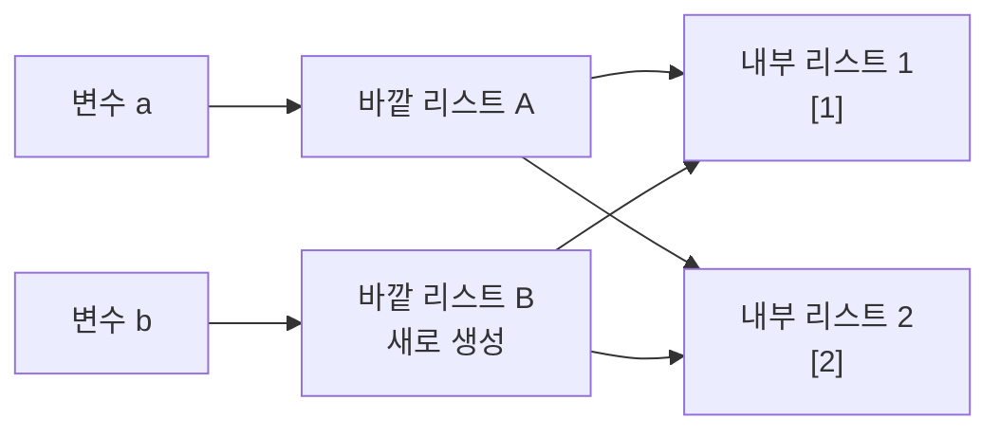

바깥 리스트는 서로 다름.

```python
print(a is b)
# False
```

하지만 내부 리스트는 같음.

```python
print(a[0] is b[0])
# True
```

###### 바깥 리스트를 수정하는 경우

```python
a = [[1], [2]]
b = a.copy()

b.append([3])

print(a)
# [[1], [2]]

print(b)
# [[1], [2], [3]]
```

`append([3])`는 `b`의 바깥 리스트를 수정하므로 `a`에는 영향을 주지 않음.

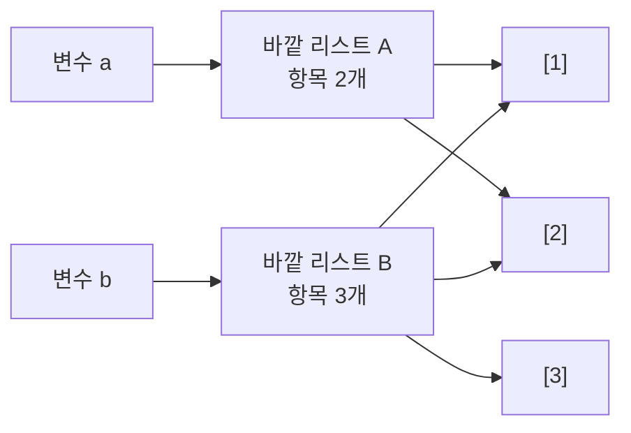

###### 내부 리스트를 수정하는 경우

```python
a = [[1], [2]]
b = a.copy()

b[0].append(99)

print(a)
# [[1, 99], [2]]

print(b)
# [[1, 99], [2]]
```

`a[0]`과 `b[0]`이 같은 내부 리스트이므로 양쪽에서 모두 변경된 것처럼 보임.

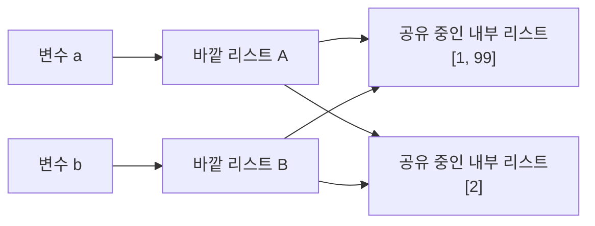

> 얕은 복사: 바깥 객체는 분리되지만 내부 객체는 공유될 수 있음.

---

### 3. 깊은 복사: `deepcopy()`

> 출처: `빅데이터실습/Week03.md`

깊은 복사는 바깥 객체뿐만 아니라 **내부의 중첩 객체까지 새로 생성**함.

```python
from copy import deepcopy

a = [[1], [2]]
b = deepcopy(a)
```

###### 메모리 구조

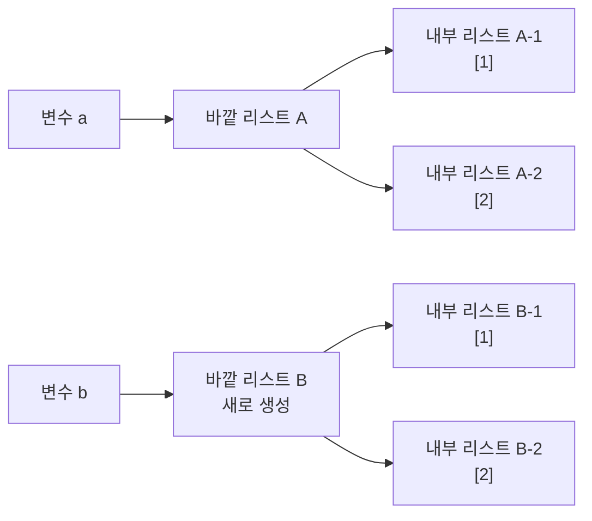

바깥 리스트와 내부 리스트가 모두 분리되어 있음.

```python
print(a is b)
# False

print(a[0] is b[0])
# False
```

###### 내부 리스트 수정

```python
b[0].append(99)

print(a)
# [[1], [2]]

print(b)
# [[1, 99], [2]]
```

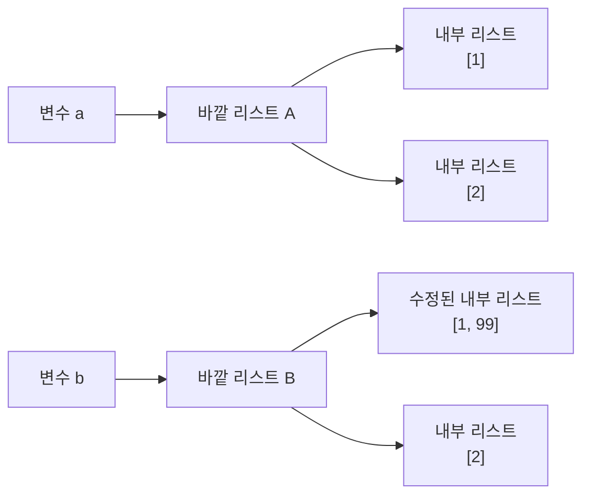

`b`의 내부 리스트만 수정되며 `a`는 변하지 않음.

---


## 데이터 시각화

### pandas 막대그래프

> 출처: `빅데이터실습/Week03.md`

```python
count_grade.plot.bar(rot=0)
```

가로 막대그래프:

```python
count_grade.plot.barh()
```

### seaborn 막대그래프

> 출처: `빅데이터실습/Week03.md`

```python
import seaborn as sns

sns.countplot(
    data=mpg,
    x="grade",
    order=["A", "B", "C"]
)
```

`order`를 지정하면 A, B, C 순서로 표시할 수 있음.

### 그래프 제목 추가

> 출처: `빅데이터실습/Week03.md`

```python
import matplotlib.pyplot as plt

sns.countplot(
    data=mpg,
    x="grade",
    order=["A", "B", "C"]
)

plt.title("자동차 연비 등급")
plt.xlabel("연비 등급")
plt.ylabel("자동차 수")
plt.show()
```

---

#### 13. 메서드 체이닝

메서드 체이닝은 `.`을 사용해 여러 메서드를 이어서 작성하는 방법.

### 그래프 작성

> 출처: `빅데이터실습/Week03.md`

```python
sns.countplot(
    data=midwest,
    x="asiangroup",
    order=["large", "small"]
)

plt.title("아시아계 인구 비율 그룹")
plt.xlabel("그룹")
plt.ylabel("지역 수")
plt.show()
```

---

#### 16. 전체 내용 요약

### 파이썬 데이터 정제와 시각화

> 출처: `빅데이터실습/Week06.md`

#### 파이썬 데이터 정제와 시각화

### 08 그래프 만들기 개념

> 출처: `빅데이터실습/Week06.md`

###### 1. 시각화 기본 설정

``` python
import pandas as pd
import matplotlib.pyplot as plt
import seaborn as sns

sns.set_theme(style="whitegrid")
plt.rcParams["axes.unicode_minus"] = False
```

한글 폰트 예시:

``` python
# Windows
plt.rcParams["font.family"] = "Malgun Gothic"

# macOS
plt.rcParams["font.family"] = "AppleGothic"

# NanumGothic 설치 환경
plt.rcParams["font.family"] = "NanumGothic"
```

권장 사항:

- 경고 전체 숨김보다 경고 원인 확인 우선
- 데이터 열 이름과 축 레이블의 단위 확인
- 그래프 작성 전 결측치와 이상치 점검
- 긴 범주 이름의 회전 또는 가로 그래프 검토

###### 2. 그래프 선택

| 분석 목적             | 그래프           | 대표 함수           |
|-----------------------|------------------|---------------------|
| 두 연속형 변수의 관계 | 산점도           | `sns.scatterplot()` |
| 집단별 평균·합계 비교 | 막대 그래프      | `sns.barplot()`     |
| 범주별 개수 비교      | 빈도 막대 그래프 | `sns.countplot()`   |
| 시간에 따른 변화      | 선 그래프        | `sns.lineplot()`    |
| 집단별 분포 비교      | 상자 그림        | `sns.boxplot()`     |

###### 그래프 선택 구조도

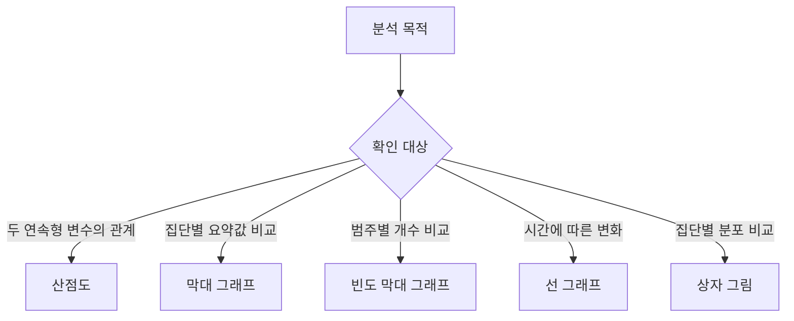

###### 3. 산점도

**산점도(Scatter Plot)**: 두 연속형 변수를 x축과 y축의 점으로 표현한 그래프

주요 용도:

- 변수 간 방향성 확인
- 선형 또는 비선형 관계 탐색
- 군집과 이상치 탐색
- 범주별 패턴 비교

###### 3.1 기본 산점도

``` python
mpg = pd.read_csv("mpg.csv")

sns.scatterplot(data=mpg, x="displ", y="hwy")
```

- x축: 배기량 `displ`
- y축: 고속도로 연비 `hwy`
- 예상 패턴: 배기량 증가와 연비 감소의 관계

###### 3.2 축 범위 제한

``` python
sns.scatterplot(data=mpg, x="displ", y="hwy").set(
    xlim=(3, 6),
    ylim=(10, 30),
)
```

주의점:

- 관심 구간 확대에 유용
- 범위 밖 데이터의 존재를 독자에게 명시
- 축 제한으로 관계를 과장하지 않도록 주의

###### 3.3 범주별 색상

``` python
sns.scatterplot(
    data=mpg,
    x="displ",
    y="hwy",
    hue="drv",
)
```

**`hue`**: 범주에 따라 점의 색상 구분

###### 4. 막대 그래프

**막대 그래프(Bar Plot)**: 집단별 요약값을 막대 길이로 비교하는 그래프

###### 4.1 평균 막대 그래프

권장 흐름:

``` text
집단화 → 요약값 계산 → 정렬 → 시각화
```

``` python
mean_hwy = (
    mpg.groupby("drv", as_index=False)
       .agg(mean_hwy=("hwy", "mean"))
       .sort_values("mean_hwy", ascending=False)
)

sns.barplot(data=mean_hwy, x="drv", y="mean_hwy")
```

**`as_index=False`**: 그룹 기준 열을 일반 열로 유지

장점:

- 이후 정렬과 시각화에 편리한 표 구조
- 결과 열 이름의 명시적 지정 가능

###### 4.2 빈도 막대 그래프

원본 행의 개수를 바로 시각화하는 방법:

``` python
sns.countplot(data=mpg, x="drv")
```

집계표를 먼저 만드는 방법:

``` python
drv_count = (
    mpg.groupby("drv", as_index=False)
       .agg(count=("drv", "count"))
)

sns.barplot(data=drv_count, x="drv", y="count")
```

선택 기준:

- 단순 빈도: `countplot()`
- 별도 계산·필터·정렬이 필요한 빈도: `groupby()`와 `barplot()`

###### 4.3 범주 순서

데이터 등장 순서:

``` python
order = mpg["model"].unique()
```

이름 오름차순:

``` python
order = sorted(mpg["model"].dropna().unique())
```

빈도 내림차순:

``` python
order = mpg["model"].value_counts().index
```

상위 5개만 표시:

``` python
top5_order = mpg["model"].value_counts().head(5).index
sns.countplot(data=mpg, x="model", order=top5_order)
```

###### 5. 선 그래프

**시계열 데이터(Time Series Data)**: 일정한 시간 간격으로 관측한 데이터

**선 그래프(Line Plot)**: 시간에 따른 값의 변화와 추세를 표현하는 그래프

###### 5.1 날짜 변환

``` python
economics = pd.read_csv("economics.csv")
economics["date"] = pd.to_datetime(economics["date"])
```

문자열 날짜보다 `datetime` 자료형을 권장하는 이유:

- 시간 순서 기반 정렬
- 연·월·일 추출
- 기간 필터링
- 시간 축 형식 자동 처리

###### 5.2 날짜 요소 추출

``` python
economics["year"] = economics["date"].dt.year
economics["month"] = economics["date"].dt.month
economics["day"] = economics["date"].dt.day
```

###### 5.3 원시 시계열

``` python
sns.lineplot(
    data=economics,
    x="date",
    y="unemploy",
)
```

월별 한 행 구조에서 시간 흐름을 그대로 표현하는 방식

###### 5.4 연도별 대표값

여러 관측값을 같은 x축 값에 넣으면 `seaborn`의 기본 추정과 오차 구간이 적용될 수 있는 구조

명시적 집계 방식:

``` python
yearly_unemploy = (
    economics.groupby("year", as_index=False)
             .agg(mean_unemploy=("unemploy", "mean"))
)

sns.lineplot(
    data=yearly_unemploy,
    x="year",
    y="mean_unemploy",
    errorbar=None,
)
```

장점:

- 그래프가 표현하는 통계량의 명확한 확인
- 라이브러리 기본 집계에 대한 의존 감소

###### 6. 상자 그림

**상자 그림(Box Plot)**: 중앙값, 사분위수, 수염, 극단치 후보를 한 번에 표현하는 그래프

``` python
sns.boxplot(data=mpg, x="drv", y="hwy")
```

해석 순서:

1.  중앙값 비교
2.  상자 높이인 IQR 비교
3.  수염 길이 비교
4.  수염 밖 점 확인
5.  집단별 표본 수 확인

상자 그림에서 알 수 없는 정보:

- 정확한 평균
- 개별 관측값의 전체 밀도
- 표본 수 차이

필요 시 `stripplot()` 또는 `swarmplot()`과 함께 사용

``` python
sns.boxplot(data=mpg, x="drv", y="hwy")
sns.stripplot(data=mpg, x="drv", y="hwy", color="black", alpha=0.3)
```

###### 7. 그래프 해석 원칙

###### 7.1 관계와 인과의 구분

- 산점도의 상관관계만으로 인과관계 확정 불가
- 제3의 변수와 표본 선택 방식 검토

###### 7.2 축과 단위 확인

- 축 시작점과 제한 범위 확인
- 수치 단위와 범주 코드 설명
- 범주 정렬 기준 명시

###### 7.3 대표값과 분포의 구분

- 막대 그래프: 요약값 중심
- 상자 그림: 분포 중심
- 평균이 같아도 분포가 다를 가능성

###### 7.4 데이터 품질 확인

- 결측치 제외 방식
- 이상치 처리 기준
- 집단별 표본 수
- 날짜 누락과 중복

###### 8. 핵심 코드

``` python
# 산점도
sns.scatterplot(data=mpg, x="displ", y="hwy", hue="drv")

# 평균 막대 그래프
summary = (
    mpg.groupby("drv", as_index=False)
       .agg(mean_hwy=("hwy", "mean"))
)
sns.barplot(data=summary, x="drv", y="mean_hwy")

# 빈도 막대 그래프
sns.countplot(data=mpg, x="drv")

# 선 그래프
sns.lineplot(data=economics, x="date", y="unemploy")

# 상자 그림
sns.boxplot(data=mpg, x="drv", y="hwy")
```

### 08 그래프 만들기 문제풀이

> 출처: `빅데이터실습/Week06.md`

###### 준비

``` python
import pandas as pd
import matplotlib.pyplot as plt
import seaborn as sns

sns.set_theme(style="whitegrid")
plt.rcParams["axes.unicode_minus"] = False
```

###### 문제 1. 도시 연비와 고속도로 연비의 관계

###### 문제

`mpg.csv`에서 도시 연비 `cty`를 x축, 고속도로 연비 `hwy`를 y축으로 지정한 산점도 작성

###### 풀이

``` python
mpg = pd.read_csv("mpg.csv")

sns.scatterplot(data=mpg, x="cty", y="hwy")
plt.title("도시 연비와 고속도로 연비")
plt.show()
```

###### 해석

- `cty` 증가에 따라 `hwy`도 증가하는 양의 관계
- 도시 연비가 높은 차량의 고속도로 연비도 대체로 높은 분포
- 산점도만으로 인과관계 확정 불가

###### 문제 2. 전체 인구와 아시아계 인구의 관계

###### 문제

`midwest.csv`에서 다음 조건의 산점도 작성

- x축: 전체 인구 `poptotal`
- y축: 아시아계 인구 `popasian`
- x축 범위: 0~500,000
- y축 범위: 0~10,000

###### 풀이

``` python
midwest = pd.read_csv("midwest.csv")

ax = sns.scatterplot(
    data=midwest,
    x="poptotal",
    y="popasian",
)
ax.set(xlim=(0, 500_000), ylim=(0, 10_000))
plt.show()
```

###### 핵심

- `set()`을 활용한 두 축 범위 동시 지정
- 범위 밖 관측값의 시각화 제외에 대한 주의

###### 실제 데이터 확인

| 항목 | 값 |
|---|---:|
| 전체 지역 수 | 437 |
| 지정 범위 안 지역 수 | 422 |
| `poptotal`과 `popasian`의 상관계수 | 0.92309 |

**해석**: 전체 인구가 많은 지역에서 아시아계 인구도 함께 증가하는 강한 양의 관계

###### 문제 3. 구동 방식별 평균 고속도로 연비

###### 문제

구동 방식 `drv`별 평균 고속도로 연비 `hwy`를 계산하고 평균 내림차순 막대 그래프 작성

###### 풀이

``` python
mpg = pd.read_csv("mpg.csv")

mean_hwy = (
    mpg.groupby("drv", as_index=False)
       .agg(mean_hwy=("hwy", "mean"))
       .sort_values("mean_hwy", ascending=False)
)

sns.barplot(data=mean_hwy, x="drv", y="mean_hwy")
plt.show()
```

###### 결과

| 구동 방식 | 평균 `hwy` |
|-----------|-----------:|
| `f`       |  28.160377 |
| `r`       |  21.000000 |
| `4`       |  19.174757 |

**해석**: 전륜 구동 `f`의 평균 고속도로 연비가 가장 높은 결과

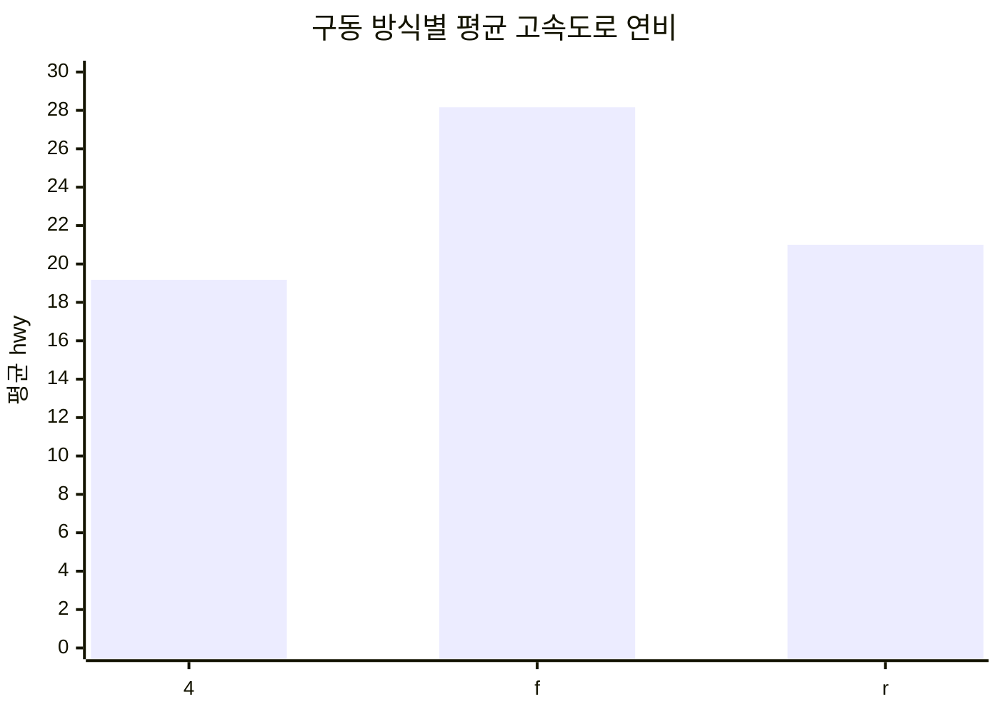

###### 문제 4. 구동 방식별 빈도

###### 문제

구동 방식별 차량 수를 빈도 막대 그래프로 표현

###### 풀이 A. `countplot()`

``` python
order = ["4", "f", "r"]
sns.countplot(data=mpg, x="drv", order=order)
plt.show()
```

###### 풀이 B. 집계 후 `barplot()`

``` python
drv_count = (
    mpg.groupby("drv", as_index=False)
       .agg(count=("drv", "count"))
)

sns.barplot(data=drv_count, x="drv", y="count")
plt.show()
```

###### 결과

| 구동 방식 | 차량 수 |
|-----------|--------:|
| `4`       |     103 |
| `f`       |     106 |
| `r`       |      25 |

**핵심**: 단순 빈도는 `countplot()`, 별도 집계가 필요한 경우 `barplot()` 활용

###### 문제 5. 자동차 모델 빈도 순서

###### 문제

자동차 모델을 다음 세 기준으로 정렬한 빈도 그래프 작성

1.  원본 등장 순서
2.  모델명 오름차순
3.  빈도 내림차순 상위 5개

###### 풀이

``` python
# 1. 원본 등장 순서
original_order = mpg["model"].unique()
sns.countplot(data=mpg, x="model", order=original_order)
plt.xticks(rotation=90)
plt.show()

# 2. 모델명 오름차순
alphabetical_order = sorted(mpg["model"].dropna().unique())
sns.countplot(data=mpg, x="model", order=alphabetical_order)
plt.xticks(rotation=90)
plt.show()

# 3. 빈도 내림차순 상위 5개
top5_order = mpg["model"].value_counts().head(5).index
sns.countplot(data=mpg, x="model", order=top5_order)
plt.xticks(rotation=30)
plt.show()
```

###### 핵심

| 기준          | 코드                   |
|---------------|------------------------|
| 등장 순서     | `unique()`             |
| 이름 오름차순 | `sorted(...unique())`  |
| 빈도 내림차순 | `value_counts().index` |

###### 문제 6. SUV 도시 연비 상위 5개 회사

###### 문제

`suv` 차종을 대상으로 회사별 평균 도시 연비를 계산하고 상위 5개 회사를 막대 그래프로 표현

###### 풀이

``` python
suv_top5 = (
    mpg.query('category == "suv"')
       .groupby("manufacturer", as_index=False)
       .agg(mean_cty=("cty", "mean"))
       .sort_values("mean_cty", ascending=False)
       .head(5)
)

sns.barplot(
    data=suv_top5,
    x="manufacturer",
    y="mean_cty",
    order=suv_top5["manufacturer"],
)
plt.show()
```

###### 결과

| 순위 | 회사    | 평균 `cty` |
|-----:|---------|-----------:|
|    1 | subaru  |  18.833333 |
|    2 | toyota  |  14.375000 |
|    3 | nissan  |  13.750000 |
|    4 | jeep    |  13.500000 |
|    5 | mercury |  13.250000 |

**핵심**: `sort_values()` 이후 별도의 `sort_index()` 없이 순위 유지

###### 문제 7. 자동차 종류별 빈도

###### 문제

자동차 종류 `category`별 빈도를 높은 순서로 정렬한 막대 그래프 작성

###### 풀이 A. `countplot()`

``` python
category_order = mpg["category"].value_counts().index

sns.countplot(
    data=mpg,
    x="category",
    order=category_order,
)
plt.xticks(rotation=30)
plt.show()
```

###### 풀이 B. 집계 후 `barplot()`

``` python
category_count = (
    mpg.groupby("category", as_index=False)
       .agg(count=("category", "count"))
       .sort_values("count", ascending=False)
)

sns.barplot(
    data=category_count,
    x="category",
    y="count",
    order=category_count["category"],
)
plt.xticks(rotation=30)
plt.show()
```

###### 핵심

- `countplot()`의 `order`에 빈도순 인덱스 전달
- 집계표 확인이 필요한 경우 `groupby()` 방식 활용

###### 결과

| 자동차 종류 | 차량 수 |
|---|---:|
| `suv` | 62 |
| `compact` | 47 |
| `midsize` | 41 |
| `subcompact` | 35 |
| `pickup` | 33 |
| `minivan` | 11 |
| `2seater` | 5 |

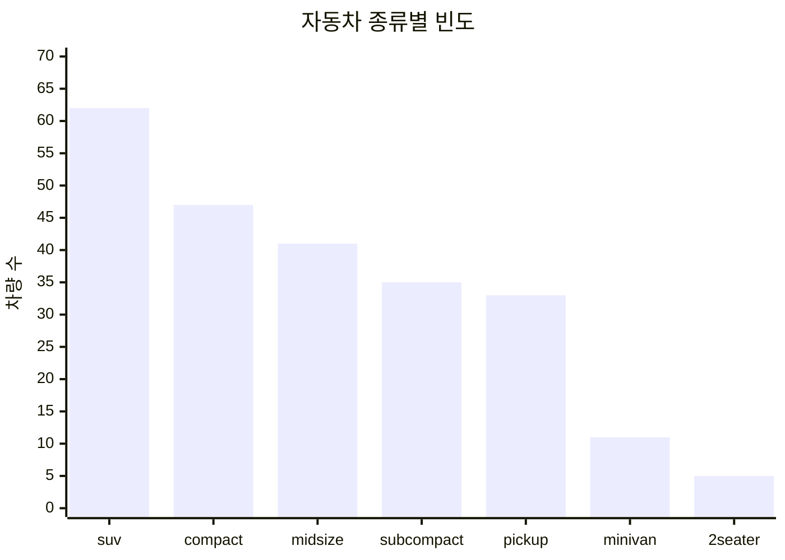

###### 문제 8. 연도별 실업자 수

###### 문제

`economics.csv`의 날짜를 변환하고 연도별 평균 실업자 수 그래프 작성

###### 풀이

``` python
economics = pd.read_csv("economics.csv")
economics["date"] = pd.to_datetime(economics["date"])
economics["year"] = economics["date"].dt.year

yearly_unemploy = (
    economics.groupby("year", as_index=False)
             .agg(mean_unemploy=("unemploy", "mean"))
)

sns.lineplot(
    data=yearly_unemploy,
    x="year",
    y="mean_unemploy",
    errorbar=None,
)
plt.show()
```

###### 해석

- 장기간 반복되는 실업자 수의 상승·하락 흐름
- 2005년 이후 가파른 증가 구간
- 2010년 전후 고점 이후 감소 추세

###### 문제 9. 연도별 개인 저축률

###### 문제

`economics.csv`에서 연도별 평균 개인 저축률 `psavert`의 변화 그래프 작성

###### 풀이

``` python
economics = pd.read_csv("economics.csv")
economics["date"] = pd.to_datetime(economics["date"])
economics["year"] = economics["date"].dt.year

yearly_psavert = (
    economics.groupby("year", as_index=False)
             .agg(mean_psavert=("psavert", "mean"))
)

sns.lineplot(
    data=yearly_psavert,
    x="year",
    y="mean_psavert",
    errorbar=None,
)
plt.show()
```

###### 해석

- 1970년대 이후 2005년 전후까지 전반적인 감소 흐름
- 2005년 전후부터 반등 구간
- 연도별 월 관측값의 평균을 사용한 추세선

###### 문제 10. 2014년 월별 개인 저축률

###### 문제

2014년 데이터만 추출해 월별 개인 저축률 그래프 작성

###### 풀이

``` python
economics["month"] = economics["date"].dt.month

economics_2014 = economics.query("year == 2014")

sns.lineplot(
    data=economics_2014,
    x="month",
    y="psavert",
    marker="o",
    errorbar=None,
)
plt.xticks(range(1, 13))
plt.show()
```

###### 핵심

- `query()`를 활용한 연도 필터링
- `dt.month`를 활용한 월 추출
- 월별 관측점 확인을 위한 `marker="o"`

###### 결과

| 월 | 1 | 2 | 3 | 4 | 5 | 6 | 7 | 8 | 9 | 10 | 11 | 12 |
|---:|---:|---:|---:|---:|---:|---:|---:|---:|---:|---:|---:|---:|
| 개인 저축률 | 7.1 | 7.3 | 7.4 | 7.4 | 7.4 | 7.4 | 7.5 | 7.2 | 7.4 | 7.2 | 7.3 | 7.6 |

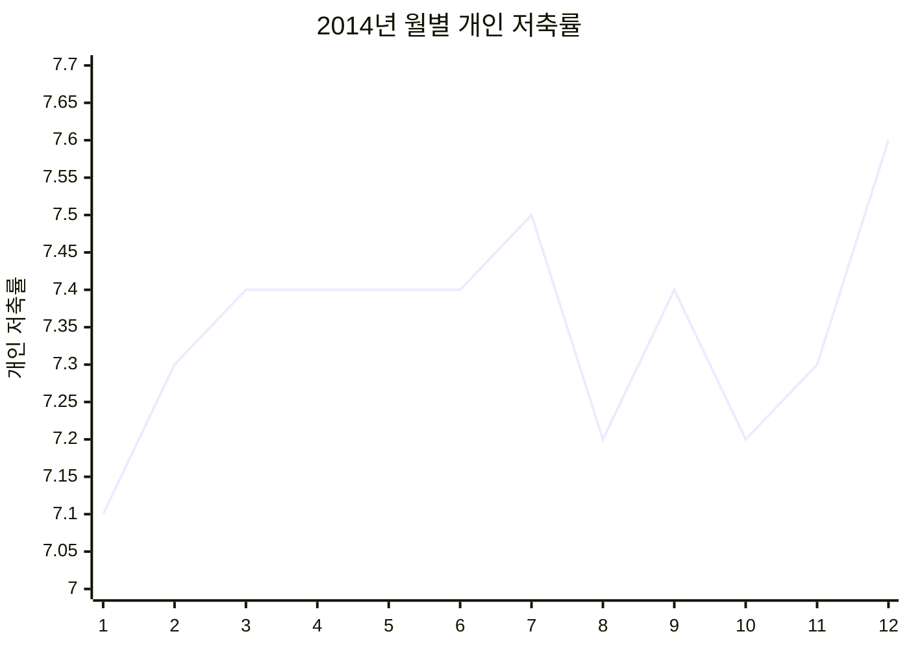

###### 문제 11. 구동 방식별 고속도로 연비 분포

###### 문제

구동 방식별 고속도로 연비 분포를 상자 그림으로 표현

###### 풀이

``` python
sns.boxplot(data=mpg, x="drv", y="hwy")
plt.show()
```

###### 해석

- 전륜 구동 `f`: 다른 집단보다 높은 중앙값, 수염 밖 관측값 존재
- 사륜 구동 `4`: 비교적 낮은 연비 분포
- 후륜 구동 `r`: 표본 분포와 수염 밖 관측값을 함께 확인할 필요

**주의**: 상자 그림의 굵은 선은 평균이 아닌 중앙값

###### 문제 12. 자동차 종류별 도시 연비 분포

###### 문제

`compact`, `subcompact`, `suv`의 도시 연비 분포를 상자 그림으로 비교

###### 풀이

``` python
selected = mpg.query(
    'category in ["compact", "subcompact", "suv"]'
)

sns.boxplot(
    data=selected,
    x="category",
    y="cty",
    order=["compact", "subcompact", "suv"],
)
plt.show()
```

###### 실제 데이터 요약

| 자동차 종류 | 표본 수 | 중앙값 | 평균 | 최솟값 | 최댓값 |
|---|---:|---:|---:|---:|---:|
| `compact` | 47 | 20.0 | 20.127660 | 15 | 33 |
| `subcompact` | 35 | 19.0 | 20.371429 | 14 | 35 |
| `suv` | 62 | 13.0 | 13.500000 | 9 | 20 |

###### 해석

- 세 차종 가운데 `suv`의 도시 연비 분포가 가장 낮은 편
- `compact`와 `subcompact`의 중앙값·IQR·극단치 후보 비교 가능
- 평균 비교가 아닌 전체 분포 비교

###### 마무리 점검

- 분석 목적에 맞는 그래프 선택 여부
- 집계 기준과 정렬 기준의 명시 여부
- 축 이름과 단위의 정확성
- 날짜 자료형 변환 여부
- 결측치와 이상치 처리 기준 기록 여부
- 상관관계와 인과관계의 구분 여부


## 종합 분석과 실습

### D. `midwest.csv`

> 출처: `빅데이터실습/Week03.md`

22. `midwest.csv`를 불러와 구조를 확인.
23. `poptotal`을 `total`, `popasian`을 `asian`으로 변경.
24. 아시아계 인구 비율인 `rate`를 생성.
25. `rate`의 평균을 계산.
26. 평균보다 높으면 `large`, 아니면 `small`인 `asiangroup`을 생성.
27. `asiangroup`의 빈도표와 막대그래프를 생성.
28. 평균값을 코드에 직접 입력하면 좋지 않은 이유를 설명.

---

#### 18. 결과 체크포인트

작성한 코드가 맞는지 다음 값으로 확인할 수 있음.

| 분석 결과 | 값 |
|---|---|
| `exam.shape` | `(20, 5)` |
| 수학 평균 | `57.45` |
| 영어 평균 | `84.90` |
| 과학 평균 | `59.45` |
| `mpg` 원본 크기 | `(234, 11)` |
| `test = pass` | `128` |
| `test = fail` | `106` |
| `grade = A` | `10` |
| `grade = B` | `118` |
| `grade = C` | `106` |
| `size = small` | `87` |
| `size = large` | `147` |
| `land = asia` | `23` |
| `land = non-asia` | `211` |
| `midwest` 원본 크기 | `(437, 28)` |
| `rate` 평균 | 약 `0.487246` |
| `asiangroup = large` | `119` |
| `asiangroup = small` | `318` |

---

#### 19. 종합 실습 정답 코드

```python
from pathlib import Path

import matplotlib.pyplot as plt
import numpy as np
import pandas as pd
import seaborn as sns


DATA_DIR = Path("data")


# -------------------------
# 1. exam.csv
# -------------------------

exam = pd.read_csv(DATA_DIR / "exam.csv")

print("처음 5행")
print(exam.head())

print("\n마지막 5행")
print(exam.tail())

print("\n데이터 크기")
print(exam.shape)

print("\n변수명")
print(exam.columns.tolist())

print("\n과목별 평균")
print(
    exam[
        ["math", "english", "science"]
    ].mean()
)

exam_by_id = exam.set_index("id")

print("\nid가 3~6인 학생")
print(exam_by_id.loc[3:6])

print("\n수학 점수가 50점보다 높은 학생")
print(
    exam.loc[
        exam["math"] > 50
    ]
)


# -------------------------
# 2. mpg.csv
# -------------------------

mpg = pd.read_csv(DATA_DIR / "mpg.csv")

print("\nmpg 데이터 크기")
print(mpg.shape)

mpg_new = mpg.copy()

mpg_new = mpg_new.rename(
    columns={
        "cty": "city",
        "hwy": "highway"
    }
)

mpg["total"] = (
    mpg["cty"] + mpg["hwy"]
) / 2

mpg["test"] = np.where(
    mpg["total"] >= 20,
    "pass",
    "fail"
)

mpg["grade"] = np.where(
    mpg["total"] >= 30,
    "A",
    np.where(
        mpg["total"] >= 20,
        "B",
        "C"
    )
)

mpg["size"] = np.where(
    mpg["category"].isin(
        ["compact", "subcompact", "2seater"]
    ),
    "small",
    "large"
)

mpg["land"] = np.where(
    mpg["manufacturer"].isin(
        ["hyundai", "honda"]
    ),
    "asia",
    "non-asia"
)

print("\n합격 여부")
print(mpg["test"].value_counts())

print("\n연비 등급")
print(
    mpg["grade"]
    .value_counts()
    .sort_index()
)

print("\n자동차 크기")
print(mpg["size"].value_counts())

print("\n제조사 지역")
print(mpg["land"].value_counts())

sns.countplot(
    data=mpg,
    x="grade",
    order=["A", "B", "C"]
)

plt.title("자동차 연비 등급")
plt.xlabel("등급")
plt.ylabel("자동차 수")
plt.show()


# -------------------------
# 3. midwest.csv
# -------------------------

midwest = pd.read_csv(
    DATA_DIR / "midwest.csv"
)

print("\nmidwest 데이터 크기")
print(midwest.shape)

midwest = midwest.rename(
    columns={
        "poptotal": "total",
        "popasian": "asian"
    }
)

midwest["rate"] = (
    midwest["asian"] /
    midwest["total"] *
    100
)

mean_rate = midwest["rate"].mean()

midwest["asiangroup"] = np.where(
    midwest["rate"] > mean_rate,
    "large",
    "small"
)

print("\n아시아계 인구 비율 평균")
print(mean_rate)

print("\n아시아계 인구 비율 그룹")
print(
    midwest["asiangroup"]
    .value_counts()
)

sns.countplot(
    data=midwest,
    x="asiangroup",
    order=["large", "small"]
)

plt.title("아시아계 인구 비율 그룹")
plt.xlabel("그룹")
plt.ylabel("지역 수")
plt.show()
```

---

#### 20. 원본 자료에서 바로잡은 부분

| 원본 내용 | 올바른 내용 |
|---|---|
| `exam.shape`의 열 수를 4개로 설명 | 실제 결과는 `(20, 5)` |
| `describe(include = 'all)` | `describe(include="all")` |
| `a.copy()`를 깊은 복사로 설명 | 리스트의 `copy()`는 얕은 복사 |
| `compactc` | 실제 범주는 `compact` |
| 평균값 `0.4872` 직접 입력 | `mean_rate = midwest["rate"].mean()` |
| `asin` | `asian` |
| `안시아` | `아시아` |

---

#### 최종 암기 포인트

1. 데이터를 불러오면 먼저 `head()`, `shape`, `info()`, `describe()`를 실행함.
2. `shape`은 속성이므로 괄호를 사용하지 않음.
3. `loc`는 인덱스 값, `iloc`는 행의 위치를 사용함.
4. 원본 보존이 필요하면 `copy()`로 복사본을 생성함.
5. 변수명은 `rename(columns={...})`으로 변경함.
6. 새 열은 `df["new"] = 계산식`으로 생성함.
7. 두 그룹 분류는 `np.where()`를 사용함.
8. 여러 값의 포함 여부는 `isin()`을 사용함.
9. 분류 결과는 `value_counts()`로 확인함.
10. 기준값은 직접 입력하지 말고 데이터에서 계산함.
