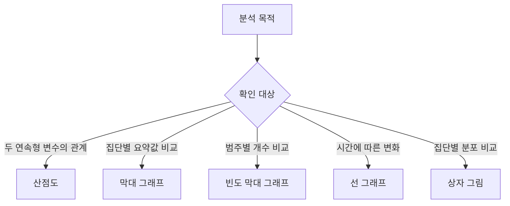
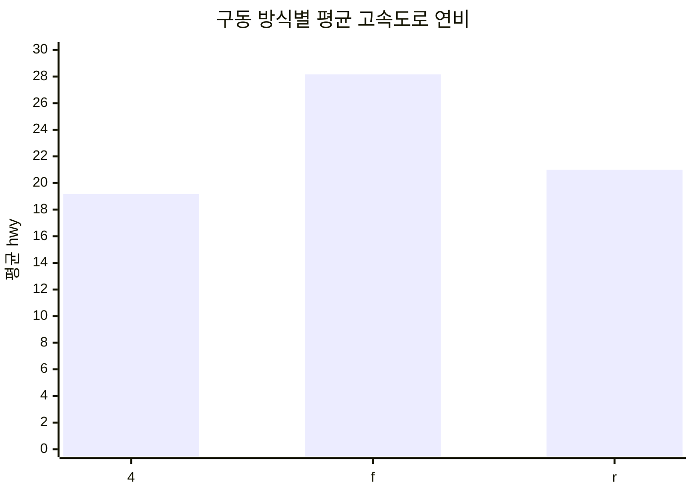
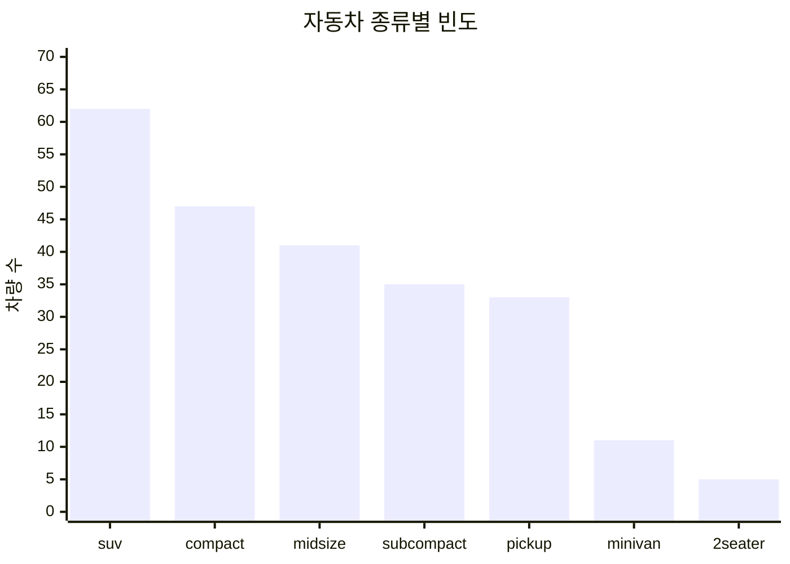
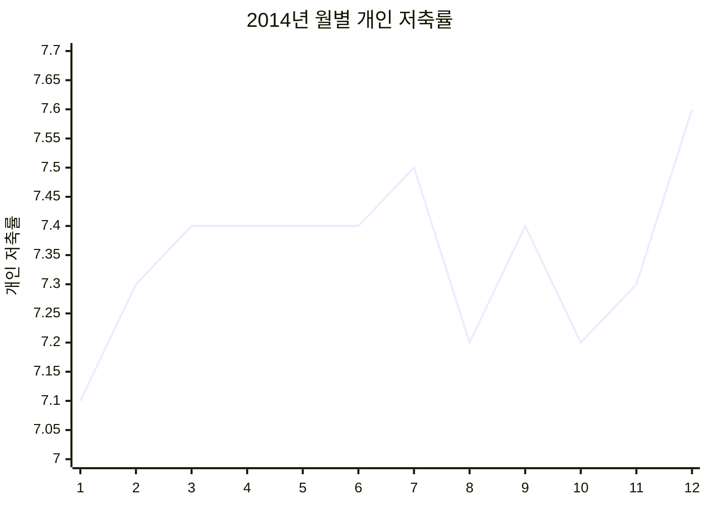

# 파이썬 데이터 정제와 시각화

## 07 데이터 정제 개념

### 1. 데이터 정제

**데이터 정제(Data Cleaning)**: 분석 전에 결측치, 이상치, 잘못된 형식 등을 찾아 수정하는 작업

- 현장 데이터에 포함될 수 있는 입력 오류와 누락값 처리
- 분석 결과의 신뢰도 향상을 위한 필수 단계
- 원본 보존 후 정제본을 별도 변수에 저장하는 방식 권장

#### 데이터 정제 흐름


``` python
import numpy as np
import pandas as pd
```

### 2. 결측치

**결측치(Missing Value)**: 값이 비어 있거나 관측되지 않은 데이터

**`NaN`(Not a Number)**: `pandas`와 `NumPy`에서 자주 사용하는 결측치 표현

``` python
df = pd.DataFrame({
    "gender": ["M", "F", np.nan, "M", "F"],
    "score": [5, 4, 3, 4, np.nan],
})
```

결측치가 포함된 산술 연산의 주요 특징:

``` python
df["score"] + 1
```

- 일반 값: 정상 연산
- `NaN`: 결과도 `NaN`
- 통계 함수: 기본적으로 결측치 제외 후 계산

### 3. 결측치 확인

#### 3.1 전체 위치 확인

``` python
df.isna()
# pd.isna(df)와 동일한 목적
```

- 결측 위치: `True`
- 정상 위치: `False`

#### 3.2 열별 개수 확인

``` python
df.isna().sum()
```

#### 3.3 특정 열의 개수 확인

``` python
df["score"].isna().sum()
```

#### 3.4 여러 열만 확인

``` python
df[["gender", "score"]].isna().sum()
```

### 4. 결측치 제거

**`dropna()`**: 결측치가 있는 행 또는 열 제거

#### 4.1 특정 열 기준 제거

``` python
df_nomiss = df.dropna(subset=["score"])
```

- `score`가 결측치인 행만 제거
- 다른 열의 결측치 유지 가능

#### 4.2 여러 열 기준 제거

``` python
df_nomiss = df.dropna(subset=["gender", "score"])
```

- 두 열 가운데 하나라도 결측치인 행 제거

#### 4.3 모든 열 기준 제거

``` python
df_nomiss = df.dropna()
```

- 어느 열에든 결측치가 있는 행 제거
- 분석에 필요한 행까지 잃을 가능성
- 분석 대상 열만 `subset`으로 지정하는 방식 권장

#### 4.4 원본과 반환값

``` python
df.dropna(subset=["score"])
```

- 새 `DataFrame` 반환
- 원본 `df` 유지
- 결과 보관 시 새 변수 또는 명시적 할당 필요

``` python
df = df.dropna(subset=["score"])
```

### 5. 결측치 대체

**결측치 대체(Imputation)**: 결측치를 대표값이나 규칙 기반 값으로 교체하는 작업

**`fillna()`**: 결측치에 지정한 값 삽입

``` python
mean_math = exam["math"].mean()
exam["math"] = exam["math"].fillna(mean_math)
```

대표적인 대체 기준:

| 데이터 유형 | 대체 후보          | 주의점                            |
|-------------|--------------------|-----------------------------------|
| 수치형      | 평균, 중앙값       | 극단치가 많을 때 중앙값 우선 검토 |
| 범주형      | 최빈값, 별도 범주  | 실제 의미와 구분되는 값 사용      |
| 시계열      | 앞값, 뒷값, 보간값 | 시간 순서와 추세 확인 필요        |

평균 대체의 주요 특성:

- 전체 행 수 유지
- 평균 주변으로 값이 모이는 현상
- 분산과 변수 간 관계 왜곡 가능성
- 결측 발생 원인 검토 후 사용

### 6. 이상치

**이상치(Outlier)**: 정상 범위나 예상 규칙에서 크게 벗어난 값

두 가지 대표 유형:

- **논리적 이상치**: 허용 범위 또는 범주 밖의 값
  - 1~3반만 존재하는 데이터의 `4반`
  - 1~5점 척도의 `6점`
- **통계적 극단치**: 분포상 다른 관측값과 크게 떨어진 값
  - 몸무게 `930kg`
  - 연비 분포의 수염 범위 밖 값

이상치 처리 전 확인 항목:

- 실제 관측값인지 입력 오류인지 구분
- 도메인 기준과 통계 기준의 적합성
- 제거가 표본 크기와 분석 결과에 미치는 영향

### 7. 존재할 수 없는 값 처리

#### 7.1 빈도 확인

``` python
df["class"].value_counts().sort_index()
df["score"].value_counts().sort_index()
```

#### 7.2 조건에 따른 결측 처리

**`np.where(조건, 참일 때 값, 거짓일 때 값)`**: 조건에 따른 값 선택

``` python
df["class"] = np.where(
    df["class"] == 4,
    np.nan,
    df["class"],
)

df["score"] = np.where(
    df["score"] > 5,
    np.nan,
    df["score"],
)
```

#### 7.3 허용 목록 기준 처리

**`isin()`**: 값이 허용 목록에 포함되는지 검사

``` python
allowed_drv = ["4", "f", "r"]

mpg["drv"] = np.where(
    mpg["drv"].isin(allowed_drv),
    mpg["drv"],
    np.nan,
)
```

### 8. IQR 기반 극단치 처리

#### 8.1 상자 그림 구성

**상자 그림(Box Plot)**: 사분위수와 극단치를 함께 표현하는 그래프

| 요소      | 의미                     |
|-----------|--------------------------|
| Q1        | 1사분위수, 하위 25% 지점 |
| Q2        | 중앙값, 하위 50% 지점    |
| Q3        | 3사분위수, 하위 75% 지점 |
| IQR       | `Q3 - Q1`                |
| 아래 경계 | `Q1 - 1.5 × IQR`         |
| 위 경계   | `Q3 + 1.5 × IQR`         |

경계 밖 관측값을 극단치 후보로 분류

#### 상자 그림 구조

```text
극단치       아래 수염              IQR               위 수염       극단치
  ●             │          ┌─────────┬─────────┐          │             ●
────────────────┼──────────┤   Q1    │ Q2 │ Q3 ├──────────┼────────────────
                │          └─────────┴─────────┘          │
                           25%      50%      75%
```

- `Q2`: 중앙값
- 상자 길이: `Q3 - Q1`
- 수염 밖 점: 극단치 후보

#### 8.2 경계 계산

``` python
q1 = mpg["hwy"].quantile(0.25)
q3 = mpg["hwy"].quantile(0.75)
iqr = q3 - q1

lower = q1 - 1.5 * iqr
upper = q3 + 1.5 * iqr
```

#### 8.3 극단치 확인

``` python
extreme_mask = (mpg["hwy"] < lower) | (mpg["hwy"] > upper)
mpg.loc[extreme_mask, ["hwy"]]
```

#### 8.4 극단치의 결측 처리

``` python
mpg["hwy"] = np.where(
    extreme_mask,
    np.nan,
    mpg["hwy"],
)
```

조건별 괄호 사용 필수:

``` python
(mpg["hwy"] < lower) | (mpg["hwy"] > upper)
```

#### 8.5 시각적 확인

``` python
import seaborn as sns

sns.boxplot(data=mpg, y="hwy")
```

### 9. 정제 절차

``` text
원본 보존
  → 결측치와 이상치 탐색
  → 처리 기준 결정
  → 제거 또는 대체
  → 처리 결과 검증
  → 정제 데이터 분석
```

검증 예시:

``` python
# 처리 후 결측치 수
mpg[["drv", "hwy"]].isna().sum()

# 처리 전후 행 수
before = mpg.shape[0]
clean = mpg.dropna(subset=["drv", "hwy"])
after = clean.shape[0]

# 정제 데이터 분석
result = (
    clean.groupby("drv", as_index=False)
         .agg(mean_hwy=("hwy", "mean"))
)
```

### 10. 핵심 함수

| 목적              | 코드                                              |
|-------------------|---------------------------------------------------|
| 결측 위치 확인    | `df.isna()`                                       |
| 열별 결측 개수    | `df.isna().sum()`                                 |
| 특정 열 기준 제거 | `df.dropna(subset=["col"])`                       |
| 결측치 대체       | `df["col"].fillna(value)`                         |
| 빈도 확인         | `df["col"].value_counts()`                        |
| 조건별 값 선택    | `np.where(condition, a, b)`                       |
| 허용 목록 검사    | `df["col"].isin(values)`                          |
| 사분위수 계산     | `df["col"].quantile(0.25)`                        |
| 요약 통계         | `df["col"].describe()`                            |
| 그룹별 평균       | `df.groupby("group").agg(mean=("value", "mean"))` |

## 07 데이터 정제 문제풀이

### 준비

``` python
import numpy as np
import pandas as pd
import seaborn as sns
```

### 문제 1. 결측치 탐색

#### 문제

다음 데이터에서 열별 결측치 개수와 `score`의 결측치 개수 확인

``` python
df = pd.DataFrame({
    "gender": ["M", "F", np.nan, "M", "F"],
    "score": [5, 4, 3, 4, np.nan],
})
```

#### 풀이

``` python
# 결측 위치
df.isna()

# 열별 결측치 개수
df.isna().sum()

# score의 결측치 개수
df["score"].isna().sum()
```

#### 결과

| 열       | 결측치 수 |
|----------|----------:|
| `gender` |         1 |
| `score`  |         1 |

**핵심**: `isna()`의 불리언 결과에 `sum()`을 적용하는 방식

### 문제 2. 결측치 제거

#### 문제

문제 1의 `df`에서 다음 세 데이터 생성

1.  `score`가 결측치인 행만 제거한 데이터
2.  `gender` 또는 `score`가 결측치인 행을 제거한 데이터
3.  결측치가 하나라도 있는 행을 제거한 데이터

#### 풀이

``` python
# 1. score 기준
score_clean = df.dropna(subset=["score"])

# 2. gender와 score 기준
two_columns_clean = df.dropna(subset=["gender", "score"])

# 3. 전체 열 기준
all_columns_clean = df.dropna()
```

#### 결과 비교

| 데이터              | 남은 행 인덱스 | 행 수 |
|---------------------|----------------|------:|
| `score_clean`       | 0, 1, 2, 3     |     4 |
| `two_columns_clean` | 0, 1, 3        |     3 |
| `all_columns_clean` | 0, 1, 3        |     3 |

**핵심**: 분석에 필요한 열만 `subset`으로 지정해 불필요한 행 손실 방지

### 문제 3. 평균값으로 결측치 대체

#### 문제

`exam.csv`의 `math` 열에서 인덱스 2, 7, 14를 결측치로 변경한 뒤 평균값으로 대체

#### 풀이

``` python
exam = pd.read_csv("exam.csv")

# 결측치 생성
exam.loc[[2, 7, 14], "math"] = np.nan

# 결측치를 제외한 평균
mean_math = exam["math"].mean()

# 평균값 대체
exam["math"] = exam["math"].fillna(mean_math)

# 검증
exam["math"].isna().sum()
```

#### 결과

- 결측치 제외 평균: 약 `55.2353`
- 대체 후 결측치 수: `0`
- 원본 예제의 정수 대체값 `55` 대신 실제 평균 `mean_math` 사용

**핵심**: 계산값을 변수에 저장해 반올림에 따른 정보 손실 방지

### 문제 4. 구동 방식별 고속도로 연비

#### 문제

`mpg.csv`의 `hwy` 일부를 결측치로 바꾼 뒤 다음 항목 확인

1.  `drv`, `hwy`의 결측치 수
2.  `hwy` 결측치 제거 후 구동 방식별 평균 고속도로 연비
3.  평균 연비가 가장 높은 구동 방식

``` python
mpg = pd.read_csv("mpg.csv")
mpg.loc[[64, 123, 130, 152, 211], "hwy"] = np.nan
```

#### 풀이

``` python
# 1. 결측치 수
missing_count = mpg[["drv", "hwy"]].isna().sum()

# 2. 정제 후 집계
mean_hwy_by_drv = (
    mpg.dropna(subset=["drv", "hwy"])
       .groupby("drv", as_index=False)
       .agg(mean_hwy=("hwy", "mean"))
       .sort_values("mean_hwy", ascending=False)
)

missing_count
mean_hwy_by_drv
```

#### 결과

| 구동 방식 | 평균 `hwy` |
|-----------|-----------:|
| `f`       |  28.200000 |
| `r`       |  21.000000 |
| `4`       |  19.242424 |

**해석**: 전륜 구동 `f`의 평균 고속도로 연비가 가장 높은 결과

### 문제 5. 허용 범위 밖 값 처리

#### 문제

- 허용 반: 1반, 2반, 3반
- 허용 점수: 1점부터 5점
- 이상치를 결측 처리한 뒤 반별 평균 점수 계산

``` python
df = pd.DataFrame({
    "class": [1, 2, 4, 3, 4, 1],
    "score": [5, 4, 3, 4, 2, 6],
})
```

#### 풀이

``` python
# 이상치 탐색
df["class"].value_counts().sort_index()
df["score"].value_counts().sort_index()

# 이상치의 결측 처리
df["class"] = np.where(df["class"].isin([1, 2, 3]), df["class"], np.nan)
df["score"] = np.where(df["score"].between(1, 5), df["score"], np.nan)

# 정제 후 집계
mean_score_by_class = (
    df.dropna(subset=["class", "score"])
      .groupby("class", as_index=False)
      .agg(mean_score=("score", "mean"))
)
```

#### 결과

| 반  | 평균 점수 |
|-----|----------:|
| 1   |       5.0 |
| 2   |       4.0 |
| 3   |       4.0 |

**핵심**: 범주형 값은 `isin()`, 연속 범위는 `between()` 활용

### 문제 6. IQR 기반 고속도로 연비 극단치 처리

#### 문제

`mpg.csv`의 `hwy`에서 IQR 기준 극단치를 결측 처리한 뒤 구동 방식별 평균 계산

#### 풀이

``` python
mpg = pd.read_csv("mpg.csv")

# 1. 분포 확인
sns.boxplot(data=mpg, y="hwy")

# 2. IQR 경계 계산
q1 = mpg["hwy"].quantile(0.25)
q3 = mpg["hwy"].quantile(0.75)
iqr = q3 - q1

lower = q1 - 1.5 * iqr
upper = q3 + 1.5 * iqr

# 3. 극단치의 결측 처리
extreme = (mpg["hwy"] < lower) | (mpg["hwy"] > upper)
mpg.loc[extreme, "hwy"] = np.nan

# 4. 처리 결과 검증
extreme_count = mpg["hwy"].isna().sum()

# 5. 정제 후 집계
mean_hwy_by_drv = (
    mpg.dropna(subset=["hwy"])
       .groupby("drv", as_index=False)
       .agg(mean_hwy=("hwy", "mean"))
)
```

#### 계산 결과

| 항목      |   값 |
|-----------|-----:|
| Q1        | 18.0 |
| Q3        | 27.0 |
| IQR       |  9.0 |
| 아래 경계 |  4.5 |
| 위 경계   | 40.5 |
| 극단치 수 |    3 |

#### 구동 방식별 평균

| 구동 방식 | 평균 `hwy` |
|-----------|-----------:|
| `4`       |  19.174757 |
| `f`       |  27.728155 |
| `r`       |  21.000000 |

**핵심**: IQR 경계 밖 값을 자동 삭제하기 전 실제 오류 여부 확인

### 문제 7. 구동 방식과 도시 연비 정제

#### 문제

`mpg.csv`에 다음 이상치 추가 후 정제

- `drv` 이상치: 인덱스 9, 13, 57, 92의 값 `k`
- `cty` 극단치: 인덱스 28, 42, 128, 202의 값 `3`, `4`, `39`, `42`
- 정제 후 구동 방식별 평균 도시 연비 계산

#### 풀이

``` python
mpg = pd.read_csv("mpg.csv")

# 이상치 추가
mpg.loc[[9, 13, 57, 92], "drv"] = "k"
mpg.loc[[28, 42, 128, 202], "cty"] = [3, 4, 39, 42]

# drv 정제
allowed_drv = ["4", "f", "r"]
mpg["drv"] = np.where(mpg["drv"].isin(allowed_drv), mpg["drv"], np.nan)

# cty의 IQR 경계
q1 = mpg["cty"].quantile(0.25)
q3 = mpg["cty"].quantile(0.75)
iqr = q3 - q1
lower = q1 - 1.5 * iqr
upper = q3 + 1.5 * iqr

# cty 정제
extreme_cty = (mpg["cty"] < lower) | (mpg["cty"] > upper)
mpg.loc[extreme_cty, "cty"] = np.nan

# 최종 분석
result = (
    mpg.dropna(subset=["drv", "cty"])
       .groupby("drv", as_index=False)
       .agg(mean_cty=("cty", "mean"))
       .sort_values("mean_cty", ascending=False)
)
```

#### 계산 결과

| 항목      |   값 |
|-----------|-----:|
| Q1        | 14.0 |
| Q3        | 19.0 |
| IQR       |  5.0 |
| 아래 경계 |  6.5 |
| 위 경계   | 26.5 |

#### 구동 방식별 평균

| 구동 방식 | 평균 `cty` |
|-----------|-----------:|
| `f`       |  19.470000 |
| `4`       |  14.247423 |
| `r`       |  13.958333 |

**해석**: 이상치 제거 후 전륜 구동 `f`의 평균 도시 연비가 가장 높은 결과

### 마무리 점검

- 원본 데이터 보존 여부
- 분석 대상 열 중심의 결측치 처리 여부
- 이상치 기준의 근거 기록 여부
- 처리 전후 행 수와 요약 통계 비교 여부
- 정제 후 결측치 재확인 여부

## 08 그래프 만들기 개념

### 1. 시각화 기본 설정

``` python
import pandas as pd
import matplotlib.pyplot as plt
import seaborn as sns

sns.set_theme(style="whitegrid")
plt.rcParams["axes.unicode_minus"] = False
```

한글 폰트 예시:

``` python
# Windows
plt.rcParams["font.family"] = "Malgun Gothic"

# macOS
plt.rcParams["font.family"] = "AppleGothic"

# NanumGothic 설치 환경
plt.rcParams["font.family"] = "NanumGothic"
```

권장 사항:

- 경고 전체 숨김보다 경고 원인 확인 우선
- 데이터 열 이름과 축 레이블의 단위 확인
- 그래프 작성 전 결측치와 이상치 점검
- 긴 범주 이름의 회전 또는 가로 그래프 검토

### 2. 그래프 선택

| 분석 목적             | 그래프           | 대표 함수           |
|-----------------------|------------------|---------------------|
| 두 연속형 변수의 관계 | 산점도           | `sns.scatterplot()` |
| 집단별 평균·합계 비교 | 막대 그래프      | `sns.barplot()`     |
| 범주별 개수 비교      | 빈도 막대 그래프 | `sns.countplot()`   |
| 시간에 따른 변화      | 선 그래프        | `sns.lineplot()`    |
| 집단별 분포 비교      | 상자 그림        | `sns.boxplot()`     |

#### 그래프 선택 구조도



### 3. 산점도

**산점도(Scatter Plot)**: 두 연속형 변수를 x축과 y축의 점으로 표현한 그래프

주요 용도:

- 변수 간 방향성 확인
- 선형 또는 비선형 관계 탐색
- 군집과 이상치 탐색
- 범주별 패턴 비교

#### 3.1 기본 산점도

``` python
mpg = pd.read_csv("mpg.csv")

sns.scatterplot(data=mpg, x="displ", y="hwy")
```

- x축: 배기량 `displ`
- y축: 고속도로 연비 `hwy`
- 예상 패턴: 배기량 증가와 연비 감소의 관계

#### 3.2 축 범위 제한

``` python
sns.scatterplot(data=mpg, x="displ", y="hwy").set(
    xlim=(3, 6),
    ylim=(10, 30),
)
```

주의점:

- 관심 구간 확대에 유용
- 범위 밖 데이터의 존재를 독자에게 명시
- 축 제한으로 관계를 과장하지 않도록 주의

#### 3.3 범주별 색상

``` python
sns.scatterplot(
    data=mpg,
    x="displ",
    y="hwy",
    hue="drv",
)
```

**`hue`**: 범주에 따라 점의 색상 구분

### 4. 막대 그래프

**막대 그래프(Bar Plot)**: 집단별 요약값을 막대 길이로 비교하는 그래프

#### 4.1 평균 막대 그래프

권장 흐름:

``` text
집단화 → 요약값 계산 → 정렬 → 시각화
```

``` python
mean_hwy = (
    mpg.groupby("drv", as_index=False)
       .agg(mean_hwy=("hwy", "mean"))
       .sort_values("mean_hwy", ascending=False)
)

sns.barplot(data=mean_hwy, x="drv", y="mean_hwy")
```

**`as_index=False`**: 그룹 기준 열을 일반 열로 유지

장점:

- 이후 정렬과 시각화에 편리한 표 구조
- 결과 열 이름의 명시적 지정 가능

#### 4.2 빈도 막대 그래프

원본 행의 개수를 바로 시각화하는 방법:

``` python
sns.countplot(data=mpg, x="drv")
```

집계표를 먼저 만드는 방법:

``` python
drv_count = (
    mpg.groupby("drv", as_index=False)
       .agg(count=("drv", "count"))
)

sns.barplot(data=drv_count, x="drv", y="count")
```

선택 기준:

- 단순 빈도: `countplot()`
- 별도 계산·필터·정렬이 필요한 빈도: `groupby()`와 `barplot()`

#### 4.3 범주 순서

데이터 등장 순서:

``` python
order = mpg["model"].unique()
```

이름 오름차순:

``` python
order = sorted(mpg["model"].dropna().unique())
```

빈도 내림차순:

``` python
order = mpg["model"].value_counts().index
```

상위 5개만 표시:

``` python
top5_order = mpg["model"].value_counts().head(5).index
sns.countplot(data=mpg, x="model", order=top5_order)
```

### 5. 선 그래프

**시계열 데이터(Time Series Data)**: 일정한 시간 간격으로 관측한 데이터

**선 그래프(Line Plot)**: 시간에 따른 값의 변화와 추세를 표현하는 그래프

#### 5.1 날짜 변환

``` python
economics = pd.read_csv("economics.csv")
economics["date"] = pd.to_datetime(economics["date"])
```

문자열 날짜보다 `datetime` 자료형을 권장하는 이유:

- 시간 순서 기반 정렬
- 연·월·일 추출
- 기간 필터링
- 시간 축 형식 자동 처리

#### 5.2 날짜 요소 추출

``` python
economics["year"] = economics["date"].dt.year
economics["month"] = economics["date"].dt.month
economics["day"] = economics["date"].dt.day
```

#### 5.3 원시 시계열

``` python
sns.lineplot(
    data=economics,
    x="date",
    y="unemploy",
)
```

월별 한 행 구조에서 시간 흐름을 그대로 표현하는 방식

#### 5.4 연도별 대표값

여러 관측값을 같은 x축 값에 넣으면 `seaborn`의 기본 추정과 오차 구간이 적용될 수 있는 구조

명시적 집계 방식:

``` python
yearly_unemploy = (
    economics.groupby("year", as_index=False)
             .agg(mean_unemploy=("unemploy", "mean"))
)

sns.lineplot(
    data=yearly_unemploy,
    x="year",
    y="mean_unemploy",
    errorbar=None,
)
```

장점:

- 그래프가 표현하는 통계량의 명확한 확인
- 라이브러리 기본 집계에 대한 의존 감소

### 6. 상자 그림

**상자 그림(Box Plot)**: 중앙값, 사분위수, 수염, 극단치 후보를 한 번에 표현하는 그래프

``` python
sns.boxplot(data=mpg, x="drv", y="hwy")
```

해석 순서:

1.  중앙값 비교
2.  상자 높이인 IQR 비교
3.  수염 길이 비교
4.  수염 밖 점 확인
5.  집단별 표본 수 확인

상자 그림에서 알 수 없는 정보:

- 정확한 평균
- 개별 관측값의 전체 밀도
- 표본 수 차이

필요 시 `stripplot()` 또는 `swarmplot()`과 함께 사용

``` python
sns.boxplot(data=mpg, x="drv", y="hwy")
sns.stripplot(data=mpg, x="drv", y="hwy", color="black", alpha=0.3)
```

### 7. 그래프 해석 원칙

#### 7.1 관계와 인과의 구분

- 산점도의 상관관계만으로 인과관계 확정 불가
- 제3의 변수와 표본 선택 방식 검토

#### 7.2 축과 단위 확인

- 축 시작점과 제한 범위 확인
- 수치 단위와 범주 코드 설명
- 범주 정렬 기준 명시

#### 7.3 대표값과 분포의 구분

- 막대 그래프: 요약값 중심
- 상자 그림: 분포 중심
- 평균이 같아도 분포가 다를 가능성

#### 7.4 데이터 품질 확인

- 결측치 제외 방식
- 이상치 처리 기준
- 집단별 표본 수
- 날짜 누락과 중복

### 8. 핵심 코드

``` python
# 산점도
sns.scatterplot(data=mpg, x="displ", y="hwy", hue="drv")

# 평균 막대 그래프
summary = (
    mpg.groupby("drv", as_index=False)
       .agg(mean_hwy=("hwy", "mean"))
)
sns.barplot(data=summary, x="drv", y="mean_hwy")

# 빈도 막대 그래프
sns.countplot(data=mpg, x="drv")

# 선 그래프
sns.lineplot(data=economics, x="date", y="unemploy")

# 상자 그림
sns.boxplot(data=mpg, x="drv", y="hwy")
```

## 08 그래프 만들기 문제풀이

### 준비

``` python
import pandas as pd
import matplotlib.pyplot as plt
import seaborn as sns

sns.set_theme(style="whitegrid")
plt.rcParams["axes.unicode_minus"] = False
```

### 문제 1. 도시 연비와 고속도로 연비의 관계

#### 문제

`mpg.csv`에서 도시 연비 `cty`를 x축, 고속도로 연비 `hwy`를 y축으로 지정한 산점도 작성

#### 풀이

``` python
mpg = pd.read_csv("mpg.csv")

sns.scatterplot(data=mpg, x="cty", y="hwy")
plt.title("도시 연비와 고속도로 연비")
plt.show()
```

#### 해석

- `cty` 증가에 따라 `hwy`도 증가하는 양의 관계
- 도시 연비가 높은 차량의 고속도로 연비도 대체로 높은 분포
- 산점도만으로 인과관계 확정 불가

### 문제 2. 전체 인구와 아시아계 인구의 관계

#### 문제

`midwest.csv`에서 다음 조건의 산점도 작성

- x축: 전체 인구 `poptotal`
- y축: 아시아계 인구 `popasian`
- x축 범위: 0~500,000
- y축 범위: 0~10,000

#### 풀이

``` python
midwest = pd.read_csv("midwest.csv")

ax = sns.scatterplot(
    data=midwest,
    x="poptotal",
    y="popasian",
)
ax.set(xlim=(0, 500_000), ylim=(0, 10_000))
plt.show()
```

#### 핵심

- `set()`을 활용한 두 축 범위 동시 지정
- 범위 밖 관측값의 시각화 제외에 대한 주의

#### 실제 데이터 확인

| 항목 | 값 |
|---|---:|
| 전체 지역 수 | 437 |
| 지정 범위 안 지역 수 | 422 |
| `poptotal`과 `popasian`의 상관계수 | 0.92309 |

**해석**: 전체 인구가 많은 지역에서 아시아계 인구도 함께 증가하는 강한 양의 관계

### 문제 3. 구동 방식별 평균 고속도로 연비

#### 문제

구동 방식 `drv`별 평균 고속도로 연비 `hwy`를 계산하고 평균 내림차순 막대 그래프 작성

#### 풀이

``` python
mpg = pd.read_csv("mpg.csv")

mean_hwy = (
    mpg.groupby("drv", as_index=False)
       .agg(mean_hwy=("hwy", "mean"))
       .sort_values("mean_hwy", ascending=False)
)

sns.barplot(data=mean_hwy, x="drv", y="mean_hwy")
plt.show()
```

#### 결과

| 구동 방식 | 평균 `hwy` |
|-----------|-----------:|
| `f`       |  28.160377 |
| `r`       |  21.000000 |
| `4`       |  19.174757 |

**해석**: 전륜 구동 `f`의 평균 고속도로 연비가 가장 높은 결과



### 문제 4. 구동 방식별 빈도

#### 문제

구동 방식별 차량 수를 빈도 막대 그래프로 표현

#### 풀이 A. `countplot()`

``` python
order = ["4", "f", "r"]
sns.countplot(data=mpg, x="drv", order=order)
plt.show()
```

#### 풀이 B. 집계 후 `barplot()`

``` python
drv_count = (
    mpg.groupby("drv", as_index=False)
       .agg(count=("drv", "count"))
)

sns.barplot(data=drv_count, x="drv", y="count")
plt.show()
```

#### 결과

| 구동 방식 | 차량 수 |
|-----------|--------:|
| `4`       |     103 |
| `f`       |     106 |
| `r`       |      25 |

**핵심**: 단순 빈도는 `countplot()`, 별도 집계가 필요한 경우 `barplot()` 활용

### 문제 5. 자동차 모델 빈도 순서

#### 문제

자동차 모델을 다음 세 기준으로 정렬한 빈도 그래프 작성

1.  원본 등장 순서
2.  모델명 오름차순
3.  빈도 내림차순 상위 5개

#### 풀이

``` python
# 1. 원본 등장 순서
original_order = mpg["model"].unique()
sns.countplot(data=mpg, x="model", order=original_order)
plt.xticks(rotation=90)
plt.show()

# 2. 모델명 오름차순
alphabetical_order = sorted(mpg["model"].dropna().unique())
sns.countplot(data=mpg, x="model", order=alphabetical_order)
plt.xticks(rotation=90)
plt.show()

# 3. 빈도 내림차순 상위 5개
top5_order = mpg["model"].value_counts().head(5).index
sns.countplot(data=mpg, x="model", order=top5_order)
plt.xticks(rotation=30)
plt.show()
```

#### 핵심

| 기준          | 코드                   |
|---------------|------------------------|
| 등장 순서     | `unique()`             |
| 이름 오름차순 | `sorted(...unique())`  |
| 빈도 내림차순 | `value_counts().index` |

### 문제 6. SUV 도시 연비 상위 5개 회사

#### 문제

`suv` 차종을 대상으로 회사별 평균 도시 연비를 계산하고 상위 5개 회사를 막대 그래프로 표현

#### 풀이

``` python
suv_top5 = (
    mpg.query('category == "suv"')
       .groupby("manufacturer", as_index=False)
       .agg(mean_cty=("cty", "mean"))
       .sort_values("mean_cty", ascending=False)
       .head(5)
)

sns.barplot(
    data=suv_top5,
    x="manufacturer",
    y="mean_cty",
    order=suv_top5["manufacturer"],
)
plt.show()
```

#### 결과

| 순위 | 회사    | 평균 `cty` |
|-----:|---------|-----------:|
|    1 | subaru  |  18.833333 |
|    2 | toyota  |  14.375000 |
|    3 | nissan  |  13.750000 |
|    4 | jeep    |  13.500000 |
|    5 | mercury |  13.250000 |

**핵심**: `sort_values()` 이후 별도의 `sort_index()` 없이 순위 유지

### 문제 7. 자동차 종류별 빈도

#### 문제

자동차 종류 `category`별 빈도를 높은 순서로 정렬한 막대 그래프 작성

#### 풀이 A. `countplot()`

``` python
category_order = mpg["category"].value_counts().index

sns.countplot(
    data=mpg,
    x="category",
    order=category_order,
)
plt.xticks(rotation=30)
plt.show()
```

#### 풀이 B. 집계 후 `barplot()`

``` python
category_count = (
    mpg.groupby("category", as_index=False)
       .agg(count=("category", "count"))
       .sort_values("count", ascending=False)
)

sns.barplot(
    data=category_count,
    x="category",
    y="count",
    order=category_count["category"],
)
plt.xticks(rotation=30)
plt.show()
```

#### 핵심

- `countplot()`의 `order`에 빈도순 인덱스 전달
- 집계표 확인이 필요한 경우 `groupby()` 방식 활용

#### 결과

| 자동차 종류 | 차량 수 |
|---|---:|
| `suv` | 62 |
| `compact` | 47 |
| `midsize` | 41 |
| `subcompact` | 35 |
| `pickup` | 33 |
| `minivan` | 11 |
| `2seater` | 5 |



### 문제 8. 연도별 실업자 수

#### 문제

`economics.csv`의 날짜를 변환하고 연도별 평균 실업자 수 그래프 작성

#### 풀이

``` python
economics = pd.read_csv("economics.csv")
economics["date"] = pd.to_datetime(economics["date"])
economics["year"] = economics["date"].dt.year

yearly_unemploy = (
    economics.groupby("year", as_index=False)
             .agg(mean_unemploy=("unemploy", "mean"))
)

sns.lineplot(
    data=yearly_unemploy,
    x="year",
    y="mean_unemploy",
    errorbar=None,
)
plt.show()
```

#### 해석

- 장기간 반복되는 실업자 수의 상승·하락 흐름
- 2005년 이후 가파른 증가 구간
- 2010년 전후 고점 이후 감소 추세

### 문제 9. 연도별 개인 저축률

#### 문제

`economics.csv`에서 연도별 평균 개인 저축률 `psavert`의 변화 그래프 작성

#### 풀이

``` python
economics = pd.read_csv("economics.csv")
economics["date"] = pd.to_datetime(economics["date"])
economics["year"] = economics["date"].dt.year

yearly_psavert = (
    economics.groupby("year", as_index=False)
             .agg(mean_psavert=("psavert", "mean"))
)

sns.lineplot(
    data=yearly_psavert,
    x="year",
    y="mean_psavert",
    errorbar=None,
)
plt.show()
```

#### 해석

- 1970년대 이후 2005년 전후까지 전반적인 감소 흐름
- 2005년 전후부터 반등 구간
- 연도별 월 관측값의 평균을 사용한 추세선

### 문제 10. 2014년 월별 개인 저축률

#### 문제

2014년 데이터만 추출해 월별 개인 저축률 그래프 작성

#### 풀이

``` python
economics["month"] = economics["date"].dt.month

economics_2014 = economics.query("year == 2014")

sns.lineplot(
    data=economics_2014,
    x="month",
    y="psavert",
    marker="o",
    errorbar=None,
)
plt.xticks(range(1, 13))
plt.show()
```

#### 핵심

- `query()`를 활용한 연도 필터링
- `dt.month`를 활용한 월 추출
- 월별 관측점 확인을 위한 `marker="o"`

#### 결과

| 월 | 1 | 2 | 3 | 4 | 5 | 6 | 7 | 8 | 9 | 10 | 11 | 12 |
|---:|---:|---:|---:|---:|---:|---:|---:|---:|---:|---:|---:|---:|
| 개인 저축률 | 7.1 | 7.3 | 7.4 | 7.4 | 7.4 | 7.4 | 7.5 | 7.2 | 7.4 | 7.2 | 7.3 | 7.6 |



### 문제 11. 구동 방식별 고속도로 연비 분포

#### 문제

구동 방식별 고속도로 연비 분포를 상자 그림으로 표현

#### 풀이

``` python
sns.boxplot(data=mpg, x="drv", y="hwy")
plt.show()
```

#### 해석

- 전륜 구동 `f`: 다른 집단보다 높은 중앙값, 수염 밖 관측값 존재
- 사륜 구동 `4`: 비교적 낮은 연비 분포
- 후륜 구동 `r`: 표본 분포와 수염 밖 관측값을 함께 확인할 필요

**주의**: 상자 그림의 굵은 선은 평균이 아닌 중앙값

### 문제 12. 자동차 종류별 도시 연비 분포

#### 문제

`compact`, `subcompact`, `suv`의 도시 연비 분포를 상자 그림으로 비교

#### 풀이

``` python
selected = mpg.query(
    'category in ["compact", "subcompact", "suv"]'
)

sns.boxplot(
    data=selected,
    x="category",
    y="cty",
    order=["compact", "subcompact", "suv"],
)
plt.show()
```

#### 실제 데이터 요약

| 자동차 종류 | 표본 수 | 중앙값 | 평균 | 최솟값 | 최댓값 |
|---|---:|---:|---:|---:|---:|
| `compact` | 47 | 20.0 | 20.127660 | 15 | 33 |
| `subcompact` | 35 | 19.0 | 20.371429 | 14 | 35 |
| `suv` | 62 | 13.0 | 13.500000 | 9 | 20 |

#### 해석

- 세 차종 가운데 `suv`의 도시 연비 분포가 가장 낮은 편
- `compact`와 `subcompact`의 중앙값·IQR·극단치 후보 비교 가능
- 평균 비교가 아닌 전체 분포 비교

### 마무리 점검

- 분석 목적에 맞는 그래프 선택 여부
- 집계 기준과 정렬 기준의 명시 여부
- 축 이름과 단위의 정확성
- 날짜 자료형 변환 여부
- 결측치와 이상치 처리 기준 기록 여부
- 상관관계와 인과관계의 구분 여부
