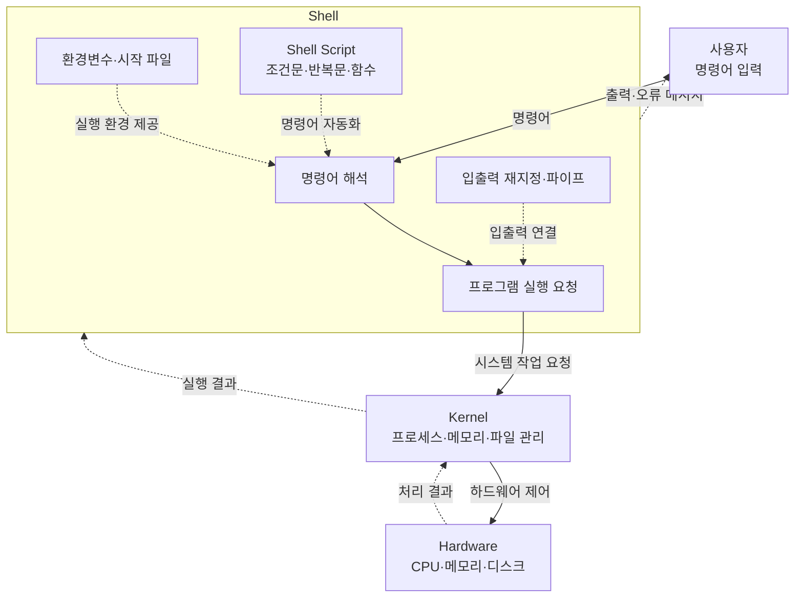
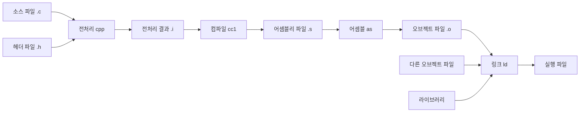
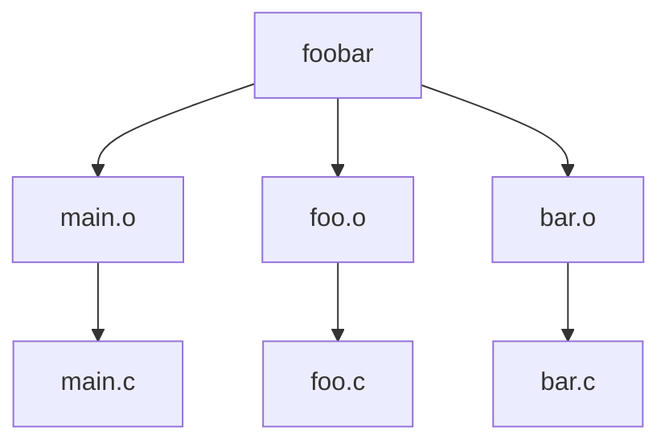

### 1. 3대 계열 핵심 요약

> 출처: `시스템 프로그래밍/Week01.md`

* **데비안 계열 (우분투, 데비안)**
  * **명령어:** `apt`
  * **특징:** 전 세계 점유율 1위. 개발 호환성 최상. 개인 학습 및 클라우드 서버 표준.
* **레드햇 계열 (RHEL, 록키 리눅스, 페도라)**
  * **명령어:** `dnf` / `yum`
  * **특징:** 기업 및 금융권 서버 표준. 안정성 중심. 현재 무료인 **록키 리눅스**가 주로 사용.
* **아치 계열 (아치 리눅스)**
  * **명령어:** `pacman`
  * **특징:** 전문가용. 사용자가 뼈대부터 직접 커스텀하는 하드코어 OS.

---

### 2. 버전 출시 방식 요약

> 출처: `시스템 프로그래밍/Week01.md`

* **고정 버전 (LTS - Long Term Support)**
  * **특징:** 정해진 주기마다 새 버전 출시 (예: 우분투 24.04 LTS).
  * **용도:** 최소 5년 보안 지원을 보장하므로 **실제 서비스 운영 서버**에 사용.
* **롤링 릴리스 (Rolling Release)**
  * **특징:** 버전 개념 없이 최신 패키지를 매일 실시간 업데이트.
  * **용도:** 최신 기능을 바로 쓸 수 있으나 충돌 위험이 있어 **개인 테스트용**에 적합.

#### ls: 파일 및 디렉토리 목록 확인
ls     # 일반 목록 출력
ls -l  # 상세 정보 출력 (권한, 소유자, 크기, 수정일 등)
ls -a  # 숨김 파일(.으로 시작하는 파일)을 포함한 모든 파일 출력
ls -al # 숨김 파일을 포함하여 상세 정보까지 모두 출력 (-a와 -l의 결합)

#### pwd: 현재 작업 중인 디렉토리의 절대 경로 출력
pwd

#### mkdir: 새로운 디렉토리(폴더) 생성
mkdir '디렉토리명'

#### cd: 지정한 디렉토리로 이동
cd '디렉토리명'
cd ..  # 상위 디렉토리로 이동
cd ~   # 홈 디렉토리로 이동

#### vi (또는 vim): 터미널 창 안에서 바로 실행되는 텍스트 편집기
vi 파일명    # 파일을 열거나 새로 생성 (명령 모드/입력 모드 전환 필요)

### 3. 터미널 텍스트 편집기 (vi) 탈출 방법

> 출처: `시스템 프로그래밍/Week01.md`

`vi s.txt`로 파일에 진입한 후 빠져나오지 못할 때는 다음 순서대로 입력함.

1. **`Esc`** 키를 1~2번 누름 (명령 모드 전환).
2. **`:`** (콜론) 키를 누름.
3. 다음 명령어 중 하나를 입력하고 **`Enter`**를 누름.
   * `:q!` -> 저장하지 않고 강제 종료
   * `:wq` -> 저장하고 종료


#### gedit: 윈도우 메모장처럼 팝업창(GUI)으로 열리는 텍스트 편집기
gedit 파일명 # x-window 환경(그래픽 화면)에서만 실행 가능

#### cat: 파일의 전체 내용을 터미널 창에 그대로 출력
cat 파일명   # 파일 내용을 빠르게 읽을 때 사용

#### sudo: 관리자(Root) 권한으로 명령어를 실행
sudo 명령어  # 일반 계정에서 권한이 없는 작업을 수행할 때 사용

#### apt: 데비안/우분투 계열의 패키지(프로그램) 관리 도구
sudo apt update       # 패키지 목록(저장소 정보) 최신화
sudo apt upgrade      # 설치된 패키지들을 최신 버전으로 업그레이드
sudo apt install 이름  # 새로운 프로그램 설치 (관리자 권한 필수)
sudo apt remove 이름   # 프로그램 삭제


## Linux 파일·사용자·권한·Package 관리

### 1. 파일 생성 및 내용 확인

> 출처: `시스템 프로그래밍/Week02.md`

###### `touch` — 빈 파일 생성

```bash
touch student.txt           # 빈 student.txt 파일 생성
```

- 파일이 없으면 새 파일을 생성함.
- 파일이 이미 있으면 내용은 유지되고 수정 시간만 갱신.

###### `cat` — 파일 내용 출력

```bash
cat student.txt             # student.txt 내용 출력
```

여러 파일을 이어서 출력할 수도 있음.

```bash
cat file1.txt file2.txt     # 두 파일 내용을 순서대로 출력
```

###### `cat >` — 파일 생성 또는 덮어쓰기

```bash
cat > student.txt           # 내용을 입력해 파일 생성
```

내용을 입력한 후 새로운 빈 줄에서 `Ctrl + D`를 누르면 저장하고 종료함.

```text
김지훈
이유진
박동현
Ctrl + D
```

기존 파일에 `>`를 사용하면 원래 내용은 삭제되고 새로운 내용으로 덮어씀.

###### `cat >>` — 기존 파일에 내용 추가

```bash
cat >> student.txt          # 기존 파일 끝에 내용 추가
```

내용을 입력한 후 `Ctrl + D`를 누름. 기존 내용은 유지.

###### `>`와 `>>` 차이

| 기호 | 의미 | 기존 내용 |
|---|---|---|
| `>` | 출력을 파일에 저장 | 기존 내용을 덮어씀 |
| `>>` | 출력을 파일 끝에 추가 | 기존 내용을 유지함 |

```bash
echo "김지훈" > student.txt    # 새로 저장
echo "이유진" >> student.txt   # 기존 내용 뒤에 추가
```

---

### 2. 문자열 출력과 파일 편집

> 출처: `시스템 프로그래밍/Week02.md`

###### `echo` — 문자열 또는 변수 출력

```bash
echo "Hello Linux"          # 문자열 출력
echo $HOME                  # HOME 환경 변수 출력
echo "박동현" >> student.txt # 문자열을 파일 끝에 추가
```

###### `gedit` — GUI 텍스트 편집기

```bash
gedit student.txt           # 그래픽 편집기로 파일 열기
```

터미널도 계속 사용하려면 `&`를 붙임.

```bash
gedit student.txt &         # 백그라운드에서 편집기 실행
```

Ubuntu 환경에 따라 `gedit`이 설치되어 있지 않을 수 있음.

---

### 3. 파일 복사·이동·이름 변경

> 출처: `시스템 프로그래밍/Week02.md`

###### `cp` — 파일 복사

기본 문법:

```bash
cp 대상파일 만들파일
```

예시:

```bash
cp student.txt backup.txt   # student.txt를 backup.txt로 복사
```

디렉터리를 복사할 때는 `-r`을 사용함.

```bash
cp -r data data_backup      # data 디렉터리 전체 복사
```

###### `mv` — 파일 이동 또는 이름 변경

파일 이름 변경:

```bash
mv old.txt new.txt          # old.txt를 new.txt로 이름 변경
```

파일 이동:

```bash
mv student.txt documents/   # student.txt를 documents 디렉터리로 이동
```

- 목적지가 파일명이면 이름이 변경.
- 목적지가 디렉터리면 파일이 이동.

---

### 4. inode

> 출처: `시스템 프로그래밍/Week02.md`

Linux 파일 시스템은 파일을 만들 때 파일 정보를 관리하는 `inode`를 생성함.

inode에 저장되는 정보:

- 파일 종류
- 파일 크기
- 파일 소유자
- 파일 소유 그룹
- 파일 접근 권한
- 파일 접근·수정 시간
- 실제 데이터가 저장된 위치
- 하드 링크 개수

파일 이름은 inode에 직접 저장되지 않음. 디렉터리가 파일 이름과 inode 번호를 연결함.

inode 번호 확인:

```bash
ls -li                     # 파일들의 inode 번호 확인
```

예시:

```text
12345 -rw-r--r-- 2 user group 20 student.txt
```

맨 앞의 `12345`가 inode 번호.

---

### 5. 링크

> 출처: `시스템 프로그래밍/Week02.md`

###### `ln` — 하드 링크 생성

```bash
ln student.txt student_hard.txt # 하드 링크 생성
```

하드 링크 특징:

- 원본과 같은 inode를 사용함.
- 원본과 하드 링크는 같은 데이터를 가리킴.
- 한쪽을 수정하면 다른 쪽에서도 변경된 내용이 보임.
- 원본 파일 이름을 삭제해도 하드 링크가 남아 있으면 데이터는 유지.
- 일반적으로 디렉터리에는 생성할 수 없음.
- 다른 파일 시스템에는 만들 수 없음.

확인:

```bash
ls -li                     # inode 번호가 같은지 확인
```

###### `ln -s` — 소프트 링크 생성

소프트 링크는 심볼릭 링크라고도 함.

```bash
ln -s student.txt student_soft.txt # 소프트 링크 생성
```

소프트 링크 특징:

- 원본 파일의 경로를 저장함.
- 원본과 inode 번호가 다름.
- 디렉터리에도 만들 수 있음.
- 다른 파일 시스템의 파일도 연결할 수 있음.
- 원본이 삭제되거나 이동하면 링크가 깨질 수 있음.

###### 하드 링크와 소프트 링크 비교

| 구분 | 하드 링크 | 소프트 링크 |
|---|---|---|
| 명령어 | `ln 원본 링크` | `ln -s 원본 링크` |
| inode | 원본과 같음 | 원본과 다름 |
| 원본 삭제 | 계속 사용 가능 | 링크가 깨질 수 있음 |
| 디렉터리 연결 | 일반적으로 불가능 | 가능 |
| 다른 파일 시스템 | 불가능 | 가능 |

---

### 6. 날짜와 시간

> 출처: `시스템 프로그래밍/Week02.md`

###### `date` — 현재 날짜와 시간 출력

```bash
date                        # 현재 날짜와 시간 출력
```

출력 형식 지정:

```bash
date "+%Y-%m-%d"            # 연도-월-일
date "+%Y-%m-%d %H:%M:%S"   # 연도-월-일 시:분:초
```

주요 형식:

| 형식 | 의미 |
|---|---|
| `%Y` | 네 자리 연도 |
| `%m` | 월 |
| `%d` | 일 |
| `%H` | 시 |
| `%M` | 분 |
| `%S` | 초 |

---

### 7. 텍스트 계산과 정렬

> 출처: `시스템 프로그래밍/Week02.md`

###### `wc` — 행·단어·문자 수 계산

```bash
wc student.txt             # 행, 단어, 바이트 수 출력
wc -l student.txt          # 행 수
wc -w student.txt          # 단어 수
wc -c student.txt          # 바이트 수
wc -m student.txt          # 문자 수
```

###### `sort` — 내용 정렬

```bash
sort student.txt           # 오름차순 정렬
sort -r student.txt        # 내림차순 정렬
sort -n numbers.txt        # 숫자 크기 기준 정렬
sort -u student.txt        # 정렬하면서 중복 제거
```

`sort`는 결과만 출력하며 원본 파일은 변경하지 않음.

정렬 결과를 파일로 저장:

```bash
sort student.txt > sorted.txt # 정렬 결과를 새 파일에 저장
```

---

### 8. 문자열과 파일 검색

> 출처: `시스템 프로그래밍/Week02.md`

###### `grep` — 파일 내용에서 문자열 검색

```bash
grep "김민지" student.txt   # 김민지가 들어 있는 줄 검색
```

주요 옵션:

```bash
grep -n "김민지" student.txt # 줄 번호 함께 출력
grep -i "linux" note.txt     # 영어 대소문자 무시
grep -v "linux" note.txt     # linux가 없는 줄 출력
grep -r "linux" notes/       # 디렉터리 내부 재귀 검색
```

###### `find` — 파일과 디렉터리 검색

```bash
find . -name "student.txt"  # 현재 위치부터 이름 검색
```

주요 옵션:

```bash
find . -iname "student.txt" # 대소문자 무시
find . -type f -name "*.txt" # txt 파일만 검색
find . -type d -name "data" # data 디렉터리 검색
```

- `.`: 현재 디렉터리
- `-type f`: 파일
- `-type d`: 디렉터리
- `-name`: 이름 검색
- `-iname`: 대소문자를 무시하고 이름 검색

---

### 9. 파이프

> 출처: `시스템 프로그래밍/Week02.md`

###### `|` — 앞 명령의 출력을 뒤 명령에 전달

기본 구조:

```bash
명령어1 | 명령어2           # 명령어1 출력 → 명령어2 입력
```

예시:

```bash
cat student.txt | sort      # 파일 내용을 정렬
ps -ef | grep firefox       # Firefox 프로세스 검색
who | wc -l                 # 로그인한 사용자 수 계산
```

---

### 10. 프로세스 확인

> 출처: `시스템 프로그래밍/Week02.md`

###### `ps` — 현재 프로세스 확인

```bash
ps                          # 현재 터미널 관련 프로세스 확인
```

###### `ps -ef` — 전체 프로세스 확인

```bash
ps -ef                      # 시스템 전체 프로세스 상세 출력
```

특정 프로세스 검색:

```bash
ps -ef | grep firefox       # Firefox 관련 프로세스 검색
```

주요 항목:

| 항목 | 의미 |
|---|---|
| `UID` | 프로세스를 실행한 사용자 |
| `PID` | 프로세스 번호 |
| `PPID` | 부모 프로세스 번호 |
| `CMD` | 실행된 명령어 |

---

### 11. 사용자 정보 확인

> 출처: `시스템 프로그래밍/Week02.md`

###### `whoami` — 현재 사용자 이름 확인

```bash
whoami                      # 현재 로그인한 사용자 이름 출력
```

###### `who` — 로그인 사용자 확인

```bash
who                         # 현재 시스템에 로그인한 사용자 출력
```

###### `id` — UID와 GID 확인

```bash
id                          # 현재 사용자 정보 확인
id hong                     # hong 사용자 정보 확인
```

주요 항목:

- `uid`: 사용자 번호
- `gid`: 기본 그룹 번호
- `groups`: 사용자가 속한 그룹 목록

###### `groups` — 사용자가 속한 그룹 확인

```bash
groups                      # 현재 사용자가 속한 그룹 출력
groups hong                 # hong 사용자의 그룹 출력
```

---

### 12. 사용자 계정 관리

> 출처: `시스템 프로그래밍/Week02.md`

사용자 관리 명령은 일반적으로 관리자 권한이 필요.

###### `adduser` — 사용자 생성

```bash
sudo adduser hong           # hong 사용자 생성
```

사용자 생성 과정에서 다음 정보를 설정함.

- 홈 디렉터리
- 비밀번호
- 사용자 정보

###### `passwd` — 비밀번호 변경

현재 사용자 비밀번호 변경:

```bash
passwd                      # 현재 사용자 비밀번호 변경
```

다른 사용자 비밀번호 변경:

```bash
sudo passwd hong            # hong 사용자 비밀번호 변경
```

###### `deluser` — 사용자 삭제

```bash
sudo deluser hong           # 계정만 삭제
```

홈 디렉터리까지 삭제:

```bash
sudo deluser --remove-home hong # 계정과 홈 디렉터리 삭제
```

`--remove-home`은 사용자 파일까지 삭제하므로 주의해야 함.

###### `su` — 다른 사용자로 전환

```bash
su - hong                   # hong 사용자 환경으로 전환
```

원래 사용자로 돌아가기:

```bash
exit                        # 현재 사용자 세션 종료
```

###### `sudo` — 관리자 권한으로 명령 실행

```bash
sudo 명령어                 # 명령 하나를 관리자 권한으로 실행
```

예시:

```bash
sudo apt update             # 관리자 권한으로 패키지 목록 갱신
sudo adduser hong           # 관리자 권한으로 사용자 생성
```

`sudo`는 시스템을 변경할 수 있으므로 명령을 확인한 후 실행함.

---

### 13. 그룹 관리

> 출처: `시스템 프로그래밍/Week02.md`

###### `groupadd` — 그룹 생성

```bash
sudo groupadd developers    # developers 그룹 생성
```

###### `groupdel` — 그룹 삭제

```bash
sudo groupdel developers    # developers 그룹 삭제
```

###### `usermod -aG` — 사용자를 그룹에 추가

```bash
sudo usermod -aG developers hong # hong을 developers 그룹에 추가
```

옵션 의미:

- `-G`: 보조 그룹 지정
- `-a`: 기존 그룹을 유지하면서 추가

`-a`를 빼고 `-G`만 사용하면 기존 보조 그룹에서 빠질 수 있으므로 주의함.

그룹 추가 확인:

```bash
groups hong                 # hong의 소속 그룹 확인
```

그룹 변경은 로그아웃 후 다시 로그인해야 반영되는 경우가 있음.

---

### 14. 파일 권한

> 출처: `시스템 프로그래밍/Week02.md`

파일 권한 확인:

```bash
ls -l student.txt           # 권한, 소유자, 그룹 확인
```

권한 문자:

| 문자 | 의미 |
|---|---|
| `r` | 읽기 |
| `w` | 쓰기 |
| `x` | 실행 |

권한 숫자:

| 숫자 | 권한 |
|---:|---|
| `4` | 읽기 |
| `2` | 쓰기 |
| `1` | 실행 |

###### `chmod` — 파일 권한 변경

```bash
chmod 644 student.txt       # 소유자 rw-, 그룹 r--, 기타 r--
chmod 755 script.sh         # 소유자 rwx, 그룹 r-x, 기타 r-x
```

문자 방식:

```bash
chmod u+x script.sh         # 소유자에게 실행 권한 추가
chmod g-w student.txt       # 그룹의 쓰기 권한 제거
chmod o-r student.txt       # 기타 사용자의 읽기 권한 제거
```

대상 문자:

- `u`: 소유자
- `g`: 그룹
- `o`: 기타 사용자
- `a`: 모든 사용자

`644`의 의미:

```text
6 = 4 + 2 = rw-  소유자
4 = 4     = r--  그룹
4 = 4     = r--  기타 사용자
```

---

### 15. 파일 소유자와 그룹

> 출처: `시스템 프로그래밍/Week02.md`

###### `chown` — 파일 소유자 변경

```bash
sudo chown hong student.txt # 소유자를 hong으로 변경
```

소유자와 그룹을 함께 변경:

```bash
sudo chown hong:developers student.txt # 소유자와 그룹 변경
```

###### `chgrp` — 파일 소유 그룹 변경

```bash
sudo chgrp developers student.txt # 소유 그룹 변경
```

확인:

```bash
ls -l student.txt           # 변경된 소유자와 그룹 확인
```

---

### 16. `/etc` 디렉터리

> 출처: `시스템 프로그래밍/Week02.md`

`/etc`는 Linux 시스템의 설정 파일이 저장되는 디렉터리.

```bash
ls /etc                     # /etc 내부 파일 확인
```

대표 파일:

| 경로 | 내용 |
|---|---|
| `/etc/passwd` | 사용자 계정 기본 정보 |
| `/etc/group` | 그룹 정보 |
| `/etc/hostname` | 컴퓨터 이름 |
| `/etc/hosts` | 호스트 이름과 IP 주소 연결 정보 |

예시:

```bash
cat /etc/passwd             # 사용자 계정 정보 출력
cat /etc/group              # 그룹 정보 출력
cat /etc/hostname           # 컴퓨터 이름 출력
```

`/etc` 파일을 잘못 수정하면 시스템에 문제가 생길 수 있으므로 주의함.

---

### 17. 패키지 관리

> 출처: `시스템 프로그래밍/Week02.md`

###### `apt` — Ubuntu 패키지 관리

패키지 목록 갱신:

```bash
sudo apt update             # 설치 가능한 패키지 목록 갱신
```

설치된 패키지 업데이트:

```bash
sudo apt upgrade            # 설치된 패키지 업데이트
```

패키지 설치:

```bash
sudo apt install tree       # tree 패키지 설치
```

패키지 제거:

```bash
sudo apt remove tree        # tree 패키지 제거
```

패키지 검색:

```bash
apt search tree             # tree 관련 패키지 검색
```

일반적으로 패키지 설치 전 `sudo apt update`를 실행함.

###### `snap` — Snap 패키지 관리

설치된 Snap 확인:

```bash
snap list                   # 설치된 Snap 패키지 출력
```

패키지 검색:

```bash
snap find code              # code 관련 Snap 검색
```

패키지 설치:

```bash
sudo snap install hello-world # hello-world 설치
```

패키지 제거:

```bash
sudo snap remove hello-world # hello-world 제거
```

패키지 업데이트:

```bash
sudo snap refresh           # Snap 패키지 업데이트
```

###### `apt`와 `snap` 비교

| 구분 | `apt` | `snap` |
|---|---|---|
| 형식 | Debian 패키지 | Snap 패키지 |
| 의존성 | 시스템 라이브러리 공유 | 필요한 라이브러리를 함께 포함 가능 |
| 업데이트 | `apt upgrade`로 실행 | 자동 업데이트가 기본 |
| 특징 | Ubuntu의 전통적인 방식 | 격리와 배포 편의성 중심 |

---

### 18. 전체 명령어 요약

> 출처: `시스템 프로그래밍/Week02.md`

| 분야 | 명령어 | 기능 | 예시 |
|---|---|---|---|
| 파일 | `touch` | 빈 파일 생성 | `touch a.txt` |
| 파일 | `cat` | 내용 출력 | `cat a.txt` |
| 파일 | `cat >` | 생성·덮어쓰기 | `cat > a.txt` |
| 파일 | `cat >>` | 내용 추가 | `cat >> a.txt` |
| 출력 | `echo` | 문자열 출력 | `echo "hello"` |
| 편집 | `gedit` | GUI 편집 | `gedit a.txt` |
| 파일 | `cp` | 복사 | `cp a.txt b.txt` |
| 파일 | `mv` | 이동·이름 변경 | `mv a.txt b.txt` |
| 링크 | `ln` | 하드 링크 생성 | `ln a.txt hard.txt` |
| 링크 | `ln -s` | 소프트 링크 생성 | `ln -s a.txt soft.txt` |
| 날짜 | `date` | 날짜·시간 출력 | `date` |
| 계산 | `wc` | 행·단어·문자 수 | `wc -l a.txt` |
| 정렬 | `sort` | 행 정렬 | `sort a.txt` |
| 검색 | `grep` | 내용 검색 | `grep "kim" a.txt` |
| 검색 | `find` | 파일 검색 | `find . -name "a.txt"` |
| 프로세스 | `ps` | 현재 프로세스 확인 | `ps` |
| 프로세스 | `ps -ef` | 전체 프로세스 확인 | `ps -ef` |
| 연결 | `\|` | 명령 출력 연결 | `ps -ef \| grep ssh` |
| 사용자 | `whoami` | 현재 사용자 확인 | `whoami` |
| 사용자 | `who` | 로그인 사용자 확인 | `who` |
| 사용자 | `id` | UID·GID 확인 | `id hong` |
| 사용자 | `groups` | 소속 그룹 확인 | `groups hong` |
| 사용자 | `adduser` | 사용자 생성 | `sudo adduser hong` |
| 사용자 | `passwd` | 비밀번호 변경 | `sudo passwd hong` |
| 사용자 | `deluser` | 사용자 삭제 | `sudo deluser hong` |
| 사용자 | `su` | 사용자 전환 | `su - hong` |
| 권한 | `sudo` | 관리자 권한 실행 | `sudo apt update` |
| 그룹 | `groupadd` | 그룹 생성 | `sudo groupadd dev` |
| 그룹 | `groupdel` | 그룹 삭제 | `sudo groupdel dev` |
| 그룹 | `usermod -aG` | 사용자를 그룹에 추가 | `sudo usermod -aG dev hong` |
| 권한 | `chmod` | 접근 권한 변경 | `chmod 644 a.txt` |
| 소유권 | `chown` | 소유자 변경 | `sudo chown hong a.txt` |
| 소유권 | `chgrp` | 소유 그룹 변경 | `sudo chgrp dev a.txt` |
| 설정 | `/etc` | 시스템 설정 저장 | `ls /etc` |
| 패키지 | `apt` | APT 패키지 관리 | `sudo apt install tree` |
| 패키지 | `snap` | Snap 패키지 관리 | `snap list` |

### 리눅스 명령어 복습 문제와 답안

> 출처: `시스템 프로그래밍/Week02_quiz.md`

#### 리눅스 명령어 복습 문제와 답안

### 1. 현재 작업 디렉터리 확인

> 출처: `시스템 프로그래밍/Week02_quiz.md`

**문제:** 현재 작업 중인 디렉터리의 절대 경로를 확인하는 명령어를 작성하시오.

**답:**

```bash
pwd
```

### 2. 숨김 파일을 포함한 파일 목록 확인

> 출처: `시스템 프로그래밍/Week02_quiz.md`

**문제:** 현재 디렉터리에 있는 모든 파일과 디렉터리를 숨김 파일까지 포함하여 자세히 확인하시오.

**답:**

```bash
ls -al
```

- `-a`: 숨김 파일을 포함함.
- `-l`: 파일 정보를 자세히 표시함.

### 3. 디렉터리 생성

> 출처: `시스템 프로그래밍/Week02_quiz.md`

**문제:** 현재 디렉터리에 `linux_test`라는 새로운 디렉터리를 생성하시오.

**답:**

```bash
mkdir linux_test
```

### 4. 작업 디렉터리 이동

> 출처: `시스템 프로그래밍/Week02_quiz.md`

**문제:** 작업 디렉터리를 `linux_test` 디렉터리로 이동하시오.

**답:**

```bash
cd linux_test
```

### 5. student.txt 생성

> 출처: `시스템 프로그래밍/Week02_quiz.md`

**문제:** `vi`, `gedit` 또는 `cat`을 이용하여 다음 내용을 가진 `student.txt` 파일을 생성하시오.

```text
20260001 홍길동 컴퓨터공학과
```

**답:**

```bash
cat > student.txt
```

다음 내용을 입력함.

```text
20260001 홍길동 컴퓨터공학과
```

입력이 끝나면 `Ctrl + D`를 누름.

한 줄 명령어로 생성하려면 다음과 같이 작성할 수도 있음.

```bash
echo "20260001 홍길동 컴퓨터공학과" > student.txt
```

### 6. 파일 복사

> 출처: `시스템 프로그래밍/Week02_quiz.md`

**문제:** `student.txt`를 `student_backup.txt`라는 이름으로 복사하시오.

**답:**

```bash
cp student.txt student_backup.txt
```

### 7. 파일 이름 변경

> 출처: `시스템 프로그래밍/Week02_quiz.md`

**문제:** `student_backup.txt`의 이름을 `student_old.txt`로 변경하시오.

**답:**

```bash
mv student_backup.txt student_old.txt
```

### 8. 하드 링크 생성

> 출처: `시스템 프로그래밍/Week02_quiz.md`

**문제:** `student.txt`를 `student_link.txt`라는 이름으로도 사용할 수 있도록 하드 링크를 생성하시오.

**답:**

```bash
ln student.txt student_link.txt
```

하드 링크는 원본 파일과 같은 inode를 사용함.

### 9. 심볼릭 링크 생성

> 출처: `시스템 프로그래밍/Week02_quiz.md`

**문제:** `student.txt`를 가리키는 `student_symbolic.txt`를 생성하시오.

**답:**

```bash
ln -s student.txt student_symbolic.txt
```

심볼릭 링크는 원본 파일의 경로를 가리킴.

### 10. 디렉터리 생성 및 파일 이동

> 출처: `시스템 프로그래밍/Week02_quiz.md`

**문제:** 현재 디렉터리에 `backup` 디렉터리를 만들고 `student_old.txt`를 해당 디렉터리로 이동하시오.

**답:**

```bash
mkdir backup
mv student_old.txt backup/
```

### 11. 파일 권한 변경

> 출처: `시스템 프로그래밍/Week02_quiz.md`

**문제:** `student.txt`의 권한을 다음과 같이 변경하시오.

```text
rwxr-xr--
```

**답:**

```bash
chmod 754 student.txt
```

숫자의 의미:

- 소유자 `rwx`: 7
- 그룹 `r-x`: 5
- 기타 사용자 `r--`: 4

기호 방식으로도 변경할 수 있음.

```bash
chmod u=rwx,g=rx,o=r student.txt
```

### 12. 권한을 숫자로 표현

> 출처: `시스템 프로그래밍/Week02_quiz.md`

**문제:** 다음 권한을 숫자로 표현하시오.

```text
rw-r-----
```

**답:**

```text
640
```

- 소유자 `rw-`: 6
- 그룹 `r--`: 4
- 기타 사용자 `---`: 0

### 13. 소유자에게 실행 권한 추가

> 출처: `시스템 프로그래밍/Week02_quiz.md`

**문제:** `student.txt`의 소유자에게 실행 권한을 추가하는 명령어를 기호 방식으로 작성하시오.

**답:**

```bash
chmod u+x student.txt
```

### 14. 날짜와 시간 저장

> 출처: `시스템 프로그래밍/Week02_quiz.md`

**문제:** 현재 날짜와 시간을 `date.txt`에 저장하시오. 기존 내용이 있다면 덮어씀.

**답:**

```bash
date > date.txt
```

`>`는 기존 파일의 내용을 덮어씀.

### 15. 파일 내용 추가

> 출처: `시스템 프로그래밍/Week02_quiz.md`

**문제:** `date.txt`의 내용을 `student.txt`의 마지막 부분에 추가하시오.

**답:**

```bash
cat date.txt >> student.txt
```

`>>`는 기존 내용을 유지하면서 파일 마지막에 내용을 추가함.

### 16. 행, 단어, 문자 수 확인

> 출처: `시스템 프로그래밍/Week02_quiz.md`

**문제:** `student.txt`의 행 수, 단어 수, 문자 수를 확인하시오.

**답:**

```bash
wc -l -w -m student.txt
```

- `-l`: 행 수
- `-w`: 단어 수
- `-m`: 문자 수

기본적인 행·단어·바이트 수는 다음 명령으로 확인할 수 있음.

```bash
wc student.txt
```

### 17. 문자열 검색

> 출처: `시스템 프로그래밍/Week02_quiz.md`

**문제:** `student.txt`에서 `컴퓨터`라는 문자열이 포함되어 있는지 검색하시오.

**답:**

```bash
grep "컴퓨터" student.txt
```

행 번호와 함께 확인하려면 다음과 같이 작성함.

```bash
grep -n "컴퓨터" student.txt
```

### 18. 모든 프로세스 확인

> 출처: `시스템 프로그래밍/Week02_quiz.md`

**문제:** 현재 시스템에서 실행 중인 모든 프로세스를 확인하시오.

**답:**

```bash
ps -ef
```

### 19. 실행 중인 프로세스 개수 확인

> 출처: `시스템 프로그래밍/Week02_quiz.md`

**문제:** 현재 실행 중인 프로세스의 개수를 파이프와 `wc` 명령어를 이용하여 확인하시오.

**답:**

```bash
ps -e --no-headers | wc -l
```

간단히 다음과 같이 작성할 수도 있지만 출력의 제목 행까지 포함.

```bash
ps -ef | wc -l
```

### 20. 프로세스 정보 정렬

> 출처: `시스템 프로그래밍/Week02_quiz.md`

**문제:** 현재 실행 중인 프로세스 정보를 출력한 후 `sort`를 이용하여 정렬된 결과를 확인하시오.

**답:**

```bash
ps -ef | sort
```

프로세스 이름을 기준으로 정렬하려면 다음과 같이 작성할 수 있음.

```bash
ps -ef | sort -k8
```

---

### 핵심 명령어 요약

> 출처: `시스템 프로그래밍/Week02_quiz.md`

| 명령어 | 기능 |
|---|---|
| `pwd` | 현재 디렉터리의 절대 경로 출력 |
| `ls -al` | 숨김 파일을 포함한 상세 목록 출력 |
| `mkdir` | 디렉터리 생성 |
| `cd` | 작업 디렉터리 이동 |
| `cp` | 파일 복사 |
| `mv` | 파일 이동 또는 이름 변경 |
| `ln` | 하드 링크 생성 |
| `ln -s` | 심볼릭 링크 생성 |
| `chmod` | 파일 권한 변경 |
| `date` | 현재 날짜와 시간 출력 |
| `wc` | 행, 단어, 문자 수 확인 |
| `grep` | 문자열 검색 |
| `ps -ef` | 전체 프로세스 확인 |
| `sort` | 내용 정렬 |
| `>` | 출력 결과로 파일 덮어쓰기 |
| `>>` | 출력 결과를 파일 끝에 추가 |
| `\|` | 앞 명령의 출력을 다음 명령의 입력으로 전달 |


## Shell·Bash Script와 실습

### 1. Shell 개요

> 출처: `시스템 프로그래밍/Week03.md`

###### Shell이란?

Shell은 사용자와 운영체제 사이에서 명령어를 전달하고 처리하는 소프트웨어.

사용자가 명령어를 입력하면 Shell이 이를 해석하여 적절한 프로그램을 실행함. 따라서 Shell은 **명령어 처리기(Command Processor)**라고도 함.


###### Shell의 종류

| Shell | 실행 파일 | 특징 |
|---|---|---|
| Bourne Shell | `/bin/sh` | Unix의 전통적인 기본 Shell |
| Korn Shell | `/bin/ksh` | Bourne Shell을 확장한 Shell |
| C Shell | `/bin/csh` | C 언어와 비슷한 문법을 제공 |
| Bash | `/bin/bash` | GNU에서 개발한 Bourne Shell 확장판 |

###### 로그인 Shell 확인

```bash
echo $SHELL
```

###### 로그인 Shell 변경

```bash
chsh
```

변경된 로그인 Shell은 일반적으로 로그아웃 후 다시 로그인해야 적용.

###### 서브 Shell 실행

현재 Shell에서 다른 Shell을 실행하면 서브 Shell이 생성.

```bash
/bin/sh
```

서브 Shell을 종료하려면 다음 명령어를 사용함.

```bash
exit
```

---

### 2. Shell의 환경변수

> 출처: `시스템 프로그래밍/Week03.md`

###### 변수 설정

```bash
변수명=값
```

예시:

```bash
TERM=xterm-256color
echo $TERM
```

> 변수 대입문의 `=` 앞뒤에는 공백을 넣지 않음.

###### 환경변수 확인

```bash
env
```

대표적인 환경변수는 다음과 같음.

| 환경변수 | 의미 |
|---|---|
| `$USER` | 사용자 이름 |
| `$HOME` | 홈 디렉터리 |
| `$PATH` | 명령어를 검색할 디렉터리 목록 |
| `$SHELL` | 로그인 Shell 경로 |
| `$TERM` | 터미널 종류 |
| `$HOSTNAME` | 호스트 이름 |
| `$MAIL` | 메일박스 경로 |

###### 지역변수와 환경변수

Shell 변수는 지역변수와 환경변수로 구분.

- 지역변수: 현재 Shell에서만 사용.
- 환경변수: 자식 프로세스와 서브 Shell에 전달.

변수를 환경변수로 만들려면 `export`를 사용함.

```bash
country=대한민국
export country
```

한 번에 선언할 수도 있음.

```bash
export country=대한민국
```

---

### 3. Shell 시작 파일

> 출처: `시스템 프로그래밍/Week03.md`

시작 파일은 Shell이 시작될 때 자동으로 실행되는 설정 파일.

환경변수, 프롬프트, 명령어 경로, 별명, 함수 등을 설정하는 데 사용.

###### 주요 Bash 시작 파일

| 파일 | 적용 대상 | 주요 역할 |
|---|---|---|
| `/etc/profile` | 전체 사용자 | 로그인 환경 설정 |
| `/etc/bash.bashrc` | 전체 사용자 | 대화형 Bash 설정 |
| `~/.bash_profile` | 개별 사용자 | 사용자 로그인 환경 설정 |
| `~/.bashrc` | 개별 사용자 | 별명, 함수, 대화형 환경 설정 |

###### `.bashrc` 적용

파일을 수정한 뒤 현재 Shell에 바로 적용하려면 다음과 같이 실행함.

```bash
source ~/.bashrc
```

또는 다음과 같이 실행할 수 있음.

```bash
. ~/.bashrc
```

---

### 4. 전면 처리와 후면 처리

> 출처: `시스템 프로그래밍/Week03.md`

###### 전면 처리

명령어를 전면에서 실행함. 명령어 실행이 끝날 때까지 Shell은 다음 명령을 기다림.

```bash
command
```

###### 후면 처리

명령어 뒤에 `&`를 붙이면 후면에서 실행.

```bash
command &
```

예시:

```bash
sleep 100 &
find . -name "test.c" -print &
```

###### 후면 작업 확인

```bash
jobs
```

특정 작업만 확인하려면 작업 번호를 지정함.

```bash
jobs %1
```

###### 후면 작업을 전면으로 전환

```bash
fg %1
```

---

### 5. 입출력 재지정

> 출처: `시스템 프로그래밍/Week03.md`

Linux 명령어는 기본적으로 다음 세 가지 입출력 통로를 사용함.

| 번호 | 이름 | 설명 |
|---|---|---|
| `0` | 표준입력 | 키보드 등의 입력 |
| `1` | 표준출력 | 정상적인 실행 결과 |
| `2` | 표준오류 | 오류 메시지 |

###### 출력 재지정

명령어의 표준출력을 파일에 저장함.

```bash
command > file
```

예시:

```bash
ls -al > list.txt
```

`>`는 기존 파일 내용을 덮어씀.

###### 출력 추가

기존 파일의 마지막에 내용을 추가함.

```bash
command >> file
```

예시:

```bash
date >> list.txt
```

###### 입력 재지정

파일의 내용을 명령어의 표준입력으로 사용함.

```bash
command < file
```

예시:

```bash
wc < list.txt
```

###### 표준오류 재지정

오류 메시지를 파일에 저장함.

```bash
command 2> error.txt
```

예시:

```bash
ls /not-found 2> error.txt
```

###### 표준출력과 표준오류 함께 저장

```bash
command > result.txt 2>&1
```

Bash에서는 다음과 같이 작성할 수도 있음.

```bash
command &> result.txt
```

###### Here Document

여러 줄의 문자열을 명령어의 표준입력으로 전달함.

```bash
wc << END
hello
shell script
END
```

###### 파이프

파이프는 앞 명령어의 표준출력을 다음 명령어의 표준입력으로 전달함.

```bash
command1 | command2
```

예시:

```bash
ls | sort -r
who | wc -l
ls /etc | wc -w
```

---

### 6. 여러 명령어 실행

> 출처: `시스템 프로그래밍/Week03.md`

###### 명령어 순차 실행

`;`로 연결된 명령어를 순서대로 실행함.

```bash
date; pwd; ls
```

###### 명령어 그룹

여러 명령어를 하나의 그룹으로 묶음.

```bash
(date; pwd; ls)
```

그룹 전체의 출력을 파일에 저장할 수 있음.

```bash
(date; pwd; ls) > result.txt
```

###### 성공했을 때 다음 명령 실행

첫 번째 명령어가 성공하면 두 번째 명령어를 실행함.

```bash
command1 && command2
```

예시:

```bash
gcc main.c && ./a.out
```

###### 실패했을 때 다음 명령 실행

첫 번째 명령어가 실패하면 두 번째 명령어를 실행함.

```bash
command1 || command2
```

예시:

```bash
gcc main.c || echo "컴파일 실패"
```

---

### 7. 파일 이름 대치와 명령어 대치

> 출처: `시스템 프로그래밍/Week03.md`

###### 파일 이름 대치

Shell은 특수문자를 실제 파일 이름으로 변환함.

| 문자 | 의미 |
|---|---|
| `*` | 빈 문자열을 포함한 임의의 문자열 |
| `?` | 임의의 문자 한 개 |
| `[abc]` | `a`, `b`, `c` 중 한 문자 |
| `[a-z]` | 지정된 범위의 문자 한 개 |

예시:

```bash
ls *.txt
gcc *.c
ls file?.txt
ls [ac]*
```

###### 명령어 대치

다른 명령어의 실행 결과를 문자열로 사용함.

권장 문법:

```bash
$(command)
```

예시:

```bash
echo "현재 시간: $(date)"
echo "현재 디렉터리의 파일 수: $(ls | wc -w)"
```

백틱 문법도 사용할 수 있지만 중첩과 가독성 측면에서 `$(...)` 사용이 권장.

```bash
echo `date`
```

###### 따옴표 차이

###### 작은따옴표

작은따옴표 안에서는 변수 대치와 명령어 대치가 수행되지 않음.

```bash
name=홍길동
echo '이름: $name'
```

출력:

```text
이름: $name
```

###### 큰따옴표

큰따옴표 안에서는 변수 대치와 명령어 대치가 수행.

```bash
name=홍길동
echo "이름: $name"
echo "현재 시간: $(date)"
```

변수를 사용할 때는 공백과 파일 이름 확장 문제를 방지하기 위해 큰따옴표 사용을 권장함.

```bash
echo "$name"
```

---

### 8. Bash 편의 기능

> 출처: `시스템 프로그래밍/Week03.md`

###### 별명

긴 명령어에 짧은 이름을 지정할 수 있음.

```bash
alias ll='ls -alF'
alias la='ls -A'
alias l='ls -CF'
```

현재 등록된 별명을 확인함.

```bash
alias
```

별명을 삭제함.

```bash
unalias ll
```

###### 히스토리

이전에 입력한 명령어를 확인함.

```bash
history
```

| 표현 | 의미 |
|---|---|
| `!!` | 바로 전 명령어 재실행 |
| `!20` | 20번 명령어 재실행 |
| `!gcc` | `gcc`로 시작한 최근 명령어 재실행 |
| `!?test.c` | `test.c`를 포함한 최근 명령어 재실행 |

히스토리 관련 환경변수:

```bash
HISTSIZE=1000
HISTFILESIZE=2000
```

---

### 9. Bash 변수

> 출처: `시스템 프로그래밍/Week03.md`

###### 단순 변수

하나의 문자열 또는 값을 저장함.

```bash
city=서울
country=대한민국
address="서울시 용산구"
```

변수의 값은 `$`를 붙여 사용함.

```bash
echo "$city"
echo "$country"
echo "$address"
```

###### 배열 변수

하나의 변수에 여러 값을 저장함.

```bash
cities=(서울 부산 목포)
```

| 표현 | 의미 |
|---|---|
| `${cities[0]}` | 첫 번째 원소 |
| `${cities[@]}` | 전체 원소 |
| `${#cities[@]}` | 원소 개수 |

예시:

```bash
echo "${cities[0]}"
echo "${cities[@]}"
echo "${#cities[@]}"
```

새로운 원소를 추가함.

```bash
cities[3]=제주
```

###### 표준입력 읽기

`read`는 표준입력에서 한 줄을 읽어 변수에 저장함.

```bash
read name
echo "$name"
```

안내 문구와 함께 입력받을 수도 있음.

```bash
read -p "이름을 입력하세요: " name
echo "안녕하세요, $name"
```

###### 특수 변수

| 변수 | 의미 |
|---|---|
| `$0` | 실행한 스크립트 이름 |
| `$1`~`$9` | 명령줄 인수 |
| `$#` | 명령줄 인수 개수 |
| `$*` | 전체 명령줄 인수 |
| `$@` | 전체 명령줄 인수 |
| `$$` | 현재 Shell의 프로세스 번호 |
| `$?` | 직전 명령어의 종료 상태 |

일반적으로 전체 인수를 안전하게 처리할 때는 `"$@"`를 사용함.

```bash
for argument in "$@"; do
    echo "$argument"
done
```

---

### 10. Bash Shell Script

> 출처: `시스템 프로그래밍/Week03.md`

###### 스크립트 작성

```bash
#!/bin/bash

echo "현재 시간:"
date

echo "현재 사용자:"
whoami

echo "시스템 실행 상태:"
uptime
```

첫 번째 줄의 `#!/bin/bash`는 스크립트를 실행할 인터프리터를 지정함.

###### 실행 권한 부여

```bash
chmod +x script.bash
```

###### 스크립트 실행

```bash
./script.bash
```

또는 Bash를 직접 지정할 수 있음.

```bash
bash script.bash
```

---

### 11. 조건식과 연산자

> 출처: `시스템 프로그래밍/Week03.md`

###### 정수 비교 연산자

`[ ... ]` 구문에서 사용하는 정수 비교 연산자.

| 연산자 | 의미 |
|---|---|
| `-eq` | 같음 |
| `-ne` | 다름 |
| `-gt` | 큼 |
| `-ge` | 크거나 같음 |
| `-lt` | 작음 |
| `-le` | 작거나 같음 |

예시:

```bash
if [ "$score" -ge 90 ]; then
    echo "A"
fi
```

###### 문자열 비교 연산자

| 표현 | 의미 |
|---|---|
| `"$a" = "$b"` | 두 문자열이 같음 |
| `"$a" != "$b"` | 두 문자열이 다름 |
| `-n "$a"` | 문자열이 비어 있지 않음 |
| `-z "$a"` | 문자열이 비어 있음 |

예시:

```bash
if [ "$reply" = "Y" ] || [ "$reply" = "y" ]; then
    echo "계속함."
else
    echo "중지함."
fi
```

###### 파일 검사 연산자

| 연산자 | 의미 |
|---|---|
| `-e file` | 파일 또는 디렉터리가 존재 |
| `-f file` | 일반 파일 |
| `-d file` | 디렉터리 |
| `-r file` | 읽기 가능 |
| `-w file` | 쓰기 가능 |
| `-x file` | 실행 가능 |
| `-O file` | 현재 사용자가 소유 |
| `-s file` | 파일 크기가 0보다 큼 |

예시:

```bash
if [ -f "$file" ] && [ -w "$file" ]; then
    echo "쓰기 가능한 일반 파일."
fi
```

###### 논리 연산

```bash
! condition
condition1 && condition2
condition1 || condition2
```

예시:

```bash
if [ ! -e "$file" ]; then
    echo "파일이 존재하지 않음."
fi
```

###### 산술 연산

```bash
a=$((2 + 3))
echo "$a"
```

변수 값을 증가시킬 수 있음.

```bash
((a++))
((a += 2))
((a *= 10))
```

###### 변수 속성 선언

```bash
declare -i number=10
declare -r readonly_value=20
declare -a array
declare -x environment_variable=value
```

| 옵션 | 의미 |
|---|---|
| `-i` | 정수 변수 |
| `-r` | 읽기 전용 변수 |
| `-a` | 배열 변수 |
| `-x` | 환경변수로 내보내기 |
| `-f` | 정의된 함수 확인 |

---

### 12. 제어문

> 출처: `시스템 프로그래밍/Week03.md`

###### if 문

```bash
if [ 조건식 ]; then
    명령어
fi
```

###### if-else 문

```bash
if [ 조건식 ]; then
    명령어
else
    명령어
fi
```

예시:

```bash
if [ "$#" -eq 1 ]; then
    wc "$1"
else
    echo "사용법: $0 파일"
fi
```

###### 다중 조건문

```bash
if (( score >= 90 )); then
    echo "A"
elif (( score >= 80 )); then
    echo "B"
elif (( score >= 70 )); then
    echo "C"
else
    echo "노력 필요"
fi
```

###### case 문

```bash
case "$variable" in
    pattern1)
        command
        ;;
    pattern2)
        command
        ;;
    *)
        command
        ;;
esac
```

예시:

```bash
case "$choice" in
    d)
        date
        ;;
    l)
        ls
        ;;
    w)
        who
        ;;
    q)
        echo "종료함."
        ;;
    *)
        echo "잘못된 선택."
        ;;
esac
```

###### for 문

리스트의 각 값에 대해 명령어를 반복함.

```bash
for variable in list; do
    command
done
```

예시:

```bash
for file in *; do
    echo "$file"
done
```

명령줄 인수를 처리할 때는 다음과 같이 작성함.

```bash
for file in "$@"; do
    echo "$file"
done
```

###### while 문

조건이 참인 동안 명령어를 반복함.

```bash
while (( condition )); do
    command
done
```

예시:

```bash
number=1

while (( number <= 10 )); do
    echo "$number"
    ((number++))
done
```

---

### 13. 함수와 디버깅

> 출처: `시스템 프로그래밍/Week03.md`

###### 함수 정의

```bash
function_name() {
    command
}
```

예시:

```bash
show_files() {
    local directory="$1"

    echo "대상 디렉터리: $directory"
    ls -l "$directory" | head
}
```

###### 함수 호출

```bash
show_files /tmp
```

함수 안에서도 `$1`, `$2`, `$#`, `"$@"` 등의 인수 관련 변수를 사용할 수 있음.

###### 디버깅

스크립트의 각 명령어가 실행되는 과정을 확인함.

```bash
bash -x script.bash
```

스크립트 내용을 읽으면서 실행함.

```bash
bash -v script.bash
```

두 옵션을 함께 사용할 수도 있음.

```bash
bash -vx script.bash
```

###### 디렉터리 내 파일 처리

```bash
directory="$1"

if [ ! -d "$directory" ]; then
    echo "$directory: 디렉터리가 아님."
    exit 1
fi

for file in "$directory"/*; do
    if [ -f "$file" ]; then
        echo "파일: $file"
    elif [ -d "$file" ]; then
        echo "디렉터리: $file"
    else
        echo "기타: $file"
    fi
done
```

###### 재귀 호출

스크립트나 함수가 자기 자신을 호출하는 방식을 재귀 호출이라고 함.

모든 하위 디렉터리에 같은 작업을 적용할 때 유용.

다만 실제 파일 탐색 작업에서는 `find` 명령어를 사용하는 방법도 고려할 수 있음.

```bash
find . -type f
```

---

### 14. 핵심 요약

> 출처: `시스템 프로그래밍/Week03.md`

- Shell은 사용자의 명령어를 해석하여 운영체제에 전달함.
- `>`, `>>`, `<`, `2>`를 사용하여 입출력을 재지정할 수 있음.
- 파이프 `|`를 사용하면 여러 명령어를 연결할 수 있음.
- `&&`는 앞 명령어가 성공했을 때, `||`는 실패했을 때 다음 명령어를 실행함.
- 지역변수는 현재 Shell에서만 사용되고 환경변수는 자식 프로세스에 전달.
- `if`, `case`, `for`, `while`을 사용하여 조건과 반복 작업을 구현함.
- 함수는 반복되는 코드를 묶어 재사용할 수 있게 함.
- `bash -x`를 사용하면 스크립트의 실행 과정을 추적할 수 있음.
- 전체 명령줄 인수를 안전하게 처리할 때는 `"$@"`를 사용함.
- 변수는 가능한 한 큰따옴표로 감싸는 것이 안전.

### 결론

> 출처: `시스템 프로그래밍/Week03.md`

Shell 사용의 핵심은 여러 명령어를 조합하고 입출력을 연결하여 반복 작업을 자동화하는 것.

Bash Shell Script를 이용하면 파일 관리, 시스템 정보 확인, 프로그램 실행, 데이터 처리와 같은 작업을 하나의 스크립트로 구성할 수 있음.

### Shell Script 실습 문제와 답안

> 출처: `시스템 프로그래밍/Week03_quiz.md`

#### Shell Script 실습 문제와 답안

Linux Shell과 Bash Shell Script의 기초 문법을 연습하기 위한 문제와 답안.

### 실행 방법

> 출처: `시스템 프로그래밍/Week03_quiz.md`

스크립트 파일의 첫 줄에는 다음 내용을 작성함.

```bash
#!/bin/bash
```

작성한 스크립트에 실행 권한을 추가한 후 실행함.

```bash
chmod +x 파일이름.sh
./파일이름.sh
```

---

### 1. 현재 사용 중인 Shell 확인

> 출처: `시스템 프로그래밍/Week03_quiz.md`

**문제:** 현재 사용 중인 Shell을 확인하는 명령어를 작성하시오.

**답:**

```bash
echo "$SHELL"
```

현재 실행 중인 Shell 프로세스는 다음 명령으로 확인할 수 있음.

```bash
ps -p $$ -o comm=
```

### 2. 설치된 Shell 목록 확인

> 출처: `시스템 프로그래밍/Week03_quiz.md`

**문제:** 시스템에 설치된 Shell의 목록을 확인하시오.

**답:**

```bash
cat /etc/shells
```

### 3. Hello Linux 출력

> 출처: `시스템 프로그래밍/Week03_quiz.md`

**문제:** `hello.sh` 파일을 만들고 `Hello Linux`를 출력하는 Shell Script를 작성하시오.

**답:**

```bash
#!/bin/bash

echo "Hello Linux"
```

### 4. 실행 권한 추가

> 출처: `시스템 프로그래밍/Week03_quiz.md`

**문제:** `hello.sh` 파일에 실행 권한을 추가하시오.

**답:**

```bash
chmod +x hello.sh
```

### 5. 스크립트 실행

> 출처: `시스템 프로그래밍/Week03_quiz.md`

**문제:** `hello.sh`를 `./hello.sh` 방식으로 실행하시오.

**답:**

```bash
./hello.sh
```

### 6. Shebang의 역할

> 출처: `시스템 프로그래밍/Week03_quiz.md`

**문제:** Shell Script의 첫 번째 줄에 사용하는 `#!/bin/bash`의 역할을 설명하시오.

**답:** `#!`는 Shebang이라고 함. 운영체제에 해당 스크립트를 `/bin/bash` 인터프리터로 실행하도록 알려 줌.

### 7. 변수 저장 및 출력

> 출처: `시스템 프로그래밍/Week03_quiz.md`

**문제:** `name` 변수에 `Ubuntu`를 저장하고 출력하시오.

**답:**

```bash
name="Ubuntu"
echo "$name"
```

### 8. 나이 출력

> 출처: `시스템 프로그래밍/Week03_quiz.md`

**문제:** `age` 변수에 `20`을 저장한 후 `나이는 20세입니다.` 형식으로 출력하시오.

**답:**

```bash
age=20
echo "나이는 ${age}세."
```

### 9. 이름 입력받기

> 출처: `시스템 프로그래밍/Week03_quiz.md`

**문제:** 사용자에게 이름을 입력받아 `안녕. ○○님`이라고 출력하는 프로그램을 작성하시오.

**답:**

```bash
#!/bin/bash

read -p "이름을 입력하세요: " name
echo "안녕. ${name}님"
```

### 10. 숫자 두 개 입력받기

> 출처: `시스템 프로그래밍/Week03_quiz.md`

**문제:** 사용자에게 숫자 두 개를 입력받으시오.

**답:**

```bash
read -p "숫자 두 개를 입력하세요: " num1 num2
```

### 11. 두 숫자의 합

> 출처: `시스템 프로그래밍/Week03_quiz.md`

**문제:** 입력받은 두 숫자의 합을 출력하시오.

**답:**

```bash
#!/bin/bash

read -p "숫자 두 개를 입력하세요: " num1 num2
sum=$((num1 + num2))
echo "합: $sum"
```

### 12. 명령어 실행 결과 저장

> 출처: `시스템 프로그래밍/Week03_quiz.md`

**문제:** `date` 명령어의 실행 결과를 `today` 변수에 저장한 후 출력하시오.

**답:**

```bash
today=$(date)
echo "$today"
```

### 13. 명령줄 인수 확인

> 출처: `시스템 프로그래밍/Week03_quiz.md`

**문제:** 다음 명령을 실행했을 때 `$1`과 `$2`에 저장되는 값을 쓰시오.

```bash
./test.sh apple banana
```

**답:**

- `$1`: `apple`
- `$2`: `banana`

### 14. 스크립트 파일 이름

> 출처: `시스템 프로그래밍/Week03_quiz.md`

**문제:** 스크립트 파일 이름을 나타내는 특별 변수를 쓰시오.

**답:** `$0`

```bash
echo "스크립트 이름: $0"
```

### 15. 명령줄 인수 개수

> 출처: `시스템 프로그래밍/Week03_quiz.md`

**문제:** 명령행에서 전달받은 인수의 개수를 출력하는 스크립트를 작성하시오.

**답:**

```bash
#!/bin/bash

echo "인수 개수: $#"
```

### 16. 명령줄 인수 두 개 더하기

> 출처: `시스템 프로그래밍/Week03_quiz.md`

**문제:** 첫 번째 인수와 두 번째 인수를 더하여 결과를 출력하는 `add.sh`를 작성하시오.

**답:**

```bash
#!/bin/bash

if [ "$#" -ne 2 ]; then
    echo "사용법: $0 숫자1 숫자2"
    exit 1
fi

echo $(($1 + $2))
```

실행 예시:

```bash
chmod +x add.sh
./add.sh 10 20
```

출력:

```text
30
```

### 17. 숫자 크기 비교

> 출처: `시스템 프로그래밍/Week03_quiz.md`

**문제:** 변수 `num=10`일 때 `num`이 5보다 크면 `5보다 큽니다.`를 출력하시오.

**답:**

```bash
#!/bin/bash

num=10

if [ "$num" -gt 5 ]; then
    echo "5보다 큼."
fi
```

### 18. 양수 판단

> 출처: `시스템 프로그래밍/Week03_quiz.md`

**문제:** 사용자에게 숫자를 입력받아 양수인지 아닌지 판단하시오.

**답:**

```bash
#!/bin/bash

read -p "숫자를 입력하세요: " num

if [ "$num" -gt 0 ]; then
    echo "양수."
else
    echo "양수가 아님."
fi
```

### 19. 성인 여부 판단

> 출처: `시스템 프로그래밍/Week03_quiz.md`

**문제:** 사용자에게 나이를 입력받아 20세 이상이면 `성인`, 그렇지 않으면 `20세 미만`을 출력하시오.

**답:**

```bash
#!/bin/bash

read -p "나이를 입력하세요: " age

if [ "$age" -ge 20 ]; then
    echo "성인"
else
    echo "20세 미만"
fi
```

### 20. 점수에 따른 학점 출력

> 출처: `시스템 프로그래밍/Week03_quiz.md`

**문제:** 점수를 입력받아 다음 기준에 따라 학점을 출력하시오.

- 90점 이상: A
- 80점 이상: B
- 70점 이상: C
- 그 외: D

**답:**

```bash
#!/bin/bash

read -p "점수를 입력하세요: " score

if [ "$score" -ge 90 ]; then
    echo "A"
elif [ "$score" -ge 80 ]; then
    echo "B"
elif [ "$score" -ge 70 ]; then
    echo "C"
else
    echo "D"
fi
```

### 21. 두 숫자 비교

> 출처: `시스템 프로그래밍/Week03_quiz.md`

**문제:** 사용자에게 두 숫자를 입력받아 두 숫자가 같은지 판단하시오.

**답:**

```bash
#!/bin/bash

read -p "숫자 두 개를 입력하세요: " num1 num2

if [ "$num1" -eq "$num2" ]; then
    echo "두 숫자가 같음."
else
    echo "두 숫자가 다름."
fi
```

### 22. 짝수와 홀수 판단

> 출처: `시스템 프로그래밍/Week03_quiz.md`

**문제:** 입력받은 숫자가 짝수인지 홀수인지 판단하는 스크립트를 작성하시오.

**답:**

```bash
#!/bin/bash

read -p "숫자를 입력하세요: " num

if (( num % 2 == 0 )); then
    echo "짝수."
else
    echo "홀수."
fi
```

### 23. 파일 존재 여부 확인

> 출처: `시스템 프로그래밍/Week03_quiz.md`

**문제:** 현재 디렉터리에 `test.txt`가 존재하는지 검사하시오.

**답:**

```bash
#!/bin/bash

if [ -e "test.txt" ]; then
    echo "test.txt가 존재함."
else
    echo "test.txt가 존재하지 않음."
fi
```

### 24. 일반 파일 확인

> 출처: `시스템 프로그래밍/Week03_quiz.md`

**문제:** `test.txt`가 일반 파일이면 `일반 파일입니다.`를 출력하시오.

**답:**

```bash
#!/bin/bash

if [ -f "test.txt" ]; then
    echo "일반 파일."
else
    echo "일반 파일이 아님."
fi
```

### 25. 디렉터리 생성

> 출처: `시스템 프로그래밍/Week03_quiz.md`

**문제:** `backup` 디렉터리가 존재하는지 확인하고, 없으면 생성하시오.

**답:**

```bash
#!/bin/bash

if [ ! -d "backup" ]; then
    mkdir "backup"
    echo "backup 디렉터리를 생성함."
else
    echo "backup 디렉터리가 이미 존재함."
fi
```

### 26. `for`문으로 1부터 5까지 출력

> 출처: `시스템 프로그래밍/Week03_quiz.md`

**문제:** `for`문을 이용하여 숫자 1부터 5까지 출력하시오.

**답:**

```bash
#!/bin/bash

for num in {1..5}; do
    echo "$num"
done
```

### 27. 1부터 10까지의 합

> 출처: `시스템 프로그래밍/Week03_quiz.md`

**문제:** `for`문을 이용하여 1부터 10까지 숫자의 합을 구하시오.

**답:**

```bash
#!/bin/bash

sum=0

for num in {1..10}; do
    sum=$((sum + num))
done

echo "합: $sum"
```

출력:

```text
합: 55
```

### 28. `while`문으로 1부터 5까지 출력

> 출처: `시스템 프로그래밍/Week03_quiz.md`

**문제:** `while`문을 이용하여 숫자 1부터 5까지 출력하시오.

**답:**

```bash
#!/bin/bash

num=1

while [ "$num" -le 5 ]; do
    echo "$num"
    num=$((num + 1))
done
```

### 29. 메뉴 선택 프로그램

> 출처: `시스템 프로그래밍/Week03_quiz.md`

**문제:** 다음 기능을 제공하는 Linux 관리 메뉴를 `case`문으로 작성하시오.

1. 현재 날짜: `date`
2. 현재 사용자: `whoami`
3. 현재 디렉터리: `pwd`
4. 파일 목록: `ls`

**답:**

```bash
#!/bin/bash

echo "==================="
echo "Linux 관리 메뉴"
echo "==================="
echo "1. 현재 날짜"
echo "2. 현재 사용자"
echo "3. 현재 디렉터리"
echo "4. 파일 목록"
echo "==================="
read -p "번호 선택: " choice

case "$choice" in
    1)
        date
        ;;
    2)
        whoami
        ;;
    3)
        pwd
        ;;
    4)
        ls
        ;;
    *)
        echo "잘못된 번호."
        ;;
esac
```

### 30. 디렉터리 백업 프로그램

> 출처: `시스템 프로그래밍/Week03_quiz.md`

**문제:** 사용자에게 백업할 디렉터리를 입력받음. 디렉터리가 존재하면 현재 날짜가 포함된 `backup_YYYYMMDD.tar.gz` 파일을 생성하고, 존재하지 않으면 오류 메시지를 출력하시오.

**답:**

```bash
#!/bin/bash

read -p "백업할 디렉터리: " directory

if [ -d "$directory" ]; then
    today=$(date +%Y%m%d)
    backup_file="backup_${today}.tar.gz"

    tar -czf "$backup_file" "$directory"
    echo "$backup_file 파일을 생성함."
else
    echo "디렉터리가 존재하지 않음."
fi
```

실행 방법:

```bash
chmod +x backup.sh
./backup.sh
```

---

### 주요 문법 요약

> 출처: `시스템 프로그래밍/Week03_quiz.md`

| 문법 | 의미 |
|---|---|
| `$0` | 스크립트 이름 |
| `$1`, `$2` | 첫 번째, 두 번째 명령줄 인수 |
| `$#` | 명령줄 인수 개수 |
| `$(명령어)` | 명령어 실행 결과 저장 |
| `$((수식))` | 산술 연산 |
| `-gt` | 큼 |
| `-ge` | 크거나 같음 |
| `-eq` | 같음 |
| `-e` | 파일 또는 디렉터리가 존재함 |
| `-f` | 일반 파일 |
| `-d` | 디렉터리 |
| `chmod +x` | 실행 권한을 추가함 |


## C·GCC·Library·Makefile

### 1. C 언어와 GCC

> 출처: `시스템 프로그래밍/Week04.md`

###### 1.1 C 언어의 개요와 특징

- Dennis Ritchie가 Unix를 다시 작성하기 위해 설계한 프로그래밍 언어
- 서로 다른 기종 사이의 이식성과 유연성 제공
- 간결한 문법과 빠른 실행 속도
- 구조화 프로그래밍과 시스템 프로그래밍 지원
- 다양한 데이터 유형 제공
- 모듈과 함수를 이용한 프로그램 구성
- Unix 환경의 다양한 소프트웨어 개발에 활용
- 함수와 모듈 단위의 분리를 통한 가독성과 유지보수성 확보
- 프로그래머에게 폭넓은 구현 선택을 제공하는 언어

###### 1.2 GCC

**GCC(GNU Compiler Collection)**: 여러 프로그래밍 언어를 위한 컴파일러의 모음

- C, C++, Objective-C, Fortran, Ada 등 다양한 언어 지원
- 전처리, 컴파일, 어셈블, 링크 과정을 연결하는 개발 도구
- [GCC 공식 홈페이지](https://gcc.gnu.org/)

GCC를 이용한 C 프로그램 빌드 과정의 주요 도구

| 도구 | 역할 |
| --- | --- |
| `gcc` | 전처리기, 컴파일러, 어셈블러, 링커의 실행을 제어하는 컴파일러 드라이버 |
| `g++` | C++ 프로그램 빌드를 위한 컴파일러 드라이버 |
| `cpp` | C 언어 전처리기 |
| `cc1` | 실제 C 컴파일을 수행하는 컴파일러 |
| `as` | 어셈블리 코드를 오브젝트 파일로 변환하는 어셈블러 |
| `ld` | 오브젝트 파일과 라이브러리를 연결하는 링커 |

###### 1.3 실행 파일 생성 과정



| 단계 | 주요 작업 | 결과 |
| --- | --- | --- |
| 전처리 | 헤더 포함, 매크로 확장, 조건부 컴파일 처리 | 전처리된 소스 `.i` |
| 컴파일 | 전처리된 C 소스를 어셈블리 코드로 변환 | 어셈블리 파일 `.s` |
| 어셈블 | 어셈블리 코드를 기계어로 변환 | 오브젝트 파일 `.o` |
| 링크 | 오브젝트 파일과 라이브러리의 심볼을 연결 | 실행 파일 |

파일 이름과 확장자 예시

```text
hello.c  # C 언어 소스 파일
hello.h  # 함수 선언과 매크로 등을 담는 헤더 파일
hello.i  # 헤더 포함과 매크로 확장을 마친 전처리 결과 파일
hello.s  # 컴파일러가 생성한 어셈블리 코드 파일
hello.o  # 기계어를 담은 오브젝트 파일, 실행 파일을 만들기 위한 링크 필요
hello    # -o hello로 이름을 지정한 실행 파일
a.out   # -o 옵션 생략 시 기본 실행 파일 이름
```

컴파일 단계와 출력 파일 형식의 기준: [GCC 출력 제어 옵션](https://gcc.gnu.org/onlinedocs/gcc/Overall-Options.html)

### 2. GCC 사용법

> 출처: `시스템 프로그래밍/Week04.md`

###### 2.1 GCC 정보 확인

```bash
gcc -v  # -v: GCC 버전과 빌드 설정 등의 정보 출력
```

- 컴파일러 버전, 빌드 설정, 대상 시스템 등의 정보 확인
- 원문 출력 예시의 환경: GCC 3.2.3, Hancom Linux
- 실제 출력 내용은 설치된 GCC 버전과 환경에 따른 차이

###### 2.2 기본 컴파일과 실행

`hello.c`

```c
#include <stdio.h>  // C 개발 환경이 제공하는 표준 입출력 헤더, printf·fprintf 선언

int main(void)  // 직접 작성하는 프로그램 시작 함수, int: 종료 상태 반환, void: 매개변수 없음
{
    printf("Hello, World\n");  // stdio.h에 선언된 printf 호출, Hello, World 출력
    return 0;  // 프로그램의 정상 종료 상태 반환
}
```

컴파일과 링크를 한 번에 수행하는 명령

```bash
gcc hello.c  # hello.c(C 소스)를 컴파일하고 링크하여 기본 실행 파일 a.out 생성
./a.out  # ./: 현재 디렉터리의 실행 파일 a.out 실행
```

실행 결과

```text
Hello, World
```

- `-o` 옵션 생략 시 기본 실행 파일 이름 `a.out`
- `./a.out`: 현재 디렉터리의 실행 파일 실행

###### 2.3 주요 옵션

| 옵션 | 기능 |
| --- | --- |
| `-v` | 실행한 컴파일 단계의 명령과 버전 정보 출력 |
| `-E` | 전처리 단계까지만 수행 |
| `-S` | 컴파일 단계까지만 수행하여 어셈블리 코드 생성 |
| `-c` | 오브젝트 파일 생성까지 수행하고 링크 생략 |
| `-g` | 디버깅 정보 생성 |
| `-o <file>` | 출력 파일 이름 지정 |
| `-I<dir>` | 헤더 파일 검색 디렉터리 추가 |
| `-L<dir>` | 라이브러리 검색 디렉터리 추가 |
| `-D<macro>` | 전처리 매크로 정의 |
| `-O<level>` | 최적화 수준 지정, `-O`는 `-O1`과 동일 |
| `-l<lib>` | 링크할 라이브러리 지정 |

###### 2.4 출력 파일 이름 지정

```bash
gcc -o hello hello.c  # -o: 실행 파일 이름 hello 지정, hello.c 컴파일과 링크
./hello  # ./: 현재 디렉터리의 실행 파일 hello 실행
```

실행 결과

```text
Hello, World
```

###### 2.5 전처리 결과 생성

```bash
gcc -E -o hello.i hello.c  # -E: 전처리만 수행, -o: 결과를 hello.i(전처리된 C 소스)에 저장
cat hello.i  # hello.i: 헤더와 매크로가 처리된 전처리 결과 파일, cat으로 내용 출력
```

- `#include`, `#define` 등 전처리 지시문의 처리
- 헤더 파일 내용과 매크로 확장 결과의 반영
- `hello.i`에 전처리 결과 저장
- 출력에 원본 파일과 행 정보를 나타내는 표시 포함 가능

###### 2.6 어셈블리 코드 생성

```bash
gcc -S hello.c  # -S: 어셈블리 코드까지만 생성, 결과 파일 hello.s, 어셈블과 링크 생략
cat hello.s  # hello.s: CPU 명령을 텍스트로 표현한 어셈블리 파일, cat으로 내용 출력
```

- C 소스를 컴파일하여 `hello.s` 생성
- 어셈블과 링크 단계의 생략
- CPU 종류, 컴파일러 버전, 최적화 옵션에 따른 어셈블리 코드 차이

###### 2.7 오브젝트 파일 생성과 링크

**링킹(Linking)**: 하나 이상의 오브젝트 파일과 필요한 라이브러리를 연결하여 실행 파일을 만드는 과정

**링커(Linker)**: 링킹을 수행하는 도구

**로더(Loader)**: 실행 파일을 메모리에 적재하고 실행 준비를 수행하는 구성 요소

오브젝트 파일 생성

```bash
gcc -c hello.c  # -c: 링크 생략, hello.o(기계어 오브젝트 파일) 생성
```

생성 파일

```text
hello.c  # 사람이 작성한 C 소스 파일
hello.o  # 컴파일·어셈블 결과인 기계어 오브젝트 파일, 실행 전 링크 필요
```

오브젝트 파일을 이용한 실행 파일 생성

```bash
gcc -o hello hello.o  # -o: 실행 파일 hello 지정, hello.o(기계어 오브젝트 파일)를 링크
./hello  # ./: 현재 디렉터리의 실행 파일 hello 실행
```

###### 2.8 여러 소스 파일의 컴파일과 링크

헤더와 함수의 출처

- `stdio.h`: C 라이브러리 개발 환경에 포함된 표준 입출력 헤더, `printf` 등의 함수 선언 제공
- `printf`의 실제 구현: C 라이브러리 `libc`에서 제공, 일반적인 GCC 링크 과정에서 연결
- `main.c`, `sub.c`: 이 예제에서 개발자가 직접 작성하는 C 소스 파일
- `extern void sub(void);`: 다른 소스에 정의된 `sub` 함수를 사용하기 위한 선언
- `extern`: 외부 연결을 갖는 함수의 선언, `void sub(void)`: 반환값과 매개변수가 없는 함수 형식
- `sub`의 실제 구현: 아래 `sub.c`의 함수 본문, 컴파일 결과 `sub.o`를 `main.o`와 링크하는 과정에서 연결
- `#include <...>`: 표준 헤더 등의 시스템 검색 경로에서 헤더 검색
- `#include "..."`: 현재 소스 파일의 디렉터리부터 검색하는 프로젝트 헤더의 일반적인 포함 방식

`main.c`

```c
#include <stdio.h>  // C 개발 환경이 제공하는 표준 입출력 헤더, printf·fprintf 선언

extern void sub(void);  // sub.c에 정의된 외부 함수 sub의 선언, 반환값과 매개변수 없음

int main(void)  // 직접 작성하는 프로그램 시작 함수, int: 종료 상태 반환, void: 매개변수 없음
{
    printf("This is main file.\n");  // stdio.h에 선언된 printf 호출, main 파일 안내 문구 출력
    sub();  // sub.c에 정의된 sub 함수 호출, 링크 시 sub.o의 구현과 연결
    return 0;  // 프로그램의 정상 종료 상태 반환
}
```

`sub.c`

```c
#include <stdio.h>  // C 개발 환경이 제공하는 표준 입출력 헤더, printf·fprintf 선언

void sub(void)  // sub.c에 직접 작성한 sub 함수의 정의, 반환값과 매개변수 없음
{
    printf("This is sub file.\n");  // stdio.h에 선언된 printf 호출, sub 파일 안내 문구 출력
}
```

각 파일의 개별 컴파일과 오브젝트 파일의 링크

```bash
gcc -c main.c  # -c: 링크 생략, main.o(기계어 오브젝트 파일) 생성
gcc -c sub.c  # -c: 링크 생략, sub.o(기계어 오브젝트 파일) 생성
gcc -o main main.o sub.o  # -o: 실행 파일 main 지정, main.o와 sub.o를 링크
./main  # ./: 현재 디렉터리의 실행 파일 main 실행
```

실행 결과

```text
This is main file.
This is sub file.
```

###### 2.9 헤더 파일 검색 경로 지정

파일 구조

```text
.
├── main.c
└── header/
    └── main.h
```

`header/main.h`

```c
#define MAIN "main.c"  // 직접 작성한 매크로 MAIN에 문자열 main.c 정의
```

`main.c`

```c
#include <stdio.h>  // C 개발 환경이 제공하는 표준 입출력 헤더, printf·fprintf 선언
#include "main.h"  // 예제에서 직접 작성한 header/main.h 포함, MAIN 매크로 정의

int main(void)  // 직접 작성하는 프로그램 시작 함수, int: 종료 상태 반환, void: 매개변수 없음
{
    printf("This is %s file.\n", MAIN);
    return 0;  // 프로그램의 정상 종료 상태 반환
}
```

컴파일과 실행

```bash
gcc -o main -I./header main.c  # -o: 실행 파일 main 지정, -I: 헤더 검색 경로에 ./header 추가
./main  # ./: 현재 디렉터리의 실행 파일 main 실행
```

실행 결과

```text
This is main.c file.
```

`-I./header`: 헤더 파일 검색 경로에 `./header` 추가

### 3. 라이브러리와 링킹

> 출처: `시스템 프로그래밍/Week04.md`

###### 3.1 라이브러리

**라이브러리(Library)**: 유용한 기능을 가진 프로그램 모듈의 모음

| 라이브러리 | 주요 기능 |
| --- | --- |
| C 라이브러리 `libc` | `printf` 등 C 표준 함수 제공 |
| 수학 라이브러리 `libm` | `sin` 등 수학 함수 제공 |

대표적인 라이브러리 저장 경로: `/lib`, `/usr/lib`, `/usr/local/lib`

실제 경로는 배포판과 시스템 아키텍처에 따른 차이

###### 3.2 정적 링킹과 동적 링킹

| 구분 | 정적 링킹 | 동적 링킹 |
| --- | --- | --- |
| 방식 | 필요한 라이브러리 코드를 실행 파일에 포함 | 공유 라이브러리 참조를 남기고 실행 시 로드하여 연결 |
| 실행 파일 크기 | 라이브러리 코드 포함에 따른 증가 | 정적 링킹에 비해 작은 크기 |
| 배포 | 정적으로 포함한 라이브러리의 별도 배포 불필요 | 필요한 공유 라이브러리의 설치 또는 배포 필요 |
| 라이브러리 갱신 | 변경 내용을 반영하려면 실행 파일의 재링크 필요 | 호환성을 유지하는 라이브러리 교체로 변경 반영 가능 |
| 메모리 | 각 실행 파일에 라이브러리 코드 포함 | 여러 프로세스 사이의 라이브러리 코드 공유 가능 |

정적 라이브러리 일부를 링크한 경우에도 다른 라이브러리에 대한 동적 의존성 존재 가능

###### 3.3 라이브러리 종류

| 종류 | 파일 형식 | 용도 |
| --- | --- | --- |
| 정적 라이브러리 | `.a` | 정적 링킹에 사용하는 오브젝트 파일 아카이브 |
| 공유 라이브러리 | `.so` | 동적 링킹에 사용하는 공유 오브젝트 |
| 실행 중 동적 로딩용 라이브러리 | 주로 `.so` | `dlopen` 등으로 실행 도중 로드하는 공유 오브젝트 |

- 공유 라이브러리와 실행 중 동적 로딩용 라이브러리는 같은 `.so` 파일 형식 사용 가능
- 동적 로딩의 활용 예: 필요한 기능을 실행 도중 불러오는 플러그인 모듈

###### 3.4 라이브러리 링크 옵션

| 옵션 | 의미 |
| --- | --- |
| `-L경로` | 링크 시 라이브러리를 검색할 경로 추가 |
| `-l이름` | `lib이름.so` 또는 `lib이름.a` 형태의 라이브러리 검색과 링크 |

예시

- `-lm`: 수학 라이브러리 `libm` 링크
- `-ltest`: `libtest.so` 또는 `libtest.a` 링크
- 라이브러리 이름 지정 시 접두어 `lib`와 확장자 생략
- 같은 검색 위치에 `.so`와 `.a`가 모두 있으면 일반적으로 공유 라이브러리 우선 선택
- 정적 라이브러리 링크 시 이를 사용하는 소스 또는 오브젝트 뒤에 `-l` 옵션 배치

라이브러리 선택과 링크 순서의 기준: [GCC 링크 옵션](https://gcc.gnu.org/onlinedocs/gcc/Link-Options.html)

###### 3.5 수학 라이브러리 사용

`ex3_5.c`

```c
#include <stdio.h>  // C 개발 환경이 제공하는 표준 입출력 헤더, printf·fprintf 선언
#include <math.h>  // C 개발 환경이 제공하는 표준 수학 헤더, sin 함수 선언

#define PI 3.14159265

int main(void)  // 직접 작성하는 프로그램 시작 함수, int: 종료 상태 반환, void: 매개변수 없음
{
    printf("sin(PI/2) = %g.\n", sin(PI / 2));
    return 0;  // 프로그램의 정상 종료 상태 반환
}
```

컴파일과 실행

```bash
gcc -o ex3_5 ex3_5.c -lm  # -o: 실행 파일 ex3_5 지정, -lm: 수학 라이브러리 libm 링크
./ex3_5  # ./: 현재 디렉터리의 실행 파일 ex3_5 실행
```

실행 결과

```text
sin(PI/2) = 1.
```

> Linux에서 `sin`의 라이브러리는 `libm`, 링크 옵션은 `-lm`. 상수 계산의 최적화로 `-lm` 없이 빌드되는 예시가 있더라도 수학 라이브러리의 자동 링크를 뜻하는 결과는 아님. 기준: [Linux sin(3)](https://man7.org/linux/man-pages/man3/sin.3.html)

###### 3.6 공유 라이브러리 의존성 확인

```bash
ldd ex3_5  # ex3_5가 사용하는 공유 라이브러리와 검색된 경로 확인
```

- 실행 파일이 참조하는 공유 라이브러리와 로딩 경로 확인
- 대표적인 확인 항목: `libm.so`, `libc.so`, 동적 로더
- 최적화 결과와 시스템 환경에 따른 출력 차이

### 4. 라이브러리 제작과 사용

> 출처: `시스템 프로그래밍/Week04.md`

###### 4.1 정적 라이브러리와 ar

**`ar`**: 오브젝트 파일을 묶어 아카이브를 생성하고 관리하는 도구

기본 형식

```text
ar [options] archive files...
```

| 옵션 | 기능 |
| --- | --- |
| `d` | 아카이브에서 오브젝트 모듈 제거 |
| `r` | 오브젝트 모듈 삽입, 같은 이름의 기존 모듈 교체 |
| `t` | 아카이브 내용 목록 출력 |
| `x` | 아카이브에서 오브젝트 모듈 추출 |
| `c` | 새 아카이브 생성 시 생성 경고 억제 |
| `s` | 오브젝트 파일의 심볼 인덱스 기록 |

`ar rcs`: 파일 삽입과 교체, 새 아카이브 생성 시 경고 억제, 심볼 인덱스 생성을 위한 옵션 조합

옵션의 기준: [GNU ar 명령 옵션](https://sourceware.org/binutils/docs/binutils/ar-cmdline.html)

###### 4.2 정적 라이브러리 제작

파일 구조

```text
.
├── main.c
└── lib/
    ├── max.c
    ├── min.c
    └── testlib.h
```

`lib/max.c`

```c
int max(int a, int b)  // lib/max.c에 직접 작성한 max 함수의 정의
{
    if (a > b)
        return a;
    else
        return b;
}
```

`lib/min.c`

```c
int min(int a, int b)  // lib/min.c에 직접 작성한 min 함수의 정의
{
    if (a < b)
        return a;
    else
        return b;
}
```

`lib/testlib.h`

```c
int max(int a, int b);  // lib/max.c에 구현된 max 함수의 선언
int min(int a, int b);  // lib/min.c에 구현된 min 함수의 선언
```

프로젝트 루트에서 실행하는 제작 명령

```bash
cd lib  # 라이브러리 소스가 있는 lib 디렉터리로 이동
gcc -c max.c  # -c: 링크 생략, max.o(기계어 오브젝트 파일) 생성
gcc -c min.c  # -c: 링크 생략, min.o(기계어 오브젝트 파일) 생성
ar rcs libtest.a max.o min.o  # r: 삽입·교체, c: 생성 경고 억제, s: 심볼 인덱스 기록, libtest.a(정적 라이브러리) 생성
cd ..  # 상위 디렉터리인 프로젝트 루트로 이동
```

생성 결과: `lib/libtest.a`

###### 4.3 정적 라이브러리 사용

`main.c`

```c
#include <stdio.h>  // C 개발 환경이 제공하는 표준 입출력 헤더, printf·fprintf 선언
#include "testlib.h"  // 예제에서 직접 작성한 lib/testlib.h 포함, max·min 함수 선언

int main(void)  // 직접 작성하는 프로그램 시작 함수, int: 종료 상태 반환, void: 매개변수 없음
{
    printf("max(1,2) = %d\n", max(1, 2));  // lib/max.c의 max 함수 호출 결과를 printf로 출력
    printf("min(1,2) = %d\n", min(1, 2));  // lib/min.c의 min 함수 호출 결과를 printf로 출력
    return 0;  // 프로그램의 정상 종료 상태 반환
}
```

컴파일과 실행

```bash
gcc -I./lib -L./lib main.c -ltest  # -I: 헤더 경로, -L: 라이브러리 경로에 ./lib 추가, -ltest: libtest 링크
./a.out  # ./: 현재 디렉터리의 실행 파일 a.out 실행
```

실행 결과

```text
max(1,2) = 2
min(1,2) = 1
```

- `-I./lib`: `testlib.h` 검색 경로 추가
- `-L./lib`: `libtest.a` 검색 경로 추가
- `-ltest`: `test` 라이브러리 링크
- 위 예시의 조건: `lib` 디렉터리에 `libtest.a`만 존재하는 상태

`.so`도 존재할 때 정적 라이브러리를 명시하는 방법

```bash
gcc -I./lib main.c ./lib/libtest.a  # -I: 헤더 검색 경로에 ./lib 추가, .a: 정적 라이브러리 파일 직접 링크
```

###### 4.4 공유 라이브러리 제작

같은 `max.c`, `min.c`를 이용한 공유 라이브러리 제작

```bash
cd lib  # 라이브러리 소스가 있는 lib 디렉터리로 이동
gcc -fPIC -c max.c  # -fPIC: 위치 독립 코드, -c: 링크 생략, max.o(기계어 오브젝트 파일) 생성
gcc -fPIC -c min.c  # -fPIC: 위치 독립 코드, -c: 링크 생략, min.o(기계어 오브젝트 파일) 생성
gcc -shared -fPIC -o libtest.so max.o min.o  # -shared: 공유 라이브러리 생성, -fPIC: 위치 독립 코드, -o: 파일 이름 libtest.so 지정
cd ..  # 상위 디렉터리인 프로젝트 루트로 이동
```

- `-fPIC`: 위치 독립 코드 생성
- `-shared`: 공유 라이브러리 생성
- 생성 결과: `lib/libtest.so`
- 옵션의 기준: [GCC 공유 라이브러리 생성 옵션](https://gcc.gnu.org/onlinedocs/gcc/Link-Options.html)

###### 4.5 공유 라이브러리 링크와 실행

```bash
gcc -I./lib -L./lib main.c -ltest  # -I: 헤더 경로, -L: 라이브러리 경로에 ./lib 추가, -ltest: libtest 링크
./a.out  # ./: 현재 디렉터리의 실행 파일 a.out 실행
```

실행 시 라이브러리를 찾지 못한 경우의 오류 예시

```text
./a.out: error while loading shared libraries: libtest.so: cannot open shared object file: No such file or directory
```

의존성 확인

```bash
ldd ./a.out  # a.out이 사용하는 공유 라이브러리의 경로 또는 not found 확인
```

라이브러리 검색 실패 표시

```text
libtest.so => not found
```

- `-L`은 빌드 시 링커의 검색 경로 지정
- 실행 시 동적 로더의 검색 경로는 별도 설정 필요

###### 4.6 LD_LIBRARY_PATH 설정

프로젝트 루트에서 공유 라이브러리 경로 추가

```bash
export LD_LIBRARY_PATH="$PWD/lib${LD_LIBRARY_PATH:+:$LD_LIBRARY_PATH}"  # 실행 시 공유 라이브러리 검색 경로에 현재 프로젝트의 lib 추가
ldd ./a.out  # a.out이 사용하는 공유 라이브러리의 경로 또는 not found 확인
./a.out  # ./: 현재 디렉터리의 실행 파일 a.out 실행
```

- `LD_LIBRARY_PATH`: 실행 시 공유 라이브러리 검색에 사용하는 환경변수
- `$PWD/lib`: 현재 프로젝트의 `lib` 디렉터리 절대 경로
- 기존 `LD_LIBRARY_PATH`가 존재하면 뒤에 이어 붙이는 설정
- 설정 후 `ldd`를 통한 `libtest.so`의 경로 확인
- `~`: 홈 디렉터리를 나타내는 기호
- 원문 예시의 `~/lib`: 라이브러리가 홈 디렉터리 아래 `lib`에 있는 경우의 경로
- 검색 경로의 기준: [Linux dlopen(3)](https://man7.org/linux/man-pages/man3/dlopen.3.html)

실행 결과

```text
max(1,2) = 2
min(1,2) = 1
```

###### 4.7 실행 중 동적 로딩 인터페이스

필요한 헤더

```c
#include <dlfcn.h>  // Linux 개발 환경이 제공하는 동적 로딩 헤더, dlopen·dlsym·dlclose 선언
```

주요 함수 형식

```c
void *dlopen(const char *filename, int flags);
char *dlerror(void);
void *dlsym(void *handle, const char *symbol);
int dlclose(void *handle);
```

| 함수 | 기능 | 반환값 |
| --- | --- | --- |
| `dlopen` | 지정한 공유 라이브러리 로드 | 성공 시 핸들, 실패 시 `NULL` |
| `dlerror` | 최근 동적 로딩 오류 메시지 조회와 오류 상태 초기화 | 오류 메시지 문자열, 오류가 없으면 `NULL` |
| `dlsym` | 로드한 라이브러리에서 지정한 심볼 검색 | 심볼 주소, 오류 판정은 `dlerror`로 확인 |
| `dlclose` | 라이브러리 핸들의 참조 횟수 감소 | 성공 시 `0`, 실패 시 0이 아닌 값 |

- `RTLD_LAZY`: 함수 심볼의 해결을 실제 사용 시점까지 지연하는 옵션
- `dlsym` 호출 전 `dlerror()`로 이전 오류 상태 초기화
- `dlerror`는 메시지를 직접 출력하는 함수가 아닌 오류 문자열 조회 함수
- `dlclose`의 반환값은 포인터 `NULL`이 아닌 정수 `0`
- API 기준: [Linux dlopen(3)](https://man7.org/linux/man-pages/man3/dlopen.3.html), [Linux dlsym(3)](https://man7.org/linux/man-pages/man3/dlsym.3.html)

###### 4.8 동적 로딩 예제

`ex3_6.c`

```c
#include <stdio.h>  // C 개발 환경이 제공하는 표준 입출력 헤더, printf·fprintf 선언
#include <stdlib.h>  // C 개발 환경이 제공하는 표준 유틸리티 헤더, EXIT_SUCCESS·EXIT_FAILURE 정의
#include <dlfcn.h>  // Linux 개발 환경이 제공하는 동적 로딩 헤더, dlopen·dlsym·dlclose 선언

int main(void)  // 직접 작성하는 프로그램 시작 함수, int: 종료 상태 반환, void: 매개변수 없음
{
    void *handle;
    int (*max)(int, int);
    int (*min)(int, int);
    char *error;

    handle = dlopen("./lib/libtest.so", RTLD_LAZY);  // 앞에서 제작한 lib/libtest.so 로드, max·min의 실제 구현 포함
    if (handle == NULL) {
        fprintf(stderr, "%s\n", dlerror());
        return EXIT_FAILURE;
    }

    dlerror();
    max = (int (*)(int, int))dlsym(handle, "max");  // lib/max.c에서 구현되어 libtest.so에 포함된 max 함수의 주소 조회
    error = dlerror();
    if (error != NULL) {
        fprintf(stderr, "%s\n", error);
        dlclose(handle);
        return EXIT_FAILURE;
    }

    dlerror();
    min = (int (*)(int, int))dlsym(handle, "min");  // lib/min.c에서 구현되어 libtest.so에 포함된 min 함수의 주소 조회
    error = dlerror();
    if (error != NULL) {
        fprintf(stderr, "%s\n", error);
        dlclose(handle);
        return EXIT_FAILURE;
    }

    printf("max(1,2)=%d\n", max(1, 2));
    printf("min(1,2)=%d\n", min(1, 2));

    if (dlclose(handle) != 0) {
        fprintf(stderr, "%s\n", dlerror());
        return EXIT_FAILURE;
    }

    return EXIT_SUCCESS;
}
```

프로젝트 루트에서 컴파일과 실행

```bash
gcc -o ex3_6 ex3_6.c -ldl  # -o: 실행 파일 ex3_6 지정, -ldl: 동적 로딩 라이브러리 libdl 링크
./ex3_6  # ./: 현재 디렉터리의 실행 파일 ex3_6 실행
```

실행 결과

```text
max(1,2)=2
min(1,2)=1
```

- `-ldl`: 동적 로딩 인터페이스 라이브러리 링크를 위한 옵션
- `-rdynamic`: 실행 파일의 심볼을 동적 심볼 테이블에 공개하는 옵션
- 라이브러리가 실행 파일의 심볼을 참조하는 등의 용도에 활용
- 위 예제는 라이브러리 내부의 `max`, `min`만 조회하므로 `-rdynamic` 생략 가능
- 옵션의 기준: [GCC -rdynamic](https://gcc.gnu.org/onlinedocs/gcc/Link-Options.html)

원문 명령

```bash
gcc -rdynamic ex3_6.c -ldl  # -rdynamic: 실행 파일의 심볼 공개, -ldl: 동적 로딩 라이브러리 libdl 링크
```

### 5. make와 Makefile

> 출처: `시스템 프로그래밍/Week04.md`

###### 5.1 make

**make**: 파일 사이의 의존 관계를 기반으로 컴파일과 링크를 자동 수행하는 빌드 도구

- 많은 모듈로 구성된 프로그램 소스의 효율적인 유지와 관리
- 소스 파일, 헤더 파일, 오브젝트 파일, 실행 파일의 의존 관계 관리
- 수정된 파일과 그 파일에 의존하는 대상만 다시 빌드
- 반복적인 컴파일과 링크 명령의 자동화

###### 5.2 Makefile

**Makefile**: 대상, 의존 파일, 실행 명령을 규칙으로 기록한 빌드 설정 파일

기본 형식

```makefile
target: prerequisites  # target: 생성할 대상, prerequisites: 대상에 필요한 의존 파일
	command  # 대상 생성용 명령, 줄 시작은 탭 문자
```

| 구성 요소 | 의미 |
| --- | --- |
| 대상 `target` | 생성하거나 갱신할 파일 또는 작업 이름 |
| 의존 파일 `prerequisites` | 대상을 생성하는 데 필요한 파일 또는 대상 |
| 명령 `command` | 대상을 생성하거나 작업을 수행할 명령 |

- 기본 Makefile 문법에서 명령 줄의 시작은 탭 문자
- 기본 실행 대상은 일반적으로 Makefile의 첫 번째 일반 대상
- 대상 파일이 없거나 의존 파일이 대상보다 새로우면 해당 규칙 실행

###### 5.3 파일 의존 관계

`foobar` 실행 파일의 의존 관계



- `foobar`: `main.o`, `foo.o`, `bar.o`에 의존
- `main.o`: `main.c`에 의존
- `foo.o`: `foo.c`에 의존
- `bar.o`: `bar.c`에 의존

###### 5.4 기본 Makefile 예제

```makefile
foobar: main.o foo.o bar.o
	gcc -o foobar main.o foo.o bar.o  # -o: 실행 파일 foobar 지정, 오브젝트 파일 3개를 링크

main.o: main.c
	gcc -c main.c  # -c: 링크 생략, main.o(기계어 오브젝트 파일) 생성

foo.o: foo.c
	gcc -c foo.c  # -c: 링크 생략, foo.o(기계어 오브젝트 파일) 생성

bar.o: bar.c
	gcc -c bar.c  # -c: 링크 생략, bar.o(기계어 오브젝트 파일) 생성

clean:
	rm -f foobar main.o foo.o bar.o  # -f: 없는 파일도 오류 없이 처리, 오브젝트 파일과 실행 파일 제거

.PHONY: clean
```

각 규칙의 역할

- `foobar` 규칙: 오브젝트 파일을 링크하여 실행 파일 생성
- 각 `.o` 규칙: 해당 C 소스를 컴파일하여 오브젝트 파일 생성
- `clean` 규칙: 빌드 결과물 제거
- `.PHONY: clean`: 같은 이름의 파일 존재 여부와 관계없는 정리 작업 지정

###### 5.5 첫 빌드

```bash
make  # Makefile의 의존 관계에 따라 필요한 컴파일과 링크 수행
```

대상과 오브젝트 파일이 없는 상태의 실행 명령 예시

```text
gcc -c main.c  # -c: 링크 생략, main.o(기계어 오브젝트 파일) 생성
gcc -c foo.c  # -c: 링크 생략, foo.o(기계어 오브젝트 파일) 생성
gcc -c bar.c  # -c: 링크 생략, bar.o(기계어 오브젝트 파일) 생성
gcc -o foobar main.o foo.o bar.o  # -o: 실행 파일 foobar 지정, 오브젝트 파일 3개를 링크
```

원문 예제 프로그램의 실행

```bash
./foobar  # ./: 현재 디렉터리의 실행 파일 foobar 실행
```

원문 실행 결과

```text
Hello, world!
Goodbye, my love.
```

원문에 `main.c`, `foo.c`, `bar.c`의 실제 구현은 미제시

###### 5.6 변경 없는 상태의 재실행

```bash
make  # Makefile의 의존 관계에 따라 필요한 컴파일과 링크 수행
```

- 대상과 의존 파일에 변경이 없으면 컴파일과 링크 생략
- 대상이 최신 상태라는 메시지 출력
- 메시지 표현은 make 버전과 언어 설정에 따른 차이

###### 5.7 일부 파일 변경 후 재빌드

```bash
touch main.c  # main.c의 수정 시각 갱신, 내용 변경 없이 재빌드 유도
make  # Makefile의 의존 관계에 따라 필요한 컴파일과 링크 수행
```

실행 명령 예시

```text
gcc -c main.c  # -c: 링크 생략, main.o(기계어 오브젝트 파일) 생성
gcc -o foobar main.o foo.o bar.o  # -o: 실행 파일 foobar 지정, 오브젝트 파일 3개를 링크
```

- `touch main.c`: `main.c`의 수정 시각 갱신
- 변경된 `main.c`를 이용한 `main.o` 재생성
- `main.o`에 의존하는 `foobar` 재링크
- 변경되지 않은 `foo.o`, `bar.o`의 재사용

###### 5.8 clean

```bash
make clean  # clean 규칙 실행, 오브젝트 파일과 실행 파일 제거
```

실행 명령

```text
rm -f foobar main.o foo.o bar.o  # -f: 없는 파일도 오류 없이 처리, 오브젝트 파일과 실행 파일 제거
```

- 컴파일과 링크 과정에서 생성된 오브젝트 파일과 실행 파일 제거
- 소스 파일과 Makefile 유지
- 다음 `make` 실행 시 전체 빌드 수행

###### 5.9 주석과 매크로

주석 형식

```makefile
# COMMENT
```

`#`부터 줄 끝까지의 내용을 주석으로 처리

매크로 또는 변수 정의 형식

```makefile
NAME = value
```

정의 예시

```makefile
INCLUDES = /usr/local/include1 /usr/local/include2
DEBUGS = -g -O2
```

- 긴 문자열이나 반복되는 값을 하나의 이름으로 정의
- `$(NAME)` 형식으로 정의한 값 참조
- `INCLUDES`: 경로 목록을 저장한 변수 예시, 실제 GCC 검색 경로 지정에는 `-I` 옵션 필요
- `DEBUGS`: 디버깅 정보와 최적화 옵션을 저장한 변수 예시

###### 5.10 매크로를 사용한 Makefile

```makefile
OBJECTS = main.o foo.o bar.o

foobar: $(OBJECTS)
	gcc -o foobar $(OBJECTS)  # -o: 실행 파일 foobar 지정, $(OBJECTS)의 오브젝트 파일들을 링크

main.o: main.c
	gcc -c main.c  # -c: 링크 생략, main.o(기계어 오브젝트 파일) 생성

foo.o: foo.c
	gcc -c foo.c  # -c: 링크 생략, foo.o(기계어 오브젝트 파일) 생성

bar.o: bar.c
	gcc -c bar.c  # -c: 링크 생략, bar.o(기계어 오브젝트 파일) 생성

clean:
	rm -f foobar $(OBJECTS)  # -f: 없는 파일도 오류 없이 처리, 오브젝트 파일과 실행 파일 제거

.PHONY: clean
```

- `OBJECTS`에 오브젝트 파일 목록 정의
- 의존 파일 목록, 링크 명령, 정리 명령에서 같은 변수 재사용
- 파일 목록 변경 시 변수 한 곳의 수정으로 관련 규칙에 반영

### 6. 실습 예제

> 출처: `시스템 프로그래밍/Week04.md`

###### 6.1 실습 1: 여러 파일로 구성된 C 프로그램

헤더 1개와 C 소스 3개로 구성된 프로그램의 컴파일 실습

파일 구조

```text
.
├── example.h
├── main.c
├── search.c
└── update.c
```

`example.h`

```c
#define YEAR 2020  // 직접 작성한 매크로 YEAR에 예제 연도 2020 정의

void search(void);  // search.c에 구현된 search 함수의 선언
void update(void);  // update.c에 구현된 update 함수의 선언
```

원문의 `YEAR` 값 `2020` 유지, 함수 선언을 헤더에 추가한 구성

`search.c`

```c
#include <stdio.h>  // C 개발 환경이 제공하는 표준 입출력 헤더, printf·fprintf 선언
#include "example.h"  // 예제에서 직접 작성한 example.h 포함, YEAR와 search·update 선언

void search(void)  // search.c에 직접 작성한 search 함수의 정의
{
    printf("This is a search function\n");
}
```

`update.c`

```c
#include <stdio.h>  // C 개발 환경이 제공하는 표준 입출력 헤더, printf·fprintf 선언
#include "example.h"  // 예제에서 직접 작성한 example.h 포함, YEAR와 search·update 선언

void update(void)  // update.c에 직접 작성한 update 함수의 정의
{
    printf("This is a update function\n");
}
```

`main.c`

```c
#include <stdio.h>  // C 개발 환경이 제공하는 표준 입출력 헤더, printf·fprintf 선언
#include "example.h"  // 예제에서 직접 작성한 example.h 포함, YEAR와 search·update 선언

int main(void)  // 직접 작성하는 프로그램 시작 함수, int: 종료 상태 반환, void: 매개변수 없음
{
    int year = YEAR;  // example.h에 정의된 YEAR 값 2020을 변수 year에 저장

    printf("This year is %d\n", year);
    search();  // example.h에 선언되고 search.c에 구현된 함수 호출
    update();  // example.h에 선언되고 update.c에 구현된 함수 호출
    return 0;  // 프로그램의 정상 종료 상태 반환
}
```

###### 6.2 방법 1: 한 번에 컴파일과 링크

```bash
gcc main.c search.c update.c  # C 소스 3개를 한 번에 컴파일하고 링크하여 기본 실행 파일 a.out 생성
./a.out  # ./: 현재 디렉터리의 실행 파일 a.out 실행
```

실행 결과

```text
This year is 2020
This is a search function
This is a update function
```

###### 6.3 방법 2: 개별 컴파일 후 링크

```bash
gcc -c search.c  # -c: 링크 생략, search.o(기계어 오브젝트 파일) 생성
gcc -c update.c  # -c: 링크 생략, update.o(기계어 오브젝트 파일) 생성
gcc -c main.c  # -c: 링크 생략, main.o(기계어 오브젝트 파일) 생성
gcc main.o search.o update.o  # .o: 링크 전 기계어 오브젝트 파일, 3개를 링크하여 기본 실행 파일 a.out 생성
./a.out  # ./: 현재 디렉터리의 실행 파일 a.out 실행
```

- 각 소스 파일에서 개별 오브젝트 파일 생성
- 오브젝트 파일 3개를 링크하여 `a.out` 생성
- 방법 1과 동일한 실행 결과

###### 6.4 방법 3: make를 이용한 자동 빌드

`Makefile`

```makefile
main: main.o search.o update.o
	gcc -o main main.o search.o update.o  # -o: 실행 파일 main 지정, 오브젝트 파일 3개를 링크

main.o: main.c example.h
	gcc -c main.c  # -c: 링크 생략, main.o(기계어 오브젝트 파일) 생성

search.o: search.c example.h
	gcc -c search.c  # -c: 링크 생략, search.o(기계어 오브젝트 파일) 생성

update.o: update.c example.h
	gcc -c update.c  # -c: 링크 생략, update.o(기계어 오브젝트 파일) 생성

clean:
	rm -f main main.o search.o update.o  # -f: 없는 파일도 오류 없이 처리, 오브젝트 파일과 실행 파일 제거

.PHONY: clean
```

함수 선언을 공유하는 `example.h`의 포함에 맞춰 각 오브젝트 규칙에 헤더 의존성 반영

빌드와 실행

```bash
make  # Makefile의 의존 관계에 따라 필요한 컴파일과 링크 수행
./main  # ./: 현재 디렉터리의 실행 파일 main 실행
```

첫 빌드 시 실행 명령

```text
gcc -c main.c  # -c: 링크 생략, main.o(기계어 오브젝트 파일) 생성
gcc -c search.c  # -c: 링크 생략, search.o(기계어 오브젝트 파일) 생성
gcc -c update.c  # -c: 링크 생략, update.o(기계어 오브젝트 파일) 생성
gcc -o main main.o search.o update.o  # -o: 실행 파일 main 지정, 오브젝트 파일 3개를 링크
```

실행 결과

```text
This year is 2020
This is a search function
This is a update function
```

###### 6.5 실습 2: update.c 수정 후 재빌드

수정한 `update.c`

```c
#include <stdio.h>  // C 개발 환경이 제공하는 표준 입출력 헤더, printf·fprintf 선언
#include "example.h"  // 예제에서 직접 작성한 example.h 포함, YEAR와 search·update 선언

void update(void)  // update.c에 직접 작성한 update 함수의 정의
{
    printf("Update Function is here\n");
}
```

수정 후 빌드와 실행

```bash
make  # Makefile의 의존 관계에 따라 필요한 컴파일과 링크 수행
./main  # ./: 현재 디렉터리의 실행 파일 main 실행
```

재빌드 시 실행 명령

```text
gcc -c update.c  # -c: 링크 생략, update.o(기계어 오브젝트 파일) 생성
gcc -o main main.o search.o update.o  # -o: 실행 파일 main 지정, 오브젝트 파일 3개를 링크
```

실행 결과

```text
This year is 2020
This is a search function
Update Function is here
```


- [6. 실습 예제](#6-실습-예제)
- [7. add·sub·mul 라이브러리 실습](#7-addsubmul-라이브러리-실습)
- [8. UTM에서 맥으로 복사와 ZIP 제출](#8-utm에서-맥으로-복사와-zip-제출)

- 반복적인 컴파일과 링크 작업을 의존 관계에 따라 자동 처리하는 make의 활용

### 7. add·sub·mul 라이브러리 실습

> 출처: `시스템 프로그래밍/Week04.md`

덧셈 `add(+)`, 뺄셈 `sub(-)`, 곱셈 `mul(*)`을 제공하는 정적·공유 라이브러리 제작 실습

###### 7.1 작업 폴더와 파일 구성

이미 만든 `lib` 폴더 안에서 진행하는 예시, 현재 `lib` 안이면 이동 명령 생략

```bash
cd lib  # 현재 위치 아래에 있는 lib 폴더로 이동
```

```text
lib/
├── calc.h  # 직접 작성하는 함수 선언용 헤더
├── calc.c  # add·sub·mul 함수 구현
└── main.c  # 라이브러리 함수를 사용하는 프로그램
```

###### 7.2 함수 선언과 구현

`calc.h`

```c
// 여러 C 소스에서 공유하는 함수 이름, 매개변수, 반환형 선언
int add(int a, int b);  // calc.c에 구현된 덧셈 함수 선언
int sub(int a, int b);  // calc.c에 구현된 뺄셈 함수 선언
int mul(int a, int b);  // calc.c에 구현된 곱셈 함수 선언
```

`calc.c`

```c
#include "calc.h"  // 같은 폴더에 직접 작성한 calc.h의 함수 선언 포함

int add(int a, int b)
{
    return a + b;  // 덧셈 결과 반환
}

int sub(int a, int b)
{
    return a - b;  // 뺄셈 결과 반환
}

int mul(int a, int b)
{
    return a * b;  // 곱셈 결과 반환
}
```

`main.c`

```c
#include <stdio.h>  // C 개발 환경이 제공하는 표준 입출력 헤더, printf 선언
#include "calc.h"   // 직접 작성한 add·sub·mul 함수 선언 포함

int main(void)  // 프로그램 시작 함수, int: 종료 상태 반환, void: 매개변수 없음
{
    printf("add(8, 2) = %d\n", add(8, 2));  // 덧셈 결과 출력
    printf("sub(8, 2) = %d\n", sub(8, 2));  // 뺄셈 결과 출력
    printf("mul(8, 2) = %d\n", mul(8, 2));  // 곱셈 결과 출력
    return 0;  // 정상 종료 상태 반환
}
```

###### 7.3 정적 라이브러리 생성과 실행

`lib` 폴더 안에서 순서대로 실행하는 명령

```bash
gcc -c calc.c -o calc.o  # -c: 링크 없이 .o 생성, -o: 출력 이름 calc.o 지정
ar rcs libcalc.a calc.o  # r: 삽입·교체, c: 생성 경고 억제, s: 심볼 인덱스 생성
gcc main.c ./libcalc.a -o main_static  # .a의 필요한 코드를 포함하여 실행 파일 main_static 생성
./main_static  # 현재 폴더의 정적 라이브러리 사용 프로그램 실행
```

- `ar`: 오브젝트 파일을 묶어 정적 라이브러리 `.a`를 생성하는 도구
- 정적 링킹: 링커가 `.a`의 필요한 코드를 실행 파일에 포함하는 과정
- 실행 시 `libcalc.a`의 별도 제공 불필요
- 위 예시는 `calc` 라이브러리 코드의 정적 포함, C 표준 라이브러리 등의 다른 동적 의존성은 존재 가능

###### 7.4 공유 라이브러리 생성과 실행

같은 `lib` 폴더에서 진행하는 공유 라이브러리 제작

```bash
gcc -fPIC -c calc.c -o calc_pic.o  # -fPIC: 위치 독립 코드, -c: 링크 없이 .o 생성, -o: 출력 이름 지정
gcc -shared -o libcalc.so calc_pic.o  # -shared: 공유 라이브러리 생성, -o: 이름 libcalc.so 지정
gcc main.c -L. -lcalc -o main_shared  # -L.: 현재 폴더에서 검색, -lcalc: libcalc.so 링크, -o: 실행 파일 이름 지정
LD_LIBRARY_PATH="$PWD${LD_LIBRARY_PATH:+:$LD_LIBRARY_PATH}" ./main_shared  # 이번 실행의 .so 검색 경로에 현재 폴더 추가
```

- `libcalc.a`와 `libcalc.so`가 모두 있는 위 예시에서 `-lcalc`는 공유 라이브러리 선택
- 실행 시 `libcalc.so`의 로딩과 연결 필요
- `LD_LIBRARY_PATH`의 위 설정은 해당 명령 실행에만 적용
- 정적·공유 라이브러리 생성 옵션의 기준: [GCC 링크 옵션](https://gcc.gnu.org/onlinedocs/gcc/Link-Options.html)

두 프로그램의 실행 결과

```text
add(8, 2) = 10
sub(8, 2) = 6
mul(8, 2) = 16
```


## POSIX·표준 C Library·Program Interface

### C 기본 라이브러리와 프로그램 인터페이스

> 출처: `시스템 프로그래밍/Week05(lib).md`

#### C 기본 라이브러리와 프로그램 인터페이스

### 1. POSIX 표준

> 출처: `시스템 프로그래밍/Week05(lib).md`

**POSIX(Portable Operating System Interface)**: 운영체제 사이의 호환성을 위한 표준 인터페이스

###### 주요 배경

- 1988년 IEEE의 초기 POSIX.1 발표
- 1998년 The Open Group, IEEE, ISO/IEC 관계자 중심의 Austin Group 결성
- 2001년 IEEE Std 1003.1-2001 제정
- 시스템 호출, 표준 라이브러리, 셸, 명령줄 도구 등의 공통 인터페이스 제공

###### 주요 범위

| 구분 | 내용 |
| --- | --- |
| 시스템 인터페이스 | 파일, 프로세스, 신호, 장치 접근 |
| 셸과 유틸리티 | 표준 셸 문법과 명령줄 도구 |
| 스레드 | POSIX Threads 기반 스레드 생성과 동기화 |
| 보안 | 사용자 권한과 접근 제어 관련 인터페이스 |
| 언어 바인딩 | C 이외 언어에서 POSIX 기능을 사용하는 규약 |

> POSIX 함수는 UNIX 계열 운영체제에서 폭넓게 지원. ISO C 표준 라이브러리와 지원 범위 구분 필요

### 2. 표준 C 라이브러리

> 출처: `시스템 프로그래밍/Week05(lib).md`

**표준 C 라이브러리**: 입출력, 문자열, 메모리, 수학 계산 등에 필요한 함수와 자료형의 모음

###### 주요 헤더와 함수

| 헤더 | 분류 | 대표 함수 |
| --- | --- | --- |
| `<stdio.h>` | 표준 입출력 | `printf()`, `scanf()`, `putchar()`, `getchar()` |
| `<stdio.h>` | 파일 입출력 | `fopen()`, `fclose()`, `fprintf()`, `fscanf()` |
| `<stdlib.h>` | 문자열과 수치 변환 | `strtol()`, `strtod()`, `atoi()` |
| `<stdlib.h>` | 난수 | `rand()`, `srand()` |
| `<stdlib.h>` | 탐색과 정렬 | `bsearch()`, `qsort()` |
| `<stdlib.h>` | 동적 메모리 | `malloc()`, `calloc()`, `realloc()`, `free()` |
| `<ctype.h>` | 문자 변환 | `tolower()`, `toupper()` |
| `<ctype.h>` | 문자 판별 | `isalpha()`, `isdigit()`, `isupper()` |
| `<string.h>` | 문자열 처리 | `strcpy()`, `strlen()`, `strcmp()` |
| `<string.h>` | 메모리 처리 | `memcpy()`, `memset()`, `memchr()` |
| `<math.h>` | 수학 계산 | `sin()`, `cos()`, `sqrt()` |
| `<time.h>` | 날짜와 시간 | `time()`, `difftime()`, `ctime()` |

###### POSIX 전용 헤더 예

| 헤더 | 분류 | 대표 함수 |
| --- | --- | --- |
| `<search.h>` | 탐색 자료 구조 | `lsearch()`, `hsearch()`, `tsearch()` |

###### 표기 주의

- 헤더 이름은 소문자 사용: `<string.h>`, `<math.h>`, `<time.h>`
- `itoa()`는 ISO C 표준 함수가 아닌 구현체별 확장 기능
- 정수를 문자열로 변환할 때 `snprintf()` 또는 `sprintf()` 사용 가능
- `<search.h>`는 POSIX 헤더로 분류, ISO C 표준 라이브러리와 별도 구분

### 3. 표준 라이브러리 사용 예

> 출처: `시스템 프로그래밍/Week05(lib).md`

###### 예제 목표

- `<math.h>`의 `sqrt()` 사용
- `<ctype.h>`의 `tolower()` 사용
- 수학 라이브러리 링크 옵션 `-lm` 확인

###### 소스 코드: `library.c`

```c
#include <stdio.h>
#include <math.h>
#include <ctype.h>

int main(void)
{
    int number = 4;
    char letter = 'A';

    // number의 제곱근 출력
    printf("sqrt(%d) = %f\n", number, sqrt(number));

    // 영문 대문자를 소문자로 변환
    printf("tolower(%c) = %c\n", letter, tolower(letter));

    return 0;
}
```

###### 컴파일과 실행

```bash
gcc -o library library.c -lm
./library
```

###### 실행 결과

```text
sqrt(4) = 2.000000
tolower(A) = a
```

###### 코드 확인

- `sqrt(number)`: `number`의 제곱근 계산
- `tolower(letter)`: 대문자를 소문자로 변환
- `-lm`: Linux 환경에서 수학 라이브러리 링크
- `%f`: 기본 소수점 이하 6자리 출력

### 4. 프로그램 인터페이스

> 출처: `시스템 프로그래밍/Week05(lib).md`

###### main 함수의 매개변수

```c
int main(int argc, char *argv[])
{
    // 프로그램 명령
}
```

**`argc`**: 프로그램 이름을 포함한 명령행 인자의 개수

**`argv`**: 각 명령행 인자를 문자열로 저장한 배열

###### 인자 구조

다음 명령을 기준으로 한 인자 배치

```bash
./main a b c
```

| 값 | 내용 |
| --- | --- |
| `argc` | `4` |
| `argv[0]` | `"./main"` |
| `argv[1]` | `"a"` |
| `argv[2]` | `"b"` |
| `argv[3]` | `"c"` |
| `argv[argc]` | `NULL` |

###### 명령행 인자 예제: `main.c`

```c
#include <stdio.h>

int main(int argc, char *argv[])
{
    // 전달받은 인자 개수 출력
    printf("argc -> %d\n", argc);

    // 프로그램 이름부터 마지막 인자까지 순서대로 출력
    for (int i = 0; i < argc; i++) {
        printf("argv[%d] -> %s\n", i, argv[i]);
    }

    return 0;
}
```

###### 컴파일과 실행

```bash
gcc -o main main.c
./main string 10
```

###### 실행 결과

```text
argc -> 3
argv[0] -> ./main
argv[1] -> string
argv[2] -> 10
```

###### 코드 확인

- `argc` 값 `3`: 프로그램 이름, `string`, `10`
- `argv[0]`: 실행 파일의 이름 또는 경로
- `argv[1]` 이후: 사용자가 전달한 문자열 인자
- 숫자 `10`도 문자열 형태로 전달

### 5. 환경변수 처리

> 출처: `시스템 프로그래밍/Week05(lib).md`

**환경변수(Environment Variable)**: 운영체제와 셸이 프로그램에 전달하는 `이름=값` 형식의 설정 정보

###### main 함수의 확장형

```c
int main(int argc, char *argv[], char *envp[])
{
    // 프로그램 명령
}
```

**`envp`**: 환경변수 문자열을 가리키는 포인터 배열

> 세 번째 매개변수 `envp`는 POSIX 계열에서 널리 지원하는 확장 형식. ISO C의 표준 `main` 형식은 매개변수 0개 또는 2개

###### 주요 환경변수

| 환경변수 | 내용 |
| --- | --- |
| `USER` | 로그인 사용자 이름 |
| `LOGNAME` | 현재 프로세스와 관련된 로그인 사용자 이름 |
| `HOME` | 사용자의 홈 디렉터리 |
| `LANG` | 다른 로케일 변수가 없을 때 적용할 기본 로케일 |
| `LC_ALL` | 모든 로케일 범주에 우선 적용할 값 |
| `PATH` | 실행 파일을 검색할 디렉터리 목록 |
| `PWD` | 현재 작업 디렉터리 |
| `SHELL` | 사용자의 로그인 셸 경로 |
| `TERM` | 출력 터미널 유형 |
| `TMPDIR` | 임시 파일을 저장할 디렉터리 경로 |
| `LD_LIBRARY_PATH` | 동적 라이브러리 검색 경로 |

###### 환경변수 출력 예제: `envp.c`

```c
#include <stdio.h>

int main(int argc, char *argv[], char *envp[])
{
    // 이 예제에서 사용하지 않는 매개변수 표시
    (void)argc;
    (void)argv;

    // NULL 포인터가 나올 때까지 환경변수 출력
    for (int i = 0; envp[i] != NULL; i++) {
        printf("%s\n", envp[i]);
    }

    return 0;
}
```

###### 컴파일과 실행

```bash
gcc -o envp envp.c
./envp
```

###### 실행 결과 예

```text
USER=student
HOME=/home/student
LANG=ko_KR.UTF-8
PATH=/usr/local/bin:/usr/bin:/bin
PWD=/home/student/c-project
SHELL=/bin/bash
TERM=xterm-256color
...
_=./envp
```

> 환경변수의 종류와 값은 운영체제, 셸, 사용자 설정에 따라 차이

###### 특정 환경변수 확인

셸에서 개별 값 확인

```bash
echo "$HOME"
echo "$PATH"
```

C 프로그램에서 `getenv()` 사용

```c
#include <stdio.h>
#include <stdlib.h>

int main(void)
{
    // HOME 환경변수 조회
    const char *home = getenv("HOME");

    if (home != NULL) {
        printf("HOME=%s\n", home);
    } else {
        printf("HOME 환경변수 없음\n");
    }

    return 0;
}
```


## GDB Debugging

### GDB 디버깅 실습

> 출처: `시스템 프로그래밍/Week05(GDB).md`

#### GDB 디버깅 실습

C 프로그램의 실행 흐름과 변수 값을 추적하는 GDB 입문 자료

### 학습 목표

> 출처: `시스템 프로그래밍/Week05(GDB).md`

- 디버깅 정보가 포함된 실행 파일 생성
- 중단점 설정과 한 줄 단위 실행
- 변수, 함수 인자, 호출 스택 확인
- 논리 오류와 실행 중 오류의 원인 추적

### 1. 디버깅과 GDB

> 출처: `시스템 프로그래밍/Week05(GDB).md`

**디버깅(Debugging)**: 프로그램 오류의 원인을 찾고 수정하는 과정

| 오류 유형 | 주요 증상 | 대표 사례 |
| --- | --- | --- |
| 문법 오류 | 컴파일 실패 | 세미콜론 누락, 잘못된 변수명 |
| 논리 오류 | 실행 가능, 잘못된 결과 | 반복 범위 오류, 잘못된 계산식 |
| 실행 중 오류 | 실행 도중 비정상 종료 | NULL 포인터 역참조, 잘못된 메모리 접근 |

**GDB(GNU Debugger)**: 프로그램의 실행을 멈추고 내부 상태를 확인하는 GNU 디버거

- 특정 함수 또는 소스 코드 줄에 중단점 설정
- 한 줄씩 실행하며 흐름 추적
- 변수, 함수 인자, 지역 변수 확인
- 충돌 지점과 함수 호출 순서 확인

> `-g` 옵션의 역할은 디버깅 정보 삽입. 오류 자동 수정 기능과는 무관

### 2. 실습 준비

> 출처: `시스템 프로그래밍/Week05(GDB).md`

###### Ubuntu 또는 Debian 계열

```bash
sudo apt update
sudo apt install gcc gdb
```

###### 기본 컴파일 형식

```bash
gcc -g -o program source.c
gdb ./program
```

**`-g`**: 소스 코드의 함수명, 변수명, 줄 번호 등 디버깅 정보 포함

### 3. GDB 핵심 명령

> 출처: `시스템 프로그래밍/Week05(GDB).md`

| 명령 | 축약형 | 용도 |
| --- | --- | --- |
| `break main` | `b main` | `main` 함수 시작에 중단점 설정 |
| `break 함수명` | `b 함수명` | 지정 함수 시작에 중단점 설정 |
| `run` | `r` | 프로그램 실행 또는 처음부터 재실행 |
| `next` | `n` | 함수 내부로 들어가지 않고 다음 소스 줄로 이동 |
| `step` | `s` | 호출 함수 내부로 들어가며 다음 소스 줄로 이동 |
| `continue` | `c` | 다음 중단점까지 실행 계속 |
| `print 변수` | `p 변수` | 변수 또는 식의 현재 값 1회 출력 |
| `display 변수` | - | 프로그램 정지 때마다 값 자동 출력 |
| `info args` | - | 현재 함수의 인자 확인 |
| `info locals` | - | 현재 함수의 지역 변수 확인 |
| `list` | `l` | 현재 위치 주변의 소스 코드 확인 |
| `backtrace` | `bt` | 함수 호출 스택 확인 |
| `frame 번호` | `f 번호` | 지정 스택 프레임으로 이동 |
| `finish` | - | 현재 함수를 끝까지 실행한 뒤 호출 위치로 복귀 |
| `quit` | `q` | GDB 종료 |

### 4. 공통 디버깅 순서

> 출처: `시스템 프로그래밍/Week05(GDB).md`

1. `-g` 옵션으로 컴파일
2. `gdb ./실행파일` 형식으로 GDB 시작
3. `break` 명령으로 조사 위치 지정
4. `run` 명령으로 프로그램 실행
5. `next` 또는 `step` 명령으로 실행 흐름 추적
6. `print`, `display`, `info` 명령으로 데이터 확인
7. 충돌 발생 시 `backtrace` 명령으로 호출 경로 확인
8. 코드 수정 후 재컴파일과 재실행

> 실제 줄 번호는 코드 수정에 따라 변경 가능. `list` 명령으로 현재 위치를 먼저 확인

### 5. 예제 1 - BMI 계산 과정 추적

> 출처: `시스템 프로그래밍/Week05(GDB).md`

###### 확인 목표

- 함수 중단점 사용
- 함수 인자와 계산 결과 확인
- 정상 프로그램의 실행 흐름 추적

###### 소스 코드: `bmi_cal.c`

```c
#include <stdio.h>

double bmi_calculate(double height, double weight);

int main(void)
{
    double height;
    double weight;
    double bmi;

    printf("키(m)와 몸무게(kg) 입력: ");

    // 숫자 2개 입력 여부 확인
    if (scanf("%lf %lf", &height, &weight) != 2) {
        fprintf(stderr, "입력 오류\n");
        return 1;
    }

    // 별도 함수에서 BMI 계산
    bmi = bmi_calculate(height, weight);
    printf("BMI: %.2f\n", bmi);

    return 0;
}

double bmi_calculate(double height, double weight)
{
    // BMI 공식: 몸무게(kg) / 키(m)의 제곱
    double bmi = weight / (height * height);
    return bmi;
}
```

###### GDB 디버깅 순서

```bash
# 1. 디버깅 정보 포함 컴파일
gcc -g -o bmi bmi_cal.c

# 2. GDB 실행
gdb ./bmi
```

```gdb
# 3. BMI 계산 함수에 중단점 설정
(gdb) break bmi_calculate
Breakpoint 1 at 0x00000000004011f0: file bmi_cal.c, line 29.

# 4. 프로그램 실행 후 예시 값 입력: 1.75 70
(gdb) run
Starting program: /실습경로/bmi
키(m)와 몸무게(kg) 입력: 1.75 70

Breakpoint 1, bmi_calculate (height=1.75, weight=70)
    at bmi_cal.c:29
29        double bmi = weight / (height * height);

# 5. 함수에 전달된 인자 확인
(gdb) info args
height = 1.75
weight = 70

(gdb) print height
$1 = 1.75

(gdb) print weight
$2 = 70

# 6. 계산 줄 실행 후 지역 변수 확인
(gdb) next
30        return bmi;

(gdb) print bmi
$3 = 22.857142857142858

# 7. 함수 종료 후 반환값 확인
(gdb) finish
Run till exit from #0  bmi_calculate (height=1.75, weight=70)
Value returned is $4 = 22.857142857142858

# 8. 프로그램 종료까지 실행
(gdb) continue
Continuing.
BMI: 22.86
[Inferior 1 exited normally]

(gdb) quit
# 종료된 프로그램이므로 추가 출력 없음
```

> 메모리 주소, 실행 경로, 프로세스 번호는 환경에 따라 차이. 변수 값과 실행 흐름 중심으로 확인

###### 관찰 포인트

- 입력값 `1.75`, `70`의 함수 전달 여부
- 계산 결과 약 `22.8571`
- 출력 형식 `%.2f` 적용 결과 `22.86`

### 6. 예제 2 - 반복문의 범위 오류

> 출처: `시스템 프로그래밍/Week05(GDB).md`

###### 문제 현상

1부터 5까지의 합으로 `15` 예상, 실제 결과는 `10`

###### 오류 코드: `sum_bug.c`

```c
#include <stdio.h>

int main(void)
{
    int n = 5;
    int sum = 0;
    int i;

    // 오류 지점: i가 n과 같아지는 경우 제외
    for (i = 1; i < n; i++) {
        sum += i;
    }

    printf("1부터 %d까지의 합: %d\n", n, sum);
    return 0;
}
```

###### GDB 디버깅 순서

```bash
# 1. 컴파일
gcc -g -o sum_bug sum_bug.c

# 2. GDB 실행
gdb ./sum_bug
```

```gdb
# 3. 누적 줄과 출력 줄에 중단점 설정
(gdb) break sum_bug.c:11
Breakpoint 1 at 0x0000000000401144: file sum_bug.c, line 11.

(gdb) break sum_bug.c:14
Breakpoint 2 at 0x0000000000401159: file sum_bug.c, line 14.

# 4. 첫 번째 반복까지 실행
(gdb) run
Starting program: /실습경로/sum_bug

Breakpoint 1, main () at sum_bug.c:11
11            sum += i;

# 5. 현재 코드와 변수 값 확인
(gdb) list
6       int sum = 0;
7       int i;
8
9       // 오류 지점: i가 n과 같아지는 경우 제외
10      for (i = 1; i < n; i++) {
11          sum += i;
12      }
13
14      printf("1부터 %d까지의 합: %d\n", n, sum);
15      return 0;

(gdb) display i
1: i = 1

(gdb) display sum
2: sum = 0

# 6. 다음 반복의 누적 줄까지 계속 실행
(gdb) continue
Continuing.
Breakpoint 1, main () at sum_bug.c:11
11            sum += i;
1: i = 2
2: sum = 1

(gdb) continue
Continuing.
Breakpoint 1, main () at sum_bug.c:11
11            sum += i;
1: i = 3
2: sum = 3

(gdb) continue
Continuing.
Breakpoint 1, main () at sum_bug.c:11
11            sum += i;
1: i = 4
2: sum = 6

# 7. 반복 종료 후 printf 줄까지 실행
(gdb) continue
Continuing.
Breakpoint 2, main () at sum_bug.c:14
14      printf("1부터 %d까지의 합: %d\n", n, sum);
1: i = 5
2: sum = 10

# 8. 마지막 i와 sum 확인
(gdb) print i
$1 = 5

(gdb) print sum
$2 = 10

(gdb) quit
A debugging session is active.
Quit anyway? (y or n) y
```

> 중단점 주소와 실행 경로는 환경에 따라 차이. `i`와 `sum`의 변화 순서 중심으로 확인

###### 관찰 포인트

| 시점 | `i` | `sum` |
| --- | ---: | ---: |
| 첫 반복 전 | 1 | 0 |
| `1` 누적 후 | 2 | 1 |
| `2` 누적 후 | 3 | 3 |
| `3` 누적 후 | 4 | 6 |
| `4` 누적 후 | 5 | 10 |
| 반복 종료 | 5 | 10 |

**원인**: `i < n` 조건으로 마지막 값 `5` 제외

###### 수정 코드

```c
// n까지 포함하는 반복 조건
for (i = 1; i <= n; i++) {
    sum += i;
}
```

###### 수정 확인

```bash
gcc -g -o sum_bug sum_bug.c
./sum_bug
# 예상 출력: 1부터 5까지의 합: 15
```

### 7. 예제 3 - 정수 나눗셈 오류

> 출처: `시스템 프로그래밍/Week05(GDB).md`

###### 문제 현상

`5`와 `2`의 평균으로 `3.5` 예상, 실제 결과는 `3.0`

###### 오류 코드: `average_bug.c`

```c
#include <stdio.h>

double average(int a, int b)
{
    // 오류 지점: 정수끼리 먼저 나눗셈 수행
    double result = (a + b) / 2;
    return result;
}

int main(void)
{
    int x = 5;
    int y = 2;
    double answer;

    answer = average(x, y);
    printf("평균: %.1f\n", answer);

    return 0;
}
```

###### GDB 디버깅 순서

```bash
# 1. 컴파일
gcc -g -o average_bug average_bug.c

# 2. GDB 실행
gdb ./average_bug
```

```gdb
# 3. average 함수에 중단점 설정
(gdb) break average
Breakpoint 1 at 0x000000000040112d: file average_bug.c, line 6.

(gdb) run
Starting program: /실습경로/average_bug

Breakpoint 1, average (a=5, b=2) at average_bug.c:6
6         double result = (a + b) / 2;

# 4. 함수 인자 확인
(gdb) info args
a = 5
b = 2

(gdb) print a
$1 = 5

(gdb) print b
$2 = 2

# 5. 부분 계산 결과 비교
(gdb) print a + b
$3 = 7

(gdb) print (a + b) / 2
$4 = 3

(gdb) print (double)(a + b) / 2.0
$5 = 3.5

# 6. 계산 줄 실행 후 result 확인
(gdb) next
7         return result;

(gdb) print result
$6 = 3

# 7. 함수 반환값과 최종 출력 확인
(gdb) finish
Run till exit from #0  average (a=5, b=2)
Value returned is $7 = 3

(gdb) continue
Continuing.
평균: 3.0
[Inferior 1 exited normally]

(gdb) quit
# 종료된 프로그램이므로 추가 출력 없음
```

> 중단점 주소와 실행 경로는 환경에 따라 차이. 정수 계산 결과 `3`과 실수 계산 결과 `3.5`를 비교

###### 관찰 포인트

- `(a + b) / 2`의 결과 `3`
- 정수 나눗셈 이후 `double` 변수에 저장된 값 `3.0`
- 실수 연산을 먼저 적용한 결과 `3.5`

**원인**: 나눗셈 피연산자가 모두 `int` 형식이므로 소수 부분 제거

###### 수정 코드

```c
// 2.0을 사용해 실수 나눗셈 적용
double result = (a + b) / 2.0;
```

###### 수정 확인

```bash
gcc -g -o average_bug average_bug.c
./average_bug
# 예상 출력: 평균: 3.5
```

### 8. 예제 4 - NULL 포인터 접근 오류

> 출처: `시스템 프로그래밍/Week05(GDB).md`

###### 문제 현상

프로그램 실행 중 `SIGSEGV` 발생 가능

###### 오류 코드: `pointer_bug.c`

```c
#include <stdio.h>

void change_score(int *score_ptr)
{
    // NULL 주소 역참조 시 비정상 종료
    *score_ptr = 100;
}

void process_score(int *score_ptr)
{
    change_score(score_ptr);
}

int main(void)
{
    int score = 70;
    int *ptr = NULL;

    // 오류 지점: 유효한 주소가 아닌 NULL 전달
    process_score(ptr);
    printf("점수: %d\n", score);

    return 0;
}
```

###### GDB 디버깅 순서

```bash
# 1. 컴파일
gcc -g -o pointer_bug pointer_bug.c

# 2. GDB 실행
gdb ./pointer_bug
```

```gdb
# 3. 프로그램 실행 후 충돌 지점까지 진행
(gdb) run
Starting program: /실습경로/pointer_bug

Program received signal SIGSEGV, Segmentation fault.
change_score (score_ptr=0x0) at pointer_bug.c:6
6         *score_ptr = 100;

# 4. 함수 호출 경로 확인
(gdb) backtrace
#0  change_score (score_ptr=0x0) at pointer_bug.c:6
#1  process_score (score_ptr=0x0) at pointer_bug.c:11
#2  main () at pointer_bug.c:20

# 5. 충돌이 발생한 프레임 선택
(gdb) frame 0
#0  change_score (score_ptr=0x0) at pointer_bug.c:6
6         *score_ptr = 100;

(gdb) list
1   #include <stdio.h>
2
3   void change_score(int *score_ptr)
4   {
5       // NULL 주소 역참조 시 비정상 종료
6       *score_ptr = 100;
7   }
8
9   void process_score(int *score_ptr)
10  {

# 6. 포인터 값 확인
(gdb) info args
score_ptr = 0x0

(gdb) print score_ptr
$1 = (int *) 0x0

# 7. 호출 함수와 main 프레임으로 이동
(gdb) up
#1  process_score (score_ptr=0x0) at pointer_bug.c:11
11      change_score(score_ptr);

(gdb) info args
score_ptr = 0x0

(gdb) up
#2  main () at pointer_bug.c:20
20      process_score(ptr);

(gdb) info locals
score = 70
ptr = 0x0

(gdb) print ptr
$2 = (int *) 0x0

(gdb) print &score
$3 = (int *) 0x7fffffffe2ac

# 8. GDB 종료
(gdb) quit
A debugging session is active.
Quit anyway? (y or n) y
```

> `&score`의 실제 주소와 중단점 주소는 환경에 따라 차이. `0x0`과 유효한 주소의 차이 중심으로 확인

###### 예상 호출 스택

```text
#0  change_score (...)
#1  process_score (...)
#2  main ()
```

###### 관찰 포인트

- 충돌 위치 `*score_ptr = 100`
- `score_ptr`과 `ptr`의 값 `0x0`
- 실제 변수 `score`의 주소와 NULL 포인터 값의 차이

**원인**: 저장 공간을 가리키지 않는 NULL 포인터 역참조

###### 수정 코드

```c
int main(void)
{
    int score = 70;

    // score의 실제 주소 전달
    process_score(&score);
    printf("점수: %d\n", score);

    return 0;
}
```

###### 수정 확인

```bash
gcc -g -o pointer_bug pointer_bug.c
./pointer_bug
# 예상 출력: 점수: 100
```
