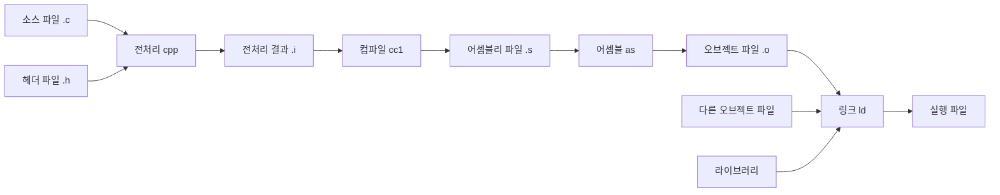
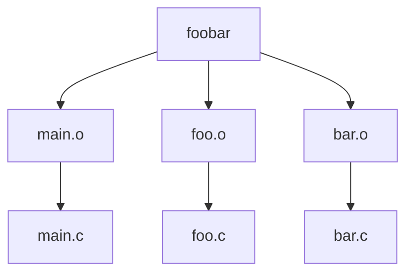

## 1. C 언어와 GCC

### 1.1 C 언어의 개요와 특징

- Dennis Ritchie가 Unix를 다시 작성하기 위해 설계한 프로그래밍 언어
- 서로 다른 기종 사이의 이식성과 유연성 제공
- 간결한 문법과 빠른 실행 속도
- 구조화 프로그래밍과 시스템 프로그래밍 지원
- 다양한 데이터 유형 제공
- 모듈과 함수를 이용한 프로그램 구성
- Unix 환경의 다양한 소프트웨어 개발에 활용
- 함수와 모듈 단위의 분리를 통한 가독성과 유지보수성 확보
- 프로그래머에게 폭넓은 구현 선택을 제공하는 언어

### 1.2 GCC

**GCC(GNU Compiler Collection)**: 여러 프로그래밍 언어를 위한 컴파일러의 모음

- C, C++, Objective-C, Fortran, Ada 등 다양한 언어 지원
- 전처리, 컴파일, 어셈블, 링크 과정을 연결하는 개발 도구
- [GCC 공식 홈페이지](https://gcc.gnu.org/)

GCC를 이용한 C 프로그램 빌드 과정의 주요 도구

| 도구 | 역할 |
| --- | --- |
| `gcc` | 전처리기, 컴파일러, 어셈블러, 링커의 실행을 제어하는 컴파일러 드라이버 |
| `g++` | C++ 프로그램 빌드를 위한 컴파일러 드라이버 |
| `cpp` | C 언어 전처리기 |
| `cc1` | 실제 C 컴파일을 수행하는 컴파일러 |
| `as` | 어셈블리 코드를 오브젝트 파일로 변환하는 어셈블러 |
| `ld` | 오브젝트 파일과 라이브러리를 연결하는 링커 |

### 1.3 실행 파일 생성 과정



| 단계 | 주요 작업 | 결과 |
| --- | --- | --- |
| 전처리 | 헤더 포함, 매크로 확장, 조건부 컴파일 처리 | 전처리된 소스 `.i` |
| 컴파일 | 전처리된 C 소스를 어셈블리 코드로 변환 | 어셈블리 파일 `.s` |
| 어셈블 | 어셈블리 코드를 기계어로 변환 | 오브젝트 파일 `.o` |
| 링크 | 오브젝트 파일과 라이브러리의 심볼을 연결 | 실행 파일 |

파일 이름과 확장자 예시

```text
hello.c  # C 언어 소스 파일
hello.h  # 함수 선언과 매크로 등을 담는 헤더 파일
hello.i  # 헤더 포함과 매크로 확장을 마친 전처리 결과 파일
hello.s  # 컴파일러가 생성한 어셈블리 코드 파일
hello.o  # 기계어를 담은 오브젝트 파일, 실행 파일을 만들기 위한 링크 필요
hello    # -o hello로 이름을 지정한 실행 파일
a.out   # -o 옵션 생략 시 기본 실행 파일 이름
```

컴파일 단계와 출력 파일 형식의 기준: [GCC 출력 제어 옵션](https://gcc.gnu.org/onlinedocs/gcc/Overall-Options.html)

## 2. GCC 사용법

### 2.1 GCC 정보 확인

```bash
gcc -v  # -v: GCC 버전과 빌드 설정 등의 정보 출력
```

- 컴파일러 버전, 빌드 설정, 대상 시스템 등의 정보 확인
- 원문 출력 예시의 환경: GCC 3.2.3, Hancom Linux
- 실제 출력 내용은 설치된 GCC 버전과 환경에 따른 차이

### 2.2 기본 컴파일과 실행

`hello.c`

```c
#include <stdio.h>  // C 개발 환경이 제공하는 표준 입출력 헤더, printf·fprintf 선언

int main(void)  // 직접 작성하는 프로그램 시작 함수, int: 종료 상태 반환, void: 매개변수 없음
{
    printf("Hello, World\n");  // stdio.h에 선언된 printf 호출, Hello, World 출력
    return 0;  // 프로그램의 정상 종료 상태 반환
}
```

컴파일과 링크를 한 번에 수행하는 명령

```bash
gcc hello.c  # hello.c(C 소스)를 컴파일하고 링크하여 기본 실행 파일 a.out 생성
./a.out  # ./: 현재 디렉터리의 실행 파일 a.out 실행
```

실행 결과

```text
Hello, World
```

- `-o` 옵션 생략 시 기본 실행 파일 이름 `a.out`
- `./a.out`: 현재 디렉터리의 실행 파일 실행

### 2.3 주요 옵션

| 옵션 | 기능 |
| --- | --- |
| `-v` | 실행한 컴파일 단계의 명령과 버전 정보 출력 |
| `-E` | 전처리 단계까지만 수행 |
| `-S` | 컴파일 단계까지만 수행하여 어셈블리 코드 생성 |
| `-c` | 오브젝트 파일 생성까지 수행하고 링크 생략 |
| `-g` | 디버깅 정보 생성 |
| `-o <file>` | 출력 파일 이름 지정 |
| `-I<dir>` | 헤더 파일 검색 디렉터리 추가 |
| `-L<dir>` | 라이브러리 검색 디렉터리 추가 |
| `-D<macro>` | 전처리 매크로 정의 |
| `-O<level>` | 최적화 수준 지정, `-O`는 `-O1`과 동일 |
| `-l<lib>` | 링크할 라이브러리 지정 |

### 2.4 출력 파일 이름 지정

```bash
gcc -o hello hello.c  # -o: 실행 파일 이름 hello 지정, hello.c 컴파일과 링크
./hello  # ./: 현재 디렉터리의 실행 파일 hello 실행
```

실행 결과

```text
Hello, World
```

### 2.5 전처리 결과 생성

```bash
gcc -E -o hello.i hello.c  # -E: 전처리만 수행, -o: 결과를 hello.i(전처리된 C 소스)에 저장
cat hello.i  # hello.i: 헤더와 매크로가 처리된 전처리 결과 파일, cat으로 내용 출력
```

- `#include`, `#define` 등 전처리 지시문의 처리
- 헤더 파일 내용과 매크로 확장 결과의 반영
- `hello.i`에 전처리 결과 저장
- 출력에 원본 파일과 행 정보를 나타내는 표시 포함 가능

### 2.6 어셈블리 코드 생성

```bash
gcc -S hello.c  # -S: 어셈블리 코드까지만 생성, 결과 파일 hello.s, 어셈블과 링크 생략
cat hello.s  # hello.s: CPU 명령을 텍스트로 표현한 어셈블리 파일, cat으로 내용 출력
```

- C 소스를 컴파일하여 `hello.s` 생성
- 어셈블과 링크 단계의 생략
- CPU 종류, 컴파일러 버전, 최적화 옵션에 따른 어셈블리 코드 차이

### 2.7 오브젝트 파일 생성과 링크

**링킹(Linking)**: 하나 이상의 오브젝트 파일과 필요한 라이브러리를 연결하여 실행 파일을 만드는 과정

**링커(Linker)**: 링킹을 수행하는 도구

**로더(Loader)**: 실행 파일을 메모리에 적재하고 실행 준비를 수행하는 구성 요소

오브젝트 파일 생성

```bash
gcc -c hello.c  # -c: 링크 생략, hello.o(기계어 오브젝트 파일) 생성
```

생성 파일

```text
hello.c  # 사람이 작성한 C 소스 파일
hello.o  # 컴파일·어셈블 결과인 기계어 오브젝트 파일, 실행 전 링크 필요
```

오브젝트 파일을 이용한 실행 파일 생성

```bash
gcc -o hello hello.o  # -o: 실행 파일 hello 지정, hello.o(기계어 오브젝트 파일)를 링크
./hello  # ./: 현재 디렉터리의 실행 파일 hello 실행
```

### 2.8 여러 소스 파일의 컴파일과 링크

헤더와 함수의 출처

- `stdio.h`: C 라이브러리 개발 환경에 포함된 표준 입출력 헤더, `printf` 등의 함수 선언 제공
- `printf`의 실제 구현: C 라이브러리 `libc`에서 제공, 일반적인 GCC 링크 과정에서 연결
- `main.c`, `sub.c`: 이 예제에서 개발자가 직접 작성하는 C 소스 파일
- `extern void sub(void);`: 다른 소스에 정의된 `sub` 함수를 사용하기 위한 선언
- `extern`: 외부 연결을 갖는 함수의 선언, `void sub(void)`: 반환값과 매개변수가 없는 함수 형식
- `sub`의 실제 구현: 아래 `sub.c`의 함수 본문, 컴파일 결과 `sub.o`를 `main.o`와 링크하는 과정에서 연결
- `#include <...>`: 표준 헤더 등의 시스템 검색 경로에서 헤더 검색
- `#include "..."`: 현재 소스 파일의 디렉터리부터 검색하는 프로젝트 헤더의 일반적인 포함 방식

`main.c`

```c
#include <stdio.h>  // C 개발 환경이 제공하는 표준 입출력 헤더, printf·fprintf 선언

extern void sub(void);  // sub.c에 정의된 외부 함수 sub의 선언, 반환값과 매개변수 없음

int main(void)  // 직접 작성하는 프로그램 시작 함수, int: 종료 상태 반환, void: 매개변수 없음
{
    printf("This is main file.\n");  // stdio.h에 선언된 printf 호출, main 파일 안내 문구 출력
    sub();  // sub.c에 정의된 sub 함수 호출, 링크 시 sub.o의 구현과 연결
    return 0;  // 프로그램의 정상 종료 상태 반환
}
```

`sub.c`

```c
#include <stdio.h>  // C 개발 환경이 제공하는 표준 입출력 헤더, printf·fprintf 선언

void sub(void)  // sub.c에 직접 작성한 sub 함수의 정의, 반환값과 매개변수 없음
{
    printf("This is sub file.\n");  // stdio.h에 선언된 printf 호출, sub 파일 안내 문구 출력
}
```

각 파일의 개별 컴파일과 오브젝트 파일의 링크

```bash
gcc -c main.c  # -c: 링크 생략, main.o(기계어 오브젝트 파일) 생성
gcc -c sub.c  # -c: 링크 생략, sub.o(기계어 오브젝트 파일) 생성
gcc -o main main.o sub.o  # -o: 실행 파일 main 지정, main.o와 sub.o를 링크
./main  # ./: 현재 디렉터리의 실행 파일 main 실행
```

실행 결과

```text
This is main file.
This is sub file.
```

### 2.9 헤더 파일 검색 경로 지정

파일 구조

```text
.
├── main.c
└── header/
    └── main.h
```

`header/main.h`

```c
#define MAIN "main.c"  // 직접 작성한 매크로 MAIN에 문자열 main.c 정의
```

`main.c`

```c
#include <stdio.h>  // C 개발 환경이 제공하는 표준 입출력 헤더, printf·fprintf 선언
#include "main.h"  // 예제에서 직접 작성한 header/main.h 포함, MAIN 매크로 정의

int main(void)  // 직접 작성하는 프로그램 시작 함수, int: 종료 상태 반환, void: 매개변수 없음
{
    printf("This is %s file.\n", MAIN);
    return 0;  // 프로그램의 정상 종료 상태 반환
}
```

컴파일과 실행

```bash
gcc -o main -I./header main.c  # -o: 실행 파일 main 지정, -I: 헤더 검색 경로에 ./header 추가
./main  # ./: 현재 디렉터리의 실행 파일 main 실행
```

실행 결과

```text
This is main.c file.
```

`-I./header`: 헤더 파일 검색 경로에 `./header` 추가

## 3. 라이브러리와 링킹

### 3.1 라이브러리

**라이브러리(Library)**: 유용한 기능을 가진 프로그램 모듈의 모음

| 라이브러리 | 주요 기능 |
| --- | --- |
| C 라이브러리 `libc` | `printf` 등 C 표준 함수 제공 |
| 수학 라이브러리 `libm` | `sin` 등 수학 함수 제공 |

대표적인 라이브러리 저장 경로: `/lib`, `/usr/lib`, `/usr/local/lib`

실제 경로는 배포판과 시스템 아키텍처에 따른 차이

### 3.2 정적 링킹과 동적 링킹

| 구분 | 정적 링킹 | 동적 링킹 |
| --- | --- | --- |
| 방식 | 필요한 라이브러리 코드를 실행 파일에 포함 | 공유 라이브러리 참조를 남기고 실행 시 로드하여 연결 |
| 실행 파일 크기 | 라이브러리 코드 포함에 따른 증가 | 정적 링킹에 비해 작은 크기 |
| 배포 | 정적으로 포함한 라이브러리의 별도 배포 불필요 | 필요한 공유 라이브러리의 설치 또는 배포 필요 |
| 라이브러리 갱신 | 변경 내용을 반영하려면 실행 파일의 재링크 필요 | 호환성을 유지하는 라이브러리 교체로 변경 반영 가능 |
| 메모리 | 각 실행 파일에 라이브러리 코드 포함 | 여러 프로세스 사이의 라이브러리 코드 공유 가능 |

정적 라이브러리 일부를 링크한 경우에도 다른 라이브러리에 대한 동적 의존성 존재 가능

### 3.3 라이브러리 종류

| 종류 | 파일 형식 | 용도 |
| --- | --- | --- |
| 정적 라이브러리 | `.a` | 정적 링킹에 사용하는 오브젝트 파일 아카이브 |
| 공유 라이브러리 | `.so` | 동적 링킹에 사용하는 공유 오브젝트 |
| 실행 중 동적 로딩용 라이브러리 | 주로 `.so` | `dlopen` 등으로 실행 도중 로드하는 공유 오브젝트 |

- 공유 라이브러리와 실행 중 동적 로딩용 라이브러리는 같은 `.so` 파일 형식 사용 가능
- 동적 로딩의 활용 예: 필요한 기능을 실행 도중 불러오는 플러그인 모듈

### 3.4 라이브러리 링크 옵션

| 옵션 | 의미 |
| --- | --- |
| `-L경로` | 링크 시 라이브러리를 검색할 경로 추가 |
| `-l이름` | `lib이름.so` 또는 `lib이름.a` 형태의 라이브러리 검색과 링크 |

예시

- `-lm`: 수학 라이브러리 `libm` 링크
- `-ltest`: `libtest.so` 또는 `libtest.a` 링크
- 라이브러리 이름 지정 시 접두어 `lib`와 확장자 생략
- 같은 검색 위치에 `.so`와 `.a`가 모두 있으면 일반적으로 공유 라이브러리 우선 선택
- 정적 라이브러리 링크 시 이를 사용하는 소스 또는 오브젝트 뒤에 `-l` 옵션 배치

라이브러리 선택과 링크 순서의 기준: [GCC 링크 옵션](https://gcc.gnu.org/onlinedocs/gcc/Link-Options.html)

### 3.5 수학 라이브러리 사용

`ex3_5.c`

```c
#include <stdio.h>  // C 개발 환경이 제공하는 표준 입출력 헤더, printf·fprintf 선언
#include <math.h>  // C 개발 환경이 제공하는 표준 수학 헤더, sin 함수 선언

#define PI 3.14159265

int main(void)  // 직접 작성하는 프로그램 시작 함수, int: 종료 상태 반환, void: 매개변수 없음
{
    printf("sin(PI/2) = %g.\n", sin(PI / 2));
    return 0;  // 프로그램의 정상 종료 상태 반환
}
```

컴파일과 실행

```bash
gcc -o ex3_5 ex3_5.c -lm  # -o: 실행 파일 ex3_5 지정, -lm: 수학 라이브러리 libm 링크
./ex3_5  # ./: 현재 디렉터리의 실행 파일 ex3_5 실행
```

실행 결과

```text
sin(PI/2) = 1.
```

> Linux에서 `sin`의 라이브러리는 `libm`, 링크 옵션은 `-lm`. 상수 계산의 최적화로 `-lm` 없이 빌드되는 예시가 있더라도 수학 라이브러리의 자동 링크를 뜻하는 결과는 아님. 기준: [Linux sin(3)](https://man7.org/linux/man-pages/man3/sin.3.html)

### 3.6 공유 라이브러리 의존성 확인

```bash
ldd ex3_5  # ex3_5가 사용하는 공유 라이브러리와 검색된 경로 확인
```

- 실행 파일이 참조하는 공유 라이브러리와 로딩 경로 확인
- 대표적인 확인 항목: `libm.so`, `libc.so`, 동적 로더
- 최적화 결과와 시스템 환경에 따른 출력 차이

## 4. 라이브러리 제작과 사용

### 4.1 정적 라이브러리와 ar

**`ar`**: 오브젝트 파일을 묶어 아카이브를 생성하고 관리하는 도구

기본 형식

```text
ar [options] archive files...
```

| 옵션 | 기능 |
| --- | --- |
| `d` | 아카이브에서 오브젝트 모듈 제거 |
| `r` | 오브젝트 모듈 삽입, 같은 이름의 기존 모듈 교체 |
| `t` | 아카이브 내용 목록 출력 |
| `x` | 아카이브에서 오브젝트 모듈 추출 |
| `c` | 새 아카이브 생성 시 생성 경고 억제 |
| `s` | 오브젝트 파일의 심볼 인덱스 기록 |

`ar rcs`: 파일 삽입과 교체, 새 아카이브 생성 시 경고 억제, 심볼 인덱스 생성을 위한 옵션 조합

옵션의 기준: [GNU ar 명령 옵션](https://sourceware.org/binutils/docs/binutils/ar-cmdline.html)

### 4.2 정적 라이브러리 제작

파일 구조

```text
.
├── main.c
└── lib/
    ├── max.c
    ├── min.c
    └── testlib.h
```

`lib/max.c`

```c
int max(int a, int b)  // lib/max.c에 직접 작성한 max 함수의 정의
{
    if (a > b)
        return a;
    else
        return b;
}
```

`lib/min.c`

```c
int min(int a, int b)  // lib/min.c에 직접 작성한 min 함수의 정의
{
    if (a < b)
        return a;
    else
        return b;
}
```

`lib/testlib.h`

```c
int max(int a, int b);  // lib/max.c에 구현된 max 함수의 선언
int min(int a, int b);  // lib/min.c에 구현된 min 함수의 선언
```

프로젝트 루트에서 실행하는 제작 명령

```bash
cd lib  # 라이브러리 소스가 있는 lib 디렉터리로 이동
gcc -c max.c  # -c: 링크 생략, max.o(기계어 오브젝트 파일) 생성
gcc -c min.c  # -c: 링크 생략, min.o(기계어 오브젝트 파일) 생성
ar rcs libtest.a max.o min.o  # r: 삽입·교체, c: 생성 경고 억제, s: 심볼 인덱스 기록, libtest.a(정적 라이브러리) 생성
cd ..  # 상위 디렉터리인 프로젝트 루트로 이동
```

생성 결과: `lib/libtest.a`

### 4.3 정적 라이브러리 사용

`main.c`

```c
#include <stdio.h>  // C 개발 환경이 제공하는 표준 입출력 헤더, printf·fprintf 선언
#include "testlib.h"  // 예제에서 직접 작성한 lib/testlib.h 포함, max·min 함수 선언

int main(void)  // 직접 작성하는 프로그램 시작 함수, int: 종료 상태 반환, void: 매개변수 없음
{
    printf("max(1,2) = %d\n", max(1, 2));  // lib/max.c의 max 함수 호출 결과를 printf로 출력
    printf("min(1,2) = %d\n", min(1, 2));  // lib/min.c의 min 함수 호출 결과를 printf로 출력
    return 0;  // 프로그램의 정상 종료 상태 반환
}
```

컴파일과 실행

```bash
gcc -I./lib -L./lib main.c -ltest  # -I: 헤더 경로, -L: 라이브러리 경로에 ./lib 추가, -ltest: libtest 링크
./a.out  # ./: 현재 디렉터리의 실행 파일 a.out 실행
```

실행 결과

```text
max(1,2) = 2
min(1,2) = 1
```

- `-I./lib`: `testlib.h` 검색 경로 추가
- `-L./lib`: `libtest.a` 검색 경로 추가
- `-ltest`: `test` 라이브러리 링크
- 위 예시의 조건: `lib` 디렉터리에 `libtest.a`만 존재하는 상태

`.so`도 존재할 때 정적 라이브러리를 명시하는 방법

```bash
gcc -I./lib main.c ./lib/libtest.a  # -I: 헤더 검색 경로에 ./lib 추가, .a: 정적 라이브러리 파일 직접 링크
```

### 4.4 공유 라이브러리 제작

같은 `max.c`, `min.c`를 이용한 공유 라이브러리 제작

```bash
cd lib  # 라이브러리 소스가 있는 lib 디렉터리로 이동
gcc -fPIC -c max.c  # -fPIC: 위치 독립 코드, -c: 링크 생략, max.o(기계어 오브젝트 파일) 생성
gcc -fPIC -c min.c  # -fPIC: 위치 독립 코드, -c: 링크 생략, min.o(기계어 오브젝트 파일) 생성
gcc -shared -fPIC -o libtest.so max.o min.o  # -shared: 공유 라이브러리 생성, -fPIC: 위치 독립 코드, -o: 파일 이름 libtest.so 지정
cd ..  # 상위 디렉터리인 프로젝트 루트로 이동
```

- `-fPIC`: 위치 독립 코드 생성
- `-shared`: 공유 라이브러리 생성
- 생성 결과: `lib/libtest.so`
- 옵션의 기준: [GCC 공유 라이브러리 생성 옵션](https://gcc.gnu.org/onlinedocs/gcc/Link-Options.html)

### 4.5 공유 라이브러리 링크와 실행

```bash
gcc -I./lib -L./lib main.c -ltest  # -I: 헤더 경로, -L: 라이브러리 경로에 ./lib 추가, -ltest: libtest 링크
./a.out  # ./: 현재 디렉터리의 실행 파일 a.out 실행
```

실행 시 라이브러리를 찾지 못한 경우의 오류 예시

```text
./a.out: error while loading shared libraries: libtest.so: cannot open shared object file: No such file or directory
```

의존성 확인

```bash
ldd ./a.out  # a.out이 사용하는 공유 라이브러리의 경로 또는 not found 확인
```

라이브러리 검색 실패 표시

```text
libtest.so => not found
```

- `-L`은 빌드 시 링커의 검색 경로 지정
- 실행 시 동적 로더의 검색 경로는 별도 설정 필요

### 4.6 LD_LIBRARY_PATH 설정

프로젝트 루트에서 공유 라이브러리 경로 추가

```bash
export LD_LIBRARY_PATH="$PWD/lib${LD_LIBRARY_PATH:+:$LD_LIBRARY_PATH}"  # 실행 시 공유 라이브러리 검색 경로에 현재 프로젝트의 lib 추가
ldd ./a.out  # a.out이 사용하는 공유 라이브러리의 경로 또는 not found 확인
./a.out  # ./: 현재 디렉터리의 실행 파일 a.out 실행
```

- `LD_LIBRARY_PATH`: 실행 시 공유 라이브러리 검색에 사용하는 환경변수
- `$PWD/lib`: 현재 프로젝트의 `lib` 디렉터리 절대 경로
- 기존 `LD_LIBRARY_PATH`가 존재하면 뒤에 이어 붙이는 설정
- 설정 후 `ldd`를 통한 `libtest.so`의 경로 확인
- `~`: 홈 디렉터리를 나타내는 기호
- 원문 예시의 `~/lib`: 라이브러리가 홈 디렉터리 아래 `lib`에 있는 경우의 경로
- 검색 경로의 기준: [Linux dlopen(3)](https://man7.org/linux/man-pages/man3/dlopen.3.html)

실행 결과

```text
max(1,2) = 2
min(1,2) = 1
```

### 4.7 실행 중 동적 로딩 인터페이스

필요한 헤더

```c
#include <dlfcn.h>  // Linux 개발 환경이 제공하는 동적 로딩 헤더, dlopen·dlsym·dlclose 선언
```

주요 함수 형식

```c
void *dlopen(const char *filename, int flags);
char *dlerror(void);
void *dlsym(void *handle, const char *symbol);
int dlclose(void *handle);
```

| 함수 | 기능 | 반환값 |
| --- | --- | --- |
| `dlopen` | 지정한 공유 라이브러리 로드 | 성공 시 핸들, 실패 시 `NULL` |
| `dlerror` | 최근 동적 로딩 오류 메시지 조회와 오류 상태 초기화 | 오류 메시지 문자열, 오류가 없으면 `NULL` |
| `dlsym` | 로드한 라이브러리에서 지정한 심볼 검색 | 심볼 주소, 오류 판정은 `dlerror`로 확인 |
| `dlclose` | 라이브러리 핸들의 참조 횟수 감소 | 성공 시 `0`, 실패 시 0이 아닌 값 |

- `RTLD_LAZY`: 함수 심볼의 해결을 실제 사용 시점까지 지연하는 옵션
- `dlsym` 호출 전 `dlerror()`로 이전 오류 상태 초기화
- `dlerror`는 메시지를 직접 출력하는 함수가 아닌 오류 문자열 조회 함수
- `dlclose`의 반환값은 포인터 `NULL`이 아닌 정수 `0`
- API 기준: [Linux dlopen(3)](https://man7.org/linux/man-pages/man3/dlopen.3.html), [Linux dlsym(3)](https://man7.org/linux/man-pages/man3/dlsym.3.html)

### 4.8 동적 로딩 예제

`ex3_6.c`

```c
#include <stdio.h>  // C 개발 환경이 제공하는 표준 입출력 헤더, printf·fprintf 선언
#include <stdlib.h>  // C 개발 환경이 제공하는 표준 유틸리티 헤더, EXIT_SUCCESS·EXIT_FAILURE 정의
#include <dlfcn.h>  // Linux 개발 환경이 제공하는 동적 로딩 헤더, dlopen·dlsym·dlclose 선언

int main(void)  // 직접 작성하는 프로그램 시작 함수, int: 종료 상태 반환, void: 매개변수 없음
{
    void *handle;
    int (*max)(int, int);
    int (*min)(int, int);
    char *error;

    handle = dlopen("./lib/libtest.so", RTLD_LAZY);  // 앞에서 제작한 lib/libtest.so 로드, max·min의 실제 구현 포함
    if (handle == NULL) {
        fprintf(stderr, "%s\n", dlerror());
        return EXIT_FAILURE;
    }

    dlerror();
    max = (int (*)(int, int))dlsym(handle, "max");  // lib/max.c에서 구현되어 libtest.so에 포함된 max 함수의 주소 조회
    error = dlerror();
    if (error != NULL) {
        fprintf(stderr, "%s\n", error);
        dlclose(handle);
        return EXIT_FAILURE;
    }

    dlerror();
    min = (int (*)(int, int))dlsym(handle, "min");  // lib/min.c에서 구현되어 libtest.so에 포함된 min 함수의 주소 조회
    error = dlerror();
    if (error != NULL) {
        fprintf(stderr, "%s\n", error);
        dlclose(handle);
        return EXIT_FAILURE;
    }

    printf("max(1,2)=%d\n", max(1, 2));
    printf("min(1,2)=%d\n", min(1, 2));

    if (dlclose(handle) != 0) {
        fprintf(stderr, "%s\n", dlerror());
        return EXIT_FAILURE;
    }

    return EXIT_SUCCESS;
}
```

프로젝트 루트에서 컴파일과 실행

```bash
gcc -o ex3_6 ex3_6.c -ldl  # -o: 실행 파일 ex3_6 지정, -ldl: 동적 로딩 라이브러리 libdl 링크
./ex3_6  # ./: 현재 디렉터리의 실행 파일 ex3_6 실행
```

실행 결과

```text
max(1,2)=2
min(1,2)=1
```

- `-ldl`: 동적 로딩 인터페이스 라이브러리 링크를 위한 옵션
- `-rdynamic`: 실행 파일의 심볼을 동적 심볼 테이블에 공개하는 옵션
- 라이브러리가 실행 파일의 심볼을 참조하는 등의 용도에 활용
- 위 예제는 라이브러리 내부의 `max`, `min`만 조회하므로 `-rdynamic` 생략 가능
- 옵션의 기준: [GCC -rdynamic](https://gcc.gnu.org/onlinedocs/gcc/Link-Options.html)

원문 명령

```bash
gcc -rdynamic ex3_6.c -ldl  # -rdynamic: 실행 파일의 심볼 공개, -ldl: 동적 로딩 라이브러리 libdl 링크
```

## 5. make와 Makefile

### 5.1 make

**make**: 파일 사이의 의존 관계를 기반으로 컴파일과 링크를 자동 수행하는 빌드 도구

- 많은 모듈로 구성된 프로그램 소스의 효율적인 유지와 관리
- 소스 파일, 헤더 파일, 오브젝트 파일, 실행 파일의 의존 관계 관리
- 수정된 파일과 그 파일에 의존하는 대상만 다시 빌드
- 반복적인 컴파일과 링크 명령의 자동화

### 5.2 Makefile

**Makefile**: 대상, 의존 파일, 실행 명령을 규칙으로 기록한 빌드 설정 파일

기본 형식

```makefile
target: prerequisites  # target: 생성할 대상, prerequisites: 대상에 필요한 의존 파일
	command  # 대상 생성용 명령, 줄 시작은 탭 문자
```

| 구성 요소 | 의미 |
| --- | --- |
| 대상 `target` | 생성하거나 갱신할 파일 또는 작업 이름 |
| 의존 파일 `prerequisites` | 대상을 생성하는 데 필요한 파일 또는 대상 |
| 명령 `command` | 대상을 생성하거나 작업을 수행할 명령 |

- 기본 Makefile 문법에서 명령 줄의 시작은 탭 문자
- 기본 실행 대상은 일반적으로 Makefile의 첫 번째 일반 대상
- 대상 파일이 없거나 의존 파일이 대상보다 새로우면 해당 규칙 실행

### 5.3 파일 의존 관계

`foobar` 실행 파일의 의존 관계



- `foobar`: `main.o`, `foo.o`, `bar.o`에 의존
- `main.o`: `main.c`에 의존
- `foo.o`: `foo.c`에 의존
- `bar.o`: `bar.c`에 의존

### 5.4 기본 Makefile 예제

```makefile
foobar: main.o foo.o bar.o
	gcc -o foobar main.o foo.o bar.o  # -o: 실행 파일 foobar 지정, 오브젝트 파일 3개를 링크

main.o: main.c
	gcc -c main.c  # -c: 링크 생략, main.o(기계어 오브젝트 파일) 생성

foo.o: foo.c
	gcc -c foo.c  # -c: 링크 생략, foo.o(기계어 오브젝트 파일) 생성

bar.o: bar.c
	gcc -c bar.c  # -c: 링크 생략, bar.o(기계어 오브젝트 파일) 생성

clean:
	rm -f foobar main.o foo.o bar.o  # -f: 없는 파일도 오류 없이 처리, 오브젝트 파일과 실행 파일 제거

.PHONY: clean
```

각 규칙의 역할

- `foobar` 규칙: 오브젝트 파일을 링크하여 실행 파일 생성
- 각 `.o` 규칙: 해당 C 소스를 컴파일하여 오브젝트 파일 생성
- `clean` 규칙: 빌드 결과물 제거
- `.PHONY: clean`: 같은 이름의 파일 존재 여부와 관계없는 정리 작업 지정

### 5.5 첫 빌드

```bash
make  # Makefile의 의존 관계에 따라 필요한 컴파일과 링크 수행
```

대상과 오브젝트 파일이 없는 상태의 실행 명령 예시

```text
gcc -c main.c  # -c: 링크 생략, main.o(기계어 오브젝트 파일) 생성
gcc -c foo.c  # -c: 링크 생략, foo.o(기계어 오브젝트 파일) 생성
gcc -c bar.c  # -c: 링크 생략, bar.o(기계어 오브젝트 파일) 생성
gcc -o foobar main.o foo.o bar.o  # -o: 실행 파일 foobar 지정, 오브젝트 파일 3개를 링크
```

원문 예제 프로그램의 실행

```bash
./foobar  # ./: 현재 디렉터리의 실행 파일 foobar 실행
```

원문 실행 결과

```text
Hello, world!
Goodbye, my love.
```

원문에 `main.c`, `foo.c`, `bar.c`의 실제 구현은 미제시

### 5.6 변경 없는 상태의 재실행

```bash
make  # Makefile의 의존 관계에 따라 필요한 컴파일과 링크 수행
```

- 대상과 의존 파일에 변경이 없으면 컴파일과 링크 생략
- 대상이 최신 상태라는 메시지 출력
- 메시지 표현은 make 버전과 언어 설정에 따른 차이

### 5.7 일부 파일 변경 후 재빌드

```bash
touch main.c  # main.c의 수정 시각 갱신, 내용 변경 없이 재빌드 유도
make  # Makefile의 의존 관계에 따라 필요한 컴파일과 링크 수행
```

실행 명령 예시

```text
gcc -c main.c  # -c: 링크 생략, main.o(기계어 오브젝트 파일) 생성
gcc -o foobar main.o foo.o bar.o  # -o: 실행 파일 foobar 지정, 오브젝트 파일 3개를 링크
```

- `touch main.c`: `main.c`의 수정 시각 갱신
- 변경된 `main.c`를 이용한 `main.o` 재생성
- `main.o`에 의존하는 `foobar` 재링크
- 변경되지 않은 `foo.o`, `bar.o`의 재사용

### 5.8 clean

```bash
make clean  # clean 규칙 실행, 오브젝트 파일과 실행 파일 제거
```

실행 명령

```text
rm -f foobar main.o foo.o bar.o  # -f: 없는 파일도 오류 없이 처리, 오브젝트 파일과 실행 파일 제거
```

- 컴파일과 링크 과정에서 생성된 오브젝트 파일과 실행 파일 제거
- 소스 파일과 Makefile 유지
- 다음 `make` 실행 시 전체 빌드 수행

### 5.9 주석과 매크로

주석 형식

```makefile
# COMMENT
```

`#`부터 줄 끝까지의 내용을 주석으로 처리

매크로 또는 변수 정의 형식

```makefile
NAME = value
```

정의 예시

```makefile
INCLUDES = /usr/local/include1 /usr/local/include2
DEBUGS = -g -O2
```

- 긴 문자열이나 반복되는 값을 하나의 이름으로 정의
- `$(NAME)` 형식으로 정의한 값 참조
- `INCLUDES`: 경로 목록을 저장한 변수 예시, 실제 GCC 검색 경로 지정에는 `-I` 옵션 필요
- `DEBUGS`: 디버깅 정보와 최적화 옵션을 저장한 변수 예시

### 5.10 매크로를 사용한 Makefile

```makefile
OBJECTS = main.o foo.o bar.o

foobar: $(OBJECTS)
	gcc -o foobar $(OBJECTS)  # -o: 실행 파일 foobar 지정, $(OBJECTS)의 오브젝트 파일들을 링크

main.o: main.c
	gcc -c main.c  # -c: 링크 생략, main.o(기계어 오브젝트 파일) 생성

foo.o: foo.c
	gcc -c foo.c  # -c: 링크 생략, foo.o(기계어 오브젝트 파일) 생성

bar.o: bar.c
	gcc -c bar.c  # -c: 링크 생략, bar.o(기계어 오브젝트 파일) 생성

clean:
	rm -f foobar $(OBJECTS)  # -f: 없는 파일도 오류 없이 처리, 오브젝트 파일과 실행 파일 제거

.PHONY: clean
```

- `OBJECTS`에 오브젝트 파일 목록 정의
- 의존 파일 목록, 링크 명령, 정리 명령에서 같은 변수 재사용
- 파일 목록 변경 시 변수 한 곳의 수정으로 관련 규칙에 반영

## 6. 실습 예제

### 6.1 실습 1: 여러 파일로 구성된 C 프로그램

헤더 1개와 C 소스 3개로 구성된 프로그램의 컴파일 실습

파일 구조

```text
.
├── example.h
├── main.c
├── search.c
└── update.c
```

`example.h`

```c
#define YEAR 2020  // 직접 작성한 매크로 YEAR에 예제 연도 2020 정의

void search(void);  // search.c에 구현된 search 함수의 선언
void update(void);  // update.c에 구현된 update 함수의 선언
```

원문의 `YEAR` 값 `2020` 유지, 함수 선언을 헤더에 추가한 구성

`search.c`

```c
#include <stdio.h>  // C 개발 환경이 제공하는 표준 입출력 헤더, printf·fprintf 선언
#include "example.h"  // 예제에서 직접 작성한 example.h 포함, YEAR와 search·update 선언

void search(void)  // search.c에 직접 작성한 search 함수의 정의
{
    printf("This is a search function\n");
}
```

`update.c`

```c
#include <stdio.h>  // C 개발 환경이 제공하는 표준 입출력 헤더, printf·fprintf 선언
#include "example.h"  // 예제에서 직접 작성한 example.h 포함, YEAR와 search·update 선언

void update(void)  // update.c에 직접 작성한 update 함수의 정의
{
    printf("This is a update function\n");
}
```

`main.c`

```c
#include <stdio.h>  // C 개발 환경이 제공하는 표준 입출력 헤더, printf·fprintf 선언
#include "example.h"  // 예제에서 직접 작성한 example.h 포함, YEAR와 search·update 선언

int main(void)  // 직접 작성하는 프로그램 시작 함수, int: 종료 상태 반환, void: 매개변수 없음
{
    int year = YEAR;  // example.h에 정의된 YEAR 값 2020을 변수 year에 저장

    printf("This year is %d\n", year);
    search();  // example.h에 선언되고 search.c에 구현된 함수 호출
    update();  // example.h에 선언되고 update.c에 구현된 함수 호출
    return 0;  // 프로그램의 정상 종료 상태 반환
}
```

### 6.2 방법 1: 한 번에 컴파일과 링크

```bash
gcc main.c search.c update.c  # C 소스 3개를 한 번에 컴파일하고 링크하여 기본 실행 파일 a.out 생성
./a.out  # ./: 현재 디렉터리의 실행 파일 a.out 실행
```

실행 결과

```text
This year is 2020
This is a search function
This is a update function
```

### 6.3 방법 2: 개별 컴파일 후 링크

```bash
gcc -c search.c  # -c: 링크 생략, search.o(기계어 오브젝트 파일) 생성
gcc -c update.c  # -c: 링크 생략, update.o(기계어 오브젝트 파일) 생성
gcc -c main.c  # -c: 링크 생략, main.o(기계어 오브젝트 파일) 생성
gcc main.o search.o update.o  # .o: 링크 전 기계어 오브젝트 파일, 3개를 링크하여 기본 실행 파일 a.out 생성
./a.out  # ./: 현재 디렉터리의 실행 파일 a.out 실행
```

- 각 소스 파일에서 개별 오브젝트 파일 생성
- 오브젝트 파일 3개를 링크하여 `a.out` 생성
- 방법 1과 동일한 실행 결과

### 6.4 방법 3: make를 이용한 자동 빌드

`Makefile`

```makefile
main: main.o search.o update.o
	gcc -o main main.o search.o update.o  # -o: 실행 파일 main 지정, 오브젝트 파일 3개를 링크

main.o: main.c example.h
	gcc -c main.c  # -c: 링크 생략, main.o(기계어 오브젝트 파일) 생성

search.o: search.c example.h
	gcc -c search.c  # -c: 링크 생략, search.o(기계어 오브젝트 파일) 생성

update.o: update.c example.h
	gcc -c update.c  # -c: 링크 생략, update.o(기계어 오브젝트 파일) 생성

clean:
	rm -f main main.o search.o update.o  # -f: 없는 파일도 오류 없이 처리, 오브젝트 파일과 실행 파일 제거

.PHONY: clean
```

함수 선언을 공유하는 `example.h`의 포함에 맞춰 각 오브젝트 규칙에 헤더 의존성 반영

빌드와 실행

```bash
make  # Makefile의 의존 관계에 따라 필요한 컴파일과 링크 수행
./main  # ./: 현재 디렉터리의 실행 파일 main 실행
```

첫 빌드 시 실행 명령

```text
gcc -c main.c  # -c: 링크 생략, main.o(기계어 오브젝트 파일) 생성
gcc -c search.c  # -c: 링크 생략, search.o(기계어 오브젝트 파일) 생성
gcc -c update.c  # -c: 링크 생략, update.o(기계어 오브젝트 파일) 생성
gcc -o main main.o search.o update.o  # -o: 실행 파일 main 지정, 오브젝트 파일 3개를 링크
```

실행 결과

```text
This year is 2020
This is a search function
This is a update function
```

### 6.5 실습 2: update.c 수정 후 재빌드

수정한 `update.c`

```c
#include <stdio.h>  // C 개발 환경이 제공하는 표준 입출력 헤더, printf·fprintf 선언
#include "example.h"  // 예제에서 직접 작성한 example.h 포함, YEAR와 search·update 선언

void update(void)  // update.c에 직접 작성한 update 함수의 정의
{
    printf("Update Function is here\n");
}
```

수정 후 빌드와 실행

```bash
make  # Makefile의 의존 관계에 따라 필요한 컴파일과 링크 수행
./main  # ./: 현재 디렉터리의 실행 파일 main 실행
```

재빌드 시 실행 명령

```text
gcc -c update.c  # -c: 링크 생략, update.o(기계어 오브젝트 파일) 생성
gcc -o main main.o search.o update.o  # -o: 실행 파일 main 지정, 오브젝트 파일 3개를 링크
```

실행 결과

```text
This year is 2020
This is a search function
Update Function is here
```

- 변경된 `update.c`만 다시 컴파일하여 `update.o` 생성
- `update.o`에 의존하는 `main` 실행 파일 재링크
- 변경되지 않은 `main.o`, `search.o` 재사용
- 반복적인 컴파일과 링크 작업을 의존 관계에 따라 자동 처리하는 make의 활용
