## 컴퓨팅 사고

#### [Week 1] 컴퓨팅 사고의 구성요소 핵심 요약

컴퓨팅 사고는 복잡한 문제를 분석하고, 해결 가능한 형태로 정리하여 효율적인 해결 방법을 만드는 사고 과정.

주요 구성요소에는 **문제 분해**, **패턴 인식**, **추상화**, **알고리즘 설계**가 있음.

---

### 1. 문제 분해

> 출처: `자료구조/Week01.md`

- **개념:** 복잡한 문제를 한 번에 해결하지 않고, 해결하기 쉬운 여러 개의 작은 문제로 나누는 과정.
- **실제 예시: 여행 계획 세우기**
  - 여행 날짜 정하기
  - 목적지 선택하기
  - 교통편 알아보기
  - 숙소 예약하기
  - 여행 경비 계산하기
  - 준비물 정리하기
- **핵심:** 큰 문제를 작은 단위로 나누면 해야 할 일을 빠뜨리지 않고 체계적으로 처리할 수 있음.

---

### 2. 패턴 인식

> 출처: `자료구조/Week01.md`

- **개념:** 여러 문제나 자료에서 반복되는 특징, 공통점 또는 일정한 규칙을 찾는 과정.
- **실제 예시: 월별 소비 내역 분석하기**
  - 매달 배달 음식과 온라인 쇼핑에 많은 돈을 반복적으로 사용한다는 사실을 발견할 수 있음.
  - 이러한 소비 패턴을 파악하면 다음 달의 소비 계획을 세우거나 불필요한 지출을 줄일 수 있음.
- **핵심:** 이전에 발견한 패턴을 활용하면 비슷한 문제를 더 빠르게 해결할 수 있음.

---

### 3. 추상화

> 출처: `자료구조/Week01.md`

- **개념:** 문제 해결에 필요한 핵심 정보만 남기고, 중요하지 않은 세부 정보는 제외하는 과정.
- **실제 예시: 학교까지 가는 경로 선택하기**
  - **필요한 정보**
    - 출발지와 목적지
    - 이동 거리
    - 예상 소요 시간
    - 교통비
    - 이용 가능한 교통수단
  - **제외할 정보**
    - 이동 중에 보이는 건물의 색상
    - 광고판의 내용
- **핵심:** 문제 해결과 직접 관련된 정보에 집중하면 더 효율적으로 판단할 수 있음.

---

### 4. 알고리즘 설계

> 출처: `자료구조/Week01.md`

- **개념:** 문제를 해결하기 위한 절차와 순서를 명확하게 만드는 과정.
- **특징:** 필요한 경우 조건과 반복 과정도 함께 설계함.
- **실제 예시: 우산이 필요한지 판단하기**
  1. 외출하기 전에 날씨 예보를 확인함.
  2. 비가 올 확률을 확인함.
  3. 비가 올 확률이 높으면 우산을 준비.
  4. 비가 올 확률이 낮으면 우산을 준비하지 않음.
  5. 외출.

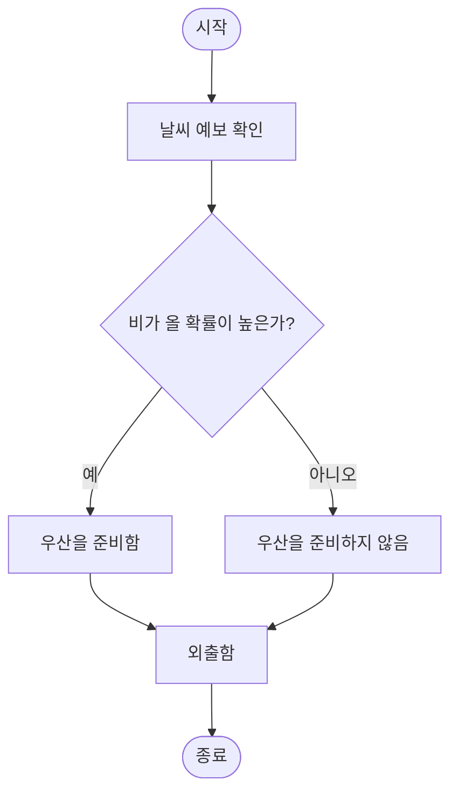


## 자료구조·알고리즘 기초와 C 구현

### 자료구조와 함께 배우는 알고리즘 - 2주차

> 출처: `자료구조/Week02.md`

#### 자료구조와 함께 배우는 알고리즘 - 2주차

### 1. 프로그램, 자료구조, 알고리즘

> 출처: `자료구조/Week02.md`

프로그램은 **자료구조**에 저장된 데이터를 **알고리즘**으로 처리하는 구조

```text
프로그램 = 자료구조 + 알고리즘
```


###### 주요 자료구조

| 구분 | 예 |
|---|---|
| 기본 자료형 | `int`, `float`, `double`, `char` |
| 데이터 묶음 | 배열, 구조체 |
| 선형 자료구조 | 스택, 큐, 연결 리스트 |
| 비선형 자료구조 | 트리, 그래프 |

---

### 2. 알고리즘의 정의와 조건

> 출처: `자료구조/Week02.md`

특정한 목표를 해결하기 위해 컴퓨터가 수행할 명령어를 순서대로 정리한 절차

###### 알고리즘의 5가지 조건

| 번호 | 조건 | 한글 뜻 | 의미 |
|---|---|---|---|
| 1 | Input | 입력 | 필요한 데이터를 0개 이상 입력 |
| 2 | Output | 출력 | 처리 결과를 1개 이상 출력 |
| 3 | Definiteness | 명확성 | 명령의 내용과 실행 순서가 명확한 상태 |
| 4 | Finiteness | 유한성 | 정해진 단계 수행 후 반드시 종료 |
| 5 | Effectiveness | 효과성·실행 가능성 | 실제 실행 가능한 연산으로 구성 |

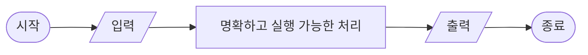

---

### 3. 알고리즘의 표현

> 출처: `자료구조/Week02.md`

| 번호 | 표현 방법 | 특징 |
|---|---|---|
| 1 | 자연어 | 일반적인 문장으로 처리 과정 표현 |
| 2 | 그래픽 | 순서도와 구조도로 실행 흐름 표현 |
| 3 | 의사코드 | 프로그래밍 언어와 비슷한 형태로 표현 |
| 4 | 프로그래밍 언어 | C, Python, Java 등 실제 코드로 표현 |

###### 보편적인 명령문

| 명령문 | 용도 | 예 |
|---|---|---|
| 대입문 | 값을 변수에 저장 | `sum = sum + data` |
| 조건문 | 조건에 따라 실행 분기 | `if (data > max)` |
| 반복문 | 조건 또는 횟수에 따라 반복 | `while`, `for` |
| 입출력문 | 데이터 입력과 결과 출력 | `scanf`, `printf` |
| 함수 호출문 | 분리된 기능 실행 | `find_max(data, n)` |

###### 조건문의 선택 구조

`Alternative`는 조건에 따라 선택할 수 있는 실행 경로를 의미

| 구조 | 한글 뜻 | 실행 방식 |
|---|---|---|
| Single Alternative | 단일 선택 | 조건이 참일 때만 문장 실행 |
| Double Alternative | 이중 선택 | 참과 거짓 중 하나의 문장 실행 |
| Multi Alternative | 다중 선택 | 여러 조건 중 처음 만족하는 문장 실행 |

```c
// Single Alternative - 단일 선택
if (score >= 60) {
    printf("Pass\n");
}

// Double Alternative - 이중 선택
if (score >= 60) {
    printf("Pass\n");
} else {
    printf("Fail\n");
}

// Multi Alternative - 다중 선택
if (score >= 90) {
    grade = 'A';
} else if (score >= 80) {
    grade = 'B';
} else if (score >= 70) {
    grade = 'C';
} else {
    grade = 'F';
}
```

###### 주요 연산자

```text
산술 연산자 : +, -, *, /, %
비교 연산자 : <, <=, >, >=, !=, ==
논리 연산자 : &&(AND), ||(OR), !(NOT)
```

알고리즘 작성 시 시작과 끝, 제어문의 범위, 문장의 끝, 들여쓰기, 주석을 명확하게 표현

---

### 4. 알고리즘 작성과 구현

> 출처: `자료구조/Week02.md`

###### 작성 단계

1. **문제 파악** - 해결해야 할 목표 확인
2. **문제 재정의** - 입력 변수와 출력 변수 결정
3. **알고리즘 구상** - 예시 데이터를 사용한 실행 과정 시뮬레이션
4. **알고리즘 검토** - 여러 테스트 케이스로 수정·보완


###### 구현 전 확인 사항

| 확인 항목 | 핵심 내용 |
|---|---|
| 일반·예외 상황 | 모든 경우가 포함되는지 확인 |
| 조건과 반복 | 조건식과 반복 횟수 확인 |
| 변수와 배열 | 자료형과 배열 크기 확인 |
| 계산 방식 | 정수 나눗셈과 형 변환 확인 |
| 사용자 입력 | 입력 전에 필요한 값 안내 |

###### 평균 계산 예

입력한 `n`개 성적의 평균을 계산하는 알고리즘

```text
START
    sum = 0
    read(n)

    for i = 0 to n - 1
        read(data)
        sum = sum + data
    endfor

    avg = sum / n
    print(avg)
END
```

```c
#include <stdio.h>

int main(void)
{
    int n, data, sum = 0;
    double avg;

    printf("데이터 개수: ");
    scanf("%d", &n);

    if (n <= 0) {
        printf("데이터 개수는 1 이상이어야 합니다.\n");
        return 1;
    }

    for (int i = 0; i < n; i++) {
        scanf("%d", &data);
        sum += data;
    }

    avg = (double)sum / n;
    printf("평균: %.2f\n", avg);

    return 0;
}
```

`(double)sum / n`을 사용해 정수 나눗셈으로 소수 부분이 사라지는 문제 방지

---

### 5. 알고리즘 설계 방법론

> 출처: `자료구조/Week02.md`

###### 1. Divide and Conquer (분할 정복)

큰 문제를 작은 문제로 나누어 해결한 후 결과를 합치는 방식

- 분할 과정: Top-down 방식
- 정복·결합 과정: Bottom-up 방식
- 대표 예: 이진 탐색, 병합 정렬, 퀵 정렬

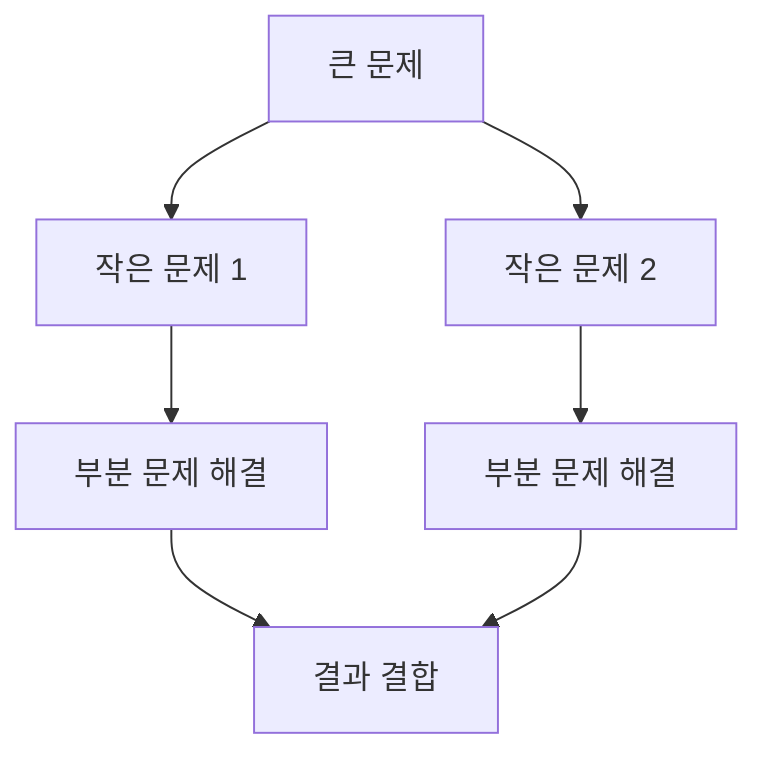

###### 2. Greedy Method (탐욕법)

현재 상황에서 가장 좋아 보이는 선택을 반복하는 방식

- 대표 예: 거스름돈 계산, 최소 신장 트리, 최단 경로 탐색
- 문제의 조건에 따라 전체 최적해를 보장하지 못할 수 있는 방식

###### 3. Backtracking (백트래킹)

해를 탐색 중 진행할 수 없으면 이전 단계로 돌아가 다른 경로를 선택하는 방식

- 재귀 호출 또는 스택의 LIFO 구조 활용
- LIFO: 마지막에 저장된 데이터가 가장 먼저 나오는 구조
- 대표 예: 미로 찾기, 스도쿠, N-Queen 문제

###### 설계 방법 비교

| 방법 | 처리 방식 | 대표 예 |
|---|---|---|
| 분할 정복 | 분할 → 해결 → 결합 | 병합 정렬 |
| 탐욕법 | 현재의 최선 선택 반복 | 거스름돈 계산 |
| 백트래킹 | 탐색 실패 시 이전 단계로 복귀 | 미로 찾기 |

---

### 6. 배열을 활용한 알고리즘

> 출처: `자료구조/Week02.md`

###### 최댓값 구하기

첫 번째 데이터를 최댓값으로 설정한 후 나머지 데이터와 비교하는 방식

```text
read(n)
read(data)
max = data

for count = 1 to n - 1
    read(data)
    if data > max
        max = data
    endif
endfor

print(max)
```

###### 자주 사용되는 처리 방식

| 문제 | 핵심 처리 |
|---|---|
| 0이 아닌 값의 곱 | `mult`를 1로 초기화한 후 `data != 0`인 값만 곱셈 |
| 모든 값이 0인 경우 | `allzero` 변수를 사용해 결과를 0으로 변경 |
| 평균 이상 데이터 수 | 첫 반복에서 평균 계산, 두 번째 반복에서 `scores[i] >= avg` 비교 `🟨 빈칸 정답` |
| 학생 성적과 등수 | 학번·성적을 2차원 배열에 저장한 후 높은 점수의 수 + 1 계산 |


---

### 7. C 함수

> 출처: `자료구조/Week02.md`

반복되는 기능을 독립적인 코드로 분리한 구조

###### 함수 구성 요소

```text
C 함수
├── 함수 원형(Function Prototype)
├── 함수 정의(Function Definition)
└── 함수 호출(Function Call)
```

```c
#include <stdio.h>

int my_pow(int x, int y);       // 함수 원형

int main(void)
{
    int result = my_pow(2, 3);  // 함수 호출
    printf("%d\n", result);
    return 0;
}

int my_pow(int x, int y)        // 함수 정의
{
    int result = 1;

    for (int i = 0; i < y; i++) {
        result *= x;
    }

    return result;
}
```

###### 매개변수 전달

| 방식 | 특징 |
|---|---|
| 일반 변수 | 값이 복사되는 Call by Value 방식 |
| 1차원 배열 | 배열 이름인 첫 번째 데이터의 주소 전달 |
| 2차원 배열 | 열의 크기를 지정해 전달: `int data[][2]` |

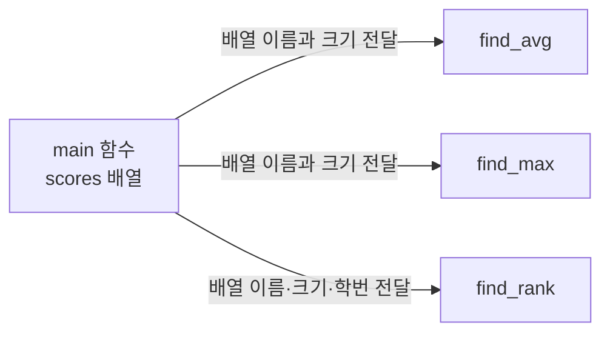

###### 학생 성적 처리 함수

`sdata[i][0]`은 학번, `sdata[i][1]`은 성적을 의미하는 구조

```c
double find_avg(int sdata[][2], int n)
{
    int sum = 0;

    for (int i = 0; i < n; i++) {
        sum += sdata[i][1];
    }

    return (double)sum / n;
}

int find_max(int sdata[][2], int n)
{
    int max = sdata[0][1];

    for (int i = 1; i < n; i++) {
        if (sdata[i][1] > max) {  // 🟨 빈칸 정답
            max = sdata[i][1];
        }
    }

    return max;
}

int find_rank(int sdata[][2], int n, int sid)
{
    int jumsu = -1;
    int rank = 0;

    for (int i = 0; i < n; i++) {
        if (sdata[i][0] == sid) {
            jumsu = sdata[i][1];  // 🟨 빈칸 정답
            break;
        }
    }

    if (jumsu == -1) {
        return -1;
    }

    for (int i = 0; i < n; i++) {
        if (sdata[i][1] > jumsu) {  // 🟨 빈칸 정답
            rank++;
        }
    }

    return rank + 1;
}
```

---

### 8. 수업자료 빈칸 정답

> 출처: `자료구조/Week02.md`

###### 곱셈 퀴즈

| 문제 | 정답 |
|---|---|
| 출제되는 곱셈 | `20×12`, `21×13`, `22×14`, `23×15`, `24×16` |
| 문제당 기회 | `2번` |
| 시도 횟수 확인 | `try` |
| 정답 여부 확인 | `ok` |

```c
if (dab == (k + 10) * (k + 2)) {  // 🟨 빈칸 정답
    printf("Correct!!\n");
}
```

두 번 모두 틀린 경우 정답 출력

```c
try++;

if (try < 2) {
    printf("Try Again!!\n");
} else {
    printf("정답: %d\n", (k + 10) * (k + 2));  // 🟨 수정 정답
}
```

###### 배열과 함수

```c
// 평균 이상인 데이터의 수
if (scores[i] >= avg) {                // 🟨 빈칸 정답
    over_count++;
}

// 배열을 함수의 매개변수로 전달
printf("곱: %ld\n", multex(data, n));  // 🟨 빈칸 정답

// 최고점 갱신
if (sdata[i][1] > max) {               // 🟨 빈칸 정답
    max = sdata[i][1];
}

// 학번에 해당하는 성적 저장
jumsu = sdata[i][1];                    // 🟨 빈칸 정답

// 자신보다 점수가 높은 학생의 수 계산
if (sdata[i][1] > jumsu) {             // 🟨 빈칸 정답
    rank++;
}
```

---

### 9. 핵심 주의 사항

> 출처: `자료구조/Week02.md`

| 상황 | 올바른 처리 |
|---|---|
| 평균 계산 | `avg = (double)sum / n` |
| 최댓값 초기화 | 임의의 0보다 첫 번째 데이터 사용 |
| 여러 값의 곱 | `mult = 1`로 초기화 |
| 반복문 | 반복 변수 증가와 종료 조건 확인 |
| 배열 입력 | 선언된 최대 크기를 넘지 않도록 확인 |
| 2차원 배열 | 행은 학생, 열은 학번·성적으로 구분 |
| macOS의 C 컴파일 | `_CRT_SECURE_NO_WARNINGS` 불필요 |

### 전체 구조

> 출처: `자료구조/Week02.md`

```text
알고리즘 기초
├── 프로그램 = 자료구조 + 알고리즘
├── 정의와 5가지 조건
├── 표현 방법과 기본 명령문
├── 작성·검토·구현 과정
├── 분할 정복·탐욕법·백트래킹
├── 배열을 활용한 데이터 처리
└── C 함수와 배열 매개변수
```

---

### 10. 구현 연습: 0이 아닌 값의 곱

> 출처: `자료구조/Week02.md`

`n`개의 정수를 입력받아 0이 아닌 값만 곱한 결과를 출력하는 알고리즘

모든 입력값이 0인 경우 결과로 0 출력

###### 입력과 출력

| 구분 | 변수 | 의미 |
|---|---|---|
| 입력 | `n` | 입력할 데이터 개수 |
| 입력 | `x` | 입력받은 정수 |
| 출력 | `mult` | 0이 아닌 값의 곱 |
| 상태 확인 | `allzero` | 모든 입력값이 0인지 확인 |
| 반복 제어 | `i` | 반복 횟수 관리 |

###### 슈도코드

```text
START
    mult = 1
    allzero = 1

    read(n)

    for i = 0 to n - 1 do
        read(x)

        if x != 0 then
            mult = mult * x
            allzero = 0
        endif
    endfor

    if allzero == 1 then
        mult = 0
    endif

    print(mult)
END
```

###### 실행 구조도

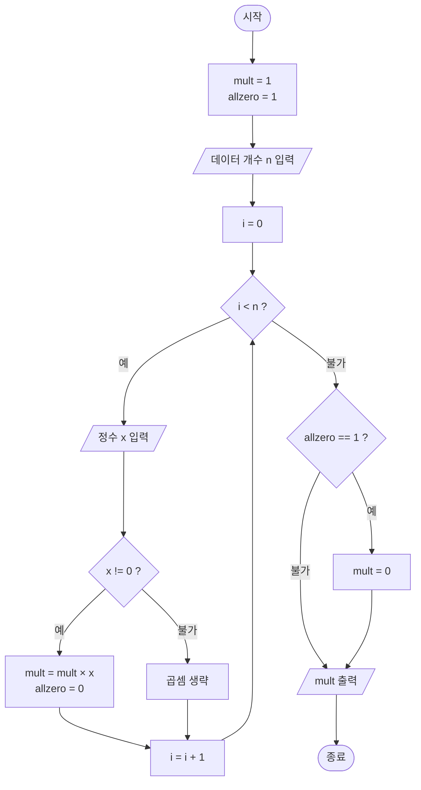

###### C 코드

```c
#include <stdio.h>

int main(void)
{
    int n, i, x;
    int allzero = 1;
    long long mult = 1;

    printf("데이터 개수: ");
    scanf("%d", &n);

    if (n <= 0) {
        printf("데이터 개수는 1 이상이어야 합니다.\n");
        return 1;
    }

    printf("%d개의 정수 입력: ", n);

    for (i = 0; i < n; i++) {
        scanf("%d", &x);

        if (x != 0) {
            mult *= x;       // 🟨 mult = mult * x
            allzero = 0;
        }
    }

    if (allzero == 1) {
        mult = 0;
    }

    printf("0이 아닌 값의 곱: %lld\n", mult);

    return 0;
}
```

###### 실행 예시

```text
데이터 개수: 7
7개의 정수 입력: 3 4 0 1 10 0 5
0이 아닌 값의 곱: 600
```

계산 과정:

```text
3 × 4 × 1 × 10 × 5 = 600
```

###### 모든 값이 0인 경우

```text
데이터 개수: 4
4개의 정수 입력: 0 0 0 0
0이 아닌 값의 곱: 0
```

###### 핵심 처리

```text
mult = 1
└── 곱셈을 위한 초기값

allzero = 1
└── 모든 값이 0이라고 가정

x != 0
├── mult에 x를 곱하기
└── allzero를 0으로 변경

allzero == 1
└── 모든 입력값이 0이므로 mult를 0으로 변경
```


## Week03 개념·실습 안내

### 컴퓨팅 알고리즘 3주차 - 개념

> 출처: `자료구조/Week03_concept.md`

#### 컴퓨팅 알고리즘 3주차 - 개념

### 전체 구조

> 출처: `자료구조/Week03_concept.md`

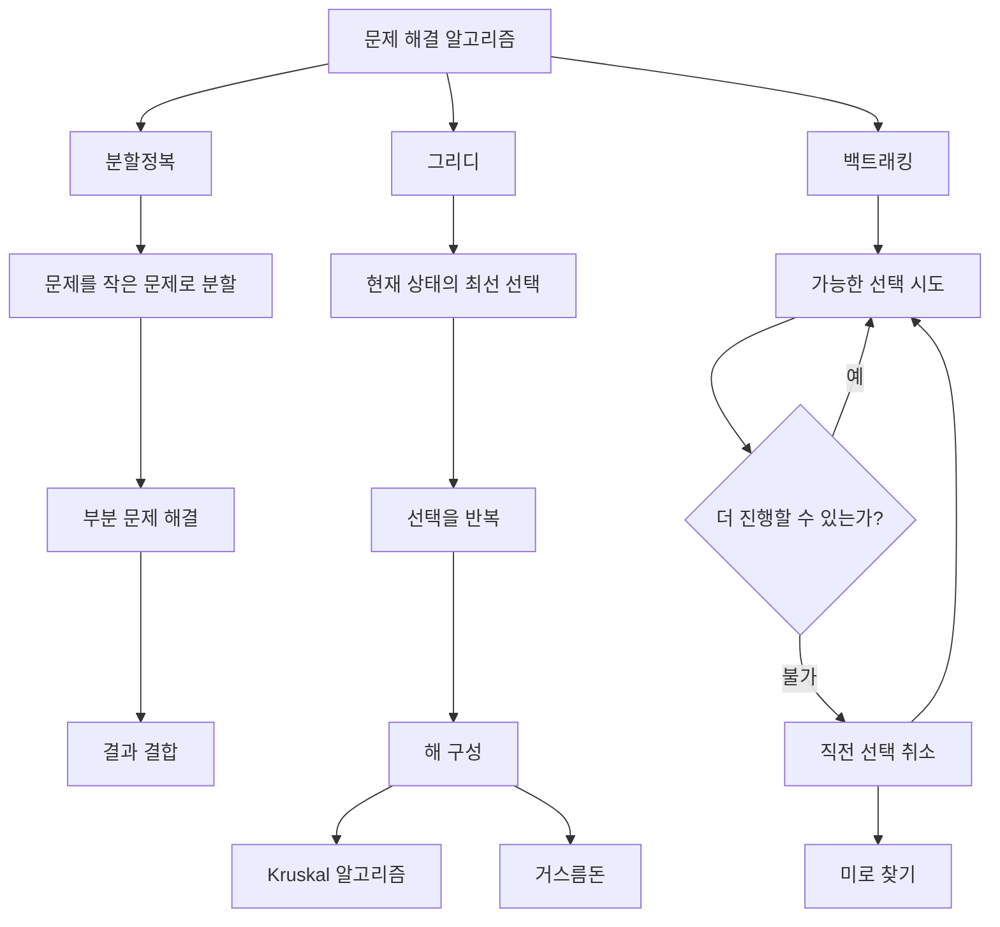

| 방법 | 핵심 생각 | 진행 방향 | 대표 예제 |
|---|---|---|---|
| 분할정복 | 큰 문제를 작은 문제로 나눔 | 분할은 하향식, 해결·결합은 상향식 | 병합 정렬, 이진 탐색 |
| 그리디 | 현재 상태에서 가장 좋은 선택을 함 | 앞에서부터 선택을 확정 | Kruskal, 거스름돈 |
| 백트래킹 | 선택을 시도하고 막히면 되돌림 | 깊이 탐색 후 이전 상태로 복귀 | 미로 찾기, N-Queen |

---

### 핵심 정리

> 출처: `자료구조/Week03_concept.md`

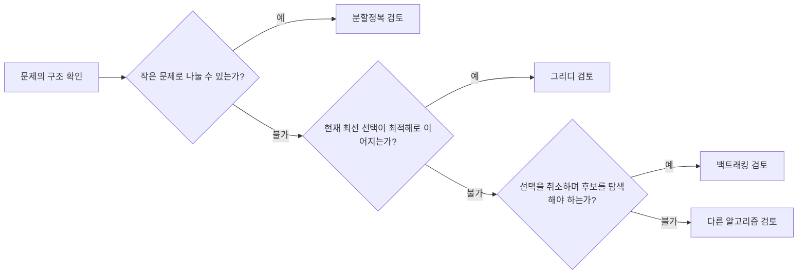

- 분할정복은 문제를 **나누고, 해결하고, 합칩니다**.
- 그리디는 현재의 선택을 **확정하며 전진합니다**.
- Kruskal은 가장 가벼운 간선을 선택하되 **사이클을 제외합니다**.
- 최소 비용 신장 트리는 모든 정점을 `n - 1`개의 간선으로 연결하고 **전체 가중치 합을 최소화합니다**.
- 백트래킹은 선택을 **시도하고, 막히면 취소합니다**.

### 컴퓨팅 알고리즘 3주차 - 문제와 코드

> 출처: `자료구조/Week03_Lab.md`

#### 컴퓨팅 알고리즘 3주차 - 문제와 코드

### 실행 방법

> 출처: `자료구조/Week03_Lab.md`

C 코드는 원하는 코드 블록을 `.c` 파일로 저장한 뒤 다음과 같이 실행함.

```bash
cc -std=c11 -Wall -Wextra 파일이름.c -o 실행파일
./실행파일
```

Python 코드는 `.py` 파일로 저장한 뒤 실행함.

```bash
python3 파일이름.py
```


## 분할정복

### 1. 분할정복(Divide and Conquer)

> 출처: `자료구조/Week03_concept.md`

분할정복은 큰 문제를 한 번에 해결하지 않고, 해결 가능한 크기의 부분 문제로 나누어 처리하는 방법.

###### 처리 구조

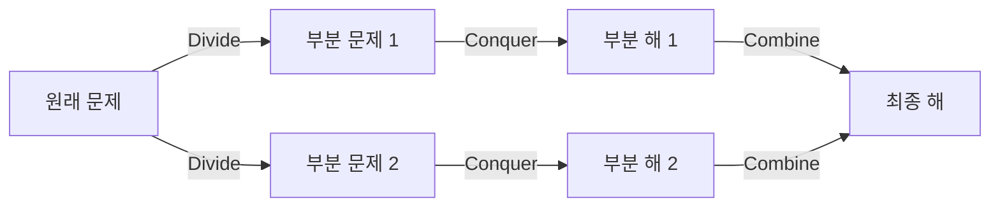

1. **분할(Divide)**: 문제를 더 작은 부분 문제로 나눔.
2. **정복(Conquer)**: 각 부분 문제를 해결함.
3. **결합(Combine)**: 부분 문제의 결과를 합쳐 원래 문제의 답을 생성함.

분할 과정은 큰 문제에서 작은 문제로 내려가는 하향식(top-down)이고, 결과를 결합하는 과정은 작은 문제에서 큰 문제로 올라가는 상향식(bottom-up)임. 같은 구조가 반복되므로 재귀 함수와 함께 자주 사용.

###### 일반 형태

```text
solve(problem):
    if problem이 바로 해결 가능한 크기라면
        return 직접 계산한 답

    subproblems = problem을 작은 문제들로 분할
    answers = 각 subproblem을 solve로 해결
    return answers를 결합한 결과
```

###### 핵심 확인 사항

- 부분 문제의 크기가 원래 문제보다 작아야 함.
- 재귀가 끝나는 종료 조건이 반드시 있어야 함.
- 부분 문제의 결과를 최종 답으로 결합하는 방법이 정의되어야 함.

---


## 함수 기반 문제 분해

### 2. 함수로 문제 분해하기

> 출처: `자료구조/Week03_concept.md`

학생 성적 문제는 기능별로 함수를 분리해 해결할 수 있음.

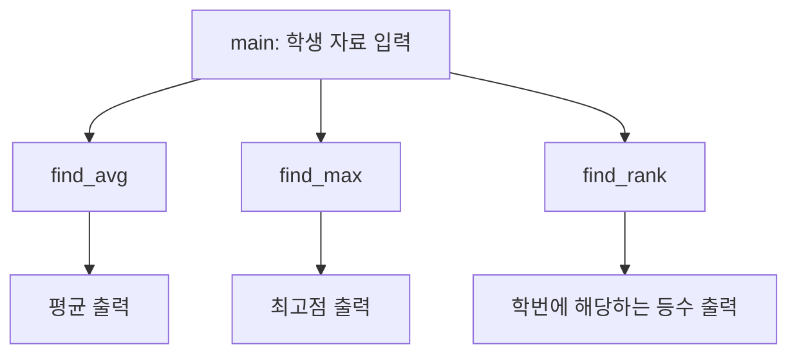

| 함수 | 입력 | 처리 | 반환값 |
|---|---|---|---|
| `find_avg` | 학생 자료, 학생 수 | 모든 점수의 합을 학생 수로 나눔 | 평균 |
| `find_max` | 학생 자료, 학생 수 | 현재 최댓값보다 큰 점수를 찾아 갱신 | 최고점 |
| `find_rank` | 학생 자료, 학생 수, 학번 | 대상보다 점수가 높은 학생 수를 계산 | 등수 |

등수는 다음 식으로 계산할 수 있음.

```text
등수 = 대상 학생보다 점수가 높은 학생 수 + 1
```

이 방식에서는 같은 점수를 받은 학생이 같은 등수.

---

### 1. 학생 성적 함수 구현

> 출처: `자료구조/Week03_Lab.md`

###### C

```c
/*
문제
----
n명 학생의 학번과 0-100점 사이의 성적을 2차원 배열에 입력받음.

1. 성적 평균을 구하는 find_avg 함수를 작성함.
2. 최고점을 구하는 find_max 함수를 작성함.
3. 학번으로 학생을 찾아 등수를 구하는 find_rank 함수를 작성함.
4. main 함수에서는 자료를 입력하고 각 함수를 호출해 결과를 출력함.

등수 규칙
---------
대상 학생보다 점수가 높은 학생 수 + 1을 등수로 사용함.
따라서 같은 점수의 학생은 같은 등수를 가짐.

입력 예
-------
10
717 88
625 92
810 80
707 75
530 98
424 70
877 65
701 85
628 70
505 78
530

출력 예
-------
평균: 80.10
최고점: 98
학번 530의 등수: 1등
*/

#include <stdio.h>

#define MAX_STUDENTS 100

double find_avg(const int scores[][2], int n) {
    int sum = 0;

    for (int i = 0; i < n; i++) {
        sum += scores[i][1];
    }

    return (double)sum / n;
}

int find_max(const int scores[][2], int n) {
    int max_score = scores[0][1];

    for (int i = 1; i < n; i++) {
        if (scores[i][1] > max_score) {
            max_score = scores[i][1];
        }
    }

    return max_score;
}

int find_rank(const int scores[][2], int n, int student_id) {
    int target_score = -1;

    for (int i = 0; i < n; i++) {
        if (scores[i][0] == student_id) {
            target_score = scores[i][1];
            break;
        }
    }

    if (target_score < 0) {
        return -1;
    }

    int rank = 1;
    for (int i = 0; i < n; i++) {
        if (scores[i][1] > target_score) {
            rank++;
        }
    }

    return rank;
}

int main(void) {
    int scores[MAX_STUDENTS][2];
    int n;

    printf("학생 수: ");
    if (scanf("%d", &n) != 1 || n <= 0 || n > MAX_STUDENTS) {
        fprintf(stderr, "학생 수는 1-%d 사이여야 합니다.\n", MAX_STUDENTS);
        return 1;
    }

    printf("학번과 성적을 입력하세요.\n");
    for (int i = 0; i < n; i++) {
        if (scanf("%d %d", &scores[i][0], &scores[i][1]) != 2 ||
            scores[i][1] < 0 || scores[i][1] > 100) {
            fprintf(stderr, "학번과 0-100 사이의 성적을 입력하세요.\n");
            return 1;
        }
    }

    printf("평균: %.2f\n", find_avg(scores, n));
    printf("최고점: %d\n", find_max(scores, n));

    int student_id;
    printf("조회할 학번: ");
    if (scanf("%d", &student_id) != 1) {
        fprintf(stderr, "올바른 학번을 입력하세요.\n");
        return 1;
    }

    int rank = find_rank(scores, n, student_id);
    if (rank < 0) {
        printf("학번 %d을(를) 찾을 수 없습니다.\n", student_id);
    } else {
        printf("학번 %d의 등수: %d등\n", student_id, rank);
    }

    return 0;
}
```

###### Python

```python
"""
문제
----
n명 학생의 학번과 0-100점 사이의 성적을 입력받음.

1. 성적 평균을 구하는 find_avg 함수를 작성함.
2. 최고점을 구하는 find_max 함수를 작성함.
3. 학번으로 학생을 찾아 등수를 구하는 find_rank 함수를 작성함.
4. 각 함수를 호출해 결과를 출력함.

등수 규칙
---------
대상 학생보다 점수가 높은 학생 수 + 1을 등수로 사용함.
따라서 같은 점수의 학생은 같은 등수를 가짐.
"""


def find_avg(scores):
    return sum(score for _, score in scores) / len(scores)


def find_max(scores):
    return max(score for _, score in scores)


def find_rank(scores, student_id):
    target_score = None

    for current_id, score in scores:
        if current_id == student_id:
            target_score = score
            break

    if target_score is None:
        return None

    return 1 + sum(score > target_score for _, score in scores)


def main():
    try:
        student_count = int(input("학생 수: "))
    except ValueError:
        print("학생 수는 정수로 입력.")
        return

    if not 1 <= student_count <= 100:
        print("학생 수는 1-100 사이여야 함.")
        return

    scores = []
    print("학번과 성적을 입력.")

    for _ in range(student_count):
        try:
            student_id, score = map(int, input().split())
        except ValueError:
            print("학번과 성적을 정수로 입력.")
            return

        if not 0 <= score <= 100:
            print("성적은 0-100 사이여야 함.")
            return

        scores.append((student_id, score))

    print(f"평균: {find_avg(scores):.2f}")
    print(f"최고점: {find_max(scores)}")

    try:
        student_id = int(input("조회할 학번: "))
    except ValueError:
        print("학번은 정수로 입력.")
        return

    rank = find_rank(scores, student_id)
    if rank is None:
        print(f"학번 {student_id}을(를) 찾을 수 없음.")
    else:
        print(f"학번 {student_id}의 등수: {rank}등")


if __name__ == "__main__":
    main()
```

---


## 그리디 알고리즘

### 3. 그리디(Greedy) 알고리즘

> 출처: `자료구조/Week03_concept.md`

그리디 알고리즘은 목표에 가까워지도록 현재 상태에서 가장 좋아 보이는 선택을 반복함.

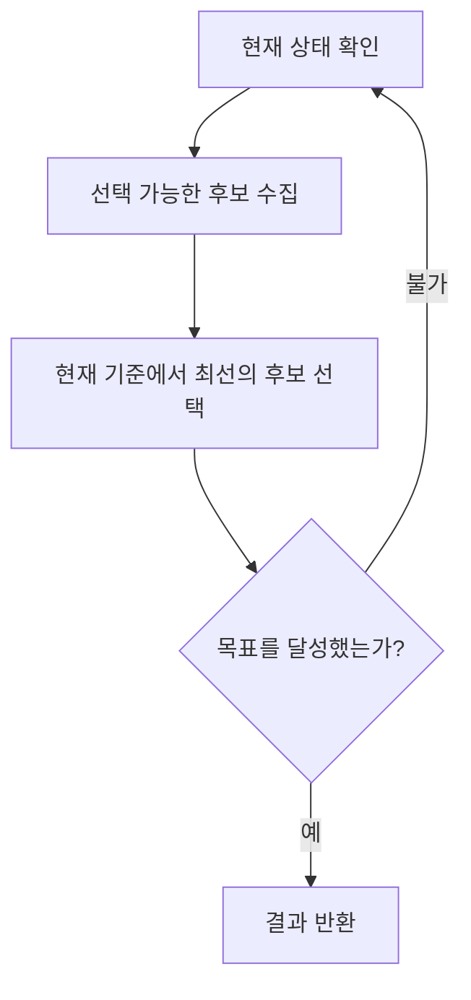

그리디 알고리즘의 선택은 일반적으로 나중에 취소하지 않음. 따라서 현재의 최선 선택이 전체 문제의 최적해로 이어진다는 성질이 있는 문제에서 사용해야 함.

###### 확인해야 할 성질

- **그리디 선택 속성**: 현재의 최선 선택을 포함하는 최적해가 존재해야 함.
- **최적 부분 구조**: 전체 문제의 최적해가 부분 문제의 최적해로 구성되어야 함.

---

### 6. 그리디 거스름돈

> 출처: `자료구조/Week03_concept.md`

500원, 100원, 50원, 10원 동전으로 거스름돈을 줄 때는 남은 금액을 넘지 않는 가장 큰 동전을 반복해서 선택함.

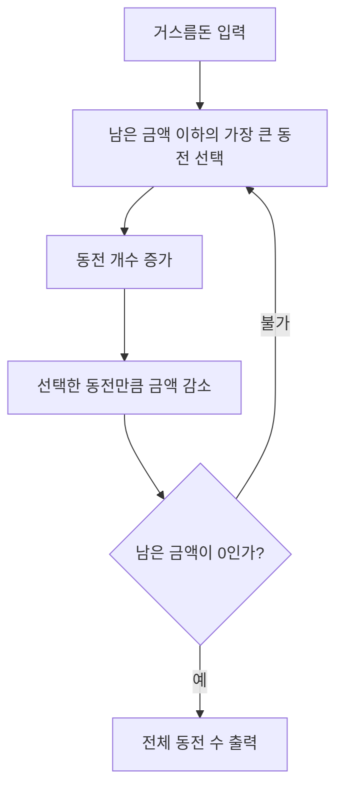

860원의 선택 과정:

```text
860 - 500 = 360
360 - 100 - 100 - 100 = 60
60 - 50 = 10
10 - 10 = 0
```

| 동전 | 개수 |
|---:|---:|
| 500원 | 1개 |
| 100원 | 3개 |
| 50원 | 1개 |
| 10원 | 1개 |
| **합계** | **6개** |

이 동전 체계에서는 그리디 방식으로 최소 동전 수를 구할 수 있음. 하지만 임의의 동전 체계에서 항상 최적해가 나오는 것은 아님. 예를 들어 동전이 1원, 3원, 4원이고 금액이 6원이면 그리디 결과는 `4 + 1 + 1`이지만 최적해는 `3 + 3`임.

---

### 3. 그리디 거스름돈

> 출처: `자료구조/Week03_Lab.md`

###### C

```c
/*
문제
----
500원, 100원, 50원, 10원 동전이 있음.
거스름돈을 입력받아 필요한 동전의 최소 개수를 출력함.

해결 방법
---------
남은 금액을 넘지 않는 가장 큰 동전을 먼저 선택함.

입력 예
-------
860

출력 예
-------
500원 동전: 1개
100원 동전: 3개
50원 동전: 1개
10원 동전: 1개
전체 동전 수: 6개
*/

#include <stdio.h>

int how_many(int change) {
    const int coins[] = {500, 100, 50, 10};
    const int coin_type_count = (int)(sizeof(coins) / sizeof(coins[0]));
    int total_count = 0;

    for (int i = 0; i < coin_type_count; i++) {
        int quantity = change / coins[i];
        change %= coins[i];
        total_count += quantity;
        printf("%d원 동전: %d개\n", coins[i], quantity);
    }

    if (change != 0) {
        printf("주어진 동전으로 거슬러 줄 수 없는 금액: %d원\n", change);
    }

    return total_count;
}

int main(void) {
    int change;

    printf("거스름돈: ");
    if (scanf("%d", &change) != 1 || change < 0) {
        fprintf(stderr, "0 이상의 금액을 입력하세요.\n");
        return 1;
    }

    printf("전체 동전 수: %d개\n", how_many(change));
    return 0;
}
```

###### Python

```python
"""
문제
----
500원, 100원, 50원, 10원 동전이 있음.
거스름돈을 입력받아 필요한 동전의 최소 개수를 출력함.

해결 방법
---------
남은 금액을 넘지 않는 가장 큰 동전을 먼저 선택함.

입력 예: 860
결과: 500원 1개, 100원 3개, 50원 1개, 10원 1개
전체 동전 수: 6개
"""

COINS = (500, 100, 50, 10)


def count_coins(change):
    result = {}

    for coin in COINS:
        quantity, change = divmod(change, coin)
        result[coin] = quantity

    return result, change


def main():
    try:
        change = int(input("거스름돈: "))
    except ValueError:
        print("금액은 정수로 입력.")
        return

    if change < 0:
        print("0 이상의 금액을 입력.")
        return

    result, remainder = count_coins(change)
    for coin, quantity in result.items():
        print(f"{coin}원 동전: {quantity}개")

    if remainder:
        print(f"주어진 동전으로 거슬러 줄 수 없는 금액: {remainder}원")

    print(f"전체 동전 수: {sum(result.values())}개")


if __name__ == "__main__":
    main()
```

---


## 그래프·최소 신장 트리·Kruskal

### 4. 신장 트리와 최소 비용 신장 트리

> 출처: `자료구조/Week03_concept.md`

###### 4.1 기본 용어

- **그래프(Graph)**: 정점과 정점을 연결하는 간선으로 구성된 구조
- **가중치(Weight)**: 거리나 비용처럼 간선에 부여된 값
- **경로(Path)**: 간선을 따라 정점을 이동하는 순서
- **사이클(Cycle)**: 출발한 정점으로 다시 돌아오는 경로
- **연결 그래프(Connected Graph)**: 모든 정점 사이에 경로가 존재하는 그래프

###### 4.2 신장 트리(Spanning Tree)

신장 트리는 연결 그래프의 모든 정점을 포함하면서 사이클이 없는 부분 그래프.

정점이 `n`개인 신장 트리의 특징:

- 모든 정점을 연결함.
- 사이클이 없음.
- 간선의 수는 정확히 `n - 1`개.
- 간선 하나를 제거하면 그래프가 끊어짐.
- 새로운 간선 하나를 추가하면 사이클이 생김.


###### 4.3 최소 비용 신장 트리(Minimum Spanning Tree, MST)

하나의 그래프에는 여러 신장 트리가 존재할 수 있음. 이 가운데 선택한 간선의 가중치 합이 가장 작은 신장 트리를 최소 비용 신장 트리라고 함.

최소 비용 신장 트리는 다음과 같은 문제에 활용.

- 여러 도시를 최소 도로 비용으로 연결하기
- 컴퓨터나 기지국을 최소 케이블 길이로 연결하기
- 전력망·통신망의 최소 설치 비용 구하기

---

### 5. Kruskal 알고리즘

> 출처: `자료구조/Week03_concept.md`

Kruskal 알고리즘은 간선을 가중치 오름차순으로 확인하면서 사이클을 만들지 않는 간선만 선택하는 그리디 알고리즘.

###### 알고리즘 구조

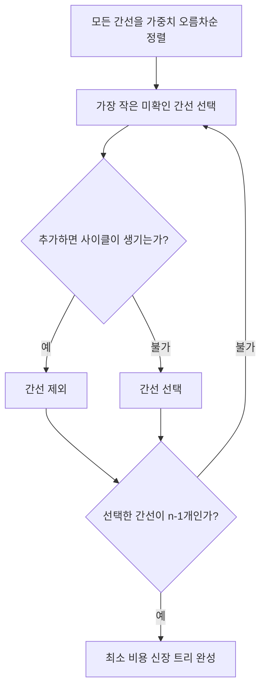

사이클 여부는 서로소 집합(Disjoint Set 또는 Union-Find) 자료구조로 효율적으로 확인할 수 있음.

- `find(x)`: 정점 `x`가 속한 집합의 대표 정점을 찾음.
- `union(a, b)`: 서로 다른 두 집합을 하나로 합침.
- 두 정점의 대표가 같으면 이미 연결되어 있으므로, 그 사이의 간선을 추가하면 사이클이 생김.

###### 강의 예제 그래프

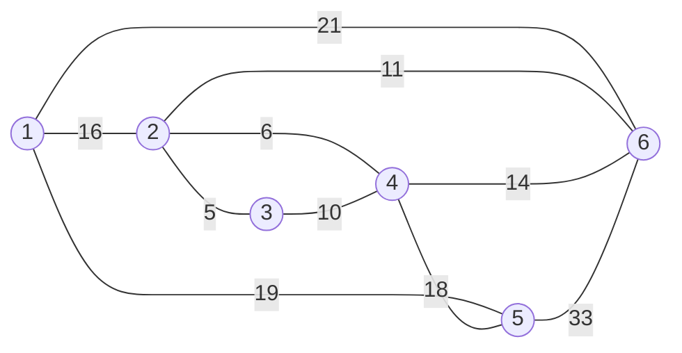

간선을 오름차순으로 검사하면 다음과 같이 처리.

| 검사 순서 | 간선 | 가중치 | 처리 | 이유 |
|---:|---|---:|---|---|
| 1 | 2-3 | 5 | 선택 | 사이클 없음 |
| 2 | 2-4 | 6 | 선택 | 사이클 없음 |
| 3 | 3-4 | 10 | 제외 | 2-3-4 사이클 발생 |
| 4 | 2-6 | 11 | 선택 | 사이클 없음 |
| 5 | 4-6 | 14 | 제외 | 2-4-6 사이클 발생 |
| 6 | 1-2 | 16 | 선택 | 사이클 없음 |
| 7 | 4-5 | 18 | 선택 | 모든 정점 연결 |

###### 완성된 최소 비용 신장 트리

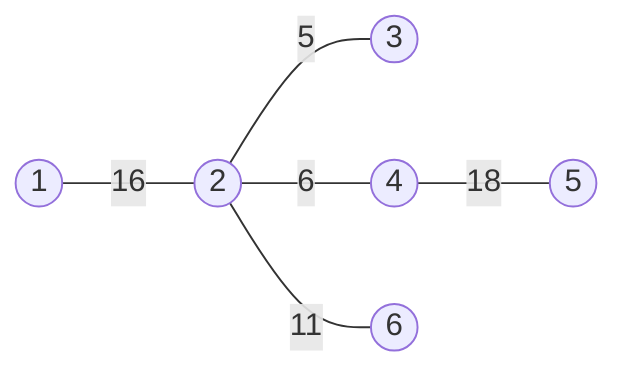

```text
총비용 = 5 + 6 + 11 + 16 + 18 = 56
```

정점은 6개이고 선택된 간선은 `6 - 1 = 5`개이므로 신장 트리의 조건을 만족함.

---

### 2. Kruskal 최소 비용 신장 트리

> 출처: `자료구조/Week03_Lab.md`

###### C

```c
/*
문제
----
정점 1-6과 다음 가중치 간선으로 이루어진 무방향 그래프가 있음.

(1,2,16), (1,6,21), (1,5,19), (2,6,11), (2,3,5),
(2,4,6), (3,4,10), (4,6,14), (4,5,18), (5,6,33)

Kruskal 알고리즘을 이용해 최소 비용 신장 트리를 구함.

조건
----
1. 간선을 가중치 오름차순으로 정렬함.
2. 사이클을 만들지 않는 간선만 선택함.
3. 정점 수가 n일 때 간선 n-1개를 선택하면 종료함.
4. 사이클 판별에는 Union-Find를 사용함.

기대 결과
---------
선택 가중치: 5, 6, 11, 16, 18
총비용: 56
*/

#include <stdio.h>
#include <stdlib.h>

#define VERTEX_COUNT 6

typedef struct {
    int from;
    int to;
    int weight;
} Edge;

static int parent[VERTEX_COUNT + 1];
static int tree_rank[VERTEX_COUNT + 1];

int find_root(int vertex) {
    if (parent[vertex] != vertex) {
        parent[vertex] = find_root(parent[vertex]);
    }
    return parent[vertex];
}

void union_sets(int a, int b) {
    a = find_root(a);
    b = find_root(b);

    if (a == b) {
        return;
    }

    if (tree_rank[a] < tree_rank[b]) {
        parent[a] = b;
    } else if (tree_rank[a] > tree_rank[b]) {
        parent[b] = a;
    } else {
        parent[b] = a;
        tree_rank[a]++;
    }
}

int compare_edges(const void *left, const void *right) {
    const Edge *a = left;
    const Edge *b = right;
    return (a->weight > b->weight) - (a->weight < b->weight);
}

int main(void) {
    Edge edges[] = {
        {1, 2, 16}, {1, 6, 21}, {1, 5, 19}, {2, 6, 11}, {2, 3, 5},
        {2, 4, 6},  {3, 4, 10}, {4, 6, 14}, {4, 5, 18}, {5, 6, 33}
    };
    const int edge_count = (int)(sizeof(edges) / sizeof(edges[0]));

    for (int vertex = 1; vertex <= VERTEX_COUNT; vertex++) {
        parent[vertex] = vertex;
        tree_rank[vertex] = 0;
    }

    qsort(edges, edge_count, sizeof(Edge), compare_edges);

    int selected_count = 0;
    int total_cost = 0;

    puts("선택된 간선:");

    for (int i = 0;
         i < edge_count && selected_count < VERTEX_COUNT - 1;
         i++) {
        Edge edge = edges[i];

        if (find_root(edge.from) == find_root(edge.to)) {
            printf("제외: %d - %d (가중치 %d, 사이클 발생)\n",
                   edge.from, edge.to, edge.weight);
            continue;
        }

        union_sets(edge.from, edge.to);
        selected_count++;
        total_cost += edge.weight;
        printf("선택: %d - %d (가중치 %d)\n",
               edge.from, edge.to, edge.weight);
    }

    if (selected_count != VERTEX_COUNT - 1) {
        fprintf(stderr, "모든 정점을 연결할 수 없습니다.\n");
        return 1;
    }

    printf("총비용: %d\n", total_cost);
    return 0;
}
```

###### Python

```python
"""
문제
----
정점 1-6과 다음 가중치 간선으로 이루어진 무방향 그래프가 있음.

(1,2,16), (1,6,21), (1,5,19), (2,6,11), (2,3,5),
(2,4,6), (3,4,10), (4,6,14), (4,5,18), (5,6,33)

Kruskal 알고리즘으로 최소 비용 신장 트리를 구함.
간선을 가중치 오름차순으로 확인하고 사이클이 생기지 않는 간선만 선택함.
사이클 판별에는 Union-Find를 사용함.

기대 결과
---------
선택 가중치: 5, 6, 11, 16, 18
총비용: 56
"""

VERTEX_COUNT = 6
EDGES = [
    (1, 2, 16),
    (1, 6, 21),
    (1, 5, 19),
    (2, 6, 11),
    (2, 3, 5),
    (2, 4, 6),
    (3, 4, 10),
    (4, 6, 14),
    (4, 5, 18),
    (5, 6, 33),
]


def find_root(parent, vertex):
    if parent[vertex] != vertex:
        parent[vertex] = find_root(parent, parent[vertex])
    return parent[vertex]


def union_sets(parent, tree_rank, a, b):
    root_a = find_root(parent, a)
    root_b = find_root(parent, b)

    if root_a == root_b:
        return

    if tree_rank[root_a] < tree_rank[root_b]:
        parent[root_a] = root_b
    elif tree_rank[root_a] > tree_rank[root_b]:
        parent[root_b] = root_a
    else:
        parent[root_b] = root_a
        tree_rank[root_a] += 1


def kruskal(vertex_count, edges):
    parent = list(range(vertex_count + 1))
    tree_rank = [0] * (vertex_count + 1)
    selected_edges = []
    total_cost = 0

    for start, end, weight in sorted(edges, key=lambda edge: edge[2]):
        if find_root(parent, start) == find_root(parent, end):
            print(f"제외: {start} - {end} (가중치 {weight}, 사이클 발생)")
            continue

        union_sets(parent, tree_rank, start, end)
        selected_edges.append((start, end, weight))
        total_cost += weight
        print(f"선택: {start} - {end} (가중치 {weight})")

        if len(selected_edges) == vertex_count - 1:
            break

    return selected_edges, total_cost


if __name__ == "__main__":
    mst, cost = kruskal(VERTEX_COUNT, EDGES)

    if len(mst) != VERTEX_COUNT - 1:
        print("모든 정점을 연결할 수 없음.")
    else:
        print(f"총비용: {cost}")
```

---


## 백트래킹과 미로 탐색

### 7. 백트래킹(Backtracking)

> 출처: `자료구조/Week03_concept.md`

백트래킹은 가능한 선택을 하나씩 시도하다가 더 진행할 수 없으면 직전 선택을 취소하고 이전 상태로 돌아가 다른 선택을 탐색하는 방법.

> 가 보고, 막히면 되돌아옴.

###### 알고리즘 구조

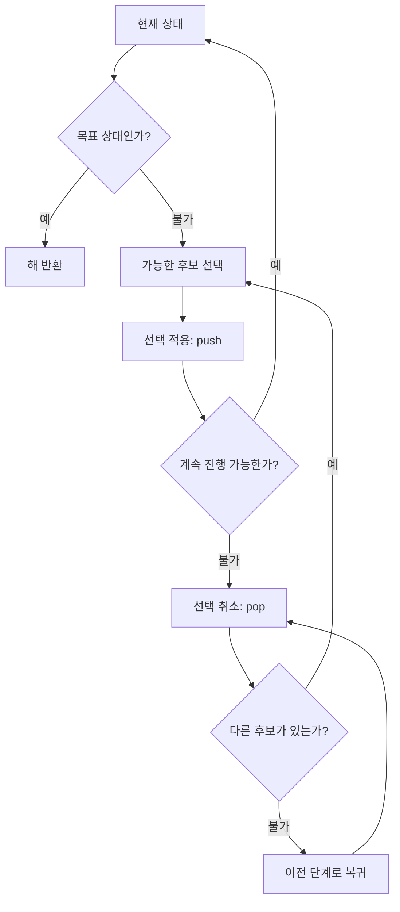

###### 스택과 백트래킹

```mermaid
flowchart LR
    A[새 위치 선택] -->|push| B[스택 위에 위치 저장]
    B --> C{막다른 길인가?}
    C -- 불가 --> A
    C -- 예 -->|pop| D[직전 위치 제거]
    D --> E[이전 위치에서 다른 방향 탐색]
    E --> A
```

- `push`: 새 선택 또는 이동 위치를 스택 위에 저장함.
- `pop`: 가장 최근 선택을 스택에서 제거하고 취소함.
- LIFO: 가장 나중에 저장한 선택을 가장 먼저 되돌림.

###### 미로 예제

```text
S . # .
. # . .
. # . #
. . . G
```

- `.`: 이동 가능한 길
- `#`: 벽
- `S`: 시작점 `(0, 0)`
- `G`: 도착점 `(3, 3)`
- 탐색 순서: 오른쪽 → 아래 → 왼쪽 → 위

처음 `(0, 0)`에서 오른쪽 `(0, 1)`로 이동하면 막다른 길. `(0, 1)`을 스택에서 꺼내고 `(0, 0)`으로 돌아간 뒤 아래쪽을 탐색함.

```mermaid
flowchart LR
    A[시작 0,0] -->|push| B[0,1]
    B -->|막다른 길: pop| A
    A -->|push| C[1,0]
    C --> D[2,0]
    D --> E[3,0]
    E --> F[3,1]
    F --> G[3,2]
    G --> H[도착 3,3]
```

최종 경로:

```text
(0,0) → (1,0) → (2,0) → (3,0) → (3,1) → (3,2) → (3,3)
```

백트래킹은 미로 찾기 외에도 N-Queen, 스도쿠, 일정 조합 탐색처럼 여러 후보 중 조건을 만족하는 해를 찾는 문제에 사용할 수 있음.

---

### 4. 스택을 이용한 미로 찾기

> 출처: `자료구조/Week03_Lab.md`

###### Python

```python
"""
문제
----
다음 4×4 미로에서 시작점 (0, 0)부터 도착점 (3, 3)까지의 경로를 찾음.

0 0 1 0
0 1 0 0
0 1 0 1
0 0 0 0

0은 이동 가능한 길이고 1은 벽.
이동 방향은 오른쪽, 아래, 왼쪽, 위 순서로 확인함.

조건
----
1. 이동할 때 현재 경로를 스택에 push함.
2. 막다른 길을 만나면 스택에서 pop하여 이전 위치로 돌아감.
3. 이미 방문한 칸은 다시 방문하지 않음.
4. push와 pop 과정을 단계별로 출력함.

기대 경로
---------
(0,0) -> (1,0) -> (2,0) -> (3,0) -> (3,1) -> (3,2) -> (3,3)
"""

MAZE = [
    [0, 0, 1, 0],
    [0, 1, 0, 0],
    [0, 1, 0, 1],
    [0, 0, 0, 0],
]

DIRECTIONS = [
    (0, 1, "오른쪽"),
    (1, 0, "아래"),
    (0, -1, "왼쪽"),
    (-1, 0, "위"),
]


def find_path(maze):
    size = len(maze)
    start = (0, 0)
    goal = (size - 1, size - 1)
    visited = [[False] * size for _ in range(size)]

    # 스택 원소: (행, 열, 다음에 확인할 방향 번호)
    stack = [(start[0], start[1], 0)]
    visited[start[0]][start[1]] = True
    print(f"push {start}: 탐색 시작")

    while stack:
        row, col, next_direction = stack[-1]

        if (row, col) == goal:
            return [(r, c) for r, c, _ in stack]

        if next_direction >= len(DIRECTIONS):
            popped = stack.pop()
            print(f"pop  {(popped[0], popped[1])}: 막다른 길")
            continue

        # 이 위치를 다시 확인할 때는 다음 방향부터 검사함.
        stack[-1] = (row, col, next_direction + 1)

        dr, dc, direction_name = DIRECTIONS[next_direction]
        next_row = row + dr
        next_col = col + dc
        is_inside = 0 <= next_row < size and 0 <= next_col < size

        if (
            is_inside
            and maze[next_row][next_col] == 0
            and not visited[next_row][next_col]
        ):
            visited[next_row][next_col] = True
            stack.append((next_row, next_col, 0))
            print(
                f"push {(next_row, next_col)}: "
                f"{direction_name} 방향으로 이동"
            )

    return None


if __name__ == "__main__":
    path = find_path(MAZE)

    if path:
        formatted_path = " -> ".join(map(str, path))
        print(f"\n[성공] 최종 이동 경로: {formatted_path}")
    else:
        print("\n[실패] 도착점으로 가는 경로가 없음.")
```

---


## 가장 가까운 배수 찾기

### 8. 가장 가까운 배수 찾기

> 출처: `자료구조/Week03_concept.md`

숫자 `number`를 `m`으로 나눈 나머지를 `r`이라고 하면 가까운 두 배수는 다음과 같음.

```text
아래쪽 배수 = number - r
위쪽 배수 = number + (m - r)
```

```mermaid
flowchart TD
    A[number와 m 입력] --> B[r = number mod m]
    B --> C{r이 0인가?}
    C -- 예 --> D[number가 정답]
    C -- 불가 --> E{r이 m-r보다 작은가?}
    E -- 예 --> F[number-r 선택]
    E -- 불가 --> G[number + m-r 선택]
```

두 배수까지의 거리가 같을 때는 강의 예제와 같이 위쪽 배수를 선택함.

---

### 5. 가장 가까운 배수 찾기

> 출처: `자료구조/Week03_Lab.md`

###### C

```c
/*
문제
----
양의 정수 m을 입력받음.
그다음 숫자 5개를 입력받아 각 숫자에서 가장 가까운 m의 배수를 출력함.

사용 변수
---------
call_number: 입력받은 숫자
m: 나눗수
r: call_number를 m으로 나눈 나머지
k: 반복 횟수
ans: 가장 가까운 m의 배수

계산 방법
---------
아래쪽 배수 = call_number - r
위쪽 배수 = call_number + (m - r)

두 배수까지의 거리가 같으면 위쪽 배수를 선택함.
call_number가 이미 m의 배수이면 입력값을 그대로 출력함.
*/

#include <stdio.h>

int nearest_multiple(int call_number, int m) {
    int r = call_number % m;

    if (r == 0) {
        return call_number;
    }

    if (r < m - r) {
        return call_number - r;
    }

    return call_number + (m - r);
}

int main(void) {
    int call_number;
    int m;
    int k;
    int ans;

    printf("몇으로 나누어떨어지는 놀이를 진행할지 선택? ");
    if (scanf("%d", &m) != 1 || m <= 0) {
        fprintf(stderr, "0보다 큰 기준값을 입력하세요.\n");
        return 1;
    }

    printf("%d로 나누어떨어지는 가장 가까운 수로 답합니다.\n", m);

    for (k = 0; k < 5; k++) {
        printf("숫자 입력: ");
        if (scanf("%d", &call_number) != 1 || call_number < 0) {
            fprintf(stderr, "0 이상의 정수를 입력하세요.\n");
            return 1;
        }

        ans = nearest_multiple(call_number, m);
        printf("가장 가까운 수: %d\n", ans);
    }

    return 0;
}
```

###### Python

```python
"""
문제
----
양의 정수 m을 입력받음.
그다음 숫자 5개를 입력받아 각 숫자에서 가장 가까운 m의 배수를 출력함.

계산 방법
---------
아래쪽 배수 = call_number - r
위쪽 배수 = call_number + (m - r)

두 배수까지의 거리가 같으면 위쪽 배수를 선택함.
입력값이 이미 m의 배수이면 입력값을 그대로 출력함.
"""


def nearest_multiple(call_number, m):
    remainder = call_number % m

    if remainder == 0:
        return call_number

    if remainder < m - remainder:
        return call_number - remainder

    return call_number + (m - remainder)


def main():
    try:
        m = int(input("몇으로 나누어떨어지는 놀이를 진행할지 선택? "))
    except ValueError:
        print("기준값은 정수로 입력.")
        return

    if m <= 0:
        print("0보다 큰 기준값을 입력.")
        return

    print(f"{m}로 나누어떨어지는 가장 가까운 수로 답함.")

    for _ in range(5):
        try:
            call_number = int(input("숫자 입력: "))
        except ValueError:
            print("숫자는 정수로 입력.")
            return

        if call_number < 0:
            print("0 이상의 정수를 입력.")
            return

        answer = nearest_multiple(call_number, m)
        print(f"가장 가까운 수: {answer}")


if __name__ == "__main__":
    main()
```

---


## 재귀 알고리즘

### 재귀 구조 복습과 적용

> 출처: `5주차수업PPT빈칸 채워짐.pdf` 2~6페이지

#### 재귀적 정의

재귀적 정의: 어떤 대상을 정의할 때 자기 자신의 더 작은 부분을 이용하는 방식

필수 구성:

1. **기저 조건**: 재귀 호출을 멈추는 조건
2. **재귀 단계**: 입력 크기를 줄여 같은 함수를 호출하는 부분

기저 조건이 없거나 입력 크기가 줄지 않을 경우 무한 재귀와 Stack Overflow 위험

#### Factorial

강의 정의:

\[
n! =
\begin{cases}
1 & n \le 1 \\
n \times (n-1)! & n > 1
\end{cases}
\]

```c
long factorial(int n)
{
    if (n <= 1)
        return 1;

    return n * factorial(n - 1);
}
```

호출 예시:

```text
factorial(4)
→ 4 × factorial(3)
→ 4 × 3 × factorial(2)
→ 4 × 3 × 2 × factorial(1)
→ 24
```

재귀 함수는 반복문으로 변환 가능. 문제 구조가 재귀적일수록 재귀 구현의 직관성이 높음

#### 등차수열과 등비수열

##### 등차수열

점화식:

\[
a_n = a_{n-1} + d
\]

```c
long arithmetic(int first, int diff, int n)
{
    if (n == 1)
        return first;

    return arithmetic(first, diff, n - 1) + diff;
}
```

##### 등비수열

점화식:

\[
a_n = a_{n-1} \times r
\]

```c
long geometric(int first, int ratio, int n)
{
    if (n == 1)
        return first;

    return geometric(first, ratio, n - 1) * ratio;
}
```

#### 피보나치수열

강의 예제의 기저값: `fibo(0) = 1`, `fibo(1) = 1`

```c
int fibo(int n)
{
    if (n == 0 || n == 1)
        return 1;

    return fibo(n - 2) + fibo(n - 1);
}
```

> [!IMPORTANT]
> 자료에 따라 `F(0) = 0`, `F(1) = 1` 정의도 사용. 시험에서는 문제에 제시된 기저값 우선 확인

단순 재귀 피보나치의 특징:

- 같은 값을 여러 번 계산
- 시간 복잡도 약 `O(2^n)`
- 큰 입력에서는 반복문 또는 Memoization 권장

#### 하노이 탑

`n`개 원판을 `A`에서 `C`로 이동하는 분해:

1. 위쪽 `n-1`개를 `A`에서 `B`로 이동
2. 가장 큰 원판을 `A`에서 `C`로 이동
3. `B`의 `n-1`개를 `C`로 이동

```c
void hanoi(int n, char from, char to, char temp)
{
    if (n == 1) {
        printf("Move disk from %c to %c\n", from, to);
        return;
    }

    hanoi(n - 1, from, temp, to);
    hanoi(1, from, to, temp);
    hanoi(n - 1, temp, to, from);
}
```

이동 횟수:

\[
T(n) = 2T(n-1) + 1 = 2^n - 1
\]

#### 재귀적 자료구조와 이진 트리 순회

이진 트리의 재귀적 구성:

- 빈 트리
- 루트 노드
- 왼쪽 이진 서브트리
- 오른쪽 이진 서브트리

중위 순회 순서: `왼쪽 서브트리 → 현재 노드 → 오른쪽 서브트리`

```c
void inorder(TNODETYPE *tptr)
{
    if (tptr != NULL) {
        inorder(tptr->left);
        printf("%d ", tptr->data);
        inorder(tptr->right);
    }
}
```

Stack을 이용한 반복 구현도 가능하지만 별도의 방문 상태 관리가 필요해 코드 복잡도 증가

---


### 1. 전체 흐름

> 출처: `자료구조/Week04.md`

알고리즘의 대표 제어 방식 네 가지

| 제어 방식 | 핵심 질문 | 예시 |
|---|---|---|
| 순차 | 명령 실행 순서 | 입력 → 계산 → 출력 |
| 선택 | 조건에 따른 분기 | `if`, `switch` |
| 반복 | 반복 종료 시점 | `for`, `while` |
| 함수 호출과 복귀 | 호출 대상과 복귀 지점 | 일반 함수, 재귀 함수 |

구체 예시: 학생 3명의 평균과 합격 여부 출력

| 단계 | 적용 방식 | 처리 내용 |
|---:|---|---|
| 1 | 순차 | 점수 입력 → 평균 계산 → 결과 출력 |
| 2 | 선택 | 평균이 60 이상이면 합격, 미만이면 불합격 |
| 3 | 반복 | 학생 3명에 대해 같은 과정 반복 |
| 4 | 함수 | 평균 계산을 별도 함수에 맡긴 뒤 결과 반환 |

재귀: **함수가 자기 자신을 호출하는 구현 방식**. 문제를 더 작은 동일 형태로 나누는 분할 정복과 높은 적합성

분할 정복의 기본 흐름:

1. **분할**: 큰 문제를 더 작은 문제로 축소
2. **정복**: 직접 해결 가능한 크기까지 반복
3. **결합**: 작은 문제의 결과로 원래 문제 해결

```mermaid
flowchart LR
    A[큰 문제] --> B[더 작은 같은 문제]
    B --> C[더 작은 같은 문제]
    C --> D[직접 풀 수 있는 문제]
    D --> E[결과 반환]
    E --> F[중간 결과 결합]
    F --> G[최종 결과]
```

### 2. 재귀의 핵심

> 출처: `자료구조/Week04.md`

###### 2.1 재귀 함수의 필수 구성

```mermaid
flowchart TD
    A[함수 호출] --> B{기저 조건 충족?}
    B -- 예 --> C[즉시 결과 반환]
    B -- 아님 --> D[입력 크기를 줄임]
    D --> E[자기 자신 호출]
    E --> F[돌아온 결과를 결합]
    F --> G[호출한 곳으로 반환]
```

| 구성 요소 | 역할 | 빠졌을 때의 문제 |
|---|---|---|
| 기저 조건 | 재귀를 멈추는 조건 | 무한 호출 또는 스택 오버플로 |
| 재귀 단계 | 더 작은 문제로 이동 | 기저 조건에 도달하지 못함 |
| 결과 결합 | 작은 문제의 답으로 큰 문제 해결 | 잘못된 반환값 |

함수 호출별 매개변수·지역 변수·복귀 위치를 담은 **스택 프레임** 생성. 재귀가 깊어질수록 프레임 누적. 기저 조건 도달 후 마지막 호출부터 역순 제거

###### 2.2 재귀와 반복의 관계

```mermaid
flowchart TD
    A[문제 해결] --> B[공통 기반]
    B --> B1[종료 조건 필요]
    B --> B2[상태가 목표 방향으로 변화]
    B --> B3[동일한 결과 구현 가능]

    A --> R[재귀]
    R --> R1[작은 동일 문제로 분해]
    R --> R2[호출 스택에 상태 저장]
    R --> R3[트리·분할 정복에 적합]

    A --> I[반복]
    I --> I1[제어 변수를 직접 갱신]
    I --> I2[호출 스택 사용 절약]
    I --> I3[선형 누적 계산에 적합]
```

| 기준 | 재귀 | 반복 |
|---|---|---|
| 상태 저장 | 호출 스택이 자동 보관 | 변수를 직접 갱신 |
| 코드 표현 | 트리·분할 구조에서 자연스러움 | 선형 반복에서 간결함 |
| 추가 메모리 | 호출 깊이에 비례 | 보통 일정한 크기 |
| 주요 위험 | 기저 조건 누락, 깊은 호출 | 종료 조건·제어 변수 갱신 누락 |

> 같은 문제를 두 방식으로 구현 가능. 재귀적 구조에는 재귀, 단순 누적 계산에는 반복이 유리

구체 예시: `1 + 2 + 3 + 4 = 10`

```mermaid
flowchart LR
    A[합계 1부터 4] --> R[재귀 방식]
    R --> R1["sum(4) = 4 + sum(3)"]
    R1 --> R2["sum(3) = 3 + sum(2)"]
    R2 --> R3["sum(2) = 2 + sum(1)"]
    R3 --> R4["sum(1) = 1"]

    A --> I[반복 방식]
    I --> I1["total = 0"]
    I1 --> I2["total += 1, 2, 3, 4"]
    I2 --> I3["total = 10"]
```

재귀 방식은 남은 합을 함수 호출에 위임. 반복 방식은 `total` 변수에 값을 직접 누적

### 3. 팩토리얼

> 출처: `자료구조/Week04.md`

###### 3.1 재귀 정의

$$
n! =
\begin{cases}
1 & n \le 1 \\
n \times (n-1)! & n > 1
\end{cases}
$$

```c
long long factorial(int n)
{
    if (n <= 1)                      // 기저 조건: 0!과 1!
        return 1;                    // 재귀 종료

    return n * factorial(n - 1);     // 더 작은 문제 호출 후 결과 결합
}
```

###### 3.2 `factorial(4)`의 호출과 복귀

```mermaid
flowchart TD
    A["factorial(4)"] -->|"4 × factorial(3)"| B["factorial(3)"]
    B -->|"3 × factorial(2)"| C["factorial(2)"]
    C -->|"2 × factorial(1)"| D["factorial(1) = 1"]
    D -->|"반환 1"| C2["2 × 1 = 2"]
    C2 -->|"반환 2"| B2["3 × 2 = 6"]
    B2 -->|"반환 6"| A2["4 × 6 = 24"]
```

호출 단계: 끝나지 않은 곱셈을 스택에 저장. 반환 단계: 기저 조건부터 역순 계산

핵심 관찰: `factorial(4)` 계산을 위해 먼저 `factorial(3)`의 결과 필요. 곱셈은 즉시 실행되지 않고 하위 호출의 반환까지 대기

### 4. 등차·등비수열

> 출처: `자료구조/Week04.md`

###### 4.1 등차수열

$$a_n = a_1 + (n-1)d$$

재귀 관계: $a_n = a_{n-1} + d$

```c
long arithmetic(int first, int diff, int n)
{
    if (n <= 1)                                  // 첫째항 도달
        return first;                            // a1 반환

    return arithmetic(first, diff, n - 1) + diff; // 이전 항 + 공차
}
```

예시: `1, 3, 5, 7, 9, 11` → 첫째항 `1`, 공차 `2`

`4`번째 항 계산:

```text
arithmetic(1, 2, 4)
= arithmetic(1, 2, 3) + 2
= arithmetic(1, 2, 2) + 2 + 2
= arithmetic(1, 2, 1) + 2 + 2 + 2
= 1 + 2 + 2 + 2
= 7
```

###### 4.2 등비수열

$$a_n = a_1 \times r^{n-1}$$

재귀 관계: $a_n = a_{n-1} \times r$

```c
long geometric(int first, int ratio, int n)
{
    if (n <= 1)                                  // 첫째항 도달
        return first;                            // a1 반환

    return geometric(first, ratio, n - 1) * ratio; // 이전 항 × 공비
}
```

예시: `2, 10, 50, 250, 1250` → 첫째항 `2`, 공비 `5`

`4`번째 항 계산:

```text
geometric(2, 5, 4)
= geometric(2, 5, 3) × 5
= geometric(2, 5, 2) × 5 × 5
= geometric(2, 5, 1) × 5 × 5 × 5
= 2 × 5 × 5 × 5
= 250
```

> 원본 슬라이드에는 첫째항 `1`로 표기. 제시된 수열과 계산식에 맞는 첫째항은 `2`

### 5. 피보나치 수열

> 출처: `자료구조/Week04.md`

수업 자료 기준: 토끼 쌍의 수에 따라 `F(0) = 1`, `F(1) = 1` 사용

각 항을 바로 앞의 두 항으로 표현하는 점화식. 한 번의 호출이 두 개의 하위 호출로 분기되는 구조

$$
F(n) =
\begin{cases}
1 & n < 2 \\
F(n-1) + F(n-2) & n \ge 2
\end{cases}
$$

결과: `1, 1, 2, 3, 5, 8, 13, ...`

```c
long long fibonacci(int n)
{
    if (n < 2)                              // F(0), F(1)
        return 1;                           // 기저값 반환

    return fibonacci(n - 1) + fibonacci(n - 2); // 앞의 두 항 결합
}
```

###### 5.1 호출 트리

```mermaid
flowchart TD
    F5["fibo(5)"] --> F4["fibo(4)"]
    F5 --> F3A["fibo(3)"]
    F4 --> F3B["fibo(3)"]
    F4 --> F2A["fibo(2)"]
    F3A --> F2B["fibo(2)"]
    F3A --> F1A["fibo(1)"]
    F3B --> F2C["fibo(2)"]
    F3B --> F1B["fibo(1)"]
```

반복 계산 대상: `fibo(3)`, `fibo(2)`

호출 트리의 같은 노드가 중복 계산의 원인. 입력이 커질수록 호출 수가 급격히 증가

`F(5)` 계산:

```text
F(5) = F(4) + F(3)
     = 5 + 3
     = 8
```

- 단순 재귀 시간 복잡도: 대략 `O(2^n)`
- 호출 스택 공간 복잡도: `O(n)`
- 개선 방향: 이미 계산한 값을 저장하는 메모이제이션 또는 반복문

### 6. 유클리드 알고리즘

> 출처: `자료구조/Week04.md`

두 정수의 최대공약수 계산 성질

$$
\gcd(x, y) =
\begin{cases}
x & y = 0 \\
\gcd(y, x \bmod y) & y \ne 0
\end{cases}
$$

예시: `gcd(24, 18) → gcd(18, 6) → gcd(6, 0) → 6`

| 호출 | `x` | `y` | `x % y` |
|---:|---:|---:|---:|
| 1 | 24 | 18 | 6 |
| 2 | 18 | 6 | 0 |
| 3 | 6 | 0 | 종료 |

```mermaid
flowchart TD
    A["x, y 입력"] --> B{"y == 0?"}
    B -- 예 --> C["x 반환"]
    B -- 아님 --> D["다음 상태: y, x % y"]
    D --> B
```

###### 재귀 구현

```c
int gcd_recursive(int x, int y)
{
    if (y == 0)                  // 나머지가 0이면 종료
        return x;                // 현재 x가 최대공약수

    return gcd_recursive(y, x % y); // 두 번째 수와 나머지로 축소
}
```

###### 반복 구현

```c
int gcd_iterative(int x, int y)
{
    while (y != 0)               // 나머지가 0일 때까지 반복
    {
        int remainder = x % y;   // 다음 단계의 두 번째 값
        x = y;                   // 기존 y를 첫 번째 값으로 이동
        y = remainder;           // 나머지를 두 번째 값으로 이동
    }

    return x;                    // 마지막 0이 아닌 나머지
}
```

두 구현 모두 동일한 나머지 연산 사용. 반복 구현은 함수 호출 없이 상태를 직접 갱신

핵심 원리: `x`와 `y`의 공약수 집합은 `y`와 `x % y`의 공약수 집합과 동일. 큰 수를 작은 나머지로 계속 교체해 문제 크기 축소

### 7. 명령행 인수와 파일 입출력

> 출처: `자료구조/Week04.md`

###### 7.1 `argc`와 `argv`

```c
int main(int argc, char *argv[]) // argc: 개수, argv: 문자열 배열
```

```mermaid
flowchart LR
    A["./program input.txt output.txt"] --> B["argc = 3"]
    B --> C["argv[0] = ./program"]
    B --> D["argv[1] = input.txt"]
    B --> E["argv[2] = output.txt"]
```

- `argc`: 프로그램 이름을 포함한 인수 개수
- `argv[0]`: 실행한 프로그램 이름 또는 경로
- `argv[1]` 이후: 사용자가 전달한 인수
- 파일 경로를 인수로 받으면 코드 수정 없이 다른 입력 파일 사용 가능

명령행 인수는 프로그램 실행 시 외부 값을 전달하는 통로. 입력·출력 파일을 코드에 고정하지 않고 실행 명령에서 선택 가능

구체 예시:

```bash
./gcd_quiz gcddata.txt again.txt
```

| 값 | 내용 |
|---|---|
| `argc` | `3` |
| `argv[0]` | `./gcd_quiz` |
| `argv[1]` | `gcddata.txt` |
| `argv[2]` | `again.txt` |

###### 7.2 GCD 퀴즈 프로그램 구조

```mermaid
flowchart LR
    A[gcddata.txt] -->|"두 정수 읽기"| B[GCD 계산]
    B --> C[사용자 답 입력]
    C --> D{정답?}
    D -- 예 --> E[정답 수 증가]
    D -- 아님 --> F[정답 출력]
    F --> G[again.txt에 문제 저장]
    E --> H[다음 문제]
    G --> H
```

안전한 파일 처리 순서:

1. `argc`로 인수 개수 확인
2. `fopen()`의 반환값이 `NULL`인지 확인
3. `fscanf(...) == 2`처럼 실제 변환 개수 확인
4. 작업이 끝나면 `fclose()` 호출

구체 예시:

```text
입력 파일 한 줄: 56 14
사용자 입력:      10
실제 정답:        14
처리 결과:        정답 출력 + again.txt에 "56 14" 저장
```

### 8. 하노이 탑

> 출처: `자료구조/Week04.md`

###### 8.1 규칙

1. 한 번에 디스크 하나만 이동
2. 큰 디스크를 작은 디스크 위에 놓지 않기
3. 출발 막대의 모든 디스크를 목적 막대로 이동

###### 8.2 재귀 구조

```mermaid
flowchart TD
    A["hanoi(n, 출발, 목적, 보조)"] --> B{"n == 1?"}
    B -- 예 --> C["출발 → 목적 이동"]
    B -- 아님 --> D["n-1개: 출발 → 보조"]
    D --> E["가장 큰 1개: 출발 → 목적"]
    E --> F["n-1개: 보조 → 목적"]
```

점화식과 이동 횟수:

$$T(n) = 2T(n-1) + 1, \qquad T(n) = 2^n - 1$$

| 디스크 수 `n` | 최소 이동 횟수 |
|---:|---:|
| 1 | 1 |
| 2 | 3 |
| 3 | 7 |
| 4 | 15 |
| 10 | 1,023 |

```c
void hanoi(int n, char from, char to, char via)
{
    if (n == 1) {                         // 디스크 1개: 직접 이동
        printf("%c -> %c\n", from, to);   // 실제 이동 출력
        return;                            // 재귀 종료
    }

    hanoi(n - 1, from, via, to);           // 위의 n-1개를 보조 막대로 이동
    printf("%c -> %c\n", from, to);       // 가장 큰 디스크를 목적 막대로 이동
    hanoi(n - 1, via, to, from);           // n-1개를 목적 막대로 이동
}
```

핵심 분해: 가장 큰 디스크를 옮기기 전후로 동일한 `n-1` 문제 두 번 수행. 이에 따라 이동 횟수도 이전 단계의 두 배에 1회 추가

디스크 3개의 실제 이동 순서:

| 순서 | 디스크 | 이동 |
|---:|---:|---|
| 1 | 1 | A → C |
| 2 | 2 | A → B |
| 3 | 1 | C → B |
| 4 | 3 | A → C |
| 5 | 1 | B → A |
| 6 | 2 | B → C |
| 7 | 1 | A → C |

### 9. 이진 탐색 트리와 중위 순회

> 출처: `자료구조/Week04.md`

이진 트리: 루트·왼쪽 서브트리·오른쪽 서브트리로 구성되는 재귀 구조

```mermaid
flowchart TD
    R[루트] --> L[왼쪽 서브트리]
    R --> RR[오른쪽 서브트리]
    L --> LL[왼쪽 서브트리]
    L --> LR[오른쪽 서브트리]
    RR --> RL[왼쪽 서브트리]
    RR --> RRR[오른쪽 서브트리]
```

각 서브트리 역시 이진 트리. 동일 순회 함수 재사용 가능

###### 중위 순회: 왼쪽 → 루트 → 오른쪽

```c
void inorder(BSTNODE *node)
{
    if (node != NULL)             // 빈 서브트리가 아니면 방문
    {
        inorder(node->left);      // 1. 왼쪽 서브트리
        printf("%d\n", node->key); // 2. 현재 노드
        inorder(node->right);     // 3. 오른쪽 서브트리
    }
}
```

이진 **탐색** 트리의 중위 순회 결과: 키 오름차순

정렬 원리: 모든 왼쪽 키는 현재 키보다 작고, 모든 오른쪽 키는 현재 키보다 큼. 중위 순회 순서와 오름차순 구조가 일치

구체 예시: `30, 20, 40, 10, 25` 순서로 삽입

```mermaid
flowchart TD
    N30[30] --> N20[20]
    N30 --> N40[40]
    N20 --> N10[10]
    N20 --> N25[25]
```

중위 순회 과정: `10 → 20 → 25 → 30 → 40`

### 10. 다음 학습 예고

> 출처: `자료구조/Week04.md`

- 재귀 구조 복습
- 단계적 개선 기법
- 선택 정렬
- 배열의 삭제 연산을 이용한 `k`번째 수 찾기
- 선택 정렬을 이용한 `k`번째 수 찾기

### 11. 시험 전 체크리스트

> 출처: `자료구조/Week04.md`

- [ ] 기저 조건과 재귀 단계 구분
- [ ] 각 호출의 입력 크기 감소 확인
- [ ] 호출 순서와 반환 순서의 역방향 추적
- [ ] 수열의 일반항과 점화식 상호 변환
- [ ] `gcd(y, x % y)`의 다음 인수 계산
- [ ] `argc`에 프로그램 이름도 포함되는지 확인
- [ ] 파일 열기 실패와 입력 형식 오류 검사
- [ ] 하노이 탑 이동 횟수 `2^n - 1` 설명
- [ ] 중위 순회 순서 `L → N → R` 암기

###### 원본 코드에서 함께 확인할 부분

- 표준 C의 진입점은 `int main(void)` 또는 `int main(int argc, char *argv[])` 사용
- `fopen()`, `fscanf()`, `fprintf()` 호출 뒤 세미콜론 확인
- 문서 편집기의 굽은 따옴표 `“ ”` 대신 C 코드의 큰따옴표 `"` 사용
- `while (fscanf(...) != EOF)`보다 필요한 항목 수를 확인하는 `while (fscanf(...) == 2)` 권장
- 열린 파일은 `fclose()`로 정리
- 하노이 이동 횟수 변수는 실제 이동을 출력할 때 함께 증가

---

## 단계적 개선과 선택 정렬

### 단계적 개선 기법

> 출처: `5주차수업PPT빈칸 채워짐.pdf` 7페이지

#### 개념

단계적 개선(Stepwise Refinement): 문제를 상위 작업에서 하위 작업으로 반복 분해해 코드 수준까지 구체화하는 Top-down 설계 기법

진행 순서:

1. 문제 정의에서 입력·출력·처리 목표 확인
2. 전체 해결 과정을 큰 작업 단위로 분할
3. 각 작업을 더 작은 하위 작업으로 구체화
4. 필요한 변수·함수·반복 조건 결정
5. 알고리즘과 프로그램 코드로 변환

```mermaid
flowchart TD
    A[문제 정의] --> B[상위 작업 분할]
    B --> C[하위 작업 구체화]
    C --> D[변수·함수·조건 결정]
    D --> E[알고리즘 작성]
    E --> F[C 코드 구현]
    F --> G[Simulation과 검증]
```

#### 선택 정렬에 적용

```text
선택 정렬
├─ 입력 데이터 준비
├─ 자기 자리 찾기
│  ├─ 정렬되지 않은 구간의 최솟값 위치 탐색
│  └─ 현재 위치와 최솟값 위치 교환
└─ 결과 출력
```

### 선택 정렬

> 출처: `5주차수업PPT빈칸 채워짐.pdf` 8~17페이지

#### 문제 정의

목표: `n`개의 정수를 오름차순으로 정렬

- 입력: 데이터 수 `n`, 정수 배열 `list`
- 출력: 오름차순으로 정렬된 배열 `list`
- 핵심: 정렬되지 않은 구간의 최솟값을 찾아 정렬된 구간의 다음 위치로 이동

예시 배열:

```c
int list[10] = {57, 77, 100, 10, 35, 65, 30, 90, 20, 45};
```

`list[6]`의 값: `30`

#### 알고리즘 구상

1. 입력 데이터를 배열 `list[0]`부터 `list[n-1]`에 저장
2. 정렬되지 않은 구간에서 최솟값의 인덱스 `m` 탐색
3. 현재 시작 위치 `s`의 값과 `list[m]` 교환
4. `s`를 하나 증가
5. `s = n-1`이 될 때까지 반복
6. 정렬 결과 출력

핵심 변수:

| 변수 | 역할 |
| --- | --- |
| `s` | 정렬되지 않은 구간의 시작 위치 |
| `m` | 현재 구간에서 최솟값의 인덱스 |
| `j` | 최솟값 탐색용 반복 변수 |
| `temp` | 두 값을 교환할 때 사용하는 임시 변수 |

#### Pseudocode

```text
for s = 0 ... n - 2
    m = s

    for j = s + 1 ... n - 1
        if list[j] < list[m]
            m = j

    swap(list[s], list[m])
```

#### Simulation 1

초기 데이터:

```text
45 100 38 90 17 75 56
```

| 단계 | 배열 상태 | 선택된 `m` |
| --- | --- | ---: |
| 초기 | `45 100 38 90 17 75 56` | - |
| `s=0` | `17 100 38 90 45 75 56` | 4 |
| `s=1` | `17 38 100 90 45 75 56` | 2 |
| `s=2` | `17 38 45 90 100 75 56` | 4 |
| `s=3` | `17 38 45 56 100 75 90` | 6 |
| `s=4` | `17 38 45 56 75 100 90` | 5 |
| `s=5` | `17 38 45 56 75 90 100` | 6 |

#### Simulation 2

초기 데이터:

```text
35 95 25 70 15 58
```

| 단계 | 배열 상태 | 선택된 `m` |
| --- | --- | ---: |
| 초기 | `35 95 25 70 15 58` | - |
| `s=0` | `15 95 25 70 35 58` | 4 |
| `s=1` | `15 25 95 70 35 58` | 2 |
| `s=2` | `15 25 35 70 95 58` | 4 |
| `s=3` | `15 25 35 58 95 70` | 5 |
| `s=4` | `15 25 35 58 70 95` | 5 |

#### C 함수 구현

```c
void selection_sort(int list[], int n)
{
    int s, m, j, temp;

    for (s = 0; s < n - 1; s++) {
        m = s;

        for (j = s + 1; j < n; j++) {
            if (list[j] < list[m])
                m = j;
        }

        temp = list[s];
        list[s] = list[m];
        list[m] = temp;
    }
}
```

#### 전체 실습 코드

```c
#define _CRT_SECURE_NO_WARNINGS
#include <stdio.h>

void selection_sort(int list[], int n);
void print_data(const int list[], int n);

int main(void)
{
    int list[] = {40, 30, 80, 70, 100, 10, 90, 20, 170, 60, 80};
    int n = (int)(sizeof(list) / sizeof(list[0]));

    print_data(list, n);
    selection_sort(list, n);

    printf("--------------------------------\n");
    print_data(list, n);
    return 0;
}

void selection_sort(int list[], int n)
{
    int s, m, j, temp;

    for (s = 0; s < n - 1; s++) {
        m = s;

        for (j = s + 1; j < n; j++) {
            if (list[j] < list[m])
                m = j;
        }

        temp = list[s];
        list[s] = list[m];
        list[m] = temp;
    }
}

void print_data(const int list[], int n)
{
    int i;

    for (i = 0; i < n; i++)
        printf("%d [%d]\n", i, list[i]);
}
```

#### 성능

- 비교 횟수: `(n-1) + (n-2) + ... + 1 = n(n-1)/2`
- 시간 복잡도: `O(n²)`
- 추가 공간 복잡도: `O(1)`
- 입력 배열 내부에서 직접 교환하는 In-place 정렬

---

## k번째 수 찾기

### 배열 삭제를 이용한 k번째 수 찾기

> 출처: `5주차수업PPT빈칸 채워짐.pdf` 18~22페이지

#### 문제

`n`개의 수에서 k번째로 작은 값 출력

접근 방법:

1. 현재 배열의 최솟값 탐색
2. 최솟값을 배열에서 삭제
3. 배열 크기를 하나 감소
4. 위 과정을 `k`번 반복
5. 마지막으로 삭제한 값 출력

#### 인덱스 `k`의 데이터 삭제

삭제 위치 뒤의 값을 한 칸씩 왼쪽으로 이동

```c
int delete_data(int array[], int n, int k)
{
    int i;
    int deleted = array[k];

    for (i = k + 1; i < n; i++)
        array[i - 1] = array[i];

    return deleted;
}
```

배열의 실제 메모리 크기는 그대로 유지. 논리적 데이터 수 `n`만 하나 감소해 사용

#### `find_min_delete()`

```c
int find_min_delete(int list[], int n)
{
    int i;
    int min_index = 0;
    int min_value;

    for (i = 1; i < n; i++) {
        if (list[i] < list[min_index])
            min_index = i;
    }

    min_value = list[min_index];

    for (i = min_index + 1; i < n; i++)
        list[i - 1] = list[i];

    return min_value;
}
```

#### 전체 코드

```c
#define _CRT_SECURE_NO_WARNINGS
#include <stdio.h>

#define DNUM 100

int find_min_delete(int list[], int n);

int main(void)
{
    int data[DNUM];
    int n, k, i;
    int answer = 0;

    printf("데이터 수와 k 입력: ");
    if (scanf("%d %d", &n, &k) != 2)
        return 1;

    if (n < 1 || n > DNUM || k < 1 || k > n)
        return 1;

    for (i = 0; i < n; i++) {
        if (scanf("%d", &data[i]) != 1)
            return 1;
    }

    for (i = 0; i < k; i++)
        answer = find_min_delete(data, n - i);

    printf("%d\n", answer);
    return 0;
}

int find_min_delete(int list[], int n)
{
    int i;
    int min_index = 0;
    int min_value;

    for (i = 1; i < n; i++) {
        if (list[i] < list[min_index])
            min_index = i;
    }

    min_value = list[min_index];

    for (i = min_index + 1; i < n; i++)
        list[i - 1] = list[i];

    return min_value;
}
```

각 호출에서 최솟값 탐색과 삭제 이동 수행. 전체 시간 복잡도 `O(kn)`, 최악의 경우 `k=n`이므로 `O(n²)`

### 선택 정렬을 이용한 k번째 수 찾기

> 출처: `5주차수업PPT빈칸 채워짐.pdf` 23~24페이지

전체 배열을 끝까지 정렬할 필요 없이 선택 정렬의 앞쪽 `k`단계만 수행

단계별 의미:

- `s=0`: 가장 작은 값 확정
- `s=1`: 두 번째로 작은 값 확정
- `s=k-1`: k번째로 작은 값 확정

```c
int find_kthdata(int list[], int n, int k)
{
    int s, m, j, temp;

    for (s = 0; s < k; s++) {
        m = s;

        for (j = s + 1; j < n; j++) {
            if (list[j] < list[m])
                m = j;
        }

        temp = list[s];
        list[s] = list[m];
        list[m] = temp;
    }

    return list[k - 1];
}
```

사용 예시:

```c
#define _CRT_SECURE_NO_WARNINGS
#include <stdio.h>

int find_kthdata(int list[], int n, int k);

int main(void)
{
    int list[] = {110, 30, 80, 10, 100, 77, 90, 20, 170, 60, 80, 33, 65, 99};
    int n = (int)(sizeof(list) / sizeof(list[0]));
    int k;

    printf("k 입력: ");
    if (scanf("%d", &k) != 1 || k < 1 || k > n)
        return 1;

    printf("%d번째 값: %d\n", k, find_kthdata(list, n, k));
    return 0;
}

int find_kthdata(int list[], int n, int k)
{
    int s, m, j, temp;

    for (s = 0; s < k; s++) {
        m = s;

        for (j = s + 1; j < n; j++) {
            if (list[j] < list[m])
                m = j;
        }

        temp = list[s];
        list[s] = list[m];
        list[m] = temp;
    }

    return list[k - 1];
}
```

시간 복잡도: `O(kn)`  
추가 공간 복잡도: `O(1)`

> [!NOTE]
> 강의 문제 설명은 서로 다른 수를 전제로 하지만 예제 배열에는 `80`이 두 번 포함. 위 코드는 중복값도 각각 하나의 순서로 계산

### 두 풀이 비교

> 출처: `5주차수업PPT빈칸 채워짐.pdf` 18~24페이지

| 기준 | 최솟값 삭제 반복 | 부분 선택 정렬 |
| --- | --- | --- |
| 핵심 | 최솟값 탐색 후 배열에서 제거 | 앞쪽 `k`개 위치만 정렬 |
| 배열 이동 | 삭제 위치 뒤의 모든 값 이동 | 현재 위치와 최솟값 위치만 교환 |
| 입력 배열 변화 | 길이가 논리적으로 감소 | 앞쪽 `k`개가 정렬 상태 |
| 시간 복잡도 | `O(kn)` | `O(kn)` |
| 추가 공간 | `O(1)` | `O(1)` |
| 반환값 | k번째 삭제한 값 | `list[k-1]` |

공통 검증 조건:

- `1 <= n <= 배열 최대 크기`
- `1 <= k <= n`
- 입력 데이터 개수와 `n` 일치
- 함수 호출별 유효 배열 길이 정확히 전달


---

# Week 06 - 이진 탐색과 알고리즘 성능 분석

## 학습 목표

- 단계적 개선 기법을 이용한 알고리즘 설계 과정 이해
- 선택 정렬과 이진 탐색의 연결 관계 이해
- 오름차순·내림차순 이진 탐색의 조건 구분
- 반복문과 재귀를 이용한 이진 탐색 구현
- 시간 복잡도와 공간 복잡도의 의미 이해
- 빅오 표기법을 이용한 알고리즘 성능 비교

## 첨부 자료 구성

| 파일 | 주요 내용 |
| --- | --- |
| `6주차수업ppt_toYC.pdf` | 단계적 개선, 이진 탐색, 성능 분석, 빅오 표기법 |
| `bs.c` | 정렬 후 반복형 이진 탐색을 호출하는 실습 구조 |
| `rbsex.c` | 재귀형 이진 탐색 실습 |
| `bs_item.c` | 물품 번호 검색과 전체 재고 합계 계산 |
| `sitemnum.txt` | 물품 번호와 재고 수량 데이터 |

> [!IMPORTANT]
> 첨부 코드와 데이터에는 정렬 방향 불일치, 누락된 함수, 표준 C 문법 오류, 정렬되지 않은 입력 데이터가 포함. 이 문서의 실행 코드는 학습 의도를 유지하면서 표준 C11에 맞게 보완

---

## 1. 전체 흐름

```mermaid
flowchart TD
    A[문제 정의] --> B[알고리즘 구상]
    B --> C[변수와 조건 구체화]
    C --> D[Simulation]
    D --> E[알고리즘 작성]
    E --> F[C 코드 구현]
    F --> G[시간·공간 복잡도 분석]
```

알고리즘 설계와 구현 단계:

1. 문제 정의
2. 알고리즘 구상
3. 세분화를 위한 변수 설정
4. Block diagram 정리
5. Simulation
6. 알고리즘 작성
7. 프로그램 구현

---

## 2. 단계적 개선 기법

### 개념

**단계적 개선(Stepwise Refinement)**: 큰 문제를 작은 작업으로 반복 분해하여 코드 수준까지 구체화하는 설계 기법

**Top-down approach**: 전체 문제에서 시작하여 세부 기능으로 내려가는 하향식 접근

### 필요한 이유

- 복잡한 문제를 한 번에 코드로 작성할 때 발생하는 조건 누락 방지
- 입력·출력·변수·반복 조건의 단계별 확인
- 알고리즘과 실제 코드 사이의 연결 관계 확인
- Simulation을 통한 구현 전 논리 오류 발견

### 이진 탐색에 적용

```text
이진 탐색
├─ 정렬된 입력 데이터 준비
├─ 검색 구간 설정
│  ├─ left = 0
│  └─ right = n - 1
├─ 중앙 위치 계산
│  └─ mid = (left + right) / 2
├─ key와 list[mid] 비교
│  ├─ 같은 값: mid 반환
│  ├─ key가 큰 값: 오른쪽 구간 선택
│  └─ key가 작은 값: 왼쪽 구간 선택
└─ 검색 구간 소멸
   └─ -1 반환
```

---

## 3. 선택 정렬 복습

### 개념

**선택 정렬(Selection Sort)**: 정렬되지 않은 구간에서 최솟값 또는 최댓값을 선택하여 현재 위치와 교환하는 정렬 알고리즘

오름차순 정렬 과정:

1. 정렬되지 않은 구간의 시작 위치를 `s`로 설정
2. `s`부터 마지막 원소까지 최솟값의 위치 `m` 탐색
3. `list[s]`와 `list[m]` 교환
4. `s`를 한 칸 증가
5. `s = n - 1`이 될 때까지 반복

### 핵심 변수

| 변수 | 역할 |
| --- | --- |
| `s` | 정렬되지 않은 구간의 시작 위치 |
| `m` | 현재 구간에서 최솟값의 인덱스 |
| `j` | 최솟값 탐색용 인덱스 |
| `temp` | 두 값을 교환하기 위한 임시 변수 |

### 오름차순 선택 정렬

```c
void selection_sort_asc(int list[], int n)
{
    int s, m, j, temp;

    for (s = 0; s < n - 1; s++) {
        m = s;

        for (j = s + 1; j < n; j++) {
            if (list[j] < list[m])
                m = j;
        }

        temp = list[s];
        list[s] = list[m];
        list[m] = temp;
    }
}
```

### 내림차순 선택 정렬

비교 연산자만 반대로 변경:

```text
if (list[j] > list[m])
    m = j;
```

> [!CAUTION]
> 정렬 방향과 이진 탐색의 구간 이동 조건은 반드시 일치. 오름차순용 이진 탐색을 내림차순 배열에 적용할 경우 잘못된 결과 발생 가능

### 성능

- 비교 횟수: `(n - 1) + (n - 2) + ... + 1 = n(n - 1) / 2`
- 시간 복잡도: `O(n²)`
- 추가 공간 복잡도: `O(1)`
- 입력 배열 내부에서 교환하는 In-place 정렬

---

## 4. 탐색 알고리즘

### 순차 탐색

**순차 탐색(Sequential Search)**: 배열의 첫 원소부터 목표값과 차례대로 비교하는 탐색 방법

```c
int sequential_search(const int a[], int n, int key)
{
    int k;

    for (k = 0; k < n; k++) {
        if (a[k] == key)
            return k;
    }

    return -1;
}
```

특징:

- 정렬되지 않은 배열에도 적용 가능
- 첫 번째 원소가 목표값인 경우 한 번의 비교
- 목표값이 마지막에 있거나 없는 경우 최대 `n`번 비교

### 이진 탐색

**이진 탐색(Binary Search)**: 정렬된 데이터의 중앙값과 목표값을 비교하여 검색 구간을 절반씩 줄이는 탐색 방법

필수 전제 조건:

- 데이터의 정렬 상태
- 정렬 방향과 비교 조건의 일치
- 유효한 검색 구간 `left`부터 `right`

### 두 탐색 방법 비교

| 기준 | 순차 탐색 | 이진 탐색 |
| --- | --- | --- |
| 정렬 필요 | 없음 | 필요 |
| 한 번의 비교 후 감소 범위 | 원소 1개 | 검색 구간의 절반 |
| 최선 시간 복잡도 | `O(1)` | `O(1)` |
| 평균 시간 복잡도 | `O(n)` | `O(log n)` |
| 최악 시간 복잡도 | `O(n)` | `O(log n)` |
| 적합한 상황 | 작은 배열, 정렬되지 않은 데이터 | 큰 배열, 정렬된 데이터, 반복 검색 |

---

## 5. 이진 탐색의 문제 정의

### 오름차순 배열

목표: 오름차순으로 정렬된 `n`개의 데이터에서 `key`의 위치 검색

- 입력: 정수 배열 `list`, 원소 수 `n`, 목표값 `key`
- 출력: 목표값의 인덱스 또는 `-1`
- 성공: `list[mid] == key`
- 실패: `left > right`

예시:

```text
index: 0   1   2   3   4   5   6   7   8
list : 10  20  30  40  50  60  70  80  90
```

### 핵심 변수와 조건

| 항목 | 표현 | 의미 |
| --- | --- | --- |
| 왼쪽 경계 | `left = 0` | 검색 구간의 시작 |
| 오른쪽 경계 | `right = n - 1` | 검색 구간의 끝 |
| 중앙 위치 | `mid = (left + right) / 2` | 비교할 원소의 인덱스 |
| 반복 조건 | `left <= right` | 검색할 원소가 남은 상태 |
| 성공 조건 | `key == list[mid]` | 목표값 발견 |
| 실패 조건 | `left > right` | 검색 구간 소멸 |

### 오름차순 구간 이동

| 비교 결과 | 다음 검색 구간 | 변경식 |
| --- | --- | --- |
| `key > list[mid]` | 오른쪽 절반 | `left = mid + 1` |
| `key < list[mid]` | 왼쪽 절반 | `right = mid - 1` |
| `key == list[mid]` | 검색 종료 | `return mid` |

### 알고리즘

```text
1. left를 0, right를 n - 1로 설정
2. left <= right인 동안 반복
   2.1. mid를 중앙 인덱스로 계산
   2.2. key와 list[mid] 비교
   2.3. key가 크면 left를 mid + 1로 변경
   2.4. key가 작으면 right를 mid - 1로 변경
   2.5. 두 값이 같으면 mid 반환
3. 반복 종료 후 -1 반환
```

### 흐름도

사진 자료의 구성을 정리한 계층형 구조도:

```mermaid
flowchart TB
    A(["이진 탐색<br/>Binary Search"])

    A --> B["입력 데이터 준비<br/>n, list, key"]
    A --> C["검색 구간 설정<br/>left, right"]
    A --> D["중앙값과 비교<br/>key : list[mid]"]

    C --> E["초기값 설정<br/>left = 0<br/>right = n - 1"]

    E --> D
    D --> F{"비교 결과"}

    F -->|"key < list[mid]"| G["왼쪽 구간 선택<br/>right = mid - 1"]
    F -->|"key > list[mid]"| H["오른쪽 구간 선택<br/>left = mid + 1"]
    F -->|"key == list[mid]"| I(["위치 정보 출력<br/>return mid"])

    G --> J{"검색 구간 존재?"}
    H --> J

    J -->|"left <= right"| D
    J -->|"left > right"| K(["검색 실패<br/>return -1"])

    classDef root fill:#3b82f6,color:#ffffff,stroke:#1d4ed8,stroke-width:3px
    classDef input fill:#dbeafe,color:#1e3a8a,stroke:#60a5fa,stroke-width:2px
    classDef range fill:#fef3c7,color:#78350f,stroke:#f59e0b,stroke-width:2px
    classDef compare fill:#ede9fe,color:#4c1d95,stroke:#8b5cf6,stroke-width:2px
    classDef decision fill:#fff7ed,color:#7c2d12,stroke:#fb923c,stroke-width:2px
    classDef success fill:#dcfce7,color:#14532d,stroke:#22c55e,stroke-width:2px
    classDef failure fill:#fee2e2,color:#7f1d1d,stroke:#ef4444,stroke-width:2px

    class A root
    class B input
    class C,E range
    class D,G,H compare
    class F,J decision
    class I success
    class K failure
```

실제 반복 과정을 나타낸 흐름도:

```mermaid
flowchart TD
    A[left = 0<br/>right = n - 1] --> B{left <= right?}
    B -- 아니오 --> C[-1 반환]
    B -- 예 --> D[mid 계산]
    D --> E{key와 list[mid] 비교}
    E -- 같음 --> F[mid 반환]
    E -- key가 큼 --> G[left = mid + 1]
    E -- key가 작음 --> H[right = mid - 1]
    G --> B
    H --> B
```

---

## 6. 이진 탐색 Simulation

> [!NOTE]
> 아래 트리는 배열을 실제 이진 탐색 트리로 저장한 구조가 아니라, 이진 탐색에서 중앙값을 선택하는 순서를 트리 모양으로 표현한 검색 결정 트리

### 오름차순 배열

```text
index :  0   1   2   3   4   5   6   7   8
list  : 10  20  30  40  50  60  70  80  90
```

중앙 인덱스 계산:

```text
mid = (left + right) / 2
```

오름차순 검색 구간 변경:

| 비교 결과 | 다음 검색 구간 |
| --- | --- |
| `key > list[mid]` | `left = mid + 1` |
| `key < list[mid]` | `right = mid - 1` |
| `key == list[mid]` | 검색 성공, `mid` 반환 |

#### Case 1: `key = 70`

| 단계 | `left` | `right` | `mid` | `key : list[mid]` | 다음 동작 |
| ---: | ---: | ---: | ---: | :--- | --- |
| 1 | 0 | 8 | 4 | `70 > 50` | `left = 5` |
| 2 | 5 | 8 | 6 | `70 == 70` | 인덱스 `6` 반환 |

단계별 계산:

```text
1단계
mid = (0 + 8) / 2 = 4
list[4] = 50
70 > 50이므로 left = 5

2단계
mid = (5 + 8) / 2 = 6
list[6] = 70
70 == 70이므로 검색 성공
```

결과:

- 0부터 시작하는 인덱스: `6`
- 사람이 세는 위치: 7번째
- 검색 경로: `50 → 70`

#### Case 2: `key = 25`

| 단계 | `left` | `right` | `mid` | `key : list[mid]` | 다음 동작 |
| ---: | ---: | ---: | ---: | :--- | --- |
| 1 | 0 | 8 | 4 | `25 < 50` | `right = 3` |
| 2 | 0 | 3 | 1 | `25 > 20` | `left = 2` |
| 3 | 2 | 3 | 2 | `25 < 30` | `right = 1` |
| 종료 | 2 | 1 | - | `left > right` | `-1` 반환 |

단계별 계산:

```text
1단계
mid = (0 + 8) / 2 = 4
list[4] = 50
25 < 50이므로 right = 3

2단계
mid = (0 + 3) / 2 = 1
list[1] = 20
25 > 20이므로 left = 2

3단계
mid = (2 + 3) / 2 = 2
list[2] = 30
25 < 30이므로 right = 1

종료
left = 2, right = 1
left > right이므로 검색 실패
```

결과:

- 반환값: `-1`
- 검색 경로: `50 → 20 → 30 → NULL`
- 배열에 `25`가 존재하지 않음

### 오름차순 검색 결정 트리

```mermaid
flowchart TD
    N50(["50<br/>index 4"])

    N50 -->|"작은 값"| N20(["20<br/>index 1"])
    N50 -->|"큰 값"| N70(["70<br/>index 6"])

    N20 -->|"작은 값"| N10(["10<br/>index 0"])
    N20 -->|"큰 값"| N30(["30<br/>index 2"])

    N30 -->|"큰 값"| N40(["40<br/>index 3"])
    N30 -.->|"25가 들어갈 위치"| FAIL25(["NULL<br/>25 없음"])

    N70 -->|"작은 값"| N60(["60<br/>index 5"])
    N70 -->|"큰 값"| N80(["80<br/>index 7"])

    N80 -->|"큰 값"| N90(["90<br/>index 8"])

    classDef root fill:#3b82f6,color:#ffffff,stroke:#1d4ed8,stroke-width:3px
    classDef normal fill:#dbeafe,color:#1e3a8a,stroke:#60a5fa,stroke-width:2px
    classDef found fill:#dcfce7,color:#14532d,stroke:#22c55e,stroke-width:3px
    classDef checked fill:#fef3c7,color:#78350f,stroke:#f59e0b,stroke-width:3px
    classDef missing fill:#fee2e2,color:#7f1d1d,stroke:#ef4444,stroke-width:2px

    class N50 root
    class N10,N40,N60,N80,N90 normal
    class N70 found
    class N20,N30 checked
    class FAIL25 missing
```

트리의 검색 경로:

```text
key = 70 : 50 → 70 → 검색 성공
key = 25 : 50 → 20 → 30 → NULL → 검색 실패
```

### 내림차순 배열: `key = 40`

```text
index :  0   1   2   3   4   5   6   7   8   9  10
list  : 95  90  85  80  75  70  65  60  50  40  30
```

내림차순에서는 큰 값이 왼쪽, 작은 값이 오른쪽에 위치:

| 비교 결과 | 다음 검색 구간 |
| --- | --- |
| `key > list[mid]` | `right = mid - 1` |
| `key < list[mid]` | `left = mid + 1` |
| `key == list[mid]` | 검색 성공, `mid` 반환 |

| 단계 | `left` | `right` | `mid` | `key : list[mid]` | 다음 동작 |
| ---: | ---: | ---: | ---: | :--- | --- |
| 1 | 0 | 10 | 5 | `40 < 70` | `left = 6` |
| 2 | 6 | 10 | 8 | `40 < 50` | `left = 9` |
| 3 | 9 | 10 | 9 | `40 == 40` | 인덱스 `9` 반환 |

단계별 계산:

```text
1단계
mid = (0 + 10) / 2 = 5
list[5] = 70
40 < 70이므로 left = 6

2단계
mid = (6 + 10) / 2 = 8
list[8] = 50
40 < 50이므로 left = 9

3단계
mid = (9 + 10) / 2 = 9
list[9] = 40
40 == 40이므로 검색 성공
```

결과:

- 0부터 시작하는 인덱스: `9`
- 사람이 세는 위치: 10번째
- 검색 경로: `70 → 50 → 40`

### 내림차순 검색 결정 트리

```mermaid
flowchart TD
    N70(["70<br/>index 5"])

    N70 -->|"큰 값"| N85(["85<br/>index 2"])
    N70 -->|"작은 값"| N50(["50<br/>index 8"])

    N85 -->|"큰 값"| N95(["95<br/>index 0"])
    N85 -->|"작은 값"| N80(["80<br/>index 3"])

    N95 -->|"작은 값"| N90(["90<br/>index 1"])
    N80 -->|"작은 값"| N75(["75<br/>index 4"])

    N50 -->|"큰 값"| N65(["65<br/>index 6"])
    N50 -->|"작은 값"| N40(["40<br/>index 9"])

    N65 -->|"작은 값"| N60(["60<br/>index 7"])
    N40 -->|"작은 값"| N30(["30<br/>index 10"])

    classDef root fill:#3b82f6,color:#ffffff,stroke:#1d4ed8,stroke-width:3px
    classDef normal fill:#dbeafe,color:#1e3a8a,stroke:#60a5fa,stroke-width:2px
    classDef checked fill:#fef3c7,color:#78350f,stroke:#f59e0b,stroke-width:3px
    classDef found fill:#dcfce7,color:#14532d,stroke:#22c55e,stroke-width:3px

    class N70,N50 checked
    class N40 found
    class N85,N95,N90,N80,N75,N65,N60,N30 normal
```

검색 경로:

```text
70 → 50 → 40 → 검색 성공
```

---

## 7. 반복형 이진 탐색

### 함수 구현

```c
int binary_search_asc(const int a[], int n, int key)
{
    int left = 0;
    int right = n - 1;

    while (left <= right) {
        int mid = left + (right - left) / 2;

        if (key > a[mid])
            left = mid + 1;
        else if (key < a[mid])
            right = mid - 1;
        else
            return mid;
    }

    return -1;
}
```

`mid` 계산식 비교:

- 강의 자료: `(left + right) / 2`
- 보완 코드: `left + (right - left) / 2`
- 보완 이유: 매우 큰 인덱스에서 `left + right`의 정수 오버플로 방지

### 실행 흐름

1. 처음 검색 범위를 배열 전체로 설정
2. `while` 조건에서 검색할 원소 존재 여부 확인
3. 중앙 원소와 `key` 비교
4. 비교 결과에 따라 한쪽 절반 제거
5. 목표값 발견 또는 검색 구간 소멸까지 반복

---

## 8. 재귀형 이진 탐색

### 함수 구현

```c
int binary_search_recursive(const int a[], int left, int right, int key)
{
    int mid;

    if (left > right)
        return -1;

    mid = left + (right - left) / 2;

    if (key > a[mid])
        return binary_search_recursive(a, mid + 1, right, key);

    if (key < a[mid])
        return binary_search_recursive(a, left, mid - 1, key);

    return mid;
}
```

### 재귀 구조

| 구성 | 코드 | 의미 |
| --- | --- | --- |
| 기저 조건 1 | `left > right` | 검색 실패 |
| 기저 조건 2 | `key == a[mid]` | 검색 성공 |
| 재귀 단계 1 | `mid + 1, right` | 오른쪽 절반 검색 |
| 재귀 단계 2 | `left, mid - 1` | 왼쪽 절반 검색 |

```mermaid
flowchart TD
    A[binary_search_recursive] --> B{left > right?}
    B -- 예 --> C[-1 반환]
    B -- 아니오 --> D[mid 계산]
    D --> E{key와 a[mid] 비교}
    E -- 같음 --> F[mid 반환]
    E -- key가 큼 --> G[오른쪽 구간으로 재귀 호출]
    E -- key가 작음 --> H[왼쪽 구간으로 재귀 호출]
```

### 반복형과 재귀형 비교

| 기준 | 반복형 | 재귀형 |
| --- | --- | --- |
| 검색 원리 | 동일 | 동일 |
| 시간 복잡도 | `O(log n)` | `O(log n)` |
| 추가 공간 | `O(1)` | 호출 스택 `O(log n)` |
| 종료 방식 | `while` 조건 | 기저 조건 |
| 장점 | 추가 메모리 사용량이 작음 | 문제 분할 구조가 명확 |

---

## 9. 정렬과 탐색 통합 예제

### 전체 코드

```c
#include <stdio.h>

void selection_sort_asc(int list[], int n);
int binary_search_asc(const int a[], int n, int key);
int binary_search_recursive(const int a[], int left, int right, int key);
void print_list(const int list[], int n);

int main(void)
{
    int list[] = {
        82, 120, 30, 40, 5, 90, 77, 25, 45,
        100, 10, 79, 31, 55, 87, 15, 44
    };
    int n = (int)(sizeof(list) / sizeof(list[0]));
    int found;

    selection_sort_asc(list, n);
    print_list(list, n);

    found = binary_search_asc(list, n, 79);
    printf("iterative: 79 -> index %d\n", found);

    found = binary_search_recursive(list, 0, n - 1, 26);
    printf("recursive: 26 -> index %d\n", found);

    return 0;
}

void selection_sort_asc(int list[], int n)
{
    int s, m, j, temp;

    for (s = 0; s < n - 1; s++) {
        m = s;

        for (j = s + 1; j < n; j++) {
            if (list[j] < list[m])
                m = j;
        }

        temp = list[s];
        list[s] = list[m];
        list[m] = temp;
    }
}

int binary_search_asc(const int a[], int n, int key)
{
    int left = 0;
    int right = n - 1;

    while (left <= right) {
        int mid = left + (right - left) / 2;

        if (key > a[mid])
            left = mid + 1;
        else if (key < a[mid])
            right = mid - 1;
        else
            return mid;
    }

    return -1;
}

int binary_search_recursive(const int a[], int left, int right, int key)
{
    int mid;

    if (left > right)
        return -1;

    mid = left + (right - left) / 2;

    if (key > a[mid])
        return binary_search_recursive(a, mid + 1, right, key);

    if (key < a[mid])
        return binary_search_recursive(a, left, mid - 1, key);

    return mid;
}

void print_list(const int list[], int n)
{
    int i;

    for (i = 0; i < n; i++)
        printf("%d%s", list[i], i == n - 1 ? "\n" : " ");
}
```

### 실행 명령

```bash
cc -std=c11 -Wall -Wextra -pedantic binary_search_demo.c -o binary_search_demo
./binary_search_demo
```

### 실행 결과

```text
5 10 15 25 30 31 40 44 45 55 77 79 82 87 90 100 120
iterative: 79 -> index 11
recursive: 26 -> index -1
```

### 결과 해석

- `79`: 정렬 후 인덱스 `11`에 위치
- `26`: 배열에 존재하지 않아 `-1`
- 두 탐색 함수 모두 오름차순 정렬 결과를 전제로 실행

---

## 10. 물품 재고 이진 탐색

> [!NOTE]
> `bs_item.c` 실습은 *시험에서 제외*

### 문제 정의

물품 번호와 재고 수량이 저장된 파일에서 특정 물품 검색:

- 입력: 물품 번호와 재고 수량을 가진 파일, 검색할 물품 번호
- 출력: 해당 물품의 재고 수량, 전체 재고 수량
- 자료 구조: `stock[행][열]`

| 열 | 저장 값 |
| ---: | --- |
| `stock[i][0]` | 물품 번호 |
| `stock[i][1]` | 재고 수량 |

### 핵심 함수

**`bsearch_stock()`**: 첫 번째 열의 물품 번호를 기준으로 이진 탐색

**`stocksum()`**: 두 번째 열의 재고 수량을 모두 합산

### 전체 보완 코드

```c
#include <stdio.h>

#define INUM 100

void sort_stock_by_code(long stock[][2], int n);
int bsearch_stock(const long stock[][2], long key, int left, int right);
long stocksum(const long stock[][2], int n);

int main(int argc, char *argv[])
{
    FILE *stockdb;
    long stock[INUM][2];
    long item_code;
    int count = 0;
    int found;

    if (argc != 2) {
        fprintf(stderr, "사용법: %s DATA_FILE\n", argv[0]);
        return 1;
    }

    stockdb = fopen(argv[1], "r");
    if (stockdb == NULL) {
        fprintf(stderr, "파일을 열 수 없습니다: %s\n", argv[1]);
        return 1;
    }

    while (count < INUM &&
           fscanf(stockdb, "%ld %ld", &stock[count][0], &stock[count][1]) == 2) {
        count++;
    }

    fclose(stockdb);

    if (count == 0) {
        fprintf(stderr, "읽은 재고 데이터가 없습니다.\n");
        return 1;
    }

    sort_stock_by_code(stock, count);

    printf("검색할 item number 입력: ");
    if (scanf("%ld", &item_code) != 1) {
        fprintf(stderr, "물품 번호 입력 오류\n");
        return 1;
    }

    found = bsearch_stock(stock, item_code, 0, count - 1);

    if (found == -1)
        printf("재고 물품이 없습니다.\n");
    else
        printf("%ld의 재고 개수 = %ld\n",
               stock[found][0], stock[found][1]);

    printf("전체 재고 물품의 개수 합 = %ld\n", stocksum(stock, count));
    return 0;
}

void sort_stock_by_code(long stock[][2], int n)
{
    int s, m, j;

    for (s = 0; s < n - 1; s++) {
        long temp_code;
        long temp_count;

        m = s;
        for (j = s + 1; j < n; j++) {
            if (stock[j][0] < stock[m][0])
                m = j;
        }

        temp_code = stock[s][0];
        temp_count = stock[s][1];
        stock[s][0] = stock[m][0];
        stock[s][1] = stock[m][1];
        stock[m][0] = temp_code;
        stock[m][1] = temp_count;
    }
}

int bsearch_stock(const long stock[][2], long key, int left, int right)
{
    while (left <= right) {
        int mid = left + (right - left) / 2;

        if (key > stock[mid][0])
            left = mid + 1;
        else if (key < stock[mid][0])
            right = mid - 1;
        else
            return mid;
    }

    return -1;
}

long stocksum(const long stock[][2], int n)
{
    long sum = 0;
    int i;

    for (i = 0; i < n; i++)
        sum += stock[i][1];

    return sum;
}
```

### 실행 명령

```bash
cc -std=c11 -Wall -Wextra -pedantic bs_item_fixed.c -o bs_item_fixed
./bs_item_fixed sitemnum.txt
```

입력:

```text
157994
```

실행 결과:

```text
검색할 item number 입력: 157994의 재고 개수 = 2200
전체 재고 물품의 개수 합 = 86040
```

### 정렬이 필요한 이유

제공된 `sitemnum.txt`의 물품 번호는 오름차순 상태가 아님:

```text
116153
213426
127155
156789
256780
101089
...
```

`213426` 다음에 더 작은 `127155`가 등장하므로 이진 탐색의 전제 조건 위반. 보완 코드의 `sort_stock_by_code()`에서 물품 번호 기준 오름차순 정렬 후 검색

---

## 11. 알고리즘 성능 분석

### 성능 분석 방법

#### 실제 실행 시간 측정

- 두 알고리즘을 실제로 구현한 후 실행 시간 측정
- 동일한 입력과 동일한 하드웨어 사용 필요
- 컴파일러, 운영체제, 실행 중인 프로그램의 영향 가능

#### 복잡도 분석

**시간 복잡도(Time Complexity)**: 입력 크기 `n`의 증가에 따른 기본 연산 횟수의 증가 정도

**공간 복잡도(Space Complexity)**: 알고리즘 실행에 필요한 추가 메모리 공간의 증가 정도

복잡도 분석의 특징:

- 실제 구현 전 비교 가능
- 산술, 대입, 비교, 이동 등의 기본 연산 고려
- 연산 횟수를 입력 크기 `n`의 함수로 표현
- 하드웨어에 덜 의존적인 알고리즘 비교

### 최선·평균·최악의 경우

| 구분 | 의미 | 순차 탐색 예시 |
| --- | --- | --- |
| Best case | 가장 적은 연산이 필요한 입력 | 첫 번째 원소에서 발견 |
| Average case | 일반적인 입력에서 기대되는 연산 | 배열 중간 부근에서 발견 |
| Worst case | 가장 많은 연산이 필요한 입력 | 마지막 원소에서 발견 또는 검색 실패 |

---

## 12. 시간 복잡도 계산 예제

### `n`을 `n`번 더하는 문제

세 알고리즘의 결과는 모두 `n²`이지만 연산 횟수는 서로 다름

#### 알고리즘 A

```text
sum <- n * n
```

- 대입 연산: 1회
- 곱셈 연산: 1회
- 전체 연산: `2`
- 시간 복잡도: `O(1)`

#### 알고리즘 B

```text
sum <- 0
for i <- 1 to n
    sum <- sum + n
```

- 대입 연산: `n + 1`회
- 덧셈 연산: `n`회
- 전체 연산: `2n + 1`
- 시간 복잡도: `O(n)`

#### 알고리즘 C

```text
sum <- 0
for i <- 1 to n
    for j <- 1 to n
        sum <- sum + 1
```

- 대입 연산: `n² + 1`회
- 덧셈 연산: `n²`회
- 전체 연산: `2n² + 1`
- 시간 복잡도: `O(n²)`

### 비교

| 알고리즘 | 전체 연산 수 | 시간 복잡도 |
| --- | ---: | --- |
| A | `2` | `O(1)` |
| B | `2n + 1` | `O(n)` |
| C | `2n² + 1` | `O(n²)` |

입력 크기가 증가할수록 `O(n²)`의 증가 속도가 `O(n)`보다 빠르고, `O(1)`은 입력 크기와 무관

---

## 13. 배열 처리 함수의 복잡도

### 평균 계산

```c
double average(const int a[], int n)
{
    int k;
    double sum = 0.0;

    if (n <= 0)
        return 0.0;

    for (k = 0; k < n; k++)
        sum += a[k];

    return sum / n;
}
```

- 모든 원소를 한 번씩 방문
- 시간 복잡도: `O(n)`
- 추가 공간 복잡도: `O(1)`

### 최댓값 탐색

```c
int find_max(const int a[], int n)
{
    int k;
    int max_data = a[0];

    for (k = 1; k < n; k++) {
        if (a[k] > max_data)
            max_data = a[k];
    }

    return max_data;
}
```

- 첫 번째 원소를 초기 최댓값으로 설정
- 나머지 `n - 1`개 원소와 비교
- 시간 복잡도: `O(n)`
- 전제 조건: `n >= 1`

### 탐색 성능

| 알고리즘 | Best case | Average case | Worst case |
| --- | --- | --- | --- |
| 순차 탐색 | `O(1)` | `O(n)` | `O(n)` |
| 이진 탐색 | `O(1)` | `O(log n)` | `O(log n)` |

`n = 1024`인 경우:

- 순차 탐색의 최악 비교 횟수: 최대 1024회
- 이진 탐색의 최악 비교 횟수: 약 11회
- 이유: `1024 = 2¹⁰`, 검색 구간을 약 10번 절반으로 분할한 뒤 마지막 후보 확인

---

## 14. 빅오 표기법

### 개념

**빅오 표기법(Big-O notation)**: 입력 크기가 커질 때 알고리즘의 연산 횟수가 증가하는 상한의 범주

빅오 계산 원칙:

- 가장 빠르게 증가하는 항만 유지
- 상수 계수 제거
- 작은 입력보다 큰 입력에서의 증가 경향에 집중

예시:

```text
2n² + 3n + 1 -> O(n²)
5n + 100     -> O(n)
7            -> O(1)
```

### 주요 복잡도

| 표기 | 이름 | 대표 예시 |
| --- | --- | --- |
| `O(1)` | 상수형 | 배열 인덱스 한 번 접근 |
| `O(log n)` | 로그형 | 이진 탐색 |
| `O(n)` | 선형 | 순차 탐색 |
| `O(n log n)` | 로그선형 | 효율적인 비교 정렬 |
| `O(n²)` | 2차형 | 선택 정렬, 이중 반복문 |
| `O(n³)` | 3차형 | 삼중 반복문 |
| `O(n^k)` | k차형 | k중 반복 구조 |
| `O(2^n)` | 지수형 | 단순 재귀 피보나치의 근사 상한 |
| `O(n!)` | 팩토리얼형 | 모든 순열 탐색 |

### 증가 순서

```text
O(1)
< O(log n)
< O(n)
< O(n log n)
< O(n²)
< O(n³)
< O(2^n)
< O(n!)
```

### 입력 크기별 증가

로그의 밑은 2로 계산:

| 시간 복잡도 | `n=1` | `n=2` | `n=4` | `n=8` | `n=16` | `n=32` |
| --- | ---: | ---: | ---: | ---: | ---: | ---: |
| `1` | 1 | 1 | 1 | 1 | 1 | 1 |
| `log₂ n` | 0 | 1 | 2 | 3 | 4 | 5 |
| `n` | 1 | 2 | 4 | 8 | 16 | 32 |
| `n log₂ n` | 0 | 2 | 8 | 24 | 64 | 160 |
| `n²` | 1 | 4 | 16 | 64 | 256 | 1,024 |
| `n³` | 1 | 8 | 64 | 512 | 4,096 | 32,768 |
| `2ⁿ` | 2 | 4 | 16 | 256 | 65,536 | 4,294,967,296 |
| `n!` | 1 | 2 | 24 | 40,320 | 20,922,789,888,000 | 약 `2.6313 × 10³⁵` |

---

## 15. 첨부 자료 주의점

### `bs.c`

| 확인 항목 | 원본 상태 | 보완 방향 |
| --- | --- | --- |
| `main` 반환형 | `void main()` | `int main(void)` |
| 선택 정렬 방향 | `>` 사용으로 내림차순 | 내림차순 탐색 조건 적용 또는 `<`로 변경 |
| `bsearch()` | 선언과 호출만 존재 | 함수 본체 추가 |
| 출력 문구 | `exit`, `does not not exist` | `exists`, `does not exist` |
| 함수 이름 | 표준 라이브러리의 `bsearch`와 동일 | `binary_search_asc`처럼 목적이 드러나는 이름 권장 |

### `rbsex.c`

| 확인 항목 | 원본 상태 | 보완 방향 |
| --- | --- | --- |
| `main` 반환형 | `void main()` | `int main(void)` |
| 정렬 방향 | 오름차순 | 재귀 탐색 조건과 일치 |
| 검색 실패 | `left > right`에서 `-1` | 올바른 기저 조건 |
| 추가 공간 | 재귀 호출 사용 | 호출 스택 `O(log n)` |

### `bs_item.c`와 `sitemnum.txt`

| 확인 항목 | 원본 상태 | 보완 방향 |
| --- | --- | --- |
| `main` 반환형 | 반환형 생략 | `int main(...)` |
| `exit()` 선언 | `<stdlib.h>` 없음 | 헤더 추가 또는 `return 1` 사용 |
| 출력 서식 | `long` 값에 `%u` 사용 | `%ld` 사용 |
| 명령행 인수 | `argv[1]` 즉시 접근 | `argc == 2` 확인 |
| 배열 범위 | 최대 개수 확인 없음 | `count < INUM` 확인 |
| 파일 닫기 | `fclose()` 없음 | 사용 후 파일 닫기 |
| 데이터 순서 | 물품 번호 오름차순 아님 | 검색 전 정렬 |
| 자료의 파일명 | PDF에는 `itemprice.txt` | 첨부 파일은 `sitemnum.txt` |

### PDF 코드와 표

| 위치 | 원본 내용 | 확인 내용 |
| --- | --- | --- |
| 평균 함수 | 반복 시작 `k = 1`, 합계 `0` | `a[0]` 누락 가능, `k = 0` 필요 |
| 최댓값 함수 | `max_data = a[k]` 뒤 세미콜론 누락 | `;` 추가 필요 |
| 이진 탐색 비교 표 | `O(log n)` 열 미기입 | `n=8,16,...`에서 `3,4,...` 형태 |
| 팩토리얼 표 | `8! = 40326` | 정확한 값 `40320` |
| `32!` | 지수 표기 오류 가능 | 약 `2.6313 × 10³⁵` |

---

## 16. 핵심 비교 정리

### 오름차순과 내림차순 이진 탐색

| 조건 | 오름차순 | 내림차순 |
| --- | --- | --- |
| `key > a[mid]` | `left = mid + 1` | `right = mid - 1` |
| `key < a[mid]` | `right = mid - 1` | `left = mid + 1` |
| `key == a[mid]` | `mid` 반환 | `mid` 반환 |

### 선택 정렬과 이진 탐색

```mermaid
flowchart LR
    A[정렬되지 않은 데이터] --> B[선택 정렬 O n²]
    B --> C[정렬된 데이터]
    C --> D[이진 탐색 O log n]
```

- 검색 한 번만 수행: 정렬 비용이 더 클 수 있음
- 같은 데이터를 여러 번 검색: 한 번 정렬한 후 이진 탐색을 반복하는 방식의 장점 증가
- 정렬된 상태가 이미 유지되는 데이터: 이진 탐색 즉시 적용 가능

### 핵심 반환값

| 반환값 | 의미 |
| ---: | --- |
| `0` 이상 | 목표값이 저장된 배열 인덱스 |
| `-1` | 목표값 없음 |

인덱스와 위치의 차이:

```text
배열 인덱스 0 -> 첫 번째 원소
배열 인덱스 i -> 사람이 세는 i + 1번째 원소
```

---

## 17. 실습 문제

### 실습 1

다음 오름차순 배열에서 `key = 85`의 탐색 과정을 표로 작성:

```text
list = {15, 20, 25, 35, 45, 55, 60, 75, 85, 90}
```

확인 항목:

- 각 단계의 `left`, `right`, `mid`
- `list[mid]`와 `key`의 비교 결과
- 다음 검색 구간
- 최종 반환 인덱스

### 실습 2

다음 내림차순 배열에서 `key = 65`의 탐색 과정 작성:

```text
list = {95, 90, 85, 80, 75, 70, 65, 60, 50, 40, 30}
```

확인 항목:

- 오름차순 코드에서 변경할 비교 조건
- 최종 반환 인덱스
- 사람이 세는 위치

### 실습 3

`sitemnum.txt`에서 존재하지 않는 물품 번호 입력 후 결과 확인:

```text
999999
```

예상 결과:

```text
재고 물품이 없습니다.
전체 재고 물품의 개수 합 = 86040
```

---

## 18. 시험 대비 체크리스트

- [ ] 단계적 개선 기법과 Top-down approach의 의미 설명
- [ ] 알고리즘 설계와 구현 단계의 순서 설명
- [ ] 이진 탐색에 정렬이 필요한 이유 설명
- [ ] `left`, `right`, `mid`의 역할 설명
- [ ] `left <= right`가 반복 조건인 이유 설명
- [ ] 검색 실패 시 `-1`을 반환하는 이유 설명
- [ ] 오름차순과 내림차순의 구간 이동 조건 구분
- [ ] 반복형과 재귀형 이진 탐색의 차이 설명
- [ ] 선택 정렬 `O(n²)`과 이진 탐색 `O(log n)` 비교
- [ ] 순차 탐색의 Best·Average·Worst case 구분
- [ ] 시간 복잡도와 공간 복잡도의 차이 설명
- [ ] 연산 횟수에서 빅오 표기법 도출
- [ ] `O(1)`, `O(log n)`, `O(n)`, `O(n²)`의 증가 속도 비교
- [ ] 2차원 배열에서 물품 번호 열과 재고 수량 열 구분
- [ ] 이진 탐색 전 데이터 정렬 상태 확인
