# 컴퓨팅 알고리즘 3주차 - 개념

## 전체 구조

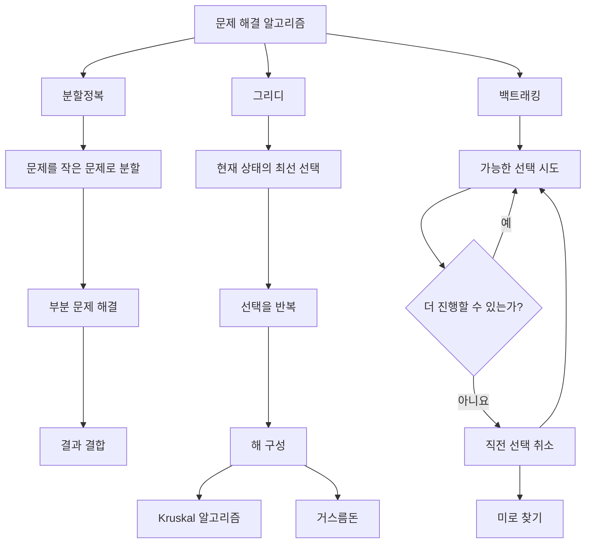

| 방법 | 핵심 생각 | 진행 방향 | 대표 예제 |
|---|---|---|---|
| 분할정복 | 큰 문제를 작은 문제로 나눈다 | 분할은 하향식, 해결·결합은 상향식 | 병합 정렬, 이진 탐색 |
| 그리디 | 현재 상태에서 가장 좋은 선택을 한다 | 앞에서부터 선택을 확정 | Kruskal, 거스름돈 |
| 백트래킹 | 선택을 시도하고 막히면 되돌린다 | 깊이 탐색 후 이전 상태로 복귀 | 미로 찾기, N-Queen |

---

## 1. 분할정복(Divide and Conquer)

분할정복은 큰 문제를 한 번에 해결하지 않고, 해결 가능한 크기의 부분 문제로 나누어 처리하는 방법입니다.

### 처리 구조

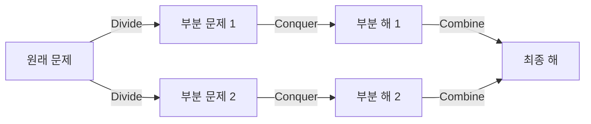

1. **분할(Divide)**: 문제를 더 작은 부분 문제로 나눕니다.
2. **정복(Conquer)**: 각 부분 문제를 해결합니다.
3. **결합(Combine)**: 부분 문제의 결과를 합쳐 원래 문제의 답을 만듭니다.

분할 과정은 큰 문제에서 작은 문제로 내려가는 하향식(top-down)이고, 결과를 결합하는 과정은 작은 문제에서 큰 문제로 올라가는 상향식(bottom-up)입니다. 같은 구조가 반복되므로 재귀 함수와 함께 자주 사용됩니다.

### 일반 형태

```text
solve(problem):
    if problem이 바로 해결 가능한 크기라면
        return 직접 계산한 답

    subproblems = problem을 작은 문제들로 분할
    answers = 각 subproblem을 solve로 해결
    return answers를 결합한 결과
```

### 핵심 확인 사항

- 부분 문제의 크기가 원래 문제보다 작아야 합니다.
- 재귀가 끝나는 종료 조건이 반드시 있어야 합니다.
- 부분 문제의 결과를 최종 답으로 결합하는 방법이 정의되어야 합니다.

---

## 2. 함수로 문제 분해하기

학생 성적 문제는 기능별로 함수를 분리해 해결할 수 있습니다.

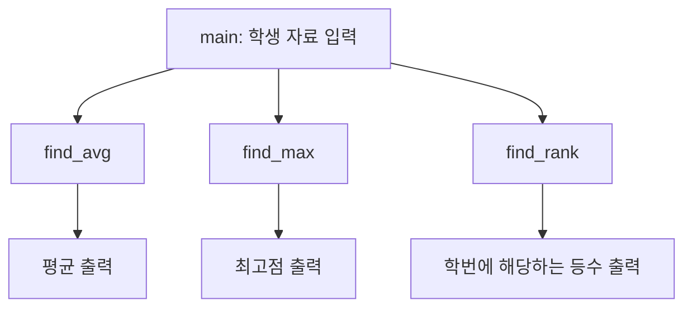

| 함수 | 입력 | 처리 | 반환값 |
|---|---|---|---|
| `find_avg` | 학생 자료, 학생 수 | 모든 점수의 합을 학생 수로 나눔 | 평균 |
| `find_max` | 학생 자료, 학생 수 | 현재 최댓값보다 큰 점수를 찾아 갱신 | 최고점 |
| `find_rank` | 학생 자료, 학생 수, 학번 | 대상보다 점수가 높은 학생 수를 계산 | 등수 |

등수는 다음 식으로 계산할 수 있습니다.

```text
등수 = 대상 학생보다 점수가 높은 학생 수 + 1
```

이 방식에서는 같은 점수를 받은 학생이 같은 등수가 됩니다.

---

## 3. 그리디(Greedy) 알고리즘

그리디 알고리즘은 목표에 가까워지도록 현재 상태에서 가장 좋아 보이는 선택을 반복합니다.

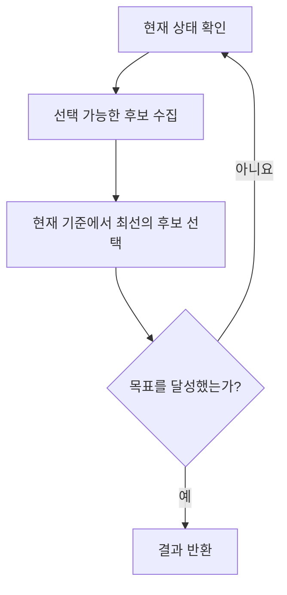

그리디 알고리즘의 선택은 일반적으로 나중에 취소하지 않습니다. 따라서 현재의 최선 선택이 전체 문제의 최적해로 이어진다는 성질이 있는 문제에서 사용해야 합니다.

### 확인해야 할 성질

- **그리디 선택 속성**: 현재의 최선 선택을 포함하는 최적해가 존재해야 합니다.
- **최적 부분 구조**: 전체 문제의 최적해가 부분 문제의 최적해로 구성되어야 합니다.

---

## 4. 신장 트리와 최소 비용 신장 트리

### 4.1 기본 용어

- **그래프(Graph)**: 정점과 정점을 연결하는 간선으로 구성된 구조
- **가중치(Weight)**: 거리나 비용처럼 간선에 부여된 값
- **경로(Path)**: 간선을 따라 정점을 이동하는 순서
- **사이클(Cycle)**: 출발한 정점으로 다시 돌아오는 경로
- **연결 그래프(Connected Graph)**: 모든 정점 사이에 경로가 존재하는 그래프

### 4.2 신장 트리(Spanning Tree)

신장 트리는 연결 그래프의 모든 정점을 포함하면서 사이클이 없는 부분 그래프입니다.

정점이 `n`개인 신장 트리의 특징:

- 모든 정점을 연결합니다.
- 사이클이 없습니다.
- 간선의 수는 정확히 `n - 1`개입니다.
- 간선 하나를 제거하면 그래프가 끊어집니다.
- 새로운 간선 하나를 추가하면 사이클이 생깁니다.

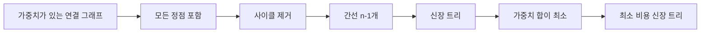

### 4.3 최소 비용 신장 트리(Minimum Spanning Tree, MST)

하나의 그래프에는 여러 신장 트리가 존재할 수 있습니다. 이 가운데 선택한 간선의 가중치 합이 가장 작은 신장 트리를 최소 비용 신장 트리라고 합니다.

최소 비용 신장 트리는 다음과 같은 문제에 활용됩니다.

- 여러 도시를 최소 도로 비용으로 연결하기
- 컴퓨터나 기지국을 최소 케이블 길이로 연결하기
- 전력망·통신망의 최소 설치 비용 구하기

---

## 5. Kruskal 알고리즘

Kruskal 알고리즘은 간선을 가중치 오름차순으로 확인하면서 사이클을 만들지 않는 간선만 선택하는 그리디 알고리즘입니다.

### 알고리즘 구조

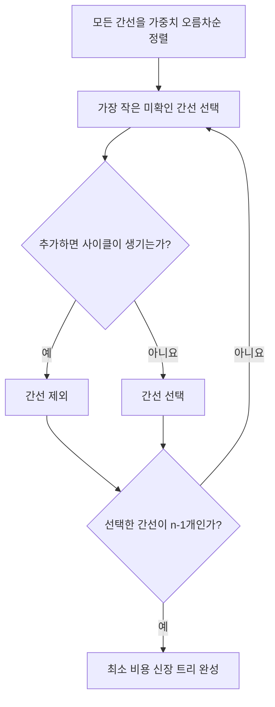

사이클 여부는 서로소 집합(Disjoint Set 또는 Union-Find) 자료구조로 효율적으로 확인할 수 있습니다.

- `find(x)`: 정점 `x`가 속한 집합의 대표 정점을 찾습니다.
- `union(a, b)`: 서로 다른 두 집합을 하나로 합칩니다.
- 두 정점의 대표가 같으면 이미 연결되어 있으므로, 그 사이의 간선을 추가하면 사이클이 생깁니다.

### 강의 예제 그래프

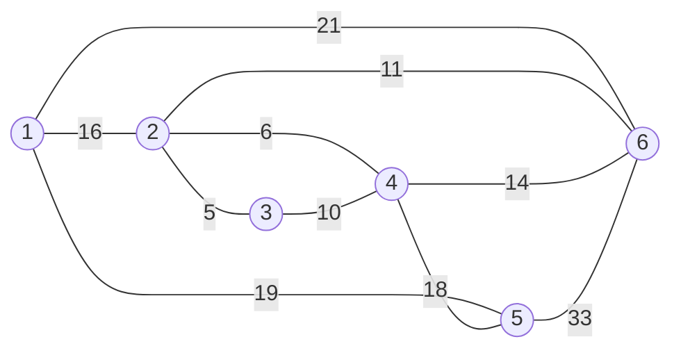

간선을 오름차순으로 검사하면 다음과 같이 처리됩니다.

| 검사 순서 | 간선 | 가중치 | 처리 | 이유 |
|---:|---|---:|---|---|
| 1 | 2-3 | 5 | 선택 | 사이클 없음 |
| 2 | 2-4 | 6 | 선택 | 사이클 없음 |
| 3 | 3-4 | 10 | 제외 | 2-3-4 사이클 발생 |
| 4 | 2-6 | 11 | 선택 | 사이클 없음 |
| 5 | 4-6 | 14 | 제외 | 2-4-6 사이클 발생 |
| 6 | 1-2 | 16 | 선택 | 사이클 없음 |
| 7 | 4-5 | 18 | 선택 | 모든 정점 연결 |

### 완성된 최소 비용 신장 트리

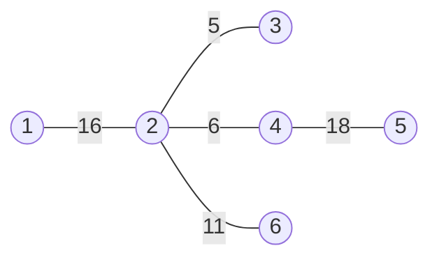

```text
총비용 = 5 + 6 + 11 + 16 + 18 = 56
```

정점은 6개이고 선택된 간선은 `6 - 1 = 5`개이므로 신장 트리의 조건을 만족합니다.

---

## 6. 그리디 거스름돈

500원, 100원, 50원, 10원 동전으로 거스름돈을 줄 때는 남은 금액을 넘지 않는 가장 큰 동전을 반복해서 선택합니다.

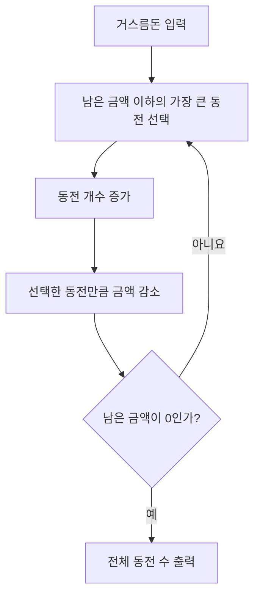

860원의 선택 과정:

```text
860 - 500 = 360
360 - 100 - 100 - 100 = 60
60 - 50 = 10
10 - 10 = 0
```

| 동전 | 개수 |
|---:|---:|
| 500원 | 1개 |
| 100원 | 3개 |
| 50원 | 1개 |
| 10원 | 1개 |
| **합계** | **6개** |

이 동전 체계에서는 그리디 방식으로 최소 동전 수를 구할 수 있습니다. 하지만 임의의 동전 체계에서 항상 최적해가 나오는 것은 아닙니다. 예를 들어 동전이 1원, 3원, 4원이고 금액이 6원이면 그리디 결과는 `4 + 1 + 1`이지만 최적해는 `3 + 3`입니다.

---

## 7. 백트래킹(Backtracking)

백트래킹은 가능한 선택을 하나씩 시도하다가 더 진행할 수 없으면 직전 선택을 취소하고 이전 상태로 돌아가 다른 선택을 탐색하는 방법입니다.

> 가 보고, 막히면 되돌아온다.

### 알고리즘 구조

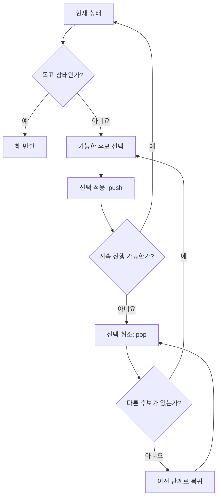

### 스택과 백트래킹

```mermaid
flowchart LR
    A[새 위치 선택] -->|push| B[스택 위에 위치 저장]
    B --> C{막다른 길인가?}
    C -- 아니요 --> A
    C -- 예 -->|pop| D[직전 위치 제거]
    D --> E[이전 위치에서 다른 방향 탐색]
    E --> A
```

- `push`: 새 선택 또는 이동 위치를 스택 위에 저장합니다.
- `pop`: 가장 최근 선택을 스택에서 제거하고 취소합니다.
- LIFO: 가장 나중에 저장한 선택을 가장 먼저 되돌립니다.

### 미로 예제

```text
S . # .
. # . .
. # . #
. . . G
```

- `.`: 이동 가능한 길
- `#`: 벽
- `S`: 시작점 `(0, 0)`
- `G`: 도착점 `(3, 3)`
- 탐색 순서: 오른쪽 → 아래 → 왼쪽 → 위

처음 `(0, 0)`에서 오른쪽 `(0, 1)`로 이동하면 막다른 길입니다. `(0, 1)`을 스택에서 꺼내고 `(0, 0)`으로 돌아간 뒤 아래쪽을 탐색합니다.

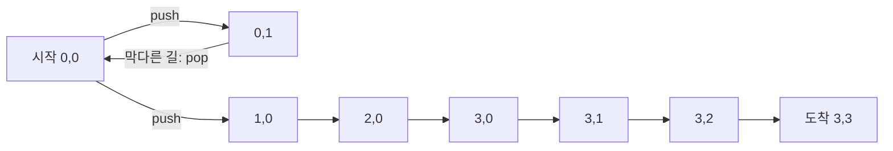

최종 경로:

```text
(0,0) → (1,0) → (2,0) → (3,0) → (3,1) → (3,2) → (3,3)
```

백트래킹은 미로 찾기 외에도 N-Queen, 스도쿠, 일정 조합 탐색처럼 여러 후보 중 조건을 만족하는 해를 찾는 문제에 사용할 수 있습니다.

---

## 8. 가장 가까운 배수 찾기

숫자 `number`를 `m`으로 나눈 나머지를 `r`이라고 하면 가까운 두 배수는 다음과 같습니다.

```text
아래쪽 배수 = number - r
위쪽 배수 = number + (m - r)
```

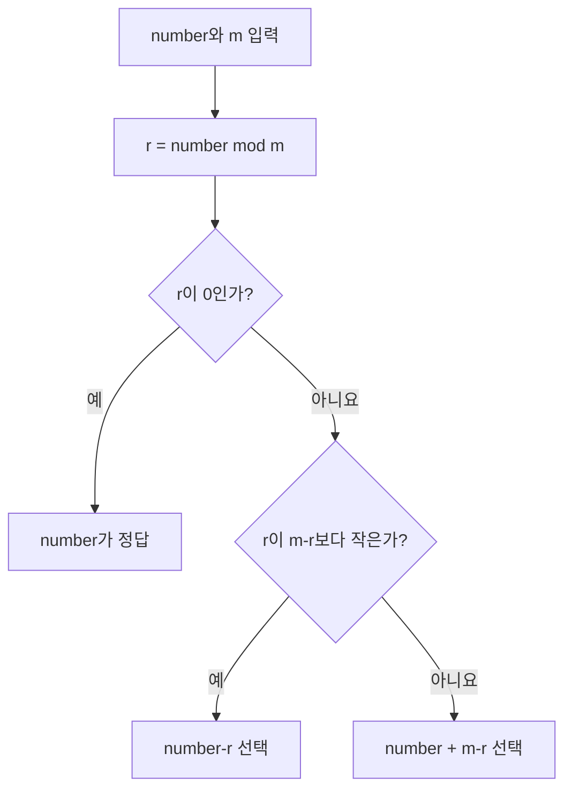

두 배수까지의 거리가 같을 때는 강의 예제와 같이 위쪽 배수를 선택합니다.

---

## 핵심 정리

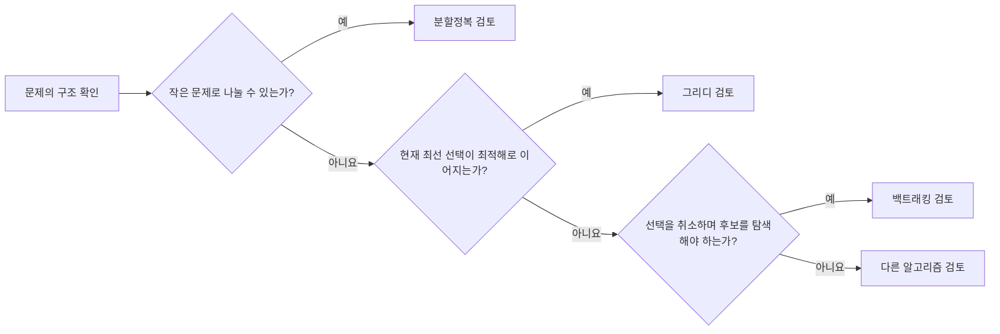

- 분할정복은 문제를 **나누고, 해결하고, 합칩니다**.
- 그리디는 현재의 선택을 **확정하며 전진합니다**.
- Kruskal은 가장 가벼운 간선을 선택하되 **사이클을 제외합니다**.
- 최소 비용 신장 트리는 모든 정점을 `n - 1`개의 간선으로 연결하고 **전체 가중치 합을 최소화합니다**.
- 백트래킹은 선택을 **시도하고, 막히면 취소합니다**.
