## 1. 전체 흐름

알고리즘의 대표 제어 방식 네 가지

| 제어 방식 | 핵심 질문 | 예시 |
|---|---|---|
| 순차 | 명령 실행 순서 | 입력 → 계산 → 출력 |
| 선택 | 조건에 따른 분기 | `if`, `switch` |
| 반복 | 반복 종료 시점 | `for`, `while` |
| 함수 호출과 복귀 | 호출 대상과 복귀 지점 | 일반 함수, 재귀 함수 |

구체 예시: 학생 3명의 평균과 합격 여부 출력

| 단계 | 적용 방식 | 처리 내용 |
|---:|---|---|
| 1 | 순차 | 점수 입력 → 평균 계산 → 결과 출력 |
| 2 | 선택 | 평균이 60 이상이면 합격, 미만이면 불합격 |
| 3 | 반복 | 학생 3명에 대해 같은 과정 반복 |
| 4 | 함수 | 평균 계산을 별도 함수에 맡긴 뒤 결과 반환 |

재귀: **함수가 자기 자신을 호출하는 구현 방식**. 문제를 더 작은 동일 형태로 나누는 분할 정복과 높은 적합성

분할 정복의 기본 흐름:

1. **분할**: 큰 문제를 더 작은 문제로 축소
2. **정복**: 직접 해결 가능한 크기까지 반복
3. **결합**: 작은 문제의 결과로 원래 문제 해결


## 2. 재귀의 핵심

### 2.1 재귀 함수의 필수 구성

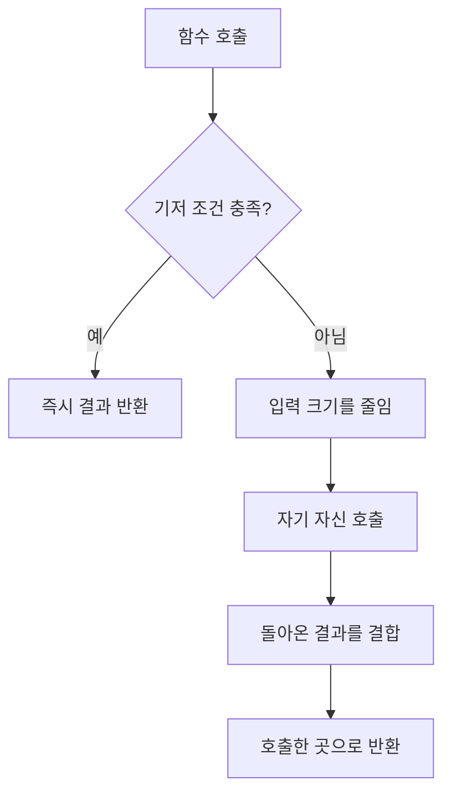

| 구성 요소 | 역할 | 빠졌을 때의 문제 |
|---|---|---|
| 기저 조건 | 재귀를 멈추는 조건 | 무한 호출 또는 스택 오버플로 |
| 재귀 단계 | 더 작은 문제로 이동 | 기저 조건에 도달하지 못함 |
| 결과 결합 | 작은 문제의 답으로 큰 문제 해결 | 잘못된 반환값 |

함수 호출마다 매개변수·지역 변수·복귀 위치를 담은 **스택 프레임** 생성. 재귀가 깊어질수록 프레임 누적. 기저 조건 도달 후 마지막 호출부터 역순 제거

### 2.2 재귀와 반복의 관계

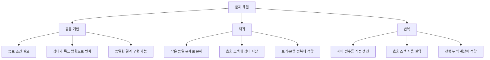

| 기준 | 재귀 | 반복 |
|---|---|---|
| 상태 저장 | 호출 스택이 자동 보관 | 변수를 직접 갱신 |
| 코드 표현 | 트리·분할 구조에서 자연스러움 | 선형 반복에서 간결함 |
| 추가 메모리 | 호출 깊이에 비례 | 보통 일정한 크기 |
| 주요 위험 | 기저 조건 누락, 깊은 호출 | 종료 조건·제어 변수 갱신 누락 |

> 같은 문제를 두 방식으로 구현 가능. 재귀적 구조에는 재귀, 단순 누적 계산에는 반복이 유리

구체 예시: `1 + 2 + 3 + 4 = 10`

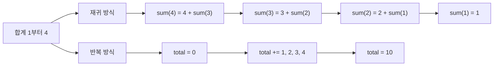

재귀 방식은 남은 합을 함수 호출에 위임. 반복 방식은 `total` 변수에 값을 직접 누적

## 3. 팩토리얼

### 3.1 재귀 정의

$$
n! =
\begin{cases}
1 & n \le 1 \\
n \times (n-1)! & n > 1
\end{cases}
$$

```c
long long factorial(int n)
{
    if (n <= 1)                      // 기저 조건: 0!과 1!
        return 1;                    // 재귀 종료

    return n * factorial(n - 1);     // 더 작은 문제 호출 후 결과 결합
}
```

### 3.2 `factorial(4)`의 호출과 복귀

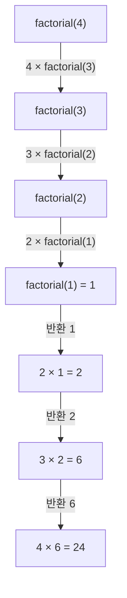

호출 단계: 끝나지 않은 곱셈을 스택에 저장. 반환 단계: 기저 조건부터 역순 계산

- 핵심 관찰: `factorial(4)` 계산을 위해 먼저 `factorial(3)`의 결과 필요
- 곱셈은 즉시 실행되지 않고 하위 호출의 반환까지 대기

## 4. 등차·등비수열

### 4.1 등차수열

$$a_n = a_1 + (n-1)d$$

재귀 관계: $a_n = a_{n-1} + d$

```c
long arithmetic(int first, int diff, int n)
{
    if (n <= 1)                                  // 첫째항 도달
        return first;                            // a1 반환

    return arithmetic(first, diff, n - 1) + diff; // 이전 항 + 공차
}
```

예시: `1, 3, 5, 7, 9, 11` → 첫째항 `1`, 공차 `2`

`4`번째 항 계산:

```text
arithmetic(1, 2, 4)
= arithmetic(1, 2, 3) + 2
= arithmetic(1, 2, 2) + 2 + 2
= arithmetic(1, 2, 1) + 2 + 2 + 2
= 1 + 2 + 2 + 2
= 7
```

### 4.2 등비수열

$$a_n = a_1 \times r^{n-1}$$

재귀 관계: $a_n = a_{n-1} \times r$

```c
long geometric(int first, int ratio, int n)
{
    if (n <= 1)                                  // 첫째항 도달
        return first;                            // a1 반환

    return geometric(first, ratio, n - 1) * ratio; // 이전 항 × 공비
}
```

예시: `2, 10, 50, 250, 1250` → 첫째항 `2`, 공비 `5`

`4`번째 항 계산:

```text
geometric(2, 5, 4)
= geometric(2, 5, 3) × 5
= geometric(2, 5, 2) × 5 × 5
= geometric(2, 5, 1) × 5 × 5 × 5
= 2 × 5 × 5 × 5
= 250
```

> 원본 슬라이드에는 첫째항 `1`로 표기. 제시된 수열과 계산식에 맞는 첫째항은 `2`

## 5. 피보나치 수열

수업 자료 기준: 토끼 쌍의 수에 따라 `F(0) = 1`, `F(1) = 1` 사용

각 항을 바로 앞의 두 항으로 표현하는 점화식. 한 번의 호출이 두 개의 하위 호출로 분기되는 구조

$$
F(n) =
\begin{cases}
1 & n < 2 \\
F(n-1) + F(n-2) & n \ge 2
\end{cases}
$$

결과: `1, 1, 2, 3, 5, 8, 13, ...`

```c
long long fibonacci(int n)
{
    if (n < 2)                              // F(0), F(1)
        return 1;                           // 기저값 반환

    return fibonacci(n - 1) + fibonacci(n - 2); // 앞의 두 항 결합
}
```

### 5.1 호출 트리

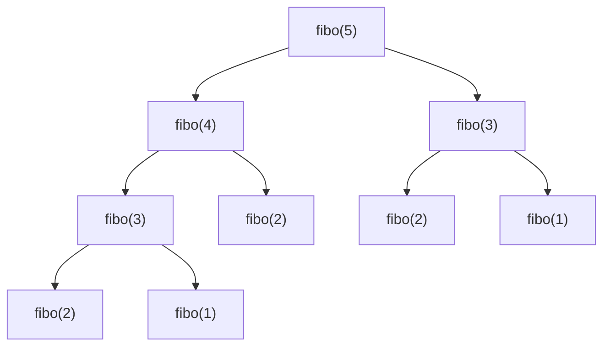

반복 계산 대상: `fibo(3)`, `fibo(2)`

호출 트리의 같은 노드가 중복 계산의 원인. 입력이 커질수록 호출 수가 급격히 증가

`F(5)` 계산:

```text
F(5) = F(4) + F(3)
     = 5 + 3
     = 8
```

- 단순 재귀 시간 복잡도: 대략 `O(2^n)`
- 호출 스택 공간 복잡도: `O(n)`
- 개선 방향: 이미 계산한 값을 저장하는 메모이제이션 또는 반복문

## 6. 유클리드 알고리즘

두 정수의 최대공약수 계산 성질

$$
\gcd(x, y) =
\begin{cases}
x & y = 0 \\
\gcd(y, x \bmod y) & y \ne 0
\end{cases}
$$

예시: `gcd(24, 18) → gcd(18, 6) → gcd(6, 0) → 6`

| 호출 | `x` | `y` | `x % y` |
|---:|---:|---:|---:|
| 1 | 24 | 18 | 6 |
| 2 | 18 | 6 | 0 |
| 3 | 6 | 0 | 종료 |

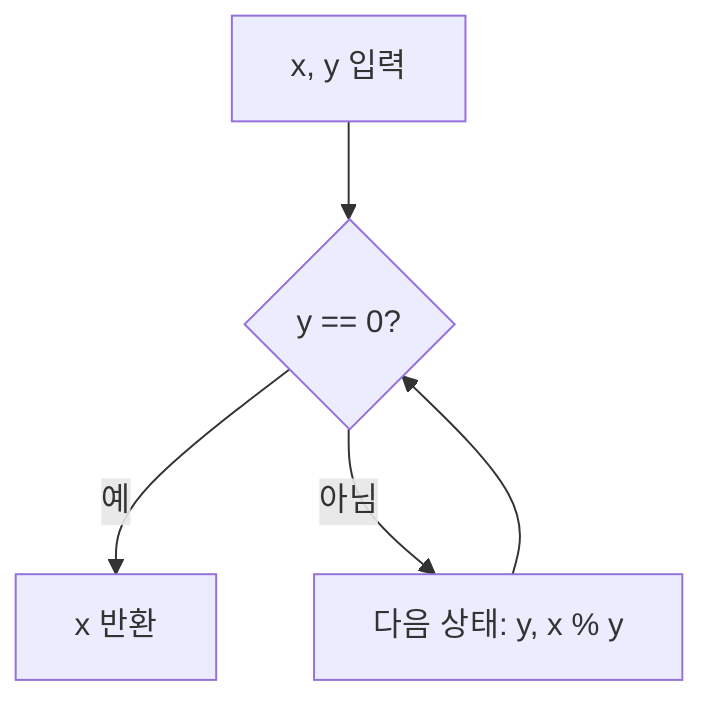

### 재귀 구현

```c
int gcd_recursive(int x, int y)
{
    if (y == 0)                  // 나머지가 0이면 종료
        return x;                // 현재 x가 최대공약수

    return gcd_recursive(y, x % y); // 두 번째 수와 나머지로 축소
}
```

### 반복 구현

```c
int gcd_iterative(int x, int y)
{
    while (y != 0)               // 나머지가 0일 때까지 반복
    {
        int remainder = x % y;   // 다음 단계의 두 번째 값
        x = y;                   // 기존 y를 첫 번째 값으로 이동
        y = remainder;           // 나머지를 두 번째 값으로 이동
    }

    return x;                    // 마지막 0이 아닌 나머지
}
```

두 구현 모두 동일한 나머지 연산 사용. 반복 구현은 함수 호출 없이 상태를 직접 갱신

핵심 원리: `x`와 `y`의 공약수 집합은 `y`와 `x % y`의 공약수 집합과 동일. 큰 수를 작은 나머지로 계속 교체해 문제 크기 축소

## 7. 명령행 인수와 파일 입출력

### 7.1 `argc`와 `argv`

```c
int main(int argc, char *argv[]) // argc: 개수, argv: 문자열 배열
```

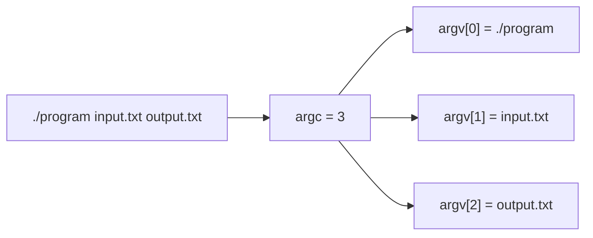

- `argc`: 프로그램 이름을 포함한 인수 개수
- `argv[0]`: 실행한 프로그램 이름 또는 경로
- `argv[1]` 이후: 사용자가 전달한 인수
- 파일 경로를 인수로 받으면 코드 수정 없이 다른 입력 파일 사용 가능

명령행 인수는 프로그램 실행 시 외부 값을 전달하는 통로. 입력·출력 파일을 코드에 고정하지 않고 실행 명령에서 선택 가능

구체 예시:

```bash
./gcd_quiz gcddata.txt again.txt
```

| 값 | 내용 |
|---|---|
| `argc` | `3` |
| `argv[0]` | `./gcd_quiz` |
| `argv[1]` | `gcddata.txt` |
| `argv[2]` | `again.txt` |

### 7.2 GCD 퀴즈 프로그램 구조

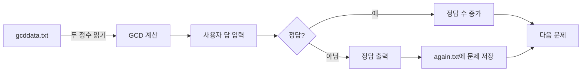

안전한 파일 처리 순서:

1. `argc`로 인수 개수 확인
2. `fopen()`의 반환값이 `NULL`인지 확인
3. `fscanf(...) == 2`처럼 실제 변환 개수 확인
4. 작업이 끝나면 `fclose()` 호출

구체 예시:

```text
입력 파일 한 줄: 56 14
사용자 입력:      10
실제 정답:        14
처리 결과:        정답 출력 + again.txt에 "56 14" 저장
```

## 8. 하노이 탑

### 8.1 규칙

1. 한 번에 디스크 하나만 이동
2. 큰 디스크를 작은 디스크 위에 놓지 않기
3. 출발 막대의 모든 디스크를 목적 막대로 이동

### 8.2 재귀 구조

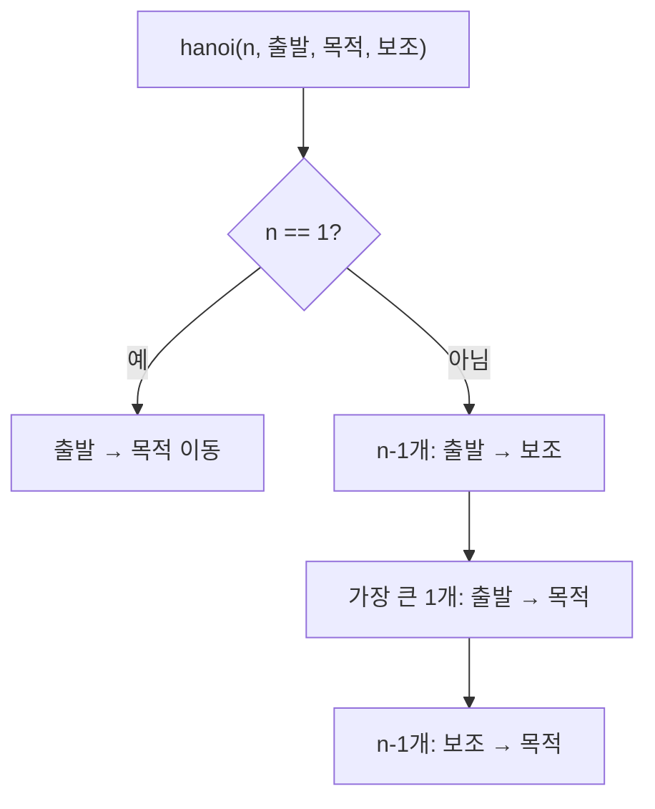

점화식과 이동 횟수:

$$T(n) = 2T(n-1) + 1, \qquad T(n) = 2^n - 1$$

| 디스크 수 `n` | 최소 이동 횟수 |
|---:|---:|
| 1 | 1 |
| 2 | 3 |
| 3 | 7 |
| 4 | 15 |
| 10 | 1,023 |

```c
void hanoi(int n, char from, char to, char via)
{
    if (n == 1) {                         // 디스크 1개: 직접 이동
        printf("%c -> %c\n", from, to);   // 실제 이동 출력
        return;                            // 재귀 종료
    }

    hanoi(n - 1, from, via, to);           // 위의 n-1개를 보조 막대로 이동
    printf("%c -> %c\n", from, to);       // 가장 큰 디스크를 목적 막대로 이동
    hanoi(n - 1, via, to, from);           // n-1개를 목적 막대로 이동
}
```

핵심 분해: 가장 큰 디스크를 옮기기 전후로 동일한 `n-1` 문제 두 번 수행. 이에 따라 이동 횟수도 이전 단계의 두 배에 1회 추가

디스크 3개의 실제 이동 순서:

| 순서 | 디스크 | 이동 |
|---:|---:|---|
| 1 | 1 | A → C |
| 2 | 2 | A → B |
| 3 | 1 | C → B |
| 4 | 3 | A → C |
| 5 | 1 | B → A |
| 6 | 2 | B → C |
| 7 | 1 | A → C |

## 9. 이진 탐색 트리와 중위 순회

이진 트리: 루트·왼쪽 서브트리·오른쪽 서브트리로 구성되는 재귀 구조

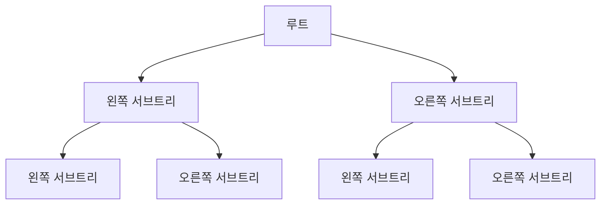

각 서브트리 역시 이진 트리. 동일 순회 함수 재사용 가능

### 중위 순회: 왼쪽 → 루트 → 오른쪽

```c
void inorder(BSTNODE *node)
{
    if (node != NULL)             // 빈 서브트리가 아니면 방문
    {
        inorder(node->left);      // 1. 왼쪽 서브트리
        printf("%d\n", node->key); // 2. 현재 노드
        inorder(node->right);     // 3. 오른쪽 서브트리
    }
}
```

이진 **탐색** 트리의 중위 순회 결과: 키 오름차순

정렬 원리: 모든 왼쪽 키는 현재 키보다 작고, 모든 오른쪽 키는 현재 키보다 큼. 중위 순회 순서와 오름차순 구조가 일치

구체 예시: `30, 20, 40, 10, 25` 순서로 삽입

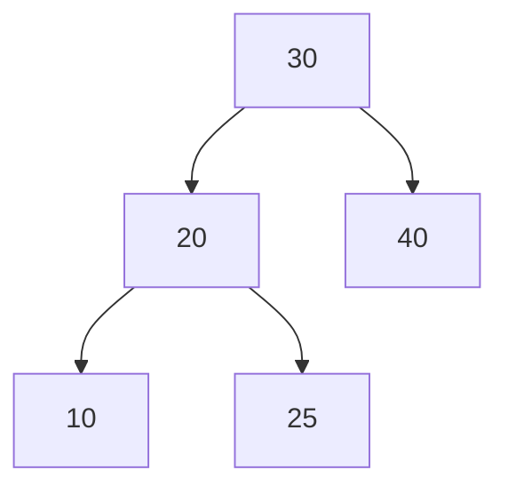

중위 순회 과정: `10 → 20 → 25 → 30 → 40`

## 10. 다음 학습 예고

- 재귀 구조 복습
- 단계적 개선 기법
- 선택 정렬
- 배열의 삭제 연산을 이용한 `k`번째 수 찾기
- 선택 정렬을 이용한 `k`번째 수 찾기

## 11. 시험 전 체크리스트

- [ ] 기저 조건과 재귀 단계 구분
- [ ] 각 호출의 입력 크기 감소 확인
- [ ] 호출 순서와 반환 순서의 역방향 추적
- [ ] 수열의 일반항과 점화식 상호 변환
- [ ] `gcd(y, x % y)`의 다음 인수 계산
- [ ] `argc`에 프로그램 이름도 포함됨을 확인
- [ ] 파일 열기 실패와 입력 형식 오류 검사
- [ ] 하노이 탑 이동 횟수 `2^n - 1` 설명
- [ ] 중위 순회 순서 `L → N → R` 암기

### 원본 코드에서 함께 확인할 부분

- 표준 C의 진입점은 `int main(void)` 또는 `int main(int argc, char *argv[])` 사용
- `fopen()`, `fscanf()`, `fprintf()` 호출 뒤 세미콜론 확인
- 문서 편집기의 굽은 따옴표 `“ ”` 대신 C 코드의 큰따옴표 `"` 사용
- `while (fscanf(...) != EOF)`보다 필요한 항목 수를 확인하는 `while (fscanf(...) == 2)` 권장
- 열린 파일은 `fclose()`로 정리
- 하노이 이동 횟수 변수는 실제 이동을 출력할 때 함께 증가
