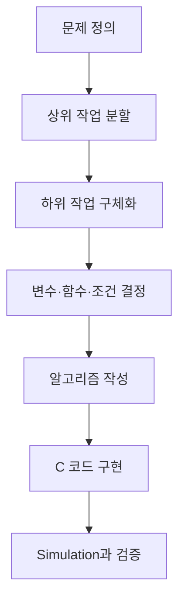

## 재귀 구조 복습

### 재귀적 정의

재귀적 정의: 어떤 대상을 정의할 때 자기 자신의 더 작은 부분을 이용하는 방식

필수 구성:

1. **기저 조건**: 재귀 호출을 멈추는 조건
2. **재귀 단계**: 입력 크기를 줄여 같은 함수를 호출하는 부분

기저 조건이 없거나 입력 크기가 줄지 않을 경우 무한 재귀와 Stack Overflow 위험

### Factorial

강의 정의:

\[
n! =
\begin{cases}
1 & n \le 1 \\
n \times (n-1)! & n > 1
\end{cases}
\]

```c
long factorial(int n)
{
    if (n <= 1)
        return 1;

    return n * factorial(n - 1);
}
```

호출 예시:

```text
factorial(4)
→ 4 × factorial(3)
→ 4 × 3 × factorial(2)
→ 4 × 3 × 2 × factorial(1)
→ 24
```

재귀 함수는 반복문으로 변환 가능. 문제 구조가 재귀적일수록 재귀 구현의 직관성이 높음

### 등차수열과 등비수열

#### 등차수열

점화식:

\[
a_n = a_{n-1} + d
\]

```c
long arithmetic(int first, int diff, int n)
{
    if (n == 1)
        return first;

    return arithmetic(first, diff, n - 1) + diff;
}
```

#### 등비수열

점화식:

\[
a_n = a_{n-1} \times r
\]

```c
long geometric(int first, int ratio, int n)
{
    if (n == 1)
        return first;

    return geometric(first, ratio, n - 1) * ratio;
}
```

### 피보나치수열

강의 예제의 기저값: `fibo(0) = 1`, `fibo(1) = 1`

```c
int fibo(int n)
{
    if (n == 0 || n == 1)
        return 1;

    return fibo(n - 2) + fibo(n - 1);
}
```

> [!IMPORTANT]
> 자료에 따라 `F(0) = 0`, `F(1) = 1` 정의도 사용. 시험에서는 문제에 제시된 기저값 우선 확인

단순 재귀 피보나치의 특징:

- 같은 값을 여러 번 계산
- 시간 복잡도 약 `O(2^n)`
- 큰 입력에서는 반복문 또는 Memoization 권장

### 하노이 탑

`n`개 원판을 `A`에서 `C`로 이동하는 분해:

1. 위쪽 `n-1`개를 `A`에서 `B`로 이동
2. 가장 큰 원판을 `A`에서 `C`로 이동
3. `B`의 `n-1`개를 `C`로 이동

```c
void hanoi(int n, char from, char to, char temp)
{
    if (n == 1) {
        printf("Move disk from %c to %c\n", from, to);
        return;
    }

    hanoi(n - 1, from, temp, to);
    hanoi(1, from, to, temp);
    hanoi(n - 1, temp, to, from);
}
```

이동 횟수:

\[
T(n) = 2T(n-1) + 1 = 2^n - 1
\]

### 재귀적 자료구조와 이진 트리 순회

이진 트리의 재귀적 구성:

- 빈 트리
- 루트 노드
- 왼쪽 이진 서브트리
- 오른쪽 이진 서브트리

중위 순회 순서: `왼쪽 서브트리 → 현재 노드 → 오른쪽 서브트리`

```c
void inorder(TNODETYPE *tptr)
{
    if (tptr != NULL) {
        inorder(tptr->left);
        printf("%d ", tptr->data);
        inorder(tptr->right);
    }
}
```

Stack을 이용한 반복 구현도 가능하지만 별도의 방문 상태 관리가 필요해 코드 복잡도 증가

---

## 단계적 개선 기법

### 개념

단계적 개선(Stepwise Refinement): 문제를 상위 작업에서 하위 작업으로 반복 분해해 코드 수준까지 구체화하는 Top-down 설계 기법

진행 순서:

1. 문제 정의에서 입력·출력·처리 목표 확인
2. 전체 해결 과정을 큰 작업 단위로 분할
3. 각 작업을 더 작은 하위 작업으로 구체화
4. 필요한 변수·함수·반복 조건 결정
5. 알고리즘과 프로그램 코드로 변환



### 선택 정렬에 적용

```text
선택 정렬
├─ 입력 데이터 준비
├─ 자기 자리 찾기
│  ├─ 정렬되지 않은 구간의 최솟값 위치 탐색
│  └─ 현재 위치와 최솟값 위치 교환
└─ 결과 출력
```

---

## 선택 정렬

### 문제 정의

목표: `n`개의 정수를 오름차순으로 정렬

- 입력: 데이터 수 `n`, 정수 배열 `list`
- 출력: 오름차순으로 정렬된 배열 `list`
- 핵심: 정렬되지 않은 구간의 최솟값을 찾아 정렬된 구간의 다음 위치로 이동

예시 배열:

```c
int list[10] = {57, 77, 100, 10, 35, 65, 30, 90, 20, 45};
```

`list[6]`의 값: `30`

### 알고리즘 구상

1. 입력 데이터를 배열 `list[0]`부터 `list[n-1]`에 저장
2. 정렬되지 않은 구간에서 최솟값의 인덱스 `m` 탐색
3. 현재 시작 위치 `s`의 값과 `list[m]` 교환
4. `s`를 하나 증가
5. `s = n-1`이 될 때까지 반복
6. 정렬 결과 출력

핵심 변수:

| 변수 | 역할 |
| --- | --- |
| `s` | 정렬되지 않은 구간의 시작 위치 |
| `m` | 현재 구간에서 최솟값의 인덱스 |
| `j` | 최솟값 탐색용 반복 변수 |
| `temp` | 두 값을 교환할 때 사용하는 임시 변수 |

### Pseudocode

```text
for s = 0 ... n - 2
    m = s

    for j = s + 1 ... n - 1
        if list[j] < list[m]
            m = j

    swap(list[s], list[m])
```

### Simulation 1

초기 데이터:

```text
45 100 38 90 17 75 56
```

| 단계 | 배열 상태 | 선택된 `m` |
| --- | --- | ---: |
| 초기 | `45 100 38 90 17 75 56` | - |
| `s=0` | `17 100 38 90 45 75 56` | 4 |
| `s=1` | `17 38 100 90 45 75 56` | 2 |
| `s=2` | `17 38 45 90 100 75 56` | 4 |
| `s=3` | `17 38 45 56 100 75 90` | 6 |
| `s=4` | `17 38 45 56 75 100 90` | 5 |
| `s=5` | `17 38 45 56 75 90 100` | 6 |

### Simulation 2

초기 데이터:

```text
35 95 25 70 15 58
```

| 단계 | 배열 상태 | 선택된 `m` |
| --- | --- | ---: |
| 초기 | `35 95 25 70 15 58` | - |
| `s=0` | `15 95 25 70 35 58` | 4 |
| `s=1` | `15 25 95 70 35 58` | 2 |
| `s=2` | `15 25 35 70 95 58` | 4 |
| `s=3` | `15 25 35 58 95 70` | 5 |
| `s=4` | `15 25 35 58 70 95` | 5 |

### C 함수 구현

```c
void selection_sort(int list[], int n)
{
    int s, m, j, temp;

    for (s = 0; s < n - 1; s++) {
        m = s;

        for (j = s + 1; j < n; j++) {
            if (list[j] < list[m])
                m = j;
        }

        temp = list[s];
        list[s] = list[m];
        list[m] = temp;
    }
}
```

### 전체 실습 코드

```c
#define _CRT_SECURE_NO_WARNINGS
#include <stdio.h>

void selection_sort(int list[], int n);
void print_data(const int list[], int n);

int main(void)
{
    int list[] = {40, 30, 80, 70, 100, 10, 90, 20, 170, 60, 80};
    int n = (int)(sizeof(list) / sizeof(list[0]));

    print_data(list, n);
    selection_sort(list, n);

    printf("--------------------------------\n");
    print_data(list, n);
    return 0;
}

void selection_sort(int list[], int n)
{
    int s, m, j, temp;

    for (s = 0; s < n - 1; s++) {
        m = s;

        for (j = s + 1; j < n; j++) {
            if (list[j] < list[m])
                m = j;
        }

        temp = list[s];
        list[s] = list[m];
        list[m] = temp;
    }
}

void print_data(const int list[], int n)
{
    int i;

    for (i = 0; i < n; i++)
        printf("%d [%d]\n", i, list[i]);
}
```

### 성능

- 비교 횟수: `(n-1) + (n-2) + ... + 1 = n(n-1)/2`
- 시간 복잡도: `O(n²)`
- 추가 공간 복잡도: `O(1)`
- 입력 배열 내부에서 직접 교환하는 In-place 정렬

---

## 배열 삭제를 이용한 k번째 수 찾기

### 문제

`n`개의 수에서 k번째로 작은 값 출력

접근 방법:

1. 현재 배열의 최솟값 탐색
2. 최솟값을 배열에서 삭제
3. 배열 크기를 하나 감소
4. 위 과정을 `k`번 반복
5. 마지막으로 삭제한 값 출력

### 인덱스 `k`의 데이터 삭제

삭제 위치 뒤의 값을 한 칸씩 왼쪽으로 이동

```c
int delete_data(int array[], int n, int k)
{
    int i;
    int deleted = array[k];

    for (i = k + 1; i < n; i++)
        array[i - 1] = array[i];

    return deleted;
}
```

배열의 실제 메모리 크기는 그대로 유지. 논리적 데이터 수 `n`만 하나 감소해 사용

### `find_min_delete()`

```c
int find_min_delete(int list[], int n)
{
    int i;
    int min_index = 0;
    int min_value;

    for (i = 1; i < n; i++) {
        if (list[i] < list[min_index])
            min_index = i;
    }

    min_value = list[min_index];

    for (i = min_index + 1; i < n; i++)
        list[i - 1] = list[i];

    return min_value;
}
```

### 전체 코드

```c
#define _CRT_SECURE_NO_WARNINGS
#include <stdio.h>

#define DNUM 100

int find_min_delete(int list[], int n);

int main(void)
{
    int data[DNUM];
    int n, k, i;
    int answer = 0;

    printf("데이터 수와 k 입력: ");
    if (scanf("%d %d", &n, &k) != 2)
        return 1;

    if (n < 1 || n > DNUM || k < 1 || k > n)
        return 1;

    for (i = 0; i < n; i++) {
        if (scanf("%d", &data[i]) != 1)
            return 1;
    }

    for (i = 0; i < k; i++)
        answer = find_min_delete(data, n - i);

    printf("%d\n", answer);
    return 0;
}

int find_min_delete(int list[], int n)
{
    int i;
    int min_index = 0;
    int min_value;

    for (i = 1; i < n; i++) {
        if (list[i] < list[min_index])
            min_index = i;
    }

    min_value = list[min_index];

    for (i = min_index + 1; i < n; i++)
        list[i - 1] = list[i];

    return min_value;
}
```

각 호출에서 최솟값 탐색과 삭제 이동 수행. 전체 시간 복잡도 `O(kn)`, 최악의 경우 `k=n`이므로 `O(n²)`

---

## 선택 정렬을 이용한 k번째 수 찾기

전체 배열을 끝까지 정렬할 필요 없이 선택 정렬의 앞쪽 `k`단계만 수행

단계별 의미:

- `s=0`: 가장 작은 값 확정
- `s=1`: 두 번째로 작은 값 확정
- `s=k-1`: k번째로 작은 값 확정

```c
int find_kthdata(int list[], int n, int k)
{
    int s, m, j, temp;

    for (s = 0; s < k; s++) {
        m = s;

        for (j = s + 1; j < n; j++) {
            if (list[j] < list[m])
                m = j;
        }

        temp = list[s];
        list[s] = list[m];
        list[m] = temp;
    }

    return list[k - 1];
}
```

사용 예시:

```c
#define _CRT_SECURE_NO_WARNINGS
#include <stdio.h>

int find_kthdata(int list[], int n, int k);

int main(void)
{
    int list[] = {110, 30, 80, 10, 100, 77, 90, 20, 170, 60, 80, 33, 65, 99};
    int n = (int)(sizeof(list) / sizeof(list[0]));
    int k;

    printf("k 입력: ");
    if (scanf("%d", &k) != 1 || k < 1 || k > n)
        return 1;

    printf("%d번째 값: %d\n", k, find_kthdata(list, n, k));
    return 0;
}

int find_kthdata(int list[], int n, int k)
{
    int s, m, j, temp;

    for (s = 0; s < k; s++) {
        m = s;

        for (j = s + 1; j < n; j++) {
            if (list[j] < list[m])
                m = j;
        }

        temp = list[s];
        list[s] = list[m];
        list[m] = temp;
    }

    return list[k - 1];
}
```

시간 복잡도: `O(kn)`  
추가 공간 복잡도: `O(1)`

> [!NOTE]
> 강의 문제 설명은 서로 다른 수를 전제로 하지만 예제 배열에는 `80`이 두 번 포함. 위 코드는 중복값도 각각 하나의 순서로 계산

---

## 두 풀이 비교

| 기준 | 최솟값 삭제 반복 | 부분 선택 정렬 |
| --- | --- | --- |
| 핵심 | 최솟값 탐색 후 배열에서 제거 | 앞쪽 `k`개 위치만 정렬 |
| 배열 이동 | 삭제 위치 뒤의 모든 값 이동 | 현재 위치와 최솟값 위치만 교환 |
| 입력 배열 변화 | 길이가 논리적으로 감소 | 앞쪽 `k`개가 정렬 상태 |
| 시간 복잡도 | `O(kn)` | `O(kn)` |
| 추가 공간 | `O(1)` | `O(1)` |
| 반환값 | k번째 삭제한 값 | `list[k-1]` |

공통 검증 조건:

- `1 <= n <= 배열 최대 크기`
- `1 <= k <= n`
- 입력 데이터 개수와 `n` 일치
- 함수 호출별 유효 배열 길이 정확히 전달

---

## 시험 대비 핵심

- [ ] 재귀 함수의 기저 조건과 재귀 단계 구분
- [ ] Factorial 점화식과 호출 순서 설명
- [ ] 등차·등비수열의 `n-1`번째 항 이용 방식 설명
- [ ] 피보나치수열의 중복 호출 문제 설명
- [ ] 하노이 탑의 세 단계 분해와 `2^n-1` 이동 횟수 설명
- [ ] 이진 트리 중위 순회의 `L → N → R` 순서 설명
- [ ] 단계적 개선의 Top-down 분해 과정 설명
- [ ] 선택 정렬에서 `s`, `m`, `j`, `temp`의 역할 설명
- [ ] 선택 정렬 Simulation을 손으로 추적
- [ ] 선택 정렬의 시간 복잡도 `O(n²)` 설명
- [ ] 배열 삭제 시 뒤쪽 원소의 왼쪽 이동 설명
- [ ] `find_min_delete(data, n-i)`에서 유효 길이가 감소하는 이유 설명
- [ ] `find_kthdata()`가 `s < k`까지만 반복하는 이유 설명
- [ ] k번째 값의 배열 인덱스가 `k-1`인 이유 설명
