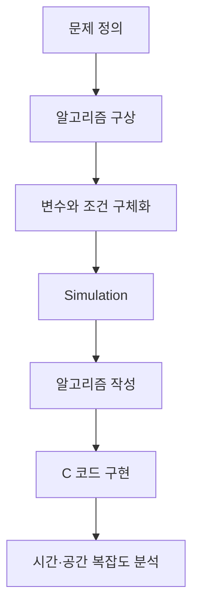
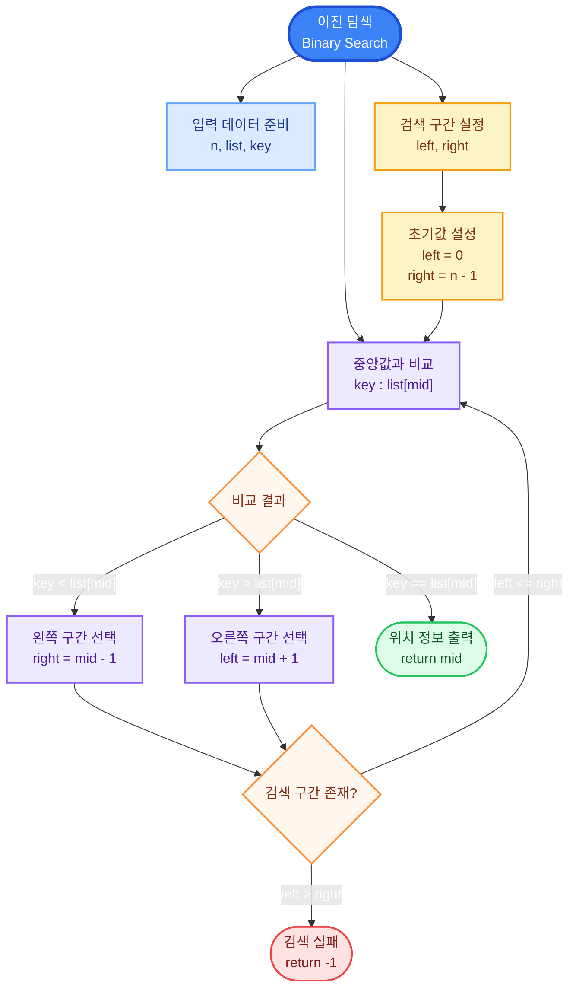
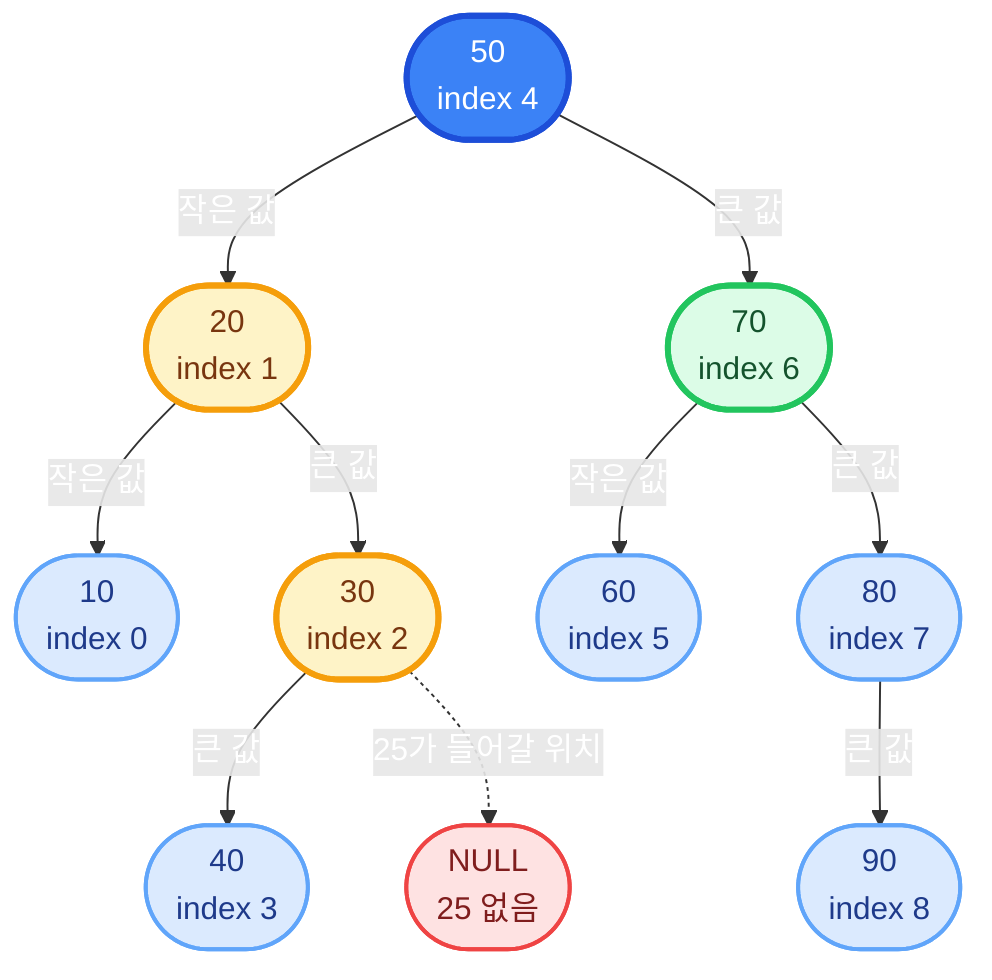
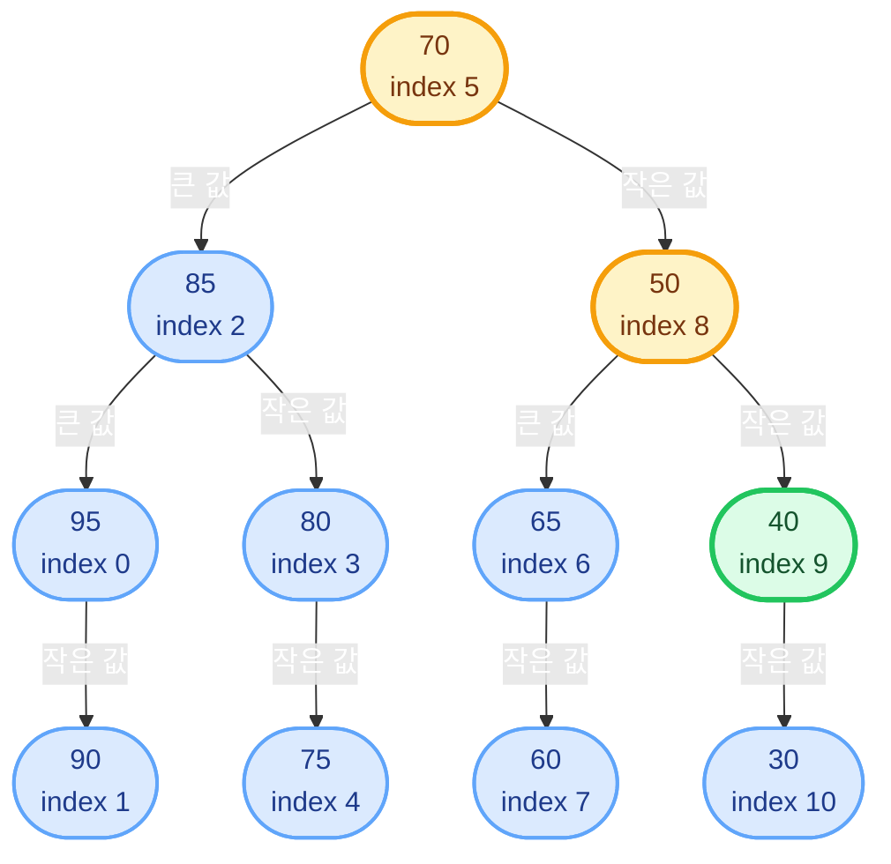
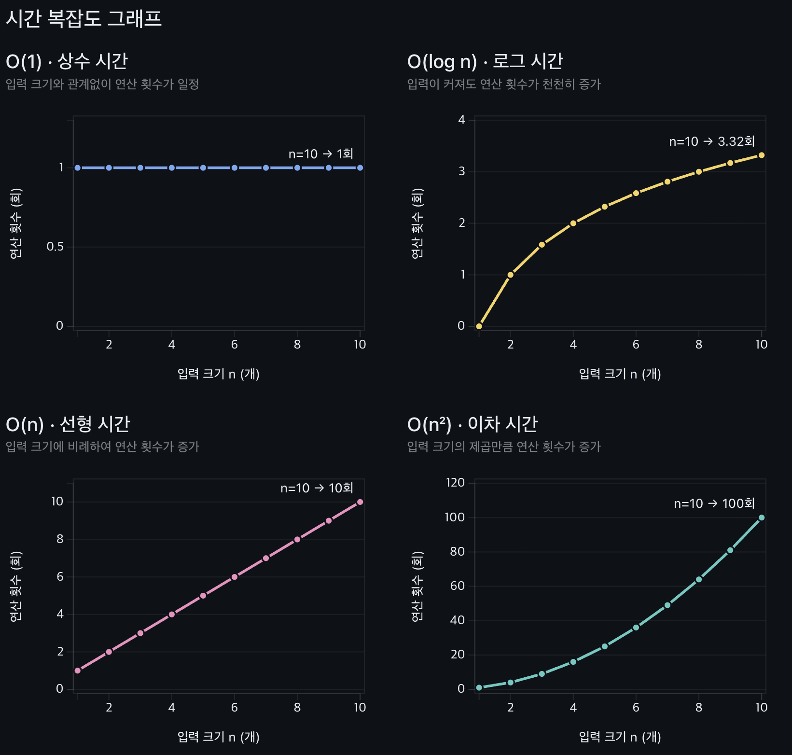

# Week 06 - 이진 탐색과 알고리즘 성능 분석

## 학습 목표

- 단계적 개선 기법을 이용한 알고리즘 설계 과정 이해
- 선택 정렬과 이진 탐색의 연결 관계 이해
- 오름차순·내림차순 이진 탐색의 조건 구분
- 반복문과 재귀를 이용한 이진 탐색 구현
- 시간 복잡도와 공간 복잡도의 의미 이해
- 빅오 표기법을 이용한 알고리즘 성능 비교

## 첨부 자료 구성

| 파일 | 주요 내용 |
| --- | --- |
| `6주차수업ppt_toYC.pdf` | 단계적 개선, 이진 탐색, 성능 분석, 빅오 표기법 |
| `bs.c` | 정렬 후 반복형 이진 탐색을 호출하는 실습 구조 |
| `rbsex.c` | 재귀형 이진 탐색 실습 |
| `bs_item.c` | 물품 번호 검색과 전체 재고 합계 계산 |
| `sitemnum.txt` | 물품 번호와 재고 수량 데이터 |

---

## 1. 전체 흐름



알고리즘 설계와 구현 단계:

1. 문제 정의
2. 알고리즘 구상
3. 세분화를 위한 변수 설정
4. Block diagram 정리
5. Simulation
6. 알고리즘 작성
7. 프로그램 구현

---

## 2. 단계적 개선 기법

### 개념

**단계적 개선(Stepwise Refinement)**: 큰 문제를 작은 작업으로 반복 분해하여 코드 수준까지 구체화하는 설계 기법

**Top-down approach**: 전체 문제에서 시작하여 세부 기능으로 내려가는 하향식 접근

### 필요한 이유

- 복잡한 문제를 한 번에 코드로 작성할 때 발생하는 조건 누락 방지
- 입력·출력·변수·반복 조건의 단계별 확인
- 알고리즘과 실제 코드 사이의 연결 관계 확인
- Simulation을 통한 구현 전 논리 오류 발견

### 이진 탐색에 적용

```text
이진 탐색
├─ 정렬된 입력 데이터 준비
├─ 검색 구간 설정
│  ├─ left = 0
│  └─ right = n - 1
├─ 중앙 위치 계산
│  └─ mid = (left + right) / 2
├─ key와 list[mid] 비교
│  ├─ 같은 값: mid 반환
│  ├─ key가 큰 값: 오른쪽 구간 선택
│  └─ key가 작은 값: 왼쪽 구간 선택
└─ 검색 구간 소멸
   └─ -1 반환
```

---

## 3. 선택 정렬 복습

### 개념

**선택 정렬(Selection Sort)**: 정렬되지 않은 구간에서 최솟값 또는 최댓값을 선택하여 현재 위치와 교환하는 정렬 알고리즘

오름차순 정렬 과정:

1. 정렬되지 않은 구간의 시작 위치를 `s`로 설정
2. `s`부터 마지막 원소까지 최솟값의 위치 `m` 탐색
3. `list[s]`와 `list[m]` 교환
4. `s`를 한 칸 증가
5. `s = n - 1`이 될 때까지 반복

### 핵심 변수

| 변수 | 역할 |
| --- | --- |
| `s` | 정렬되지 않은 구간의 시작 위치 |
| `m` | 현재 구간에서 최솟값의 인덱스 |
| `j` | 최솟값 탐색용 인덱스 |
| `temp` | 두 값을 교환하기 위한 임시 변수 |

### 오름차순 선택 정렬

```c
void selection_sort_asc(int list[], int n)
{
    int s, m, j, temp;

    for (s = 0; s < n - 1; s++) {
        m = s;

        for (j = s + 1; j < n; j++) {
            if (list[j] < list[m])
                m = j;
        }

        temp = list[s];
        list[s] = list[m];
        list[m] = temp;
    }
}
```

### 내림차순 선택 정렬

비교 연산자만 반대로 변경:

```text
if (list[j] > list[m])
    m = j;
```

> [!CAUTION]
> 정렬 방향과 이진 탐색의 구간 이동 조건은 반드시 일치. 오름차순용 이진 탐색을 내림차순 배열에 적용할 경우 잘못된 결과 발생 가능

### 성능

- 비교 횟수: `(n - 1) + (n - 2) + ... + 1 = n(n - 1) / 2`
- 시간 복잡도: `O(n²)`
- 추가 공간 복잡도: `O(1)`
- 입력 배열 내부에서 교환하는 In-place 정렬

---

## 4. 탐색 알고리즘

### 순차 탐색

**순차 탐색(Sequential Search)**: 배열의 첫 원소부터 목표값과 차례대로 비교하는 탐색 방법

```c
int sequential_search(const int a[], int n, int key)
{
    int k;

    for (k = 0; k < n; k++) {
        if (a[k] == key)
            return k;
    }

    return -1;
}
```

특징:

- 정렬되지 않은 배열에도 적용 가능
- 첫 번째 원소가 목표값인 경우 한 번의 비교
- 목표값이 마지막에 있거나 없는 경우 최대 `n`번 비교

### 이진 탐색

**이진 탐색(Binary Search)**: 정렬된 데이터의 중앙값과 목표값을 비교하여 검색 구간을 절반씩 줄이는 탐색 방법

필수 전제 조건:

- 데이터의 정렬 상태
- 정렬 방향과 비교 조건의 일치
- 유효한 검색 구간 `left`부터 `right`

### 두 탐색 방법 비교

| 기준 | 순차 탐색 | 이진 탐색 |
| --- | --- | --- |
| 정렬 필요 | 없음 | 필요 |
| 한 번의 비교 후 감소 범위 | 원소 1개 | 검색 구간의 절반 |
| 최선 시간 복잡도 | `O(1)` | `O(1)` |
| 평균 시간 복잡도 | `O(n)` | `O(log n)` |
| 최악 시간 복잡도 | `O(n)` | `O(log n)` |
| 적합한 상황 | 작은 배열, 정렬되지 않은 데이터 | 큰 배열, 정렬된 데이터, 반복 검색 |

---

## 5. 이진 탐색의 문제 정의

### 오름차순 배열

목표: 오름차순으로 정렬된 `n`개의 데이터에서 `key`의 위치 검색

- 입력: 정수 배열 `list`, 원소 수 `n`, 목표값 `key`
- 출력: 목표값의 인덱스 또는 `-1`
- 성공: `list[mid] == key`
- 실패: `left > right`

예시:

```text
index: 0   1   2   3   4   5   6   7   8
list : 10  20  30  40  50  60  70  80  90
```

### 핵심 변수와 조건

| 항목 | 표현 | 의미 |
| --- | --- | --- |
| 왼쪽 경계 | `left = 0` | 검색 구간의 시작 |
| 오른쪽 경계 | `right = n - 1` | 검색 구간의 끝 |
| 중앙 위치 | `mid = (left + right) / 2` | 비교할 원소의 인덱스 |
| 반복 조건 | `left <= right` | 검색할 원소가 남은 상태 |
| 성공 조건 | `key == list[mid]` | 목표값 발견 |
| 실패 조건 | `left > right` | 검색 구간 소멸 |

### 오름차순 구간 이동

| 비교 결과 | 다음 검색 구간 | 변경식 |
| --- | --- | --- |
| `key > list[mid]` | 오른쪽 절반 | `left = mid + 1` |
| `key < list[mid]` | 왼쪽 절반 | `right = mid - 1` |
| `key == list[mid]` | 검색 종료 | `return mid` |

### 알고리즘

```text
1. left를 0, right를 n - 1로 설정
2. left <= right인 동안 반복
   2.1. mid를 중앙 인덱스로 계산
   2.2. key와 list[mid] 비교
   2.3. key가 크면 left를 mid + 1로 변경
   2.4. key가 작으면 right를 mid - 1로 변경
   2.5. 두 값이 같으면 mid 반환
3. 반복 종료 후 -1 반환
```

### 흐름도

사진 자료의 구성을 정리한 계층형 구조도:



실제 반복 과정을 나타낸 흐름도:

```mermaid
flowchart TD
    A[left = 0<br/>right = n - 1] --> B{left <= right?}
    B -- 아니오 --> C[-1 반환]
    B -- 예 --> D[mid 계산]
    D --> E{key와 list[mid] 비교}
    E -- 같음 --> F[mid 반환]
    E -- key가 큼 --> G[left = mid + 1]
    E -- key가 작음 --> H[right = mid - 1]
    G --> B
    H --> B
```

---

## 6. 이진 탐색 Simulation

> [!NOTE]
> 아래 트리는 배열을 실제 이진 탐색 트리로 저장한 구조가 아니라, 이진 탐색에서 중앙값을 선택하는 순서를 트리 모양으로 표현한 검색 결정 트리

### 오름차순 배열

```text
index :  0   1   2   3   4   5   6   7   8
list  : 10  20  30  40  50  60  70  80  90
```

중앙 인덱스 계산:

```text
mid = (left + right) / 2
```

오름차순 검색 구간 변경:

| 비교 결과 | 다음 검색 구간 |
| --- | --- |
| `key > list[mid]` | `left = mid + 1` |
| `key < list[mid]` | `right = mid - 1` |
| `key == list[mid]` | 검색 성공, `mid` 반환 |

#### Case 1: `key = 70`

| 단계 | `left` | `right` | `mid` | `key : list[mid]` | 다음 동작 |
| ---: | ---: | ---: | ---: | :--- | --- |
| 1 | 0 | 8 | 4 | `70 > 50` | `left = 5` |
| 2 | 5 | 8 | 6 | `70 == 70` | 인덱스 `6` 반환 |

단계별 계산:

```text
1단계
mid = (0 + 8) / 2 = 4
list[4] = 50
70 > 50이므로 left = 5

2단계
mid = (5 + 8) / 2 = 6
list[6] = 70
70 == 70이므로 검색 성공
```

결과:

- 0부터 시작하는 인덱스: `6`
- 사람이 세는 위치: 7번째
- 검색 경로: `50 → 70`

#### Case 2: `key = 25`

| 단계 | `left` | `right` | `mid` | `key : list[mid]` | 다음 동작 |
| ---: | ---: | ---: | ---: | :--- | --- |
| 1 | 0 | 8 | 4 | `25 < 50` | `right = 3` |
| 2 | 0 | 3 | 1 | `25 > 20` | `left = 2` |
| 3 | 2 | 3 | 2 | `25 < 30` | `right = 1` |
| 종료 | 2 | 1 | - | `left > right` | `-1` 반환 |

단계별 계산:

```text
1단계
mid = (0 + 8) / 2 = 4
list[4] = 50
25 < 50이므로 right = 3

2단계
mid = (0 + 3) / 2 = 1
list[1] = 20
25 > 20이므로 left = 2

3단계
mid = (2 + 3) / 2 = 2
list[2] = 30
25 < 30이므로 right = 1

종료
left = 2, right = 1
left > right이므로 검색 실패
```

결과:

- 반환값: `-1`
- 검색 경로: `50 → 20 → 30 → NULL`
- 배열에 `25`가 존재하지 않음

### 오름차순 검색 결정 트리



트리의 검색 경로:

```text
key = 70 : 50 → 70 → 검색 성공
key = 25 : 50 → 20 → 30 → NULL → 검색 실패
```

### 내림차순 배열: `key = 40`

```text
index :  0   1   2   3   4   5   6   7   8   9  10
list  : 95  90  85  80  75  70  65  60  50  40  30
```

내림차순에서는 큰 값이 왼쪽, 작은 값이 오른쪽에 위치:

| 비교 결과 | 다음 검색 구간 |
| --- | --- |
| `key > list[mid]` | `right = mid - 1` |
| `key < list[mid]` | `left = mid + 1` |
| `key == list[mid]` | 검색 성공, `mid` 반환 |

| 단계 | `left` | `right` | `mid` | `key : list[mid]` | 다음 동작 |
| ---: | ---: | ---: | ---: | :--- | --- |
| 1 | 0 | 10 | 5 | `40 < 70` | `left = 6` |
| 2 | 6 | 10 | 8 | `40 < 50` | `left = 9` |
| 3 | 9 | 10 | 9 | `40 == 40` | 인덱스 `9` 반환 |

단계별 계산:

```text
1단계
mid = (0 + 10) / 2 = 5
list[5] = 70
40 < 70이므로 left = 6

2단계
mid = (6 + 10) / 2 = 8
list[8] = 50
40 < 50이므로 left = 9

3단계
mid = (9 + 10) / 2 = 9
list[9] = 40
40 == 40이므로 검색 성공
```

결과:

- 0부터 시작하는 인덱스: `9`
- 사람이 세는 위치: 10번째
- 검색 경로: `70 → 50 → 40`

### 내림차순 검색 결정 트리



검색 경로:

```text
70 → 50 → 40 → 검색 성공
```

---

## 7. 반복형 이진 탐색

### 함수 구현

```c
int binary_search_asc(const int a[], int n, int key)
{
    int left = 0;
    int right = n - 1;

    while (left <= right) {
        int mid = left + (right - left) / 2;

        if (key > a[mid])
            left = mid + 1;
        else if (key < a[mid])
            right = mid - 1;
        else
            return mid;
    }

    return -1;
}
```

`mid` 계산식 비교:

- 강의 자료: `(left + right) / 2`
- 보완 코드: `left + (right - left) / 2`
- 보완 이유: 매우 큰 인덱스에서 `left + right`의 정수 오버플로 방지

### 실행 흐름

1. 처음 검색 범위를 배열 전체로 설정
2. `while` 조건에서 검색할 원소 존재 여부 확인
3. 중앙 원소와 `key` 비교
4. 비교 결과에 따라 한쪽 절반 제거
5. 목표값 발견 또는 검색 구간 소멸까지 반복

---

## 8. 재귀형 이진 탐색

### 함수 구현

```c
int binary_search_recursive(const int a[], int left, int right, int key)
{
    int mid;

    if (left > right)
        return -1;

    mid = left + (right - left) / 2;

    if (key > a[mid])
        return binary_search_recursive(a, mid + 1, right, key);

    if (key < a[mid])
        return binary_search_recursive(a, left, mid - 1, key);

    return mid;
}
```

### 재귀 구조

| 구성 | 코드 | 의미 |
| --- | --- | --- |
| 기저 조건 1 | `left > right` | 검색 실패 |
| 기저 조건 2 | `key == a[mid]` | 검색 성공 |
| 재귀 단계 1 | `mid + 1, right` | 오른쪽 절반 검색 |
| 재귀 단계 2 | `left, mid - 1` | 왼쪽 절반 검색 |

```mermaid
flowchart TD
    A[binary_search_recursive] --> B{left > right?}
    B -- 예 --> C[-1 반환]
    B -- 아니오 --> D[mid 계산]
    D --> E{key와 a[mid] 비교}
    E -- 같음 --> F[mid 반환]
    E -- key가 큼 --> G[오른쪽 구간으로 재귀 호출]
    E -- key가 작음 --> H[왼쪽 구간으로 재귀 호출]
```

### 반복형과 재귀형 비교

| 기준 | 반복형 | 재귀형 |
| --- | --- | --- |
| 검색 원리 | 동일 | 동일 |
| 시간 복잡도 | `O(log n)` | `O(log n)` |
| 추가 공간 | `O(1)` | 호출 스택 `O(log n)` |
| 종료 방식 | `while` 조건 | 기저 조건 |
| 장점 | 추가 메모리 사용량이 작음 | 문제 분할 구조가 명확 |

---

## 9. 정렬과 탐색 통합 예제

### 전체 코드

```c
#include <stdio.h>

void selection_sort_asc(int list[], int n);
int binary_search_asc(const int a[], int n, int key);
int binary_search_recursive(const int a[], int left, int right, int key);
void print_list(const int list[], int n);

int main(void)
{
    int list[] = {
        82, 120, 30, 40, 5, 90, 77, 25, 45,
        100, 10, 79, 31, 55, 87, 15, 44
    };
    int n = (int)(sizeof(list) / sizeof(list[0]));
    int found;

    selection_sort_asc(list, n);
    print_list(list, n);

    found = binary_search_asc(list, n, 79);
    printf("iterative: 79 -> index %d\n", found);

    found = binary_search_recursive(list, 0, n - 1, 26);
    printf("recursive: 26 -> index %d\n", found);

    return 0;
}

void selection_sort_asc(int list[], int n)
{
    int s, m, j, temp;

    for (s = 0; s < n - 1; s++) {
        m = s;

        for (j = s + 1; j < n; j++) {
            if (list[j] < list[m])
                m = j;
        }

        temp = list[s];
        list[s] = list[m];
        list[m] = temp;
    }
}

int binary_search_asc(const int a[], int n, int key)
{
    int left = 0;
    int right = n - 1;

    while (left <= right) {
        int mid = left + (right - left) / 2;

        if (key > a[mid])
            left = mid + 1;
        else if (key < a[mid])
            right = mid - 1;
        else
            return mid;
    }

    return -1;
}

int binary_search_recursive(const int a[], int left, int right, int key)
{
    int mid;

    if (left > right)
        return -1;

    mid = left + (right - left) / 2;

    if (key > a[mid])
        return binary_search_recursive(a, mid + 1, right, key);

    if (key < a[mid])
        return binary_search_recursive(a, left, mid - 1, key);

    return mid;
}

void print_list(const int list[], int n)
{
    int i;

    for (i = 0; i < n; i++)
        printf("%d%s", list[i], i == n - 1 ? "\n" : " ");
}
```

### 실행 명령

```bash
cc -std=c11 -Wall -Wextra -pedantic binary_search_demo.c -o binary_search_demo
./binary_search_demo
```

### 실행 결과

```text
5 10 15 25 30 31 40 44 45 55 77 79 82 87 90 100 120
iterative: 79 -> index 11
recursive: 26 -> index -1
```

### 결과 해석

- `79`: 정렬 후 인덱스 `11`에 위치
- `26`: 배열에 존재하지 않아 `-1`
- 두 탐색 함수 모두 오름차순 정렬 결과를 전제로 실행

---

## 10. 물품 재고 이진 탐색

> [!NOTE]
> `bs_item.c` 실습은 *시험에서 제외*

### 문제 정의

물품 번호와 재고 수량이 저장된 파일에서 특정 물품 검색:

- 입력: 물품 번호와 재고 수량을 가진 파일, 검색할 물품 번호
- 출력: 해당 물품의 재고 수량, 전체 재고 수량
- 자료 구조: `stock[행][열]`

| 열 | 저장 값 |
| ---: | --- |
| `stock[i][0]` | 물품 번호 |
| `stock[i][1]` | 재고 수량 |

### 핵심 함수

**`bsearch_stock()`**: 첫 번째 열의 물품 번호를 기준으로 이진 탐색

**`stocksum()`**: 두 번째 열의 재고 수량을 모두 합산

### 전체 보완 코드

```c
#include <stdio.h>

#define INUM 100

void sort_stock_by_code(long stock[][2], int n);
int bsearch_stock(const long stock[][2], long key, int left, int right);
long stocksum(const long stock[][2], int n);

int main(int argc, char *argv[])
{
    FILE *stockdb;
    long stock[INUM][2];
    long item_code;
    int count = 0;
    int found;

    if (argc != 2) {
        fprintf(stderr, "사용법: %s DATA_FILE\n", argv[0]);
        return 1;
    }

    stockdb = fopen(argv[1], "r");
    if (stockdb == NULL) {
        fprintf(stderr, "파일을 열 수 없습니다: %s\n", argv[1]);
        return 1;
    }

    while (count < INUM &&
           fscanf(stockdb, "%ld %ld", &stock[count][0], &stock[count][1]) == 2) {
        count++;
    }

    fclose(stockdb);

    if (count == 0) {
        fprintf(stderr, "읽은 재고 데이터가 없습니다.\n");
        return 1;
    }

    sort_stock_by_code(stock, count);

    printf("검색할 item number 입력: ");
    if (scanf("%ld", &item_code) != 1) {
        fprintf(stderr, "물품 번호 입력 오류\n");
        return 1;
    }

    found = bsearch_stock(stock, item_code, 0, count - 1);

    if (found == -1)
        printf("재고 물품이 없습니다.\n");
    else
        printf("%ld의 재고 개수 = %ld\n",
               stock[found][0], stock[found][1]);

    printf("전체 재고 물품의 개수 합 = %ld\n", stocksum(stock, count));
    return 0;
}

void sort_stock_by_code(long stock[][2], int n)
{
    int s, m, j;

    for (s = 0; s < n - 1; s++) {
        long temp_code;
        long temp_count;

        m = s;
        for (j = s + 1; j < n; j++) {
            if (stock[j][0] < stock[m][0])
                m = j;
        }

        temp_code = stock[s][0];
        temp_count = stock[s][1];
        stock[s][0] = stock[m][0];
        stock[s][1] = stock[m][1];
        stock[m][0] = temp_code;
        stock[m][1] = temp_count;
    }
}

int bsearch_stock(const long stock[][2], long key, int left, int right)
{
    while (left <= right) {
        int mid = left + (right - left) / 2;

        if (key > stock[mid][0])
            left = mid + 1;
        else if (key < stock[mid][0])
            right = mid - 1;
        else
            return mid;
    }

    return -1;
}

long stocksum(const long stock[][2], int n)
{
    long sum = 0;
    int i;

    for (i = 0; i < n; i++)
        sum += stock[i][1];

    return sum;
}
```

### 실행 명령

```bash
cc -std=c11 -Wall -Wextra -pedantic bs_item_fixed.c -o bs_item_fixed
./bs_item_fixed sitemnum.txt
```

입력:

```text
157994
```

실행 결과:

```text
검색할 item number 입력: 157994의 재고 개수 = 2200
전체 재고 물품의 개수 합 = 86040
```

### 정렬이 필요한 이유

제공된 `sitemnum.txt`의 물품 번호는 오름차순 상태가 아님:

```text
116153
213426
127155
156789
256780
101089
...
```

`213426` 다음에 더 작은 `127155`가 등장하므로 이진 탐색의 전제 조건 위반. 보완 코드의 `sort_stock_by_code()`에서 물품 번호 기준 오름차순 정렬 후 검색

---

## 11. 알고리즘 성능 분석

### 성능 분석 방법

#### 실제 실행 시간 측정

- 두 알고리즘을 실제로 구현한 후 실행 시간 측정
- 동일한 입력과 동일한 하드웨어 사용 필요
- 컴파일러, 운영체제, 실행 중인 프로그램의 영향 가능

#### 복잡도 분석

**시간 복잡도(Time Complexity)**: 입력 크기 `n`의 증가에 따른 기본 연산 횟수의 증가 정도

**공간 복잡도(Space Complexity)**: 알고리즘 실행에 필요한 추가 메모리 공간의 증가 정도

복잡도 분석의 특징:

- 실제 구현 전 비교 가능
- 산술, 대입, 비교, 이동 등의 기본 연산 고려
- 연산 횟수를 입력 크기 `n`의 함수로 표현
- 하드웨어에 덜 의존적인 알고리즘 비교

### 최선·평균·최악의 경우

| 구분 | 의미 | 순차 탐색 예시 |
| --- | --- | --- |
| Best case | 가장 적은 연산이 필요한 입력 | 첫 번째 원소에서 발견 |
| Average case | 일반적인 입력에서 기대되는 연산 | 배열 중간 부근에서 발견 |
| Worst case | 가장 많은 연산이 필요한 입력 | 마지막 원소에서 발견 또는 검색 실패 |

---

## 12. 시간 복잡도 계산 예제

### `n`을 `n`번 더하는 문제

세 알고리즘의 결과는 모두 `n²`이지만 연산 횟수는 서로 다름

#### 알고리즘 A

```text
sum <- n * n
```

- 대입 연산: 1회
- 곱셈 연산: 1회
- 전체 연산: `2`
- 시간 복잡도: `O(1)`

#### 알고리즘 B

```text
sum <- 0
for i <- 1 to n
    sum <- sum + n
```

- 대입 연산: `n + 1`회
- 덧셈 연산: `n`회
- 전체 연산: `2n + 1`
- 시간 복잡도: `O(n)`

#### 알고리즘 C

```text
sum <- 0
for i <- 1 to n
    for j <- 1 to n
        sum <- sum + 1
```

- 대입 연산: `n² + 1`회
- 덧셈 연산: `n²`회
- 전체 연산: `2n² + 1`
- 시간 복잡도: `O(n²)`

### 비교

| 알고리즘 | 전체 연산 수 | 시간 복잡도 |
| --- | ---: | --- |
| A | `2` | `O(1)` |
| B | `2n + 1` | `O(n)` |
| C | `2n² + 1` | `O(n²)` |

입력 크기가 증가할수록 `O(n²)`의 증가 속도가 `O(n)`보다 빠르고, `O(1)`은 입력 크기와 무관

---

## 13. 배열 처리 함수의 복잡도

### 평균 계산

```c
double average(const int a[], int n)
{
    int k;
    double sum = 0.0;

    if (n <= 0)
        return 0.0;

    for (k = 0; k < n; k++)
        sum += a[k];

    return sum / n;
}
```

- 모든 원소를 한 번씩 방문
- 시간 복잡도: `O(n)`
- 추가 공간 복잡도: `O(1)`

### 최댓값 탐색

```c
int find_max(const int a[], int n)
{
    int k;
    int max_data = a[0];

    for (k = 1; k < n; k++) {
        if (a[k] > max_data)
            max_data = a[k];
    }

    return max_data;
}
```

- 첫 번째 원소를 초기 최댓값으로 설정
- 나머지 `n - 1`개 원소와 비교
- 시간 복잡도: `O(n)`
- 전제 조건: `n >= 1`

### 탐색 성능

| 알고리즘 | Best case | Average case | Worst case |
| --- | --- | --- | --- |
| 순차 탐색 | `O(1)` | `O(n)` | `O(n)` |
| 이진 탐색 | `O(1)` | `O(log n)` | `O(log n)` |

`n = 1024`인 경우:

- 순차 탐색의 최악 비교 횟수: 최대 1024회
- 이진 탐색의 최악 비교 횟수: 약 11회
- 이유: `1024 = 2¹⁰`, 검색 구간을 약 10번 절반으로 분할한 뒤 마지막 후보 확인

---

## 14. 빅오 표기법

### 개념

**빅오 표기법(Big-O notation)**: 입력 크기가 커질 때 알고리즘의 연산 횟수가 증가하는 상한의 범주

빅오 계산 원칙:

- 가장 빠르게 증가하는 항만 유지
- 상수 계수 제거
- 작은 입력보다 큰 입력에서의 증가 경향에 집중

예시:

```text
2n² + 3n + 1 -> O(n²)
5n + 100     -> O(n)
7            -> O(1)
```

### 주요 복잡도

| 표기 | 이름 | 대표 예시 |
| --- | --- | --- |
| `O(1)` | 상수형 | 배열 인덱스 한 번 접근 |
| `O(log n)` | 로그형 | 이진 탐색 |
| `O(n)` | 선형 | 순차 탐색 |
| `O(n log n)` | 로그선형 | 효율적인 비교 정렬 |
| `O(n²)` | 2차형 | 선택 정렬, 이중 반복문 |
| `O(n³)` | 3차형 | 삼중 반복문 |
| `O(n^k)` | k차형 | k중 반복 구조 |
| `O(2^n)` | 지수형 | 단순 재귀 피보나치의 근사 상한 |
| `O(n!)` | 팩토리얼형 | 모든 순열 탐색 |

### 증가 순서

```text
O(1)
< O(log n)
< O(n)
< O(n log n)
< O(n²)
< O(n³)
< O(2^n)
< O(n!)
```

### 입력 크기별 증가

로그의 밑은 2로 계산:

| 시간 복잡도 | `n=1` | `n=2` | `n=4` | `n=8` | `n=16` | `n=32` |
| --- | ---: | ---: | ---: | ---: | ---: | ---: |
| `1` | 1 | 1 | 1 | 1 | 1 | 1 |
| `log₂ n` | 0 | 1 | 2 | 3 | 4 | 5 |
| `n` | 1 | 2 | 4 | 8 | 16 | 32 |
| `n log₂ n` | 0 | 2 | 8 | 24 | 64 | 160 |
| `n²` | 1 | 4 | 16 | 64 | 256 | 1,024 |
| `n³` | 1 | 8 | 64 | 512 | 4,096 | 32,768 |
| `2ⁿ` | 2 | 4 | 16 | 256 | 65,536 | 4,294,967,296 |
| `n!` | 1 | 2 | 24 | 40,320 | 20,922,789,888,000 | 약 `2.6313 × 10³⁵` |

### 시간 복잡도 그래프

아래 그래프는 입력 크기 `n`이 증가할 때 `O(1)`, `O(log n)`, `O(n)`, `O(n²)`의 연산 횟수가 어떻게 달라지는지 비교한 그림



---

## 15. 첨부 자료 주의점

### `bs.c`

| 확인 항목 | 원본 상태 | 보완 방향 |
| --- | --- | --- |
| `main` 반환형 | `void main()` | `int main(void)` |
| 선택 정렬 방향 | `>` 사용으로 내림차순 | 내림차순 탐색 조건 적용 또는 `<`로 변경 |
| `bsearch()` | 선언과 호출만 존재 | 함수 본체 추가 |
| 출력 문구 | `exit`, `does not not exist` | `exists`, `does not exist` |
| 함수 이름 | 표준 라이브러리의 `bsearch`와 동일 | `binary_search_asc`처럼 목적이 드러나는 이름 권장 |

### `rbsex.c`

| 확인 항목 | 원본 상태 | 보완 방향 |
| --- | --- | --- |
| `main` 반환형 | `void main()` | `int main(void)` |
| 정렬 방향 | 오름차순 | 재귀 탐색 조건과 일치 |
| 검색 실패 | `left > right`에서 `-1` | 올바른 기저 조건 |
| 추가 공간 | 재귀 호출 사용 | 호출 스택 `O(log n)` |

### `bs_item.c`와 `sitemnum.txt`

| 확인 항목 | 원본 상태 | 보완 방향 |
| --- | --- | --- |
| `main` 반환형 | 반환형 생략 | `int main(...)` |
| `exit()` 선언 | `<stdlib.h>` 없음 | 헤더 추가 또는 `return 1` 사용 |
| 출력 서식 | `long` 값에 `%u` 사용 | `%ld` 사용 |
| 명령행 인수 | `argv[1]` 즉시 접근 | `argc == 2` 확인 |
| 배열 범위 | 최대 개수 확인 없음 | `count < INUM` 확인 |
| 파일 닫기 | `fclose()` 없음 | 사용 후 파일 닫기 |
| 데이터 순서 | 물품 번호 오름차순 아님 | 검색 전 정렬 |
| 자료의 파일명 | PDF에는 `itemprice.txt` | 첨부 파일은 `sitemnum.txt` |

### PDF 코드와 표

| 위치 | 원본 내용 | 확인 내용 |
| --- | --- | --- |
| 평균 함수 | 반복 시작 `k = 1`, 합계 `0` | `a[0]` 누락 가능, `k = 0` 필요 |
| 최댓값 함수 | `max_data = a[k]` 뒤 세미콜론 누락 | `;` 추가 필요 |
| 이진 탐색 비교 표 | `O(log n)` 열 미기입 | `n=8,16,...`에서 `3,4,...` 형태 |
| 팩토리얼 표 | `8! = 40326` | 정확한 값 `40320` |
| `32!` | 지수 표기 오류 가능 | 약 `2.6313 × 10³⁵` |

---

## 16. 핵심 비교 정리

### 오름차순과 내림차순 이진 탐색

| 조건 | 오름차순 | 내림차순 |
| --- | --- | --- |
| `key > a[mid]` | `left = mid + 1` | `right = mid - 1` |
| `key < a[mid]` | `right = mid - 1` | `left = mid + 1` |
| `key == a[mid]` | `mid` 반환 | `mid` 반환 |

### 선택 정렬과 이진 탐색


- 검색 한 번만 수행: 정렬 비용이 더 클 수 있음
- 같은 데이터를 여러 번 검색: 한 번 정렬한 후 이진 탐색을 반복하는 방식의 장점 증가
- 정렬된 상태가 이미 유지되는 데이터: 이진 탐색 즉시 적용 가능

### 핵심 반환값

| 반환값 | 의미 |
| ---: | --- |
| `0` 이상 | 목표값이 저장된 배열 인덱스 |
| `-1` | 목표값 없음 |

인덱스와 위치의 차이:

```text
배열 인덱스 0 -> 첫 번째 원소
배열 인덱스 i -> 사람이 세는 i + 1번째 원소
```

---

## 17. 실습 문제

### 실습 1

다음 오름차순 배열에서 `key = 85`의 탐색 과정을 표로 작성:

```text
list = {15, 20, 25, 35, 45, 55, 60, 75, 85, 90}
```

확인 항목:

- 각 단계의 `left`, `right`, `mid`
- `list[mid]`와 `key`의 비교 결과
- 다음 검색 구간
- 최종 반환 인덱스

### 실습 2

다음 내림차순 배열에서 `key = 65`의 탐색 과정 작성:

```text
list = {95, 90, 85, 80, 75, 70, 65, 60, 50, 40, 30}
```

확인 항목:

- 오름차순 코드에서 변경할 비교 조건
- 최종 반환 인덱스
- 사람이 세는 위치

### 실습 3

`sitemnum.txt`에서 존재하지 않는 물품 번호 입력 후 결과 확인:

```text
999999
```

예상 결과:

```text
재고 물품이 없습니다.
전체 재고 물품의 개수 합 = 86040
```

---

## 18. 시험 대비 체크리스트

- [ ] 단계적 개선 기법과 Top-down approach의 의미 설명
- [ ] 알고리즘 설계와 구현 단계의 순서 설명
- [ ] 이진 탐색에 정렬이 필요한 이유 설명
- [ ] `left`, `right`, `mid`의 역할 설명
- [ ] `left <= right`가 반복 조건인 이유 설명
- [ ] 검색 실패 시 `-1`을 반환하는 이유 설명
- [ ] 오름차순과 내림차순의 구간 이동 조건 구분
- [ ] 반복형과 재귀형 이진 탐색의 차이 설명
- [ ] 선택 정렬 `O(n²)`과 이진 탐색 `O(log n)` 비교
- [ ] 순차 탐색의 Best·Average·Worst case 구분
- [ ] 시간 복잡도와 공간 복잡도의 차이 설명
- [ ] 연산 횟수에서 빅오 표기법 도출
- [ ] `O(1)`, `O(log n)`, `O(n)`, `O(n²)`의 증가 속도 비교
- [ ] 2차원 배열에서 물품 번호 열과 재고 수량 열 구분
- [ ] 이진 탐색 전 데이터 정렬 상태 확인
